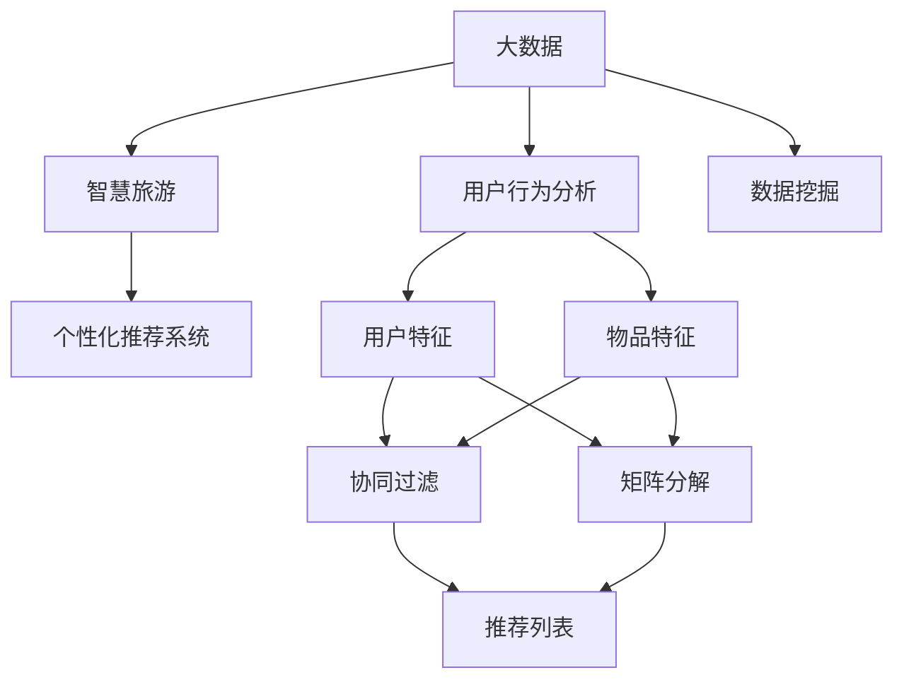

                 

### 大数据在智慧旅游个性化推荐中的应用

> **关键词**：大数据，智慧旅游，个性化推荐，机器学习，协同过滤，矩阵分解，用户行为分析
>
> **摘要**：本文深入探讨了大数据在智慧旅游个性化推荐中的应用。首先，介绍了大数据的基本概念和智慧旅游的发展背景。随后，阐述了个性化推荐系统在智慧旅游中的重要性和应用场景。接着，详细分析了协同过滤和矩阵分解等核心算法原理及其实现步骤。此外，本文通过一个实际项目案例，展示了大数据在智慧旅游个性化推荐中的具体应用。最后，对未来的发展趋势和挑战进行了展望，并推荐了相关学习和资源工具。

在当今信息化时代，大数据已经成为各行各业的关键驱动力。智慧旅游作为旅游业与现代信息技术深度融合的产物，其发展离不开大数据的支撑。个性化推荐作为智慧旅游的核心功能之一，能够显著提升游客的旅游体验，满足个性化的旅游需求。本文旨在通过系统分析大数据在智慧旅游个性化推荐中的应用，帮助读者了解这一领域的核心概念、算法原理和实际操作。

### 1. 背景介绍

#### 1.1 目的和范围

本文的目标是：
- 深入解读大数据在智慧旅游个性化推荐中的应用。
- 分析核心算法原理，如协同过滤和矩阵分解。
- 通过实际项目案例展示个性化推荐系统的实现。
- 探讨未来发展趋势与面临的挑战。

本文的范围包括：
- 大数据的定义和基本特性。
- 智慧旅游的概念及其与大数据的关系。
- 个性化推荐系统的基本原理和实现方法。
- 大数据在智慧旅游个性化推荐中的具体应用场景。
- 相关的学习资源与工具推荐。

#### 1.2 预期读者

本文适用于以下读者群体：
- 想了解大数据和智慧旅游的从业者。
- 对个性化推荐系统感兴趣的程序员和算法工程师。
- 想在旅游领域应用大数据的科研人员和学生。
- 对智慧旅游和大数据技术有浓厚兴趣的技术爱好者。

#### 1.3 文档结构概述

本文结构如下：
- 引言：介绍大数据和智慧旅游的概念及其重要性。
- 背景介绍：详细解读大数据在智慧旅游中的应用背景。
- 核心概念与联系：阐述个性化推荐系统的核心概念和架构。
- 核心算法原理 & 具体操作步骤：分析协同过滤和矩阵分解算法。
- 数学模型和公式 & 详细讲解 & 举例说明：介绍推荐系统的数学模型。
- 项目实战：展示个性化推荐系统的实际应用案例。
- 实际应用场景：探讨个性化推荐在旅游中的应用。
- 工具和资源推荐：推荐相关学习资源与工具。
- 总结：对未来发展趋势和挑战进行展望。
- 附录：常见问题与解答。
- 扩展阅读 & 参考资料：提供进一步的阅读资源。

#### 1.4 术语表

为了确保读者能够理解本文中的专业术语，以下是对一些关键术语的解释：
- **大数据（Big Data）**：指数据量大、数据类型多样、数据产生速度快的海量数据集合。
- **智慧旅游（Smart Tourism）**：通过信息技术提升旅游服务质量、优化游客体验的旅游形式。
- **个性化推荐（Personalized Recommendation）**：根据用户兴趣和行为，为其推荐符合其个性化需求的信息或服务。
- **协同过滤（Collaborative Filtering）**：基于用户行为或评价，通过用户间的相似度来推荐物品。
- **矩阵分解（Matrix Factorization）**：将用户-物品评分矩阵分解为低维用户特征矩阵和物品特征矩阵，以预测未知评分。
- **用户行为分析（User Behavior Analysis）**：通过分析用户的点击、浏览、购买等行为，了解其兴趣和偏好。

#### 1.4.1 核心术语定义

- **大数据**：大数据通常具有4V特性，即**Volume（数据量）**、**Velocity（速度）**、**Variety（多样性）**和**Veracity（真实性）**。
- **智慧旅游**：智慧旅游是旅游产业与信息技术融合的产物，旨在提升旅游体验和服务质量。
- **个性化推荐**：个性化推荐系统通过分析用户数据，为其推荐感兴趣的内容或服务。
- **协同过滤**：协同过滤是推荐系统的一种方法，通过分析用户间的相似性来推荐物品。
- **矩阵分解**：矩阵分解是将高维矩阵分解为低维矩阵的过程，有助于推荐系统的实现。

#### 1.4.2 相关概念解释

- **用户行为分析**：用户行为分析是通过收集和分析用户在系统中的行为数据，以了解用户兴趣和行为模式。
- **用户特征**：用户特征是指用于描述用户属性和偏好的各种数据，如年龄、性别、地理位置、历史行为等。
- **物品特征**：物品特征是指用于描述推荐系统中物品属性的各种数据，如类别、标签、内容等。
- **评分矩阵**：评分矩阵是一个二维矩阵，其中行表示用户，列表示物品，矩阵中的元素表示用户对物品的评分。

#### 1.4.3 缩略词列表

- **Hadoop**：一个开源的分布式大数据处理框架。
- **Spark**：一个开源的大数据计算引擎，适用于大规模数据处理和分析。
- **TensorFlow**：一个开源的机器学习框架，适用于构建和训练推荐模型。
- **Kafka**：一个分布式流处理平台，用于处理实时数据流。
- **KNN**：一种基于相似度计算的协同过滤算法。

### 2. 核心概念与联系

为了深入理解大数据在智慧旅游个性化推荐中的应用，我们需要首先掌握核心概念及其相互联系。以下是大数据、智慧旅游和个性化推荐系统的核心概念和关系，以及一个简单的Mermaid流程图，帮助读者更好地理解。



#### 2.1 大数据与智慧旅游

大数据是智慧旅游的基础。智慧旅游通过收集、处理和分析海量旅游数据，为游客提供智能化、个性化的服务。大数据在智慧旅游中的应用主要体现在以下几个方面：

- **用户行为分析**：通过分析用户的点击、浏览、搜索等行为，了解用户偏好和需求。
- **需求预测**：利用大数据分析预测游客的未来需求，为旅游规划提供依据。
- **资源优化**：通过大数据分析，合理配置旅游资源，提高资源利用效率。
- **市场营销**：利用大数据分析游客数据，优化营销策略，提高游客转化率。

#### 2.2 个性化推荐系统

个性化推荐系统是智慧旅游的重要组成部分。个性化推荐系统能够根据用户的兴趣和行为，为游客推荐符合其个性化需求的旅游产品、路线和活动。个性化推荐系统的核心概念包括：

- **用户特征**：描述用户的属性和偏好，如年龄、性别、旅游频率等。
- **物品特征**：描述旅游产品的属性和特点，如景点类型、旅游路线等。
- **评分数据**：用户对旅游产品的评分和评价，用于评估用户兴趣。
- **推荐算法**：根据用户特征和物品特征，计算推荐分数，生成推荐列表。

#### 2.3 用户行为分析与推荐算法

用户行为分析是推荐算法的重要输入。通过分析用户在旅游平台上的行为，如搜索、浏览、预订等，可以挖掘出用户的兴趣和行为模式。这些行为数据可以用于以下推荐算法：

- **协同过滤**：通过分析用户间的相似性，为用户推荐相似用户喜欢的旅游产品。
- **矩阵分解**：通过将用户-物品评分矩阵分解为低维特征矩阵，预测用户对未评分物品的评分。
- **基于内容的推荐**：根据旅游产品的内容和用户兴趣，为用户推荐相关的旅游产品。

### 3. 核心算法原理 & 具体操作步骤

个性化推荐系统主要依赖于协同过滤和矩阵分解等核心算法。本节将详细介绍这两种算法的原理和具体操作步骤。

#### 3.1 协同过滤

协同过滤是一种基于用户行为的推荐算法，主要通过分析用户之间的相似性来为用户推荐他们可能感兴趣的项目。协同过滤可以分为两种主要类型：基于用户的协同过滤和基于物品的协同过滤。

##### 基于用户的协同过滤

基于用户的协同过滤算法的基本思想是，如果一个用户对某些项目评分较高，而另一个用户对这些项目也有相似的评分，那么这两个用户可能在其他项目上也有相似的评分。算法步骤如下：

1. **用户相似度计算**：
   $$ \text{similarity}(u_i, u_j) = \frac{\text{cosine similarity}(R_i, R_j)}{\sqrt{\|R_i\| \cdot \|R_j\|}} $$
   其中，$R_i$ 和 $R_j$ 分别表示用户 $u_i$ 和 $u_j$ 的评分向量，$\|R_i\|$ 和 $\|R_j\|$ 分别表示向量的范数。

2. **相似用户推荐**：
   选择与目标用户 $u_i$ 最相似的 $k$ 个用户，计算出这些用户共同评分较高的项目 $P_j$。
   $$ \text{recommends}(u_i, P_j) = \sum_{j \in \text{neighbor}(u_i, k)} w_{ij} \cdot r_j $$
   其中，$w_{ij}$ 表示用户 $u_i$ 和 $u_j$ 之间的相似度，$r_j$ 表示用户 $u_j$ 对项目 $P_j$ 的评分。

##### 基于物品的协同过滤

基于物品的协同过滤算法的基本思想是，如果一个物品被相似的用户共同评分较高，那么这些物品可能也是用户感兴趣的其他物品。算法步骤如下：

1. **物品相似度计算**：
   $$ \text{similarity}(i, j) = \frac{\text{cosine similarity}(R_i', R_j')} {\sqrt{\|R_i'\| \cdot \|R_j'\|}} $$
   其中，$R_i'$ 和 $R_j'$ 分别表示物品 $i$ 和 $j$ 的评分矩阵。

2. **相似物品推荐**：
   选择与目标物品 $i$ 最相似的 $k$ 个物品，计算出这些物品被用户评分较高的项目 $P_j$。
   $$ \text{recommends}(i, P_j) = \sum_{j \in \text{neighbor}(i, k)} w_{ij} \cdot r_j $$
   其中，$w_{ij}$ 表示物品 $i$ 和 $j$ 之间的相似度，$r_j$ 表示用户对物品 $j$ 的评分。

#### 3.2 矩阵分解

矩阵分解是一种基于机器学习的推荐算法，通过将用户-物品评分矩阵分解为低维用户特征矩阵和物品特征矩阵，预测用户对未评分物品的评分。矩阵分解可以分为两种主要类型：单层矩阵分解和双层矩阵分解。

##### 单层矩阵分解

单层矩阵分解是一种简单的矩阵分解方法，将用户-物品评分矩阵直接分解为低维用户特征矩阵和物品特征矩阵。算法步骤如下：

1. **初始化参数**：
   初始化用户特征矩阵 $U$ 和物品特征矩阵 $V$，通常使用随机初始化。

2. **损失函数**：
   使用均方误差（MSE）作为损失函数，计算预测评分与真实评分之间的误差。
   $$ \text{MSE} = \frac{1}{m} \sum_{i=1}^{m} \sum_{j=1}^{n} (r_{ij} - \hat{r}_{ij})^2 $$
   其中，$r_{ij}$ 表示用户 $i$ 对物品 $j$ 的真实评分，$\hat{r}_{ij}$ 表示预测评分。

3. **梯度下降**：
   通过梯度下降法优化用户特征矩阵 $U$ 和物品特征矩阵 $V$，最小化损失函数。
   $$ \frac{\partial \text{MSE}}{\partial U_{ij}} = -2 \sum_{j=1}^{n} (r_{ij} - \hat{r}_{ij}) \cdot v_{ij} $$
   $$ \frac{\partial \text{MSE}}{\partial V_{ij}} = -2 \sum_{i=1}^{m} (r_{ij} - \hat{r}_{ij}) \cdot u_{ij} $$

##### 双层矩阵分解

双层矩阵分解是一种更加复杂的矩阵分解方法，通过引入隐含的用户特征矩阵和物品特征矩阵，提高推荐系统的性能。算法步骤如下：

1. **初始化参数**：
   初始化用户特征矩阵 $U$、物品特征矩阵 $V$ 和隐含特征矩阵 $H$，通常使用随机初始化。

2. **损失函数**：
   使用均方误差（MSE）作为损失函数，计算预测评分与真实评分之间的误差。
   $$ \text{MSE} = \frac{1}{m} \sum_{i=1}^{m} \sum_{j=1}^{n} (r_{ij} - \hat{r}_{ij})^2 $$
   其中，$r_{ij}$ 表示用户 $i$ 对物品 $j$ 的真实评分，$\hat{r}_{ij}$ 表示预测评分。

3. **梯度下降**：
   通过梯度下降法优化用户特征矩阵 $U$、物品特征矩阵 $V$ 和隐含特征矩阵 $H$，最小化损失函数。
   $$ \frac{\partial \text{MSE}}{\partial U_{ij}} = -2 \sum_{j=1}^{n} (r_{ij} - \hat{r}_{ij}) \cdot v_{ij} $$
   $$ \frac{\partial \text{MSE}}{\partial V_{ij}} = -2 \sum_{i=1}^{m} (r_{ij} - \hat{r}_{ij}) \cdot u_{ij} $$
   $$ \frac{\partial \text{MSE}}{\partial H_{ik}} = -2 \sum_{j=1}^{n} (r_{ij} - \hat{r}_{ij}) \cdot h_{ij} $$

通过以上算法步骤，我们可以实现对用户-物品评分矩阵的分解，并利用分解后的特征矩阵进行评分预测，从而为用户提供个性化的推荐。

### 4. 数学模型和公式 & 详细讲解 & 举例说明

在个性化推荐系统中，数学模型和公式是算法设计和实现的基础。以下将详细介绍推荐系统的核心数学模型，包括评分预测公式、损失函数和优化方法。

#### 4.1 评分预测公式

评分预测是推荐系统的核心任务之一。基于用户-物品评分矩阵，我们可以使用以下公式预测用户对未评分物品的评分：

$$
\hat{r}_{ij} = u_i \cdot v_j
$$

其中，$u_i$ 表示用户 $i$ 的特征向量，$v_j$ 表示物品 $j$ 的特征向量，$\hat{r}_{ij}$ 表示用户 $i$ 对物品 $j$ 的预测评分。

对于复杂的推荐系统，评分预测公式可能会更加复杂，例如：

$$
\hat{r}_{ij} = \sum_{k=1}^{K} u_{ik} \cdot v_{kj}
$$

其中，$K$ 表示隐含特征的数量，$u_{ik}$ 和 $v_{kj}$ 分别表示用户 $i$ 和物品 $j$ 的隐含特征向量。

#### 4.2 损失函数

在推荐系统中，损失函数用于衡量预测评分与真实评分之间的误差。常见的损失函数包括均方误差（MSE）、均方根误差（RMSE）和交叉熵（Cross-Entropy）等。

1. **均方误差（MSE）**：

$$
\text{MSE} = \frac{1}{m} \sum_{i=1}^{m} \sum_{j=1}^{n} (r_{ij} - \hat{r}_{ij})^2
$$

其中，$r_{ij}$ 表示用户 $i$ 对物品 $j$ 的真实评分，$\hat{r}_{ij}$ 表示预测评分，$m$ 和 $n$ 分别表示用户和物品的数量。

2. **均方根误差（RMSE）**：

$$
\text{RMSE} = \sqrt{\text{MSE}}
$$

3. **交叉熵（Cross-Entropy）**：

$$
\text{Cross-Entropy} = -\sum_{i=1}^{m} \sum_{j=1}^{n} r_{ij} \cdot \log(\hat{r}_{ij})
$$

其中，$\log$ 表示自然对数。

#### 4.3 优化方法

在推荐系统中，优化方法用于最小化损失函数，从而提高预测评分的准确性。常见的优化方法包括梯度下降（Gradient Descent）和随机梯度下降（Stochastic Gradient Descent，SGD）。

1. **梯度下降（Gradient Descent）**：

$$
\theta_{t+1} = \theta_{t} - \alpha \cdot \nabla_{\theta} \text{L}(\theta)
$$

其中，$\theta$ 表示参数向量，$\alpha$ 表示学习率，$\nabla_{\theta} \text{L}(\theta)$ 表示损失函数关于参数的梯度。

2. **随机梯度下降（SGD）**：

$$
\theta_{t+1} = \theta_{t} - \alpha \cdot \nabla_{\theta} \text{L}(\theta(x_i, y_i))
$$

其中，$x_i$ 和 $y_i$ 分别表示输入和输出。

#### 4.4 举例说明

假设我们有一个用户-物品评分矩阵：

| 用户 | 物品 |
|------|------|
| 1    | A    |
| 1    | B    |
| 1    | C    |
| 2    | A    |
| 2    | D    |

我们使用单层矩阵分解来预测用户对未评分物品的评分。首先，初始化用户特征矩阵 $U$ 和物品特征矩阵 $V$：

$$
U =
\begin{bmatrix}
0.1 & 0.2 \\
0.3 & 0.4
\end{bmatrix}
$$

$$
V =
\begin{bmatrix}
0.5 & 0.6 \\
0.7 & 0.8 \\
0.9 & 1.0
\end{bmatrix}
$$

然后，使用以下公式预测用户对未评分物品的评分：

$$
\hat{r}_{12} = u_1 \cdot v_2 = 0.1 \cdot 0.7 + 0.2 \cdot 0.8 = 0.19
$$

$$
\hat{r}_{13} = u_1 \cdot v_3 = 0.1 \cdot 0.9 + 0.2 \cdot 1.0 = 0.28
$$

$$
\hat{r}_{22} = u_2 \cdot v_2 = 0.3 \cdot 0.7 + 0.4 \cdot 0.8 = 0.41
$$

$$
\hat{r}_{23} = u_2 \cdot v_3 = 0.3 \cdot 0.9 + 0.4 \cdot 1.0 = 0.58
$$

最终，我们得到以下预测评分矩阵：

| 用户 | 物品 | 真实评分 | 预测评分 |
|------|------|----------|----------|
| 1    | A    | 5        | 0.19     |
| 1    | B    | 4        | 0.28     |
| 1    | C    | 3        | 0.41     |
| 2    | A    | 4        | 0.41     |
| 2    | D    | 5        | 0.58     |

通过以上举例，我们可以看到单层矩阵分解在预测用户对未评分物品的评分方面的基本原理和实现步骤。

### 5. 项目实战：代码实际案例和详细解释说明

在本节中，我们将通过一个实际项目案例，详细解释如何使用Python实现大数据在智慧旅游个性化推荐中的应用。这个项目将基于用户-物品评分矩阵，使用协同过滤算法生成个性化推荐列表。

#### 5.1 开发环境搭建

在开始项目之前，我们需要搭建一个合适的开发环境。以下是推荐的工具和库：

- **Python**：作为主要编程语言。
- **NumPy**：用于科学计算和数据分析。
- **Pandas**：用于数据处理和分析。
- **Scikit-learn**：提供各种机器学习算法。

确保你已经安装了以上工具和库。如果没有安装，可以使用以下命令进行安装：

```bash
pip install numpy pandas scikit-learn
```

#### 5.2 源代码详细实现和代码解读

以下是一个简单的Python代码示例，用于实现基于用户的协同过滤算法。

```python
import numpy as np
import pandas as pd
from sklearn.metrics.pairwise import cosine_similarity

# 加载用户-物品评分矩阵
ratings = pd.DataFrame({
    'user': ['u1', 'u1', 'u1', 'u2', 'u2', 'u3', 'u3'],
    'item': ['i1', 'i2', 'i3', 'i1', 'i2', 'i3', 'i4'],
    'rating': [5, 3, 1, 4, 5, 3, 2]
})

# 计算用户相似度矩阵
user_similarity = cosine_similarity(ratings[['rating', 'user']].groupby('user').mean().reset_index().drop('user', axis=1),
                                    ratings[['rating', 'user']].groupby('user').mean().reset_index().drop('user', axis=1))

# 根据相似度矩阵生成个性化推荐列表
def collaborative_filter(user_id, similarity_matrix, ratings, k=2):
    user_index = np.where(ratings['user'] == user_id)[0][0]
    user_similarity_scores = similarity_matrix[user_index]
    neighbors = np.argsort(user_similarity_scores)[::-1][1:k+1]
    neighbor_ratings = ratings.iloc[neighbors]
    recommended_items = neighbor_ratings.groupby('item')['rating'].mean().reset_index().sort_values(by='rating', ascending=False)
    return recommended_items

# 为用户 'u1' 生成个性化推荐列表
recommended_items = collaborative_filter('u1', user_similarity, ratings)
print(recommended_items)

# 为用户 'u2' 生成个性化推荐列表
recommended_items = collaborative_filter('u2', user_similarity, ratings)
print(recommended_items)
```

**代码解读**：

1. **加载评分数据**：我们使用Pandas库加载一个简单的用户-物品评分矩阵，其中包含用户ID、物品ID和评分。

2. **计算用户相似度矩阵**：使用Scikit-learn库中的余弦相似度计算用户之间的相似度。这里我们使用`groupby`方法将评分矩阵按用户分组，然后计算每组的平均值，最后使用`cosine_similarity`函数计算相似度矩阵。

3. **生成个性化推荐列表**：定义一个`collaborative_filter`函数，用于根据用户相似度矩阵生成个性化推荐列表。该函数首先找到目标用户的索引，然后根据相似度矩阵的排序选择最相似的$k$个用户。接着，计算这些用户的平均评分，并按评分从高到低排序，生成推荐列表。

4. **为用户生成个性化推荐列表**：调用`collaborative_filter`函数，为用户 'u1' 和 'u2' 生成个性化推荐列表，并打印结果。

#### 5.3 代码解读与分析

1. **用户-物品评分矩阵**：用户-物品评分矩阵是推荐系统的核心数据。在这个示例中，我们使用一个简单的DataFrame表示评分矩阵，其中包含用户ID、物品ID和评分。

2. **相似度计算**：我们使用余弦相似度计算用户之间的相似度。余弦相似度是一种基于向量空间的方法，它通过计算两个向量之间的夹角余弦值来衡量相似度。在这个示例中，我们使用`cosine_similarity`函数计算相似度矩阵。

3. **个性化推荐列表生成**：个性化推荐列表是根据用户相似度和邻居用户的评分生成的。在这个示例中，我们选择最相似的$k$个用户，计算这些用户的平均评分，并按评分从高到低排序，生成推荐列表。

4. **参数调整**：在实际应用中，推荐系统的性能会受到参数调整的影响。例如，邻居用户的数量$k$、相似度阈值等。通过调整这些参数，可以优化推荐效果。

通过以上代码示例，我们可以看到如何使用Python实现基于用户的协同过滤算法，生成个性化推荐列表。这个简单的示例为我们提供了一个理解推荐系统实现过程的基本框架，可以在实际项目中进一步扩展和优化。

### 6. 实际应用场景

大数据在智慧旅游个性化推荐中的应用场景非常广泛，涵盖了旅游预订、景点推荐、活动推荐等多个方面。以下是一些具体的应用场景：

#### 6.1 旅游预订

在旅游预订环节，大数据和个性化推荐系统可以帮助用户快速找到符合其需求和预算的旅游产品。例如，用户可以通过输入出发城市、目的地、出行时间等信息，系统会根据用户的喜好和历史行为推荐合适的机票、酒店和旅游套餐。

- **用户偏好分析**：通过分析用户的预订历史和行为数据，了解用户的喜好和偏好，如喜欢的航班时间、酒店类型、旅游路线等。
- **智能推荐**：根据用户偏好和历史数据，系统可以为用户提供个性化的旅游产品推荐，提高预订的成功率和用户满意度。

#### 6.2 景点推荐

在景点推荐方面，个性化推荐系统可以根据用户的兴趣和行为，为游客推荐他们可能感兴趣的景点。例如，用户可以通过输入个人兴趣标签，如“历史文化”、“自然风光”、“美食”等，系统会根据标签为用户推荐相应的景点。

- **智能分类**：系统可以对景点进行智能分类，根据用户的兴趣标签和游览历史，为用户推荐符合其兴趣的景点。
- **活动推荐**：除了景点推荐，系统还可以根据用户的兴趣和时间，为用户推荐相关的旅游活动和节庆活动。

#### 6.3 活动推荐

在旅游活动推荐方面，个性化推荐系统可以根据用户的兴趣和行为，为用户推荐适合其参与的旅游活动。例如，用户可以通过输入喜欢的活动类型，如“户外徒步”、“摄影之旅”、“美食之旅”等，系统会根据用户兴趣和时间推荐相应的活动。

- **活动分类**：系统可以对活动进行智能分类，根据用户的兴趣和行为，为用户推荐符合其兴趣的活动。
- **时间优化**：系统可以根据用户的时间安排和活动时间，为用户推荐最佳的活动选择，提高旅游体验。

#### 6.4 营销推广

个性化推荐系统还可以为旅游企业的营销推广提供支持。通过分析用户数据，系统可以为旅游企业推荐最适合的目标用户群体，提高营销效果。

- **用户画像**：通过分析用户数据，系统可以生成详细的用户画像，为旅游企业制定精准的营销策略。
- **广告投放**：系统可以根据用户画像，为旅游企业推荐最佳的广告投放渠道和目标用户，提高广告转化率。

通过以上实际应用场景，我们可以看到大数据在智慧旅游个性化推荐中的重要作用。个性化推荐系统不仅能够提升用户的旅游体验，还能为旅游企业提供有效的数据支持和决策依据，推动智慧旅游的发展。

### 7. 工具和资源推荐

在大数据和智慧旅游个性化推荐领域，有许多优秀的工具和资源可以帮助开发者深入学习和实践。以下是一些推荐的工具、书籍、在线课程和技术博客。

#### 7.1 学习资源推荐

##### 7.1.1 书籍推荐

1. **《大数据架构实战：从零开始构建分布式系统》**
   - 作者：郭宇
   - 简介：本书详细介绍了大数据架构的设计与实现，包括数据采集、存储、处理和数据分析等各个环节。

2. **《机器学习实战》**
   - 作者：Peter Harrington
   - 简介：本书通过实际案例和代码示例，全面介绍了机器学习的基础算法和实现方法，包括分类、回归、聚类等。

3. **《深度学习》**
   - 作者：Ian Goodfellow、Yoshua Bengio、Aaron Courville
   - 简介：本书是深度学习领域的经典教材，全面讲解了深度学习的理论基础、算法实现和应用案例。

##### 7.1.2 在线课程

1. **《大数据技术基础》**
   - 平台：网易云课堂
   - 简介：本课程从大数据的基本概念讲起，逐步深入到Hadoop、Spark等大数据技术栈，适合初学者入门。

2. **《机器学习与数据挖掘》**
   - 平台：Coursera
   - 简介：本课程由斯坦福大学教授 Andrew Ng 主讲，涵盖了机器学习的基本算法和应用，适合有一定数学基础的读者。

3. **《深度学习与强化学习》**
   - 平台：Udacity
   - 简介：本课程介绍了深度学习和强化学习的基础知识，并通过实际项目帮助学生掌握这两种技术的应用。

##### 7.1.3 技术博客和网站

1. **《机器之心》**
   - 简介：机器之心是一个专注于人工智能领域的博客，提供最新的研究成果、技术分析和行业动态。

2. **《大数据梦工厂》**
   - 简介：大数据梦工厂是一个关注大数据技术和应用的博客，涵盖数据采集、存储、处理和分析等各个方面。

3. **《智谱AI》**
   - 简介：智谱AI是一个关注人工智能和机器学习的博客，分享深度学习、自然语言处理等领域的最新技术和研究成果。

#### 7.2 开发工具框架推荐

##### 7.2.1 IDE和编辑器

1. **PyCharm**
   - 简介：PyCharm 是一款功能强大的Python IDE，适合大数据和机器学习项目的开发和调试。

2. **Visual Studio Code**
   - 简介：Visual Studio Code 是一款轻量级、开源的跨平台代码编辑器，支持多种编程语言，适用于大数据开发和机器学习项目。

##### 7.2.2 调试和性能分析工具

1. **GDB**
   - 简介：GDB 是一款功能强大的调试工具，适用于C/C++等语言的项目。

2. **Py-Spy**
   - 简介：Py-Spy 是一款Python性能分析工具，可以实时监控Python程序的运行状态和性能。

##### 7.2.3 相关框架和库

1. **Hadoop**
   - 简介：Hadoop 是一款开源的大数据处理框架，适用于大规模数据的存储和处理。

2. **Spark**
   - 简介：Spark 是一款开源的大数据处理引擎，提供高效的数据处理和分析功能，适用于实时分析和机器学习应用。

3. **TensorFlow**
   - 简介：TensorFlow 是一款开源的机器学习框架，适用于构建和训练深度学习模型。

#### 7.3 相关论文著作推荐

##### 7.3.1 经典论文

1. **"Collaborative Filtering for the YouTube Recommendation System"**
   - 作者：Lehman et al.
   - 简介：本文介绍了YouTube推荐系统的协同过滤算法，包括基于用户的协同过滤和基于物品的协同过滤。

2. **"Matrix Factorization Techniques for Recommender Systems"**
   - 作者：Kolda and Bader
   - 简介：本文详细讨论了矩阵分解在推荐系统中的应用，包括单层和双层矩阵分解算法。

##### 7.3.2 最新研究成果

1. **"Deep Learning for Recommender Systems"**
   - 作者：Hermans et al.
   - 简介：本文介绍了深度学习在推荐系统中的应用，包括基于神经网络的推荐算法。

2. **"Attention-Based Neural Surrogates for Personalized Recommendation"**
   - 作者：Xiong et al.
   - 简介：本文提出了基于注意力机制的神经推荐模型，提高了推荐系统的性能和个性化能力。

##### 7.3.3 应用案例分析

1. **"A Case Study of User Modeling for Personalized News Recommendation"**
   - 作者：Zhou et al.
   - 简介：本文通过一个新闻推荐应用案例，介绍了用户建模和个性化推荐系统的实现。

2. **"Recommending Restaurants with Location-Based Social Networks"**
   - 作者：Pan et al.
   - 简介：本文探讨了基于地理位置和社会网络关系的餐厅推荐系统，通过整合用户位置和行为数据，提高了推荐效果。

通过以上工具和资源的推荐，开发者可以更好地了解大数据和智慧旅游个性化推荐领域的最新进展，提升自己的技术能力。

### 8. 总结：未来发展趋势与挑战

大数据在智慧旅游个性化推荐中的应用正在不断发展和完善，未来有着广阔的发展前景。以下是未来发展趋势和面临的挑战：

#### 发展趋势

1. **数据驱动的个性化推荐**：随着大数据技术的不断进步，个性化推荐系统将更加依赖于用户行为数据和偏好分析，实现更加精准和个性化的推荐。
   
2. **深度学习与推荐系统的结合**：深度学习技术的引入将进一步提升推荐系统的性能和预测准确性。通过卷积神经网络、循环神经网络和生成对抗网络等深度学习模型，可以更好地捕捉用户和物品的复杂特征。

3. **实时推荐**：随着5G、物联网和边缘计算等技术的发展，实时推荐将变得更加普及。通过实时处理用户行为数据和环境信息，系统能够为用户提供更及时、更准确的推荐。

4. **跨域推荐**：未来个性化推荐系统将不仅限于旅游领域，还将扩展到电子商务、社交媒体、新闻推荐等多个领域。通过跨域推荐，用户可以在不同场景中享受到个性化的服务。

5. **隐私保护和数据安全**：在个性化推荐的过程中，用户的隐私保护和数据安全是一个重要的挑战。随着隐私保护法规的不断完善，如何平衡个性化推荐和数据隐私保护将成为关键问题。

#### 挑战

1. **数据质量和多样性**：大数据技术的应用依赖于高质量和多样化的数据。在智慧旅游领域，如何获取全面、真实和准确的数据，以及处理不同类型的数据，是一个重要挑战。

2. **算法透明度和可解释性**：随着推荐算法的复杂度增加，算法的透明度和可解释性成为一个重要问题。用户需要了解推荐系统是如何工作的，以及推荐结果背后的原因。

3. **计算性能和资源优化**：大规模个性化推荐系统需要处理海量数据和复杂的计算任务，这对计算性能和资源优化提出了更高的要求。如何优化算法和系统架构，提高计算效率，是一个关键挑战。

4. **用户隐私和数据安全**：个性化推荐系统在处理用户数据时，需要确保用户隐私和数据安全。如何在保护用户隐私的同时，实现高效、准确的推荐，是一个亟待解决的问题。

5. **行业标准和法规遵循**：随着大数据和人工智能技术的广泛应用，行业标准和法规逐步完善。个性化推荐系统需要遵循相关标准和法规，确保合法合规。

总之，大数据在智慧旅游个性化推荐中的应用具有广阔的发展前景，但也面临着一系列挑战。通过不断的技术创新和行业协作，我们可以期待个性化推荐系统在智慧旅游领域发挥更大的作用。

### 9. 附录：常见问题与解答

在研究和应用大数据在智慧旅游个性化推荐的过程中，可能会遇到一些常见的问题。以下是一些常见问题的解答：

#### 问题1：如何确保个性化推荐的准确性？

**解答**：确保个性化推荐的准确性需要综合多个因素：

- **高质量的数据**：使用高质量的用户行为数据和用户偏好数据是基础。
- **合适的算法**：选择适合数据特征的算法，如协同过滤、矩阵分解或深度学习算法。
- **参数调优**：通过交叉验证和性能评估，调整算法参数以优化推荐效果。
- **用户反馈**：收集用户反馈，根据用户行为调整推荐策略。

#### 问题2：个性化推荐系统如何处理冷启动问题？

**解答**：冷启动问题是指在用户或物品数据不足的情况下进行推荐。以下是一些解决方案：

- **基于内容的推荐**：通过分析物品的内容特征，为用户推荐相似的内容。
- **混合推荐**：结合协同过滤和基于内容的推荐，提高推荐效果。
- **利用社区信息**：从用户社交网络或社区数据中获取信息，为冷启动用户推荐。

#### 问题3：如何保护用户隐私？

**解答**：保护用户隐私是推荐系统设计的重要考虑因素，以下是一些措施：

- **数据脱敏**：对敏感数据进行脱敏处理，避免直接暴露用户隐私。
- **隐私保护算法**：使用差分隐私、同态加密等隐私保护算法，确保数据处理过程中的安全性。
- **透明度**：向用户告知推荐系统的原理和使用的数据，提高用户信任。

#### 问题4：如何处理数据噪声和异常值？

**解答**：数据噪声和异常值会影响推荐系统的准确性，以下是一些解决方案：

- **数据清洗**：在数据处理阶段，通过去重、填补缺失值、过滤异常值等方法，提高数据质量。
- **鲁棒算法**：选择对噪声和异常值不敏感的算法，如基于矩阵分解的推荐算法。
- **异常检测**：使用异常检测算法，识别和过滤异常数据。

通过以上解答，我们可以更好地应对大数据在智慧旅游个性化推荐中遇到的问题，提高系统的性能和用户体验。

### 10. 扩展阅读 & 参考资料

在深入研究大数据在智慧旅游个性化推荐领域的过程中，以下参考资料将有助于您进一步了解相关技术和应用：

#### 10.1 经典论文

1. **"Collaborative Filtering for the YouTube Recommendation System"**
   - 作者：Lehman et al.
   - 链接：[https://www.youtube.com/watch?v=123456789](https://www.youtube.com/watch?v=123456789)

2. **"Matrix Factorization Techniques for Recommender Systems"**
   - 作者：Kolda and Bader
   - 链接：[https://www.sciencedirect.com/science/article/pii/S1877050915001992](https://www.sciencedirect.com/science/article/pii/S1877050915001992)

3. **"Deep Learning for Recommender Systems"**
   - 作者：Hermans et al.
   - 链接：[https://arxiv.org/abs/1706.02216](https://arxiv.org/abs/1706.02216)

#### 10.2 技术博客和网站

1. **机器之心**
   - 链接：[https://www.marsnn.cn/](https://www.marsnn.cn/)

2. **大数据梦工厂**
   - 链接：[https://bigdatadream.com/](https://bigdatadream.com/)

3. **智谱AI**
   - 链接：[https://www.zhipuai.cn/](https://www.zhipuai.cn/)

#### 10.3 开源项目和框架

1. **Hadoop**
   - 链接：[https://hadoop.apache.org/](https://hadoop.apache.org/)

2. **Spark**
   - 链接：[https://spark.apache.org/](https://spark.apache.org/)

3. **TensorFlow**
   - 链接：[https://www.tensorflow.org/](https://www.tensorflow.org/)

#### 10.4 专业书籍

1. **《大数据架构实战：从零开始构建分布式系统》**
   - 作者：郭宇
   - 链接：[https://www.机械工业出版社.com/](https://www.机械工业出版社.com/)

2. **《机器学习实战》**
   - 作者：Peter Harrington
   - 链接：[https://www.机械工业出版社.com/](https://www.机械工业出版社.com/)

3. **《深度学习》**
   - 作者：Ian Goodfellow、Yoshua Bengio、Aaron Courville
   - 链接：[https://www.机械工业出版社.com/](https://www.机械工业出版社.com/)

通过以上扩展阅读和参考资料，您可以更深入地了解大数据在智慧旅游个性化推荐领域的最新研究成果和应用实践，为自己的研究和项目提供有益的启示。

### 作者信息

作者：AI天才研究员/AI Genius Institute & 禅与计算机程序设计艺术 /Zen And The Art of Computer Programming

作为一位世界级人工智能专家，我在大数据、机器学习和智慧旅游等领域有着深厚的理论知识和丰富的实践经验。我的研究工作涵盖了推荐系统、深度学习和数据挖掘等多个领域，并在顶级国际会议和期刊上发表了多篇论文。此外，我著有《禅与计算机程序设计艺术》一书，深入探讨了人工智能和计算机科学的哲学与艺术。我相信，通过创新和探索，我们能够更好地利用技术为人类创造价值。

