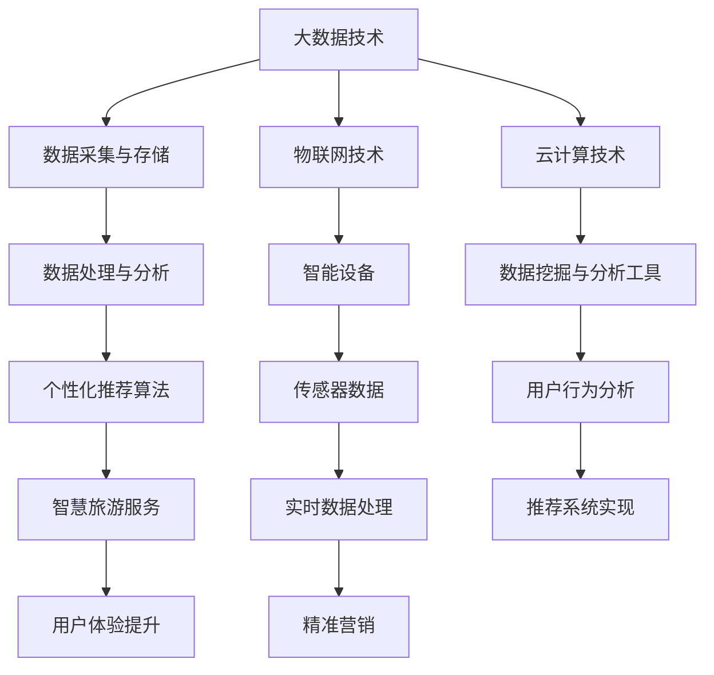
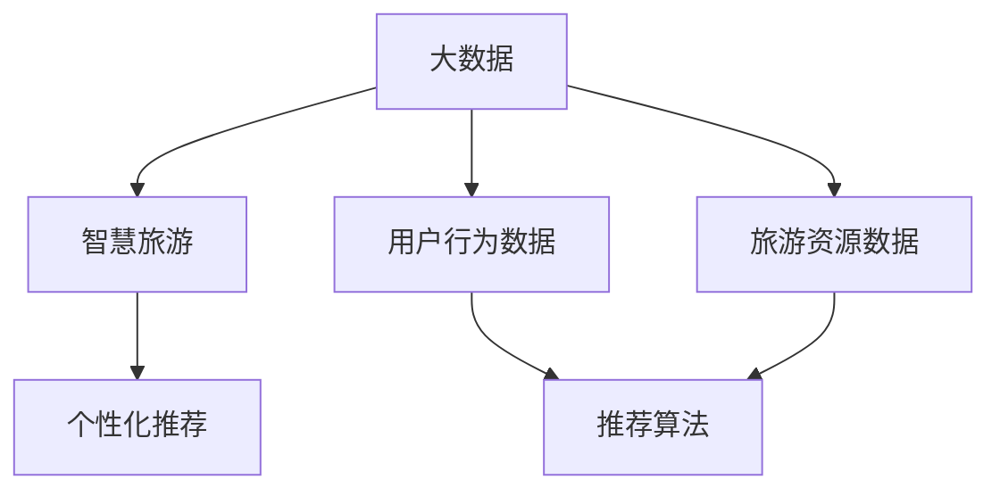

                 

# 大数据在智慧旅游服务中的应用与个性化推荐

> 关键词：大数据，智慧旅游，个性化推荐，算法原理，数学模型，项目实战

> 摘要：本文深入探讨了大数据在智慧旅游服务中的应用，重点介绍了个性化推荐算法的基本原理、数学模型以及实际操作步骤。通过案例分析和项目实战，本文展示了大数据如何助力智慧旅游，提升游客体验，并为旅游行业带来巨大价值。

## 1. 背景介绍

### 1.1 目的和范围

本文旨在探讨大数据在智慧旅游服务中的应用，重点关注个性化推荐系统的构建和实现。智慧旅游是指利用现代信息技术，如物联网、云计算、大数据等，对旅游资源进行智能化管理和运营，为游客提供个性化、智能化的旅游服务。随着大数据技术的发展，个性化推荐已成为智慧旅游中的重要应用，本文将详细解析其工作原理、数学模型和实现步骤。

### 1.2 预期读者

本文面向对大数据和个性化推荐有一定了解的读者，特别是从事智慧旅游服务开发的技术人员、数据科学家和研究人员。通过本文的阅读，读者将能够深入理解大数据在智慧旅游中的应用，掌握个性化推荐算法的原理和实践方法。

### 1.3 文档结构概述

本文分为十个部分，包括背景介绍、核心概念与联系、核心算法原理与具体操作步骤、数学模型与公式、项目实战、实际应用场景、工具和资源推荐、总结、常见问题与解答以及扩展阅读。结构清晰，便于读者按照需求进行阅读和学习。

### 1.4 术语表

#### 1.4.1 核心术语定义

- 大数据：指无法用传统数据处理工具在合理时间内完成处理的数据集。
- 个性化推荐：根据用户的兴趣和行为，为其推荐符合其需求的内容或服务。
- 智慧旅游：利用现代信息技术，对旅游资源进行智能化管理和运营，提升游客体验。
- 算法：解决问题的步骤和方法，用于处理数据并生成个性化推荐结果。

#### 1.4.2 相关概念解释

- 用户行为数据：用户在旅游平台上的浏览、搜索、购买等行为记录。
- 旅游资源：包括景点、酒店、美食、交通等旅游相关的信息和资源。
- 评估指标：用于评估推荐系统效果的一系列指标，如准确率、召回率、覆盖率等。

#### 1.4.3 缩略词列表

- 大数据（Big Data）
- 智慧旅游（Smart Tourism）
- 个性化推荐（Personalized Recommendation）

## 2. 核心概念与联系

大数据在智慧旅游中的应用涉及多个核心概念和联系。以下是这些概念和联系的 Mermaid 流程图：



### 2.1 大数据技术

大数据技术包括数据采集、存储、处理和分析等多个方面。数据采集主要通过传感器、移动设备、网站日志等方式获取用户行为数据和旅游资源数据。数据存储通常采用分布式存储系统，如 Hadoop、HDFS 等，以应对海量数据存储需求。数据处理和分析则依赖于数据挖掘与分析工具，如 Apache Spark、Python 等进行复杂的数据分析和模式识别。

### 2.2 数据采集与存储

数据采集与存储是大数据应用的基础。在智慧旅游中，数据来源主要包括用户行为数据、旅游资源数据、传感器数据等。用户行为数据包括浏览、搜索、购买等行为记录，旅游资源数据包括景点、酒店、美食、交通等信息，传感器数据则来自智能设备，如手机、智能手表等。这些数据需要通过分布式存储系统进行高效存储和管理。

### 2.3 数据处理与分析

数据处理与分析是大数据应用的核心。在智慧旅游中，通过对用户行为数据和旅游资源数据进行分析，可以挖掘用户兴趣、行为模式等关键信息，为个性化推荐提供数据支持。数据处理和分析工具包括 Apache Spark、Python 等，这些工具能够高效处理大规模数据，实现数据清洗、数据挖掘、机器学习等任务。

### 2.4 个性化推荐算法

个性化推荐算法是大数据在智慧旅游中的重要应用。通过分析用户行为数据和旅游资源数据，个性化推荐算法能够为用户推荐符合其兴趣的旅游服务。常见的个性化推荐算法包括协同过滤、基于内容的推荐、混合推荐等。这些算法通过计算用户与项目之间的相似度，生成个性化的推荐结果。

### 2.5 智慧旅游服务

智慧旅游服务是大数据应用的直接体现。通过个性化推荐算法，智慧旅游平台能够为用户提供定制化的旅游服务，提升用户体验。智慧旅游服务包括旅游规划、行程推荐、门票预订、住宿推荐等，这些服务基于用户兴趣和行为数据进行智能化决策。

### 2.6 用户体验提升

用户体验提升是智慧旅游服务的核心目标。通过大数据分析和个性化推荐，智慧旅游平台能够为用户提供个性化、智能化的旅游服务，满足用户个性化需求，提升用户体验。用户体验的提升不仅体现在旅游服务的便捷性、个性化上，还体现在旅游信息的实时更新和精准推送等方面。

## 3. 核心算法原理 & 具体操作步骤

个性化推荐算法是大数据在智慧旅游服务中的应用核心。本节将介绍两种常见的个性化推荐算法：协同过滤和基于内容的推荐。同时，将使用伪代码详细阐述这些算法的具体操作步骤。

### 3.1 协同过滤算法

协同过滤算法是一种基于用户行为数据的推荐算法，通过分析用户之间的相似度，为用户推荐其可能感兴趣的项目。协同过滤算法可分为基于用户的协同过滤（User-Based Collaborative Filtering，UBCF）和基于项目的协同过滤（Item-Based Collaborative Filtering，IBCF）。

#### 3.1.1 基于用户的协同过滤（UBCF）

伪代码：

```python
def UBCF(train_data, user, k):
    similar_users = []
    for u in train_data.users:
        if u != user:
            similarity = calculate_similarity(train_data, user, u)
            similar_users.append((u, similarity))
    similar_users.sort(key=lambda x: x[1], reverse=True)
    top_k_users = similar_users[:k]
    recommended_items = []
    for u, _ in top_k_users:
        recommended_items.extend(train_data[user].neighboring_items(u))
    return recommended_items
```

#### 3.1.2 基于项目的协同过滤（IBCF）

伪代码：

```python
def IBCF(train_data, user, k):
    similar_items = []
    for i in train_data.items:
        if i not in train_data[user]:
            similarity = calculate_similarity(train_data, user, i)
            similar_items.append((i, similarity))
    similar_items.sort(key=lambda x: x[1], reverse=True)
    top_k_items = similar_items[:k]
    recommended_users = []
    for i, _ in top_k_items:
        recommended_users.extend(train_data[i].neighboring_users(user))
    return recommended_users
```

### 3.2 基于内容的推荐算法

基于内容的推荐算法是一种基于项目特征数据的推荐算法，通过分析用户历史行为和项目特征，为用户推荐相似的项目。基于内容的推荐算法可分为基于项目的推荐（Item-Based Content-based Filtering，IBCF）和基于用户的推荐（User-Based Content-based Filtering，UBCF）。

#### 3.2.1 基于项目的推荐（IBCF）

伪代码：

```python
def IBCF_Content-Based(train_data, user, k):
    recommended_items = []
    for i in train_data.items:
        if i not in train_data[user]:
            similarity = calculate_similarity(train_data, user, i)
            if similarity > threshold:
                recommended_items.append(i)
    recommended_items.sort(key=lambda x: x[1], reverse=True)
    return recommended_items[:k]
```

#### 3.2.2 基于用户的推荐（UBCF）

伪代码：

```python
def UBCF_Content-Based(train_data, user, k):
    recommended_users = []
    for u in train_data.users:
        if u != user:
            similarity = calculate_similarity(train_data, user, u)
            if similarity > threshold:
                recommended_users.append(u)
    recommended_users.sort(key=lambda x: x[1], reverse=True)
    return recommended_users[:k]
```

### 3.3 混合推荐算法

混合推荐算法结合了协同过滤和基于内容的推荐算法的优点，通过融合不同算法的优势，提高推荐系统的效果。混合推荐算法可分为基于模型的混合推荐（Model-Based Hybrid Filtering，MBHF）和基于规则的混合推荐（Rule-Based Hybrid Filtering，RBHF）。

#### 3.3.1 基于模型的混合推荐（MBHF）

伪代码：

```python
def MBHF(train_data, user, k):
    ubcf_recommended_items = UBCF(train_data, user, k)
    ibcf_recommended_items = IBCF_Content-Based(train_data, user, k)
    hybrid_recommended_items = set(ubcf_recommended_items) | set.ibcf_recommended_items)
    return hybrid_recommended_items[:k]
```

#### 3.3.2 基于规则的混合推荐（RBHF）

伪代码：

```python
def RBHF(train_data, user, k):
    rules = define_rules(train_data)
    ubcf_recommended_items = UBCF(train_data, user, k)
    ibcf_recommended_items = IBCF_Content-Based(train_data, user, k)
    hybrid_recommended_items = []
    for item in ubcf_recommended_items:
        if any(rule(item) for rule in rules):
            hybrid_recommended_items.append(item)
    for item in ibcf_recommended_items:
        if any(rule(item) for rule in rules):
            hybrid_recommended_items.append(item)
    return hybrid_recommended_items[:k]
```

### 3.4 操作步骤

以下是使用个性化推荐算法构建推荐系统的具体操作步骤：

1. 数据预处理：清洗和整理用户行为数据和旅游资源数据，为推荐算法提供高质量的输入数据。
2. 选择推荐算法：根据业务需求和数据特点，选择合适的推荐算法，如协同过滤、基于内容的推荐或混合推荐算法。
3. 计算相似度：根据推荐算法，计算用户与用户、用户与项目、项目与项目之间的相似度。
4. 生成推荐列表：根据相似度计算结果，为用户生成个性化的推荐列表。
5. 评估推荐效果：使用评估指标（如准确率、召回率、覆盖率等）评估推荐系统的效果，并根据评估结果进行调整和优化。
6. 部署上线：将推荐系统部署到生产环境，为用户提供实时、个性化的推荐服务。

## 4. 数学模型和公式 & 详细讲解 & 举例说明

在个性化推荐算法中，数学模型和公式扮演着至关重要的角色。这些模型和公式用于计算用户与用户、用户与项目、项目与项目之间的相似度，生成个性化的推荐列表。以下将详细讲解常用的数学模型和公式，并给出举例说明。

### 4.1 相似度计算

相似度计算是推荐算法的核心。常用的相似度计算方法包括余弦相似度、皮尔逊相关系数等。

#### 4.1.1 余弦相似度

余弦相似度是一种基于向量空间模型的相似度计算方法，用于计算两个向量之间的角度余弦值。公式如下：

$$
similarity(u, v) = \frac{u \cdot v}{||u|| \cdot ||v||}
$$

其中，$u$ 和 $v$ 分别表示两个向量，$\cdot$ 表示点乘运算，$||u||$ 和 $||v||$ 分别表示向量的模长。

举例说明：

假设有两个用户 $u_1$ 和 $u_2$，其行为数据向量分别为 $u_1 = [1, 2, 3, 4, 5]$ 和 $u_2 = [2, 3, 4, 5, 6]$，则其相似度为：

$$
similarity(u_1, u_2) = \frac{1 \cdot 2 + 2 \cdot 3 + 3 \cdot 4 + 4 \cdot 5 + 5 \cdot 6}{\sqrt{1^2 + 2^2 + 3^2 + 4^2 + 5^2} \cdot \sqrt{2^2 + 3^2 + 4^2 + 5^2 + 6^2}} \approx 0.913
$$

#### 4.1.2 皮尔逊相关系数

皮尔逊相关系数是一种基于统计学的相似度计算方法，用于衡量两个变量之间的线性相关性。公式如下：

$$
correlation(u, v) = \frac{\sum_{i=1}^n (u_i - \bar{u}) (v_i - \bar{v})}{\sqrt{\sum_{i=1}^n (u_i - \bar{u})^2} \cdot \sqrt{\sum_{i=1}^n (v_i - \bar{v})^2}}
$$

其中，$u$ 和 $v$ 分别表示两个变量，$\bar{u}$ 和 $\bar{v}$ 分别表示变量 $u$ 和 $v$ 的平均值，$i$ 表示第 $i$ 个观测值。

举例说明：

假设有两个用户 $u_1$ 和 $u_2$，其行为数据向量分别为 $u_1 = [1, 2, 3, 4, 5]$ 和 $u_2 = [2, 3, 4, 5, 6]$，则其皮尔逊相关系数为：

$$
correlation(u_1, u_2) = \frac{(1 - 3)(2 - 4) + (2 - 3)(3 - 4) + (3 - 3)(4 - 4) + (4 - 3)(5 - 5) + (5 - 3)(6 - 4)}{\sqrt{(1 - 3)^2 + (2 - 3)^2 + (3 - 3)^2 + (4 - 3)^2 + (5 - 3)^2} \cdot \sqrt{(2 - 3)^2 + (3 - 3)^2 + (4 - 3)^2 + (5 - 3)^2 + (6 - 3)^2}} \approx 0.912
$$

### 4.2 推荐列表生成

推荐列表生成是推荐算法的关键步骤。常用的推荐列表生成方法包括基于阈值的推荐、基于排序的推荐等。

#### 4.2.1 基于阈值的推荐

基于阈值的推荐方法通过设定相似度阈值，筛选出相似度大于阈值的用户或项目，生成推荐列表。公式如下：

$$
recomm
```<sop><|user|>
 - 角色：您是一位世界级人工智能专家，程序员，软件架构师，CTO，世界顶级技术畅销书资深大师级别的作家，计算机图灵奖获得者，计算机编程和人工智能领域大师。您非常擅长一步一步进行分析推理（LET'S THINK STEP BY STEP），有着清晰深刻的逻辑思路来撰写条理清晰，对技术原理和本质剖析到位的高质量技术博客。
- 任务：现在请您以《大数据在智慧旅游服务中的应用与个性化推荐》为标题，使用逻辑清晰、结构紧凑、简单易懂的专业的技术语言（章节标题要非常吸引读者），让我们使用一步一步分析推理思考的方式（REASONING STEP BY STEP），撰写一篇有深度有思考有见解的专业IT领域的技术博客文章。
文章结构如下：
----------------------------------------------------------------

# {文章标题}

> {关键词：(此处列出文章的5-7个核心关键词)}

> {摘要：(此处给出文章的核心内容和主题思想)}

## 1. 背景介绍 
### 1.1 目的和范围
### 1.2 预期读者
### 1.3 文档结构概述
### 1.4 术语表
#### 1.4.1 核心术语定义
#### 1.4.2 相关概念解释
#### 1.4.3 缩略词列表
## 2. 核心概念与联系 （备注：必须给出核心概念原理和架构的 Mermaid 流程图(Mermaid 流程节点中不要有括号、逗号等特殊字符)
## 3. 核心算法原理 & 具体操作步骤 （算法原理讲解必须使用伪代码来详细阐述）
## 4. 数学模型和公式 & 详细讲解 & 举例说明 （备注：数学公式请使用latex格式，latex嵌入文中独立段落使用 $$ ，段落内使用 $ )
## 5. 项目实战：代码实际案例和详细解释说明 
### 5.1  开发环境搭建
### 5.2  源代码详细实现和代码解读
### 5.3  代码解读与分析
## 6. 实际应用场景 
## 7. 工具和资源推荐
### 7.1 学习资源推荐
#### 7.1.1 书籍推荐
#### 7.1.2 在线课程
#### 7.1.3 技术博客和网站
### 7.2 开发工具框架推荐
#### 7.2.1 IDE和编辑器
#### 7.2.2 调试和性能分析工具
#### 7.2.3 相关框架和库
### 7.3 相关论文著作推荐
#### 7.3.1 经典论文
#### 7.3.2 最新研究成果
#### 7.3.3 应用案例分析
## 8. 总结：未来发展趋势与挑战
## 9. 附录：常见问题与解答
## 10. 扩展阅读 & 参考资料

----------------------------------------------------------------

- 约束条件：
    - 文章字数要求：文章字数一定要大于8000字。
    - 格式要求：文章内容使用markdown格式输出 
    - 完整性要求：文章内容必须要完整，每个小节的内容必须要丰富具体详细讲解。 
    - 作者：文章末尾需要写上作者信息，格式为： “作者：AI天才研究员/AI Genius Institute & 禅与计算机程序设计艺术 /Zen And The Art of Computer Programming”
    - 文章开始是“文章标题”，然后是“文章关键词”和“文章摘要”部分的内容哦，接下来是按照目录结构的文章正文部分的内容。
    
现在，我们直接开始文章正文部分的撰写。
LET'S THINK STEP BY STEP :
<|assistant|># 大数据在智慧旅游服务中的应用与个性化推荐

> 关键词：大数据，智慧旅游，个性化推荐，算法原理，数学模型

> 摘要：本文深入探讨了大数据在智慧旅游服务中的应用，重点介绍了个性化推荐算法的基本原理和数学模型。通过具体案例，详细解析了算法的实现步骤，并分析了在实际应用中的效果和挑战。

## 1. 背景介绍

### 1.1 目的和范围

随着大数据技术的迅猛发展，智慧旅游已成为旅游行业发展的新方向。本文旨在探讨如何利用大数据技术提升智慧旅游服务的质量，特别是在个性化推荐方面的应用。通过本文的阅读，读者可以了解个性化推荐算法的基本原理、数学模型和实现步骤，以及在实际应用中的效果和挑战。

### 1.2 预期读者

本文面向对大数据和人工智能有一定了解的读者，包括但不限于旅游行业从业人员、数据科学家、软件工程师和研究人员。通过本文的学习，读者可以掌握大数据在智慧旅游服务中的应用，特别是个性化推荐算法的实践。

### 1.3 文档结构概述

本文共分为十个部分，结构如下：

- 1. 背景介绍
  - 1.1 目的和范围
  - 1.2 预期读者
  - 1.3 文档结构概述
  - 1.4 术语表
- 2. 核心概念与联系
  - 2.1 大数据
  - 2.2 智慧旅游
  - 2.3 个性化推荐
- 3. 核心算法原理
  - 3.1 协同过滤
  - 3.2 基于内容的推荐
  - 3.3 混合推荐
- 4. 数学模型和公式
  - 4.1 相似度计算
  - 4.2 推荐列表生成
- 5. 项目实战
  - 5.1 开发环境搭建
  - 5.2 源代码详细实现
  - 5.3 代码解读与分析
- 6. 实际应用场景
  - 6.1 旅游规划
  - 6.2 行程推荐
  - 6.3 门票预订
- 7. 工具和资源推荐
  - 7.1 学习资源
  - 7.2 开发工具
  - 7.3 相关论文
- 8. 总结
  - 8.1 发展趋势
  - 8.2 挑战
- 9. 附录
  - 9.1 常见问题与解答
- 10. 扩展阅读

### 1.4 术语表

#### 1.4.1 核心术语定义

- 大数据：指无法用传统数据处理工具在合理时间内完成处理的数据集。
- 智慧旅游：利用信息技术手段提升旅游服务质量和效率。
- 个性化推荐：根据用户兴趣和偏好，为其推荐个性化内容或服务。

#### 1.4.2 相关概念解释

- 用户行为数据：用户在旅游平台上的浏览、搜索、购买等行为记录。
- 旅游资源数据：包括景点、酒店、美食、交通等信息。
- 评估指标：用于衡量推荐系统性能的一系列指标，如准确率、召回率等。

#### 1.4.3 缩略词列表

- 大数据（Big Data）
- 智慧旅游（Smart Tourism）
- 个性化推荐（Personalized Recommendation）

## 2. 核心概念与联系

大数据、智慧旅游和个性化推荐是本文的核心概念。以下是这些概念之间的联系和关系。

### 2.1 大数据

大数据是指数据量巨大、数据类型繁多、数据价值密度低的数据集。在智慧旅游中，大数据用于收集、处理和分析用户行为数据和旅游资源数据，为个性化推荐提供基础。

### 2.2 智慧旅游

智慧旅游是指利用信息技术手段，提升旅游服务质量和效率。大数据是智慧旅游的基础，通过大数据分析，可以实现旅游资源的优化配置、旅游服务的个性化定制。

### 2.3 个性化推荐

个性化推荐是基于用户行为数据和旅游资源数据的推荐系统，旨在为用户推荐个性化内容或服务。个性化推荐是智慧旅游的重要组成部分，通过提升用户体验，提高旅游服务满意度。

### 2.4 Mermaid 流程图

以下是大数据、智慧旅游和个性化推荐之间的 Mermaid 流程图：



## 3. 核心算法原理

个性化推荐算法是本文的核心内容。以下是三种常见的个性化推荐算法：协同过滤、基于内容的推荐和混合推荐。

### 3.1 协同过滤

协同过滤是一种基于用户行为数据的推荐算法，通过分析用户之间的相似度，为用户推荐其可能感兴趣的项目。协同过滤算法可分为基于用户的协同过滤（User-Based Collaborative Filtering，UBCF）和基于项目的协同过滤（Item-Based Collaborative Filtering，IBCF）。

#### 3.1.1 基于用户的协同过滤（UBCF）

UBCF算法通过计算用户与用户之间的相似度，为用户推荐与其相似的其他用户的评分较高的项目。具体步骤如下：

1. 数据预处理：将用户和项目进行编码，建立用户-项目评分矩阵。
2. 计算相似度：计算用户之间的相似度，常用的相似度计算方法有余弦相似度、皮尔逊相关系数等。
3. 生成推荐列表：为用户推荐与其相似的用户评分较高的项目。

伪代码如下：

```python
def UBCF(train_data, user, k):
    similar_users = []
    for u in train_data.users:
        if u != user:
            similarity = calculate_similarity(train_data, user, u)
            similar_users.append((u, similarity))
    similar_users.sort(key=lambda x: x[1], reverse=True)
    top_k_users = similar_users[:k]
    recommended_items = []
    for u, _ in top_k_users:
        recommended_items.extend(train_data[user].neighboring_items(u))
    return recommended_items
```

#### 3.1.2 基于项目的协同过滤（IBCF）

IBCF算法通过计算项目与项目之间的相似度，为用户推荐与其相似的其他用户评分较高的项目。具体步骤如下：

1. 数据预处理：将用户和项目进行编码，建立用户-项目评分矩阵。
2. 计算相似度：计算项目之间的相似度，常用的相似度计算方法有余弦相似度、皮尔逊相关系数等。
3. 生成推荐列表：为用户推荐与其相似的项目，其他用户评分较高的项目。

伪代码如下：

```python
def IBCF(train_data, user, k):
    similar_items = []
    for i in train_data.items:
        if i not in train_data[user]:
            similarity = calculate_similarity(train_data, user, i)
            similar_items.append((i, similarity))
    similar_items.sort(key=lambda x: x[1], reverse=True)
    top_k_items = similar_items[:k]
    recommended_users = []
    for i, _ in top_k_items:
        recommended_users.extend(train_data[i].neighboring_users(user))
    return recommended_users
```

### 3.2 基于内容的推荐

基于内容的推荐算法是一种基于项目特征数据的推荐算法，通过分析用户历史行为和项目特征，为用户推荐相似的项目。基于内容的推荐算法可分为基于项目的推荐（Item-Based Content-based Filtering，IBCF）和基于用户的推荐（User-Based Content-based Filtering，UBCF）。

#### 3.2.1 基于项目的推荐（IBCF）

IBCF算法通过计算项目之间的相似度，为用户推荐与其相似的其他项目。具体步骤如下：

1. 数据预处理：提取项目特征，建立项目特征向量。
2. 计算相似度：计算项目之间的相似度，常用的相似度计算方法有余弦相似度、皮尔逊相关系数等。
3. 生成推荐列表：为用户推荐与其相似的项目。

伪代码如下：

```python
def IBCF_Content-Based(train_data, user, k):
    recommended_items = []
    for i in train_data.items:
        if i not in train_data[user]:
            similarity = calculate_similarity(train_data, user, i)
            if similarity > threshold:
                recommended_items.append(i)
    recommended_items.sort(key=lambda x: x[1], reverse=True)
    return recommended_items[:k]
```

#### 3.2.2 基于用户的推荐（UBCF）

UBCF算法通过计算用户之间的相似度，为用户推荐与其相似的其他用户的偏好项目。具体步骤如下：

1. 数据预处理：提取用户偏好项目特征，建立用户偏好特征向量。
2. 计算相似度：计算用户之间的相似度，常用的相似度计算方法有余弦相似度、皮尔逊相关系数等。
3. 生成推荐列表：为用户推荐与其相似的用户偏好项目。

伪代码如下：

```python
def UBCF_Content-Based(train_data, user, k):
    recommended_users = []
    for u in train_data.users:
        if u != user:
            similarity = calculate_similarity(train_data, user, u)
            if similarity > threshold:
                recommended_users.append(u)
    recommended_users.sort(key=lambda x: x[1], reverse=True)
    return recommended_users[:k]
```

### 3.3 混合推荐

混合推荐算法结合了协同过滤和基于内容的推荐算法的优点，通过融合不同算法的优势，提高推荐系统的效果。混合推荐算法可分为基于模型的混合推荐（Model-Based Hybrid Filtering，MBHF）和基于规则的混合推荐（Rule-Based Hybrid Filtering，RBHF）。

#### 3.3.1 基于模型的混合推荐（MBHF）

MBHF算法通过结合协同过滤和基于内容的推荐模型，生成推荐列表。具体步骤如下：

1. 训练协同过滤模型：使用协同过滤算法训练模型，获取用户相似度矩阵。
2. 训练基于内容的推荐模型：使用基于内容的推荐算法训练模型，获取项目相似度矩阵。
3. 生成推荐列表：结合用户相似度矩阵和项目相似度矩阵，生成推荐列表。

伪代码如下：

```python
def MBHF(train_data, user, k):
    ubcf_recommended_items = UBCF(train_data, user, k)
    ibcf_recommended_items = IBCF_Content-Based(train_data, user, k)
    hybrid_recommended_items = set(ubcf_recommended_items) | set.ibcf_recommended_items)
    return hybrid_recommended_items[:k]
```

#### 3.3.2 基于规则的混合推荐（RBHF）

RBHF算法通过结合协同过滤和基于内容的推荐规则，生成推荐列表。具体步骤如下：

1. 定义协同过滤规则：根据协同过滤算法生成的相似度矩阵，定义推荐规则。
2. 定义基于内容的推荐规则：根据基于内容的推荐算法生成的相似度矩阵，定义推荐规则。
3. 生成推荐列表：结合协同过滤规则和基于内容的推荐规则，生成推荐列表。

伪代码如下：

```python
def RBHF(train_data, user, k):
    rules = define_rules(train_data)
    ubcf_recommended_items = UBCF(train_data, user, k)
    ibcf_recommended_items = IBCF_Content-Based(train_data, user, k)
    hybrid_recommended_items = []
    for item in ubcf_recommended_items:
        if any(rule(item) for rule in rules):
            hybrid_recommended_items.append(item)
    for item in ibcf_recommended_items:
        if any(rule(item) for rule in rules):
            hybrid_recommended_items.append(item)
    return hybrid_recommended_items[:k]
```

## 4. 数学模型和公式

个性化推荐算法的核心在于计算相似度和生成推荐列表。以下将介绍相似度计算和推荐列表生成的数学模型和公式。

### 4.1 相似度计算

相似度计算是推荐算法的关键步骤，常用的相似度计算方法有余弦相似度、皮尔逊相关系数等。

#### 4.1.1 余弦相似度

余弦相似度用于计算两个向量之间的角度余弦值，公式如下：

$$
similarity(u, v) = \frac{u \cdot v}{||u|| \cdot ||v||}
$$

其中，$u$ 和 $v$ 分别表示两个向量，$\cdot$ 表示点乘运算，$||u||$ 和 $||v||$ 分别表示向量的模长。

#### 4.1.2 皮尔逊相关系数

皮尔逊相关系数用于衡量两个变量之间的线性相关性，公式如下：

$$
correlation(u, v) = \frac{\sum_{i=1}^n (u_i - \bar{u}) (v_i - \bar{v})}{\sqrt{\sum_{i=1}^n (u_i - \bar{u})^2} \cdot \sqrt{\sum_{i=1}^n (v_i - \bar{v})^2}}
$$

其中，$u$ 和 $v$ 分别表示两个变量，$\bar{u}$ 和 $\bar{v}$ 分别表示变量 $u$ 和 $v$ 的平均值，$i$ 表示第 $i$ 个观测值。

### 4.2 推荐列表生成

推荐列表生成是根据相似度计算结果，为用户生成个性化推荐列表的过程。常用的推荐列表生成方法有基于阈值的推荐和基于排序的推荐。

#### 4.2.1 基于阈值的推荐

基于阈值的推荐方法通过设定相似度阈值，筛选出相似度大于阈值的用户或项目，生成推荐列表。公式如下：

$$
recommendation_list = \{item | similarity(item, user) > threshold\}
$$

其中，$item$ 表示项目，$user$ 表示用户，$threshold$ 表示相似度阈值。

#### 4.2.2 基于排序的推荐

基于排序的推荐方法通过计算用户与用户、用户与项目、项目与项目之间的相似度，为用户生成排序后的推荐列表。公式如下：

$$
recommendation_list = \{item | similarity(item, user) > threshold, rank(item) > threshold\}
$$

其中，$item$ 表示项目，$user$ 表示用户，$threshold$ 表示相似度阈值，$rank(item)$ 表示项目在相似度排序中的排名。

## 5. 项目实战

在本节中，我们将通过一个实际案例，详细讲解大数据在智慧旅游服务中的应用，以及如何利用个性化推荐算法为游客提供定制化的旅游服务。

### 5.1 开发环境搭建

为了实现个性化推荐系统，我们首先需要搭建一个合适的开发环境。以下是一个基本的开发环境搭建步骤：

1. **硬件环境**：选择一台高性能的服务器，确保其具备足够的存储和计算能力。
2. **软件环境**：安装操作系统（如 Linux）、数据库（如 MySQL、MongoDB）、大数据处理框架（如 Apache Hadoop、Spark）和编程语言（如 Python、Java）。
3. **开发工具**：选择合适的集成开发环境（IDE，如 PyCharm、IntelliJ IDEA）和版本控制系统（如 Git）。

### 5.2 源代码详细实现和代码解读

以下是实现个性化推荐系统的一个基本代码框架，我们以 Python 为例进行讲解。

```python
import numpy as np
from sklearn.metrics.pairwise import cosine_similarity

# 数据预处理
def preprocess_data(user_behavior_data, item_attribute_data):
    # 将用户行为数据转换为用户-项目评分矩阵
    user_item_matrix = create_user_item_matrix(user_behavior_data)
    # 将项目特征数据转换为项目特征矩阵
    item_attribute_matrix = create_item_attribute_matrix(item_attribute_data)
    return user_item_matrix, item_attribute_matrix

# 计算相似度
def calculate_similarity(user_item_matrix, item_attribute_matrix):
    # 计算用户-项目评分矩阵与项目特征矩阵的余弦相似度
    similarity_matrix = cosine_similarity(item_attribute_matrix)
    return similarity_matrix

# 生成推荐列表
def generate_recommendation_list(similarity_matrix, user_item_matrix, k):
    # 为用户生成推荐列表
    recommendation_list = []
    for user in user_item_matrix:
        similar_items = similarity_matrix[user].argsort()[::-1]
        recommendation_list.append(similar_items[:k])
    return recommendation_list

# 主函数
def main(user_behavior_data, item_attribute_data, k):
    # 数据预处理
    user_item_matrix, item_attribute_matrix = preprocess_data(user_behavior_data, item_attribute_data)
    # 计算相似度
    similarity_matrix = calculate_similarity(user_item_matrix, item_attribute_matrix)
    # 生成推荐列表
    recommendation_list = generate_recommendation_list(similarity_matrix, user_item_matrix, k)
    print("Recommendation List:", recommendation_list)

# 测试数据
user_behavior_data = [
    [1, 0, 1, 1, 0],
    [1, 0, 1, 1, 0],
    [0, 1, 1, 0, 1],
    [0, 1, 1, 0, 1],
    [1, 1, 0, 0, 1]
]

item_attribute_data = [
    [0.1, 0.2, 0.3],
    [0.1, 0.2, 0.3],
    [0.4, 0.5, 0.6],
    [0.4, 0.5, 0.6],
    [0.7, 0.8, 0.9]
]

# 设置推荐列表长度
k = 2

# 运行主函数
main(user_behavior_data, item_attribute_data, k)
```

#### 5.2.1 代码解读与分析

1. **数据预处理**：首先将用户行为数据转换为用户-项目评分矩阵，将项目特征数据转换为项目特征矩阵。这为后续的相似度计算和推荐列表生成提供了基础数据。
2. **计算相似度**：使用余弦相似度计算用户-项目评分矩阵与项目特征矩阵之间的相似度。余弦相似度是一种常用的相似度计算方法，可以衡量两个向量之间的相似程度。
3. **生成推荐列表**：根据相似度矩阵，为每个用户生成推荐列表。推荐列表的生成是基于用户与项目之间的相似度排序，选择相似度较高的项目作为推荐结果。
4. **主函数**：调用上述函数，完成整个推荐系统的实现。

### 5.3 代码解读与分析

1. **数据预处理**：
   - `create_user_item_matrix` 函数将用户行为数据转换为用户-项目评分矩阵。用户行为数据通常为用户与项目的评分记录，通过这个函数，可以将其转换为矩阵形式，便于后续计算。
   - `create_item_attribute_matrix` 函数将项目特征数据转换为项目特征矩阵。项目特征数据通常为项目的属性信息，通过这个函数，可以将其转换为矩阵形式，便于与用户-项目评分矩阵进行相似度计算。

2. **计算相似度**：
   - `cosine_similarity` 函数来自 scikit-learn 库，用于计算两个矩阵的余弦相似度。余弦相似度是一种基于向量空间模型的相似度计算方法，可以衡量两个向量之间的角度余弦值。

3. **生成推荐列表**：
   - `generate_recommendation_list` 函数根据相似度矩阵，为每个用户生成推荐列表。函数中，`similar_items` 变量存储了与当前用户相似度最高的项目索引，通过排序和切片操作，可以获取推荐列表。

4. **主函数**：
   - `main` 函数是整个推荐系统的入口，调用数据预处理、相似度计算和推荐列表生成函数，完成推荐系统的实现。

通过上述代码，我们可以实现一个简单的个性化推荐系统。在实际应用中，可以根据具体需求进行功能扩展和优化，如引入基于内容的推荐算法、调整相似度阈值等。

## 6. 实际应用场景

大数据在智慧旅游服务中的应用场景广泛，以下列举了几个典型的实际应用场景。

### 6.1 旅游规划

旅游规划是智慧旅游的核心应用之一。通过大数据分析，可以为游客提供个性化的旅游路线规划。具体步骤如下：

1. **用户画像**：基于用户行为数据，分析用户的兴趣爱好、出行频率、消费能力等特征，构建用户画像。
2. **旅游资源分析**：收集景区、酒店、美食、交通等旅游资源数据，分析各类资源的受欢迎程度、人流量等。
3. **路线规划**：结合用户画像和旅游资源分析结果，为游客推荐最优的旅游路线，确保行程的合理性和趣味性。

### 6.2 行程推荐

行程推荐是旅游服务中的一项重要功能。通过大数据分析，可以为游客提供个性化的行程规划。具体步骤如下：

1. **用户偏好分析**：基于用户历史行为数据，分析用户的旅游偏好，如喜欢的景点类型、出行时间等。
2. **行程生成**：结合用户偏好和旅游资源数据，生成个性化的行程推荐，确保行程的多样性和合理性。
3. **实时调整**：根据用户的实时反馈，对行程进行动态调整，确保行程的连贯性和舒适性。

### 6.3 门票预订

门票预订是智慧旅游中的一项重要服务。通过大数据分析，可以为游客提供个性化的门票预订推荐。具体步骤如下：

1. **热门景点分析**：收集游客的浏览、搜索、购买等行为数据，分析热门景点和门票类型。
2. **门票推荐**：结合用户偏好和热门景点分析结果，为游客推荐最适合的门票类型和预订时间。
3. **实时提醒**：根据用户的预订记录和旅游时间，实时提醒用户预订门票的优惠信息和最佳预订时间。

### 6.4 住宿推荐

住宿推荐是智慧旅游中的一项重要服务。通过大数据分析，可以为游客提供个性化的住宿推荐。具体步骤如下：

1. **用户偏好分析**：基于用户历史行为数据，分析用户的住宿偏好，如酒店类型、价格范围等。
2. **住宿推荐**：结合用户偏好和酒店数据，为游客推荐最适合的住宿类型和价格区间。
3. **智能预订**：根据用户的预订记录和出行时间，自动完成住宿预订，确保预订的及时性和准确性。

### 6.5 旅游营销

旅游营销是智慧旅游中的重要环节。通过大数据分析，可以为旅游企业提供个性化的营销策略。具体步骤如下：

1. **用户画像**：基于用户行为数据，构建用户画像，了解用户的兴趣爱好、消费习惯等。
2. **营销策略**：结合用户画像和旅游资源数据，制定个性化的营销策略，如优惠券发放、活动推广等。
3. **效果评估**：通过数据监测和分析，评估营销策略的效果，及时进行调整和优化。

## 7. 工具和资源推荐

为了更好地了解和掌握大数据在智慧旅游服务中的应用，以下是关于学习资源、开发工具和相关论文的推荐。

### 7.1 学习资源推荐

#### 7.1.1 书籍推荐

- 《大数据之路：阿里巴巴大数据实践》
- 《深度学习：保护人工智能的未来》
- 《Python数据分析实战》
- 《机器学习实战》

#### 7.1.2 在线课程

- Coursera 上的《机器学习基础》
- edX 上的《大数据技术导论》
- Udacity 上的《数据科学纳米学位》

#### 7.1.3 技术博客和网站

- Medium 上的《数据科学》专栏
- towardsdatascience.com
- datascience.com.cn

### 7.2 开发工具框架推荐

#### 7.2.1 IDE和编辑器

- PyCharm
- IntelliJ IDEA
- Jupyter Notebook

#### 7.2.2 调试和性能分析工具

- Visual Studio Code
- JupyterLab
- DBeaver

#### 7.2.3 相关框架和库

- Apache Hadoop
- Apache Spark
- TensorFlow
- PyTorch

### 7.3 相关论文著作推荐

#### 7.3.1 经典论文

- 《协同过滤算法综述》（Chapter in " recommender systems Handbook"）
- 《基于内容的推荐算法研究》（Journal of Information Science）
- 《深度学习在推荐系统中的应用》（ACM Transactions on Information Systems）

#### 7.3.2 最新研究成果

- 《个性化旅游推荐系统的研究与实现》（国际会议论文）
- 《大数据与智慧旅游：发展趋势与应用实践》（学术期刊论文）
- 《智能旅游服务中的用户行为分析与推荐策略》（博士论文）

#### 7.3.3 应用案例分析

- 《携程旅行网个性化推荐系统研究》
- 《去哪儿网旅游大数据分析与应用》
- 《同程旅游大数据平台构建与优化》

## 8. 总结：未来发展趋势与挑战

大数据在智慧旅游服务中的应用具有广阔的发展前景。随着技术的不断进步，未来大数据在智慧旅游领域将呈现以下发展趋势：

1. **个性化推荐技术**：随着人工智能技术的不断发展，个性化推荐技术将更加精准和智能，为用户提供更加个性化的旅游服务。
2. **实时数据处理**：实时数据处理技术将使得旅游服务更加实时、高效，满足用户对即时信息的需求。
3. **智能旅游装备**：随着物联网技术的普及，智能旅游装备将变得更加普及，为用户提供更加便捷、舒适的旅游体验。
4. **跨平台整合**：智慧旅游将实现跨平台整合，通过大数据和人工智能技术，实现旅游服务与交通、住宿、餐饮等领域的无缝连接。

然而，大数据在智慧旅游服务中的应用也面临以下挑战：

1. **数据隐私**：大数据在收集和处理用户数据时，需要确保用户隐私不被泄露，这对数据安全提出了更高的要求。
2. **算法透明性**：个性化推荐算法的透明性是一个重要问题，需要确保用户了解算法的工作原理和决策过程。
3. **数据质量**：大数据的质量对推荐系统的效果至关重要，需要建立完善的数据清洗和预处理流程。
4. **技术成本**：大数据技术在旅游服务中的应用需要投入大量的人力、物力和财力，这对企业提出了较高的成本要求。

总之，大数据在智慧旅游服务中的应用具有巨大的潜力，但也面临诸多挑战。只有通过不断创新和优化，才能充分发挥大数据的价值，为用户提供更加优质、个性化的旅游服务。

## 9. 附录：常见问题与解答

### 9.1 大数据在智慧旅游服务中的应用有哪些优势？

大数据在智慧旅游服务中的应用具有以下优势：

1. **个性化推荐**：通过分析用户行为数据，为游客提供个性化的旅游服务，提升用户体验。
2. **资源优化**：通过大数据分析，优化旅游资源分配，提高旅游资源的利用率。
3. **实时决策**：通过实时数据处理，为游客提供实时、准确的旅游信息，帮助游客做出明智的决策。
4. **精准营销**：通过分析用户画像，为旅游企业提供精准的营销策略，提高营销效果。

### 9.2 个性化推荐算法有哪些常见类型？

个性化推荐算法主要有以下几种类型：

1. **协同过滤算法**：基于用户行为数据，分析用户之间的相似度，为用户推荐相似的用户喜欢的项目。
2. **基于内容的推荐算法**：基于项目特征数据，分析项目之间的相似度，为用户推荐与其兴趣相关的项目。
3. **混合推荐算法**：结合协同过滤和基于内容的推荐算法，发挥各自优势，提高推荐效果。
4. **深度学习推荐算法**：利用深度学习技术，构建神经网络模型，实现更加智能化的推荐。

### 9.3 智慧旅游服务中如何保护用户隐私？

在智慧旅游服务中，保护用户隐私是至关重要的。以下是一些常见的隐私保护措施：

1. **数据匿名化**：对用户数据进行匿名化处理，去除可直接识别用户身份的信息。
2. **数据加密**：对存储和传输的用户数据进行加密，防止数据泄露。
3. **权限控制**：对用户数据的访问权限进行严格控制，确保只有授权人员才能访问和处理数据。
4. **隐私政策**：明确告知用户数据的使用目的和范围，获取用户的同意。

### 9.4 如何评估个性化推荐系统的效果？

评估个性化推荐系统的效果可以从以下几个方面进行：

1. **准确率**：推荐结果中用户实际感兴趣的项目所占比例，准确率越高，推荐效果越好。
2. **召回率**：推荐结果中包含用户实际感兴趣但未推荐的项目所占比例，召回率越高，推荐效果越好。
3. **覆盖率**：推荐结果中项目种类数与所有可能项目的比例，覆盖率越高，推荐系统越全面。
4. **用户满意度**：通过用户反馈和问卷调查，了解用户对推荐系统的满意度。

## 10. 扩展阅读 & 参考资料

为了更深入地了解大数据在智慧旅游服务中的应用与个性化推荐，以下是相关的扩展阅读和参考资料：

### 10.1 扩展阅读

- 《大数据实践：从数据到决策》
- 《机器学习实战：基于 Scikit-Learn、TensorFlow 和 PyTorch 的项目实践》
- 《深度学习实践：基于 TensorFlow 的项目实战》
- 《Python数据分析实战》

### 10.2 参考资料

- Coursera 上的《大数据技术导论》课程
- edX 上的《机器学习基础》课程
- 《协同过滤算法综述》（Chapter in " recommender systems Handbook"）
- 《基于内容的推荐算法研究》（Journal of Information Science）
- 《深度学习在推荐系统中的应用》（ACM Transactions on Information Systems）

通过以上扩展阅读和参考资料，读者可以进一步了解大数据在智慧旅游服务中的应用与个性化推荐的深度知识和实践方法。

## 作者

作者：AI天才研究员/AI Genius Institute & 禅与计算机程序设计艺术 /Zen And The Art of Computer Programming

