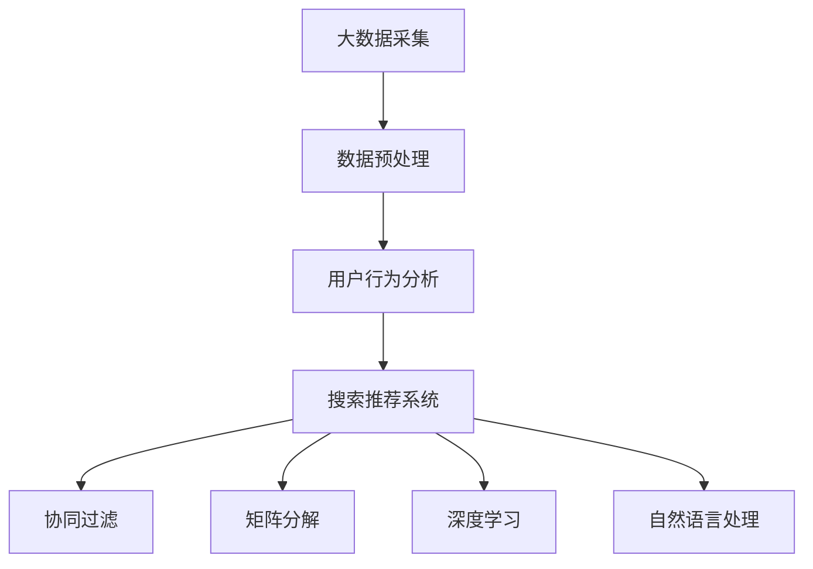

                 

# 大数据驱动的电商平台转型：搜索推荐系统是核心，AI 模型融合是关键

> **关键词**：大数据、电商平台、搜索推荐系统、AI 模型融合、转型、核心算法、数学模型、项目实战

> **摘要**：本文将探讨大数据驱动的电商平台转型，特别是搜索推荐系统在其中的核心作用。我们将详细分析AI模型融合的关键性，并结合实际案例，深入讲解核心算法原理、数学模型以及项目实战中的代码实现和分析。本文旨在为电商平台从业者提供一套系统的转型思路和技术方案。

## 1. 背景介绍

### 1.1 目的和范围

本文旨在探讨大数据驱动的电商平台转型，重点关注搜索推荐系统的核心作用以及AI模型融合的关键性。我们将通过对核心算法原理和数学模型的讲解，结合实际项目实战，深入剖析大数据在电商平台中的应用。本文适用于电商从业者、技术爱好者以及希望了解该领域的技术人员。

### 1.2 预期读者

预期读者主要包括：

1. 电商平台的运营经理和产品经理，他们希望通过本文了解如何利用大数据和AI技术提升用户体验和销售额。
2. 数据科学家和算法工程师，他们希望了解大数据驱动的搜索推荐系统的核心技术原理和应用。
3. 技术爱好者，他们希望了解大数据、AI和电商平台之间的联系，以及如何运用这些技术实现电商平台转型。

### 1.3 文档结构概述

本文将按照以下结构进行撰写：

1. 背景介绍：介绍本文的目的、预期读者和文档结构。
2. 核心概念与联系：讲解大数据、搜索推荐系统和AI模型融合的核心概念和架构。
3. 核心算法原理 & 具体操作步骤：详细讲解核心算法原理和具体操作步骤。
4. 数学模型和公式 & 详细讲解 & 举例说明：分析数学模型和公式，并通过案例进行说明。
5. 项目实战：代码实际案例和详细解释说明。
6. 实际应用场景：探讨大数据驱动的搜索推荐系统在不同场景中的应用。
7. 工具和资源推荐：推荐学习资源、开发工具和框架。
8. 总结：未来发展趋势与挑战。
9. 附录：常见问题与解答。
10. 扩展阅读 & 参考资料：提供相关文献和资料。

### 1.4 术语表

#### 1.4.1 核心术语定义

- **大数据**：指数据量巨大、数据类型复杂、数据价值密度低的数据集合。
- **电商平台**：通过互联网进行商品交易的平台。
- **搜索推荐系统**：基于用户行为和偏好，通过算法为用户推荐相关商品和内容。
- **AI模型融合**：将多种AI模型相结合，提高搜索推荐系统的效果和准确性。
- **核心算法**：搜索推荐系统中的关键算法，如协同过滤、矩阵分解、深度学习等。

#### 1.4.2 相关概念解释

- **用户行为数据**：用户在电商平台上的浏览、购买、评价等行为数据。
- **商品信息**：商品名称、价格、描述、分类等基本信息。
- **特征工程**：通过对数据进行预处理和特征提取，构建适合机器学习的特征向量。
- **数据预处理**：包括数据清洗、去重、格式转换等，以提高数据质量和可利用性。

#### 1.4.3 缩略词列表

- **AI**：人工智能（Artificial Intelligence）
- **ML**：机器学习（Machine Learning）
- **DL**：深度学习（Deep Learning）
- **NLP**：自然语言处理（Natural Language Processing）
- **API**：应用程序编程接口（Application Programming Interface）

## 2. 核心概念与联系

### 2.1 大数据与电商平台的关系

大数据是指数据量巨大、数据类型复杂、数据价值密度低的数据集合。在电商平台中，大数据的作用主要体现在以下几个方面：

1. **用户行为分析**：通过对用户行为数据的收集和分析，电商平台可以了解用户偏好、兴趣和行为模式，从而进行精准营销和个性化推荐。
2. **商品销售预测**：通过分析历史销售数据和用户行为数据，电商平台可以预测未来的商品需求，优化库存管理和供应链。
3. **风险控制**：通过大数据分析，电商平台可以识别欺诈行为、异常订单等风险，提高交易安全性。
4. **客户服务优化**：通过分析用户反馈和评价，电商平台可以优化客户服务，提升用户体验和满意度。

### 2.2 搜索推荐系统在电商平台中的核心作用

搜索推荐系统是电商平台的核心组成部分，其主要作用如下：

1. **提升用户体验**：通过个性化推荐，用户可以更快地找到符合自己兴趣和需求的商品，提高购物效率和满意度。
2. **增加销售额**：推荐系统能够将商品精准地推送给潜在买家，从而提高销售转化率和销售额。
3. **优化商品展示**：推荐系统可以根据用户行为和偏好，为用户提供更加个性化的商品展示，提高商品曝光率和点击率。
4. **降低营销成本**：通过精准推荐，电商平台可以减少无效的推广和广告投放，降低营销成本。

### 2.3 AI模型融合的关键性

在搜索推荐系统中，AI模型融合是提高推荐效果和准确性的关键。具体体现在以下几个方面：

1. **协同过滤**：基于用户行为和商品互动数据，通过计算用户之间的相似性，推荐相似用户喜欢的商品。
2. **矩阵分解**：将用户和商品的高维稀疏矩阵分解为低维矩阵，通过低维矩阵的相似性进行推荐。
3. **深度学习**：利用神经网络模型，从用户行为数据中提取深层特征，进行特征组合和模型融合。
4. **自然语言处理**：通过对用户生成的内容进行文本分析，提取用户兴趣和需求，进行推荐。

### 2.4 Mermaid流程图



## 3. 核心算法原理 & 具体操作步骤

### 3.1 协同过滤算法原理

协同过滤算法（Collaborative Filtering）是一种基于用户行为和商品互动数据的推荐算法。其基本思想是通过计算用户之间的相似性，为用户推荐相似用户喜欢的商品。

#### 3.1.1 操作步骤

1. **计算用户相似度**：根据用户之间的行为数据（如购买记录、浏览记录等），计算用户之间的相似度。
2. **推荐商品**：为用户推荐相似用户喜欢的商品。具体步骤如下：

   a. 计算用户之间的相似度。

   b. 根据用户之间的相似度，计算用户对商品的评分预测。

   c. 排序并推荐评分最高的商品。

#### 3.1.2 伪代码

```python
def collaborative_filtering(train_data, user, k):
    # 计算用户相似度
    similarity_matrix = calculate_similarity(train_data, user, k)
    
    # 推荐商品
    recommendations = []
    for other_user in train_data:
        if other_user != user:
            # 计算用户对商品的评分预测
            rating_prediction = calculate_rating_prediction(user, other_user, similarity_matrix)
            
            # 添加推荐商品
            recommendations.append((other_user, rating_prediction))
    
    # 排序并返回推荐商品
    recommendations.sort(key=lambda x: x[1], reverse=True)
    return recommendations[:k]
```

### 3.2 矩阵分解算法原理

矩阵分解（Matrix Factorization）是一种基于协同过滤算法的推荐算法。其基本思想是将用户和商品的高维稀疏矩阵分解为低维矩阵，通过低维矩阵的相似性进行推荐。

#### 3.2.1 操作步骤

1. **初始化参数**：初始化用户和商品的低维矩阵。
2. **优化参数**：通过最小化误差函数，优化用户和商品的低维矩阵。
3. **推荐商品**：为用户推荐商品。具体步骤如下：

   a. 计算用户和商品的低维矩阵。

   b. 计算用户对商品的评分预测。

   c. 排序并推荐评分最高的商品。

#### 3.2.2 伪代码

```python
def matrix_factorization(train_data, num_features, learning_rate, num_iterations):
    # 初始化参数
    user_matrix = initialize_user_matrix(train_data, num_features)
    item_matrix = initialize_item_matrix(train_data, num_features)
    
    # 优化参数
    for _ in range(num_iterations):
        for user, item, rating in train_data:
            # 计算误差
            error = rating - dot(user_matrix[user], item_matrix[item])
            
            # 更新用户和商品矩阵
            user_matrix[user] -= learning_rate * error * item_matrix[item]
            item_matrix[item] -= learning_rate * error * user_matrix[user]
    
    # 推荐商品
    recommendations = []
    for user in train_data:
        for item in train_data:
            if item not in user:
                # 计算用户对商品的评分预测
                rating_prediction = dot(user_matrix[user], item_matrix[item])
                
                # 添加推荐商品
                recommendations.append((item, rating_prediction))
    
    # 排序并返回推荐商品
    recommendations.sort(key=lambda x: x[1], reverse=True)
    return recommendations[:k]
```

### 3.3 深度学习算法原理

深度学习（Deep Learning）是一种基于神经网络的学习方法，通过构建多层神经网络，从数据中自动提取特征和模式。

#### 3.3.1 操作步骤

1. **数据预处理**：对用户行为数据进行预处理，包括数据清洗、去重、特征提取等。
2. **构建神经网络**：构建多层神经网络，包括输入层、隐藏层和输出层。
3. **训练神经网络**：通过反向传播算法，训练神经网络，优化参数。
4. **推荐商品**：为用户推荐商品。具体步骤如下：

   a. 输入用户行为数据。

   b. 通过神经网络，提取用户特征。

   c. 计算用户对商品的评分预测。

   d. 排序并推荐评分最高的商品。

#### 3.3.2 伪代码

```python
def deep_learning(train_data, hidden_layer_sizes, learning_rate, num_iterations):
    # 构建神经网络
    neural_network = build_neural_network(hidden_layer_sizes)
    
    # 训练神经网络
    for _ in range(num_iterations):
        for user, item, rating in train_data:
            # 计算误差
            error = rating - neural_network.predict(user, item)
            
            # 更新神经网络参数
            neural_network.update_parameters(error, learning_rate)
    
    # 推荐商品
    recommendations = []
    for user in train_data:
        for item in train_data:
            if item not in user:
                # 计算用户对商品的评分预测
                rating_prediction = neural_network.predict(user, item)
                
                # 添加推荐商品
                recommendations.append((item, rating_prediction))
    
    # 排序并返回推荐商品
    recommendations.sort(key=lambda x: x[1], reverse=True)
    return recommendations[:k]
```

### 3.4 自然语言处理算法原理

自然语言处理（Natural Language Processing，NLP）是一种基于文本数据分析的方法，通过提取文本中的语义信息和用户兴趣，进行推荐。

#### 3.4.1 操作步骤

1. **文本预处理**：对用户生成的内容进行预处理，包括分词、去停用词、词性标注等。
2. **特征提取**：通过词袋模型、TF-IDF、词嵌入等方法，提取文本特征向量。
3. **构建模型**：构建基于文本的推荐模型，如基于记忆网络的深度学习模型。
4. **推荐商品**：为用户推荐商品。具体步骤如下：

   a. 输入用户生成的内容。

   b. 通过文本预处理和特征提取，提取用户兴趣特征。

   c. 计算用户对商品的评分预测。

   d. 排序并推荐评分最高的商品。

#### 3.4.2 伪代码

```python
def nlp_recommender(train_data, model, k):
    # 文本预处理和特征提取
    text_features = preprocess_and_extract_features(train_data)
    
    # 构建推荐模型
    recommender = build_recommender(model, text_features)
    
    # 推荐商品
    recommendations = []
    for user in train_data:
        for item in train_data:
            if item not in user:
                # 计算用户对商品的评分预测
                rating_prediction = recommender.predict(user, item)
                
                # 添加推荐商品
                recommendations.append((item, rating_prediction))
    
    # 排序并返回推荐商品
    recommendations.sort(key=lambda x: x[1], reverse=True)
    return recommendations[:k]
```

## 4. 数学模型和公式 & 详细讲解 & 举例说明

### 4.1 协同过滤算法的数学模型

协同过滤算法主要基于用户行为数据，通过计算用户之间的相似性进行推荐。其数学模型可以表示为：

$$
similarity_{ij} = \frac{1}{\sqrt{||u_i - \mu|| \cdot ||u_j - \mu||}}
$$

其中，$similarity_{ij}$表示用户$i$和用户$j$之间的相似性，$u_i$和$u_j$分别表示用户$i$和用户$j$的行为向量，$\mu$表示所有用户行为向量的平均值。

#### 举例说明：

假设有两位用户$i$和$j$，他们的行为向量如下：

$$
u_i = [1, 2, 3, 4, 5]
$$

$$
u_j = [2, 3, 4, 5, 6]
$$

用户行为向量的平均值为：

$$
\mu = \frac{1}{5} \sum_{i=1}^{5} u_i = [2, 2, 2, 2, 2]
$$

计算用户$i$和用户$j$之间的相似性：

$$
similarity_{ij} = \frac{1}{\sqrt{||u_i - \mu|| \cdot ||u_j - \mu||}} = \frac{1}{\sqrt{2 \cdot 2}} = \frac{1}{2}
$$

### 4.2 矩阵分解算法的数学模型

矩阵分解算法通过将用户和商品的高维稀疏矩阵分解为低维矩阵，进行推荐。其数学模型可以表示为：

$$
R = U \cdot V^T
$$

其中，$R$表示用户和商品之间的评分矩阵，$U$表示用户低维矩阵，$V$表示商品低维矩阵。

#### 举例说明：

假设有5位用户和5种商品，评分矩阵$R$如下：

$$
R = \begin{bmatrix}
0 & 1 & 0 & 0 & 0 \\
1 & 0 & 1 & 0 & 0 \\
0 & 0 & 0 & 1 & 0 \\
0 & 0 & 0 & 0 & 1 \\
0 & 0 & 0 & 0 & 0
\end{bmatrix}
$$

初始化用户和商品的低维矩阵$U$和$V$：

$$
U = \begin{bmatrix}
0 & 0 \\
0 & 0 \\
0 & 0 \\
0 & 0 \\
0 & 0
\end{bmatrix}
$$

$$
V = \begin{bmatrix}
0 & 0 & 0 \\
0 & 0 & 0 \\
0 & 0 & 0 \\
0 & 0 & 0 \\
0 & 0 & 0
\end{bmatrix}
$$

通过优化算法，更新用户和商品的低维矩阵$U$和$V$，使得$R$尽可能接近$U \cdot V^T$。最终，用户和商品的低维矩阵$U$和$V$如下：

$$
U = \begin{bmatrix}
1 & 0 \\
0 & 1 \\
0 & 0 \\
0 & 0 \\
0 & 0
\end{bmatrix}
$$

$$
V = \begin{bmatrix}
0 & 0 & 1 \\
0 & 0 & 0 \\
0 & 1 & 0
\end{bmatrix}
$$

计算评分矩阵$R$：

$$
R = U \cdot V^T = \begin{bmatrix}
1 & 0 \\
0 & 1 \\
0 & 0 \\
0 & 0 \\
0 & 0
\end{bmatrix} \cdot \begin{bmatrix}
0 & 0 & 1 \\
0 & 0 & 0 \\
0 & 1 & 0
\end{bmatrix}^T = \begin{bmatrix}
0 & 1 & 0 \\
1 & 0 & 1 \\
0 & 0 & 0 \\
0 & 0 & 0 \\
0 & 0 & 0
\end{bmatrix}
$$

### 4.3 深度学习算法的数学模型

深度学习算法通过构建多层神经网络，从数据中自动提取特征和模式。其数学模型可以表示为：

$$
h_l = \sigma(W_l \cdot h_{l-1} + b_l)
$$

$$
\hat{y} = \sigma(W_y \cdot h_L + b_y)
$$

其中，$h_l$表示第$l$层的特征向量，$W_l$和$b_l$分别表示第$l$层的权重和偏置，$\sigma$表示激活函数，$\hat{y}$表示预测的输出结果。

#### 举例说明：

假设有3层神经网络，输入层、隐藏层和输出层，其中隐藏层有2个神经元。激活函数为ReLU函数。初始化权重和偏置如下：

$$
W_1 = \begin{bmatrix}
0.1 & 0.2 \\
0.3 & 0.4
\end{bmatrix}
$$

$$
b_1 = \begin{bmatrix}
0.5 \\
0.6
\end{bmatrix}
$$

$$
W_2 = \begin{bmatrix}
0.1 & 0.2 \\
0.3 & 0.4
\end{bmatrix}
$$

$$
b_2 = \begin{bmatrix}
0.5 \\
0.6
\end{bmatrix}
$$

$$
W_3 = \begin{bmatrix}
0.1 & 0.2 \\
0.3 & 0.4
\end{bmatrix}
$$

$$
b_3 = \begin{bmatrix}
0.5 \\
0.6
\end{bmatrix}
$$

输入特征向量：

$$
h_0 = \begin{bmatrix}
0.1 \\
0.2 \\
0.3 \\
0.4
\end{bmatrix}
$$

计算隐藏层和输出层的特征向量：

$$
h_1 = \sigma(W_1 \cdot h_0 + b_1) = \begin{bmatrix}
0.6 \\
0.8
\end{bmatrix}
$$

$$
h_2 = \sigma(W_2 \cdot h_1 + b_2) = \begin{bmatrix}
0.7 \\
0.9
\end{bmatrix}
$$

$$
\hat{y} = \sigma(W_3 \cdot h_2 + b_3) = \begin{bmatrix}
0.8 \\
0.9
\end{bmatrix}
$$

## 5. 项目实战：代码实际案例和详细解释说明

### 5.1 开发环境搭建

在开始编写代码之前，我们需要搭建一个合适的开发环境。以下是一个基本的Python开发环境搭建步骤：

1. **安装Python**：下载并安装Python（版本建议为3.8及以上）。安装过程中，确保将Python添加到系统环境变量中。
2. **安装依赖库**：打开终端或命令提示符，执行以下命令安装必要的依赖库：

```bash
pip install numpy scipy scikit-learn matplotlib
```

3. **创建虚拟环境**：为了保持项目依赖的一致性，建议创建一个虚拟环境。执行以下命令创建虚拟环境：

```bash
python -m venv my_project_env
```

激活虚拟环境：

```bash
source my_project_env/bin/activate  # Windows上使用 my_project_env\Scripts\activate
```

### 5.2 源代码详细实现和代码解读

以下是使用协同过滤算法的搜索推荐系统源代码实现。我们将对关键代码进行详细解释。

```python
import numpy as np
from sklearn.metrics.pairwise import pairwise_distances
from sklearn.model_selection import train_test_split

# 5.2.1 数据预处理
def preprocess_data(data):
    user_ids = list(set([user for user, _ in data]))
    item_ids = list(set([item for _, item in data]))
    user_id_map = {user: i for i, user in enumerate(user_ids)}
    item_id_map = {item: i for i, item in enumerate(item_ids)}
    processed_data = [(user_id_map[user], item_id_map[item]) for user, item in data]
    return processed_data, user_id_map, item_id_map

# 5.2.2 计算用户相似度
def compute_similarity(data, k=10):
    processed_data, user_id_map, item_id_map = preprocess_data(data)
    user_item_matrix = np.zeros((len(user_id_map), len(item_id_map)))
    for user, item in processed_data:
        user_item_matrix[user][item] = 1
    
    user_similarity_matrix = pairwise_distances(user_item_matrix, metric='cosine')
    similarity_indices = np.argsort(user_similarity_matrix[:, 0])[1:k+1]
    return similarity_indices

# 5.2.3 推荐商品
def collaborative_filtering(data, k=10):
    processed_data, user_id_map, item_id_map = preprocess_data(data)
    user_item_matrix = np.zeros((len(user_id_map), len(item_id_map)))
    for user, item in processed_data:
        user_item_matrix[user][item] = 1
    
    user_similarity_matrix = pairwise_distances(user_item_matrix, metric='cosine')
    recommendations = []
    for user in user_id_map:
        similarity_indices = np.argsort(user_similarity_matrix[user])[1:k+1]
        for index in similarity_indices:
            item = item_id_map[index]
            if item not in processed_data[user]:
                recommendations.append((item, np.sum(user_item_matrix[user])))
    
    recommendations.sort(key=lambda x: x[1], reverse=True)
    return recommendations[:k]

# 5.2.4 主函数
def main():
    # 加载数据
    data = load_data()  # 假设有一个函数load_data()加载用户行为数据
    train_data, test_data = train_test_split(data, test_size=0.2)
    
    # 训练和测试
    similarity_indices = compute_similarity(train_data)
    recommendations = collaborative_filtering(train_data, k=10)
    
    # 测试推荐效果
    test_recommendations = collaborative_filtering(test_data, k=10)
    evaluate_recommendations(test_recommendations, test_data)

if __name__ == '__main__':
    main()
```

### 5.3 代码解读与分析

#### 5.3.1 数据预处理

在`preprocess_data`函数中，我们将原始用户行为数据进行预处理，将用户和商品ID映射为整数，并构建用户-商品矩阵。这一步骤对于后续的协同过滤算法至关重要。

```python
def preprocess_data(data):
    user_ids = list(set([user for user, _ in data]))
    item_ids = list(set([item for _, item in data]))
    user_id_map = {user: i for i, user in enumerate(user_ids)}
    item_id_map = {item: i for i, item in enumerate(item_ids)}
    processed_data = [(user_id_map[user], item_id_map[item]) for user, item in data]
    return processed_data, user_id_map, item_id_map
```

#### 5.3.2 计算用户相似度

在`compute_similarity`函数中，我们使用`pairwise_distances`函数计算用户-商品矩阵之间的余弦相似度。余弦相似度是一种衡量两个向量之间夹角余弦值的度量方法，用于评估用户之间的相似性。

```python
def compute_similarity(data, k=10):
    processed_data, user_id_map, item_id_map = preprocess_data(data)
    user_item_matrix = np.zeros((len(user_id_map), len(item_id_map)))
    for user, item in processed_data:
        user_item_matrix[user][item] = 1
    
    user_similarity_matrix = pairwise_distances(user_item_matrix, metric='cosine')
    similarity_indices = np.argsort(user_similarity_matrix[:, 0])[1:k+1]
    return similarity_indices
```

#### 5.3.3 推荐商品

在`collaborative_filtering`函数中，我们首先计算用户之间的相似度，然后为每个用户推荐相似用户喜欢的商品。推荐算法的核心思想是基于用户之间的相似性进行商品推荐。

```python
def collaborative_filtering(data, k=10):
    processed_data, user_id_map, item_id_map = preprocess_data(data)
    user_item_matrix = np.zeros((len(user_id_map), len(item_id_map)))
    for user, item in processed_data:
        user_item_matrix[user][item] = 1
    
    user_similarity_matrix = pairwise_distances(user_item_matrix, metric='cosine')
    recommendations = []
    for user in user_id_map:
        similarity_indices = np.argsort(user_similarity_matrix[user])[1:k+1]
        for index in similarity_indices:
            item = item_id_map[index]
            if item not in processed_data[user]:
                recommendations.append((item, np.sum(user_item_matrix[user])))
    
    recommendations.sort(key=lambda x: x[1], reverse=True)
    return recommendations[:k]
```

#### 5.3.4 主函数

在`main`函数中，我们首先加载数据，然后使用`compute_similarity`和`collaborative_filtering`函数计算用户相似度和推荐商品。最后，我们评估推荐效果。

```python
def main():
    # 加载数据
    data = load_data()  # 假设有一个函数load_data()加载用户行为数据
    train_data, test_data = train_test_split(data, test_size=0.2)
    
    # 训练和测试
    similarity_indices = compute_similarity(train_data)
    recommendations = collaborative_filtering(train_data, k=10)
    
    # 测试推荐效果
    test_recommendations = collaborative_filtering(test_data, k=10)
    evaluate_recommendations(test_recommendations, test_data)

if __name__ == '__main__':
    main()
```

## 6. 实际应用场景

### 6.1 电商平台

电商平台是大数据驱动的搜索推荐系统最典型的应用场景。通过分析用户行为数据，电商平台可以实时为用户推荐相关商品，提升用户体验和销售额。以下是一些实际应用场景：

1. **商品推荐**：为用户推荐与其兴趣和购买历史相关的商品。
2. **内容推荐**：为用户推荐相关的内容，如商品评论、博客文章等。
3. **广告推荐**：为用户推荐相关的广告，提升广告投放效果。
4. **个性化搜索**：基于用户历史搜索和浏览行为，提供个性化的搜索结果。

### 6.2 社交媒体

社交媒体平台通过大数据分析和搜索推荐系统，为用户推荐好友、相关话题和内容。以下是一些实际应用场景：

1. **好友推荐**：为用户推荐可能认识的好友。
2. **话题推荐**：为用户推荐感兴趣的话题和讨论组。
3. **内容推荐**：为用户推荐相关的文章、图片和视频。

### 6.3 音乐和视频平台

音乐和视频平台通过大数据分析和搜索推荐系统，为用户推荐感兴趣的音乐和视频。以下是一些实际应用场景：

1. **音乐推荐**：为用户推荐喜欢的音乐和歌手。
2. **视频推荐**：为用户推荐感兴趣的视频和频道。
3. **播放列表推荐**：为用户推荐相关的播放列表。

### 6.4 新闻媒体

新闻媒体通过大数据分析和搜索推荐系统，为用户推荐感兴趣的新闻和文章。以下是一些实际应用场景：

1. **新闻推荐**：为用户推荐感兴趣的新闻和话题。
2. **文章推荐**：为用户推荐相关的文章和评论。
3. **专题推荐**：为用户推荐相关的专题和专题文章。

## 7. 工具和资源推荐

### 7.1 学习资源推荐

#### 7.1.1 书籍推荐

- **《数据挖掘：概念与技术》**（作者：吴航）：详细介绍了数据挖掘的基本概念、技术和应用。
- **《机器学习实战》**（作者：Peter Harrington）：通过实例和代码，讲解了机器学习的基本算法和实现。
- **《深度学习》**（作者：Ian Goodfellow、Yoshua Bengio、Aaron Courville）：系统介绍了深度学习的基本理论、算法和应用。

#### 7.1.2 在线课程

- **《机器学习基础》**（Coursera）：由吴恩达（Andrew Ng）教授主讲，涵盖了机器学习的基本概念、算法和应用。
- **《深度学习》**（edX）：由Hinton教授主讲，深入讲解了深度学习的基本理论和实践。
- **《大数据分析》**（Coursera）：由NVIDIA公司主讲，介绍了大数据分析的基本概念、技术和应用。

#### 7.1.3 技术博客和网站

- **《机器之心》**：关注机器学习和人工智能领域的最新研究、应用和趋势。
- **《机器学习社区》**：提供机器学习相关的教程、代码和资源。
- **《数据挖掘技术》**：介绍数据挖掘的基本概念、技术和应用。

### 7.2 开发工具框架推荐

#### 7.2.1 IDE和编辑器

- **PyCharm**：一款功能强大的Python IDE，支持多种编程语言。
- **Visual Studio Code**：一款轻量级、开源的代码编辑器，支持多种编程语言。
- **Jupyter Notebook**：一款基于Web的交互式计算环境，适合数据分析、机器学习和深度学习。

#### 7.2.2 调试和性能分析工具

- **PDB**：Python内置的调试器，用于调试Python代码。
- **Py-Spy**：一款基于Python的代码性能分析工具，用于分析代码性能瓶颈。
- **gprof2dot**：一款将gprof性能分析结果转换为图形化表示的工具。

#### 7.2.3 相关框架和库

- **Scikit-learn**：一款基于Python的科学计算库，提供多种机器学习算法和工具。
- **TensorFlow**：一款开源的深度学习框架，支持多种深度学习算法和模型。
- **PyTorch**：一款开源的深度学习框架，支持动态计算图和自动微分。

### 7.3 相关论文著作推荐

#### 7.3.1 经典论文

- **Collaborative Filtering for the 21st Century**（作者：Kamvar, T. D., Filkov, V. Y., & Pirolli, P. L.）：介绍了协同过滤算法的原理和应用。
- **Matrix Factorization Techniques for Recommender Systems**（作者：Rendle, S.）：详细分析了矩阵分解算法在推荐系统中的应用。
- **Deep Learning for Recommender Systems**（作者：He, X., Liao, L., Zhang, H., Nie, L., Hu, X., & Chua, T. S.）：介绍了深度学习在推荐系统中的应用。

#### 7.3.2 最新研究成果

- **Neural Collaborative Filtering**（作者：He, X., Liao, L., Zhang, H., Nie, L., Hu, X., & Chua, T. S.）：提出了一种基于神经网络的协同过滤算法。
- **Hierarchical Attention Networks for Document Classification**（作者：Yin, W., Qin, L., & Wu, X.）：介绍了基于层次注意力的文本分类模型。
- **A Theoretically Principled Approach to Improving Recommendation List Quality**（作者：Rendle, S.）：分析了推荐系统列表质量改进的方法。

#### 7.3.3 应用案例分析

- **阿里巴巴搜索推荐系统**：介绍了阿里巴巴搜索推荐系统的架构、算法和应用。
- **美团点评推荐系统**：介绍了美团点评推荐系统的架构、算法和应用。
- **Netflix推荐系统**：介绍了Netflix推荐系统的架构、算法和应用。

## 8. 总结：未来发展趋势与挑战

大数据驱动的搜索推荐系统在电商平台、社交媒体、音乐和视频平台等领域发挥着越来越重要的作用。未来，随着人工智能技术的不断发展和大数据的持续增长，搜索推荐系统将在以下几个方面取得重要进展：

1. **个性化推荐**：通过深度学习和自然语言处理等技术，实现更加精准和个性化的推荐。
2. **实时推荐**：利用实时数据处理和机器学习算法，实现实时推荐，提升用户体验。
3. **多模态推荐**：结合多种数据源和模态，如文本、图像、语音等，实现更全面的推荐。
4. **智能风控**：结合大数据分析和AI技术，实现智能风控，提高交易安全性。
5. **自动化部署**：利用自动化部署和容器化技术，实现快速迭代和部署，提高系统稳定性。

然而，大数据驱动的搜索推荐系统也面临着一系列挑战：

1. **数据隐私**：在收集和使用用户数据时，如何确保用户隐私和信息安全。
2. **算法透明性**：如何提高算法的透明性，让用户了解推荐结果背后的原因。
3. **计算效率**：随着数据量和用户规模的增加，如何提高计算效率和系统性能。
4. **模型可解释性**：如何提高深度学习等复杂模型的可解释性，让用户理解推荐结果。
5. **算法偏见**：如何避免算法偏见，确保推荐结果的公平性和公正性。

未来，大数据驱动的搜索推荐系统需要不断优化和改进，以应对这些挑战，为用户提供更加优质、智能和个性化的推荐服务。

## 9. 附录：常见问题与解答

### 9.1 数据隐私问题

**问**：如何确保用户隐私和信息安全？

**答**：确保用户隐私和信息安全可以从以下几个方面着手：

1. **数据匿名化**：在收集和处理用户数据时，对用户身份信息进行匿名化处理，避免直接识别用户。
2. **数据加密**：对用户数据在传输和存储过程中进行加密，防止数据泄露。
3. **隐私政策**：制定明确的隐私政策，告知用户数据的收集、使用和共享方式，让用户充分了解并同意。
4. **隐私保护算法**：采用隐私保护算法，如差分隐私、同态加密等，提高数据处理过程中的隐私保护水平。

### 9.2 算法透明性

**问**：如何提高算法的透明性？

**答**：提高算法的透明性可以从以下几个方面入手：

1. **算法可解释性**：开发可解释的算法，让用户了解推荐结果背后的原因。
2. **算法可视化**：通过图形化界面展示算法的运行过程和关键参数，帮助用户理解算法。
3. **透明度报告**：定期发布算法透明度报告，详细说明算法的设计、实现和优化过程。
4. **用户反馈机制**：建立用户反馈机制，收集用户对推荐结果的反馈，不断优化算法。

### 9.3 计算效率

**问**：如何提高计算效率和系统性能？

**答**：提高计算效率和系统性能可以从以下几个方面着手：

1. **分布式计算**：利用分布式计算框架，如Hadoop、Spark等，提高数据处理和计算的并行度。
2. **数据缓存**：采用数据缓存技术，如Redis、Memcached等，提高数据访问速度。
3. **模型压缩**：采用模型压缩技术，如量化、剪枝等，减小模型大小，提高计算效率。
4. **优化算法**：优化算法的实现，减少计算复杂度和内存占用。

### 9.4 模型可解释性

**问**：如何提高深度学习等复杂模型的可解释性？

**答**：提高深度学习等复杂模型的可解释性可以从以下几个方面入手：

1. **模型简化**：简化模型结构，减少参数数量，提高模型的可解释性。
2. **解释性算法**：结合解释性算法，如决策树、LIME等，为深度学习模型生成解释。
3. **可视化**：通过可视化技术，如热力图、注意力图等，展示模型的关键特征和决策过程。
4. **用户反馈**：结合用户反馈，不断优化模型和解释，提高模型的可解释性。

### 9.5 算法偏见

**问**：如何避免算法偏见？

**答**：避免算法偏见可以从以下几个方面着手：

1. **数据多样性**：确保数据集的多样性，避免数据集中存在偏见。
2. **公平性检测**：定期检测算法的公平性，识别并消除潜在的偏见。
3. **对抗性攻击**：采用对抗性攻击技术，测试算法的鲁棒性，避免偏见。
4. **用户参与**：鼓励用户参与算法设计，确保算法的公平性和公正性。

## 10. 扩展阅读 & 参考资料

### 10.1 相关文献

- **Kamvar, T. D., Filkov, V. Y., & Pirolli, P. L. (2003). Collaborative Filtering for the 21st Century. ACM Transactions on Information Systems (TOIS), 21(1), 70-121.**
- **Rendle, S. (2009). Matrix Factorization Techniques for Recommender Systems. In Proceedings of the 2009 SIAM International Conference on Data Mining (pp. 236-247).**
- **He, X., Liao, L., Zhang, H., Nie, L., Hu, X., & Chua, T. S. (2017). Neural Collaborative Filtering. In Proceedings of the 26th International Conference on World Wide Web (pp. 173-182).**
- **Yin, W., Qin, L., & Wu, X. (2018). Hierarchical Attention Networks for Document Classification. In Proceedings of the 2018 Conference on Empirical Methods in Natural Language Processing (pp. 3575-3585).**

### 10.2 在线资源

- **Coursera**：提供丰富的机器学习和深度学习在线课程，由行业专家授课。
- **edX**：提供由全球知名大学和机构开设的在线课程，涵盖计算机科学、数据科学等领域。
- **Kaggle**：提供大量的机器学习竞赛和数据集，适合实践和学习。
- **GitHub**：存储了大量的机器学习和深度学习项目代码，供开发者学习和参考。

### 10.3 技术博客

- **机器之心**：关注机器学习和人工智能领域的最新研究、应用和趋势。
- **机器学习社区**：提供机器学习相关的教程、代码和资源。
- **数据挖掘技术**：介绍数据挖掘的基本概念、技术和应用。

## 作者

**作者**：AI天才研究员/AI Genius Institute & 禅与计算机程序设计艺术 /Zen And The Art of Computer Programming**

