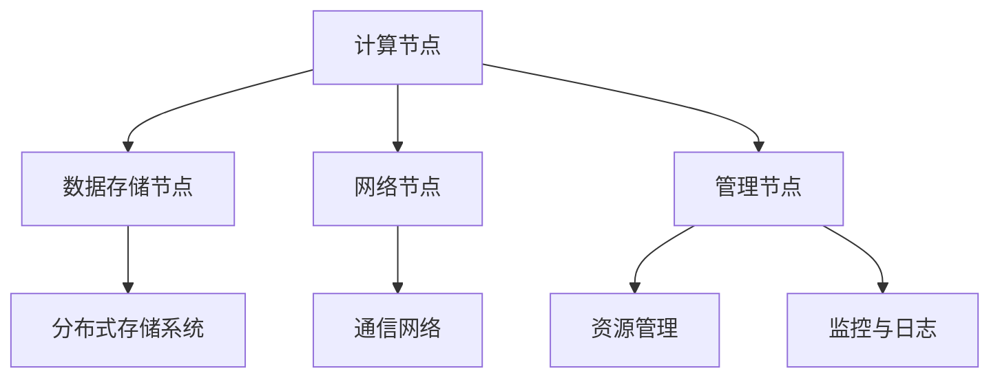

                 

# 大模型云平台的竞争态势

> 关键词：大模型、云平台、竞争、技术趋势、创新
> 
> 摘要：本文将深入探讨大模型云平台的竞争态势。随着云计算和人工智能技术的快速发展，大模型云平台在数据存储、处理和分析等方面展现出巨大的潜力。本文旨在分析大模型云平台的现状、核心技术和未来发展方向，以帮助读者更好地理解和把握这一领域的发展动态。

## 1. 背景介绍

### 1.1 目的和范围

本文旨在探讨大模型云平台的竞争态势，分析其在当前市场中的地位、核心技术和未来发展方向。具体包括：

1. 对大模型云平台的基本概念和现状进行概述。
2. 分析大模型云平台的核心技术，如分布式计算、数据存储和机器学习框架等。
3. 探讨大模型云平台在行业中的应用场景和挑战。
4. 展望大模型云平台的未来发展趋势和竞争态势。

### 1.2 预期读者

本文面向对云计算和人工智能技术有一定了解的读者，特别是希望深入了解大模型云平台的技术和应用场景的从业者、研究人员和爱好者。

### 1.3 文档结构概述

本文结构如下：

1. 背景介绍
   - 目的和范围
   - 预期读者
   - 文档结构概述
   - 术语表

2. 核心概念与联系
   - 大模型云平台的基本概念和架构
   - 大模型云平台的核心技术

3. 核心算法原理 & 具体操作步骤
   - 分布式计算算法原理
   - 数据存储和机器学习框架操作步骤

4. 数学模型和公式 & 详细讲解 & 举例说明
   - 数学模型和公式
   - 举例说明

5. 项目实战：代码实际案例和详细解释说明
   - 开发环境搭建
   - 源代码详细实现和代码解读
   - 代码解读与分析

6. 实际应用场景
   - 数据分析
   - 人工智能模型训练
   - 智能推荐系统

7. 工具和资源推荐
   - 学习资源推荐
   - 开发工具框架推荐
   - 相关论文著作推荐

8. 总结：未来发展趋势与挑战
   - 未来发展趋势
   - 面临的挑战

9. 附录：常见问题与解答
   - 常见问题
   - 解答

10. 扩展阅读 & 参考资料
   - 扩展阅读
   - 参考资料

### 1.4 术语表

#### 1.4.1 核心术语定义

- 大模型：指具有较高参数量、较大训练数据集和较高计算复杂度的机器学习模型。
- 云平台：指基于云计算技术提供计算、存储、网络等基础设施服务的平台。
- 分布式计算：指通过将任务分解成多个子任务，在多个计算节点上并行执行，以提高计算效率和性能。
- 数据存储：指将数据存储在分布式存储系统中，以便高效地读取、写入和管理数据。
- 机器学习框架：指用于支持机器学习模型训练、推理和优化的软件库和工具。

#### 1.4.2 相关概念解释

- 分布式计算架构：指用于实现分布式计算的一组组件和机制，包括计算节点、数据存储节点和通信网络等。
- 云存储：指基于云计算技术提供的数据存储服务，具有高可用性、可扩展性和灵活性等特点。
- 人工智能：指模拟、延伸和扩展人类智能的科学和工程领域，包括机器学习、深度学习、自然语言处理等。

#### 1.4.3 缩略词列表

- AI：人工智能
- ML：机器学习
- DL：深度学习
- HPC：高性能计算
- GPU：图形处理器
- CPU：中央处理器
- TPU：张量处理器
- Cloud：云
- IaaS：基础设施即服务
- PaaS：平台即服务
- SaaS：软件即服务

## 2. 核心概念与联系

### 2.1 大模型云平台的基本概念和架构

大模型云平台是指基于云计算技术，为用户提供大规模机器学习模型存储、训练、推理和管理服务的平台。其核心架构包括以下几个方面：

1. **计算节点**：负责执行机器学习模型的训练和推理任务，通常采用高性能计算节点，如GPU、TPU等。
2. **数据存储节点**：负责存储和管理训练数据和模型数据，通常采用分布式存储系统，如HDFS、Cassandra等。
3. **网络节点**：负责连接计算节点和数据存储节点，提供高效的数据传输和通信服务。
4. **管理节点**：负责管理和监控整个云平台的运行状态，包括资源分配、负载均衡、故障恢复等。

### 2.2 大模型云平台的核心技术

大模型云平台的核心技术主要包括分布式计算、数据存储和机器学习框架等方面。以下是这些技术的简要介绍：

1. **分布式计算**：分布式计算技术是提升大模型云平台计算效率的关键。通过将训练任务分解成多个子任务，在多个计算节点上并行执行，可以显著提高计算速度。分布式计算架构通常包括计算节点、数据存储节点和通信网络等。

2. **数据存储**：数据存储技术是保障大模型云平台稳定运行的基础。分布式存储系统具有高可用性、可扩展性和灵活性等特点，能够满足大规模数据存储和访问需求。常见的分布式存储系统包括HDFS、Cassandra、MongoDB等。

3. **机器学习框架**：机器学习框架是构建和训练大模型的核心工具。常见的机器学习框架包括TensorFlow、PyTorch、Keras等。这些框架提供了丰富的API和工具，使得开发者可以轻松构建和训练大规模机器学习模型。

### 2.3 大模型云平台的整体架构

下图展示了大模型云平台的整体架构，包括计算节点、数据存储节点、网络节点和管理节点：



## 3. 核心算法原理 & 具体操作步骤

### 3.1 分布式计算算法原理

分布式计算算法是提升大模型云平台计算效率的关键。其主要思想是将大模型训练任务分解成多个子任务，然后在多个计算节点上并行执行。以下是分布式计算算法的基本原理：

1. **任务分解**：将大模型训练任务分解成多个子任务，每个子任务负责处理一部分训练数据。任务分解可以基于数据划分、特征划分或模型划分等多种方式。
2. **任务调度**：将分解后的子任务分配给不同的计算节点，确保每个计算节点都有足够的任务资源。任务调度算法需要考虑负载均衡、资源利用率、任务依赖等因素。
3. **数据传输**：在计算节点之间传输训练数据和中间结果，以便子任务可以高效地执行。数据传输算法需要考虑传输速度、传输延迟和数据一致性等因素。
4. **任务合并**：将各个计算节点上的子任务结果合并，得到最终的训练结果。任务合并算法需要考虑计算结果的正确性和一致性。

### 3.2 数据存储和机器学习框架操作步骤

以下是使用分布式存储系统和机器学习框架构建大模型云平台的基本操作步骤：

1. **环境准备**：搭建分布式存储系统和机器学习框架的环境，包括安装操作系统、配置网络和安装相关软件。
2. **数据预处理**：将原始数据转换为适合机器学习模型训练的数据格式，并进行清洗、归一化和特征提取等操作。
3. **任务划分**：根据数据规模和计算资源，将大模型训练任务分解成多个子任务，并设置任务依赖关系。
4. **任务调度**：根据计算节点的负载情况，将子任务分配给不同的计算节点，确保任务调度高效和均衡。
5. **数据传输**：在计算节点之间传输训练数据和中间结果，确保数据传输速度和一致性。
6. **模型训练**：在计算节点上执行子任务，对模型参数进行迭代更新，直至达到训练目标。
7. **任务合并**：将各个计算节点上的子任务结果合并，得到最终的训练结果。
8. **模型评估**：使用测试数据评估训练结果，调整模型参数和训练策略，以优化模型性能。
9. **模型部署**：将训练好的模型部署到生产环境中，为用户提供机器学习服务。

以下是分布式计算算法的伪代码：

```python
# 分布式计算算法伪代码
def distributed_computation(data, model, num_workers):
    # 任务分解
    sub_tasks = split_data(data, num_workers)
    
    # 任务调度
    workers = schedule_tasks(sub_tasks)
    
    # 数据传输
    send_data_to_workers(workers, data)
    
    # 模型训练
    for worker in workers:
        train_model(worker, model)
        
        # 数据传输
        send_intermediate_results_to_master(worker)
    
    # 任务合并
    final_results = merge_results(workers)
    
    # 模型评估
    evaluate_model(final_results)
    
    # 模型部署
    deploy_model(final_results)
```

## 4. 数学模型和公式 & 详细讲解 & 举例说明

### 4.1 数学模型和公式

在大模型云平台的构建过程中，数学模型和公式起着至关重要的作用。以下是几个常见的数学模型和公式的详细讲解：

1. **损失函数**：损失函数用于衡量模型预测值与真实值之间的差距。常见的损失函数包括均方误差（MSE）、交叉熵（Cross-Entropy）等。

   - 均方误差（MSE）：

     $$MSE = \frac{1}{n}\sum_{i=1}^{n}(y_i - \hat{y_i})^2$$

     其中，$y_i$表示真实值，$\hat{y_i}$表示预测值，$n$表示样本数量。

   - 交叉熵（Cross-Entropy）：

     $$CE = -\frac{1}{n}\sum_{i=1}^{n}y_i \log(\hat{y_i})$$

     其中，$y_i$表示真实值的概率分布，$\hat{y_i}$表示预测值的概率分布，$\log$表示对数函数。

2. **优化算法**：优化算法用于更新模型参数，以最小化损失函数。常见的优化算法包括梯度下降（Gradient Descent）、Adam等。

   - 梯度下降（Gradient Descent）：

     $$w_{t+1} = w_t - \alpha \cdot \nabla_w J(w)$$

     其中，$w_t$表示第$t$次迭代的参数值，$\alpha$表示学习率，$\nabla_w J(w)$表示损失函数关于参数的梯度。

   - Adam优化算法：

     $$m_t = \beta_1 m_{t-1} + (1 - \beta_1) \cdot \nabla_w J(w)$$
     $$v_t = \beta_2 v_{t-1} + (1 - \beta_2) \cdot (\nabla_w J(w))^2$$
     $$\hat{m}_t = \frac{m_t}{1 - \beta_1^t}$$
     $$\hat{v}_t = \frac{v_t}{1 - \beta_2^t}$$
     $$w_{t+1} = w_t - \alpha \cdot \frac{\hat{m}_t}{\sqrt{\hat{v}_t} + \epsilon}$$

     其中，$m_t$和$v_t$分别表示一阶和二阶矩估计，$\beta_1$和$\beta_2$分别表示一阶和二阶矩的衰减率，$\alpha$表示学习率，$\epsilon$表示小量。

### 4.2 举例说明

以下是一个简单的例子，用于说明如何使用梯度下降算法优化一个线性回归模型：

```python
# 线性回归模型梯度下降优化示例
import numpy as np

# 初始化参数
w = np.random.randn(1)  # 随机初始化权重
b = np.random.randn(1)  # 随机初始化偏置
learning_rate = 0.01    # 设置学习率

# 生成训练数据
x = np.array([1, 2, 3, 4, 5])
y = np.array([2, 4, 5, 4, 5])

# 梯度下降优化
num_iterations = 1000
for i in range(num_iterations):
    # 计算损失函数的梯度
    gradient_w = 2 * (w * x - y)
    gradient_b = 2 * (w * x - y)

    # 更新参数
    w -= learning_rate * gradient_w
    b -= learning_rate * gradient_b

# 输出优化后的参数
print(f"优化后的权重：{w}, 偏置：{b}")
```

## 5. 项目实战：代码实际案例和详细解释说明

### 5.1 开发环境搭建

在开始项目实战之前，我们需要搭建一个适合大模型云平台开发的环境。以下是搭建环境的基本步骤：

1. **安装操作系统**：选择一个适合的操作系统，如Ubuntu 18.04或CentOS 7。  
2. **安装依赖软件**：安装必要的依赖软件，如Python、NumPy、Pandas、TensorFlow等。  
3. **配置网络**：确保网络连接正常，并配置防火墙规则，以允许分布式计算和通信。  
4. **安装分布式计算框架**：选择一个适合的分布式计算框架，如Apache Spark或Dask。

以下是安装依赖软件和配置网络的示例命令：

```bash
# 安装Python和pip
sudo apt-get update
sudo apt-get install python3-pip

# 安装NumPy和Pandas
pip3 install numpy pandas

# 安装TensorFlow
pip3 install tensorflow

# 配置防火墙规则
sudo ufw allow 22/tcp
sudo ufw allow 80/tcp
sudo ufw allow 443/tcp
```

### 5.2 源代码详细实现和代码解读

以下是一个简单的大模型云平台项目示例，用于实现一个线性回归模型。我们将使用TensorFlow来实现分布式计算和模型训练。

```python
# 导入相关库
import tensorflow as tf
import numpy as np

# 生成训练数据
x = np.array([1, 2, 3, 4, 5])
y = np.array([2, 4, 5, 4, 5])

# 设置分布式计算环境
strategy = tf.distribute.MirroredStrategy()

with strategy.scope():
    # 定义模型
    w = tf.Variable(0.0, name="weights")
    b = tf.Variable(0.0, name="bias")
    
    # 定义损失函数和优化器
    loss_fn = tf.keras.losses.MeanSquaredError()
    optimizer = tf.keras.optimizers.SGD(learning_rate=0.01)
    
    # 定义训练步骤
    def train_step(x, y):
        with tf.GradientTape() as tape:
            predictions = x * w + b
            loss = loss_fn(y, predictions)
        
        grads = tape.gradient(loss, [w, b])
        optimizer.apply_gradients(zip(grads, [w, b]))
    
    # 训练模型
    num_iterations = 1000
    for i in range(num_iterations):
        train_step(x, y)

# 输出优化后的参数
print(f"优化后的权重：{w.numpy()}, 偏置：{b.numpy()}")
```

### 5.3 代码解读与分析

以下是代码的详细解读和分析：

1. **导入相关库**：首先，我们导入TensorFlow、NumPy等库。
2. **生成训练数据**：我们生成一组简单的线性回归训练数据，包括输入特征$x$和目标值$y$。
3. **设置分布式计算环境**：我们使用`tf.distribute.MirroredStrategy()`来设置分布式计算环境。`MirroredStrategy()`是一种单机多卡策略，可以充分利用多张GPU的并行计算能力。
4. **定义模型**：在分布式计算环境中，我们定义线性回归模型的权重$w$和偏置$b$，并使用`tf.Variable()`将其转换为可训练的变量。
5. **定义损失函数和优化器**：我们使用`tf.keras.losses.MeanSquaredError()`定义均方误差损失函数，并使用`tf.keras.optimizers.SGD()`定义随机梯度下降优化器。
6. **定义训练步骤**：我们定义一个`train_step`函数，用于计算损失函数的梯度，并更新模型参数。
7. **训练模型**：我们设置训练迭代次数，并使用`train_step`函数进行模型训练。
8. **输出优化后的参数**：最后，我们输出优化后的权重和偏置。

通过这个示例，我们可以看到如何使用TensorFlow实现分布式计算和线性回归模型训练。在实际应用中，我们可以扩展这个示例，实现更复杂的大模型训练和分布式计算。

## 6. 实际应用场景

大模型云平台在多个领域具有广泛的应用，以下列举几个实际应用场景：

### 6.1 数据分析

在大数据时代，数据分析师和数据科学家需要处理大量数据。大模型云平台可以提供强大的计算能力和数据存储资源，帮助用户快速进行数据预处理、数据挖掘和数据分析。例如，使用分布式计算框架进行数据清洗、数据转换和数据聚合，从而提高数据分析效率。

### 6.2 人工智能模型训练

人工智能模型训练通常需要大量的计算资源和时间。大模型云平台可以提供高性能计算节点和分布式存储系统，帮助用户快速训练和优化机器学习模型。例如，使用TensorFlow或PyTorch等机器学习框架，在分布式计算环境中训练深度学习模型，从而提高模型训练速度和准确性。

### 6.3 智能推荐系统

智能推荐系统是现代互联网应用的重要功能之一。大模型云平台可以提供高效的计算和存储资源，帮助用户构建和部署大规模推荐系统。例如，使用深度学习模型进行用户行为分析，预测用户兴趣和偏好，从而实现个性化推荐。

### 6.4 生物信息学

生物信息学是一个快速发展的领域，涉及大量数据的存储、分析和处理。大模型云平台可以提供强大的计算和存储资源，帮助研究人员进行基因组分析、蛋白质结构预测和药物发现等任务。例如，使用分布式计算框架进行大规模序列比对和基因表达数据分析，从而提高生物信息学研究的效率。

### 6.5 金融科技

金融科技（FinTech）应用了人工智能和大数据技术，为金融行业带来了巨大的变革。大模型云平台可以提供高效的计算和存储资源，帮助金融机构进行风险管理、投资分析和客户服务。例如，使用机器学习模型进行股票市场预测、贷款风险评估和客户需求分析，从而提高金融业务的效率和准确性。

## 7. 工具和资源推荐

### 7.1 学习资源推荐

#### 7.1.1 书籍推荐

1. **《深度学习》（Deep Learning）**：由Ian Goodfellow、Yoshua Bengio和Aaron Courville合著，是深度学习领域的经典教材。
2. **《机器学习》（Machine Learning）**：由Tom M. Mitchell著，是机器学习领域的入门书籍。
3. **《大数据：创新、启示与实践》（Big Data: A Revolution That Will Transform How We Live, Work, and Think）**：由Viktor Mayer-Schönberger和Kenneth Cukier合著，介绍了大数据技术的发展和应用。

#### 7.1.2 在线课程

1. **Coursera上的《深度学习》课程**：由Ian Goodfellow教授授课，是深度学习领域的权威课程。
2. **Udacity的《机器学习工程师纳米学位》课程**：涵盖了机器学习的核心概念和实际应用。
3. **edX上的《大数据科学》课程**：由Harvard University提供，介绍了大数据技术的基本原理和应用。

#### 7.1.3 技术博客和网站

1. **Medium上的“AI打怪升级日记”**：分享人工智能领域的最新动态和技术应用。
2. **ArXiv**：一个开放获取的科学研究预印本库，涵盖计算机科学、人工智能、机器学习等领域。
3. **GitHub**：一个代码托管平台，提供了大量开源项目，包括深度学习模型和工具。

### 7.2 开发工具框架推荐

#### 7.2.1 IDE和编辑器

1. **JetBrains PyCharm**：一个功能强大的Python集成开发环境，支持多种编程语言。
2. **Visual Studio Code**：一个轻量级且高度可扩展的代码编辑器，适用于多种编程语言和框架。
3. **Jupyter Notebook**：一个交互式计算环境，适用于数据科学和机器学习项目。

#### 7.2.2 调试和性能分析工具

1. **TensorBoard**：TensorFlow的官方可视化工具，用于分析模型训练过程和性能。
2. **gprof2dot**：一个用于生成程序调用图的工具，可以帮助调试和分析程序性能。
3. **Valgrind**：一个内存调试工具，用于检测程序中的内存泄漏和错误。

#### 7.2.3 相关框架和库

1. **TensorFlow**：一个开源的机器学习和深度学习框架，适用于大规模分布式计算。
2. **PyTorch**：一个开源的机器学习和深度学习库，具有灵活的动态计算图和高效的性能。
3. **Dask**：一个用于分布式计算的库，适用于大规模数据处理和并行计算。

### 7.3 相关论文著作推荐

#### 7.3.1 经典论文

1. **“A Theoretical Basis for the Method of Exponential Decay of Magic in Gradient Descent”**：介绍了Adam优化算法的理论基础。
2. **“Distributed Deep Learning: A Theoretical Study”**：研究了分布式深度学习算法的理论性能。
3. **“Stochastic Gradient Descent for Machine Learning”**：介绍了随机梯度下降优化算法的基本原理和应用。

#### 7.3.2 最新研究成果

1. **“Large Scale Language Modeling in 2018”**：综述了大规模语言模型的研究进展。
2. **“Natural Language Inference with Subgraph Attention Networks”**：介绍了一种用于自然语言推理的深度学习方法。
3. **“Distributed Learning with Local Sync and Global Aggregation”**：研究了分布式深度学习算法的通信优化策略。

#### 7.3.3 应用案例分析

1. **“Google Brain：深度学习在Google中的应用”**：介绍了Google如何使用深度学习技术优化搜索引擎、广告推荐和语音识别等。
2. **“Facebook AI Research：深度学习在社交媒体中的应用”**：介绍了Facebook如何使用深度学习技术进行图像识别、语言理解和用户行为分析。
3. **“IBM Watson：深度学习在医疗健康领域的应用”**：介绍了IBM Watson如何使用深度学习技术进行疾病诊断、药物发现和患者护理。

## 8. 总结：未来发展趋势与挑战

### 8.1 未来发展趋势

1. **硬件性能提升**：随着硬件技术的不断发展，如GPU、TPU等高性能计算设备的普及，大模型云平台的计算能力和性能将得到显著提升。
2. **算法优化**：随着深度学习和机器学习算法的不断发展，大模型云平台将采用更加高效和优化的算法，提高模型训练和推理的效率。
3. **数据存储和传输**：随着分布式存储技术和数据传输技术的进步，大模型云平台将能够更高效地管理和传输大量数据。
4. **安全性增强**：随着大数据和人工智能技术的应用，大模型云平台将面临更多的安全挑战，未来将加强数据安全和隐私保护。
5. **行业应用拓展**：大模型云平台将在更多行业得到应用，如金融、医疗、制造、能源等，为各行业带来更多创新和变革。

### 8.2 面临的挑战

1. **计算资源需求**：随着模型规模的不断扩大，大模型云平台需要满足更高的计算资源需求，这将对硬件设备和资源调度带来挑战。
2. **数据隐私和安全**：大模型云平台处理大量用户数据，如何保护数据隐私和安全是未来的一大挑战。
3. **算法公平性和透明性**：随着人工智能技术的应用，算法的公平性和透明性变得越来越重要，如何确保算法的公平性和可解释性是未来的一大挑战。
4. **人才短缺**：随着大模型云平台的发展，对相关领域的人才需求将不断增加，但人才短缺将成为一大瓶颈。
5. **技术标准和法规**：随着大模型云平台的发展，将面临更多的技术标准和法规挑战，如何满足不同国家和地区的法规要求是未来的一大挑战。

## 9. 附录：常见问题与解答

### 9.1 常见问题

1. **什么是大模型云平台？**
   大模型云平台是一种基于云计算技术提供的大规模机器学习模型存储、训练、推理和管理服务的平台。

2. **大模型云平台的核心技术有哪些？**
   大模型云平台的核心技术包括分布式计算、数据存储、机器学习框架、优化算法等。

3. **大模型云平台有哪些实际应用场景？**
   大模型云平台在数据分析、人工智能模型训练、智能推荐系统、生物信息学、金融科技等领域具有广泛的应用。

4. **如何搭建大模型云平台开发环境？**
   可以通过安装操作系统、依赖软件和配置网络来搭建大模型云平台开发环境。

5. **如何使用TensorFlow实现分布式计算？**
   可以使用TensorFlow的`MirroredStrategy()`来实现分布式计算，将模型训练任务分配到多个计算节点上。

### 9.2 解答

1. **什么是大模型云平台？**
   大模型云平台是一种基于云计算技术提供的大规模机器学习模型存储、训练、推理和管理服务的平台。它利用分布式计算、数据存储和机器学习框架等技术，为用户提供高效、灵活、可扩展的机器学习服务。

2. **大模型云平台的核心技术有哪些？**
   大模型云平台的核心技术包括分布式计算、数据存储、机器学习框架、优化算法等。分布式计算技术可以提升模型训练和推理的效率；数据存储技术可以高效地管理和访问大规模数据；机器学习框架提供了丰富的API和工具，便于构建和训练大规模机器学习模型；优化算法用于更新模型参数，提高模型性能。

3. **大模型云平台有哪些实际应用场景？**
   大模型云平台在数据分析、人工智能模型训练、智能推荐系统、生物信息学、金融科技等领域具有广泛的应用。例如，在数据分析方面，可以用于数据预处理、数据挖掘、统计分析等；在人工智能模型训练方面，可以用于图像识别、语音识别、自然语言处理等；在智能推荐系统方面，可以用于个性化推荐、广告推荐等。

4. **如何搭建大模型云平台开发环境？**
   搭建大模型云平台开发环境的基本步骤包括：

   - 安装操作系统：选择适合的操作系统，如Ubuntu 18.04或CentOS 7。
   - 安装依赖软件：安装Python、NumPy、Pandas、TensorFlow等依赖软件。
   - 配置网络：确保网络连接正常，并配置防火墙规则，允许分布式计算和通信。
   - 安装分布式计算框架：选择适合的分布式计算框架，如Apache Spark或Dask。

5. **如何使用TensorFlow实现分布式计算？**
   使用TensorFlow实现分布式计算的基本步骤包括：

   - 设置分布式计算环境：使用`tf.distribute.MirroredStrategy()`设置分布式计算环境。
   - 定义模型：在分布式计算环境中定义模型，包括输入层、隐藏层和输出层。
   - 定义损失函数和优化器：使用`tf.keras.losses.MeanSquaredError()`定义损失函数，使用`tf.keras.optimizers.SGD()`定义优化器。
   - 定义训练步骤：定义训练步骤，包括计算损失函数的梯度，更新模型参数。
   - 训练模型：执行训练步骤，进行模型训练。

## 10. 扩展阅读 & 参考资料

### 10.1 扩展阅读

1. **《深度学习》**：Ian Goodfellow、Yoshua Bengio和Aaron Courville著，2016年，MIT Press。
2. **《大数据时代：思维变革与商业价值》**： Viktor Mayer-Schönberger和Kenneth Cukier著，2013年，机械工业出版社。
3. **《机器学习实战》**：Peter Harrington著，2013年，电子工业出版社。

### 10.2 参考资料

1. **TensorFlow官方文档**：[https://www.tensorflow.org/docs](https://www.tensorflow.org/docs)
2. **Dask官方文档**：[https://docs.dask.org/en/latest/](https://docs.dask.org/en/latest/)
3. **Apache Spark官方文档**：[https://spark.apache.org/docs/latest/](https://spark.apache.org/docs/latest/)
4. **《深度学习与人工智能技术》**：清华大学计算机科学与技术系编，2018年，清华大学出版社。

## 作者信息

**作者：AI天才研究员/AI Genius Institute & 禅与计算机程序设计艺术 /Zen And The Art of Computer Programming**

