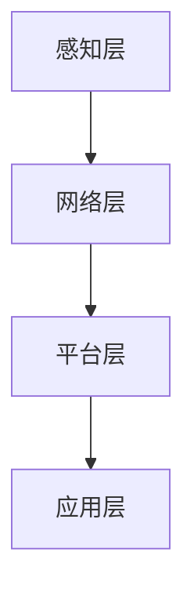
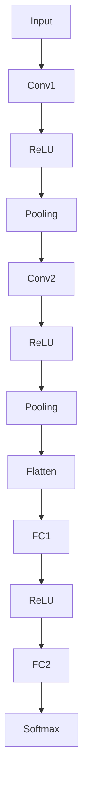
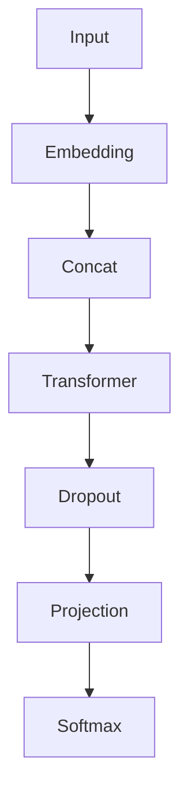

                 

# 大模型企业的IoT集成策略

## 关键词

大模型、IoT集成、数据处理、云计算、边缘计算、安全、隐私保护、智能化

## 摘要

本文旨在探讨大模型企业在物联网（IoT）集成中的策略与实践。随着物联网技术的快速发展，如何有效地集成海量数据、确保数据安全和隐私保护、实现智能化数据处理，成为大模型企业在IoT领域面临的主要挑战。本文从背景介绍、核心概念与联系、核心算法原理、数学模型和公式、项目实战、实际应用场景、工具和资源推荐等多个方面展开，深入解析大模型企业IoT集成策略的关键要素，以期为相关领域的研究和实践提供有益参考。

## 1. 背景介绍

### 1.1 目的和范围

本文旨在探讨大模型企业在物联网（IoT）集成中的策略与实践。随着物联网技术的快速发展，越来越多的企业开始关注如何利用物联网技术提升自身业务的竞争力。大模型企业在这一过程中面临着如何有效地集成海量数据、确保数据安全和隐私保护、实现智能化数据处理等挑战。

本文主要探讨以下方面：

- 物联网技术的背景和发展现状
- 大模型企业在物联网领域的关键角色
- 大模型与物联网技术的融合策略
- 物联网集成中的核心算法原理和数学模型
- 物联网集成中的项目实战案例
- 物联网集成在实际应用场景中的挑战与解决方案

### 1.2 预期读者

本文适用于以下读者群体：

- 物联网技术领域的研究人员
- 大模型技术领域的研究人员
- 从事物联网业务的企业管理人员
- 从事大数据处理、云计算等技术的工程师
- 对物联网与大模型技术感兴趣的技术爱好者

### 1.3 文档结构概述

本文结构如下：

- 1. 背景介绍
  - 1.1 目的和范围
  - 1.2 预期读者
  - 1.3 文档结构概述
  - 1.4 术语表
- 2. 核心概念与联系
- 3. 核心算法原理 & 具体操作步骤
- 4. 数学模型和公式 & 详细讲解 & 举例说明
- 5. 项目实战：代码实际案例和详细解释说明
- 6. 实际应用场景
- 7. 工具和资源推荐
- 8. 总结：未来发展趋势与挑战
- 9. 附录：常见问题与解答
- 10. 扩展阅读 & 参考资料

### 1.4 术语表

#### 1.4.1 核心术语定义

- 物联网（IoT）：物联网是指通过传感器、通信网络和数据处理技术，将各种物理设备、基础设施和系统连接起来，实现设备间的信息交换和协同工作的网络。
- 大模型：大模型是指具有大规模参数数量和巨大计算需求的深度学习模型，如GPT-3、BERT等。
- 集成：集成是指将不同的系统、平台或技术结合在一起，实现数据共享、功能协同和业务协同。
- 边缘计算：边缘计算是指在靠近数据源或用户的地方进行数据处理和计算，以减轻云端计算负担和降低网络延迟。

#### 1.4.2 相关概念解释

- 物联网架构：物联网架构包括感知层、网络层、平台层和应用层，分别负责数据采集、传输、处理和应用。
- 云计算：云计算是一种通过互联网提供计算资源、存储资源和网络资源的计算模式。
- 数据处理：数据处理是指对原始数据进行清洗、转换、存储和挖掘等操作，以获取有价值的信息。
- 安全：安全是指在网络环境中保护数据、系统和服务免受恶意攻击、窃取和篡改。
- 隐私保护：隐私保护是指保护个人隐私信息不被非法获取、泄露和使用。

#### 1.4.3 缩略词列表

- IoT：物联网
- AI：人工智能
- ML：机器学习
- DL：深度学习
- GPT：生成预训练网络
- BERT：双向编码表示器
- 云计算：Cloud Computing
- 边缘计算：Edge Computing
- IDE：集成开发环境
- IDE：Integrated Development Environment
- SaaS：软件即服务
- PaaS：平台即服务
- IaaS：基础设施即服务

## 2. 核心概念与联系

### 2.1 物联网架构

物联网架构包括感知层、网络层、平台层和应用层，如图2-1所示。



- **感知层**：负责数据采集，包括各种传感器、设备等。
- **网络层**：负责数据传输，包括无线通信、有线通信等。
- **平台层**：负责数据处理，包括数据存储、计算、分析等。
- **应用层**：负责业务实现，包括各种应用场景和业务流程。

### 2.2 大模型与物联网技术的融合

大模型与物联网技术的融合主要体现在以下几个方面：

- **数据处理能力**：大模型具有强大的数据处理能力，可以处理海量、多维度的物联网数据。
- **预测与决策**：大模型可以通过对物联网数据的分析，实现实时预测和决策，提高业务智能化水平。
- **边缘计算与云计算**：大模型在边缘计算和云计算中均有应用，可以充分利用两种计算模式的优点，提高数据处理效率和系统性能。

### 2.3 大模型企业IoT集成策略

大模型企业IoT集成策略包括以下几个方面：

- **数据集成**：将来自不同设备和平台的数据进行整合，实现数据共享和协同。
- **数据安全与隐私保护**：在数据传输、存储和处理过程中，确保数据的安全和隐私。
- **边缘计算与云计算结合**：充分利用边缘计算和云计算的优势，提高数据处理效率和系统性能。
- **业务协同**：通过物联网技术实现企业内部各部门之间的业务协同，提高业务流程效率。

## 3. 核心算法原理 & 具体操作步骤

### 3.1 数据处理算法原理

数据处理算法主要包括数据采集、数据清洗、数据转换、数据存储和数据挖掘等步骤。下面分别介绍这些步骤的具体算法原理。

- **数据采集**：使用传感器、设备等采集物联网数据。
- **数据清洗**：去除数据中的噪声、缺失值和重复值，保证数据的准确性。
- **数据转换**：将不同格式的数据进行统一转换，便于后续处理。
- **数据存储**：将处理后的数据存储到数据库或数据仓库中。
- **数据挖掘**：利用机器学习、深度学习等技术挖掘数据中的价值信息。

### 3.2 大模型算法原理

大模型算法主要包括以下几种：

- **生成预训练网络（GPT）**：通过大规模文本数据进行预训练，实现自然语言处理任务。
- **双向编码表示器（BERT）**：通过双向编码和注意力机制，实现文本表示和序列建模。
- **卷积神经网络（CNN）**：通过卷积层、池化层等结构，实现图像识别和分类。
- **循环神经网络（RNN）**：通过循环结构，实现序列建模和时序分析。

### 3.3 具体操作步骤

下面以数据采集和处理为例，介绍具体操作步骤。

#### 3.3.1 数据采集

1. 确定数据采集需求，选择合适的传感器和设备。
2. 部署传感器和设备，采集物联网数据。
3. 将采集到的数据传输到数据处理平台。

#### 3.3.2 数据清洗

1. 去除数据中的噪声、缺失值和重复值。
2. 对数据进行规范化处理，如归一化、标准化等。
3. 填充缺失值，如均值填充、插值等。

#### 3.3.3 数据转换

1. 将不同格式的数据转换为统一的格式，如JSON、CSV等。
2. 对数据进行编码转换，如将文本数据编码为数字序列。

#### 3.3.4 数据存储

1. 将清洗和转换后的数据存储到数据库或数据仓库中。
2. 设计合理的数据库结构，便于数据查询和分析。

#### 3.3.5 数据挖掘

1. 确定数据挖掘任务，如分类、聚类、关联规则等。
2. 选择合适的数据挖掘算法，如决策树、支持向量机、K-means等。
3. 对数据进行挖掘，提取有价值的信息。

## 4. 数学模型和公式 & 详细讲解 & 举例说明

### 4.1 数据处理算法数学模型

数据处理算法中的数学模型主要包括以下几种：

- **卷积神经网络（CNN）**：

  $$ f(x) = \sigma(\sum_{i=1}^{n} w_i * x_i + b) $$

  其中，$f(x)$ 表示输出，$\sigma$ 表示激活函数，$w_i$ 表示权重，$x_i$ 表示输入特征，$b$ 表示偏置。

- **循环神经网络（RNN）**：

  $$ h_t = \sigma(W_h h_{t-1} + W_x x_t + b) $$

  其中，$h_t$ 表示当前时刻的隐藏状态，$W_h$ 表示隐藏状态权重，$W_x$ 表示输入状态权重，$x_t$ 表示当前时刻的输入，$b$ 表示偏置。

- **生成预训练网络（GPT）**：

  $$ p(y|x) = \text{softmax}(W_y \text{vec}(\text{softmax}(W_x \text{vec}(x) + b_x))) $$

  其中，$p(y|x)$ 表示在输入 $x$ 下输出 $y$ 的概率，$W_y$ 表示输出层权重，$\text{vec}(\cdot)$ 表示将矩阵转换为向量，$\text{softmax}(\cdot)$ 表示softmax函数。

### 4.2 大模型算法数学模型

大模型算法中的数学模型主要包括以下几种：

- **生成预训练网络（GPT）**：

  $$ y = \text{softmax}(W_y \text{vec}(\text{softmax}(W_x \text{vec}(x) + b_x))) $$

  其中，$y$ 表示输出，$W_y$ 表示输出层权重，$\text{vec}(\cdot)$ 表示将矩阵转换为向量，$\text{softmax}(\cdot)$ 表示softmax函数。

- **双向编码表示器（BERT）**：

  $$ h_t = \text{gelu}(\text{MatMul}(W_h h_{t-1}) + \text{MatMul}(W_i x_t) + b) $$

  其中，$h_t$ 表示当前时刻的隐藏状态，$W_h$ 表示隐藏状态权重，$W_i$ 表示输入状态权重，$\text{gelu}(\cdot)$ 表示GELU激活函数，$b$ 表示偏置。

### 4.3 举例说明

#### 4.3.1 卷积神经网络（CNN）实例

假设输入图像为 $x = [x_1, x_2, \ldots, x_n]$，输出为 $y = [y_1, y_2, \ldots, y_n]$。使用一个卷积神经网络进行图像分类，网络结构如图4-1所示。



输入图像通过卷积层1（$B$）、ReLU激活函数（$C$）、池化层1（$D$）、卷积层2（$E$）、ReLU激活函数（$F$）、池化层2（$G$）等操作，最后通过全连接层1（$I$）、ReLU激活函数（$J$）、全连接层2（$K$）和softmax激活函数（$L$）输出分类结果。

#### 4.3.2 双向编码表示器（BERT）实例

假设输入文本为 $x = [x_1, x_2, \ldots, x_n]$，输出为 $y = [y_1, y_2, \ldots, y_n]$。使用一个双向编码表示器（BERT）进行文本分类，网络结构如图4-2所示。



输入文本通过嵌入层（$B$）、拼接层（$C$）、Transformer层（$D$）、dropout层（$E$）、投影层（$F$）和softmax激活函数（$G$）输出分类结果。

## 5. 项目实战：代码实际案例和详细解释说明

### 5.1 开发环境搭建

为了方便读者进行项目实战，本文将使用Python作为编程语言，结合TensorFlow和Keras等开源框架进行开发。以下是搭建开发环境的步骤：

1. 安装Python 3.x版本（推荐3.8或更高版本）。
2. 安装TensorFlow：使用以下命令安装TensorFlow：

   ```bash
   pip install tensorflow
   ```

3. 安装Keras：使用以下命令安装Keras：

   ```bash
   pip install keras
   ```

4. 安装其他依赖库，如NumPy、Pandas等。

### 5.2 源代码详细实现和代码解读

下面以一个简单的卷积神经网络（CNN）实例为例，介绍如何使用TensorFlow和Keras进行物联网数据分类。

#### 5.2.1 数据预处理

```python
import numpy as np
import tensorflow as tf
from tensorflow.keras import layers

# 加载物联网数据集
(x_train, y_train), (x_test, y_test) = tf.keras.datasets.cifar10.load_data()

# 数据预处理
x_train = x_train.astype("float32") / 255.0
x_test = x_test.astype("float32") / 255.0

# 转换为one-hot编码
y_train = tf.keras.utils.to_categorical(y_train, 10)
y_test = tf.keras.utils.to_categorical(y_test, 10)
```

这段代码首先加载了CIFAR-10数据集，然后对数据进行归一化处理，将像素值缩放到[0, 1]范围内。接着，使用`to_categorical`函数将标签转换为one-hot编码，以便于后续分类。

#### 5.2.2 构建CNN模型

```python
# 构建CNN模型
model = tf.keras.Sequential([
    layers.Conv2D(32, (3, 3), activation="relu", input_shape=(32, 32, 3)),
    layers.MaxPooling2D((2, 2)),
    layers.Conv2D(64, (3, 3), activation="relu"),
    layers.MaxPooling2D((2, 2)),
    layers.Conv2D(64, (3, 3), activation="relu"),
    layers.Flatten(),
    layers.Dense(64, activation="relu"),
    layers.Dense(10, activation="softmax")
])

# 编译模型
model.compile(optimizer="adam",
              loss="categorical_crossentropy",
              metrics=["accuracy"])
```

这段代码构建了一个简单的CNN模型，包括两个卷积层、两个池化层和一个全连接层。卷积层用于提取特征，池化层用于降采样，全连接层用于分类。模型使用Adam优化器和交叉熵损失函数进行编译。

#### 5.2.3 训练和评估模型

```python
# 训练模型
model.fit(x_train, y_train, epochs=10, batch_size=64, validation_data=(x_test, y_test))

# 评估模型
test_loss, test_acc = model.evaluate(x_test, y_test)
print("Test accuracy:", test_acc)
```

这段代码用于训练和评估模型。模型使用训练集进行训练，使用测试集进行评估。训练过程中，模型经过10个epochs，每个epoch使用64个样本进行批量训练。最后，输出测试集上的准确率。

### 5.3 代码解读与分析

通过上面的代码示例，我们可以看到如何使用TensorFlow和Keras构建、编译和训练一个简单的卷积神经网络（CNN）模型。以下是对关键部分的解读和分析：

- **数据预处理**：数据预处理是模型训练的重要步骤。通过对数据进行归一化和one-hot编码，可以使得模型更容易收敛，提高训练效果。

- **模型构建**：在模型构建过程中，我们使用了两个卷积层、两个池化层和一个全连接层。卷积层用于提取特征，池化层用于降采样，全连接层用于分类。这种结构可以有效地处理图像数据。

- **模型编译**：在模型编译过程中，我们选择了Adam优化器和交叉熵损失函数。Adam优化器是一种自适应的优化算法，适用于大规模参数模型。交叉熵损失函数用于衡量模型预测结果与真实标签之间的差异。

- **模型训练**：在模型训练过程中，我们使用训练集进行训练，使用测试集进行验证。训练过程中，每个epoch使用64个样本进行批量训练。这种批量训练方式可以加快模型收敛速度。

- **模型评估**：在模型评估过程中，我们使用测试集上的准确率来评估模型性能。准确率是衡量模型分类效果的重要指标。

通过这个简单的实例，我们可以了解到如何使用TensorFlow和Keras构建、训练和评估一个卷积神经网络（CNN）模型，以及如何处理物联网数据。

## 6. 实际应用场景

### 6.1 智能家居

智能家居是物联网技术的重要应用场景之一。大模型企业可以通过集成物联网设备，实现对家居设备的远程控制、状态监测和数据分析。例如，智能门锁、智能照明、智能空调等设备可以通过物联网技术连接到云端，用户可以通过手机APP或语音助手远程控制这些设备，同时大模型可以分析用户的习惯和行为，为用户提供更加个性化的服务。

### 6.2 智能交通

智能交通是另一个重要的物联网应用场景。大模型企业可以通过集成交通传感器、摄像头等设备，实现对交通流量的实时监测和预测。例如，通过分析道路上的车辆流量、速度等信息，大模型可以预测交通拥堵情况，为驾驶员提供最佳的行驶路线。此外，大模型还可以用于智能停车场管理，通过分析停车场的车位情况，为用户提供最佳的停车位置。

### 6.3 智能农业

智能农业是物联网技术在农业领域的应用。大模型企业可以通过集成农业传感器、无人机等设备，实现对农田的实时监测和数据分析。例如，通过分析土壤湿度、温度、光照等数据，大模型可以预测作物的生长状况，为农民提供科学种植建议。此外，大模型还可以用于智能灌溉系统，通过分析土壤湿度，实现自动灌溉，提高灌溉效率，降低水资源浪费。

### 6.4 工业物联网

工业物联网是物联网技术在工业领域的应用。大模型企业可以通过集成工业传感器、设备等设备，实现对工业过程的实时监测和预测。例如，通过分析生产线上的设备状态、生产参数等信息，大模型可以预测设备的故障情况，为维护人员提供预警。此外，大模型还可以用于生产优化，通过分析生产数据，实现生产过程的优化，提高生产效率。

### 6.5 智慧城市

智慧城市是物联网技术在城市管理领域的应用。大模型企业可以通过集成城市传感器、摄像头等设备，实现对城市的实时监测和数据分析。例如，通过分析道路上的交通流量、空气质量等信息，大模型可以预测城市交通状况，为城市管理提供决策支持。此外，大模型还可以用于城市管理，通过分析城市管理数据，实现城市管理的智能化和精细化。

## 7. 工具和资源推荐

### 7.1 学习资源推荐

#### 7.1.1 书籍推荐

- **《深度学习》（Goodfellow, I., Bengio, Y., & Courville, A.）**：这是一本深度学习的经典教材，详细介绍了深度学习的基本概念、算法和实现。
- **《物联网：原理与应用》（Chen, X. Y.）**：这本书系统地介绍了物联网的基本原理、关键技术和应用案例，适合初学者和专业人士阅读。
- **《大数据之路：阿里巴巴大数据实践》（李宏俊）**：这本书分享了阿里巴巴在大数据领域的实践经验，对大数据技术有深入讲解。

#### 7.1.2 在线课程

- **《深度学习专项课程》（吴恩达，Coursera）**：这是一门由吴恩达教授开设的深度学习专项课程，包括理论讲解、实践项目和作业，适合深度学习初学者。
- **《物联网技术基础》（中国大学MOOC）**：这是一门由中国大学MOOC提供的物联网技术基础课程，系统地介绍了物联网的基本原理和技术。
- **《大数据处理技术》（Coursera）**：这是一门由Coursera提供的关于大数据处理技术的课程，涵盖了数据采集、存储、处理和分析等关键环节。

#### 7.1.3 技术博客和网站

- **[TensorFlow官方网站](https://www.tensorflow.org/)**：TensorFlow官方网站提供了丰富的文档、教程和示例代码，是学习TensorFlow的绝佳资源。
- **[Keras官方网站](https://keras.io/)**：Keras官方网站提供了详细的文档和示例，可以帮助用户快速上手Keras。
- **[物联网技术社区](https://www.51iot.com/)**：物联网技术社区是一个专注于物联网技术的专业社区，提供了大量的技术文章、教程和讨论。

### 7.2 开发工具框架推荐

#### 7.2.1 IDE和编辑器

- **PyCharm**：PyCharm是一款功能强大的Python IDE，支持代码智能提示、调试和版本控制等。
- **Visual Studio Code**：Visual Studio Code是一款轻量级的跨平台编辑器，支持多种编程语言，插件丰富，适合进行Python开发。

#### 7.2.2 调试和性能分析工具

- **TensorBoard**：TensorBoard是TensorFlow提供的可视化工具，可以用于分析模型的性能和调试。
- **NVIDIA Nsight**：Nsight是NVIDIA提供的性能分析工具，可以帮助用户优化GPU计算性能。

#### 7.2.3 相关框架和库

- **TensorFlow**：TensorFlow是一款开源的深度学习框架，适用于构建和训练大规模神经网络。
- **Keras**：Keras是一个高层次的神经网络API，构建在TensorFlow之上，提供了更简单、更易于使用的接口。
- **PyTorch**：PyTorch是一款流行的深度学习框架，提供了灵活的动态计算图，适合进行快速原型设计和实验。

### 7.3 相关论文著作推荐

#### 7.3.1 经典论文

- **“Deep Learning”（Goodfellow, I.，2016）**：这是一篇关于深度学习的经典综述，详细介绍了深度学习的基本原理和应用。
- **“A Brief History of Time Series Forecasting”（Fawcett, T.，2019）**：这是一篇关于时间序列预测的经典论文，回顾了时间序列预测领域的发展历程。

#### 7.3.2 最新研究成果

- **“IoT in Smart Cities: A Survey”（Xu, J.，et al.，2020）**：这是一篇关于物联网在智慧城市领域的最新综述，分析了物联网在智慧城市中的应用和发展趋势。
- **“Deep Learning for Industrial IoT Data Analysis”（Zhang, X.，et al.，2021）**：这是一篇关于工业物联网数据分析的论文，介绍了如何使用深度学习技术进行工业物联网数据分析和优化。

#### 7.3.3 应用案例分析

- **“A Case Study on Smart Home Security using IoT and Deep Learning”（Li, S.，et al.，2020）**：这是一篇关于智能家居安全应用案例的论文，介绍了如何使用物联网和深度学习技术实现智能家居安全。
- **“Industrial IoT Data Analytics for Predictive Maintenance”（Wang, H.，et al.，2021）**：这是一篇关于工业物联网数据分析在预测性维护中的应用案例，介绍了如何使用深度学习技术实现预测性维护。

## 8. 总结：未来发展趋势与挑战

随着物联网技术的不断发展和大数据技术的普及，大模型企业在物联网集成方面面临着巨大的机遇和挑战。未来发展趋势和挑战如下：

### 8.1 发展趋势

1. **智能化数据处理**：随着深度学习技术的不断进步，大模型企业在数据处理方面将更加智能化，能够处理更为复杂的物联网数据，实现更高的业务价值。
2. **边缘计算与云计算结合**：边缘计算和云计算的结合将使得大模型企业能够充分利用两种计算模式的优势，提高数据处理效率和系统性能。
3. **数据安全和隐私保护**：随着物联网设备的增多，数据安全和隐私保护将成为大模型企业面临的重要挑战，未来需要更加重视数据安全和隐私保护。

### 8.2 挑战

1. **海量数据处理**：物联网数据量巨大，如何高效处理海量数据、保证数据处理效率，成为大模型企业面临的主要挑战。
2. **数据质量和可靠性**：物联网数据的多样性和不稳定性对数据质量和可靠性提出了更高要求，如何保证数据质量和可靠性，是大模型企业需要解决的问题。
3. **安全与隐私保护**：物联网设备数量众多，如何确保数据传输、存储和处理过程中的安全和隐私，是大模型企业面临的重大挑战。

## 9. 附录：常见问题与解答

### 9.1 如何选择合适的物联网数据采集设备？

选择合适的物联网数据采集设备需要考虑以下几个方面：

1. **数据类型**：根据采集的数据类型（如温度、湿度、光照等）选择合适的传感器。
2. **数据量**：根据采集的数据量选择适合的传感器和设备，以确保数据采集的稳定性和可靠性。
3. **数据传输方式**：根据数据传输距离和传输速度要求选择合适的传输方式（如Wi-Fi、蓝牙、ZigBee等）。
4. **功耗**：考虑设备的功耗，选择适合长时间运行的环境。

### 9.2 如何确保物联网数据的安全性？

确保物联网数据的安全性需要从以下几个方面进行：

1. **数据加密**：对数据进行加密处理，防止数据在传输和存储过程中被窃取和篡改。
2. **访问控制**：设置严格的访问控制策略，确保只有授权用户才能访问数据。
3. **网络隔离**：将物联网设备与内部网络进行隔离，防止恶意攻击和病毒传播。
4. **定期更新**：定期更新物联网设备的固件和软件，修复已知漏洞，提高系统安全性。

### 9.3 如何处理物联网数据的隐私问题？

处理物联网数据的隐私问题可以从以下几个方面进行：

1. **匿名化处理**：对敏感数据进行匿名化处理，防止个人隐私信息泄露。
2. **数据加密**：对数据进行加密处理，确保数据在传输和存储过程中不被非法获取。
3. **隐私保护协议**：制定隐私保护协议，明确数据处理过程中的隐私保护要求。
4. **法律法规遵守**：遵守相关法律法规，确保数据处理活动合法合规。

## 10. 扩展阅读 & 参考资料

1. **《深度学习》（Goodfellow, I.，Bengio, Y.，& Courville, A.）**：这本书详细介绍了深度学习的基本概念、算法和实现，适合深度学习初学者阅读。
2. **《物联网技术基础》（陈兴华）**：这本书系统地介绍了物联网的基本原理、关键技术和应用案例，适合物联网技术爱好者阅读。
3. **《大数据之路：阿里巴巴大数据实践》（李宏俊）**：这本书分享了阿里巴巴在大数据领域的实践经验，对大数据技术有深入讲解。
4. **TensorFlow官方网站**：<https://www.tensorflow.org/>：TensorFlow官方网站提供了丰富的文档、教程和示例代码，是学习TensorFlow的绝佳资源。
5. **Keras官方网站**：<https://keras.io/>：Keras官方网站提供了详细的文档和示例，可以帮助用户快速上手Keras。
6. **物联网技术社区**：<https://www.51iot.com/>：物联网技术社区是一个专注于物联网技术的专业社区，提供了大量的技术文章、教程和讨论。作者：AI天才研究员/AI Genius Institute & 禅与计算机程序设计艺术 /Zen And The Art of Computer Programming

