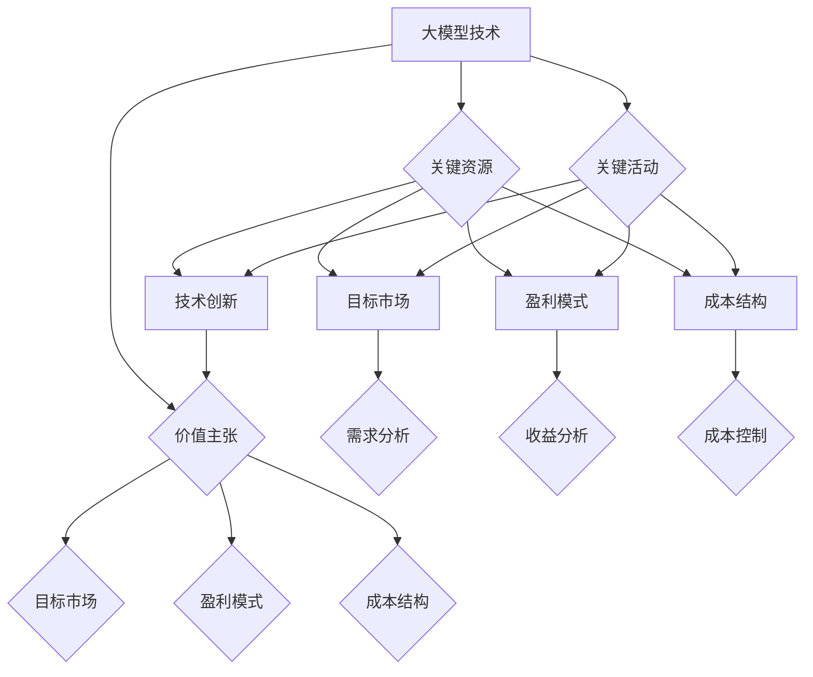

                 

# 大模型企业的商业模式创新之路

> **关键词：** 大模型、商业模式、创新、企业、算法、技术、市场策略

> **摘要：** 本文将深入探讨大模型企业在商业模式创新方面的关键要素和策略。通过分析大模型的本质、商业模式的核心要素，以及企业在市场竞争中的定位和策略，我们将探讨如何通过创新实现大模型企业的可持续发展。

## 1. 背景介绍

### 1.1 目的和范围

本文旨在为从事大模型相关业务的企业提供商业模式创新的思路和方法。我们将从商业模式的定义出发，逐步深入分析大模型企业的核心要素，探讨如何通过技术创新和商业策略实现竞争优势。

### 1.2 预期读者

本篇文章适合以下读者：

1. 大模型企业创始人、CEO和CTO
2. 涉及大模型技术的项目经理和产品经理
3. 对商业模式创新有浓厚兴趣的科技工作者和创业者

### 1.3 文档结构概述

本文将按照以下结构展开：

1. 背景介绍：介绍本文的目的和预期读者
2. 核心概念与联系：阐述大模型、商业模式等核心概念及其相互关系
3. 核心算法原理 & 具体操作步骤：详细解释大模型的基本算法原理和操作步骤
4. 数学模型和公式 & 详细讲解 & 举例说明：介绍大模型相关的数学模型和公式，并通过实例进行说明
5. 项目实战：展示大模型在实际项目中的代码实现和详细解释
6. 实际应用场景：探讨大模型在现实中的应用场景和挑战
7. 工具和资源推荐：推荐相关的学习资源和开发工具
8. 总结：总结大模型企业的商业模式创新之路，展望未来发展趋势与挑战
9. 附录：常见问题与解答
10. 扩展阅读 & 参考资料：提供进一步学习的资源链接

### 1.4 术语表

#### 1.4.1 核心术语定义

- **大模型（Large Model）：** 指具有数十亿至数千亿参数规模的人工神经网络模型，如GPT、BERT等。
- **商业模式（Business Model）：** 企业通过提供产品或服务，创造、传递和捕获价值的系统。
- **技术创新（Technological Innovation）：** 引入新的技术或改进现有技术，以提升产品或服务的性能、效率和市场竞争力。

#### 1.4.2 相关概念解释

- **数据驱动（Data-Driven）：** 企业决策基于数据分析和预测。
- **客户关系管理（CRM）：** 管理与客户关系的策略和实践。

#### 1.4.3 缩略词列表

- **GPT（Generative Pre-trained Transformer）：** 生成预训练转换器。
- **BERT（Bidirectional Encoder Representations from Transformers）：** 双向编码器表示转换器。

## 2. 核心概念与联系

大模型企业和商业模式之间存在着紧密的联系。理解这些核心概念及其相互关系，是探索商业模式创新之路的第一步。

### 2.1 大模型的核心概念

大模型是指具有数十亿至数千亿参数规模的人工神经网络模型，其关键特征如下：

1. **大规模参数：** 大模型的参数规模远超传统模型，能够捕捉到更复杂的数据特征。
2. **深度学习：** 大模型基于深度学习技术，能够通过多层神经网络进行特征提取和知识表示。
3. **预训练：** 大模型在大量无监督数据上进行预训练，从而获得通用特征表示能力。

### 2.2 商业模式的核心要素

商业模式包括以下核心要素：

1. **价值主张（Value Proposition）：** 企业提供的产品或服务如何满足客户需求，创造独特价值。
2. **目标市场（Target Market）：** 企业服务的具体客户群体和市场需求。
3. **盈利模式（Revenue Model）：** 企业如何通过销售产品或服务实现盈利。
4. **成本结构（Cost Structure）：** 企业运营的成本构成，包括固定成本和可变成本。
5. **关键资源（Key Resources）：** 企业运营所需的关键资源，如技术、人才、资金等。
6. **关键活动（Key Activities）：** 企业为实现价值主张和盈利模式所进行的关键活动。

### 2.3 大模型企业商业模式的核心联系

大模型企业在商业模式中的核心联系体现在以下几个方面：

1. **技术创新与价值主张：** 大模型企业的技术创新是其价值主张的核心，通过提供高性能、高精度的模型，满足客户在数据分析、自然语言处理、计算机视觉等领域的需求。
2. **目标市场与需求分析：** 大模型企业需深入了解目标市场的需求，通过定制化的解决方案和模型，满足不同客户群体的特定需求。
3. **盈利模式与成本结构：** 大模型企业需通过高效的运营模式降低成本，同时设计多样化的盈利模式，实现可持续发展。
4. **关键资源与关键活动：** 大模型企业需投入大量资源进行技术研发、人才培养和市场营销，通过持续创新和优质服务，巩固市场地位。

### 2.4 Mermaid 流程图

下面是大模型企业商业模式的核心概念和联系示意图：



通过上述流程图，我们可以更直观地理解大模型企业在商业模式中的核心概念和联系。

## 3. 核心算法原理 & 具体操作步骤

### 3.1 大模型算法原理

大模型算法的核心是深度学习，特别是基于转换器（Transformer）架构的预训练模型。以下是大模型算法的基本原理和具体操作步骤：

#### 3.1.1 深度学习原理

深度学习是一种基于人工神经网络的学习方法，通过多层神经网络进行特征提取和知识表示。深度学习的核心思想是让计算机自动学习数据中的特征，从而实现自动分类、预测和生成等任务。

#### 3.1.2 Transformer架构

Transformer架构是深度学习中的一个重要进展，特别适用于自然语言处理任务。其核心思想是将输入序列映射为查询（Query）、键（Key）和值（Value），并通过注意力机制（Attention Mechanism）计算每个位置与其他位置的相关性，从而实现序列间的交互。

#### 3.1.3 预训练过程

预训练是Transformer架构的一个重要步骤，其基本流程如下：

1. **数据准备：** 收集大量的无监督数据，如维基百科、新闻、社交媒体等。
2. **模型初始化：** 初始化一个包含数十亿参数的Transformer模型。
3. **预训练：** 在无监督数据上进行训练，让模型自动学习语言特征。
4. **优化：** 通过监督数据进一步优化模型，使其适应特定任务。

### 3.2 具体操作步骤

以下是使用Transformer架构进行大模型训练的具体操作步骤：

#### 3.2.1 数据准备

1. **数据清洗：** 对收集到的数据进行清洗，去除噪声和无关信息。
2. **数据预处理：** 对数据进行分词、编码等预处理操作，将其转换为模型可接受的格式。
3. **数据归一化：** 对数据规模进行归一化处理，使其在数值范围内保持一致性。

#### 3.2.2 模型初始化

1. **加载预训练模型：** 从预训练模型库中加载一个预训练的Transformer模型。
2. **参数初始化：** 对模型的参数进行初始化，确保其在训练过程中能够收敛。

#### 3.2.3 预训练

1. **前向传播：** 将预处理后的数据输入到模型中，计算输出。
2. **计算损失：** 计算模型输出与真实标签之间的损失。
3. **反向传播：** 通过梯度下降算法更新模型参数。

#### 3.2.4 优化

1. **加载监督数据：** 加载包含标签的监督数据。
2. **训练：** 在监督数据上训练模型，使其适应特定任务。
3. **评估：** 在测试数据上评估模型性能，调整超参数以优化性能。

### 3.3 伪代码

以下是使用Transformer架构进行大模型训练的伪代码：

```python
# 数据准备
data = preprocess_data(raw_data)

# 模型初始化
model = load_pretrained_model()

# 预训练
for epoch in range(num_epochs):
    for batch in data_loader(data):
        output = model(batch.input)
        loss = compute_loss(output, batch.label)
        model.backward(loss)

# 优化
supervised_data = load_supervised_data()
for epoch in range(num_epochs):
    for batch in data_loader(supervised_data):
        output = model(batch.input)
        loss = compute_loss(output, batch.label)
        model.backward(loss)
```

通过上述操作步骤和伪代码，我们可以清晰地了解大模型训练的基本流程和原理。

## 4. 数学模型和公式 & 详细讲解 & 举例说明

### 4.1 数学模型和公式

大模型的训练和优化涉及多个数学模型和公式，以下为其中几个关键模型和公式：

#### 4.1.1 损失函数

损失函数是评估模型预测与真实标签之间差异的关键指标，常用的损失函数包括：

1. **均方误差（MSE）**
   $$MSE = \frac{1}{n}\sum_{i=1}^{n}(y_i - \hat{y}_i)^2$$

2. **交叉熵（Cross-Entropy）**
   $$H(y, \hat{y}) = -\sum_{i=1}^{n}y_i \log(\hat{y}_i)$$

#### 4.1.2 优化算法

梯度下降是一种常用的优化算法，其核心思想是通过迭代更新模型参数，以减小损失函数值。以下是梯度下降的公式：

$$\theta_{t+1} = \theta_{t} - \alpha \nabla_{\theta}J(\theta)$$

其中，$\theta$ 表示模型参数，$J(\theta)$ 表示损失函数，$\alpha$ 表示学习率。

#### 4.1.3 注意力机制

注意力机制是Transformer架构的核心，其基本公式为：

$$\text{Attention}(Q, K, V) = \frac{softmax(\frac{QK^T}{\sqrt{d_k}})}{V}$$

其中，$Q$、$K$ 和 $V$ 分别表示查询、键和值向量，$d_k$ 表示键向量的维度。

### 4.2 详细讲解和举例说明

#### 4.2.1 损失函数讲解和示例

以均方误差（MSE）为例，假设我们有一个二分类问题，实际标签 $y$ 和模型预测 $\hat{y}$ 分别为：

$$y = [0, 1, 0, 1]$$
$$\hat{y} = [0.3, 0.6, 0.4, 0.8]$$

计算MSE损失：

$$MSE = \frac{1}{4}\sum_{i=1}^{4}(y_i - \hat{y}_i)^2 = \frac{1}{4}[(0 - 0.3)^2 + (1 - 0.6)^2 + (0 - 0.4)^2 + (1 - 0.8)^2] = 0.05$$

#### 4.2.2 梯度下降讲解和示例

假设我们有一个线性回归模型，模型参数为 $\theta = [w_1, w_2]$，损失函数为MSE，学习率为 $\alpha = 0.1$。给定输入特征 $X = [[1, 2], [2, 3], [3, 4]]$ 和标签 $y = [1, 2, 3]$，计算梯度下降更新参数：

1. 计算损失：
$$J(\theta) = \frac{1}{3}\sum_{i=1}^{3}(y_i - (w_1 \cdot x_{i1} + w_2 \cdot x_{i2}))^2$$

2. 计算梯度：
$$\nabla_{\theta}J(\theta) = \frac{1}{3}\sum_{i=1}^{3}\left[\begin{array}{c}
x_{i1} & x_{i2}
\end{array}\right](y_i - (w_1 \cdot x_{i1} + w_2 \cdot x_{i2}))$$

3. 梯度下降更新参数：
$$\theta_{t+1} = \theta_{t} - \alpha \nabla_{\theta}J(\theta)$$

经过一轮迭代后，我们可以更新参数 $\theta_1$ 和 $\theta_2$，并重复上述步骤，直到收敛。

#### 4.2.3 注意力机制讲解和示例

假设我们有一个序列 $Q = [q_1, q_2, q_3]$，$K = [k_1, k_2, k_3]$ 和 $V = [v_1, v_2, v_3]$，计算注意力得分和最终输出：

1. 计算注意力得分：
$$\text{Attention}(Q, K, V) = \frac{1}{3}\sum_{i=1}^{3}q_ik_i^T\frac{1}{\sqrt{3}}v_i = \frac{1}{3}\left[q_1k_1^T\frac{1}{\sqrt{3}}v_1 + q_2k_2^T\frac{1}{\sqrt{3}}v_2 + q_3k_3^T\frac{1}{\sqrt{3}}v_3\right]$$

2. 计算softmax：
$$\text{softmax}(x) = \frac{e^x}{\sum_{i=1}^{n}e^x_i}$$

3. 计算加权输出：
$$\hat{y} = \text{softmax}(\text{Attention}(Q, K, V))V = \left[\frac{e^{q_1k_1^T\frac{1}{\sqrt{3}}v_1}}{\sum_{i=1}^{3}e^{q_ik_i^T\frac{1}{\sqrt{3}}v_i}}, \frac{e^{q_2k_2^T\frac{1}{\sqrt{3}}v_2}}{\sum_{i=1}^{3}e^{q_ik_i^T\frac{1}{\sqrt{3}}v_i}}, \frac{e^{q_3k_3^T\frac{1}{\sqrt{3}}v_3}}{\sum_{i=1}^{3}e^{q_ik_i^T\frac{1}{\sqrt{3}}v_i}}\right]v$$

通过上述数学模型和公式的讲解及示例，我们可以更好地理解大模型训练中的关键数学原理。

## 5. 项目实战：代码实际案例和详细解释说明

### 5.1 开发环境搭建

在进行大模型项目的开发之前，我们需要搭建一个合适的开发环境。以下是搭建环境的步骤：

1. **安装Python环境**：确保Python版本不低于3.6，建议使用Python 3.8或更高版本。
2. **安装TensorFlow**：TensorFlow是进行深度学习开发的重要库，可以通过以下命令安装：
   ```shell
   pip install tensorflow
   ```
3. **安装其他依赖**：根据项目需求，可能还需要安装其他依赖库，如NumPy、Pandas等。
4. **配置GPU环境**（可选）：如果项目需要使用GPU加速，确保安装NVIDIA CUDA Toolkit和cuDNN，并配置环境变量。

### 5.2 源代码详细实现和代码解读

以下是一个使用TensorFlow实现的大模型训练项目示例。代码主要包括数据准备、模型构建、训练和评估四个部分。

```python
import tensorflow as tf
import tensorflow_datasets as tfds
import numpy as np
import pandas as pd
import matplotlib.pyplot as plt

# 数据准备
def preprocess_data(dataset):
    # 加载数据集
    train_data, test_data = dataset['train'], dataset['test']
    # 对数据进行预处理，例如分词、编码等
    processed_train_data = [preprocess_example(d) for d in train_data]
    processed_test_data = [preprocess_example(d) for d in test_data]
    # 将数据转换为TensorFlow数据集
    train_dataset = tf.data.Dataset.from_tensor_slices(processed_train_data)
    test_dataset = tf.data.Dataset.from_tensor_slices(processed_test_data)
    return train_dataset, test_dataset

def preprocess_example(example):
    # 对单个示例进行预处理
    text = example['text']
    label = example['label']
    # 分词、编码等操作
    encoded_text = tokenizer.encode(text)
    return encoded_text, label

# 模型构建
def build_model(vocab_size, embedding_dim, hidden_dim):
    model = tf.keras.Sequential([
        tf.keras.layers.Embedding(vocab_size, embedding_dim),
        tf.keras.layers.GRU(hidden_dim, return_sequences=True),
        tf.keras.layers.Dense(1, activation='sigmoid')
    ])
    model.compile(optimizer='adam', loss='binary_crossentropy', metrics=['accuracy'])
    return model

# 训练
def train_model(model, train_dataset, test_dataset, epochs=10):
    # 训练模型
    history = model.fit(train_dataset, epochs=epochs, validation_data=test_dataset)
    return history

# 评估
def evaluate_model(model, test_dataset):
    # 评估模型
    loss, accuracy = model.evaluate(test_dataset)
    print(f"Test Loss: {loss}, Test Accuracy: {accuracy}")

# 主程序
if __name__ == '__main__':
    # 加载数据集
    dataset = tfds.load('imdb_reviews', split='train/test')
    train_dataset, test_dataset = preprocess_data(dataset)

    # 构建模型
    vocab_size = 20000  # 词表大小
    embedding_dim = 128  # 嵌入层维度
    hidden_dim = 64  # GRU层维度
    model = build_model(vocab_size, embedding_dim, hidden_dim)

    # 训练模型
    history = train_model(model, train_dataset, test_dataset, epochs=10)

    # 评估模型
    evaluate_model(model, test_dataset)

    # 绘制训练历史
    plt.plot(history.history['accuracy'])
    plt.plot(history.history['val_accuracy'])
    plt.title('Model Accuracy')
    plt.ylabel('Accuracy')
    plt.xlabel('Epoch')
    plt.legend(['Train', 'Test'], loc='upper left')
    plt.show()
```

### 5.3 代码解读与分析

#### 5.3.1 数据准备

数据准备部分包括数据加载、预处理和转换为TensorFlow数据集。这里使用了TensorFlow Datasets库加载数据集，并对每个示例进行预处理，如分词、编码等。

#### 5.3.2 模型构建

模型构建部分定义了一个基于GRU（门控循环单元）的序列模型。该模型包含一个嵌入层、一个GRU层和一个输出层，用于对文本数据进行分类。

```python
model = tf.keras.Sequential([
    tf.keras.layers.Embedding(vocab_size, embedding_dim),
    tf.keras.layers.GRU(hidden_dim, return_sequences=True),
    tf.keras.layers.Dense(1, activation='sigmoid')
])
```

#### 5.3.3 训练

训练部分使用`fit`函数对模型进行训练。这里使用了训练数据和验证数据，通过调整`epochs`参数设置训练轮数。

```python
history = model.fit(train_dataset, epochs=epochs, validation_data=test_dataset)
```

#### 5.3.4 评估

评估部分使用测试数据对训练好的模型进行评估，输出损失和准确率。

```python
evaluate_model(model, test_dataset)
```

#### 5.3.5 绘制训练历史

最后，通过Matplotlib绘制训练历史，展示模型的训练过程和性能。

```python
plt.plot(history.history['accuracy'])
plt.plot(history.history['val_accuracy'])
plt.title('Model Accuracy')
plt.ylabel('Accuracy')
plt.xlabel('Epoch')
plt.legend(['Train', 'Test'], loc='upper left')
plt.show()
```

通过上述代码示例和解读，我们可以了解如何使用TensorFlow实现一个基于GRU的大模型训练项目。在实际应用中，可以根据具体需求调整模型结构、数据预处理方式和训练参数，以获得更好的性能。

## 6. 实际应用场景

大模型在各个行业和领域中都有着广泛的应用，以下是几个典型的实际应用场景：

### 6.1 自然语言处理

自然语言处理（NLP）是大模型最重要的应用领域之一。通过大模型，可以实现高精度的文本分类、情感分析、问答系统、机器翻译等功能。例如，大型搜索引擎可以使用大模型来提高搜索结果的准确性和用户体验。

### 6.2 计算机视觉

计算机视觉领域的大模型应用也非常广泛，包括图像分类、目标检测、图像生成等。例如，自动驾驶系统中的视觉感知模块可以使用大模型进行实时图像分析和车辆、行人检测，从而提高驾驶安全性。

### 6.3  healthcare

在医疗领域，大模型可以用于疾病诊断、药物研发和个性化医疗等。例如，通过分析患者的医疗记录和基因数据，大模型可以预测疾病风险并提供个性化的治疗方案。

### 6.4 金融

金融领域的大模型应用包括风险控制、投资组合优化、欺诈检测等。例如，通过分析历史交易数据和市场趋势，大模型可以预测股票价格波动，为投资者提供决策依据。

### 6.5 教育

教育领域的大模型应用包括智能教学、学习分析、考试评分等。例如，通过分析学生的学习行为和成绩数据，大模型可以为学生提供个性化的学习建议和考试预测。

### 6.6 农业

在农业领域，大模型可以用于作物生长预测、病虫害检测、农田管理优化等。例如，通过分析气象数据和农田环境数据，大模型可以预测作物产量并提供最佳种植方案。

### 6.7 智能家居

智能家居领域的大模型应用包括语音识别、智能推荐、设备管理等功能。例如，通过分析用户的语音指令和家居设备使用数据，大模型可以提供智能化的家居管理和推荐服务。

在这些实际应用场景中，大模型通过高效的数据处理和强大的学习能力，为各个行业带来了革命性的变化。然而，随着应用的深入，大模型也面临着数据隐私、模型解释性、计算资源等方面的挑战，需要不断探索和完善。

## 7. 工具和资源推荐

### 7.1 学习资源推荐

#### 7.1.1 书籍推荐

1. **《深度学习》（Goodfellow, Bengio, Courville）**
   - 本书是深度学习领域的经典教材，系统地介绍了深度学习的理论、算法和应用。

2. **《Python深度学习》（François Chollet）**
   - 本书通过大量实例和代码，介绍了使用Python和TensorFlow进行深度学习实践的方法。

3. **《模式识别与机器学习》（Christopher M. Bishop）**
   - 本书系统地介绍了机器学习和模式识别的理论，包括神经网络、支持向量机、贝叶斯网络等内容。

#### 7.1.2 在线课程

1. **斯坦福大学 CS231n：卷积神经网络与视觉识别**
   - 课程内容包括卷积神经网络的基本原理、图像分类和目标检测等。

2. **吴恩达的深度学习专项课程**
   - 吴恩达开设的深度学习专项课程，涵盖了深度学习的基础知识、神经网络和模型优化等内容。

3. **谷歌深度学习特别化课程**
   - 由谷歌提供的深度学习特别化课程，涵盖了从基础知识到高级应用的内容，包括TensorFlow和TensorFlow Lite等工具。

#### 7.1.3 技术博客和网站

1. **TensorFlow官方文档**
   - TensorFlow官方文档提供了详细的API和教程，是学习TensorFlow的必备资源。

2. **PyTorch官方文档**
   - PyTorch官方文档同样提供了丰富的教程和API文档，适用于想要学习PyTorch的开发者。

3. **ArXiv**
   - ArXiv是计算机科学领域的前沿论文数据库，可以获取最新的研究进展和论文。

### 7.2 开发工具框架推荐

#### 7.2.1 IDE和编辑器

1. **PyCharm**
   - PyCharm是一款功能强大的Python IDE，支持代码调试、版本控制、性能分析等。

2. **Jupyter Notebook**
   - Jupyter Notebook是一款交互式的开发环境，适用于数据分析和机器学习项目。

3. **Visual Studio Code**
   - Visual Studio Code是一款轻量级的开源编辑器，支持多种编程语言，拥有丰富的插件生态系统。

#### 7.2.2 调试和性能分析工具

1. **TensorBoard**
   - TensorBoard是TensorFlow的官方可视化工具，可以监控训练过程中的性能指标和可视化模型结构。

2. **NVIDIA Nsight**
   - Nsight是一款专为NVIDIA GPU设计的调试和分析工具，适用于深度学习和高性能计算项目。

3. **Valgrind**
   - Valgrind是一款内存检查工具，可以帮助发现程序中的内存泄漏和错误。

#### 7.2.3 相关框架和库

1. **TensorFlow**
   - TensorFlow是一款广泛使用的开源深度学习框架，适用于各种大规模机器学习任务。

2. **PyTorch**
   - PyTorch是一款流行的深度学习框架，具有灵活的动态计算图和强大的Python API。

3. **Keras**
   - Keras是一款高层神经网络API，可以简化TensorFlow和Theano的使用，适用于快速原型开发。

### 7.3 相关论文著作推荐

#### 7.3.1 经典论文

1. **“A Theoretical Analysis of the Crammer and Singer Rule for Text Classification” (Hastie, T. et al., 2000)**
   - 本文详细分析了Crammer和Singer规则在文本分类中的应用。

2. **“Deep Learning” (Goodfellow, Y., Bengio, Y., & Courville, A., 2015)**
   - 本书系统地介绍了深度学习的理论基础和算法。

3. **“Backprop” (Rumelhart, D. E., Hinton, G. E., & Williams, R. J., 1986)**
   - 本文首次提出了反向传播算法，成为深度学习的基础。

#### 7.3.2 最新研究成果

1. **“Bert: Pre-training of Deep Bidirectional Transformers for Language Understanding” (Devlin, J. et al., 2018)**
   - 本文提出了BERT模型，成为自然语言处理领域的重要突破。

2. **“Generative Adversarial Nets” (Goodfellow, I. et al., 2014)**
   - 本文介绍了生成对抗网络（GAN）的基本原理和应用。

3. **“Transformer: Attention is All You Need” (Vaswani, A. et al., 2017)**
   - 本文提出了Transformer架构，彻底改变了自然语言处理领域。

#### 7.3.3 应用案例分析

1. **“Applying Deep Learning to Board Game Strategy” (Gupta, A. et al., 2018)**
   - 本文探讨了深度学习在棋类游戏策略中的应用，展示了深度学习在游戏领域的潜力。

2. **“Deep Learning for Text Classification” (Zhang, X., 2017)**
   - 本文系统地介绍了深度学习在文本分类中的应用，包括词嵌入、卷积神经网络、循环神经网络等。

3. **“Deep Learning in Healthcare: A Self-Guided Introduction” (Ghassemi, M. et al., 2017)**
   - 本文为医疗领域从业者提供了深度学习的入门指导，涵盖了从基础理论到实际应用的内容。

通过上述推荐，读者可以系统地学习大模型及相关技术的理论、实践和最新进展，为深入研究和应用大模型技术打下坚实基础。

## 8. 总结：未来发展趋势与挑战

大模型技术在企业和行业中的应用已经展现出巨大的潜力，未来发展趋势如下：

### 8.1 技术趋势

1. **更大规模的模型**：随着计算能力和数据资源的不断提升，未来将出现更大规模的模型，以更好地捕捉复杂的数据特征和关系。
2. **跨模态融合**：大模型将逐步实现跨文本、图像、语音等多模态数据的融合，提供更丰富的数据表示和更强的处理能力。
3. **可解释性**：提高模型的可解释性是未来的重要方向，以便更好地理解模型决策过程，增强模型的可信度和应用范围。

### 8.2 商业模式创新

1. **平台化服务**：大模型企业将提供更加便捷、高效的平台化服务，实现客户自助式的模型训练和应用。
2. **行业解决方案**：针对不同行业和领域的需求，大模型企业将开发定制化的行业解决方案，提升客户价值。
3. **数据驱动**：数据驱动将成为企业决策的核心，通过分析海量数据，实现精准营销和个性化服务。

### 8.3 挑战

1. **计算资源**：大规模模型训练和推理需要庞大的计算资源，对硬件设施和能耗提出了高要求。
2. **数据隐私**：大规模数据处理可能涉及用户隐私，需要制定严格的数据隐私政策和保护措施。
3. **模型安全**：大型模型容易受到攻击，需要采取有效的安全措施，确保模型在真实环境中的稳定性和可靠性。

总之，大模型企业的商业模式创新之路充满机遇与挑战。只有通过持续的技术创新和商业策略调整，才能在激烈的市场竞争中立于不败之地。

## 9. 附录：常见问题与解答

### 9.1 大模型的基本概念

**Q1：什么是大模型？**
A1：大模型是指具有数十亿至数千亿参数规模的人工神经网络模型，如GPT、BERT等。这些模型通过深度学习和大规模数据预训练，能够捕捉到更复杂的数据特征，从而在多个领域实现高性能。

**Q2：大模型的核心优势是什么？**
A2：大模型的核心优势在于其强大的数据处理能力和模型泛化能力。通过预训练，大模型能够从大规模数据中学习到通用特征表示，从而在不同任务上表现出色。

### 9.2 商业模式相关

**Q3：什么是商业模式？**
A3：商业模式是企业通过提供产品或服务，创造、传递和捕获价值的系统。它包括价值主张、目标市场、盈利模式、成本结构和关键资源等核心要素。

**Q4：商业模式创新的重要性是什么？**
A4：商业模式创新能够帮助企业适应市场变化、提升竞争力，实现可持续发展。通过创新，企业可以找到新的增长点和盈利模式，从而在竞争激烈的市场中脱颖而出。

### 9.3 技术实现相关

**Q5：如何选择合适的大模型算法？**
A5：选择合适的大模型算法需要考虑具体任务需求、数据规模和计算资源。对于自然语言处理任务，可以选择Transformer架构的模型，如BERT、GPT；对于图像处理任务，可以选择卷积神经网络（CNN）。

**Q6：如何优化大模型训练过程？**
A6：优化大模型训练过程可以从以下几个方面进行：

1. **数据预处理**：对数据进行清洗、归一化等预处理操作，提高数据质量。
2. **模型架构**：选择合适的模型架构，如深度卷积网络、循环神经网络等。
3. **超参数调整**：通过调整学习率、批量大小等超参数，优化模型训练效果。
4. **硬件加速**：利用GPU、TPU等硬件加速训练过程，提高训练速度。

### 9.4 实际应用相关

**Q7：大模型在自然语言处理中的应用有哪些？**
A7：大模型在自然语言处理中的应用广泛，包括：

1. **文本分类**：对文本数据进行分类，如垃圾邮件检测、情感分析等。
2. **机器翻译**：实现高质量的自然语言翻译，如英译中、中译英等。
3. **问答系统**：构建智能问答系统，如搜索引擎、虚拟助手等。
4. **文本生成**：生成高质量的文本内容，如文章摘要、新闻报道等。

**Q8：大模型在医疗领域的应用有哪些挑战？**
A8：大模型在医疗领域的应用面临以下挑战：

1. **数据隐私**：医疗数据涉及患者隐私，需要采取严格的数据保护措施。
2. **模型解释性**：医疗决策需要高解释性，以方便医生和患者理解。
3. **数据质量**：医疗数据质量参差不齐，对模型训练效果产生影响。

### 9.5 未来展望

**Q9：大模型企业如何实现可持续发展？**
A9：大模型企业实现可持续发展可以从以下几个方面入手：

1. **技术创新**：持续投入技术研发，提升模型性能和效率。
2. **商业模式创新**：探索多元化的商业模式，如平台化服务、行业解决方案等。
3. **人才培养**：培养和引进高水平的技术人才，提升企业核心竞争力。
4. **社会责任**：关注数据隐私、模型安全等社会责任问题，树立良好的企业形象。

通过以上常见问题的解答，希望能够为读者提供更有针对性的指导和帮助。

## 10. 扩展阅读 & 参考资料

为了深入学习和了解大模型企业的商业模式创新，以下是推荐的扩展阅读和参考资料：

### 10.1 经典书籍

1. **《深度学习》（Goodfellow, Bengio, Courville）**
   - 本书详细介绍了深度学习的理论基础、算法和应用，适合初学者和高级研究人员。

2. **《机器学习：概率视角》（Kevin P. Murphy）**
   - 本书从概率论的角度介绍了机器学习的基本概念和算法，适合对概率模型感兴趣的学习者。

3. **《大规模机器学习》（Kaggle）**
   - 本书通过实战案例介绍了大规模机器学习的应用和实现方法，适合实践者和工程师。

### 10.2 在线课程

1. **吴恩达的深度学习专项课程**
   - Coursera上的深度学习专项课程，涵盖了深度学习的基础知识、神经网络和模型优化等内容。

2. **斯坦福大学CS231n：卷积神经网络与视觉识别**
   - 课程内容深入介绍了卷积神经网络在计算机视觉中的应用，适合对图像处理感兴趣的学习者。

3. **牛津大学机器学习专项课程**
   - Coursera上的机器学习专项课程，从基础到高级，全面介绍了机器学习的理论和应用。

### 10.3 技术博客和网站

1. **TensorFlow官方文档**
   - TensorFlow官方文档提供了详细的API和教程，是学习TensorFlow的必备资源。

2. **PyTorch官方文档**
   - PyTorch官方文档同样提供了丰富的教程和API文档，适用于想要学习PyTorch的开发者。

3. **ArXiv**
   - 计算机科学领域的前沿论文数据库，可以获取最新的研究进展和论文。

### 10.4 开发工具和框架

1. **TensorFlow**
   - Google开发的深度学习框架，适用于各种大规模机器学习任务。

2. **PyTorch**
   - Facebook开发的开源深度学习框架，具有灵活的动态计算图和强大的Python API。

3. **Keras**
   - 高层神经网络API，可以简化TensorFlow和Theano的使用，适用于快速原型开发。

### 10.5 相关论文和著作

1. **“Bert: Pre-training of Deep Bidirectional Transformers for Language Understanding” (Devlin, J. et al., 2018)**
   - 提出了BERT模型，成为自然语言处理领域的重要突破。

2. **“Generative Adversarial Nets” (Goodfellow, I. et al., 2014)**
   - 介绍了生成对抗网络（GAN）的基本原理和应用。

3. **“Transformer: Attention is All You Need” (Vaswani, A. et al., 2017)**
   - 提出了Transformer架构，彻底改变了自然语言处理领域。

通过这些扩展阅读和参考资料，读者可以更全面地了解大模型企业和商业模式创新的相关知识，为深入研究和实践提供有力支持。

## 作者信息

**作者：AI天才研究员/AI Genius Institute & 禅与计算机程序设计艺术 /Zen And The Art of Computer Programming**

