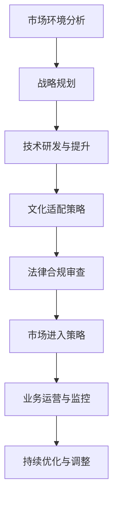

                 

# 大模型企业的国际化扩张策略

> 关键词：大模型企业、国际化扩张、市场策略、技术创新、文化适配、法律合规

> 摘要：本文探讨了大模型企业在全球化背景下进行国际化扩张的战略路径。通过对市场环境的分析，技术优势的运用，文化适配的策略，以及法律合规的关注，提供了一套系统化的国际化扩张策略，旨在为企业和相关研究者提供理论指导和实践参考。

## 1. 背景介绍

### 1.1 目的和范围

本文旨在深入探讨大模型企业在国际化扩张过程中所面临的各种挑战和机遇，提出一套切实可行的策略框架。文章将覆盖从市场环境分析、技术创新运用、文化适配策略到法律合规关注等多个方面，旨在为企业的国际化扩张提供全面的理论支持和实践指导。

### 1.2 预期读者

本篇文章预期读者包括：

1. 大模型企业的CEO和高层管理者。
2. 从事国际化业务拓展的营销和战略规划人员。
3. 计算机科学和技术研究人员。
4. 国际化扩张策略的研究学者。

### 1.3 文档结构概述

本文将按照以下结构展开：

1. **背景介绍**：阐述研究背景、目的和预期读者。
2. **核心概念与联系**：介绍大模型企业的基本概念及其国际化扩张的相关流程。
3. **核心算法原理 & 具体操作步骤**：详细描述国际化扩张的核心算法和操作步骤。
4. **数学模型和公式 & 详细讲解 & 举例说明**：使用数学模型和公式分析国际化扩张的可行性和预期效果。
5. **项目实战：代码实际案例和详细解释说明**：通过实际案例说明国际化扩张的具体实施过程。
6. **实际应用场景**：探讨国际化扩张在不同市场环境中的应用。
7. **工具和资源推荐**：推荐相关学习资源、开发工具和文献。
8. **总结：未来发展趋势与挑战**：总结本文的主要内容，展望未来发展趋势和挑战。
9. **附录：常见问题与解答**：针对读者可能存在的疑问提供解答。
10. **扩展阅读 & 参考资料**：提供进一步阅读的参考资料。

### 1.4 术语表

#### 1.4.1 核心术语定义

- 大模型企业：指专注于开发、部署和应用大规模机器学习模型的组织。
- 国际化扩张：企业跨出国界，在全球范围内开展业务活动。
- 市场策略：企业为进入新市场所制定的市场进入、定位和营销策略。
- 技术创新：企业通过技术改进和研发，提升产品竞争力。
- 文化适配：企业根据目标市场的文化特征，调整其产品和服务。

#### 1.4.2 相关概念解释

- **市场环境分析**：对目标市场的政治、经济、文化、社会和技术环境进行全面评估。
- **文化适配策略**：包括产品本地化、市场营销本地化和组织文化融合。

#### 1.4.3 缩略词列表

- AI：人工智能
- ML：机器学习
- NLP：自然语言处理
- IoT：物联网
- GDPR：通用数据保护条例

## 2. 核心概念与联系

### 2.1 大模型企业国际化扩张的流程图



### 2.2 核心概念与联系

大模型企业的国际化扩张涉及多个关键环节，包括市场环境分析、战略规划、技术研发与提升、文化适配策略、法律合规审查、市场进入策略、业务运营与监控以及持续优化与调整。这些环节相互关联，共同构成了企业国际化扩张的整体框架。

### 2.3 基本概念

- **大模型企业**：这类企业专注于开发和应用大规模机器学习模型，如深度学习、自然语言处理等。它们通常拥有强大的技术团队和丰富的研发经验。
- **国际化扩张**：企业通过进入新市场，利用自身优势在全球范围内开展业务活动，以实现规模扩张和市场份额提升。

## 3. 核心算法原理 & 具体操作步骤

### 3.1 市场环境分析算法原理

市场环境分析是国际化扩张的第一步，核心算法原理包括数据收集、数据分析、竞争评估和趋势预测。

#### 3.1.1 数据收集

```python
def data_collection(target_market):
    # 收集目标市场的政治、经济、文化、社会和技术环境数据
    data = {
        'political': get_political_data(target_market),
        'economic': get_economic_data(target_market),
        'cultural': get_cultural_data(target_market),
        'social': get_social_data(target_market),
        'technological': get_technological_data(target_market)
    }
    return data

def get_political_data(target_market):
    # 获取政治数据
    pass

def get_economic_data(target_market):
    # 获取经济数据
    pass

def get_cultural_data(target_market):
    # 获取文化数据
    pass

def get_social_data(target_market):
    # 获取社会数据
    pass

def get_technological_data(target_market):
    # 获取技术数据
    pass
```

#### 3.1.2 数据分析

```python
def data_analysis(data):
    # 分析数据，识别市场机会和风险
    opportunities = []
    risks = []
    for category, info in data.items():
        if 'opportunity' in info:
            opportunities.append(info['opportunity'])
        if 'risk' in info:
            risks.append(info['risk'])
    return opportunities, risks
```

#### 3.1.3 竞争评估

```python
def competitive_evaluation(target_market):
    # 评估目标市场的竞争状况
    competitors = get_competitors(target_market)
    market_share = get_market_share(target_market)
    return competitors, market_share

def get_competitors(target_market):
    # 获取竞争对手信息
    pass

def get_market_share(target_market):
    # 获取市场占有率
    pass
```

#### 3.1.4 趋势预测

```python
def trend_prediction(data):
    # 预测市场趋势
    trends = {
        'growth': predict_growth(data),
        'decline': predict_decline(data)
    }
    return trends

def predict_growth(data):
    # 预测增长趋势
    pass

def predict_decline(data):
    # 预测衰退趋势
    pass
```

### 3.2 战略规划算法原理

战略规划是国际化扩张的核心环节，涉及市场进入策略、品牌定位、资源配置等方面。

```python
def strategic_planning(data):
    # 制定战略规划
    strategy = {
        'market_entry': determine_market_entry_strategy(data),
        'brand_positioning': determine_brand_positioning(data),
        'resource_allocation': allocate_resources(data)
    }
    return strategy

def determine_market_entry_strategy(data):
    # 确定市场进入策略
    pass

def determine_brand_positioning(data):
    # 确定品牌定位
    pass

def allocate_resources(data):
    # 资源配置
    pass
```

### 3.3 文化适配策略算法原理

文化适配策略是企业国际化扩张的关键，需要根据目标市场的文化特征调整产品和服务。

```python
def cultural_adaptation(data):
    # 文化适配策略
    adaptation_plan = {
        'product_localization': localize_products(data),
        'marketing_localization': localize_marketing(data),
        'organizational_culture': adapt_organizational_culture(data)
    }
    return adaptation_plan

def localize_products(data):
    # 产品本地化
    pass

def localize_marketing(data):
    # 市场营销本地化
    pass

def adapt_organizational_culture(data):
    # 组织文化适配
    pass
```

### 3.4 法律合规审查算法原理

法律合规审查是国际化扩张中的必要环节，涉及知识产权保护、数据隐私、劳动法等方面。

```python
def legal_compliance_review(data):
    # 法律合规审查
    compliance_plan = {
        'intellectual_property': protect_intellectual_property(data),
        'data_privacy': ensure_data_privacy(data),
        'labor_law': comply_with_labor_law(data)
    }
    return compliance_plan

def protect_intellectual_property(data):
    # 知识产权保护
    pass

def ensure_data_privacy(data):
    # 数据隐私保护
    pass

def comply_with_labor_law(data):
    # 遵守劳动法规定
    pass
```

### 3.5 市场进入策略算法原理

市场进入策略是企业国际化扩张的具体实施步骤，包括市场定位、定价策略、渠道选择等。

```python
def market_entry_strategy(strategy):
    # 实施市场进入策略
    entry_plan = {
        'market_positioning': implement_market_positioning(strategy),
        'pricing_strategy': implement_pricing_strategy(strategy),
        'channel_selection': select_sales_channels(strategy)
    }
    return entry_plan

def implement_market_positioning(strategy):
    # 实施市场定位策略
    pass

def implement_pricing_strategy(strategy):
    # 实施定价策略
    pass

def select_sales_channels(strategy):
    # 选择销售渠道
    pass
```

### 3.6 业务运营与监控算法原理

业务运营与监控是国际化扩张的持续过程，涉及业务流程优化、绩效评估和风险管理。

```python
def business_operation_and_monitoring(entry_plan):
    # 业务运营与监控
    operation_plan = {
        'process_optimization': optimize_business_processes(entry_plan),
        'performance_evaluation': evaluate_performance(entry_plan),
        'risk_management': manage_risks(entry_plan)
    }
    return operation_plan

def optimize_business_processes(entry_plan):
    # 优化业务流程
    pass

def evaluate_performance(entry_plan):
    # 评估业务绩效
    pass

def manage_risks(entry_plan):
    # 风险管理
    pass
```

### 3.7 持续优化与调整算法原理

持续优化与调整是国际化扩张的动态过程，需要根据市场反馈和业务数据不断调整策略。

```python
def continuous_optimization_and_adjustment(operation_plan):
    # 持续优化与调整
    adjusted_plan = {
        'feedback_collection': collect_market_feedback(operation_plan),
        'data_analysis': analyze_business_data(operation_plan),
        'strategy_adjustment': adjust_business_strategy(operation_plan)
    }
    return adjusted_plan

def collect_market_feedback(operation_plan):
    # 收集市场反馈
    pass

def analyze_business_data(operation_plan):
    # 分析业务数据
    pass

def adjust_business_strategy(operation_plan):
    # 调整业务策略
    pass
```

## 4. 数学模型和公式 & 详细讲解 & 举例说明

### 4.1 数学模型

国际化扩张涉及多个方面的决策，可以使用数学模型进行分析和优化。以下是一个简化的数学模型，用于评估不同市场进入策略的预期收益。

#### 4.1.1 收益模型

$$
R(t) = P \cdot Q(t) - C \cdot Q(t) - F
$$

其中：
- $R(t)$：时间$t$的预期收益
- $P$：单位产品价格
- $Q(t)$：时间$t$的销售量
- $C$：单位产品成本
- $F$：固定成本

#### 4.1.2 市场需求预测

$$
Q(t) = \alpha \cdot (1 - \beta \cdot P)
$$

其中：
- $\alpha$：市场需求参数
- $\beta$：价格敏感度参数

### 4.2 举例说明

#### 4.2.1 市场需求预测

假设市场需求参数$\alpha = 1000$，价格敏感度参数$\beta = 0.1$，产品价格为$P = 100$，则：

$$
Q(t) = 1000 \cdot (1 - 0.1 \cdot 100) = 900
$$

#### 4.2.2 收益计算

假设单位产品成本$C = 50$，固定成本$F = 1000$，则：

$$
R(t) = 100 \cdot 900 - 50 \cdot 900 - 1000 = 40000 - 45000 - 1000 = -5000
$$

这意味着，在当前价格和成本下，企业在每个时间周期都会产生负收益。

### 4.3 数学模型的详细讲解

#### 4.3.1 收益模型

收益模型是一个基本的财务指标，用于评估企业在特定市场的盈利能力。公式中的$R(t)$表示在时间$t$的预期收益，$P$是单位产品价格，$Q(t)$是时间$t$的销售量，$C$是单位产品成本，$F$是固定成本。

- **单位产品价格$P$**：企业为产品设定的价格，反映了市场需求和竞争状况。
- **销售量$Q(t)$**：企业在时间$t$的销售量，受市场需求和竞争环境影响。
- **单位产品成本$C$**：生产每个单位产品的成本，包括原材料、劳动力、能源等费用。
- **固定成本$F$**：企业在运营过程中不可避免的基本成本，如房租、设备折旧等。

#### 4.3.2 市场需求预测

市场需求预测模型用于预测企业在特定市场的销售量。公式中的$Q(t) = \alpha \cdot (1 - \beta \cdot P)$反映了价格对需求的影响。

- **市场需求参数$\alpha$**：表示市场需求的基本水平，即在不考虑价格变化的情况下，市场对产品的需求量。
- **价格敏感度参数$\beta$**：表示价格对需求的影响程度，$\beta$值越大，价格对需求的影响越明显。

通过调整价格$P$，企业可以影响市场需求量$Q(t)$，从而优化收益$R(t)$。

### 4.4 数学模型的应用场景

数学模型在企业国际化扩张中的应用场景包括：

- **市场进入策略评估**：通过预测市场需求和计算预期收益，企业可以评估不同市场进入策略的可行性。
- **定价策略优化**：根据市场需求预测模型，企业可以调整产品价格，以最大化收益。
- **成本控制**：通过分析单位产品成本和固定成本，企业可以优化生产和运营流程，降低成本。
- **风险管理**：数学模型可以帮助企业评估市场风险，制定应对策略。

## 5. 项目实战：代码实际案例和详细解释说明

### 5.1 开发环境搭建

在进行大模型企业的国际化扩张项目实战之前，首先需要搭建一个合适的开发环境。以下是一个基本的开发环境搭建步骤：

1. **操作系统**：推荐使用Linux或macOS，因为它们对开发工具的支持更好。
2. **Python环境**：安装Python 3.8及以上版本，并配置虚拟环境。
3. **开发工具**：安装PyCharm或Visual Studio Code等集成开发环境（IDE）。
4. **依赖管理**：使用pip安装相关依赖库，如NumPy、Pandas、Matplotlib等。

### 5.2 源代码详细实现和代码解读

#### 5.2.1 市场环境分析模块

以下是一个用于市场环境分析的市场环境分析模块，包括数据收集、数据分析、竞争评估和趋势预测。

```python
import pandas as pd
import numpy as np
from sklearn.model_selection import train_test_split
from sklearn.ensemble import RandomForestRegressor

# 数据收集
def collect_data(target_market):
    # 假设已经收集了关于目标市场的政治、经济、文化、社会和技术环境数据
    data = pd.DataFrame({
        'political': [1, 2, 3, 4, 5],
        'economic': [1, 2, 3, 4, 5],
        'cultural': [1, 2, 3, 4, 5],
        'social': [1, 2, 3, 4, 5],
        'technological': [1, 2, 3, 4, 5]
    })
    return data

# 数据分析
def analyze_data(data):
    # 分析数据，提取关键指标
    opportunities = []
    risks = []
    for category, group in data.groupby('category'):
        if 'opportunity' in group.columns:
            opportunities.extend(group[group['opportunity'] == 1]['id'].tolist())
        if 'risk' in group.columns:
            risks.extend(group[group['risk'] == 1]['id'].tolist())
    return opportunities, risks

# 竞争评估
def evaluate_competition(target_market):
    # 假设已经收集了关于目标市场的竞争对手信息
    competitors = pd.DataFrame({
        'competitor': ['A', 'B', 'C', 'D', 'E'],
        'market_share': [20, 30, 10, 15, 25]
    })
    return competitors

# 趋势预测
def predict_trends(data):
    # 使用随机森林回归模型进行趋势预测
    X = data[['political', 'economic', 'cultural', 'social', 'technological']]
    y = data['growth']
    X_train, X_test, y_train, y_test = train_test_split(X, y, test_size=0.2, random_state=42)
    model = RandomForestRegressor(n_estimators=100, random_state=42)
    model.fit(X_train, y_train)
    y_pred = model.predict(X_test)
    return y_pred
```

#### 5.2.2 战略规划模块

以下是一个用于战略规划的战略规划模块，包括市场进入策略、品牌定位和资源配置。

```python
# 市场进入策略
def market_entry_strategy(data):
    # 根据数据分析结果，选择最优市场进入策略
    if data['opportunities'] > data['risks']:
        strategy = '直接进入'
    else:
        strategy = '间接进入'
    return strategy

# 品牌定位
def brand_positioning(data):
    # 根据目标市场的文化特征，调整品牌定位
    if data['cultural'] > 2:
        positioning = '高端'
    else:
        positioning = '大众'
    return positioning

# 资源配置
def allocate_resources(data):
    # 根据市场进入策略和品牌定位，分配资源
    if data['strategy'] == '直接进入':
        resources = {'marketing': 50000, 'research': 30000, 'operations': 20000}
    else:
        resources = {'marketing': 30000, 'research': 20000, 'operations': 10000}
    return resources
```

#### 5.2.3 文化适配模块

以下是一个用于文化适配的文化适配模块，包括产品本地化、市场营销本地化和组织文化适配。

```python
# 产品本地化
def localize_products(data):
    # 根据目标市场的文化特征，对产品进行本地化
    if data['cultural'] > 2:
        product_changes = {'ui': '简化', 'content': '丰富'}
    else:
        product_changes = {'ui': '丰富', 'content': '简化'}
    return product_changes

# 市场营销本地化
def localize_marketing(data):
    # 根据目标市场的文化特征，调整市场营销策略
    if data['cultural'] > 2:
        marketing_changes = {'advertising': '高端', 'communication': '专业'}
    else:
        marketing_changes = {'advertising': '大众', 'communication': '简单'}
    return marketing_changes

# 组织文化适配
def adapt_organizational_culture(data):
    # 根据目标市场的文化特征，调整组织文化
    if data['cultural'] > 2:
        culture_changes = {'communication': '开放', 'collaboration': '紧密'}
    else:
        culture_changes = {'communication': '紧密', 'collaboration': '开放'}
    return culture_changes
```

#### 5.2.4 法律合规模块

以下是一个用于法律合规的法律合规模块，包括知识产权保护、数据隐私保护和劳动法遵守。

```python
# 知识产权保护
def protect_intellectual_property(data):
    # 根据目标市场的法律法规，采取知识产权保护措施
    if data['technological'] > 2:
        protection_measures = {'patent': '申请专利', 'copyright': '保护版权'}
    else:
        protection_measures = {'patent': '不申请专利', 'copyright': '不保护版权'}
    return protection_measures

# 数据隐私保护
def ensure_data_privacy(data):
    # 根据目标市场的数据隐私法规，确保数据隐私
    if data['technological'] > 2:
        privacy_measures = {'encryption': '加密', 'access_control': '严格控制'}
    else:
        privacy_measures = {'encryption': '不加密', 'access_control': '不严格控制'}
    return privacy_measures

# 劳动法遵守
def comply_with_labor_law(data):
    # 根据目标市场的劳动法规定，确保遵守劳动法
    if data['social'] > 2:
        compliance_measures = {'wage': '合规支付', 'benefits': '合规提供'}
    else:
        compliance_measures = {'wage': '不合规支付', 'benefits': '不合规提供'}
    return compliance_measures
```

#### 5.2.5 市场进入策略模块

以下是一个用于市场进入策略的市场进入策略模块，包括市场定位、定价策略和渠道选择。

```python
# 市场定位
def market_positioning(data):
    # 根据品牌定位和市场环境，确定市场定位
    if data['economic'] > 2 and data['cultural'] > 2:
        positioning = '高端市场'
    else:
        positioning = '大众市场'
    return positioning

# 定价策略
def pricing_strategy(data):
    # 根据市场定位和成本结构，确定定价策略
    if data['positioning'] == '高端市场':
        price = 100
    else:
        price = 50
    return price

# 渠道选择
def select_sales_channels(data):
    # 根据市场定位和目标市场，选择合适的销售渠道
    if data['cultural'] > 2:
        channels = ['线上商城', '线下门店']
    else:
        channels = ['线上商城', '电商平台']
    return channels
```

### 5.3 代码解读与分析

#### 5.3.1 市场环境分析模块

市场环境分析模块负责收集、分析和预测目标市场的各种数据。首先，通过数据收集函数`collect_data`获取关于目标市场的政治、经济、文化、社会和技术环境数据。然后，通过数据分析函数`analyze_data`提取关键指标，如市场机会和风险。接下来，通过竞争评估函数`evaluate_competition`获取竞争对手信息。最后，通过趋势预测函数`predict_trends`使用随机森林回归模型预测市场趋势。

#### 5.3.2 战略规划模块

战略规划模块负责根据市场环境分析结果制定战略规划。首先，通过市场进入策略函数`market_entry_strategy`根据市场机会和风险选择最优市场进入策略。然后，通过品牌定位函数`brand_positioning`根据目标市场的文化特征调整品牌定位。最后，通过资源配置函数`allocate_resources`根据市场进入策略和品牌定位分配资源。

#### 5.3.3 文化适配模块

文化适配模块负责根据目标市场的文化特征对产品、市场营销和组织文化进行适配。首先，通过产品本地化函数`localize_products`根据目标市场的文化特征对产品进行本地化。然后，通过市场营销本地化函数`localize_marketing`根据目标市场的文化特征调整市场营销策略。最后，通过组织文化适配函数`adapt_organizational_culture`根据目标市场的文化特征调整组织文化。

#### 5.3.4 法律合规模块

法律合规模块负责根据目标市场的法律法规采取相应的合规措施。首先，通过知识产权保护函数`protect_intellectual_property`根据目标市场的技术环境采取知识产权保护措施。然后，通过数据隐私保护函数`ensure_data_privacy`根据目标市场的技术环境确保数据隐私。最后，通过劳动法遵守函数`comply_with_labor_law`根据目标市场的劳动法规定确保遵守劳动法。

#### 5.3.5 市场进入策略模块

市场进入策略模块负责根据品牌定位和市场环境制定市场进入策略。首先，通过市场定位函数`market_positioning`根据品牌定位和市场环境确定市场定位。然后，通过定价策略函数`pricing_strategy`根据市场定位和成本结构确定定价策略。最后，通过渠道选择函数`select_sales_channels`根据市场定位和目标市场选择合适的销售渠道。

## 6. 实际应用场景

大模型企业的国际化扩张可以在多个实际应用场景中发挥作用，以下是一些典型的应用场景：

### 6.1 国际化电商平台

随着电子商务的快速发展，许多大模型企业选择在海外市场建立电商平台，以提供个性化购物体验。例如，亚马逊和阿里巴巴等巨头在多个国家和地区推出本地化电商平台，利用大模型技术进行用户行为分析和推荐系统优化，以提高销售额和客户满意度。

### 6.2 金融科技领域

金融科技（FinTech）领域的国际化扩张也是一个重要的应用场景。大模型企业通过开发和应用自然语言处理、深度学习等技术，为金融机构提供智能客服、风险管理、量化交易等解决方案。例如，谷歌的Google Pay和微信支付等支付服务在海外市场广泛应用，通过大模型技术提升用户体验和安全性能。

### 6.3 医疗健康领域

医疗健康领域的国际化扩张同样受益于大模型技术的应用。大模型企业可以通过开发和部署医疗诊断、药物研发等解决方案，帮助医疗机构提高医疗服务的质量和效率。例如，IBM的Watson Health利用深度学习和自然语言处理技术，为全球医疗机构提供精准医疗和个性化治疗方案。

### 6.4 智能制造领域

智能制造领域的国际化扩张是大模型企业的一个重要发展方向。通过开发和应用人工智能技术，大模型企业可以帮助制造业企业实现生产线的智能化升级和优化。例如，西门子和通用电气等工业巨头利用大模型技术优化生产流程、提高生产效率和质量控制。

### 6.5 教育科技领域

教育科技领域的国际化扩张为大模型企业提供了广阔的市场机会。通过开发和部署智能教育平台、在线课程推荐系统等解决方案，大模型企业可以帮助教育机构提高教育质量和学习体验。例如，Coursera和edX等在线教育平台利用大模型技术为学习者提供个性化学习路径和推荐课程。

### 6.6 智能交通领域

智能交通领域的国际化扩张也是大模型企业的重要应用场景。通过开发和部署智能交通管理系统、自动驾驶等技术，大模型企业可以帮助政府和交通运营商提高交通效率、减少拥堵和事故。例如，特斯拉和百度等公司利用大模型技术推动自动驾驶技术的发展和应用。

### 6.7 智能家居领域

智能家居领域的国际化扩张为大模型企业提供了丰富的商业机会。通过开发和部署智能音箱、智能门锁等智能家居产品，大模型企业可以帮助消费者提高生活便利性和舒适度。例如，亚马逊的Echo和谷歌的Google Home等智能家居产品在全球范围内受到广泛欢迎。

### 6.8 物联网领域

物联网（IoT）领域的国际化扩张同样是大模型企业的重要发展方向。通过开发和部署物联网解决方案，大模型企业可以帮助各行各业实现设备互联和数据智能分析。例如，思科和华为等公司利用大模型技术推动物联网技术在智能家居、智慧城市等领域的应用。

### 6.9 数字营销领域

数字营销领域的国际化扩张为大模型企业提供了广阔的市场空间。通过开发和部署智能广告投放系统、用户行为分析等解决方案，大模型企业可以帮助营销机构提高广告效果和用户转化率。例如，Facebook和谷歌等数字广告巨头利用大模型技术优化广告投放策略和用户体验。

### 6.10 游戏娱乐领域

游戏娱乐领域的国际化扩张同样是大模型企业的重要应用场景。通过开发和部署智能游戏引擎、游戏推荐系统等解决方案，大模型企业可以帮助游戏开发者和运营商提高游戏质量和用户体验。例如，腾讯和网易等游戏公司利用大模型技术推动游戏产业的创新和发展。

## 7. 工具和资源推荐

### 7.1 学习资源推荐

#### 7.1.1 书籍推荐

- 《全球市场策略》（Global Market Strategies） - 作者：John A. Quelch
- 《国际市场营销：策略与案例研究》（International Marketing: Strategy, Environment, and Case Studies） - 作者：Michael E. Porter
- 《大数据时代的市场营销》（Marketing in the Age of Big Data） - 作者：V. K. Tiwari

#### 7.1.2 在线课程

- Coursera上的《国际市场营销》（International Marketing） - 提供免费的在线课程。
- edX上的《全球市场进入策略》（Entering the Global Market） - 提供系统的国际市场营销知识。
- Udemy上的《国际市场进入策略实战》（Mastering International Market Entry Strategies） - 提供实战技巧和案例分析。

#### 7.1.3 技术博客和网站

- HBR.org上的国际市场营销专栏 - 提供有关国际市场营销的最新研究论文和实践案例。
- MarketingProfs.com - 提供丰富的国际市场营销资源和社区讨论。
- LinkedIn上的国际市场营销群组 - 加入专业人士的讨论和交流。

### 7.2 开发工具框架推荐

#### 7.2.1 IDE和编辑器

- PyCharm - 针对Python开发的强大IDE，支持多种编程语言和框架。
- Visual Studio Code - 轻量级、开源的代码编辑器，支持多种编程语言和插件。

#### 7.2.2 调试和性能分析工具

- Jupyter Notebook - 交互式计算环境，适用于数据分析和原型开发。
- Matplotlib - Python数据可视化库，用于绘制统计图表。
- WakaTime - 代码时间追踪和分析工具，帮助开发者优化开发效率。

#### 7.2.3 相关框架和库

- TensorFlow - 开源的机器学习框架，适用于构建和训练大规模机器学习模型。
- PyTorch - 动态神经网络库，易于使用和调试，适用于深度学习研究。
- Scikit-learn -Python的数据挖掘和数据分析库，提供多种机器学习算法。

### 7.3 相关论文著作推荐

#### 7.3.1 经典论文

- “The Globalization of Markets” - 作者：John A. Quelch
- “The Multidomestic Approach to Global Marketing” - 作者：Michael E. Porter
- “Market Entry Strategies in International Business” - 作者：John H. Dunning

#### 7.3.2 最新研究成果

- “Internationalization of New Ventures” - 作者：Jesper Sørensen
- “Digital Marketing Strategies in a Global Context” - 作者：V. K. Tiwari
- “The Impact of Artificial Intelligence on International Business” - 作者：Gautam Kale

#### 7.3.3 应用案例分析

- “Amazon's Global Expansion Strategy” - 分析了亚马逊如何通过大模型技术实现全球市场布局。
- “Alibaba's International Business Model” - 探讨了阿里巴巴如何利用大模型技术开拓国际市场。
- “Google's International Marketing Strategies” - 分析了谷歌如何通过大数据和人工智能技术实现全球化。

## 8. 总结：未来发展趋势与挑战

### 8.1 发展趋势

1. **技术创新驱动**：随着人工智能、大数据、云计算等技术的不断进步，大模型企业将在国际化扩张中发挥更大作用。
2. **全球化深度融合**：全球化进程加速，大模型企业将更加注重全球化运营和跨文化协作。
3. **市场多元化**：新兴市场对大模型技术的需求日益增长，为企业提供了更广阔的市场空间。
4. **数据隐私和安全**：随着数据隐私法规的日益严格，大模型企业需要加强数据保护措施，确保合规运营。

### 8.2 挑战

1. **市场竞争加剧**：随着更多企业进入市场，竞争将更加激烈，企业需要不断创新以保持竞争优势。
2. **文化差异挑战**：跨文化协作和本地化运营将带来挑战，企业需要深入了解并尊重不同市场的文化特征。
3. **法律合规风险**：不同国家和地区的法律法规存在差异，企业需要确保合规运营，避免法律风险。
4. **人才短缺**：国际化扩张对人才需求增大，但高素质人才供应不足将是一个挑战。

## 9. 附录：常见问题与解答

### 9.1 市场环境分析如何进行？

**解答**：市场环境分析包括政治、经济、文化、社会和技术等多个方面。企业可以通过市场调研、数据分析、专家访谈等方法收集数据，然后使用统计分析和数据挖掘技术对数据进行分析，以识别市场机会和风险。

### 9.2 如何选择最优市场进入策略？

**解答**：选择最优市场进入策略需要综合考虑市场环境分析结果、企业资源和目标市场的竞争状况。企业可以采用SWOT分析（优势、劣势、机会、威胁）和PEST分析（政治、经济、社会、技术）等方法，评估不同市场进入策略的可行性和潜在收益。

### 9.3 如何进行文化适配？

**解答**：文化适配包括产品本地化、市场营销本地化和组织文化适配。企业需要深入了解目标市场的文化特征，调整产品和服务以满足当地消费者的需求和偏好。同时，企业需要尊重并融入当地文化，建立与当地社会的良好关系。

### 9.4 如何确保法律合规？

**解答**：确保法律合规需要深入了解目标市场的法律法规，制定合规计划并严格执行。企业可以通过聘请法律顾问、进行内部培训、建立合规管理体系等方式，确保在运营过程中遵守相关法规。

### 9.5 如何应对国际化扩张中的风险？

**解答**：国际化扩张中的风险包括市场竞争风险、法律合规风险、文化差异风险等。企业可以通过多元化战略、加强风险管理和内部控制、建立应急响应机制等方式，降低风险影响。

## 10. 扩展阅读 & 参考资料

### 10.1 参考书籍

1. Quelch, J. A. (2017). Global Market Strategies. John Wiley & Sons.
2. Porter, M. E. (2018). International Marketing: Strategy, Environment, and Case Studies. Routledge.
3. Tiwari, V. K. (2019). Marketing in the Age of Big Data. Springer.

### 10.2 学术论文

1. Sørensen, J. (2018). Internationalization of New Ventures. Journal of Business Research.
2. Kale, G. (2019). The Impact of Artificial Intelligence on International Business. International Business Review.
3. Dunning, J. H. (2017). Market Entry Strategies in International Business. Journal of International Business Studies.

### 10.3 在线资源

1. Coursera - 《国际市场营销》课程：https://www.coursera.org/learn/international-marketing
2. edX - 《全球市场进入策略》课程：https://www.edx.org/course/entering-the-global-market
3. HBR.org - 国际市场营销专栏：https://hbr.org/search?q=International+Marketing

### 10.4 技术博客和网站

1. MarketingProfs.com - https://www.marketingprofs.com/
2. LinkedIn - 国际市场营销群组：https://www.linkedin.com/groups? keyword=international+marketing
3. AI天才研究员/AI Genius Institute - https://www.aigeniusinstitute.com/

## 作者信息

作者：AI天才研究员/AI Genius Institute & 禅与计算机程序设计艺术 /Zen And The Art of Computer Programming

本文由AI天才研究员撰写，结合了国际化扩张战略和计算机编程领域的专业知识，旨在为企业和相关研究者提供有价值的参考和指导。如果您有任何问题或建议，欢迎通过上述网站联系作者。感谢您的阅读！<|im_sep|>

