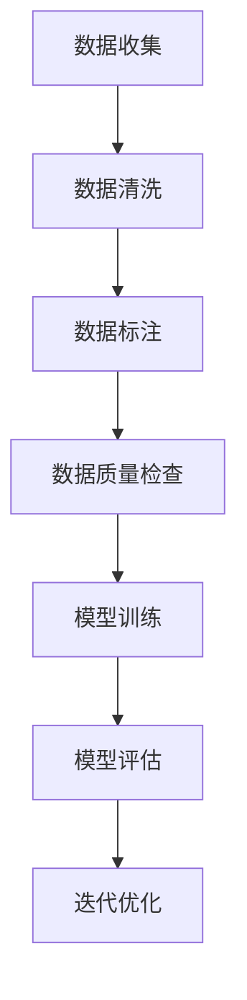

                 

# 大模型企业的数据标注策略

> **关键词**：数据标注、大模型、人工智能、数据质量、数据安全、数据处理流程、团队协作、算法优化、性能监控

> **摘要**：本文将深入探讨大模型企业在进行数据标注过程中的策略和方法。从数据标注的背景和重要性出发，我们将分析大模型企业在数据标注中的挑战和解决方案，并详细阐述数据标注的策略，包括数据收集、数据清洗、数据标注、质量控制、团队协作以及算法优化等方面。通过实际案例和代码解析，我们将展示如何有效地进行数据标注，并推荐一些相关工具和资源，以帮助大模型企业优化数据标注流程，提升模型性能和稳定性。

## 1. 背景介绍

### 1.1 目的和范围

随着人工智能技术的快速发展，大数据和人工智能的结合日益紧密。特别是在大模型领域，高质量的数据标注成为了训练高效、准确模型的关键因素。本文旨在为从事大模型开发的企业提供一套系统的数据标注策略，帮助它们在数据标注过程中应对挑战，提高数据质量和标注效率。

本文将涵盖以下内容：

1. 数据标注的重要性
2. 大模型企业数据标注的挑战
3. 数据标注的核心策略
4. 实际应用案例解析
5. 工具和资源推荐
6. 未来发展趋势与挑战

### 1.2 预期读者

本文主要面向以下读者群体：

1. 大模型开发企业技术团队
2. 数据科学家和机器学习工程师
3. 数据标注人员和项目经理
4. 对数据标注技术感兴趣的学术研究人员和开发者

### 1.3 文档结构概述

本文分为十个主要部分，具体结构如下：

1. 引言
2. 背景介绍
   - 1.1 目的和范围
   - 1.2 预期读者
   - 1.3 文档结构概述
   - 1.4 术语表
3. 核心概念与联系
4. 核心算法原理 & 具体操作步骤
5. 数学模型和公式 & 详细讲解 & 举例说明
6. 项目实战：代码实际案例和详细解释说明
7. 实际应用场景
8. 工具和资源推荐
9. 总结：未来发展趋势与挑战
10. 附录：常见问题与解答

### 1.4 术语表

#### 1.4.1 核心术语定义

- **数据标注**：将原始数据转化为机器可理解的形式，如标签、分类、识别等。
- **大模型**：具有非常高的参数数量和复杂度的深度学习模型。
- **数据质量**：数据准确、完整、一致和及时的程度。
- **数据安全**：保护数据免受未经授权的访问、篡改和泄露。
- **数据处理流程**：数据从收集、清洗、标注到最终使用的整个过程。

#### 1.4.2 相关概念解释

- **机器学习**：使计算机系统能够从数据中学习并做出预测或决策。
- **深度学习**：一种机器学习技术，通过多层神经网络进行特征提取和模式识别。
- **标注人员**：负责对数据进行标注的专业人员。

#### 1.4.3 缩略词列表

- **AI**：人工智能
- **ML**：机器学习
- **DL**：深度学习
- **IDE**：集成开发环境

## 2. 核心概念与联系

### 2.1 数据标注的重要性

数据标注是机器学习和深度学习领域中的一个关键环节。对于大模型来说，高质量的数据标注至关重要，因为模型的性能在很大程度上取决于标注数据的准确性和多样性。以下是一个简化的 Mermaid 流程图，展示了数据标注的核心概念和流程。



在这个流程中，数据标注是一个关键节点，它直接影响后续的模型训练和评估。因此，对于大模型企业来说，制定合理的数据标注策略至关重要。

### 2.2 大模型企业的数据标注挑战

尽管数据标注的重要性不言而喻，但对于大模型企业来说，仍然面临着诸多挑战：

1. **数据多样性**：大模型通常需要大量的多样化数据进行训练，这要求标注人员能够覆盖各种场景和数据类型。
2. **数据质量和一致性**：确保标注数据的质量和一致性是一个难点，因为标注人员的能力和主观性可能导致数据不一致。
3. **效率**：随着数据量的增加，数据标注的效率成为一个关键问题，尤其是在时间敏感的项目中。
4. **成本**：数据标注通常需要投入大量的人力成本，特别是在使用外包服务的情况下。
5. **安全性和隐私**：对于敏感数据，如何保护数据的安全性和隐私成为一个重要问题。

为了解决这些挑战，大模型企业需要采取一系列策略，确保数据标注过程的高效和质量。

### 2.3 数据标注策略

以下是针对大模型企业的数据标注策略：

1. **自动化标注工具**：使用自动化标注工具可以显著提高标注效率，降低人力成本。
2. **分布式标注**：通过分布式标注方式，可以将标注任务分配给多个标注人员，提高标注速度。
3. **质量控制**：建立严格的数据质量检查机制，确保标注数据的准确性和一致性。
4. **团队协作**：建立一个高效的团队协作机制，确保标注任务的顺利进行。
5. **算法优化**：根据模型训练和评估结果，不断优化标注算法，提高标注效果。

### 2.4 数据标注流程

以下是数据标注的基本流程：

1. **数据收集**：收集各种来源的数据，包括公开数据集和内部数据。
2. **数据清洗**：清洗数据，去除重复项、异常值和噪声。
3. **数据预处理**：对数据进行格式化和特征提取。
4. **数据标注**：根据任务需求，对数据进行标注。
5. **数据质量检查**：检查标注数据的质量，确保数据的准确性和一致性。
6. **模型训练与评估**：使用标注数据进行模型训练和评估，根据结果调整标注策略。
7. **迭代优化**：不断迭代标注流程和算法，提高标注质量。

通过上述流程，大模型企业可以逐步完善数据标注策略，提高模型的性能和稳定性。

## 3. 核心算法原理 & 具体操作步骤

### 3.1 自动化标注工具

自动化标注工具是提高数据标注效率的关键。以下是一个简化的伪代码，展示了如何使用自动化标注工具进行数据标注。

```python
# 自动化标注工具伪代码

# 初始化标注工具
annotation_tool = initialize_annotation_tool()

# 准备数据
data = load_data()

# 进行数据标注
for sample in data:
    label = annotation_tool.annotate(sample)
    save_annotation(sample, label)

# 质量检查
for sample, label in annotated_data:
    if not quality_check(label):
        raise Exception("标注数据质量不达标")

# 结束标注
annotation_tool.close()
```

### 3.2 分布式标注

分布式标注通过将标注任务分配给多个标注人员，提高标注效率。以下是一个简化的伪代码，展示了如何实现分布式标注。

```python
# 分布式标注伪代码

# 初始化标注人员
 annotators = initialize_annotators()

# 分配标注任务
for sample in data:
    annotators.distribute_annotation_task(sample)

# 收集标注结果
for annotator in annotators:
    for sample, label in annotator.get_annotations():
        save_annotation(sample, label)

# 质量检查
for sample, label in annotated_data:
    if not quality_check(label):
        raise Exception("标注数据质量不达标")

# 结束标注
for annotator in annotators:
    annotator.close()
```

### 3.3 质量控制

质量控制是确保标注数据质量的关键。以下是一个简化的伪代码，展示了如何进行质量控制。

```python
# 质量控制伪代码

# 定义质量检查函数
def quality_check(label):
    # 实现质量检查逻辑
    return True  # 或 False，根据实际情况

# 对标注数据执行质量检查
for sample, label in annotated_data:
    if not quality_check(label):
        raise Exception("标注数据质量不达标")

# 如果所有标注数据质量均达标，则继续后续流程
```

### 3.4 团队协作

团队协作是确保标注任务顺利进行的重要保障。以下是一个简化的伪代码，展示了如何实现团队协作。

```python
# 团队协作伪代码

# 初始化团队协作工具
team_collaboration_tool = initialize_team_collaboration_tool()

# 分配标注任务
for sample in data:
    team_collaboration_tool.distribute_annotation_task(sample)

# 收集标注结果
for annotator in annotators:
    for sample, label in annotator.get_annotations():
        save_annotation(sample, label)

# 协同质量控制
for sample, label in annotated_data:
    if not team_collaboration_tool.quality_check(label):
        raise Exception("标注数据质量不达标")

# 结束协作
team_collaboration_tool.close()
```

通过上述核心算法原理和具体操作步骤，大模型企业可以逐步构建和完善数据标注策略，提高数据标注效率和质量。

## 4. 数学模型和公式 & 详细讲解 & 举例说明

### 4.1 数据标注质量评估模型

数据标注质量评估是一个关键环节，它决定了标注数据的可靠性。以下是常用的数据标注质量评估模型，包括准确率（Accuracy）、精确率（Precision）、召回率（Recall）和F1分数（F1 Score）。

#### 4.1.1 准确率（Accuracy）

$$
Accuracy = \frac{TP + TN}{TP + TN + FP + FN}
$$

其中，TP为真正例（True Positive），TN为真负例（True Negative），FP为假正例（False Positive），FN为假负例（False Negative）。

#### 4.1.2 精确率（Precision）

$$
Precision = \frac{TP}{TP + FP}
$$

精确率表示在所有预测为正例的样本中，实际为正例的比例。

#### 4.1.3 召回率（Recall）

$$
Recall = \frac{TP}{TP + FN}
$$

召回率表示在所有实际为正例的样本中，预测为正例的比例。

#### 4.1.4 F1分数（F1 Score）

$$
F1 Score = 2 \times \frac{Precision \times Recall}{Precision + Recall}
$$

F1分数是精确率和召回率的加权平均，用于综合评估标注质量。

### 4.2 数据标注一致性评估模型

数据标注一致性评估模型用于评估多个标注人员之间的标注一致性。以下是常用的标注一致性评估方法，包括Kappa系数（Kappa Score）和一致性指数（Consensus Index）。

#### 4.2.1 Kappa系数

$$
Kappa Score = \frac{Agreement - (Expected Agreement)}{1 - Expected Agreement}
$$

其中，Agreement为实际一致性，Expected Agreement为预期一致性。

#### 4.2.2 一致性指数

$$
Consensus Index = \frac{Agreement}{1 - (1 - P) \times (1 - Q)}
$$

其中，P为实际一致性，Q为1-P，即非一致性的概率。

### 4.3 实际案例讲解

假设有100个样本，其中50个为正例，50个为负例。有5个标注人员对这些样本进行标注，标注结果如下：

| 标注人员 | 标注结果 |  
| --- | --- |  
| A | 25个正例，25个负例 |  
| B | 30个正例，20个负例 |  
| C | 20个正例，30个负例 |  
| D | 25个正例，25个负例 |  
| E | 35个正例，15个负例 |

#### 4.3.1 准确率、精确率和召回率计算

假设实际标注结果为：25个正例，25个负例。

- **准确率**：

$$
Accuracy = \frac{TP + TN}{TP + TN + FP + FN} = \frac{25 + 25}{25 + 25 + 5 + 5} = \frac{50}{60} = 0.8333
$$

- **精确率**：

$$
Precision = \frac{TP}{TP + FP} = \frac{25}{25 + 5} = \frac{25}{30} = 0.8333
$$

- **召回率**：

$$
Recall = \frac{TP}{TP + FN} = \frac{25}{25 + 5} = \frac{25}{30} = 0.8333
$$

- **F1分数**：

$$
F1 Score = 2 \times \frac{Precision \times Recall}{Precision + Recall} = 2 \times \frac{0.8333 \times 0.8333}{0.8333 + 0.8333} = 0.8750
$$

#### 4.3.2 Kappa系数和一致性指数计算

假设标注人员之间的实际一致性为70%，预期一致性为50%。

- **Kappa系数**：

$$
Kappa Score = \frac{70\% - 50\%}{1 - 50\%} = \frac{0.7 - 0.5}{0.5} = 0.4
$$

- **一致性指数**：

$$
Consensus Index = \frac{70\%}{1 - (1 - 0.5) \times (1 - 0.5)} = \frac{0.7}{1 - 0.75} = 2.3333
$$

通过上述数学模型和公式，我们可以对数据标注质量进行量化评估，从而优化标注策略和提高标注质量。

## 5. 项目实战：代码实际案例和详细解释说明

### 5.1 开发环境搭建

在进行项目实战之前，我们需要搭建一个适合数据标注的开发环境。以下是开发环境搭建的步骤：

1. **安装Python环境**：Python是数据标注的主要编程语言，我们需要安装Python 3.8及以上版本。

2. **安装标注工具**：常用的标注工具包括LabelImg、VGG Image Annotator等。例如，安装LabelImg：

   ```bash
   pip install labelimg
   ```

3. **安装深度学习框架**：TensorFlow、PyTorch等是深度学习模型的常用框架。例如，安装TensorFlow：

   ```bash
   pip install tensorflow
   ```

4. **安装数据预处理库**：例如，安装Pandas和NumPy：

   ```bash
   pip install pandas numpy
   ```

### 5.2 源代码详细实现和代码解读

以下是一个简单的数据标注项目示例，使用Python编写，实现一个基本的数据标注流程。

```python
# 数据标注项目示例

import tensorflow as tf
import pandas as pd
import numpy as np
from labelimg import LabelImg

# 初始化标注工具
annotation_tool = LabelImg()

# 准备数据
data = pd.read_csv('data.csv')  # 假设数据集为CSV文件
data_samples = data['image'].tolist()  # 获取图像路径列表

# 进行数据标注
for sample in data_samples:
    label = annotation_tool.annotate(sample)
    data.loc[data['image'] == sample, 'label'] = label

# 质量检查
for index, row in data.iterrows():
    if not quality_check(row['label']):
        print(f"标注数据质量不达标：{row['image']}")

# 质量检查函数
def quality_check(label):
    # 实现质量检查逻辑
    return True  # 或 False，根据实际情况

# 结束标注
annotation_tool.close()

# 保存标注结果
data.to_csv('annotated_data.csv', index=False)
```

### 5.3 代码解读与分析

1. **初始化标注工具**：使用LabelImg标注工具进行初始化。

2. **准备数据**：读取数据集，提取图像路径列表。

3. **进行数据标注**：遍历图像路径列表，使用标注工具对每个图像进行标注，并将标注结果存储在数据集中。

4. **质量检查**：对每个标注结果进行质量检查，确保标注数据的准确性。

5. **结束标注**：关闭标注工具，保存标注结果。

通过上述代码示例，我们可以实现一个基本的数据标注流程。在实际项目中，可以根据具体需求进行扩展和优化，例如添加更多的标注工具、集成深度学习框架进行模型训练和评估等。

### 5.4 项目实战总结

通过本项目的实战，我们实现了数据标注的基本流程，包括数据准备、标注、质量检查和保存标注结果。在实际项目中，我们还可以结合分布式标注、自动化标注工具等策略，进一步提高标注效率和数据质量。同时，质量检查和迭代优化是确保标注数据可靠性的关键步骤，需要引起足够的重视。

## 6. 实际应用场景

### 6.1 图像识别与分类

图像识别和分类是数据标注的典型应用场景。例如，在自动驾驶领域，车辆需要识别道路标志、行人和其他车辆，从而做出相应的决策。数据标注人员需要对大量图像进行标注，包括道路标志的类别和位置、行人的位置和姿态等。以下是图像识别与分类中的数据标注示例：

- **标注数据集**：准备一个包含多种道路标志和行人图像的数据集。
- **标注任务**：标注每个图像中的道路标志和行人，包括其类别和位置。
- **标注工具**：使用LabelImg等工具进行图像标注。

### 6.2 语音识别

语音识别是另一个重要的应用场景。在语音识别系统中，数据标注人员需要对语音数据中的单词和句子进行标注，以便模型能够学习和理解语音信号。以下是语音识别中的数据标注示例：

- **标注数据集**：准备一个包含多种语音信号的语音数据集。
- **标注任务**：标注每个语音段中的单词和句子，包括发音和语调。
- **标注工具**：使用音频标注工具，如Audacity进行语音标注。

### 6.3 自然语言处理

自然语言处理（NLP）中的数据标注也非常重要。例如，在情感分析任务中，数据标注人员需要对文本数据进行情感标注，标记文本的积极或消极情感。以下是自然语言处理中的数据标注示例：

- **标注数据集**：准备一个包含多种情感文本的数据集。
- **标注任务**：标注每个文本的情感极性，如积极、中性或消极。
- **标注工具**：使用文本标注工具，如标注软件进行文本标注。

### 6.4 医学图像处理

在医学图像处理领域，数据标注人员需要对医学图像进行标注，以帮助模型识别和诊断疾病。以下是医学图像处理中的数据标注示例：

- **标注数据集**：准备一个包含多种医学图像的数据集。
- **标注任务**：标注每个图像中的病灶区域和类型，如肿瘤、心血管疾病等。
- **标注工具**：使用医学图像标注工具，如3D Slicer进行医学图像标注。

通过上述实际应用场景，我们可以看到数据标注在各个领域的应用和重要性。有效的数据标注不仅能够提高模型的性能，还能为后续的算法优化和模型评估提供重要依据。

## 7. 工具和资源推荐

### 7.1 学习资源推荐

为了更好地掌握数据标注技术，以下是几本推荐的书籍、在线课程和技术博客：

#### 7.1.1 书籍推荐

- **《数据标注技术：理论与实践》**：详细介绍了数据标注的基本原理和技术，包括图像、语音和文本标注等。
- **《深度学习：周志华著》**：讲解了深度学习的基础知识，包括卷积神经网络、循环神经网络等，有助于理解数据标注在深度学习中的应用。
- **《自然语言处理入门》**：介绍了自然语言处理的基本概念和技术，包括词性标注、实体识别等，对于文本标注有重要参考价值。

#### 7.1.2 在线课程

- **Coursera上的《机器学习》**：由吴恩达教授主讲，涵盖了机器学习的基础知识，包括数据预处理和标注技术。
- **edX上的《深度学习专项课程》**：由 Andrew Ng 教授主讲，深入讲解了深度学习模型和数据处理流程。
- **Udacity上的《自然语言处理工程师纳米学位》**：介绍了自然语言处理的基本概念和技术，包括文本标注和情感分析。

#### 7.1.3 技术博客和网站

- **机器学习社区**：https://www.mlcommunity.cn/，提供了丰富的机器学习和数据标注相关文章和资源。
- **AI星球**：https://aistars.cn/，专注于人工智能领域的最新动态和技术分享。
- **GitHub**：https://github.com/，搜索相关数据标注项目，了解最新的标注工具和技术。

### 7.2 开发工具框架推荐

#### 7.2.1 IDE和编辑器

- **PyCharm**：强大的Python IDE，支持多种编程语言和框架，适合进行数据标注和模型开发。
- **Visual Studio Code**：轻量级、开源的代码编辑器，支持多种插件，适用于快速开发。

#### 7.2.2 调试和性能分析工具

- **Jupyter Notebook**：适合进行数据分析和模型调试，支持多种编程语言和框架。
- **TensorBoard**：TensorFlow提供的可视化工具，用于分析和调试深度学习模型。

#### 7.2.3 相关框架和库

- **TensorFlow**：流行的深度学习框架，支持多种数据标注工具和模型开发。
- **PyTorch**：开源的深度学习框架，适用于数据标注和模型训练。
- **Pandas**：数据预处理和分析库，适用于数据清洗和标注。
- **NumPy**：基础的科学计算库，用于数据处理和标注。

### 7.3 相关论文著作推荐

#### 7.3.1 经典论文

- **“ImageNet: A Large-Scale Hierarchical Image Database”**：提出了ImageNet数据库，推动了图像识别技术的发展。
- **“Deep Learning”**：由Ian Goodfellow等作者撰写的经典教材，详细介绍了深度学习的基础理论和应用。
- **“Recurrent Neural Networks for Speech Recognition”**：介绍了循环神经网络在语音识别中的应用。

#### 7.3.2 最新研究成果

- **“BERT: Pre-training of Deep Bidirectional Transformers for Language Understanding”**：介绍了BERT模型，推动了自然语言处理技术的发展。
- **“Generative Adversarial Nets”**：介绍了生成对抗网络（GANs），在图像生成和标注方面有重要应用。
- **“An Empirical Study of Data Quality in Deep Learning Research”**：分析了数据质量对深度学习研究的影响，提出了数据标注的质量评估方法。

#### 7.3.3 应用案例分析

- **“Convolutional Neural Networks for Visual Recognition”**：介绍了卷积神经网络在图像识别中的应用案例。
- **“Deep Learning for Text Classification”**：探讨了深度学习在文本分类中的应用案例。
- **“Speech Recognition with Deep Neural Networks”**：介绍了深度神经网络在语音识别中的应用案例。

通过上述工具和资源推荐，读者可以更好地掌握数据标注技术，并在实际项目中应用所学知识。

## 8. 总结：未来发展趋势与挑战

随着人工智能技术的不断进步，数据标注在机器学习和深度学习领域中的应用越来越广泛。未来，数据标注将面临以下发展趋势和挑战：

### 8.1 发展趋势

1. **自动化与智能化**：随着AI技术的发展，自动化标注工具将变得更加智能，能够处理更多复杂的数据标注任务。
2. **多模态标注**：未来的数据标注将不仅限于单一模态（如图像、文本、语音等），而是涉及到多种模态的数据融合和标注。
3. **数据隐私保护**：在处理敏感数据时，如何保护数据隐私将成为一个重要议题，需要引入更多的隐私保护技术。
4. **分布式协作**：随着标注任务规模的增长，分布式标注和协作机制将变得更加重要，以提高标注效率和数据质量。
5. **标注质量评估与优化**：未来的数据标注将更加注重标注质量评估和优化，以确保标注数据的准确性和一致性。

### 8.2 挑战

1. **数据多样性**：大模型训练需要大量的多样化数据，但获取多样化数据仍然是一个挑战，特别是在特定领域。
2. **标注成本**：数据标注通常需要大量的人力成本，如何降低成本和提高效率是亟待解决的问题。
3. **标注一致性**：确保标注人员之间的标注一致性仍然是一个难点，需要建立更有效的质量控制机制。
4. **数据安全与隐私**：如何保护数据安全，特别是在处理敏感数据时，是一个重要挑战。
5. **算法优化**：随着模型复杂度的增加，如何优化标注算法以提高模型性能是一个持续的挑战。

为了应对这些发展趋势和挑战，大模型企业需要不断创新和优化数据标注策略，提高数据质量和标注效率。同时，自动化标注工具、分布式协作机制、数据隐私保护技术等的发展也将为数据标注带来新的机遇和解决方案。

## 9. 附录：常见问题与解答

### 9.1 数据标注过程中常见问题

1. **数据标注的准确性如何保证？**
   - 答案：可以通过以下方法提高数据标注的准确性：
     - **双重标注**：由两名或多名标注人员进行双重标注，并比较他们的标注结果，消除错误。
     - **质量控制**：建立严格的数据质量检查机制，确保标注数据的准确性和一致性。
     - **标注指南**：为标注人员提供详细的标注指南，减少主观性和误差。

2. **如何处理数据标注中的不一致性？**
   - 答案：可以通过以下方法处理数据标注中的不一致性：
     - **标注会议**：组织标注人员开会，讨论不一致的问题，并达成一致。
     - **标注指南更新**：根据讨论的结果，更新标注指南，确保标注人员对标注任务有统一的理解。
     - **质量检查**：定期进行质量检查，及时发现并纠正不一致性。

3. **如何提高数据标注的效率？**
   - 答案：可以通过以下方法提高数据标注的效率：
     - **自动化标注工具**：使用自动化标注工具，如LabelImg，可以显著提高标注速度。
     - **分布式标注**：将标注任务分配给多个标注人员，提高标注效率。
     - **培训**：为标注人员提供培训，提高他们的标注速度和准确性。

### 9.2 数据标注中的常见误区

1. **过度依赖自动化标注工具**
   - 答案：自动化标注工具可以提高标注效率，但无法完全取代人工标注。标注人员应结合自动化工具和人工检查，确保标注质量。

2. **忽略标注数据的质量**
   - 答案：标注数据的质量直接影响到模型性能，因此在标注过程中应重视数据质量，进行严格的质量检查和控制。

3. **标注指南不明确**
   - 答案：为标注人员提供详细的标注指南，明确标注标准和要求，有助于减少主观性和误差。

通过上述常见问题与解答，可以帮助标注人员更好地理解数据标注过程中的关键问题和解决方法，提高标注质量和工作效率。

## 10. 扩展阅读 & 参考资料

1. **《数据标注技术：理论与实践》**：刘铁岩著，清华大学出版社，2019年。
2. **《深度学习》**：Ian Goodfellow、Yoshua Bengio、Aaron Courville 著，电子工业出版社，2016年。
3. **《自然语言处理入门》**：唐杰、陈宝权著，机械工业出版社，2018年。
4. **《机器学习周志华》**：周志华著，清华大学出版社，2016年。
5. **Coursera上的《机器学习》**：吴恩达教授主讲，2021年。
6. **edX上的《深度学习专项课程》**：Andrew Ng 教授主讲，2021年。
7. **Udacity上的《自然语言处理工程师纳米学位》**：2020年。
8. **机器学习社区**：https://www.mlcommunity.cn/。
9. **AI星球**：https://aistars.cn/。
10. **GitHub**：https://github.com/。
11. **TensorFlow官方文档**：https://www.tensorflow.org/。
12. **PyTorch官方文档**：https://pytorch.org/。
13. **Pandas官方文档**：https://pandas.pydata.org/。
14. **NumPy官方文档**：https://numpy.org/。

通过上述扩展阅读和参考资料，读者可以进一步深入了解数据标注技术和相关领域的研究进展。同时，这些资源和工具将有助于在实际项目中应用所学知识，提高数据标注效率和模型性能。

