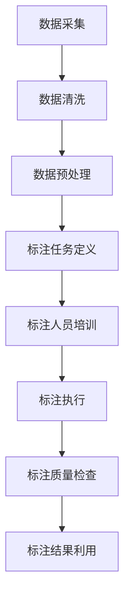

                 


# 大模型企业的数据标注策略

> 关键词：大模型，数据标注，机器学习，人工智能，深度学习，企业，算法，标注策略，成本控制，质量控制，数据管理

> 摘要：本文探讨了在大模型企业中，数据标注策略的重要性以及如何制定有效且高效的数据标注方案。文章首先介绍了数据标注的基本概念及其在大模型训练中的关键作用。随后，分析了数据标注过程中的挑战，包括数据质量、成本和时间效率等方面。本文提出了一个系统的数据标注策略框架，包括数据准备、标注流程设计、标注人员管理、质量控制与优化等环节。通过具体的案例和实战经验，详细阐述了实施数据标注策略的步骤和方法。最后，文章总结了数据标注策略对企业的影响，并展望了未来的发展趋势和挑战。

## 1. 背景介绍

### 1.1 目的和范围

随着人工智能技术的快速发展，大模型（如大型语言模型、图像识别模型等）在企业中的应用越来越广泛。大模型的效果在很大程度上依赖于数据的质量和标注的准确性。因此，如何制定科学、系统的数据标注策略，成为大模型企业面临的一个重要问题。

本文旨在探讨大模型企业中数据标注策略的制定和实施，分析其中的关键环节和注意事项，为企业提供有效的数据标注方案。文章主要涵盖以下内容：

1. 数据标注的基本概念及其在大模型训练中的作用。
2. 数据标注过程中的挑战和问题。
3. 数据标注策略的框架和实施步骤。
4. 实际应用场景中的案例和经验。
5. 数据标注策略对企业的影响和未来发展趋势。

### 1.2 预期读者

本文适合从事人工智能、机器学习、深度学习等领域的研究人员、开发人员、数据工程师以及企业管理者阅读。读者需要具备一定的计算机基础和机器学习知识，以便更好地理解和应用文中提到的数据标注策略。

### 1.3 文档结构概述

本文分为以下几个部分：

1. 背景介绍：介绍本文的目的、范围、预期读者和文档结构。
2. 核心概念与联系：阐述数据标注的核心概念和原理，通过 Mermaid 流程图展示数据标注的架构。
3. 核心算法原理与具体操作步骤：详细讲解数据标注的核心算法原理，使用伪代码阐述具体操作步骤。
4. 数学模型和公式：介绍数据标注中涉及的数学模型和公式，并进行详细讲解和举例说明。
5. 项目实战：通过实际案例，展示数据标注策略的实施过程和代码实现。
6. 实际应用场景：分析数据标注策略在不同领域的应用。
7. 工具和资源推荐：推荐相关学习资源、开发工具和框架。
8. 总结：总结数据标注策略的重要性，展望未来发展趋势和挑战。
9. 附录：常见问题与解答。
10. 扩展阅读与参考资料：提供进一步学习的资源链接。

### 1.4 术语表

#### 1.4.1 核心术语定义

- **数据标注**：指对数据中的特定信息进行标注，使其可以被机器学习算法使用。
- **数据质量**：指数据的准确性、完整性、一致性和可靠性。
- **标注质量**：指标注结果的准确性、一致性和可靠性。
- **标注人员**：指负责对数据进行标注的个体或团队。
- **大模型**：指规模巨大、参数众多的机器学习模型，如大型语言模型、图像识别模型等。

#### 1.4.2 相关概念解释

- **机器学习**：一种人工智能技术，通过从数据中学习规律和模式，实现智能决策和预测。
- **深度学习**：一种特殊的机器学习技术，通过多层神经网络进行数据建模和预测。
- **算法**：解决问题的步骤和方法，用于指导计算机执行特定任务。
- **标注策略**：指用于指导数据标注过程的框架和方法。

#### 1.4.3 缩略词列表

- **AI**：人工智能
- **ML**：机器学习
- **DL**：深度学习
- **NLP**：自然语言处理
- **CV**：计算机视觉

## 2. 核心概念与联系

### 2.1 数据标注的基本概念

数据标注是机器学习、深度学习等领域中的一项关键任务，它是指对原始数据进行预处理，标记出其中具有特定意义的特征或信息，使其能够被机器学习算法有效利用。数据标注在机器学习中起着至关重要的作用，它是模型训练质量的基础。

数据标注的主要类型包括：

1. **分类标注**：对数据进行分类，如文本分类、图像分类等。
2. **回归标注**：对数据进行数值回归，如房价预测、股票价格预测等。
3. **序列标注**：对序列数据进行标注，如语音识别、文本序列标注等。
4. **目标检测标注**：对图像中的目标进行定位和分类。

### 2.2 大模型与数据标注的关系

大模型（如大型语言模型、图像识别模型等）需要大量的高质量标注数据来进行训练和优化。标注数据的数量和质量直接影响大模型的效果。数据标注的质量和一致性决定了模型预测的准确性和稳定性。

### 2.3 数据标注的流程

数据标注流程通常包括以下几个步骤：

1. **数据采集**：从各种来源收集原始数据，如公共数据集、企业内部数据等。
2. **数据清洗**：对原始数据进行清洗，去除噪声和无关信息。
3. **数据预处理**：对数据格式、标签等进行统一处理，使其适合标注。
4. **标注任务定义**：明确标注任务的目标和标注标准。
5. **标注人员培训**：对标注人员进行任务培训和考核。
6. **标注执行**：标注人员按照任务定义进行数据标注。
7. **标注质量检查**：对标注结果进行质量检查和评估。
8. **标注结果利用**：将标注结果用于模型训练和优化。

### 2.4 数据标注的策略与优化

数据标注策略是指指导数据标注过程的方法和原则。有效的数据标注策略可以提高标注质量和效率，降低成本。数据标注策略的优化可以从以下几个方面进行：

1. **标注任务分解**：将复杂标注任务分解为简单任务，降低标注难度。
2. **标注工具优化**：使用高效、易用的标注工具，提高标注速度和准确性。
3. **标注人员管理**：合理分配标注任务，提高标注人员的工作效率。
4. **标注质量监控**：建立标注质量监控机制，及时发现和纠正错误。
5. **标注结果利用**：充分利用标注数据，进行数据增强和模型优化。

### 2.5 Mermaid 流程图

以下是一个简单的 Mermaid 流程图，展示数据标注的基本流程：



## 3. 核心算法原理与具体操作步骤

### 3.1 数据标注算法原理

数据标注算法是用于指导标注过程的工具，其核心原理主要包括：

1. **标注任务定义**：根据标注任务的需求，定义标注的目标、标注标准和标注规则。
2. **标注工具选择**：选择适合标注任务的标注工具，如手动标注、自动化标注工具等。
3. **标注过程管理**：对标注过程进行监控和优化，确保标注质量和效率。

### 3.2 数据标注具体操作步骤

以下是一个典型的数据标注操作步骤：

#### 3.2.1 数据采集

1. 确定标注任务需求，收集相关数据。
2. 数据来源可以是公共数据集、企业内部数据等。

#### 3.2.2 数据清洗

1. 清除噪声数据和无关信息。
2. 处理数据格式，如文本统一编码、图像统一尺寸等。

#### 3.2.3 数据预处理

1. 根据标注任务需求，对数据进行预处理，如文本分词、图像分割等。
2. 确保数据格式统一，便于标注。

#### 3.2.4 标注任务定义

1. 根据标注任务需求，定义标注的目标和标注标准。
2. 确定标注类别和标注规则。

#### 3.2.5 标注人员培训

1. 对标注人员进行任务培训和考核，确保标注质量。
2. 制定标注指南，明确标注标准和流程。

#### 3.2.6 标注执行

1. 标注人员按照任务定义和标注指南进行数据标注。
2. 使用标注工具辅助标注，提高标注效率和准确性。

#### 3.2.7 标注质量检查

1. 对标注结果进行质量检查，发现和纠正错误。
2. 建立标注质量监控机制，确保标注质量。

#### 3.2.8 标注结果利用

1. 将标注结果用于模型训练和优化。
2. 进行数据增强，提高模型效果。

### 3.3 伪代码

以下是一个简单的数据标注伪代码示例：

```python
def data_annotate(data, task_def):
    # 数据清洗
    clean_data = data_clean(data)
    
    # 数据预处理
    preprocessed_data = data_preprocess(clean_data, task_def)
    
    # 标注任务定义
    annotation_rules = task_def.annotation_rules
    
    # 标注执行
    annotations = []
    for sample in preprocessed_data:
        annotation = manual_annotate(sample, annotation_rules)
        annotations.append(annotation)
    
    # 标注质量检查
    check_annotations(annotations)
    
    # 标注结果利用
    use_annotations(annotations)
```

## 4. 数学模型和公式

### 4.1 数据标注的数学模型

数据标注过程中，常用的数学模型包括：

1. **分类模型**：如支持向量机（SVM）、朴素贝叶斯（NB）等。
2. **回归模型**：如线性回归、多项式回归等。
3. **目标检测模型**：如卷积神经网络（CNN）、YOLO等。

### 4.2 数学公式

以下是一个简单的分类模型示例，使用 Sigmoid 函数进行概率预测：

$$
P(y=1) = \sigma(w^T x + b)
$$

其中，$\sigma$ 是 Sigmoid 函数，$w$ 是权重向量，$x$ 是特征向量，$b$ 是偏置。

### 4.3 举例说明

假设我们有一个二分类问题，特征向量 $x$ 包含两个特征：$x_1$ 和 $x_2$，权重向量 $w$ 为 $(1, 1)$，偏置 $b$ 为 $0$。给定一个特征向量 $x = (2, 3)$，我们可以计算预测概率：

$$
P(y=1) = \sigma(w^T x + b) = \sigma(1 \times 2 + 1 \times 3 + 0) = \sigma(5) \approx 0.99
$$

因此，预测结果为 $y=1$，即该样本属于正类。

## 5. 项目实战：代码实际案例和详细解释说明

### 5.1 开发环境搭建

为了展示数据标注策略的实施，我们将使用 Python 编写一个简单的文本分类项目。以下是开发环境的搭建步骤：

1. 安装 Python 3.8 或更高版本。
2. 安装必要的库，如 scikit-learn、numpy、pandas 等。

```bash
pip install scikit-learn numpy pandas
```

### 5.2 源代码详细实现和代码解读

以下是一个简单的文本分类项目的源代码示例：

```python
import numpy as np
from sklearn.datasets import fetch_20newsgroups
from sklearn.feature_extraction.text import TfidfVectorizer
from sklearn.model_selection import train_test_split
from sklearn.linear_model import LogisticRegression
from sklearn.metrics import accuracy_score

# 数据采集
newsgroups_data = fetch_20newsgroups(subset='all')

# 数据清洗和预处理
tfidf_vectorizer = TfidfVectorizer()
X = tfidf_vectorizer.fit_transform(newsgroups_data.data)

# 标注任务定义
y = newsgroups_data.target

# 数据划分
X_train, X_test, y_train, y_test = train_test_split(X, y, test_size=0.2, random_state=42)

# 模型训练
model = LogisticRegression()
model.fit(X_train, y_train)

# 模型评估
y_pred = model.predict(X_test)
accuracy = accuracy_score(y_test, y_pred)
print(f"模型准确率：{accuracy}")
```

#### 5.2.1 代码解读

1. **数据采集**：使用 scikit-learn 库的 `fetch_20newsgroups` 函数从互联网上获取 20 个新闻类别数据集。
2. **数据清洗和预处理**：使用 `TfidfVectorizer` 将文本数据转换为 TF-IDF 向量表示。
3. **标注任务定义**：将数据集的标签（新闻类别）分配给训练集和测试集。
4. **数据划分**：将数据集划分为训练集和测试集，用于模型训练和评估。
5. **模型训练**：使用 Logistic Regression 模型进行训练。
6. **模型评估**：使用测试集评估模型准确率。

### 5.3 代码解读与分析

#### 5.3.1 数据采集

```python
newsgroups_data = fetch_20newsgroups(subset='all')
```

`fetch_20newsgroups` 函数用于从互联网上获取 20 个新闻类别数据集，包括体育、科技、政治等。这里我们使用 `'all'` 参数获取全部数据。

#### 5.3.2 数据清洗和预处理

```python
tfidf_vectorizer = TfidfVectorizer()
X = tfidf_vectorizer.fit_transform(newsgroups_data.data)
```

`TfidfVectorizer` 是一个将文本转换为 TF-IDF 向量的工具。在这里，我们使用 `fit_transform` 方法将原始文本数据转换为 TF-IDF 向量表示。

#### 5.3.3 标注任务定义

```python
y = newsgroups_data.target
```

将数据集的标签（新闻类别）分配给训练集和测试集。这里，`target` 属性包含了每个样本的标签。

#### 5.3.4 数据划分

```python
X_train, X_test, y_train, y_test = train_test_split(X, y, test_size=0.2, random_state=42)
```

使用 `train_test_split` 函数将数据集划分为训练集和测试集。这里，`test_size` 参数设置为 0.2，表示测试集占比 20%。`random_state` 参数用于设置随机种子，以确保结果可复现。

#### 5.3.5 模型训练

```python
model = LogisticRegression()
model.fit(X_train, y_train)
```

使用 Logistic Regression 模型进行训练。`fit` 方法将训练集数据用于模型训练。

#### 5.3.6 模型评估

```python
y_pred = model.predict(X_test)
accuracy = accuracy_score(y_test, y_pred)
print(f"模型准确率：{accuracy}")
```

使用测试集评估模型准确率。`predict` 方法用于预测测试集的标签，`accuracy_score` 函数计算模型准确率。

## 6. 实际应用场景

数据标注策略在大模型企业中的应用场景非常广泛，以下是一些典型的应用场景：

1. **自然语言处理（NLP）**：在 NLP 领域，数据标注策略主要用于文本分类、情感分析、实体识别等任务。例如，企业可以利用标注策略对大量新闻、社交媒体数据进行分类，以便进行舆情监测和分析。
2. **计算机视觉（CV）**：在 CV 领域，数据标注策略主要用于图像分类、目标检测、人脸识别等任务。例如，企业可以利用标注策略对大量图像数据进行标注，以便训练高效的目标检测模型。
3. **语音识别（ASR）**：在语音识别领域，数据标注策略主要用于语音分类、语音识别率优化等任务。例如，企业可以利用标注策略对大量语音数据进行标注，以便提高语音识别的准确性。
4. **自动驾驶**：在自动驾驶领域，数据标注策略主要用于场景识别、道路标记、障碍物检测等任务。例如，企业可以利用标注策略对大量交通数据进行标注，以便训练自动驾驶模型。

## 7. 工具和资源推荐

### 7.1 学习资源推荐

#### 7.1.1 书籍推荐

1. **《数据标注与数据增强》**：详细介绍了数据标注的原理和方法，包括文本、图像、音频等数据类型。
2. **《机器学习实战》**：提供了丰富的数据标注和机器学习案例，适合初学者和实践者。

#### 7.1.2 在线课程

1. **《数据标注与机器学习》**：网易云课堂的免费课程，适合入门学习。
2. **《深度学习》**：吴恩达在 Coursera 上开设的深度学习课程，涵盖了数据标注和标注策略的相关内容。

#### 7.1.3 技术博客和网站

1. **机器之心**：专注于人工智能领域的中文技术博客，提供丰富的数据标注相关文章。
2. **AI 研习社**：一个关注人工智能、机器学习和深度学习的社群网站，有大量的数据标注和标注策略文章。

### 7.2 开发工具框架推荐

#### 7.2.1 IDE 和编辑器

1. **PyCharm**：一款功能强大的 Python IDE，支持多种编程语言和框架。
2. **Visual Studio Code**：一款轻量级、高度可扩展的编辑器，适合 Python 和数据标注开发。

#### 7.2.2 调试和性能分析工具

1. **gdb**：Linux 系统下的调试工具，用于调试 Python 程序。
2. **cProfile**：Python 的内置性能分析工具，用于分析程序的性能瓶颈。

#### 7.2.3 相关框架和库

1. **scikit-learn**：一个 Python 机器学习库，提供了丰富的数据标注和模型训练工具。
2. **TensorFlow**：一款开源的深度学习框架，用于构建和训练大型深度学习模型。

### 7.3 相关论文著作推荐

#### 7.3.1 经典论文

1. **《机器学习：一种概率的观点》**：张钹、李航著，详细介绍了机器学习的概率观点。
2. **《深度学习》**：Goodfellow、Bengio、Courville 著，是深度学习领域的经典教材。

#### 7.3.2 最新研究成果

1. **《大规模语言模型的预训练》**：Large-scale language modeling for AI research，发表于 NeurIPS 2018，介绍了 GPT 系列模型。
2. **《EfficientDet: Scalable and Efficient Object Detection》**：发表于 ICCV 2019，提出了一种高效的物体检测框架。

#### 7.3.3 应用案例分析

1. **《京东 AI：如何打造 1 小时达》**：京东 AI 团队分享如何利用机器学习和深度学习技术实现 1 小时达服务。
2. **《美团点评：如何利用深度学习优化配送路线》**：美团点评团队分享如何利用深度学习优化配送路线，提高配送效率。

## 8. 总结：未来发展趋势与挑战

随着人工智能技术的快速发展，数据标注策略在企业中的应用前景广阔。未来，数据标注策略的发展趋势和挑战主要包括：

1. **数据标注自动化**：随着自动化技术的发展，数据标注的自动化程度将不断提高，减少人力成本，提高标注效率。
2. **数据质量优化**：数据质量是模型效果的基础，未来将更加注重数据质量的优化，包括数据清洗、数据增强等。
3. **个性化标注**：根据不同企业的需求和场景，提供个性化的标注解决方案，提高标注效果。
4. **开放数据集**：随着数据集的开放，数据标注将更加依赖于公共数据集，提高数据标注的效率和多样性。
5. **伦理和法律问题**：数据标注涉及到个人隐私和伦理问题，未来需要更加重视数据标注的合规性和伦理问题。

## 9. 附录：常见问题与解答

### 9.1 数据标注策略的核心问题

1. **什么是数据标注策略？**
   数据标注策略是指指导数据标注过程的方法和原则，包括数据采集、数据清洗、标注任务定义、标注人员培训、标注执行、标注质量检查等环节。

2. **数据标注策略的重要性是什么？**
   数据标注策略对于机器学习、深度学习等人工智能技术至关重要。有效的数据标注策略可以提高标注质量和效率，降低成本，从而提高模型的效果。

### 9.2 数据标注中的常见挑战

1. **数据质量如何保证？**
   数据质量可以通过数据清洗、数据增强、标注质量监控等方式进行保证。同时，建立数据质量评估机制，定期对数据进行评估和优化。

2. **标注成本如何控制？**
   标注成本可以通过以下方式进行控制：
   - 合理分配标注任务，提高标注人员的工作效率。
   - 使用自动化标注工具，降低人力成本。
   - 优化标注流程，减少不必要的工作环节。

3. **标注质量如何保障？**
   标注质量可以通过以下方式进行保障：
   - 对标注人员进行培训和考核，确保标注质量。
   - 建立标注质量监控机制，及时发现和纠正错误。
   - 使用多个人进行标注，进行标注结果的对比和修正。

## 10. 扩展阅读与参考资料

### 10.1 数据标注相关论文

1. **《大规模语言模型的预训练》**：Large-scale language modeling for AI research，发表于 NeurIPS 2018。
2. **《EfficientDet: Scalable and Efficient Object Detection》**：发表于 ICCV 2019。

### 10.2 数据标注书籍

1. **《数据标注与数据增强》**：详细介绍了数据标注的原理和方法。
2. **《机器学习实战》**：提供了丰富的数据标注和机器学习案例。

### 10.3 数据标注教程和博客

1. **机器之心**：提供丰富的数据标注相关文章和教程。
2. **AI 研习社**：一个关注人工智能、机器学习和深度学习的社群网站，有大量的数据标注和标注策略文章。

### 10.4 数据标注工具和框架

1. **scikit-learn**：一个 Python 机器学习库，提供了丰富的数据标注和模型训练工具。
2. **TensorFlow**：一款开源的深度学习框架，用于构建和训练大型深度学习模型。

### 10.5 数据集和资源

1. **Kaggle**：提供丰富的机器学习和深度学习数据集。
2. **Open Data**：提供各种领域的开放数据集。

### 10.6 相关组织和社区

1. **Kaggle**：一个机器学习和深度学习竞赛平台，提供丰富的数据和比赛机会。
2. **AI 研究院**：一个关注人工智能研究的社群和组织，提供丰富的资源和活动。

### 10.7 相关标准和政策

1. **《人工智能数据标注规范》**：国家标准，规范了人工智能数据标注的流程和要求。
2. **《个人信息保护法》**：国家法律，规定了个人信息保护的基本原则和制度。

