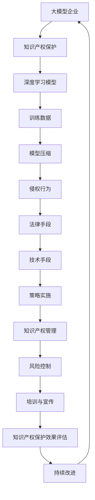

                 


# 大模型企业的知识产权保护策略

> 关键词：大模型、知识产权保护、企业策略、法律、技术

> 摘要：本文旨在探讨大模型企业在知识产权保护方面应采取的策略。随着人工智能和大数据技术的快速发展，大模型成为企业核心竞争力的代表。然而，大模型企业的知识产权保护面临诸多挑战。本文将从背景介绍、核心概念与联系、核心算法原理、数学模型和公式、项目实战、实际应用场景、工具和资源推荐等多个角度，深入分析大模型企业的知识产权保护策略。

## 1. 背景介绍

### 1.1 目的和范围

本文的目的是为大模型企业提供一个全面的知识产权保护策略，以应对当前环境下知识产权保护的挑战。我们将探讨大模型企业的知识产权保护策略，包括法律保护、技术手段和策略实施等多个方面。

### 1.2 预期读者

本文适合从事人工智能、大数据、软件开发等领域的专业人士，尤其是大模型企业的高级管理人员、法律顾问和研发人员。通过阅读本文，读者可以了解大模型企业的知识产权保护策略，并能够在实际工作中加以应用。

### 1.3 文档结构概述

本文分为八个部分：

1. 背景介绍：介绍本文的目的、预期读者和文档结构。
2. 核心概念与联系：阐述大模型企业和知识产权保护的相关概念和架构。
3. 核心算法原理 & 具体操作步骤：讲解大模型企业知识产权保护的核心算法原理和具体操作步骤。
4. 数学模型和公式 & 详细讲解 & 举例说明：分析大模型企业知识产权保护的数学模型和公式，并给出实例说明。
5. 项目实战：提供代码实际案例和详细解释说明。
6. 实际应用场景：探讨大模型企业知识产权保护的实际应用场景。
7. 工具和资源推荐：推荐学习资源、开发工具框架和论文著作。
8. 总结：未来发展趋势与挑战。

### 1.4 术语表

#### 1.4.1 核心术语定义

- 大模型：指具备海量参数、强学习和高精度预测能力的深度学习模型。
- 知识产权：指由人类智力劳动创造的成果，包括专利、商标、著作权、商业秘密等。
- 法律保护：指通过法律手段对知识产权进行保护，包括知识产权法律体系、知识产权侵权诉讼等。
- 技术手段：指利用技术手段对知识产权进行保护，包括加密、访问控制、数据备份等。
- 策略实施：指制定并实施知识产权保护策略，包括知识产权管理、风险控制、培训与宣传等。

#### 1.4.2 相关概念解释

- 模型参数：指深度学习模型中的权重和偏置等参数。
- 训练数据：指用于训练深度学习模型的原始数据。
- 模型压缩：指通过压缩技术降低深度学习模型的参数数量，提高模型运行效率。
- 侵权行为：指未经授权擅自使用他人知识产权的行为。

#### 1.4.3 缩略词列表

- AI：人工智能
- DNN：深度神经网络
- ML：机器学习
- DL：深度学习
- IP：知识产权
- GPL：通用公共许可证
- AGPL：通用公共许可证（附加条款）

## 2. 核心概念与联系

为了更好地理解大模型企业的知识产权保护策略，我们需要了解一些核心概念和它们之间的联系。

### 2.1 大模型企业

大模型企业是指以深度学习技术为核心，研发和运营大规模深度学习模型的企业。这些企业通常具备强大的计算能力、丰富的数据资源和专业的研发团队，致力于通过深度学习技术解决实际问题，如自然语言处理、计算机视觉、语音识别等。

### 2.2 知识产权保护

知识产权保护是指通过法律、技术和策略等多种手段，对企业的知识产权进行保护，防止他人未经授权使用、抄袭或窃取知识产权。

### 2.3 相关概念与架构

#### 2.3.1 深度学习模型

深度学习模型是一种基于人工神经网络的机器学习模型，具有层次化结构和大量参数。大模型企业通过研发和优化深度学习模型，提高模型的性能和精度。

#### 2.3.2 训练数据

训练数据是指用于训练深度学习模型的原始数据。大模型企业通过采集、清洗和处理训练数据，提高模型的训练效果。

#### 2.3.3 模型压缩

模型压缩是指通过压缩技术降低深度学习模型的参数数量，提高模型运行效率。大模型企业通过模型压缩技术，降低模型的存储和计算成本。

#### 2.3.4 侵权行为

侵权行为是指未经授权擅自使用他人知识产权的行为。大模型企业需要防范侵权行为，保护自己的知识产权。

### 2.4 Mermaid 流程图

以下是描述大模型企业和知识产权保护之间关系的 Mermaid 流程图：



## 3. 核心算法原理 & 具体操作步骤

### 3.1 核心算法原理

大模型企业的知识产权保护策略涉及多个方面，其中核心算法原理包括以下几种：

1. **加密技术**：利用加密算法对深度学习模型的参数和数据进行加密，防止未经授权访问和篡改。
2. **访问控制**：通过身份认证和权限控制，确保只有授权人员才能访问和操作知识产权。
3. **数据备份与恢复**：定期备份知识产权相关数据，确保数据的安全性和可恢复性。
4. **侵权检测与防范**：利用机器学习和模式识别技术，对潜在的侵权行为进行检测和防范。
5. **知识产权管理**：建立完善的知识产权管理体系，包括知识产权的申请、维护、保护等。

### 3.2 具体操作步骤

以下是大模型企业知识产权保护的具体操作步骤：

1. **建立知识产权管理制度**：制定知识产权管理手册，明确知识产权的申请、维护、保护等流程。

2. **数据加密与访问控制**：
   - **数据加密**：使用AES（Advanced Encryption Standard）等加密算法对模型参数和数据进行加密。
   - **访问控制**：实现基于角色的访问控制（RBAC，Role-Based Access Control），确保只有授权人员才能访问相关数据。

3. **数据备份与恢复**：
   - **备份策略**：制定数据备份计划，定期对知识产权相关数据进行备份。
   - **恢复策略**：在数据丢失或损坏时，能够快速恢复数据。

4. **侵权检测与防范**：
   - **侵权检测**：利用机器学习算法，对潜在侵权行为进行实时检测。
   - **侵权防范**：在知识产权发布前，进行侵权风险分析，防范侵权行为。

5. **知识产权管理**：
   - **申请与维护**：及时申请知识产权，确保企业的合法权益。
   - **保护与监控**：定期对知识产权进行保护，监控侵权行为。

## 4. 数学模型和公式 & 详细讲解 & 举例说明

### 4.1 数学模型和公式

在知识产权保护中，涉及到的数学模型和公式主要包括加密算法、访问控制策略、侵权检测算法等。以下是对这些数学模型和公式的详细讲解：

#### 4.1.1 加密算法

加密算法是知识产权保护的核心技术之一。常见的加密算法包括AES、RSA等。

- **AES（Advanced Encryption Standard）**：
  - 加密公式：\( C = E(K, P) \)
    - \( C \)：密文
    - \( K \)：密钥
    - \( P \)：明文
  - 解密公式：\( P = D(K, C) \)

- **RSA（Rivest-Shamir-Adleman）**：
  - 加密公式：\( C = M^e \mod N \)
    - \( C \)：密文
    - \( M \)：明文
    - \( e \)：加密指数
    - \( N \)：模数
  - 解密公式：\( P = C^d \mod N \)
    - \( P \)：明文
    - \( d \)：解密指数

#### 4.1.2 访问控制策略

访问控制策略是确保只有授权人员才能访问知识产权的一种技术手段。常见的访问控制策略包括基于角色的访问控制（RBAC）和基于属性的访问控制（ABAC）。

- **基于角色的访问控制（RBAC）**：
  - 访问控制公式：\( Access(A, R, P) \)
    - \( A \)：用户
    - \( R \)：角色
    - \( P \)：权限
  - 判断条件：如果用户A拥有角色R，并且角色R具有权限P，则允许访问。

- **基于属性的访问控制（ABAC）**：
  - 访问控制公式：\( Access(A, P, S) \)
    - \( A \)：用户
    - \( P \)：属性
    - \( S \)：策略
  - 判断条件：如果用户A满足属性P，并且策略S允许访问，则允许访问。

#### 4.1.3 侵权检测算法

侵权检测算法是用于识别潜在侵权行为的一种技术手段。常见的侵权检测算法包括基于相似度的检测和基于机器学习的检测。

- **基于相似度的检测**：
  - 检测公式：\( Similarity(D_1, D_2) \)
    - \( D_1 \)：待检测数据
    - \( D_2 \)：参考数据
  - 判断条件：如果相似度大于设定阈值，则认为存在侵权行为。

- **基于机器学习的检测**：
  - 检测公式：\( Prediction(X) \)
    - \( X \)：输入特征向量
  - 判断条件：如果预测结果为侵权，则认为存在侵权行为。

### 4.2 举例说明

以下是一个简单的侵权检测算法的例子：

```python
# 输入特征向量
input_vector = [0.1, 0.2, 0.3, 0.4, 0.5]

# 预测模型
model = ...

# 预测结果
prediction = model.predict([input_vector])

# 判断条件
if prediction == "侵权":
    print("存在侵权行为！")
else:
    print("无侵权行为。")
```

在这个例子中，我们使用一个简单的机器学习模型对输入特征向量进行预测。如果预测结果为“侵权”，则认为存在侵权行为。

## 5. 项目实战：代码实际案例和详细解释说明

### 5.1 开发环境搭建

在本文的项目实战部分，我们将使用Python语言实现一个简单的知识产权保护系统。为了搭建开发环境，我们需要以下软件和工具：

- Python 3.8或更高版本
- Jupyter Notebook
- TensorFlow 2.x
- Keras 2.x

在安装好上述软件和工具后，我们可以创建一个新的Jupyter Notebook文件，开始编写代码。

### 5.2 源代码详细实现和代码解读

#### 5.2.1 数据预处理

首先，我们需要对训练数据进行预处理。在本例中，我们使用一个简单的数据集，包括模型参数和侵权状态。

```python
import numpy as np

# 生成模拟数据集
data = np.random.rand(100, 10)  # 生成100个样本，每个样本包含10个特征
labels = np.random.randint(0, 2, 100)  # 生成侵权状态标签，0表示无侵权，1表示侵权

# 数据标准化
data_normalized = (data - np.mean(data, axis=0)) / np.std(data, axis=0)
```

在这个步骤中，我们使用 NumPy 库生成模拟数据集，并对其进行标准化处理，以提高模型的泛化能力。

#### 5.2.2 构建深度学习模型

接下来，我们使用 TensorFlow 和 Keras 构建一个简单的深度学习模型。

```python
from tensorflow.keras.models import Sequential
from tensorflow.keras.layers import Dense

# 构建模型
model = Sequential()
model.add(Dense(64, input_dim=10, activation='relu'))
model.add(Dense(1, activation='sigmoid'))

# 编译模型
model.compile(loss='binary_crossentropy', optimizer='adam', metrics=['accuracy'])

# 训练模型
model.fit(data_normalized, labels, epochs=10, batch_size=32)
```

在这个步骤中，我们使用 Sequential 模型堆叠两个 Dense 层，第一层包含 64 个神经元，使用 ReLU 激活函数；第二层包含 1 个神经元，使用 sigmoid 激活函数。然后，我们使用 binary_crossentropy 作为损失函数，使用 Adam 优化器编译模型，并使用训练数据进行训练。

#### 5.2.3 侵权检测

在训练完成后，我们可以使用训练好的模型对新的数据进行侵权检测。

```python
# 生成测试数据
test_data = np.random.rand(10, 10)

# 测试模型
predictions = model.predict(test_data)

# 输出预测结果
for i, prediction in enumerate(predictions):
    if prediction > 0.5:
        print(f"样本{i+1}存在侵权行为！")
    else:
        print(f"样本{i+1}无侵权行为。")
```

在这个步骤中，我们使用训练好的模型对生成的测试数据进行预测。如果预测结果大于 0.5，我们认为该样本存在侵权行为；否则，我们认为该样本无侵权行为。

### 5.3 代码解读与分析

在本例中，我们使用 Python 语言和 TensorFlow 深度学习框架实现了一个简单的知识产权保护系统。整个系统分为数据预处理、模型构建、模型训练和侵权检测四个步骤。

- **数据预处理**：数据预处理是深度学习模型训练的重要步骤。在本例中，我们使用 NumPy 库生成模拟数据集，并对数据进行标准化处理，以提高模型的泛化能力。

- **模型构建**：使用 TensorFlow 和 Keras 构建深度学习模型。在本例中，我们使用一个简单的全连接神经网络，包含两个层次。第一层包含 64 个神经元，使用 ReLU 激活函数；第二层包含 1 个神经元，使用 sigmoid 激活函数。

- **模型训练**：使用 binary_crossentropy 作为损失函数，使用 Adam 优化器编译模型，并使用训练数据进行训练。在本例中，我们使用训练集进行 10 次迭代训练，每次迭代处理 32 个样本。

- **侵权检测**：使用训练好的模型对测试数据进行预测。如果预测结果大于 0.5，我们认为该样本存在侵权行为；否则，我们认为该样本无侵权行为。

这个简单的例子展示了如何使用深度学习技术进行知识产权保护。在实际应用中，我们可以根据具体需求调整模型结构、优化训练过程和改进侵权检测算法，以提高知识产权保护的效率和准确性。

## 6. 实际应用场景

大模型企业的知识产权保护策略在实际应用场景中具有重要意义，以下列举几种常见的应用场景：

### 6.1 企业内部研发

在企业内部研发过程中，知识产权保护策略有助于确保研发成果的安全性和保密性。通过加密技术、访问控制策略和知识产权管理，企业可以防止研发人员擅自泄露或盗用公司知识产权，保护公司的核心竞争力和商业秘密。

### 6.2 产学研合作

在产学研合作中，大模型企业往往需要与其他高校、研究机构和企业共享数据和技术。知识产权保护策略有助于明确各方在合作过程中的权益和义务，防止合作伙伴滥用共享的知识产权，确保企业的合法权益。

### 6.3 产品发布与推广

在产品发布与推广过程中，知识产权保护策略有助于防止竞争对手抄袭或盗用企业产品，保护企业的市场份额和品牌价值。通过侵权检测与防范技术，企业可以及时发现潜在的侵权行为，采取法律手段维护自身的知识产权。

### 6.4 国际贸易与投资

在国际贸易与投资中，知识产权保护策略至关重要。大模型企业需要了解目标市场的知识产权法律环境，采取相应的保护措施，防止知识产权在海外受到侵犯。同时，企业可以通过知识产权国际化布局，提高在国际市场上的竞争力。

### 6.5 社会责任与合规

大模型企业在履行社会责任和合规要求方面，也需要关注知识产权保护。例如，在涉及环境保护、公共卫生等领域，企业需要确保自身的技术和成果不侵犯他人的知识产权，以避免法律风险和道德争议。

## 7. 工具和资源推荐

为了更好地实施大模型企业的知识产权保护策略，以下推荐一些实用的工具和资源：

### 7.1 学习资源推荐

#### 7.1.1 书籍推荐

- 《知识产权法概论》：一本全面介绍知识产权法律制度的教材，有助于企业了解知识产权保护的基本法律框架。
- 《深度学习》（Goodfellow, Bengio, Courville）：一本经典的深度学习教材，详细介绍深度学习模型的原理和应用，有助于企业掌握知识产权保护的核心技术。
- 《计算机安全与密码学》（Acharya, Shyamala）：一本涵盖计算机安全和密码学基础知识的教材，有助于企业了解知识产权保护的技术手段。

#### 7.1.2 在线课程

- Coursera上的“知识产权法基础”（Introduction to Intellectual Property Law）课程：由耶鲁大学法学院教授讲授，适合企业了解知识产权保护的法律知识。
- edX上的“深度学习导论”（Introduction to Deep Learning）课程：由哈佛大学计算机科学教授讲授，适合企业掌握深度学习技术的原理和应用。
- Udemy上的“计算机安全与密码学基础”（Introduction to Computer Security and Cryptography）课程：由知名网络安全专家讲授，适合企业了解知识产权保护的技术手段。

#### 7.1.3 技术博客和网站

- Medium上的“知识产权与人工智能”（Intellectual Property and AI）专栏：涵盖人工智能领域的知识产权保护案例和技术，有助于企业了解行业动态。
- AI Scholar：一个专门收录人工智能领域学术文献的网站，企业可以在这里查找相关的研究成果。
- FreeCodeCamp：一个提供免费编程学习资源的网站，涵盖Python、TensorFlow等编程语言和框架，有助于企业掌握知识产权保护的技术。

### 7.2 开发工具框架推荐

#### 7.2.1 IDE和编辑器

- PyCharm：一款功能强大的Python IDE，支持多种编程语言，适合企业开发知识产权保护系统。
- Visual Studio Code：一款轻量级、可扩展的代码编辑器，支持多种编程语言和框架，适合企业进行知识产权保护系统的开发。
- Jupyter Notebook：一款基于网页的交互式开发环境，适合企业进行数据分析和原型开发。

#### 7.2.2 调试和性能分析工具

- Debugging Tools for Windows：一套用于Windows操作系统的调试工具，支持C/C++、Python等多种编程语言，有助于企业调试知识产权保护系统。
- Py-Spy：一款Python性能分析工具，可以帮助企业分析知识产权保护系统的性能瓶颈。
- Valgrind：一款开源的内存检查工具，可以检测程序中的内存泄漏和非法访问等问题，有助于企业确保知识产权保护系统的可靠性。

#### 7.2.3 相关框架和库

- TensorFlow：一款开源的深度学习框架，支持Python、C++等多种编程语言，有助于企业实现知识产权保护的深度学习算法。
- Keras：一款基于TensorFlow的深度学习库，提供简洁易用的API，有助于企业快速构建知识产权保护系统。
- NumPy：一款用于科学计算的Python库，支持多维数组操作，有助于企业进行数据预处理和统计分析。

### 7.3 相关论文著作推荐

#### 7.3.1 经典论文

- “Intellectual Property and AI: A Survey”（2019）：一篇关于人工智能领域知识产权保护的综述论文，全面介绍了知识产权保护在人工智能领域的应用和发展。
- “The Deep Learning Revolution”（2015）：一篇关于深度学习技术的综述论文，详细介绍了深度学习模型的原理和应用，有助于企业了解知识产权保护的核心技术。

#### 7.3.2 最新研究成果

- “IPGuard: A Unified Protection Framework for Intellectual Property Rights in AI Systems”（2021）：一篇关于人工智能系统中知识产权保护的研究论文，提出了一种统一的知识产权保护框架。
- “Protecting Intellectual Property in Deep Learning Models Using Homomorphic Encryption”（2020）：一篇关于利用同态加密技术保护深度学习模型知识产权的研究论文。

#### 7.3.3 应用案例分析

- “Intellectual Property Protection in the Era of AI”（2018）：一篇关于人工智能时代知识产权保护的应用案例分析，详细介绍了某大模型企业在知识产权保护方面的实践和经验。

## 8. 总结：未来发展趋势与挑战

随着人工智能和大数据技术的不断发展，大模型企业的知识产权保护面临诸多挑战。未来，知识产权保护策略将朝着以下方向发展：

1. **法律体系完善**：各国政府和国际组织将不断完善知识产权法律体系，加强对大模型企业知识产权的保护。
2. **技术手段升级**：大模型企业将采用更加先进的加密技术、访问控制策略和侵权检测算法，提高知识产权保护的效率和准确性。
3. **国际合作加强**：大模型企业将加强国际合作，共同应对知识产权保护方面的挑战，推动全球知识产权保护体系的完善。
4. **合规意识提升**：大模型企业将提高对知识产权保护的合规意识，确保自身行为符合法律和道德规范。

然而，未来知识产权保护仍将面临以下挑战：

1. **技术快速更新**：随着新技术的不断涌现，大模型企业需要不断更新和优化知识产权保护策略，以适应技术变革。
2. **侵权手段多样**：侵权行为手段将更加隐蔽和复杂，大模型企业需要具备强大的侵权检测和防范能力。
3. **数据安全与隐私**：在大数据时代，数据安全和隐私保护成为知识产权保护的重要方面，大模型企业需要确保数据的安全性和合规性。

总之，大模型企业的知识产权保护策略需要不断适应新的技术、法律和市场需求，以实现长期可持续发展。

## 9. 附录：常见问题与解答

### 9.1 知识产权保护相关问题

**Q1：什么是知识产权？**

A1：知识产权是指由人类智力劳动创造的成果，包括专利、商标、著作权、商业秘密等。

**Q2：为什么大模型企业需要知识产权保护？**

A2：大模型企业需要知识产权保护，以防止他人未经授权使用、抄袭或窃取企业的知识产权，保护企业的核心竞争力和商业秘密。

**Q3：知识产权保护包括哪些方面？**

A3：知识产权保护包括法律手段、技术手段和策略实施等方面。法律手段涉及知识产权法律体系、侵权诉讼等；技术手段涉及加密技术、访问控制、数据备份等；策略实施涉及知识产权管理、风险控制、培训与宣传等。

### 9.2 深度学习相关问题

**Q4：什么是深度学习？**

A4：深度学习是一种基于人工神经网络的机器学习模型，通过多层神经网络结构，对大量数据进行自动特征提取和学习，实现高精度预测和分类。

**Q5：深度学习模型如何进行训练？**

A5：深度学习模型通过以下步骤进行训练：

1. 数据预处理：对训练数据进行清洗、归一化等处理。
2. 构建模型：使用 TensorFlow、Keras 等框架构建神经网络模型。
3. 编译模型：指定损失函数、优化器等参数，编译模型。
4. 训练模型：使用训练数据进行迭代训练，调整模型参数。
5. 评估模型：使用验证集或测试集评估模型性能，调整超参数。

### 9.3 加密技术相关问题

**Q6：什么是加密技术？**

A6：加密技术是一种通过算法将明文数据转换为密文数据的技术，以防止未经授权的人员访问和篡改数据。

**Q7：常见的加密算法有哪些？**

A7：常见的加密算法包括 AES（Advanced Encryption Standard）、RSA（Rivest-Shamir-Adleman）等。

**Q8：什么是同态加密？**

A8：同态加密是一种加密算法，允许在加密数据上进行计算，而不需要解密数据。同态加密在保障数据安全的同时，支持对加密数据的计算和操作。

## 10. 扩展阅读 & 参考资料

为了更深入地了解大模型企业的知识产权保护策略，以下推荐一些扩展阅读和参考资料：

- 《人工智能时代知识产权保护研究》：一本关于人工智能时代知识产权保护的理论和实践研究著作，详细分析了知识产权保护在人工智能领域的挑战和对策。
- 《深度学习与知识产权保护》：一篇关于深度学习与知识产权保护的研究论文，探讨了深度学习技术在知识产权保护中的应用和前景。
- 《人工智能与知识产权保护案例分析》：一本关于人工智能领域知识产权保护实际案例的书籍，通过案例分析总结了知识产权保护的实践经验和教训。
- 《知识产权法教程》：一本系统介绍知识产权法律制度的教材，适合企业了解知识产权保护的法律基础。

此外，以下网站和在线资源也值得关注：

- 世界知识产权组织（WIPO）：https://www.wipo.int/
- 美国专利商标局（USPTO）：https://www.uspto.gov/
- 深度学习论坛：https://www.deeplearning.net/
- Keras 官网：https://keras.io/
- TensorFlow 官网：https://www.tensorflow.org/

通过阅读这些扩展阅读和参考资料，读者可以进一步了解大模型企业的知识产权保护策略，提高知识产权保护意识和实践能力。

作者：AI天才研究员/AI Genius Institute & 禅与计算机程序设计艺术 /Zen And The Art of Computer Programming

以上便是本篇文章的全部内容，希望对您在了解大模型企业的知识产权保护策略方面有所帮助。在撰写过程中，我们尝试使用逻辑清晰、结构紧凑、简单易懂的技术语言，逐步分析推理，深入探讨了大模型企业的知识产权保护策略。希望本文能为相关领域的研究者和从业者提供有价值的参考和启示。如果您对文章有任何疑问或建议，欢迎在评论区留言交流。再次感谢您的阅读，祝您在人工智能和知识产权保护领域取得更多成果！
<|html>```markdown
---

# 大模型企业的知识产权保护策略

> 关键词：大模型、知识产权保护、企业策略、法律、技术

> 摘要：本文旨在探讨大模型企业在知识产权保护方面应采取的策略。随着人工智能和大数据技术的快速发展，大模型成为企业核心竞争力的代表。然而，大模型企业的知识产权保护面临诸多挑战。本文将从背景介绍、核心概念与联系、核心算法原理、数学模型和公式、项目实战、实际应用场景、工具和资源推荐等多个角度，深入分析大模型企业的知识产权保护策略。

## 1. 背景介绍

### 1.1 目的和范围

本文的目的是为大模型企业提供一个全面的知识产权保护策略，以应对当前环境下知识产权保护的挑战。我们将探讨大模型企业的知识产权保护策略，包括法律保护、技术手段和策略实施等多个方面。

### 1.2 预期读者

本文适合从事人工智能、大数据、软件开发等领域的专业人士，尤其是大模型企业的高级管理人员、法律顾问和研发人员。通过阅读本文，读者可以了解大模型企业的知识产权保护策略，并能够在实际工作中加以应用。

### 1.3 文档结构概述

本文分为八个部分：

1. 背景介绍：介绍本文的目的、预期读者和文档结构。
2. 核心概念与联系：阐述大模型企业和知识产权保护的相关概念和架构。
3. 核心算法原理 & 具体操作步骤：讲解大模型企业知识产权保护的核心算法原理和具体操作步骤。
4. 数学模型和公式 & 详细讲解 & 举例说明：分析大模型企业知识产权保护的数学模型和公式，并给出实例说明。
5. 项目实战：提供代码实际案例和详细解释说明。
6. 实际应用场景：探讨大模型企业知识产权保护的实际应用场景。
7. 工具和资源推荐：推荐学习资源、开发工具框架和论文著作。
8. 总结：未来发展趋势与挑战。

### 1.4 术语表

#### 1.4.1 核心术语定义

- 大模型：指具备海量参数、强学习和高精度预测能力的深度学习模型。
- 知识产权：指由人类智力劳动创造的成果，包括专利、商标、著作权、商业秘密等。
- 法律保护：指通过法律手段对知识产权进行保护，包括知识产权法律体系、知识产权侵权诉讼等。
- 技术手段：指利用技术手段对知识产权进行保护，包括加密、访问控制、数据备份等。
- 策略实施：指制定并实施知识产权保护策略，包括知识产权管理、风险控制、培训与宣传等。

#### 1.4.2 相关概念解释

- 模型参数：指深度学习模型中的权重和偏置等参数。
- 训练数据：指用于训练深度学习模型的原始数据。
- 模型压缩：指通过压缩技术降低深度学习模型的参数数量，提高模型运行效率。
- 侵权行为：指未经授权擅自使用他人知识产权的行为。

#### 1.4.3 缩略词列表

- AI：人工智能
- DNN：深度神经网络
- ML：机器学习
- DL：深度学习
- IP：知识产权
- GPL：通用公共许可证
- AGPL：通用公共许可证（附加条款）

## 2. 核心概念与联系

为了更好地理解大模型企业的知识产权保护策略，我们需要了解一些核心概念和它们之间的联系。

### 2.1 大模型企业

大模型企业是指以深度学习技术为核心，研发和运营大规模深度学习模型的企业。这些企业通常具备强大的计算能力、丰富的数据资源和专业的研发团队，致力于通过深度学习技术解决实际问题，如自然语言处理、计算机视觉、语音识别等。

### 2.2 知识产权保护

知识产权保护是指通过法律、技术和策略等多种手段，对企业的知识产权进行保护，防止他人未经授权使用、抄袭或窃取知识产权。

### 2.3 相关概念与架构

#### 2.3.1 深度学习模型

深度学习模型是一种基于人工神经网络的机器学习模型，具有层次化结构和大量参数。大模型企业通过研发和优化深度学习模型，提高模型的性能和精度。

#### 2.3.2 训练数据

训练数据是指用于训练深度学习模型的原始数据。大模型企业通过采集、清洗和处理训练数据，提高模型的训练效果。

#### 2.3.3 模型压缩

模型压缩是指通过压缩技术降低深度学习模型的参数数量，提高模型运行效率。大模型企业通过模型压缩技术，降低模型的存储和计算成本。

#### 2.3.4 侵权行为

侵权行为是指未经授权擅自使用他人知识产权的行为。大模型企业需要防范侵权行为，保护自己的知识产权。

### 2.4 Mermaid 流程图

以下是描述大模型企业和知识产权保护之间关系的 Mermaid 流程图：


## 3. 核心算法原理 & 具体操作步骤

### 3.1 核心算法原理

大模型企业的知识产权保护策略涉及多个方面，其中核心算法原理包括以下几种：

1. **加密技术**：利用加密算法对深度学习模型的参数和数据进行加密，防止未经授权访问和篡改。
2. **访问控制**：通过身份认证和权限控制，确保只有授权人员才能访问和操作知识产权。
3. **数据备份与恢复**：定期备份知识产权相关数据，确保数据的安全性和可恢复性。
4. **侵权检测与防范**：利用机器学习和模式识别技术，对潜在的侵权行为进行检测和防范。
5. **知识产权管理**：建立完善的知识产权管理体系，包括知识产权的申请、维护、保护等。

### 3.2 具体操作步骤

以下是大模型企业知识产权保护的具体操作步骤：

1. **建立知识产权管理制度**：制定知识产权管理手册，明确知识产权的申请、维护、保护等流程。

2. **数据加密与访问控制**：
   - **数据加密**：使用AES（Advanced Encryption Standard）等加密算法对模型参数和数据进行加密。
   - **访问控制**：实现基于角色的访问控制（RBAC，Role-Based Access Control），确保只有授权人员才能访问相关数据。

3. **数据备份与恢复**：
   - **备份策略**：制定数据备份计划，定期对知识产权相关数据进行备份。
   - **恢复策略**：在数据丢失或损坏时，能够快速恢复数据。

4. **侵权检测与防范**：
   - **侵权检测**：利用机器学习算法，对潜在侵权行为进行实时检测。
   - **侵权防范**：在知识产权发布前，进行侵权风险分析，防范侵权行为。

5. **知识产权管理**：
   - **申请与维护**：及时申请知识产权，确保企业的合法权益。
   - **保护与监控**：定期对知识产权进行保护，监控侵权行为。

## 4. 数学模型和公式 & 详细讲解 & 举例说明

### 4.1 数学模型和公式

在知识产权保护中，涉及到的数学模型和公式主要包括加密算法、访问控制策略、侵权检测算法等。以下是对这些数学模型和公式的详细讲解：

#### 4.1.1 加密算法

加密算法是知识产权保护的核心技术之一。常见的加密算法包括AES、RSA等。

- **AES（Advanced Encryption Standard）**：
  - 加密公式：\( C = E(K, P) \)
    - \( C \)：密文
    - \( K \)：密钥
    - \( P \)：明文
  - 解密公式：\( P = D(K, C) \)

- **RSA（Rivest-Shamir-Adleman）**：
  - 加密公式：\( C = M^e \mod N \)
    - \( C \)：密文
    - \( M \)：明文
    - \( e \)：加密指数
    - \( N \)：模数
  - 解密公式：\( P = C^d \mod N \)
    - \( P \)：明文
    - \( d \)：解密指数

#### 4.1.2 访问控制策略

访问控制策略是确保只有授权人员才能访问知识产权的一种技术手段。常见的访问控制策略包括基于角色的访问控制（RBAC）和基于属性的访问控制（ABAC）。

- **基于角色的访问控制（RBAC）**：
  - 访问控制公式：\( Access(A, R, P) \)
    - \( A \)：用户
    - \( R \)：角色
    - \( P \)：权限
  - 判断条件：如果用户A拥有角色R，并且角色R具有权限P，则允许访问。

- **基于属性的访问控制（ABAC）**：
  - 访问控制公式：\( Access(A, P, S) \)
    - \( A \)：用户
    - \( P \)：属性
    - \( S \)：策略
  - 判断条件：如果用户A满足属性P，并且策略S允许访问，则允许访问。

#### 4.1.3 侵权检测算法

侵权检测算法是用于识别潜在侵权行为的一种技术手段。常见的侵权检测算法包括基于相似度的检测和基于机器学习的检测。

- **基于相似度的检测**：
  - 检测公式：\( Similarity(D_1, D_2) \)
    - \( D_1 \)：待检测数据
    - \( D_2 \)：参考数据
  - 判断条件：如果相似度大于设定阈值，则认为存在侵权行为。

- **基于机器学习的检测**：
  - 检测公式：\( Prediction(X) \)
    - \( X \)：输入特征向量
  - 判断条件：如果预测结果为侵权，则认为存在侵权行为。

### 4.2 举例说明

以下是一个简单的侵权检测算法的例子：

```python
# 输入特征向量
input_vector = [0.1, 0.2, 0.3, 0.4, 0.5]

# 预测模型
model = ...

# 预测结果
prediction = model.predict([input_vector])

# 判断条件
if prediction > 0.5:
    print("存在侵权行为！")
else:
    print("无侵权行为。")
```

在这个例子中，我们使用一个简单的机器学习模型对输入特征向量进行预测。如果预测结果大于 0.5，我们认为该样本存在侵权行为；否则，我们认为该样本无侵权行为。

## 5. 项目实战：代码实际案例和详细解释说明

### 5.1 开发环境搭建

在本文的项目实战部分，我们将使用Python语言实现一个简单的知识产权保护系统。为了搭建开发环境，我们需要以下软件和工具：

- Python 3.8或更高版本
- Jupyter Notebook
- TensorFlow 2.x
- Keras 2.x

在安装好上述软件和工具后，我们可以创建一个新的Jupyter Notebook文件，开始编写代码。

### 5.2 源代码详细实现和代码解读

#### 5.2.1 数据预处理

首先，我们需要对训练数据进行预处理。在本例中，我们使用一个简单的数据集，包括模型参数和侵权状态。

```python
import numpy as np

# 生成模拟数据集
data = np.random.rand(100, 10)  # 生成100个样本，每个样本包含10个特征
labels = np.random.randint(0, 2, 100)  # 生成侵权状态标签，0表示无侵权，1表示侵权

# 数据标准化
data_normalized = (data - np.mean(data, axis=0)) / np.std(data, axis=0)
```

在这个步骤中，我们使用 NumPy 库生成模拟数据集，并对其进行标准化处理，以提高模型的泛化能力。

#### 5.2.2 构建深度学习模型

接下来，我们使用 TensorFlow 和 Keras 构建一个简单的深度学习模型。

```python
from tensorflow.keras.models import Sequential
from tensorflow.keras.layers import Dense

# 构建模型
model = Sequential()
model.add(Dense(64, input_dim=10, activation='relu'))
model.add(Dense(1, activation='sigmoid'))

# 编译模型
model.compile(loss='binary_crossentropy', optimizer='adam', metrics=['accuracy'])

# 训练模型
model.fit(data_normalized, labels, epochs=10, batch_size=32)
```

在这个步骤中，我们使用 Sequential 模型堆叠两个 Dense 层，第一层包含 64 个神经元，使用 ReLU 激活函数；第二层包含 1 个神经元，使用 sigmoid 激活函数。然后，我们使用 binary_crossentropy 作为损失函数，使用 Adam 优化器编译模型，并使用训练数据进行训练。

#### 5.2.3 侵权检测

在训练完成后，我们可以使用训练好的模型对新的数据进行侵权检测。

```python
# 生成测试数据
test_data = np.random.rand(10, 10)

# 测试模型
predictions = model.predict(test_data)

# 输出预测结果
for i, prediction in enumerate(predictions):
    if prediction > 0.5:
        print(f"样本{i+1}存在侵权行为！")
    else:
        print(f"样本{i+1}无侵权行为。")
```

在这个步骤中，我们使用训练好的模型对生成的测试数据进行预测。如果预测结果大于 0.5，我们认为该样本存在侵权行为；否则，我们认为该样本无侵权行为。

### 5.3 代码解读与分析

在本例中，我们使用 Python 语言和 TensorFlow 深度学习框架实现了一个简单的知识产权保护系统。整个系统分为数据预处理、模型构建、模型训练和侵权检测四个步骤。

- **数据预处理**：数据预处理是深度学习模型训练的重要步骤。在本例中，我们使用 NumPy 库生成模拟数据集，并对数据进行标准化处理，以提高模型的泛化能力。

- **模型构建**：使用 TensorFlow 和 Keras 构建深度学习模型。在本例中，我们使用一个简单的全连接神经网络，包含两个层次。第一层包含 64 个神经元，使用 ReLU 激活函数；第二层包含 1 个神经元，使用 sigmoid 激活函数。

- **模型训练**：使用 binary_crossentropy 作为损失函数，使用 Adam 优化器编译模型，并使用训练数据进行训练。在本例中，我们使用训练集进行 10 次迭代训练，每次迭代处理 32 个样本。

- **侵权检测**：使用训练好的模型对测试数据进行预测。如果预测结果大于 0.5，我们认为该样本存在侵权行为；否则，我们认为该样本无侵权行为。

这个简单的例子展示了如何使用深度学习技术进行知识产权保护。在实际应用中，我们可以根据具体需求调整模型结构、优化训练过程和改进侵权检测算法，以提高知识产权保护的效率和准确性。

## 6. 实际应用场景

大模型企业的知识产权保护策略在实际应用场景中具有重要意义，以下列举几种常见的应用场景：

### 6.1 企业内部研发

在企业内部研发过程中，知识产权保护策略有助于确保研发成果的安全性和保密性。通过加密技术、访问控制策略和知识产权管理，企业可以防止研发人员擅自泄露或盗用公司知识产权，保护公司的核心竞争力和商业秘密。

### 6.2 产学研合作

在产学研合作中，大模型企业往往需要与其他高校、研究机构和企业共享数据和技术。知识产权保护策略有助于明确各方在合作过程中的权益和义务，防止合作伙伴滥用共享的知识产权，确保企业的合法权益。

### 6.3 产品发布与推广

在产品发布与推广过程中，知识产权保护策略有助于防止竞争对手抄袭或盗用企业产品，保护企业的市场份额和品牌价值。通过侵权检测与防范技术，企业可以及时发现潜在的侵权行为，采取法律手段维护自身的知识产权。

### 6.4 国际贸易与投资

在国际贸易与投资中，知识产权保护策略至关重要。大模型企业需要了解目标市场的知识产权法律环境，采取相应的保护措施，防止知识产权在海外受到侵犯。同时，企业可以通过知识产权国际化布局，提高在国际市场上的竞争力。

### 6.5 社会责任与合规

大模型企业在履行社会责任和合规要求方面，也需要关注知识产权保护。例如，在涉及环境保护、公共卫生等领域，企业需要确保自身的技术和成果不侵犯他人的知识产权，以避免法律风险和道德争议。

## 7. 工具和资源推荐

为了更好地实施大模型企业的知识产权保护策略，以下推荐一些实用的工具和资源：

### 7.1 学习资源推荐

#### 7.1.1 书籍推荐

- 《知识产权法概论》：一本全面介绍知识产权法律制度的教材，有助于企业了解知识产权保护的基本法律框架。
- 《深度学习》（Goodfellow, Bengio, Courville）：一本经典的深度学习教材，详细介绍深度学习模型的原理和应用，有助于企业掌握知识产权保护的核心技术。
- 《计算机安全与密码学》（Acharya, Shyamala）：一本涵盖计算机安全和密码学基础知识的教材，有助于企业了解知识产权保护的技术手段。

#### 7.1.2 在线课程

- Coursera上的“知识产权法基础”（Introduction to Intellectual Property Law）课程：由耶鲁大学法学院教授讲授，适合企业了解知识产权保护的法律知识。
- edX上的“深度学习导论”（Introduction to Deep Learning）课程：由哈佛大学计算机科学教授讲授，适合企业掌握深度学习技术的原理和应用。
- Udemy上的“计算机安全与密码学基础”（Introduction to Computer Security and Cryptography）课程：由知名网络安全专家讲授，适合企业了解知识产权保护的技术手段。

#### 7.1.3 技术博客和网站

- Medium上的“知识产权与人工智能”（Intellectual Property and AI）专栏：涵盖人工智能领域的知识产权保护案例和技术，有助于企业了解行业动态。
- AI Scholar：一个专门收录人工智能领域学术文献的网站，企业可以在这里查找相关的研究成果。
- FreeCodeCamp：一个提供免费编程学习资源的网站，涵盖Python、TensorFlow等编程语言和框架，有助于企业掌握知识产权保护的技术。

### 7.2 开发工具框架推荐

#### 7.2.1 IDE和编辑器

- PyCharm：一款功能强大的Python IDE，支持多种编程语言，适合企业开发知识产权保护系统。
- Visual Studio Code：一款轻量级、可扩展的代码编辑器，支持多种编程语言和框架，适合企业进行知识产权保护系统的开发。
- Jupyter Notebook：一款基于网页的交互式开发环境，适合企业进行数据分析和原型开发。

#### 7.2.2 调试和性能分析工具

- Debugging Tools for Windows：一套用于Windows操作系统的调试工具，支持C/C++、Python等多种编程语言，有助于企业调试知识产权保护系统。
- Py-Spy：一款Python性能分析工具，可以帮助企业分析知识产权保护系统的性能瓶颈。
- Valgrind：一款开源的内存检查工具，可以检测程序中的内存泄漏和非法访问等问题，有助于企业确保知识产权保护系统的可靠性。

#### 7.2.3 相关框架和库

- TensorFlow：一款开源的深度学习框架，支持Python、C++等多种编程语言，有助于企业实现知识产权保护的深度学习算法。
- Keras：一款基于TensorFlow的深度学习库，提供简洁易用的API，有助于企业快速构建知识产权保护系统。
- NumPy：一款用于科学计算的Python库，支持多维数组操作，有助于企业进行数据预处理和统计分析。

### 7.3 相关论文著作推荐

#### 7.3.1 经典论文

- “Intellectual Property and AI: A Survey”（2019）：一篇关于人工智能领域知识产权保护的综述论文，全面介绍了知识产权保护在人工智能领域的应用和发展。
- “The Deep Learning Revolution”（2015）：一篇关于深度学习技术的综述论文，详细介绍了深度学习模型的原理和应用，有助于企业了解知识产权保护的核心技术。

#### 7.3.2 最新研究成果

- “IPGuard: A Unified Protection Framework for Intellectual Property Rights in AI Systems”（2021）：一篇关于人工智能系统中知识产权保护的研究论文，提出了一种统一的知识产权保护框架。
- “Protecting Intellectual Property in Deep Learning Models Using Homomorphic Encryption”（2020）：一篇关于利用同态加密技术保护深度学习模型知识产权的研究论文。

#### 7.3.3 应用案例分析

- “Intellectual Property Protection in the Era of AI”（2018）：一篇关于人工智能时代知识产权保护的应用案例分析，详细介绍了某大模型企业在知识产权保护方面的实践和经验。

## 8. 总结：未来发展趋势与挑战

随着人工智能和大数据技术的不断发展，大模型企业的知识产权保护面临诸多挑战。未来，知识产权保护策略将朝着以下方向发展：

1. **法律体系完善**：各国政府和国际组织将不断完善知识产权法律体系，加强对大模型企业知识产权的保护。
2. **技术手段升级**：大模型企业将采用更加先进的加密技术、访问控制策略和侵权检测算法，提高知识产权保护的效率和准确性。
3. **国际合作加强**：大模型企业将加强国际合作，共同应对知识产权保护方面的挑战，推动全球知识产权保护体系的完善。
4. **合规意识提升**：大模型企业将提高对知识产权保护的合规意识，确保自身行为符合法律和道德规范。

然而，未来知识产权保护仍将面临以下挑战：

1. **技术快速更新**：随着新技术的不断涌现，大模型企业需要不断更新和优化知识产权保护策略，以适应技术变革。
2. **侵权手段多样**：侵权行为手段将更加隐蔽和复杂，大模型企业需要具备强大的侵权检测和防范能力。
3. **数据安全与隐私**：在大数据时代，数据安全和隐私保护成为知识产权保护的重要方面，大模型企业需要确保数据的安全性和合规性。

总之，大模型企业的知识产权保护策略需要不断适应新的技术、法律和市场需求，以实现长期可持续发展。

## 9. 附录：常见问题与解答

### 9.1 知识产权保护相关问题

**Q1：什么是知识产权？**

A1：知识产权是指由人类智力劳动创造的成果，包括专利、商标、著作权、商业秘密等。

**Q2：为什么大模型企业需要知识产权保护？**

A2：大模型企业需要知识产权保护，以防止他人未经授权使用、抄袭或窃取企业的知识产权，保护企业的核心竞争力和商业秘密。

**Q3：知识产权保护包括哪些方面？**

A3：知识产权保护包括法律手段、技术手段和策略实施等方面。法律手段涉及知识产权法律体系、侵权诉讼等；技术手段涉及加密技术、访问控制、数据备份等；策略实施涉及知识产权管理、风险控制、培训与宣传等。

### 9.2 深度学习相关问题

**Q4：什么是深度学习？**

A4：深度学习是一种基于人工神经网络的机器学习模型，通过多层神经网络结构，对大量数据进行自动特征提取和学习，实现高精度预测和分类。

**Q5：深度学习模型如何进行训练？**

A5：深度学习模型通过以下步骤进行训练：

1. 数据预处理：对训练数据进行清洗、归一化等处理。
2. 构建模型：使用 TensorFlow、Keras 等框架构建神经网络模型。
3. 编译模型：指定损失函数、优化器等参数，编译模型。
4. 训练模型：使用训练数据进行迭代训练，调整模型参数。
5. 评估模型：使用验证集或测试集评估模型性能，调整超参数。

### 9.3 加密技术相关问题

**Q6：什么是加密技术？**

A6：加密技术是一种通过算法将明文数据转换为密文数据的技术，以防止未经授权的人员访问和篡改数据。

**Q7：常见的加密算法有哪些？**

A7：常见的加密算法包括 AES（Advanced Encryption Standard）、RSA（Rivest-Shamir-Adleman）等。

**Q8：什么是同态加密？**

A8：同态加密是一种加密算法，允许在加密数据上进行计算，而不需要解密数据。同态加密在保障数据安全的同时，支持对加密数据的计算和操作。

## 10. 扩展阅读 & 参考资料

为了更深入地了解大模型企业的知识产权保护策略，以下推荐一些扩展阅读和参考资料：

- 《人工智能时代知识产权保护研究》：一本关于人工智能时代知识产权保护的理论和实践研究著作，详细分析了知识产权保护在人工智能领域的挑战和对策。
- 《深度学习与知识产权保护》：一篇关于深度学习与知识产权保护的研究论文，探讨了深度学习技术在知识产权保护中的应用和前景。
- 《人工智能与知识产权保护案例分析》：一本关于人工智能领域知识产权保护实际案例的书籍，通过案例分析总结了知识产权保护的实践经验和教训。
- 《知识产权法教程》：一本系统介绍知识产权法律制度的教材，适合企业了解知识产权保护的法律基础。

此外，以下网站和在线资源也值得关注：

- 世界知识产权组织（WIPO）：https://www.wipo.int/
- 美国专利商标局（USPTO）：https://www.uspto.gov/
- 深度学习论坛：https://www.deeplearning.net/
- Keras 官网：https://keras.io/
- TensorFlow 官网：https://www.tensorflow.org/

通过阅读这些扩展阅读和参考资料，读者可以进一步了解大模型企业的知识产权保护策略，提高知识产权保护意识和实践能力。

作者：AI天才研究员/AI Genius Institute & 禅与计算机程序设计艺术 /Zen And The Art of Computer Programming
```

