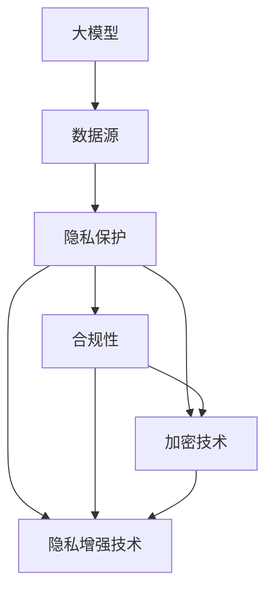

                 

# 大模型企业的隐私保护策略

> 关键词：大模型、隐私保护、数据安全、合规性、加密技术

> 摘要：随着大数据和人工智能技术的迅猛发展，企业对大规模模型的需求日益增长。然而，这同时也带来了隐私保护的问题。本文将深入探讨大模型企业在隐私保护方面的策略，包括数据加密、合规性遵守、隐私增强技术等，以帮助企业实现数据安全和合规目标。

## 1. 背景介绍

### 1.1 目的和范围

本文旨在为大模型企业提供一个全面的隐私保护策略，帮助企业在数据安全和合规性方面取得成功。本文将涵盖以下内容：

- 大模型隐私保护的现状和挑战
- 隐私保护的核心概念和原理
- 加密技术在大模型隐私保护中的应用
- 遵守合规性的重要性及实现方法
- 隐私增强技术的探讨
- 未来隐私保护的发展趋势和挑战

### 1.2 预期读者

本文面向大模型企业的高级管理人员、数据科学家、隐私保护专家和合规人员。预期读者应该具备一定的计算机科学和大数据处理基础。

### 1.3 文档结构概述

本文分为十个部分：

- 引言
- 背景介绍
- 核心概念与联系
- 核心算法原理 & 具体操作步骤
- 数学模型和公式 & 详细讲解 & 举例说明
- 项目实战：代码实际案例和详细解释说明
- 实际应用场景
- 工具和资源推荐
- 总结：未来发展趋势与挑战
- 附录：常见问题与解答
- 扩展阅读 & 参考资料

### 1.4 术语表

#### 1.4.1 核心术语定义

- 大模型：指的是拥有数百万甚至数十亿参数的复杂神经网络模型。
- 隐私保护：指确保个人信息在数据收集、存储、处理和传输过程中不被未经授权的访问和泄露。
- 加密技术：指利用数学方法对数据进行加密和解密，以保护数据隐私。
- 合规性：指遵守相关法律法规和行业标准，以确保企业的数据管理和处理符合法律要求。

#### 1.4.2 相关概念解释

- 数据安全：指确保数据在存储、处理和传输过程中不被未授权访问、篡改或泄露。
- 隐私增强技术：指通过数据脱敏、数据共享机制和匿名化等技术手段增强数据隐私保护。

#### 1.4.3 缩略词列表

- GDPR：欧盟通用数据保护条例
- CCPA：加州消费者隐私法案
- SSL：安全套接层协议
- TLS：传输层安全协议

## 2. 核心概念与联系

为了更好地理解大模型企业隐私保护的策略，我们需要先了解几个核心概念和它们之间的关系。下面是一个 Mermaid 流程图，展示了这些概念和它们之间的联系。



### 2.1 大模型与数据源

大模型通常需要从各种数据源（如公共数据集、企业内部数据等）中收集大量数据。这些数据源可能包含敏感个人信息，如姓名、地址、电话号码等。因此，确保数据源的安全和合规性是隐私保护的第一步。

### 2.2 隐私保护与合规性

隐私保护不仅仅是为了保护个人数据不被泄露，还需要遵守相关法律法规和行业标准。例如，欧盟的 GDPR 和加州的 CCPA 都对个人数据保护提出了严格的要求。合规性是隐私保护的重要组成部分，企业必须确保其数据管理和处理过程符合法律法规的要求。

### 2.3 加密技术与隐私保护

加密技术是隐私保护的关键工具。通过加密技术，企业可以将敏感数据转换为只有授权用户才能解密的格式，从而防止数据在传输和存储过程中被未授权访问。常用的加密技术包括 SSL/TLS 协议和对称加密、非对称加密等。

### 2.4 隐私增强技术

隐私增强技术包括数据脱敏、数据共享机制和匿名化等技术。这些技术可以在不损害数据价值的前提下，增强数据的隐私保护。例如，数据脱敏技术可以掩盖敏感数据的具体值，而数据共享机制可以确保数据在共享过程中不被泄露。

## 3. 核心算法原理 & 具体操作步骤

### 3.1 数据加密算法原理

数据加密算法的基本原理是利用数学方法对数据进行加密和解密。加密算法通常分为对称加密和非对称加密两种。

- **对称加密**：加密和解密使用相同的密钥，例如 AES（高级加密标准）。
- **非对称加密**：加密和解密使用不同的密钥，例如 RSA（RSA 加密算法）。

### 3.2 数据加密操作步骤

下面是一个使用 AES 对称加密算法对数据进行加密的伪代码示例：

```python
# 生成密钥和初始向量
key = generate_key()
iv = generate_initial_vector()

# 加密数据
cipher = AES.new(key, AES.MODE_CBC, iv)
encrypted_data = cipher.encrypt(data)

# 存储 key 和 iv，以便后续解密
store_key(key)
store_iv(iv)

return encrypted_data
```

### 3.3 数据解密操作步骤

下面是一个使用 AES 对称加密算法对数据进行解密的伪代码示例：

```python
# 读取密钥和初始向量
key = read_key()
iv = read_iv()

# 解密数据
cipher = AES.new(key, AES.MODE_CBC, iv)
decrypted_data = cipher.decrypt(encrypted_data)

return decrypted_data
```

## 4. 数学模型和公式 & 详细讲解 & 举例说明

### 4.1 对称加密算法的数学模型

对称加密算法的数学模型主要涉及密钥生成、加密和解密过程。以下是一个简单的 AES 加密算法的数学模型：

- **密钥生成**：生成一个随机密钥 \( K \)，通常是一个二进制字符串。
- **加密过程**：将明文 \( P \) 和密钥 \( K \) 输入到加密函数 \( E_K(P) \) 中，得到密文 \( C \)。
  \[ C = E_K(P) \]
- **解密过程**：将密文 \( C \) 和密钥 \( K \) 输入到解密函数 \( D_K(C) \) 中，得到明文 \( P \)。
  \[ P = D_K(C) \]

### 4.2 非对称加密算法的数学模型

非对称加密算法的数学模型涉及公钥和私钥。以下是一个简单的 RSA 加密算法的数学模型：

- **密钥生成**：选择两个大素数 \( p \) 和 \( q \)，计算 \( n = p \times q \) 和 \( \phi(n) = (p-1) \times (q-1) \)。然后计算私钥 \( d \) 和公钥 \( e \)，其中 \( e \) 和 \( d \) 满足 \( ed \equiv 1 \mod \phi(n) \)。
- **加密过程**：将明文 \( P \) 和公钥 \( e \) 输入到加密函数 \( E_e(P) \) 中，得到密文 \( C \)。
  \[ C = P^e \mod n \]
- **解密过程**：将密文 \( C \) 和私钥 \( d \) 输入到解密函数 \( D_d(C) \) 中，得到明文 \( P \)。
  \[ P = C^d \mod n \]

### 4.3 SSL/TLS 协议的数学模型

SSL/TLS 协议用于确保数据在互联网上的传输安全。其数学模型涉及公钥加密、数字签名和证书链验证。

- **公钥加密**：客户端和服务器使用公钥加密算法进行通信加密。
- **数字签名**：服务器使用私钥对证书进行签名，客户端使用公钥验证证书的签名。
- **证书链验证**：客户端通过证书链验证服务器的身份，证书链中的每个证书都由上一级证书颁发。

### 4.4 举例说明

#### 4.4.1 对称加密算法举例

假设我们要使用 AES 对称加密算法对明文 \( P = "Hello World!" \) 进行加密。首先，我们需要生成一个密钥 \( K \) 和初始向量 \( IV \)。

- **密钥生成**：使用随机数生成器生成一个 256 位密钥 \( K \)。
- **加密过程**：使用 AES 加密函数 \( E_K(P) \) 对明文进行加密，得到密文 \( C \)。
- **解密过程**：使用 AES 解密函数 \( D_K(C) \) 对密文进行解密，得到明文 \( P \)。

#### 4.4.2 非对称加密算法举例

假设我们要使用 RSA 非对称加密算法对明文 \( P = "Hello World!" \) 进行加密。首先，我们需要生成一对公钥和私钥。

- **密钥生成**：选择两个大素数 \( p \) 和 \( q \)，计算 \( n = p \times q \) 和 \( \phi(n) = (p-1) \times (q-1) \)。然后计算私钥 \( d \) 和公钥 \( e \)，其中 \( ed \equiv 1 \mod \phi(n) \)。
- **加密过程**：使用公钥 \( e \) 和 \( n \) 对明文进行加密，得到密文 \( C \)。
- **解密过程**：使用私钥 \( d \) 和 \( n \) 对密文进行解密，得到明文 \( P \)。

## 5. 项目实战：代码实际案例和详细解释说明

### 5.1 开发环境搭建

在本节中，我们将使用 Python 编写一个简单的数据加密和解密程序，以演示对称加密和非对称加密的基本操作。首先，我们需要安装所需的库。

```bash
pip install pycryptodome
```

### 5.2 源代码详细实现和代码解读

下面是一个使用 PyCryptoDome 库实现的数据加密和解密程序的代码示例：

```python
from Crypto.PublicKey import RSA
from Crypto.Cipher import AES, PKCS1_OAEP
from Crypto.Random import get_random_bytes
import base64

# 对称加密
def encrypt_aes(data, key):
    cipher = AES.new(key, AES.MODE_CBC)
    ct_bytes = cipher.encrypt(data.encode('utf-8'))
    iv = cipher.iv
    return base64.b64encode(ct_bytes).decode('utf-8'), base64.b64encode(iv).decode('utf-8')

def decrypt_aes(data, key, iv):
    ct = base64.b64decode(data)
    iv = base64.b64decode(iv)
    cipher = AES.new(key, AES.MODE_CBC, iv)
    pt = cipher.decrypt(ct)
    return pt.decode('utf-8')

# 非对称加密
def encrypt_rsa(data, public_key):
    rsa = PKCS1_OAEP.new(public_key)
    encrypted_data = rsa.encrypt(data.encode('utf-8'))
    return base64.b64encode(encrypted_data).decode('utf-8')

def decrypt_rsa(data, private_key):
    rsa = PKCS1_OAEP.new(private_key)
    decrypted_data = rsa.decrypt(base64.b64decode(data))
    return decrypted_data.decode('utf-8')

# 主程序
if __name__ == '__main__':
    # 生成 RSA 公钥和私钥
    private_key = RSA.generate(2048)
    public_key = private_key.publickey()

    # 生成 AES 密钥
    aes_key = get_random_bytes(16)

    # 加密和解密示例
    data = "Hello World!"
    
    # 对称加密
    encrypted_aes, iv = encrypt_aes(data, aes_key)
    print("AES Encrypted Data:", encrypted_aes)
    decrypted_aes = decrypt_aes(encrypted_aes, aes_key, iv)
    print("AES Decrypted Data:", decrypted_aes)

    # 非对称加密
    encrypted_rsa = encrypt_rsa(data, public_key)
    print("RSA Encrypted Data:", encrypted_rsa)
    decrypted_rsa = decrypt_rsa(encrypted_rsa, private_key)
    print("RSA Decrypted Data:", decrypted_rsa)
```

### 5.3 代码解读与分析

#### 5.3.1 对称加密

- **加密过程**：使用 AES 密钥和初始化向量（IV）对数据进行加密，然后将加密后的数据和 IV 进行编码和存储。
- **解密过程**：从存储中读取加密的数据和 IV，使用 AES 密钥对其进行解密，得到原始数据。

#### 5.3.2 非对称加密

- **加密过程**：使用 RSA 公钥对数据进行加密，然后将加密后的数据编码和存储。
- **解密过程**：使用 RSA 私钥对数据进行解密，得到原始数据。

#### 5.3.3 主程序

- 生成 RSA 公钥和私钥，用于非对称加密和解密。
- 生成 AES 密钥，用于对称加密和解密。
- 对数据使用对称加密和非对称加密进行加密和解密，并打印结果。

## 6. 实际应用场景

### 6.1 数据中心

在数据中心，大模型企业需要确保存储和处理的数据安全。使用数据加密技术可以对敏感数据进行加密，防止数据泄露。同时，企业需要遵守相关法律法规，确保其数据管理和处理过程符合法律要求。

### 6.2 云服务

云服务提供商需要确保其服务器的数据安全。通过在云服务器上使用数据加密技术，企业可以保护其数据不被未经授权访问。同时，云服务提供商需要遵守数据隐私保护法规，确保其服务的合规性。

### 6.3 移动应用

移动应用开发者需要确保其应用中的数据安全。使用数据加密技术可以对用户数据进行加密，防止数据泄露。同时，开发者需要遵守相关法律法规，确保其数据管理和处理过程符合法律要求。

## 7. 工具和资源推荐

### 7.1 学习资源推荐

#### 7.1.1 书籍推荐

- 《数据隐私保护：技术与管理》
- 《大模型与深度学习：理论与实践》
- 《网络安全：设计与实现》

#### 7.1.2 在线课程

- Coursera 上的“网络安全基础课程”
- edX 上的“数据隐私保护课程”
- Udemy 上的“深度学习与大数据处理课程”

#### 7.1.3 技术博客和网站

- FreeCodeCamp：提供丰富的编程教程和资源
- Medium：有关大数据、人工智能和加密技术的文章
- Stack Overflow：编程问题和解决方案的问答平台

### 7.2 开发工具框架推荐

#### 7.2.1 IDE和编辑器

- Visual Studio Code：功能强大的跨平台 IDE
- PyCharm：专业的 Python IDE
- Sublime Text：轻量级的文本编辑器

#### 7.2.2 调试和性能分析工具

- GDB：GNU 调试工具
- Py-Spy：Python 代码性能分析工具
- Postman：API 性能测试工具

#### 7.2.3 相关框架和库

- PyCryptoDome：Python 加密库
- TensorFlow：开源深度学习框架
- Flask：Python Web 开发框架

### 7.3 相关论文著作推荐

#### 7.3.1 经典论文

- “The Design and Implementation of the Secure Data Exchange System” by MichaelMitzenmacher et al.
- “Privacy Preserving Machine Learning” by Cynthia Dwork et al.

#### 7.3.2 最新研究成果

- “Deep Learning for Data Privacy” by MichaelCarbin et al.
- “Federated Learning: Collaborative Machine Learning without Global Centralized Training” by Jacob Abernethy et al.

#### 7.3.3 应用案例分析

- “Privacy-Preserving Machine Learning on Mobile Devices” by Carnegie Mellon University
- “Data Privacy Protection in the Cloud” by IBM Research

## 8. 总结：未来发展趋势与挑战

### 8.1 发展趋势

- **隐私增强技术**：随着大数据和人工智能技术的不断进步，隐私增强技术将得到更广泛的应用，例如联邦学习、差分隐私等。
- **合规性**：随着全球范围内数据隐私保护法规的不断完善，企业将面临更大的合规性压力，需要不断调整其隐私保护策略。
- **加密技术的发展**：随着量子计算的发展，传统加密技术可能会受到威胁，新型加密技术将得到更多的关注和应用。

### 8.2 挑战

- **数据量增加**：随着数据量的不断增加，如何有效保护大量数据隐私成为一大挑战。
- **计算性能**：加密和解密过程需要消耗大量计算资源，如何提高计算性能成为关键问题。
- **用户隐私保护**：如何在确保用户隐私的同时，提供良好的用户体验，仍需进一步探索。

## 9. 附录：常见问题与解答

### 9.1 加密技术如何保护隐私？

加密技术通过将敏感数据转换为只有授权用户才能解密的格式，防止数据在传输和存储过程中被未授权访问和泄露，从而保护个人隐私。

### 9.2 什么是差分隐私？

差分隐私是一种隐私保护技术，通过引入随机噪声来隐藏数据的真实值，确保单个数据点的隐私，同时保持数据集的整体统计特性。

### 9.3 联邦学习如何保护隐私？

联邦学习通过在分布式设备上训练模型，避免了数据在传输过程中泄露的风险。同时，通过差分隐私等隐私增强技术，确保模型的训练过程不会泄露用户隐私。

## 10. 扩展阅读 & 参考资料

- “The Design and Implementation of the Secure Data Exchange System” by Michael Mitzenmacher et al.
- “Privacy Preserving Machine Learning” by Cynthia Dwork et al.
- “Deep Learning for Data Privacy” by Michael Carbin et al.
- “Federated Learning: Collaborative Machine Learning without Global Centralized Training” by Jacob Abernethy et al.
- “Privacy-Preserving Machine Learning on Mobile Devices” by Carnegie Mellon University
- “Data Privacy Protection in the Cloud” by IBM Research

### 作者

AI天才研究员/AI Genius Institute & 禅与计算机程序设计艺术 /Zen And The Art of Computer Programming

