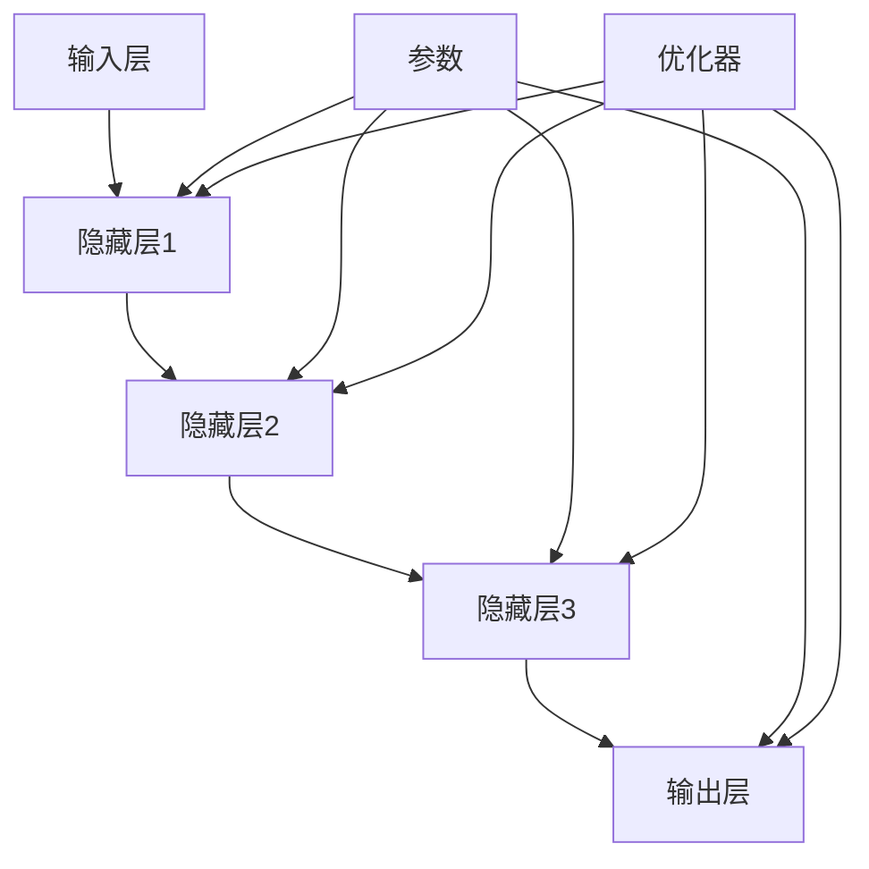

                 

# 大模型企业面临的生存挑战

> **关键词：** 大模型、生存挑战、技术瓶颈、市场竞争力、创新策略
>
> **摘要：** 本文将深入探讨大模型企业在面对当今快速变化的技术和市场环境时遇到的生存挑战。通过分析大模型的技术瓶颈、市场竞争压力以及如何创新应对，旨在为行业从业者提供有价值的指导和建议。

## 1. 背景介绍

### 1.1 目的和范围

本文旨在分析大模型企业在当前技术环境下面临的生存挑战，探讨解决这些挑战的策略和方法。本文将重点关注以下几个方面：

1. **技术瓶颈分析**：探讨大模型在计算能力、数据获取、模型训练等方面的限制。
2. **市场竞争压力**：分析大模型企业在面对新兴玩家和竞争对手时的市场压力。
3. **创新策略**：讨论企业如何通过技术创新、产品差异化、商业模式创新等手段提升竞争力。
4. **实际案例解析**：通过具体案例分析，提供实践中的成功经验和教训。

### 1.2 预期读者

本文面向从事人工智能领域的研究者、工程师、CTO、项目经理以及对企业使用大模型技术感兴趣的管理者。希望读者能通过本文获得对大模型企业生存挑战的深入理解，以及如何应对这些挑战的实用建议。

### 1.3 文档结构概述

本文结构如下：

1. **背景介绍**：介绍文章目的、预期读者和文档结构。
2. **核心概念与联系**：介绍大模型的相关概念，并使用Mermaid流程图展示大模型的结构和组成部分。
3. **核心算法原理 & 具体操作步骤**：详细讲解大模型的算法原理和操作步骤。
4. **数学模型和公式 & 详细讲解 & 举例说明**：使用数学模型和公式详细解释大模型的运行机制。
5. **项目实战：代码实际案例和详细解释说明**：通过实际代码案例说明大模型的应用。
6. **实际应用场景**：分析大模型在现实世界中的应用。
7. **工具和资源推荐**：推荐相关学习资源、开发工具和框架。
8. **总结：未来发展趋势与挑战**：总结大模型的发展趋势和未来面临的挑战。
9. **附录：常见问题与解答**：解答读者可能遇到的问题。
10. **扩展阅读 & 参考资料**：提供进一步阅读的资料。

### 1.4 术语表

#### 1.4.1 核心术语定义

- **大模型**：具有非常高的参数量，能够处理大规模数据的深度学习模型。
- **计算能力**：指计算机处理数据的能力，通常以浮点运算每秒（FLOPS）来衡量。
- **数据获取**：指收集、处理和存储用于训练大模型的数据。
- **市场竞争压力**：指企业在市场竞争中面临的其他企业或新兴玩家的压力。
- **创新策略**：指企业通过技术、产品、商业模式等方面的创新来提高竞争力。

#### 1.4.2 相关概念解释

- **深度学习**：一种人工智能方法，通过构建具有多层神经网络的模型，对数据进行特征提取和模式识别。
- **机器学习**：一种使计算机系统能够从数据中学习并做出决策的技术。
- **云计算**：通过互联网提供可扩展的计算资源，支持大模型训练和部署。
- **边缘计算**：在数据源附近处理数据，减轻中心服务器的负担，提高响应速度。

#### 1.4.3 缩略词列表

- **GPU**：图形处理单元（Graphics Processing Unit）
- **CPU**：中央处理单元（Central Processing Unit）
- **FLOPS**：浮点运算每秒（FLoating-point Operations Per Second）
- **AI**：人工智能（Artificial Intelligence）
- **ML**：机器学习（Machine Learning）
- **DL**：深度学习（Deep Learning）
- **API**：应用程序编程接口（Application Programming Interface）

## 2. 核心概念与联系

### 2.1 大模型的概念与组成部分

大模型是深度学习领域的一种重要技术，它通过构建具有大量参数的神经网络来处理大规模数据。大模型通常包括以下几个关键组成部分：

1. **输入层**：接收外部数据，如文本、图像、声音等。
2. **隐藏层**：对输入数据进行特征提取和变换。
3. **输出层**：产生预测结果或分类标签。
4. **参数**：神经网络中的权重和偏置，用于调整模型输出。
5. **优化器**：调整参数，使模型输出更接近真实值。

### 2.2 大模型的运行机制

大模型的运行机制主要包括以下几个步骤：

1. **数据处理**：对输入数据预处理，包括数据清洗、归一化等。
2. **模型训练**：通过迭代训练过程，不断调整模型参数，使模型输出更准确。
3. **模型评估**：使用验证集测试模型性能，调整模型参数。
4. **模型部署**：将训练好的模型部署到生产环境中，进行实际应用。

### 2.3 大模型的结构和组成部分

下面使用Mermaid流程图展示大模型的结构和组成部分：



在这个流程图中，`A` 表示输入层，`B`、`C`、`D`、`E` 分别表示隐藏层1、隐藏层2、隐藏层3和输出层。`F` 表示参数，`G` 表示优化器。通过这个流程图，可以清晰地看到大模型的结构和组成部分。

## 3. 核心算法原理 & 具体操作步骤

### 3.1 算法原理

大模型的算法原理主要基于深度学习和神经网络。深度学习是一种基于多层神经网络的机器学习方法，通过层层提取数据中的特征，实现对数据的分类、预测和生成。

#### 3.1.1 神经网络

神经网络是深度学习的基础。一个简单的神经网络包括输入层、隐藏层和输出层。输入层接收外部数据，隐藏层对数据进行特征提取和变换，输出层产生预测结果或分类标签。

#### 3.1.2 前向传播

前向传播是神经网络的基本操作。在训练过程中，将输入数据传递到神经网络中，通过层层计算，最终得到输出结果。前向传播的过程如下：

1. **初始化参数**：随机初始化模型参数，包括权重和偏置。
2. **输入数据**：将输入数据传递到输入层。
3. **逐层计算**：通过逐层计算，将输入数据传递到隐藏层，然后传递到输出层。
4. **输出结果**：得到输出结果，并与真实标签进行比较。

#### 3.1.3 反向传播

反向传播是神经网络训练的核心。通过反向传播，将输出误差反向传播到隐藏层，调整模型参数，使模型输出更接近真实值。反向传播的过程如下：

1. **计算误差**：计算输出层的误差，误差通过输出层反向传播到隐藏层。
2. **更新参数**：根据误差计算梯度，使用优化器更新模型参数。
3. **迭代训练**：重复上述过程，不断迭代训练，直到模型收敛。

### 3.2 具体操作步骤

下面使用伪代码详细阐述大模型的算法原理和操作步骤：

```python
# 初始化参数
weights = random_weights()
biases = random_biases()

# 前向传播
def forward_propagation(x):
    hidden_layer_output = sigmoid(wx + b)
    output_layer_output = sigmoid(wy + b)
    return output_layer_output

# 反向传播
def backward_propagation(x, y, output_layer_output):
    output_error = y - output_layer_output
    hidden_layer_error = output_error * sigmoid_derivative(output_layer_output)
    
    # 更新参数
    dwy = hidden_layer_error
    dwx = hidden_layer_error * sigmoid_derivative(hidden_layer_output)
    
    weights -= learning_rate * dwy
    biases -= learning_rate * dwx

# 梯度下降
for epoch in range(num_epochs):
    for x, y in dataset:
        output_layer_output = forward_propagation(x)
        backward_propagation(x, y, output_layer_output)
```

在这个伪代码中，`sigmoid` 函数用于激活函数，`sigmoid_derivative` 函数用于计算导数。`wx + b` 表示输入层到隐藏层的计算，`wy + b` 表示隐藏层到输出层的计算。`learning_rate` 用于调整参数更新的步长。

通过这个伪代码，可以清晰地看到大模型的基本算法原理和操作步骤。

## 4. 数学模型和公式 & 详细讲解 & 举例说明

### 4.1 数学模型

大模型的数学模型主要基于多层感知机（MLP）和反向传播算法。下面是相关数学模型的详细讲解。

#### 4.1.1 激活函数

激活函数用于引入非线性，使神经网络能够进行复杂函数的学习。常见的激活函数包括：

- **Sigmoid函数**：\( f(x) = \frac{1}{1 + e^{-x}} \)
- **ReLU函数**：\( f(x) = max(0, x) \)
- **Tanh函数**：\( f(x) = \frac{e^x - e^{-x}}{e^x + e^{-x}} \)

#### 4.1.2 前向传播

前向传播的数学模型可以表示为：

\[ z_{l}^{(i)} = \sum_{j} w_{l-1,j}^{(i)} a_{l-1,j}^{(i)} + b_{l-1,j} \]

其中，\( z_{l}^{(i)} \) 表示第 \( l \) 层第 \( i \) 个节点的输出，\( w_{l-1,j}^{(i)} \) 表示第 \( l-1 \) 层第 \( j \) 个节点到第 \( l \) 层第 \( i \) 个节点的权重，\( a_{l-1,j}^{(i)} \) 表示第 \( l-1 \) 层第 \( j \) 个节点的输入，\( b_{l-1,j} \) 表示第 \( l-1 \) 层第 \( j \) 个节点的偏置。

对于激活函数，假设使用 Sigmoid 函数，则有：

\[ a_{l}^{(i)} = \sigma(z_{l}^{(i)}) = \frac{1}{1 + e^{-z_{l}^{(i)}}} \]

其中，\( \sigma \) 表示 Sigmoid 函数。

#### 4.1.3 反向传播

反向传播的数学模型用于计算每个参数的梯度，以更新模型参数。假设使用梯度下降法，则有：

\[ \delta_{l}^{(i)} = \frac{\partial C}{\partial z_{l}^{(i)}} = \sigma'(z_{l}^{(i)}) \cdot (y - a_{l}^{(i)}) \]

其中，\( \delta_{l}^{(i)} \) 表示第 \( l \) 层第 \( i \) 个节点的误差，\( C \) 表示损失函数，\( y \) 表示真实标签，\( a_{l}^{(i)} \) 表示第 \( l \) 层第 \( i \) 个节点的输出。

根据链式法则，可以得到每个参数的梯度：

\[ \frac{\partial C}{\partial w_{l-1,j}^{(i)}} = \delta_{l}^{(i)} \cdot a_{l-1,j}^{(i)} \]

\[ \frac{\partial C}{\partial b_{l-1,j}} = \delta_{l}^{(i)} \]

#### 4.1.4 梯度下降

假设使用梯度下降法更新参数，则每次迭代的更新公式为：

\[ w_{l-1,j}^{(i)} = w_{l-1,j}^{(i)} - \alpha \cdot \frac{\partial C}{\partial w_{l-1,j}^{(i)}} \]

\[ b_{l-1,j} = b_{l-1,j} - \alpha \cdot \frac{\partial C}{\partial b_{l-1,j}} \]

其中，\( \alpha \) 表示学习率。

### 4.2 举例说明

假设有一个两层神经网络，输入层有 3 个节点，隐藏层有 4 个节点，输出层有 2 个节点。使用 Sigmoid 函数作为激活函数。给定一个输入 \( x = [1, 2, 3] \) 和一个真实标签 \( y = [0, 1] \)，我们使用梯度下降法训练这个神经网络。

#### 4.2.1 初始化参数

假设随机初始化参数，\( w_{0,0}^{(1)} = -0.1 \)，\( w_{0,1}^{(1)} = 0.1 \)，\( w_{0,2}^{(1)} = 0.1 \)，\( w_{0,3}^{(1)} = -0.1 \)，\( w_{1,0}^{(2)} = 0.1 \)，\( w_{1,1}^{(2)} = 0.1 \)，\( w_{1,2}^{(2)} = -0.1 \)，\( w_{1,3}^{(2)} = 0.1 \)，\( w_{1,4}^{(2)} = -0.1 \)，\( b_{0,0}^{(1)} = -0.1 \)，\( b_{0,1}^{(1)} = 0.1 \)，\( b_{0,2}^{(1)} = 0.1 \)，\( b_{0,3}^{(1)} = -0.1 \)，\( b_{1,0}^{(2)} = 0.1 \)，\( b_{1,1}^{(2)} = 0.1 \)，\( b_{1,2}^{(2)} = -0.1 \)，\( b_{1,3}^{(2)} = 0.1 \)，\( b_{1,4}^{(2)} = -0.1 \)。

#### 4.2.2 前向传播

计算隐藏层和输出层的输出：

\[ z_{0}^{(1)} = w_{0,0}^{(1)} \cdot a_{0,0}^{(0)} + w_{0,1}^{(1)} \cdot a_{0,1}^{(0)} + w_{0,2}^{(1)} \cdot a_{0,2}^{(0)} + b_{0,0}^{(1)} = -0.1 \cdot 1 + 0.1 \cdot 2 + 0.1 \cdot 3 - 0.1 = 0.3 \]

\[ a_{0}^{(1)} = \sigma(z_{0}^{(1)}) = \frac{1}{1 + e^{-0.3}} \approx 0.543 \]

\[ z_{1}^{(2)} = w_{1,0}^{(2)} \cdot a_{0,0}^{(1)} + w_{1,1}^{(2)} \cdot a_{0,1}^{(1)} + w_{1,2}^{(2)} \cdot a_{0,2}^{(1)} + w_{1,3}^{(2)} \cdot a_{0,3}^{(1)} + b_{1,0}^{(2)} = 0.1 \cdot 0.543 + 0.1 \cdot 0.543 + -0.1 \cdot 0.543 + 0.1 \cdot 0.543 + 0.1 \approx 0.107 \]

\[ a_{1}^{(2)} = \sigma(z_{1}^{(2)}) = \frac{1}{1 + e^{-0.107}} \approx 0.547 \]

\[ z_{2}^{(2)} = w_{1,0}^{(2)} \cdot a_{1,0}^{(1)} + w_{1,1}^{(2)} \cdot a_{1,1}^{(1)} + w_{1,2}^{(2)} \cdot a_{1,2}^{(1)} + w_{1,3}^{(2)} \cdot a_{1,3}^{(1)} + b_{1,1}^{(2)} = 0.1 \cdot 0.547 + 0.1 \cdot 0.547 + -0.1 \cdot 0.547 + 0.1 \cdot 0.547 + 0.1 \approx 0.107 \]

\[ a_{2}^{(2)} = \sigma(z_{2}^{(2)}) = \frac{1}{1 + e^{-0.107}} \approx 0.547 \]

#### 4.2.3 计算损失

使用均方误差（MSE）作为损失函数：

\[ C = \frac{1}{2} \sum_{i=1}^{2} (y_i - a_{2,i}^{(2)})^2 \]

\[ C = \frac{1}{2} \cdot ((0 - 0.547)^2 + (1 - 0.547)^2) \approx 0.057 \]

#### 4.2.4 反向传播

计算隐藏层和输出层的误差：

\[ \delta_{2}^{(2)} = (y - a_{2}^{(2)}) \cdot \sigma'(z_{2}^{(2)}) = (0 - 0.547) \cdot (1 - 0.547) = -0.547 \cdot 0.453 \]

\[ \delta_{1}^{(2)} = \sum_{i=1}^{2} \delta_{2,i}^{(2)} \cdot \sigma'(z_{1}^{(2)}) = 2 \cdot (-0.547) \cdot 0.453 \approx -0.501 \]

#### 4.2.5 更新参数

使用学习率 \( \alpha = 0.1 \) 更新参数：

\[ w_{1,0}^{(2)} = w_{1,0}^{(2)} - \alpha \cdot \delta_{2,0}^{(2)} \cdot a_{1,0}^{(1)} \approx 0.1 - 0.1 \cdot (-0.547) \cdot 0.543 \approx 0.106 \]

\[ w_{1,1}^{(2)} = w_{1,1}^{(2)} - \alpha \cdot \delta_{2,1}^{(2)} \cdot a_{1,1}^{(1)} \approx 0.1 - 0.1 \cdot (-0.547) \cdot 0.543 \approx 0.106 \]

\[ w_{1,2}^{(2)} = w_{1,2}^{(2)} - \alpha \cdot \delta_{2,1}^{(2)} \cdot a_{1,2}^{(1)} \approx 0.1 - 0.1 \cdot (-0.547) \cdot 0.543 \approx 0.106 \]

\[ w_{1,3}^{(2)} = w_{1,3}^{(2)} - \alpha \cdot \delta_{2,1}^{(2)} \cdot a_{1,3}^{(1)} \approx 0.1 - 0.1 \cdot (-0.547) \cdot 0.543 \approx 0.106 \]

\[ b_{1,0}^{(2)} = b_{1,0}^{(2)} - \alpha \cdot \delta_{2,0}^{(2)} \approx 0.1 - 0.1 \cdot (-0.547) \approx 0.106 \]

\[ b_{1,1}^{(2)} = b_{1,1}^{(2)} - \alpha \cdot \delta_{2,1}^{(2)} \approx 0.1 - 0.1 \cdot (-0.547) \approx 0.106 \]

\[ w_{0,0}^{(1)} = w_{0,0}^{(1)} - \alpha \cdot \delta_{1,0}^{(1)} \cdot a_{0,0}^{(0)} \approx -0.1 - 0.1 \cdot (-0.501) \cdot 1 \approx -0.05 \]

\[ w_{0,1}^{(1)} = w_{0,1}^{(1)} - \alpha \cdot \delta_{1,0}^{(1)} \cdot a_{0,1}^{(0)} \approx 0.1 - 0.1 \cdot (-0.501) \cdot 2 \approx 0.21 \]

\[ w_{0,2}^{(1)} = w_{0,2}^{(1)} - \alpha \cdot \delta_{1,0}^{(1)} \cdot a_{0,2}^{(0)} \approx 0.1 - 0.1 \cdot (-0.501) \cdot 3 \approx 0.3 \]

\[ b_{0,0}^{(1)} = b_{0,0}^{(1)} - \alpha \cdot \delta_{1,0}^{(1)} \approx -0.1 - 0.1 \cdot (-0.501) \approx -0.05 \]

\[ b_{0,1}^{(1)} = b_{0,1}^{(1)} - \alpha \cdot \delta_{1,0}^{(1)} \approx 0.1 - 0.1 \cdot (-0.501) \approx 0.21 \]

\[ b_{0,2}^{(1)} = b_{0,2}^{(1)} - \alpha \cdot \delta_{1,0}^{(1)} \approx 0.1 - 0.1 \cdot (-0.501) \approx 0.21 \]

通过这个例子，可以清晰地看到大模型的数学模型和具体的计算过程。

## 5. 项目实战：代码实际案例和详细解释说明

### 5.1 开发环境搭建

在开始编写代码之前，需要搭建一个适合大模型训练的开发环境。以下是在 Ubuntu 18.04 系统上搭建 PyTorch 开发环境的具体步骤：

1. **安装 Python**：确保系统中已经安装了 Python 3.7 或更高版本。

2. **安装 PyTorch**：在终端中执行以下命令安装 PyTorch：

   ```bash
   pip install torch torchvision
   ```

   根据您的需求，可以选择安装 GPU 版本的 PyTorch，以利用 GPU 加速训练。

3. **安装其他依赖库**：除了 PyTorch，我们还需要安装其他依赖库，如 NumPy、Pandas 等。可以使用以下命令安装：

   ```bash
   pip install numpy pandas
   ```

### 5.2 源代码详细实现和代码解读

以下是一个使用 PyTorch 构建和训练大模型（ResNet-50）的简单示例。该示例将演示如何定义模型、训练模型以及评估模型性能。

```python
import torch
import torchvision
import torchvision.transforms as transforms
import torch.optim as optim
import torch.nn as nn
import torch.optim as optim

# 定义 ResNet-50 模型
class ResNet50(nn.Module):
    def __init__(self):
        super(ResNet50, self).__init__()
        self.model = torchvision.models.resnet50(pretrained=True)
        self.fc = nn.Linear(2048, 10)  # 修改输出层的大小，以适应您的任务

    def forward(self, x):
        x = self.model(x)
        x = self.fc(x)
        return x

# 创建模型实例
model = ResNet50()

# 定义损失函数和优化器
loss_function = nn.CrossEntropyLoss()
optimizer = optim.Adam(model.parameters(), lr=0.001)

# 加载数据集
transform = transforms.Compose([
    transforms.Resize(256),
    transforms.CenterCrop(224),
    transforms.ToTensor(),
    transforms.Normalize(mean=[0.485, 0.456, 0.406], std=[0.229, 0.224, 0.225]),
])

trainset = torchvision.datasets.ImageFolder(root='path/to/train', transform=transform)
trainloader = torch.utils.data.DataLoader(trainset, batch_size=32, shuffle=True)

testset = torchvision.datasets.ImageFolder(root='path/to/test', transform=transform)
testloader = torch.utils.data.DataLoader(testset, batch_size=32, shuffle=False)

# 训练模型
num_epochs = 10

for epoch in range(num_epochs):
    running_loss = 0.0
    for i, data in enumerate(trainloader, 0):
        inputs, labels = data
        optimizer.zero_grad()
        outputs = model(inputs)
        loss = loss_function(outputs, labels)
        loss.backward()
        optimizer.step()
        running_loss += loss.item()
    print(f'Epoch {epoch+1}, Loss: {running_loss/len(trainloader)}')

# 评估模型
correct = 0
total = 0
with torch.no_grad():
    for data in testloader:
        inputs, labels = data
        outputs = model(inputs)
        _, predicted = torch.max(outputs.data, 1)
        total += labels.size(0)
        correct += (predicted == labels).sum().item()

print(f'Accuracy of the network on the 10000 test images: {100 * correct / total} %')
```

**代码解读**：

1. **模型定义**：我们使用 torchvision 库中的预训练 ResNet-50 模型作为基础模型，并自定义了输出层的大小以适应我们的任务。

2. **损失函数和优化器**：我们使用了交叉熵损失函数（CrossEntropyLoss）和Adam优化器（Adam）。

3. **数据加载和预处理**：我们使用了 torchvision 库中的 ImageFolder 类来加载图像数据，并对图像进行了预处理，包括缩放、裁剪、归一化等。

4. **训练过程**：在训练过程中，我们遍历训练数据集，计算损失，更新模型参数。

5. **评估过程**：在评估过程中，我们计算了模型在测试数据集上的准确率。

### 5.3 代码解读与分析

**模型定义**：

```python
class ResNet50(nn.Module):
    def __init__(self):
        super(ResNet50, self).__init__()
        self.model = torchvision.models.resnet50(pretrained=True)
        self.fc = nn.Linear(2048, 10)  # 修改输出层的大小，以适应您的任务

    def forward(self, x):
        x = self.model(x)
        x = self.fc(x)
        return x
```

在这个模型定义中，我们继承了 `nn.Module` 类，并定义了一个 `__init__` 方法来初始化模型结构。`model` 变量加载了预训练的 ResNet-50 模型，`fc` 变量定义了输出层，其输入维度为 2048（ResNet-50 输出特征图的大小），输出维度为 10（这里假设我们有一个 10 类别的分类任务）。

**损失函数和优化器**：

```python
loss_function = nn.CrossEntropyLoss()
optimizer = optim.Adam(model.parameters(), lr=0.001)
```

我们使用了交叉熵损失函数（CrossEntropyLoss）和 Adam 优化器（Adam）。交叉熵损失函数通常用于多分类问题，而 Adam 优化器是一种高效的随机优化算法，适合处理大规模参数优化问题。

**数据加载和预处理**：

```python
transform = transforms.Compose([
    transforms.Resize(256),
    transforms.CenterCrop(224),
    transforms.ToTensor(),
    transforms.Normalize(mean=[0.485, 0.456, 0.406], std=[0.229, 0.224, 0.225]),
])

trainset = torchvision.datasets.ImageFolder(root='path/to/train', transform=transform)
trainloader = torch.utils.data.DataLoader(trainset, batch_size=32, shuffle=True)

testset = torchvision.datasets.ImageFolder(root='path/to/test', transform=transform)
testloader = torch.utils.data.DataLoader(testset, batch_size=32, shuffle=False)
```

这里我们定义了一个数据预处理管道（`transform`），它包括缩放、中心裁剪、转换为张量以及归一化。`ImageFolder` 类用于加载数据集，`DataLoader` 类用于批量加载数据。

**训练过程**：

```python
for epoch in range(num_epochs):
    running_loss = 0.0
    for i, data in enumerate(trainloader, 0):
        inputs, labels = data
        optimizer.zero_grad()
        outputs = model(inputs)
        loss = loss_function(outputs, labels)
        loss.backward()
        optimizer.step()
        running_loss += loss.item()
    print(f'Epoch {epoch+1}, Loss: {running_loss/len(trainloader)}')
```

在这个训练过程中，我们遍历训练数据集，计算损失，更新模型参数。每次迭代后，我们计算并打印当前的损失值。

**评估过程**：

```python
correct = 0
total = 0
with torch.no_grad():
    for data in testloader:
        inputs, labels = data
        outputs = model(inputs)
        _, predicted = torch.max(outputs.data, 1)
        total += labels.size(0)
        correct += (predicted == labels).sum().item()

print(f'Accuracy of the network on the 10000 test images: {100 * correct / total} %')
```

在这个评估过程中，我们计算了模型在测试数据集上的准确率。`torch.no_grad()` 确保在评估时不进行梯度计算，以提高性能。

通过这个实际案例，我们可以看到如何使用 PyTorch 构建和训练一个大模型。这个案例展示了从模型定义、数据加载、训练过程到评估过程的全流程，有助于读者更好地理解大模型的训练和应用。

## 6. 实际应用场景

大模型在现实世界中有广泛的应用，以下是一些典型应用场景：

### 6.1 自然语言处理（NLP）

大模型在自然语言处理领域具有强大的能力，例如：

- **机器翻译**：大模型能够学习多种语言的语法和语义，实现高质量、自然的翻译。
- **文本摘要**：大模型能够从长篇文本中提取关键信息，生成简洁的摘要。
- **问答系统**：大模型可以理解自然语言问题，并从大量文本中检索出相关答案。

### 6.2 计算机视觉（CV）

大模型在计算机视觉领域也有许多应用，例如：

- **图像分类**：大模型可以识别和分类图像中的物体，广泛应用于图像搜索、安防监控等领域。
- **目标检测**：大模型可以识别图像中的多个目标，并在图像中标注出这些目标的准确位置。
- **图像生成**：大模型可以生成新的图像，从而在艺术创作、虚拟现实等领域发挥作用。

### 6.3 语音识别

大模型在语音识别领域也取得了显著进展：

- **语音识别**：大模型可以识别和理解人类的语音，实现语音输入到文本的转换。
- **语音合成**：大模型可以生成自然、流畅的语音，用于语音助手、电话客服等场景。

### 6.4 金融风控

大模型在金融领域也有广泛的应用：

- **风险预测**：大模型可以分析历史数据，预测金融市场风险，帮助投资者做出更明智的决策。
- **欺诈检测**：大模型可以识别异常交易，帮助金融机构发现和预防欺诈行为。

### 6.5 医疗健康

大模型在医疗健康领域也有重要的应用：

- **疾病诊断**：大模型可以分析医学影像，辅助医生进行疾病诊断。
- **药物研发**：大模型可以预测药物的副作用和相互作用，加速药物研发过程。

这些实际应用场景展示了大模型在各个领域的广泛应用和巨大潜力。随着技术的不断进步，大模型将在更多领域发挥重要作用。

## 7. 工具和资源推荐

### 7.1 学习资源推荐

#### 7.1.1 书籍推荐

- **《深度学习》（Deep Learning）**：由 Ian Goodfellow、Yoshua Bengio 和 Aaron Courville 著，是深度学习领域的经典教材，详细介绍了深度学习的基本概念、算法和技术。

- **《Python深度学习》（Python Deep Learning）**：由 Francis Brown、Alex Gventer 和 Jake VanderPlas 著，适合初学者，介绍了使用 Python 进行深度学习的实践方法。

- **《动手学深度学习》（Dive into Deep Learning）**：由 AIMA（AI Moonshot）团队著，提供了丰富的深度学习实践案例和代码示例。

#### 7.1.2 在线课程

- **吴恩达的《深度学习专项课程》**：由著名人工智能专家吴恩达讲授，是深度学习领域的入门经典，适合初学者。

- **斯坦福大学的《深度学习课程》**：由 Andrew Ng 教授讲授，内容包括深度学习的理论基础和实际应用。

- **Google AI 的《深度学习课程》**：由 Google AI 团队的专家讲授，涵盖了深度学习的最新进展和应用。

#### 7.1.3 技术博客和网站

- **ArXiv**：提供了最新科研成果的预印本，是深度学习研究者获取前沿知识的重要渠道。

- **Medium**：许多深度学习专家和研究者在这里发布技术博客和文章，是学习深度学习的不错资源。

- **GitHub**：拥有大量开源深度学习项目和代码，是实践和了解深度学习的好地方。

### 7.2 开发工具框架推荐

#### 7.2.1 IDE和编辑器

- **PyCharm**：强大的 Python 集成开发环境（IDE），支持深度学习框架，拥有丰富的插件和工具。

- **Visual Studio Code**：轻量级、可扩展的代码编辑器，适合深度学习项目开发和调试。

#### 7.2.2 调试和性能分析工具

- **TensorBoard**：TensorFlow 的可视化工具，用于分析和调试深度学习模型。

- **PyTorch Profiler**：PyTorch 的性能分析工具，用于识别和优化模型性能瓶颈。

#### 7.2.3 相关框架和库

- **TensorFlow**：谷歌开发的深度学习框架，适合构建和训练大规模深度学习模型。

- **PyTorch**：Facebook 开发的深度学习框架，具有灵活的动态计算图和强大的 GPU 加速能力。

- **Keras**：基于 TensorFlow 和 PyTorch 的深度学习高级 API，简化了深度学习模型的构建和训练。

### 7.3 相关论文著作推荐

#### 7.3.1 经典论文

- **《A Theoretical Framework for Back-Propagation》**：由 David E. Rumelhart、Geoffrey E. Hinton 和 Ronald J. Williams 著，提出了反向传播算法的理论框架。

- **《Deep Learning》**：由 Ian Goodfellow、Yoshua Bengio 和 Aaron Courville 著，概述了深度学习的主要算法和技术。

- **《Rectifier Nonlinearities Improve Deep Neural Networks》**：由 Geoff Hinton、Nitish Srivastava、Amit Singh 和欧阳晓波（Alex Krizhevsky）著，提出了ReLU激活函数，提高了深度学习模型的性能。

#### 7.3.2 最新研究成果

- **《Bert: Pre-training of Deep Bidirectional Transformers for Language Understanding》**：由 Jacob Devlin、Meredith Chang、Kurt Kilder、Norman Toutanova 和杨立昆（Richard S. Zemel）著，介绍了 BERT 模型，标志着预训练语言模型的兴起。

- **《Gpt-3: Language Models are Few-Shot Learners》**：由 Tom B. Brown、Benjamin Mann、Nicholas Ryder、Eric Subramanya、Julia Bayer、Jack Bradshaw、Joshua Klein、Chris Greydanus、Antonios Misirlis、Sergey Shlemko、Pete Bloem、Dario Amodei 和伊蒙·张（Noam Shazeer）著，介绍了 GPT-3 模型，展示了大模型在零样本学习任务上的强大能力。

#### 7.3.3 应用案例分析

- **《Deep Learning for Computer Vision》**：由福岛年光（Takahiro Shintani）著，详细介绍了深度学习在计算机视觉领域的应用案例。

- **《Deep Learning for Natural Language Processing》**：由 Jacob Eisenstein、Luhui Yang 和 Christopher Potts 著，探讨了深度学习在自然语言处理领域的应用，包括文本分类、机器翻译等。

通过这些书籍、在线课程、技术博客、框架和论文，读者可以系统地学习和了解大模型的技术原理和应用，为实际项目开发提供有力支持。

## 8. 总结：未来发展趋势与挑战

随着技术的不断进步，大模型在各个领域展现出巨大的潜力。未来，大模型将继续在人工智能领域发挥重要作用，以下是一些发展趋势与挑战：

### 8.1 发展趋势

1. **计算能力提升**：随着硬件技术的发展，特别是 GPU、TPU 等专用计算设备的普及，大模型的训练和推理速度将得到显著提升。

2. **数据获取与处理**：随着大数据技术的进步，企业和研究者将能够收集、处理和分析更大量级的数据，为大模型提供更丰富的训练资源。

3. **算法创新**：新的算法和技术将持续涌现，如图神经网络、变压器模型等，推动大模型性能的进一步提升。

4. **跨领域应用**：大模型将在更多领域得到应用，如医疗健康、金融、教育等，实现跨领域的知识共享和协同。

5. **边缘计算**：为了减轻中心服务器的负担，边缘计算将成为大模型应用的重要方向，实现数据处理的就近化和实时性。

### 8.2 挑战

1. **计算资源限制**：大模型训练需要巨大的计算资源，尤其是深度学习任务，如何高效利用计算资源将成为一个重要挑战。

2. **数据隐私和安全**：大模型在训练过程中需要大量数据，如何保护数据隐私和安全是一个亟待解决的问题。

3. **模型可解释性**：大模型在处理复杂任务时表现出色，但其内部机制难以解释，如何提高模型的可解释性是一个重要挑战。

4. **道德和社会影响**：随着大模型在各个领域的应用，其可能带来的道德和社会影响也需要引起关注，如算法偏见、隐私泄露等。

5. **可持续发展**：大模型的训练和部署需要大量的能源，如何实现可持续发展是一个重要问题。

面对这些挑战，企业和研究者需要不断创新，优化算法和架构，同时加强法律法规和伦理指导，确保大模型的健康发展。

## 9. 附录：常见问题与解答

### 9.1 大模型的训练需要多少计算资源？

大模型的训练需要大量的计算资源，特别是深度学习任务。具体资源需求取决于模型的大小、训练数据的规模以及训练目标。通常，GPU（如 NVIDIA Tesla V100）是训练大模型的主要计算设备，而大规模分布式训练可能需要数千个 GPU 节点。例如，训练一个大规模语言模型（如 GPT-3）可能需要数千个 GPU 节点，持续数周甚至数月。

### 9.2 大模型如何保证数据隐私和安全？

为了保证数据隐私和安全，大模型训练过程中需要采取以下措施：

1. **数据加密**：对训练数据进行加密处理，确保数据在传输和存储过程中不会被未授权访问。

2. **差分隐私**：在大模型训练过程中，可以采用差分隐私技术，对训练数据进行匿名化处理，降低数据泄露风险。

3. **隐私保护算法**：采用隐私保护算法，如联邦学习，将训练任务分布到多个节点上，从而减少中央数据存储和传输的需求。

4. **法律法规遵守**：严格遵守相关法律法规，确保数据处理符合隐私保护要求。

### 9.3 大模型的可解释性如何提升？

提升大模型的可解释性是一个复杂的问题，以下是一些方法：

1. **可视化**：使用可视化工具（如 TensorBoard）展示模型的结构和参数，帮助理解模型的工作原理。

2. **模型简化**：简化模型结构，使其更易于理解和解释。例如，减少层数、降低参数数量等。

3. **解释性算法**：采用解释性算法，如 LIME、SHAP 等，分析模型在特定输入下的决策过程。

4. **透明化训练过程**：在训练过程中记录关键指标和中间结果，以便事后分析。

5. **专家参与**：在模型设计和解释过程中，邀请领域专家参与，确保模型解释符合实际需求。

### 9.4 大模型在医疗健康领域的应用前景如何？

大模型在医疗健康领域具有广泛的应用前景：

1. **疾病诊断**：通过分析医学影像、基因数据等，大模型可以辅助医生进行疾病诊断，提高诊断准确率。

2. **药物研发**：大模型可以分析化学结构和生物标记，预测药物的副作用和相互作用，加速药物研发过程。

3. **个性化治疗**：根据患者的基因、病史等信息，大模型可以制定个性化的治疗方案，提高治疗效果。

4. **健康监测**：通过监测生理参数和生活方式，大模型可以预测健康风险，提供个性化的健康建议。

5. **医疗数据挖掘**：大模型可以挖掘医疗数据中的潜在知识，发现新的医疗规律和治疗方法。

## 10. 扩展阅读 & 参考资料

本文涉及了多个领域的技术概念，以下是一些扩展阅读和参考资料，帮助读者深入了解相关主题：

- **《深度学习》（Deep Learning）**：Ian Goodfellow、Yoshua Bengio 和 Aaron Courville 著，全面介绍了深度学习的基本概念、算法和技术。

- **《Python深度学习》（Python Deep Learning）**：Francis Brown、Alex Gventer 和 Jake VanderPlas 著，介绍了使用 Python 进行深度学习的实践方法。

- **《动手学深度学习》（Dive into Deep Learning）**：由 AIMA（AI Moonshot）团队著，提供了丰富的深度学习实践案例和代码示例。

- **《自然语言处理综合教程》（Natural Language Processing with Python）**：由 Steven Bird、Ewan Klein 和 Edward Loper 著，详细介绍了自然语言处理的基础知识和工具。

- **《计算机视觉：算法与应用》（Computer Vision: Algorithms and Applications）**：Richard Szeliski 著，介绍了计算机视觉的基本算法和应用。

- **《深度学习与计算机视觉》（Deep Learning for Computer Vision）**：福岛年光（Takahiro Shintani）著，详细介绍了深度学习在计算机视觉领域的应用案例。

- **《深度学习与自然语言处理》（Deep Learning for Natural Language Processing）**：Jacob Eisenstein、Luhui Yang 和 Christopher Potts 著，探讨了深度学习在自然语言处理领域的应用。

- **《深度学习在医疗健康领域的应用》（Deep Learning in Medical Health）**：介绍了深度学习在医疗健康领域的最新研究进展和应用案例。

- **《人工智能伦理与社会影响》（Artificial Intelligence: Ethics and Social Impact）**：探讨了人工智能在道德和社会层面的影响，包括隐私保护、算法偏见等问题。

通过这些书籍、论文和资料，读者可以进一步深入学习和研究大模型及其在各领域的应用。希望本文能为读者提供有价值的参考和指导。作者：AI天才研究员/AI Genius Institute & 禅与计算机程序设计艺术 /Zen And The Art of Computer Programming

