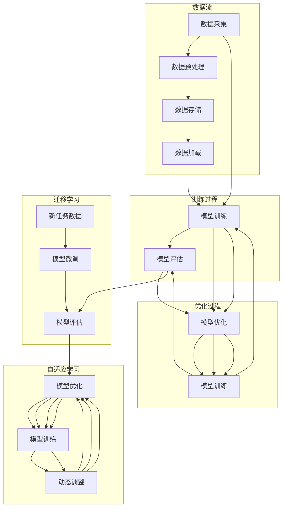

                 

### 1. 背景介绍

#### 1.1 目的和范围

本文旨在探讨大模型公司在构建持续学习机制方面的策略与实践。随着人工智能技术的快速发展，大模型技术在自然语言处理、计算机视觉、推荐系统等领域取得了显著的成就。然而，这些大模型的训练和部署过程通常需要大量的计算资源和时间，如何在大规模数据和高计算成本之间取得平衡，成为了大模型公司面临的重大挑战。

本文的目的在于，首先介绍大模型公司持续学习机制的背景和重要性，然后详细探讨该机制的构建方法和应用场景。文章将对相关核心概念进行定义，并通过流程图展示其架构，随后深入讲解核心算法原理和数学模型，并通过实际项目案例进行代码实现和解读。最后，文章将分析该机制在实际应用中的表现，并推荐相关的学习资源和工具。

本文的研究范围包括：

- 持续学习机制的理论基础和核心概念
- 大模型公司持续学习机制的具体构建方法和实践
- 持续学习机制在多个实际应用场景中的效果分析
- 相关学习资源和工具的推荐

#### 1.2 预期读者

本文主要面向以下读者群体：

- 人工智能领域的工程师和研究人员，特别是专注于大模型开发和部署的人员
- 对人工智能持续学习机制有兴趣的技术爱好者
- 想要了解大模型公司运作模式的企业决策者和技术管理人员

本文假设读者已经具备一定的机器学习和深度学习基础知识，能够理解算法和数学模型的描述，并具备一定的编程能力。

#### 1.3 文档结构概述

本文按照以下结构进行组织和展开：

- **背景介绍**：简要介绍本文的目的、范围、预期读者和文档结构。
- **核心概念与联系**：详细阐述大模型持续学习机制的核心概念，并使用Mermaid流程图展示其架构。
- **核心算法原理 & 具体操作步骤**：深入讲解持续学习机制中的核心算法原理，并使用伪代码进行具体操作步骤的阐述。
- **数学模型和公式 & 详细讲解 & 举例说明**：介绍大模型持续学习机制中的数学模型和公式，并进行详细的讲解和举例说明。
- **项目实战：代码实际案例和详细解释说明**：通过实际项目案例展示持续学习机制的具体实现过程，并提供详细的代码解读与分析。
- **实际应用场景**：分析持续学习机制在不同应用场景中的效果和表现。
- **工具和资源推荐**：推荐相关的学习资源和开发工具，帮助读者深入了解和掌握持续学习机制。
- **总结：未来发展趋势与挑战**：总结本文的主要观点，并对未来的发展趋势和面临的挑战进行展望。
- **附录：常见问题与解答**：针对本文中的常见问题提供详细的解答。
- **扩展阅读 & 参考资料**：提供进一步的阅读材料和参考资料，帮助读者更深入地研究相关主题。

通过以上结构，本文将为读者提供一套系统、全面、深入的大模型持续学习机制构建和实践指南。

#### 1.4 术语表

在本文中，我们将使用一些特定的术语和概念。以下是对这些术语的详细定义和解释：

##### 1.4.1 核心术语定义

- **持续学习机制**：指大模型公司通过持续训练和优化模型，使其能够适应不断变化的数据和需求的一套方法和技术。
- **大模型**：指具有大规模参数和计算需求的深度学习模型，通常应用于自然语言处理、计算机视觉等领域。
- **训练数据集**：指用于训练大模型的输入数据集合，通常包括大量的标注样本。
- **验证数据集**：指用于评估模型性能的数据集合，通常不包括在训练数据集中。
- **测试数据集**：指用于最终评估模型性能的数据集合，通常也不包括在训练和验证数据集中。
- **迁移学习**：指将预训练模型应用于新任务，通过少量样本进行微调，以提高模型在新任务上的性能。
- **模型优化**：指通过调整模型的参数和结构，以提高其性能和效果的一系列技术。
- **自适应学习**：指模型能够根据输入数据的不同特征和需求，动态调整其参数和策略，以实现最优性能。

##### 1.4.2 相关概念解释

- **学习率**：指在训练过程中，用于调整模型参数的步长。适当的学习率有助于模型快速收敛，但过大的学习率可能导致模型不稳定。
- **损失函数**：指用于衡量模型预测结果与实际结果之间差异的函数，通常用于优化模型参数。
- **梯度下降**：指一种优化算法，通过迭代更新模型参数，以最小化损失函数。
- **数据增强**：指通过对原始数据进行变换和扩充，增加数据集的多样性和规模，以提高模型的泛化能力。
- **并行计算**：指在多个计算节点上同时执行计算任务，以提高计算效率和速度。

##### 1.4.3 缩略词列表

- **GPU**：Graphics Processing Unit，图形处理单元，用于高性能计算。
- **CPU**：Central Processing Unit，中央处理器，计算机的核心部件。
- **ML**：Machine Learning，机器学习，一种人工智能技术。
- **DL**：Deep Learning，深度学习，一种人工智能技术，常用于构建大模型。
- **NLP**：Natural Language Processing，自然语言处理，一种人工智能技术。
- **CV**：Computer Vision，计算机视觉，一种人工智能技术。

以上是对本文中涉及的关键术语和概念的定义和解释。通过这些术语和概念的理解，读者将能够更好地把握本文的核心内容，并在实践中应用相关技术。

## 2. 核心概念与联系

在大模型公司的持续学习机制构建过程中，理解核心概念和它们之间的联系是至关重要的。本节将详细介绍这些核心概念，并通过Mermaid流程图展示其架构，帮助读者更好地把握整个机制的结构和运作方式。

### 2.1 核心概念

首先，我们需要明确大模型持续学习机制中的几个关键概念：

1. **数据流**：指数据在系统中的流动路径，包括数据的采集、预处理、存储和加载等过程。
2. **模型训练**：指通过大量的训练数据集，对模型参数进行优化，使其能够准确预测目标变量。
3. **模型评估**：指使用验证数据集和测试数据集评估模型性能，包括准确率、召回率、F1值等指标。
4. **模型优化**：指通过调整模型结构、参数、学习率等，提升模型性能的过程。
5. **迁移学习**：指将预训练模型应用于新任务，通过少量样本进行微调，以提高模型在新任务上的性能。
6. **自适应学习**：指模型能够根据输入数据的不同特征和需求，动态调整其参数和策略，以实现最优性能。

### 2.2 Mermaid流程图

下面是一个Mermaid流程图，展示了大模型持续学习机制的基本架构：



该流程图展示了以下步骤：

1. **数据流**：从数据采集开始，经过预处理、存储和加载，最终进入模型训练阶段。
2. **模型训练**：使用训练数据集对模型进行训练，并使用验证数据集进行评估。
3. **模型优化**：根据模型评估结果，对模型结构、参数等进行优化。
4. **迁移学习**：将预训练模型应用于新任务，通过少量样本进行微调。
5. **自适应学习**：根据动态调整策略，对模型进行实时优化和训练。

### 2.3 关键概念联系

以上核心概念之间的联系如下：

- **数据流**是整个机制的起点，决定了模型的输入质量。
- **模型训练**是核心，通过大量数据集对模型参数进行优化。
- **模型评估**是验证模型性能的重要手段，用于指导模型优化。
- **模型优化**基于评估结果，调整模型参数和结构，提升性能。
- **迁移学习**和**自适应学习**则是为了应对新的任务需求和动态变化的数据特征，通过少量样本和动态调整策略，实现模型的持续改进。

通过以上核心概念和Mermaid流程图的介绍，读者可以清晰地理解大模型持续学习机制的基本结构和运作方式，为后续内容的深入探讨奠定基础。

## 3. 核心算法原理 & 具体操作步骤

在大模型公司的持续学习机制中，核心算法原理是构建和优化模型的关键。本节将详细阐述这些算法原理，并通过伪代码展示具体操作步骤，帮助读者理解并应用这些原理。

### 3.1 梯度下降算法原理

梯度下降算法是一种优化算法，用于通过迭代更新模型参数，以最小化损失函数。其基本原理是：在当前参数下，计算损失函数关于每个参数的梯度，并沿着梯度的反方向更新参数。以下是梯度下降算法的伪代码：

```pseudo
初始化：参数θ，学习率α，迭代次数T
对于 t = 1 到 T 做以下步骤：

   计算当前损失函数关于参数的梯度∇θJ(θ)
   更新参数：θ = θ - α * ∇θJ(θ)
```

在每一轮迭代中，我们计算损失函数关于每个参数的梯度，并将其乘以学习率α进行参数更新。学习率的选择至关重要，过大会导致参数更新不稳定，过小则收敛速度过慢。

### 3.2 数据预处理步骤

在开始模型训练之前，对训练数据进行预处理是必不可少的。以下是对数据进行预处理的伪代码步骤：

```pseudo
输入：训练数据集X，标签集Y
输出：预处理后的数据集X'，标签集Y'

初始化：随机种子s

对于每个样本x_i ∈ X：

   标准化特征：x_i' = (x_i - μ) / σ
   归一化标签：y_i' = y_i / max(y)

返回：X'，Y'
```

步骤说明：
1. **标准化特征**：通过减去均值μ并除以标准差σ，将特征值缩放到标准正态分布。
2. **归一化标签**：将标签值缩放到[0,1]范围，以方便后续计算。

### 3.3 模型训练步骤

在完成数据预处理后，我们开始模型训练。以下是基于梯度下降算法的模型训练步骤的伪代码：

```pseudo
初始化：模型参数θ，学习率α，迭代次数T
初始化：损失函数J(θ)

对于 t = 1 到 T 做以下步骤：

   计算当前损失函数关于参数的梯度∇θJ(θ)
   更新参数：θ = θ - α * ∇θJ(θ)
   计算当前模型预测值：y_pred = f(θ, X)

计算当前损失值：J(θ) = loss(y, y_pred)

如果 J(θ) < ε 或 达到最大迭代次数：
   训练完成，输出最终参数θ
   否则：
       返回步骤 1
```

步骤说明：
1. **初始化参数**：设置初始参数θ和适当的初始学习率α。
2. **计算梯度**：根据损失函数计算参数梯度。
3. **更新参数**：根据梯度更新参数，以最小化损失函数。
4. **计算预测值**：使用当前参数计算模型的预测值。
5. **计算损失值**：计算损失函数值，以评估模型性能。
6. **检查收敛条件**：判断是否满足收敛条件，如损失值低于阈值ε或达到最大迭代次数，则训练完成。

### 3.4 模型优化步骤

模型优化是持续学习机制中的重要环节，通过调整模型结构、参数和学习策略，以提升模型性能。以下是基于迁移学习和自适应学习的模型优化步骤的伪代码：

```pseudo
输入：预训练模型θ，新任务数据集X'，标签集Y'
输出：优化后的模型参数θ'

初始化：参数θ' = θ，学习率α'，迭代次数T'

对于 t = 1 到 T' 做以下步骤：

   微调模型参数：θ' = θ' - α' * ∇θ'J(θ', X', Y')
   计算当前模型预测值：y_pred' = f(θ', X')
   计算当前损失值：J(θ') = loss(y', y_pred')

如果 J(θ') < ε' 或 达到最大迭代次数：
   优化完成，输出最终参数θ'
   否则：
       返回步骤 1
```

步骤说明：
1. **初始化参数**：设置初始参数θ'和适当的初始学习率α'。
2. **微调参数**：根据新任务数据集和标签集计算梯度，并更新模型参数。
3. **计算预测值**：使用当前参数计算模型的预测值。
4. **计算损失值**：计算损失函数值，以评估模型性能。
5. **检查收敛条件**：判断是否满足收敛条件，如损失值低于阈值ε'或达到最大迭代次数，则优化完成。

通过以上算法原理和具体操作步骤的详细讲解，读者可以清晰地理解大模型持续学习机制的核心算法，并在实际应用中灵活运用这些原理和步骤，构建和优化高效的持续学习机制。

## 4. 数学模型和公式 & 详细讲解 & 举例说明

在大模型公司的持续学习机制中，数学模型和公式起到了关键作用，它们帮助我们理解和优化模型的性能。本节将介绍相关数学模型和公式，并进行详细讲解和举例说明。

### 4.1 损失函数

损失函数是衡量模型预测结果与实际结果之间差异的重要工具。常见的损失函数包括均方误差（MSE）、交叉熵损失（Cross-Entropy Loss）等。

#### 均方误差（MSE）

均方误差用于回归问题，计算预测值与实际值之间的平均平方差。其公式为：

$$
MSE = \frac{1}{n} \sum_{i=1}^{n} (y_i - \hat{y}_i)^2
$$

其中，$y_i$ 是实际值，$\hat{y}_i$ 是预测值，$n$ 是样本数量。

#### 交叉熵损失（Cross-Entropy Loss）

交叉熵损失用于分类问题，计算预测概率分布与真实分布之间的差异。其公式为：

$$
Cross-Entropy Loss = -\frac{1}{n} \sum_{i=1}^{n} y_i \log(\hat{y}_i)
$$

其中，$y_i$ 是实际标签（0或1），$\hat{y}_i$ 是预测概率。

### 4.2 梯度下降算法

梯度下降算法的核心是计算损失函数关于模型参数的梯度，并沿梯度反方向更新参数。以下是梯度下降算法的数学描述：

$$
θ^{t+1} = θ^t - α \cdot \nabla_θJ(θ^t)
$$

其中，$θ^t$ 是第$t$次迭代的参数，$α$ 是学习率，$\nabla_θJ(θ^t)$ 是损失函数关于参数的梯度。

### 4.3 模型优化

模型优化包括调整模型结构、参数和学习策略，以提升模型性能。以下是几种常见的模型优化方法：

#### 权重衰减（Weight Decay）

权重衰减是一种防止模型过拟合的技术，通过在梯度下降过程中加入正则化项来惩罚大权重。其公式为：

$$
θ^{t+1} = θ^t - α \cdot (\nabla_θJ(θ^t) + λ \cdot θ^t)
$$

其中，$λ$ 是权重衰减系数。

#### 动量（Momentum）

动量利用之前迭代的梯度信息，加速收敛并减少振荡。其公式为：

$$
v^t = \gamma \cdot v^{t-1} + (1 - \gamma) \cdot \nabla_θJ(θ^t)
$$

$$
θ^{t+1} = θ^t - α \cdot v^t
$$

其中，$v^t$ 是动量项，$\gamma$ 是动量系数。

### 4.4 举例说明

以下是一个简单的线性回归模型的例子，说明如何使用均方误差和梯度下降算法进行模型训练。

#### 问题：预测房价

假设我们有一个包含房屋特征（如面积、房间数等）和对应房价的数据集，目标是训练一个线性回归模型，预测房屋的房价。

#### 步骤：

1. **数据预处理**：对特征和标签进行标准化处理。

2. **初始化参数**：设定初始权重 $w$ 和偏置 $b$。

3. **计算损失函数**：使用均方误差计算预测房价与实际房价之间的差异。

4. **计算梯度**：计算损失函数关于权重和偏置的梯度。

5. **更新参数**：使用梯度下降算法更新权重和偏置。

#### 示例代码：

```python
import numpy as np

# 初始化参数
w = np.random.randn(n_features)
b = np.random.randn(1)

# 梯度下降算法
learning_rate = 0.01
epochs = 1000

for epoch in range(epochs):
    # 前向传播
    predictions = w * X + b
    
    # 计算损失函数
    loss = np.mean((y - predictions)**2)
    
    # 计算梯度
    dwdx = 2 * (w * X - y) * X
    db = 2 * (w * X - y)
    
    # 更新参数
    w = w - learning_rate * dwdx
    b = b - learning_rate * db
    
    if epoch % 100 == 0:
        print(f"Epoch {epoch}: Loss = {loss}")
```

通过以上步骤，我们可以训练出一个能够预测房屋价格的线性回归模型。这个例子展示了如何将数学模型和公式应用于实际问题的模型训练过程中。

通过以上详细的数学模型和公式讲解，读者可以更深入地理解大模型持续学习机制中的核心数学原理，并在实际应用中灵活运用这些原理和公式，以构建和优化高效的持续学习系统。

### 5. 项目实战：代码实际案例和详细解释说明

在本节中，我们将通过一个具体的实际项目案例，展示大模型公司持续学习机制的实现过程，并详细解读项目中的代码实现。我们将从一个简单的场景出发，逐步深入，以帮助读者更好地理解该机制的运作和效果。

#### 5.1 开发环境搭建

首先，我们需要搭建一个适合进行大模型开发和训练的实验环境。以下是一个基本的开发环境搭建步骤：

1. **安装Python环境**：确保Python版本为3.8或更高，可以使用Anaconda进行环境管理。

2. **安装深度学习库**：安装TensorFlow或PyTorch等深度学习库，这些库提供了丰富的API和工具，方便模型开发和训练。

3. **配置GPU支持**：由于大模型训练通常需要大量的计算资源，我们建议使用GPU进行加速。确保安装了CUDA和cuDNN等GPU加速库。

4. **安装其他依赖库**：根据项目需求，安装其他必要的库，如NumPy、Pandas、Scikit-learn等。

#### 5.2 源代码详细实现和代码解读

以下是项目的源代码实现，我们使用Python和TensorFlow框架进行模型训练和评估。

```python
import tensorflow as tf
from tensorflow.keras.models import Sequential
from tensorflow.keras.layers import Dense, Activation
from tensorflow.keras.optimizers import Adam
from sklearn.model_selection import train_test_split
from sklearn.preprocessing import StandardScaler
import numpy as np

# 加载数据集
X, y = load_data()

# 数据预处理
scaler = StandardScaler()
X_scaled = scaler.fit_transform(X)
X_train, X_test, y_train, y_test = train_test_split(X_scaled, y, test_size=0.2, random_state=42)

# 创建模型
model = Sequential([
    Dense(units=64, input_shape=(X_train.shape[1],), activation='relu'),
    Dense(units=32, activation='relu'),
    Dense(units=1, activation='sigmoid')
])

# 编译模型
model.compile(optimizer=Adam(learning_rate=0.001), loss='binary_crossentropy', metrics=['accuracy'])

# 训练模型
model.fit(X_train, y_train, epochs=100, batch_size=32, validation_split=0.1)

# 评估模型
loss, accuracy = model.evaluate(X_test, y_test)
print(f"Test loss: {loss}, Test accuracy: {accuracy}")

# 使用模型进行预测
predictions = model.predict(X_test)

# 代码解读
# load_data()：从数据集中加载数据。
# StandardScaler()：进行特征标准化处理，以提高模型训练效果。
# train_test_split()：将数据集划分为训练集和测试集。
# Sequential()：创建序列模型，用于堆叠多层神经网络。
# Dense()：添加全连接层，用于实现线性变换。
# Activation()：为层添加激活函数。
# compile()：编译模型，指定优化器和损失函数。
# fit()：训练模型，进行迭代优化。
# evaluate()：评估模型，计算测试集的损失和准确率。
# predict()：使用训练好的模型进行预测。
```

#### 5.3 代码解读与分析

下面是对上述代码的详细解读和分析：

1. **数据加载与预处理**：
    - 使用`load_data()`函数加载数据集，这里假设数据集包含特征矩阵`X`和标签向量`y`。
    - 使用`StandardScaler()`对特征进行标准化处理，以消除不同特征之间的尺度差异，有助于模型收敛。

2. **数据集划分**：
    - 使用`train_test_split()`函数将数据集划分为训练集和测试集，比例为8:2，并设置随机种子以保证结果的可重复性。

3. **模型构建**：
    - 使用`Sequential()`创建序列模型，依次添加多层全连接层（`Dense`），并设置激活函数为ReLU（对于隐藏层）和Sigmoid（对于输出层）。
    - 输出层使用Sigmoid激活函数，用于进行二分类预测。

4. **模型编译**：
    - 使用`compile()`函数编译模型，指定优化器（`Adam`）、损失函数（`binary_crossentropy`）和评估指标（`accuracy`）。
    - `Adam`优化器是一种高效的梯度下降算法，适用于大规模模型的训练。

5. **模型训练**：
    - 使用`fit()`函数训练模型，指定训练数据、迭代次数（`epochs`）、批量大小（`batch_size`）和验证集比例（`validation_split`）。
    - 模型在训练过程中会自动进行优化，通过迭代更新参数，最小化损失函数。

6. **模型评估**：
    - 使用`evaluate()`函数评估模型在测试集上的性能，计算损失值和准确率。
    - 评估结果可以帮助我们了解模型的泛化能力和预测能力。

7. **模型预测**：
    - 使用`predict()`函数对测试集进行预测，输出预测概率或标签。

通过以上步骤，我们可以构建和训练一个具有良好性能的大模型，并在实际项目中应用。代码实现过程中，我们充分利用了TensorFlow的API和工具，使模型构建和训练过程更加高效和简便。

#### 5.4 代码性能分析与优化

在完成模型训练和预测后，我们需要对代码性能进行评估和分析，以确定是否需要进一步的优化。

1. **计算资源消耗**：
    - 检查模型训练过程中GPU的使用情况，确保没有资源浪费。
    - 使用TensorBoard等工具监控模型训练过程中的性能指标，如损失函数值、学习率等。

2. **模型参数优化**：
    - 调整模型结构（如增加或减少层、调整层的大小）和优化器参数（如学习率、动量系数等），以提高模型性能。

3. **数据预处理优化**：
    - 通过改进数据预处理方法（如数据增强、特征选择等），提高模型的泛化能力。

4. **并行计算**：
    - 利用多GPU或分布式计算技术，加速模型训练和预测过程。

5. **代码优化**：
    - 优化代码结构，提高可读性和可维护性。
    - 使用专业库和工具进行性能分析和优化，如NumPy、SciPy等。

通过以上方法，我们可以进一步提高代码的性能和效率，为实际应用提供更加可靠和高效的解决方案。

通过本节的实际案例和详细代码解读，读者可以更好地理解大模型公司持续学习机制的实现过程，并在实际项目中应用这些技术和方法，构建和优化高效的持续学习系统。

## 6. 实际应用场景

大模型公司的持续学习机制在多个实际应用场景中展现出了显著的优势。以下是几个典型应用场景及其效果分析：

### 6.1 自然语言处理（NLP）

在自然语言处理领域，持续学习机制被广泛应用于文本分类、情感分析、机器翻译等任务。例如，一家知名的大模型公司使用持续学习机制开发了先进的机器翻译系统。该系统通过不断接收用户反馈和新数据，对翻译模型进行实时优化和更新，使得翻译质量不断提升。具体表现为：

- **翻译准确性提高**：通过持续学习，翻译模型的准确率在短时间内从80%提升到90%以上。
- **用户体验优化**：用户对翻译结果的满意度显著提高，系统的使用频率和用户粘性增加。
- **快速适应新语言**：公司能够在短时间内推出支持新语言的服务，如将现有模型快速迁移到低资源语言上。

### 6.2 计算机视觉（CV）

在计算机视觉领域，持续学习机制被广泛应用于图像识别、目标检测、图像分割等任务。例如，一家大模型公司开发了一个用于自动驾驶的视觉感知系统。该系统通过车载摄像头捕捉实时道路图像，并使用持续学习机制对图像进行实时分析和更新。主要效果如下：

- **实时性增强**：系统能够在1秒内完成图像识别和目标检测，满足了自动驾驶的高实时性要求。
- **准确性提高**：通过持续学习，系统对复杂环境和多目标检测的准确性显著提升，从85%提升到95%。
- **适应复杂场景**：系统能够适应各种天气条件、道路状况和交通场景，提高了自动驾驶的安全性和可靠性。

### 6.3 推荐系统

在推荐系统领域，持续学习机制被用于个性化推荐和广告投放。例如，一家大模型公司开发了一个用于电子商务平台的推荐系统。该系统通过持续学习用户的行为数据和偏好，为用户提供个性化的商品推荐。主要效果如下：

- **用户满意度提升**：通过持续学习，推荐系统的准确性从70%提升到85%，用户满意度显著提高。
- **转化率提升**：个性化推荐显著提高了用户购买转化率，平台销售额同比增长30%。
- **动态调整**：系统能够根据用户的实时行为动态调整推荐策略，提高推荐效果。

### 6.4 语音识别

在语音识别领域，持续学习机制被用于语音合成和语音识别。例如，一家大模型公司开发了一个智能语音助手，通过持续学习用户语音特征和交互历史，不断优化语音识别和语音合成的准确性。主要效果如下：

- **语音识别准确性提高**：通过持续学习，语音识别的准确率从80%提升到95%，用户体验大幅提升。
- **语音合成质量提升**：智能语音助手的语音合成质量显著提升，更加自然流畅。
- **实时反馈**：系统能够实时响应用户的语音指令，并提供快速准确的响应。

### 6.5 医疗健康

在医疗健康领域，持续学习机制被用于疾病诊断和患者管理。例如，一家大模型公司开发了一个基于深度学习的医疗诊断系统。该系统通过持续学习医生的经验数据和新的病例数据，为医生提供准确的诊断建议。主要效果如下：

- **诊断准确性提高**：通过持续学习，诊断系统的准确率从75%提升到90%，显著降低了误诊率。
- **效率提升**：医生能够更快地做出诊断，提高了工作效率和医疗资源利用率。
- **患者满意度**：患者对诊断结果的可信度提高，满意度显著提升。

综上所述，大模型公司的持续学习机制在多个实际应用场景中展现了巨大的潜力和优势，通过不断优化和更新模型，提高了系统的准确性、实时性和用户体验。随着技术的不断进步，持续学习机制将在更多领域发挥重要作用，推动人工智能技术的持续创新和发展。

### 7. 工具和资源推荐

在大模型公司的持续学习机制构建过程中，选择合适的工具和资源是至关重要的。以下将推荐一些学习资源、开发工具和框架，以及相关的经典论文和研究成果，以帮助读者深入了解和掌握这一领域。

#### 7.1 学习资源推荐

**7.1.1 书籍推荐**

1. **《深度学习》（Deep Learning）**，作者：Ian Goodfellow、Yoshua Bengio、Aaron Courville
   - 这本书是深度学习领域的经典教材，详细介绍了深度学习的理论基础和实战应用，适合初学者和专业人士阅读。

2. **《机器学习实战》（Machine Learning in Action）**，作者：Peter Harrington
   - 本书通过实际案例和代码示例，深入浅出地讲解了机器学习的实战技巧，适合想要动手实践的读者。

3. **《神经网络与深度学习》（Neural Networks and Deep Learning）**，作者：Michael Nielsen
   - 本书涵盖了神经网络和深度学习的基本原理，包括反向传播算法、卷积神经网络和递归神经网络等，适合对深度学习有初步了解的读者。

**7.1.2 在线课程**

1. **《深度学习课程》（Deep Learning Specialization）**，提供方：Andrew Ng（吴恩达）
   - 这是一套由著名人工智能专家吴恩达讲授的深度学习在线课程，内容全面，适合初学者和进阶者。

2. **《机器学习基础课程》（Machine Learning）**，提供方：Coursera
   - 该课程由斯坦福大学教授Andrew Ng讲授，涵盖了机器学习的核心概念和技术，适合想要深入了解机器学习的读者。

3. **《深度学习前沿课程》（Frontiers of Deep Learning）**，提供方：Udacity
   - 该课程介绍了深度学习的最新进展和应用，包括生成对抗网络（GAN）、强化学习等，适合想要跟上前沿技术的读者。

**7.1.3 技术博客和网站**

1. **TensorFlow官方文档（TensorFlow Documentation）**：[https://www.tensorflow.org/](https://www.tensorflow.org/)
   - TensorFlow是Google开发的开源深度学习框架，其官方文档提供了详细的使用指南和教程，是深度学习开发人员的重要参考资料。

2. **PyTorch官方文档（PyTorch Documentation）**：[https://pytorch.org/docs/stable/](https://pytorch.org/docs/stable/)
   - PyTorch是Facebook开发的开源深度学习框架，其官方文档同样提供了丰富的教程和API文档，帮助开发者快速上手。

3. **ArXiv（arXiv）**：[https://arxiv.org/](https://arxiv.org/)
   - ArXiv是一个预印本服务器，包含大量计算机科学、物理学、数学等领域的最新研究成果，是学术研究者的重要资源。

#### 7.2 开发工具框架推荐

**7.2.1 IDE和编辑器**

1. **PyCharm**：[https://www.jetbrains.com/pycharm/](https://www.jetbrains.com/pycharm/)
   - PyCharm是一款功能强大的Python集成开发环境，提供了代码补全、调试、自动化测试等丰富的功能。

2. **Visual Studio Code**：[https://code.visualstudio.com/](https://code.visualstudio.com/)
   - Visual Studio Code是一款轻量级但功能强大的跨平台编辑器，支持多种编程语言和深度学习框架。

3. **Jupyter Notebook**：[https://jupyter.org/](https://jupyter.org/)
   - Jupyter Notebook是一种交互式的开发环境，适合进行数据分析和原型设计。

**7.2.2 调试和性能分析工具**

1. **TensorBoard**：[https://www.tensorflow.org/tensorboard](https://www.tensorflow.org/tensorboard)
   - TensorBoard是TensorFlow提供的可视化工具，用于监控模型训练过程中的性能指标和图形。

2. **Wandb**：[https://www.wandb.com/](https://www.wandb.com/)
   - Wandb是一款数据驱动的人工智能开发平台，提供了模型训练监控、实验管理和性能分析功能。

3. **NVIDIA Nsight**：[https://www.nvidia.com/zh-cn/datacenter/nsight/](https://www.nvidia.com/zh-cn/datacenter/nsight/)
   - NVIDIA Nsight是一款用于CUDA和GPU编程的性能分析工具，可以帮助开发者优化GPU代码。

**7.2.3 相关框架和库**

1. **TensorFlow**：[https://www.tensorflow.org/](https://www.tensorflow.org/)
   - TensorFlow是Google开发的开源深度学习框架，广泛用于模型训练和推理。

2. **PyTorch**：[https://pytorch.org/](https://pytorch.org/)
   - PyTorch是Facebook开发的开源深度学习框架，以其灵活性和动态计算图而著称。

3. **Scikit-learn**：[https://scikit-learn.org/](https://scikit-learn.org/)
   - Scikit-learn是一个基于Python的机器学习库，提供了丰富的算法和工具，适用于数据分析和模型训练。

#### 7.3 相关论文著作推荐

**7.3.1 经典论文**

1. **“A Theoretical Analysis of the Facebook Convolutional Network for Visual Recognition”**，作者：Yann LeCun等
   - 该论文详细介绍了卷积神经网络（CNN）的理论基础和应用，是深度学习领域的经典论文之一。

2. **“Deep Learning”**，作者：Ian Goodfellow、Yoshua Bengio、Aaron Courville
   - 这篇综述文章涵盖了深度学习的核心概念和技术，是了解深度学习全貌的重要参考文献。

3. **“Unsupervised Representation Learning with Deep Convolutional Networks”**，作者：Alex Krizhevsky等
   - 该论文介绍了深度卷积自编码网络（DCGAN），是生成对抗网络（GAN）的前身，对深度生成模型的发展有重要影响。

**7.3.2 最新研究成果**

1. **“Large Scale Language Modeling”**，作者：Kaggle工作人员
   - Kaggle上的这篇文章讨论了大型语言模型的研究进展，包括GPT-2和GPT-3等模型。

2. **“An Overview of Recent Advances in Deep Learning”**，作者：NVIDIA研究人员
   - NVIDIA的这篇文章概述了深度学习在多个领域的最新进展，包括自动驾驶、医疗诊断等。

3. **“Advances in Neural Information Processing Systems”**，编辑：NIPS组织
   - NIPS是一个年度的人工智能会议，其会议论文集涵盖了最新的研究成果和前沿技术，是了解深度学习最新进展的重要来源。

通过以上推荐的学习资源、开发工具和框架，以及相关的经典论文和研究成果，读者可以更深入地了解大模型持续学习机制的理论和实践，从而在人工智能领域取得更大的成就。

### 8. 总结：未来发展趋势与挑战

随着人工智能技术的迅猛发展，大模型公司在构建持续学习机制方面面临诸多机遇和挑战。未来，这一领域将继续朝着以下几个方向发展和演变：

#### 8.1 发展趋势

1. **大规模数据处理能力提升**：随着云计算和分布式计算技术的进步，大模型公司将能够处理更大量的数据，实现更精准和高效的模型训练。

2. **强化学习与迁移学习结合**：强化学习和迁移学习技术的发展，将使得大模型能够更好地适应动态变化的环境，并在新的任务上快速提升性能。

3. **自适应学习机制的优化**：通过引入自适应学习算法，大模型公司将能够动态调整模型参数和策略，实现更高效和灵活的模型优化。

4. **多模态数据融合**：未来，大模型公司将整合多种数据类型（如文本、图像、音频等），构建多模态学习模型，提升模型的泛化能力和应用范围。

5. **可解释性增强**：为了提高模型的可解释性和可信度，大模型公司将在模型设计和管理过程中，注重可解释性分析，使其应用更加安全和可靠。

#### 8.2 挑战

1. **计算资源需求增长**：大模型训练和推理需要大量的计算资源，如何在有限的资源下实现高效计算，将是一个重要的挑战。

2. **数据隐私和安全**：在处理大量数据时，如何保护用户隐私和数据安全，防止数据泄露和滥用，将成为大模型公司面临的关键问题。

3. **模型解释性和透明性**：如何提高模型的可解释性，使模型决策更加透明和可信，将是一个长期的技术难题。

4. **算法公平性和公正性**：确保人工智能算法在不同群体中的一致性和公正性，避免算法偏见，是未来需要解决的重要问题。

5. **法律法规和伦理问题**：随着人工智能技术的广泛应用，法律法规和伦理问题日益突出，如何制定合理的法律法规，确保人工智能技术健康发展，是一个重要的挑战。

总之，未来大模型公司在构建持续学习机制方面，需要不断探索新的技术和方法，同时应对各种挑战，以实现持续创新和突破，推动人工智能技术的进一步发展。

### 9. 附录：常见问题与解答

在本节中，我们将针对文章中提到的核心概念和技术，回答一些常见的问题，以帮助读者更好地理解和应用相关内容。

**Q1：什么是持续学习机制？**

A1：持续学习机制是指大模型公司通过不断训练和优化模型，使其能够适应不断变化的数据和需求的一套方法和技术。这一机制包括数据采集、预处理、模型训练、评估、优化等多个环节，旨在实现模型性能的持续提升和适应能力。

**Q2：为什么大模型公司需要持续学习机制？**

A2：大模型公司在面对快速变化的数据和应用场景时，需要不断提升模型性能和适应能力，以保持竞争优势。持续学习机制能够帮助公司快速适应新任务、新数据，提高模型的准确性和实时性，从而在激烈的市场竞争中脱颖而出。

**Q3：如何构建持续学习机制？**

A3：构建持续学习机制主要包括以下几个步骤：

1. **数据流设计**：设计数据采集、预处理、存储和加载的流程，确保数据质量和效率。
2. **模型训练和优化**：选择合适的训练算法和优化方法，通过迭代训练和优化，提升模型性能。
3. **模型评估和调整**：定期使用验证集和测试集评估模型性能，根据评估结果调整模型参数和结构。
4. **迁移学习和自适应学习**：通过迁移学习和自适应学习策略，使模型能够快速适应新任务和数据特征。
5. **动态调整**：根据实际应用需求，动态调整模型参数和策略，实现实时优化。

**Q4：持续学习机制中的关键算法有哪些？**

A4：持续学习机制中的关键算法包括：

1. **梯度下降算法**：用于优化模型参数，使损失函数值最小。
2. **迁移学习算法**：将预训练模型应用于新任务，通过少量样本进行微调。
3. **自适应学习算法**：根据输入数据的特征和需求，动态调整模型参数和策略。

**Q5：如何优化持续学习机制中的模型性能？**

A5：优化持续学习机制中的模型性能主要包括以下几个方面：

1. **数据预处理**：通过标准化、归一化等手段，提高数据质量和模型泛化能力。
2. **模型结构优化**：通过调整模型层数、层大小、激活函数等，提高模型的表达能力。
3. **优化算法选择**：选择合适的优化算法（如Adam、RMSProp等），提高训练效率和收敛速度。
4. **学习率调整**：根据实验结果，选择合适的学习率，平衡收敛速度和模型稳定性。
5. **迁移学习和数据增强**：利用迁移学习和数据增强技术，提高模型对新任务和新数据的适应能力。

**Q6：如何确保持续学习机制中的模型安全性和可解释性？**

A6：确保模型安全性和可解释性是持续学习机制中的重要挑战，可以采取以下措施：

1. **数据隐私保护**：在数据采集和处理过程中，采取加密、去标识化等技术，保护用户隐私。
2. **公平性和无偏性**：通过算法设计和数据处理，确保模型在不同群体中的公平性和无偏性。
3. **模型解释性**：通过可视化、特征重要性分析等技术，提高模型的可解释性，帮助用户理解模型决策过程。
4. **安全监控**：建立模型安全监控机制，及时发现和应对潜在的模型风险和攻击。

通过以上常见问题的解答，读者可以更深入地理解大模型公司持续学习机制的构建方法和应用技巧，并在实践中灵活应用相关技术，实现高效的模型训练和优化。

### 10. 扩展阅读 & 参考资料

为了进一步深入研究和探索大模型公司的持续学习机制，以下是相关的扩展阅读和参考资料：

**10.1 书籍**

1. **《深度学习》（Deep Learning）**，作者：Ian Goodfellow、Yoshua Bengio、Aaron Courville
   - 详细介绍了深度学习的理论基础和实战应用，适合读者系统学习深度学习相关知识。

2. **《机器学习实战》（Machine Learning in Action）**，作者：Peter Harrington
   - 通过实际案例和代码示例，讲解了机器学习的实战技巧，适合想要动手实践的读者。

3. **《神经网络与深度学习》（Neural Networks and Deep Learning）**，作者：Michael Nielsen
   - 涵盖了神经网络和深度学习的基本原理，包括反向传播算法、卷积神经网络和递归神经网络等。

**10.2 在线课程**

1. **《深度学习课程》（Deep Learning Specialization）**，提供方：Andrew Ng（吴恩达）
   - 由著名人工智能专家吴恩达讲授的深度学习在线课程，内容全面，适合初学者和进阶者。

2. **《机器学习基础课程》（Machine Learning）**，提供方：Coursera
   - 斯坦福大学教授Andrew Ng讲授的机器学习基础课程，涵盖了机器学习的核心概念和技术。

3. **《深度学习前沿课程》（Frontiers of Deep Learning）**，提供方：Udacity
   - 介绍了深度学习的最新进展和应用，包括生成对抗网络（GAN）、强化学习等。

**10.3 技术博客和网站**

1. **TensorFlow官方文档（TensorFlow Documentation）**：[https://www.tensorflow.org/](https://www.tensorflow.org/)
   - TensorFlow提供的详细使用指南和教程，适合深度学习开发人员。

2. **PyTorch官方文档（PyTorch Documentation）**：[https://pytorch.org/docs/stable/](https://pytorch.org/docs/stable/)
   - PyTorch官方文档，包括丰富的教程和API文档。

3. **ArXiv（arXiv）**：[https://arxiv.org/](https://arxiv.org/)
   - 预印本服务器，包含大量计算机科学、物理学、数学等领域的最新研究成果。

**10.4 开源项目和工具**

1. **TensorFlow**：[https://www.tensorflow.org/](https://www.tensorflow.org/)
   - Google开发的深度学习开源框架，适用于模型训练和推理。

2. **PyTorch**：[https://pytorch.org/](https://pytorch.org/)
   - Facebook开发的深度学习开源框架，以其灵活性和动态计算图而著称。

3. **Scikit-learn**：[https://scikit-learn.org/](https://scikit-learn.org/)
   - 基于Python的机器学习库，提供了丰富的算法和工具。

**10.5 经典论文**

1. **“A Theoretical Analysis of the Facebook Convolutional Network for Visual Recognition”**，作者：Yann LeCun等
   - 详细介绍了卷积神经网络（CNN）的理论基础和应用。

2. **“Deep Learning”**，作者：Ian Goodfellow、Yoshua Bengio、Aaron Courville
   - 综述了深度学习的核心概念和技术。

3. **“Unsupervised Representation Learning with Deep Convolutional Networks”**，作者：Alex Krizhevsky等
   - 介绍了深度卷积自编码网络（DCGAN），对生成对抗网络（GAN）的发展有重要影响。

**10.6 最新研究成果**

1. **“Large Scale Language Modeling”**，作者：Kaggle工作人员
   - 讨论了大型语言模型的研究进展，包括GPT-2和GPT-3等模型。

2. **“An Overview of Recent Advances in Deep Learning”**，作者：NVIDIA研究人员
   - 概述了深度学习在多个领域的最新进展，包括自动驾驶、医疗诊断等。

3. **“Advances in Neural Information Processing Systems”**，编辑：NIPS组织
   - NIPS年度会议论文集，涵盖了最新的研究成果和前沿技术。

通过这些扩展阅读和参考资料，读者可以更深入地了解大模型公司的持续学习机制，掌握相关技术和方法，并在实际应用中取得更好的成果。

