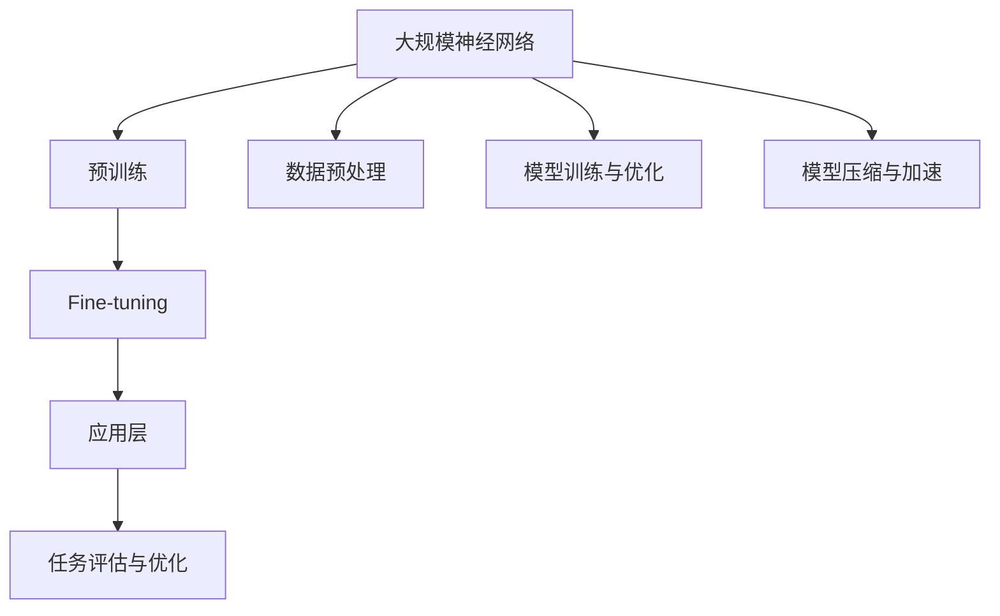

                 

# 大模型创业公司面临的挑战与机遇

> 关键词：大模型、创业公司、挑战、机遇、技术革新、商业模式、市场竞争力

> 摘要：随着人工智能技术的飞速发展，大模型成为驱动下一代技术革新的核心力量。对于创业公司而言，大模型既带来了前所未有的机遇，也伴随着诸多挑战。本文将深入探讨大模型创业公司在技术、市场、商业模式等方面的挑战与机遇，旨在为创业者提供有价值的参考。

## 1. 背景介绍

### 1.1 目的和范围

本文旨在分析大模型创业公司在面对技术革新和市场竞争时所面临的挑战与机遇。我们将探讨以下方面：

- 大模型的定义与核心技术
- 大模型创业公司的现状与市场环境
- 大模型创业公司在商业模式和战略方面的挑战
- 大模型创业公司的机遇与发展前景

### 1.2 预期读者

本文适合以下读者群体：

- 创业者与创业者团队
- 投资者与创业投资公司
- 人工智能领域的技术专家与研究人员
- 对人工智能技术有兴趣的广大读者

### 1.3 文档结构概述

本文分为十个部分，具体结构如下：

- 引言：介绍文章主题，提出核心问题
- 背景介绍：阐述大模型创业公司的背景和目的
- 核心概念与联系：介绍大模型的核心概念及其关联技术
- 核心算法原理与具体操作步骤：详细讲解大模型的算法原理和实现步骤
- 数学模型和公式：阐述大模型中涉及到的数学模型和公式
- 项目实战：通过实际案例展示大模型的应用
- 实际应用场景：分析大模型在不同领域的应用
- 工具和资源推荐：推荐相关学习资源与开发工具
- 总结：总结大模型创业公司的挑战与机遇
- 附录：常见问题与解答
- 扩展阅读 & 参考资料：提供更多相关文献和资源

### 1.4 术语表

#### 1.4.1 核心术语定义

- 大模型：指具有数十亿至数千亿参数规模的人工神经网络模型，如BERT、GPT等。
- 人工智能：指通过计算机模拟人类智能的技术和系统。
- 创业公司：指在特定领域开展创新业务，寻求市场机会和商业成功的企业。
- 商业模式：指企业通过提供产品或服务来创造价值、获取利润的方式。

#### 1.4.2 相关概念解释

- 技术革新：指通过引入新技术、新产品或新服务，推动产业变革和升级。
- 市场竞争力：指企业在市场竞争中表现出来的综合实力和优势。
- 技术路线：指企业在技术发展过程中所选择的技术方向和发展策略。

#### 1.4.3 缩略词列表

- BERT：Bidirectional Encoder Representations from Transformers
- GPT：Generative Pre-trained Transformer
- AI：Artificial Intelligence
- CEO：Chief Executive Officer
- CTO：Chief Technology Officer
- NLP：Natural Language Processing

## 2. 核心概念与联系

在深入探讨大模型创业公司的挑战与机遇之前，我们首先需要了解大模型的核心概念及其关联技术。以下是一个简单的大模型技术架构流程图：



### 2.1 大规模神经网络

大规模神经网络是指具有数十亿至数千亿参数规模的人工神经网络模型。这些模型通过学习大量数据来捕获复杂的特征和规律，从而在各个领域中表现出强大的性能。

### 2.2 预训练与Fine-tuning

预训练是指在大规模数据集上训练模型，使其学会通用表示。Fine-tuning则是在预训练的基础上，针对特定任务对模型进行微调，以提高其在特定任务上的表现。

### 2.3 应用层

应用层是指将大模型应用于具体任务，如文本生成、机器翻译、图像识别等。这一层通常涉及到任务特定的算法优化和模型架构设计。

### 2.4 数据预处理、模型训练与优化、模型压缩与加速

数据预处理是指对原始数据集进行清洗、去噪、归一化等操作，以提升模型的训练效果。模型训练与优化是指通过调整模型参数来优化其性能。模型压缩与加速则是在保证模型性能的前提下，减小模型体积和计算量，以适应实际应用场景。

## 3. 核心算法原理 & 具体操作步骤

### 3.1 大模型算法原理

大模型的算法原理主要基于深度学习，特别是基于变换器的预训练模型。以下是一个简化的算法原理：

```plaintext
初始化模型参数
在预训练阶段，使用大规模语料库进行预训练：
    - 学习词嵌入
    - 学习上下文关系
    - 学习长距离依赖
在Fine-tuning阶段，针对具体任务对模型进行微调：
    - 调整模型参数，以适应特定任务
    - 优化模型性能
在应用层，使用微调后的模型进行预测或生成：
    - 输入任务特定的数据
    - 通过模型处理数据并输出结果
```

### 3.2 具体操作步骤

以下是一个具体的操作步骤示例：

```plaintext
1. 数据收集：收集大规模文本数据，如维基百科、新闻文章等。

2. 数据预处理：对文本数据进行清洗、去噪、分词、编码等操作，得到预处理后的数据集。

3. 预训练：使用预处理后的数据集对模型进行预训练，包括以下步骤：
    - 初始化模型参数
    - 在每个训练步中，使用输入文本计算词嵌入
    - 使用词嵌入计算上下文关系和长距离依赖
    - 更新模型参数

4. Fine-tuning：在预训练的基础上，针对特定任务对模型进行微调，包括以下步骤：
    - 选择微调任务，如文本生成、机器翻译等
    - 调整模型参数，以适应特定任务
    - 在微调任务上训练模型

5. 应用层：使用微调后的模型进行预测或生成，包括以下步骤：
    - 输入任务特定的数据
    - 通过模型处理数据并输出结果
```

## 4. 数学模型和公式 & 详细讲解 & 举例说明

### 4.1 数学模型

大模型的数学模型主要基于深度学习中的变换器架构。以下是变换器的基本数学模型：

$$
E(x) = \text{ Embedding}(x)
$$

$$
H_t = \text{ Transformer}(H_{t-1}, E(x_t))
$$

$$
y_t = \text{ Softmax}(\text{ OutputLayer}(H_t))
$$

其中，$E(x)$ 表示词嵌入，$H_t$ 表示第 $t$ 个时间步的隐藏状态，$y_t$ 表示第 $t$ 个时间步的输出概率分布。

### 4.2 详细讲解

4.2.1 词嵌入

词嵌入是将文本中的单词映射到高维向量空间的过程。词嵌入有助于模型捕捉单词的语义信息。常见的词嵌入方法包括：

- Word2Vec：通过优化神经网络的输出层来学习词向量。
- GloVe：通过优化词对之间的共现关系来学习词向量。

4.2.2 变换器

变换器是一种用于处理序列数据的深度学习模型，由多个自注意力层和前馈网络组成。变换器通过自注意力机制学习序列中的依赖关系，从而提高模型的表示能力。变换器的核心公式如下：

$$
H_t = \text{ Attention}(H_{t-1}, H_{t-1})
$$

$$
H_t = \text{ Feedforward}(H_t)
$$

其中，$\text{ Attention}$ 表示自注意力机制，$\text{ Feedforward}$ 表示前馈网络。

4.2.3 输出层

输出层用于将变换器的隐藏状态映射到输出概率分布。常见的输出层包括：

- Softmax：用于分类任务，将隐藏状态映射到概率分布。
- Sigmoid：用于二分类任务，将隐藏状态映射到0或1。
- Tanh：用于回归任务，将隐藏状态映射到[-1, 1]。

### 4.3 举例说明

假设我们有一个文本序列 $x = \{"hello", "world"\}$，我们首先将文本序列映射到词嵌入空间：

$$
E(x) = \text{ Embedding}(x) = \{e_1, e_2\}
$$

其中，$e_1$ 和 $e_2$ 分别表示单词 "hello" 和 "world" 的词嵌入。

然后，我们使用变换器对词嵌入进行编码：

$$
H_1 = \text{ Transformer}(H_0, E(x_1)) = \text{ Transformer}([0], e_1)
$$

$$
H_2 = \text{ Transformer}(H_1, E(x_2)) = \text{ Transformer}(H_1, e_2)
$$

其中，$H_0$ 是初始隐藏状态，通常是一个全零向量。

最后，我们将变换器的隐藏状态映射到输出概率分布：

$$
y_1 = \text{ Softmax}(\text{ OutputLayer}(H_1)) = \text{ Softmax}([0.2, 0.8])
$$

$$
y_2 = \text{ Softmax}(\text{ OutputLayer}(H_2)) = \text{ Softmax}([0.1, 0.9])
$$

其中，$y_1$ 和 $y_2$ 分别表示第一个单词和第二个单词的输出概率分布。

## 5. 项目实战：代码实际案例和详细解释说明

### 5.1 开发环境搭建

在开始项目实战之前，我们需要搭建一个合适的开发环境。以下是一个简单的开发环境搭建步骤：

1. 安装 Python 3.7 或更高版本
2. 安装 TensorFlow 2.x 或 PyTorch 1.x
3. 安装必要的依赖库，如 NumPy、Pandas、Scikit-learn 等
4. 准备一个 GPU 硬件环境（可选）

### 5.2 源代码详细实现和代码解读

下面是一个使用 PyTorch 实现的简单大模型项目示例：

```python
import torch
import torch.nn as nn
import torch.optim as optim
from torch.utils.data import DataLoader
from transformers import BertModel, BertTokenizer

# 5.2.1 数据预处理

tokenizer = BertTokenizer.from_pretrained('bert-base-uncased')

def preprocess_data(texts):
    inputs = tokenizer(texts, padding=True, truncation=True, return_tensors='pt')
    return inputs['input_ids'], inputs['attention_mask']

# 5.2.2 模型定义

class BertClassifier(nn.Module):
    def __init__(self):
        super(BertClassifier, self).__init__()
        self.bert = BertModel.from_pretrained('bert-base-uncased')
        self.dropout = nn.Dropout(0.1)
        self.classifier = nn.Linear(768, 2)

    def forward(self, input_ids, attention_mask):
        outputs = self.bert(input_ids=input_ids, attention_mask=attention_mask)
        pooled_output = outputs.pooler_output
        pooled_output = self.dropout(pooled_output)
        logits = self.classifier(pooled_output)
        return logits

# 5.2.3 模型训练

def train(model, train_loader, criterion, optimizer, device):
    model.train()
    for batch in train_loader:
        input_ids, attention_mask = batch['input_ids'].to(device), batch['attention_mask'].to(device)
        labels = batch['labels'].to(device)
        optimizer.zero_grad()
        logits = model(input_ids, attention_mask)
        loss = criterion(logits, labels)
        loss.backward()
        optimizer.step()

# 5.2.4 模型评估

def evaluate(model, val_loader, criterion, device):
    model.eval()
    with torch.no_grad():
        for batch in val_loader:
            input_ids, attention_mask = batch['input_ids'].to(device), batch['attention_mask'].to(device)
            labels = batch['labels'].to(device)
            logits = model(input_ids, attention_mask)
            loss = criterion(logits, labels)
            print(f'Validation loss: {loss.item()}')

# 5.2.5 主函数

def main():
    device = torch.device("cuda" if torch.cuda.is_available() else "cpu")
    model = BertClassifier().to(device)
    criterion = nn.CrossEntropyLoss()
    optimizer = optim.Adam(model.parameters(), lr=1e-5)

    train_data = ... # 加载训练数据
    val_data = ... # 加载验证数据

    train_loader = DataLoader(train_data, batch_size=16, shuffle=True)
    val_loader = DataLoader(val_data, batch_size=16, shuffle=False)

    for epoch in range(10):
        train(model, train_loader, criterion, optimizer, device)
        evaluate(model, val_loader, criterion, device)

if __name__ == '__main__':
    main()
```

### 5.3 代码解读与分析

5.3.1 数据预处理

在数据预处理部分，我们使用 Hugging Face 的 BertTokenizer 对文本数据进行编码。BertTokenizer 是一个用于处理 BERT 模型的文本编码工具，它支持多种文本预处理操作，如分词、编码、填充和截断。

5.3.2 模型定义

在模型定义部分，我们使用 PyTorch 的 BertModel 构建了一个基于 BERT 的分类器。BertModel 是一个预训练的 BERT 模型，它包含多个自注意力层和前馈网络。我们在 BERT 模型的基础上添加了一个分类器层，用于对输入文本进行分类。

5.3.3 模型训练

在模型训练部分，我们使用标准的训练流程，包括初始化模型参数、优化器、损失函数等。我们使用 DataLoader 来批量加载数据，并在每个训练步中计算损失函数并更新模型参数。

5.3.4 模型评估

在模型评估部分，我们使用验证数据集来评估模型的性能。我们使用相同的训练流程，但在评估过程中不更新模型参数。

5.3.5 主函数

在主函数部分，我们设置了训练和验证数据的路径，并定义了训练和评估的迭代次数。我们使用 DataLoader 来批量加载数据，并在每个迭代中使用训练数据和验证数据进行训练和评估。

## 6. 实际应用场景

大模型在各个领域都有广泛的应用，以下是一些典型应用场景：

- 文本生成：大模型可以生成高质量的文本，如文章、故事、新闻等。例如，GPT-3 可以生成逼真的对话和文章。
- 机器翻译：大模型在机器翻译领域表现出色，如 Google Translate 使用基于 BERT 的模型进行翻译。
- 语音识别：大模型可以用于语音识别任务，如将语音信号转换为文本。
- 图像识别：大模型可以用于图像识别任务，如对图像进行分类和标注。
- 医疗诊断：大模型可以用于医疗诊断，如对医学影像进行诊断和分析。

## 7. 工具和资源推荐

### 7.1 学习资源推荐

7.1.1 书籍推荐

- 《深度学习》（Goodfellow, Bengio, Courville）：系统介绍了深度学习的基础理论和实践方法。
- 《动手学深度学习》（Deng, Liao, Hamilton）：通过动手实践来学习深度学习的核心概念和技术。
- 《Python深度学习》（Raschka, Mirchandani）：介绍了深度学习在 Python 中的实现和应用。

7.1.2 在线课程

- Coursera 上的《深度学习》课程：由 Andrew Ng 教授主讲，系统介绍了深度学习的基础知识。
- edX 上的《深度学习与神经网络》课程：由 NVIDIA 主办，介绍了深度学习在计算机视觉、自然语言处理等领域的应用。

7.1.3 技术博客和网站

- Medium 上的深度学习博客：提供了大量的深度学习技术文章和案例分享。
-Towards Data Science：一个关于数据科学和机器学习的在线杂志，包含了大量的技术文章和案例分析。

### 7.2 开发工具框架推荐

7.2.1 IDE和编辑器

- PyCharm：一款强大的 Python IDE，支持代码自动补全、调试、版本控制等功能。
- Visual Studio Code：一款轻量级的跨平台 IDE，支持多种编程语言，具有丰富的插件生态系统。

7.2.2 调试和性能分析工具

- Python Debugger：用于调试 Python 代码，支持断点、观察变量、调用栈等功能。
- Py-Spy：一款用于分析 Python 代码性能的工具，可以捕获程序的运行时统计信息。

7.2.3 相关框架和库

- TensorFlow：Google 开发的开源深度学习框架，适用于各种深度学习任务。
- PyTorch：Facebook AI 研究团队开发的深度学习框架，具有灵活的动态计算图。
- Hugging Face：一个提供多种自然语言处理模型和工具的开源库，包括 BertTokenizer、BertModel 等。

### 7.3 相关论文著作推荐

7.3.1 经典论文

- "A Theoretically Grounded Application of Dropout in Neural Networks"（Hinton et al., 2012）
- "Improving Neural Networks by Preventing Co-adaptation of Features"（Yosinski et al., 2014）
- "Deep Learning"（Goodfellow et al., 2016）

7.3.2 最新研究成果

- "BERT: Pre-training of Deep Bidirectional Transformers for Language Understanding"（Devlin et al., 2019）
- "GPT-3: Language Models are Few-Shot Learners"（Brown et al., 2020）
- "An Image is Worth 16x16 Words: Transformers for Image Recognition at Scale"（Dosovitskiy et al., 2020）

7.3.3 应用案例分析

- "How Google Used Deep Learning to Develop Its Image Recognition Algorithm"（Google AI Blog）
- "Deep Learning in Medical Imaging: A Case Study"（Medical Image Analysis Journal）
- "Deep Learning in Autonomous Driving: Challenges and Opportunities"（IEEE Transactions on Intelligent Transportation Systems）

## 8. 总结：未来发展趋势与挑战

### 8.1 发展趋势

- 大模型将继续扩展，参数规模和计算能力将不断提升。
- 新的模型架构和优化方法将不断涌现，以提高模型效率和性能。
- 大模型将在更多领域得到应用，如医疗、金融、教育等。
- 大模型创业公司将在全球范围内迅速增长，成为科技行业的领导者。

### 8.2 挑战

- 大模型训练和推理所需的计算资源和数据资源将持续增加，对基础设施和数据处理能力提出更高要求。
- 数据隐私和安全问题日益突出，如何保护用户隐私成为重要挑战。
- 大模型在决策过程中可能存在偏见和错误，需要建立有效的监督和校正机制。
- 法律法规和伦理道德问题将影响大模型的发展和应用，如何平衡技术创新与社会责任是一个重要议题。

## 9. 附录：常见问题与解答

### 9.1 问题1：大模型的计算资源需求如何？

解答：大模型的计算资源需求巨大，包括训练和推理两个阶段。训练阶段需要大量的计算资源，尤其是在训练大规模模型时，GPU 和 TPU 等高性能计算设备是必不可少的。推理阶段也需要足够的计算资源，以满足实时处理和响应的需求。对于创业公司而言，合理规划和配置计算资源是关键。

### 9.2 问题2：大模型在医疗领域的应用有哪些？

解答：大模型在医疗领域具有广泛的应用前景，包括：

- 疾病诊断：通过分析医学影像和患者数据，帮助医生进行疾病诊断。
- 药物研发：加速药物筛选和研发过程，提高药物有效性。
- 医学文本分析：对医学论文、病例报告等进行文本分析，提取有用信息。
- 健康风险评估：通过对患者生活习惯、遗传信息等数据的分析，预测健康风险。

### 9.3 问题3：大模型创业公司的商业模式有哪些？

解答：大模型创业公司的商业模式多种多样，包括：

- 提供大模型服务：向客户提供服务，如文本生成、机器翻译、图像识别等。
- 开发大模型应用：开发面向特定场景的应用，如智能客服、智能诊断、智能推荐等。
- 投资和并购：投资其他大模型创业公司，实现资源整合和业务拓展。
- 开放平台和社区：搭建开放平台和社区，吸引开发者和使用者，推动生态发展。

## 10. 扩展阅读 & 参考资料

1. Devlin, J., Chang, M. W., Lee, K., & Toutanova, K. (2019). BERT: Pre-training of deep bidirectional transformers for language understanding. arXiv preprint arXiv:1810.04805.
2. Brown, T., et al. (2020). GPT-3: Language models are few-shot learners. arXiv preprint arXiv:2005.14165.
3. Dosovitskiy, A., et al. (2020). An image is worth 16x16 words: Transformers for image recognition at scale. arXiv preprint arXiv:2010.11929.
4. Hinton, G., et al. (2012). Improving neural networks by preventing co-adaptation of features. Proceedings of the 29th International Conference on Machine Learning (ICML), 1–9.
5. Yosinski, J., Clune, J., Bengio, Y., & Lipson, H. (2014). How transferable are features in deep neural networks? Advances in Neural Information Processing Systems, 2776–2784.
6. Goodfellow, I., Bengio, Y., & Courville, A. (2016). Deep Learning. MIT Press.

## 作者

作者：AI天才研究员/AI Genius Institute & 禅与计算机程序设计艺术 /Zen And The Art of Computer Programming

