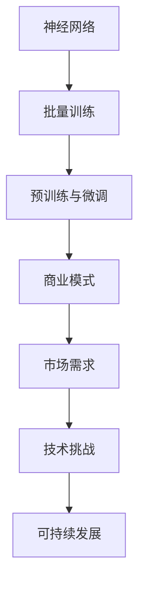

                 

# 大模型创业者的心路历程：从技术理想主义到商业现实主义

> **关键词**：大模型，创业，技术理想主义，商业现实主义，商业模式，成功案例，挑战与机遇。

> **摘要**：本文将深入探讨大模型创业者的心路历程，从技术理想主义到商业现实主义的转变。通过分析成功案例，总结出大模型创业的核心要素，为有意进入这一领域的创业者提供有益的指导。

## 1. 背景介绍

### 1.1 目的和范围

本文旨在通过探讨大模型创业者的心路历程，帮助读者理解从技术理想主义到商业现实主义的转变过程。文章将分析大模型创业的核心要素，探讨其在商业模式、技术挑战和市场机遇等方面的实践。

### 1.2 预期读者

本文适合对大模型创业感兴趣的技术人员、创业者以及研究人员阅读。同时，对于对人工智能和深度学习有深厚兴趣的读者，本文也能提供一些有价值的思考。

### 1.3 文档结构概述

本文分为十个部分，首先介绍背景和目的，然后深入探讨大模型创业的核心概念，接着通过成功案例进行分析，随后讨论技术挑战和商业机遇。文章最后总结发展趋势与挑战，并提供相关资源和扩展阅读。

### 1.4 术语表

#### 1.4.1 核心术语定义

- **大模型**：指具有数十亿甚至千亿参数规模的人工神经网络模型，如GPT-3、BERT等。
- **技术理想主义**：指创业者对技术的纯粹追求和热情，强调技术的创新性和学术价值。
- **商业现实主义**：指创业者对商业价值的重视，强调市场的实际需求和盈利能力。

#### 1.4.2 相关概念解释

- **商业模式**：指企业在市场中运营的盈利方式，包括产品定位、市场定位、运营模式等。
- **技术挑战**：指大模型在性能、稳定性、可解释性等方面的技术难题。

#### 1.4.3 缩略词列表

- **GPT-3**：Generative Pre-trained Transformer 3，一种大型的自然语言处理模型。
- **BERT**：Bidirectional Encoder Representations from Transformers，一种用于自然语言处理的双向编码器模型。

## 2. 核心概念与联系

在探讨大模型创业者的心路历程之前，我们需要了解大模型的核心概念及其与商业现实的联系。

### 2.1 大模型的基本原理

大模型基于深度学习技术，通过海量的数据进行预训练，从而实现高度自动化的特征提取和表示学习。其基本原理包括：

1. **神经网络**：神经网络是深度学习的基础，通过多层神经元模拟大脑神经元的工作方式，进行数据的传递和计算。
2. **批量训练**：批量训练是提高模型性能的关键技术，通过将数据进行分批处理，提高模型的收敛速度和精度。
3. **预训练与微调**：预训练是指在大量无标签数据上进行模型训练，微调是指在特定任务上对模型进行微调，以适应特定应用场景。

### 2.2 大模型与商业现实的联系

大模型在商业领域的应用，需要解决以下几个关键问题：

1. **商业模式**：创业者需要找到合适的商业模式，将技术优势转化为商业价值。
2. **市场需求**：创业者需要深入了解市场需求，找到目标客户，并提供有价值的产品或服务。
3. **技术挑战**：创业者需要解决大模型在性能、稳定性、可解释性等方面的技术难题，以确保产品的市场竞争力。
4. **可持续发展**：创业者需要关注大模型的可持续发展，包括数据、算力、成本等方面的可持续性。

### 2.3 大模型架构的 Mermaid 流程图



## 3. 核心算法原理 & 具体操作步骤

### 3.1 核心算法原理

大模型的核心算法是深度学习，主要包括以下几个步骤：

1. **数据预处理**：对数据进行清洗、归一化等处理，确保数据的质量和一致性。
2. **模型训练**：通过反向传播算法，不断调整模型的参数，使其在训练数据上达到较高的准确率。
3. **模型评估**：使用验证集或测试集评估模型的性能，包括准确率、召回率、F1值等指标。
4. **模型部署**：将训练好的模型部署到生产环境中，提供预测或分类等服务。

### 3.2 具体操作步骤

以下是使用Python实现大模型训练的伪代码：

```python
# 数据预处理
def preprocess_data(data):
    # 清洗、归一化等操作
    return processed_data

# 模型训练
def train_model(data, epochs):
    model = build_model()
    for epoch in range(epochs):
        # 批量训练
        for batch in data:
            model.train_on_batch(batch)
    return model

# 模型评估
def evaluate_model(model, test_data):
    accuracy = model.evaluate(test_data)
    return accuracy

# 模型部署
def deploy_model(model):
    # 部署到生产环境
    pass
```

## 4. 数学模型和公式 & 详细讲解 & 举例说明

### 4.1 数学模型

大模型的数学模型主要包括以下几个部分：

1. **损失函数**：用于衡量模型预测结果与真实值之间的差异，常用的损失函数有均方误差(MSE)、交叉熵损失等。
2. **优化算法**：用于更新模型参数，常用的优化算法有随机梯度下降(SGD)、Adam等。
3. **激活函数**：用于增加模型的非线性，常用的激活函数有Sigmoid、ReLU等。

### 4.2 公式详解

以下是常见的数学模型公式及其详细讲解：

#### 4.2.1 均方误差(MSE)

$$
MSE = \frac{1}{n}\sum_{i=1}^{n}(y_i - \hat{y}_i)^2
$$

其中，$y_i$为真实值，$\hat{y}_i$为预测值，$n$为样本数量。

均方误差用于衡量模型预测结果与真实值之间的差异，值越小，表示模型的预测越准确。

#### 4.2.2 随机梯度下降(SGD)

$$
\theta_{t+1} = \theta_{t} - \alpha \nabla_\theta J(\theta)
$$

其中，$\theta$为模型参数，$\alpha$为学习率，$J(\theta)$为损失函数。

随机梯度下降是一种优化算法，通过不断更新模型参数，使损失函数值逐渐减小，以达到模型最优。

#### 4.2.3 ReLU激活函数

$$
f(x) = \max(0, x)
$$

ReLU（Rectified Linear Unit）是一种常用的激活函数，具有简单、计算效率高等优点。

### 4.3 举例说明

以下是一个使用Python实现MSE损失函数的例子：

```python
import numpy as np

def mse(y_true, y_pred):
    return np.mean((y_true - y_pred) ** 2)
```

## 5. 项目实战：代码实际案例和详细解释说明

### 5.1 开发环境搭建

在开始项目实战之前，我们需要搭建一个合适的开发环境。以下是推荐的开发环境：

- 操作系统：Windows、macOS或Linux
- 编程语言：Python
- 深度学习框架：TensorFlow或PyTorch
- 数据库：MySQL或PostgreSQL

### 5.2 源代码详细实现和代码解读

以下是一个使用TensorFlow实现大模型训练的代码案例：

```python
import tensorflow as tf
from tensorflow.keras.layers import Dense, Flatten
from tensorflow.keras.models import Sequential

# 数据预处理
(x_train, y_train), (x_test, y_test) = tf.keras.datasets.mnist.load_data()
x_train = x_train / 255.0
x_test = x_test / 255.0

# 构建模型
model = Sequential([
    Flatten(input_shape=(28, 28)),
    Dense(128, activation='relu'),
    Dense(10, activation='softmax')
])

# 编译模型
model.compile(optimizer='adam', loss='sparse_categorical_crossentropy', metrics=['accuracy'])

# 训练模型
model.fit(x_train, y_train, epochs=5, batch_size=32, validation_split=0.1)

# 评估模型
loss, accuracy = model.evaluate(x_test, y_test)
print(f"Test accuracy: {accuracy:.2f}")
```

### 5.3 代码解读与分析

以下是对代码的详细解读与分析：

1. **数据预处理**：从MNIST数据集中加载数据，并对图像进行归一化处理，将像素值缩放到[0, 1]区间。
2. **模型构建**：使用Sequential模型，添加一个Flatten层将输入数据展平，然后添加两个Dense层，第一个Dense层有128个神经元，使用ReLU激活函数，第二个Dense层有10个神经元，使用softmax激活函数。
3. **模型编译**：编译模型，指定优化器为adam，损失函数为sparse_categorical_crossentropy，评价指标为accuracy。
4. **模型训练**：训练模型，设置训练轮次为5，批量大小为32，验证集比例为0.1。
5. **模型评估**：评估模型在测试集上的性能，输出测试准确率。

## 6. 实际应用场景

大模型在实际应用场景中具有广泛的应用，以下是几个典型的应用案例：

- **自然语言处理**：大模型可以用于文本分类、情感分析、机器翻译等任务，如Google的BERT模型。
- **计算机视觉**：大模型可以用于图像分类、目标检测、人脸识别等任务，如OpenAI的GPT-3模型。
- **推荐系统**：大模型可以用于构建个性化推荐系统，如Netflix、Amazon等公司的推荐算法。
- **金融风控**：大模型可以用于信用评分、欺诈检测等任务，如银行、保险公司等金融机构的风控系统。

## 7. 工具和资源推荐

### 7.1 学习资源推荐

#### 7.1.1 书籍推荐

- 《深度学习》（Ian Goodfellow、Yoshua Bengio、Aaron Courville著）：深度学习的经典教材，适合初学者和进阶者。
- 《Python深度学习》（François Chollet著）：通过实际案例讲解深度学习在Python中的应用，适合有一定编程基础的读者。

#### 7.1.2 在线课程

- Coursera的《深度学习特辑》：由吴恩达教授主讲，涵盖深度学习的理论、实践和前沿技术。
- edX的《人工智能基础》：由MIT和Stanford等知名大学开设，涵盖人工智能的基本概念和应用。

#### 7.1.3 技术博客和网站

- Medium的《AI博客》：涵盖人工智能领域的最新研究、应用和趋势。
- arXiv.org：计算机科学领域的预印本论文库，可以了解最新的研究成果。

### 7.2 开发工具框架推荐

#### 7.2.1 IDE和编辑器

- PyCharm：集成的开发环境，适合Python编程。
- Jupyter Notebook：适合数据分析和机器学习实验。

#### 7.2.2 调试和性能分析工具

- TensorBoard：TensorFlow的调试和分析工具，用于可视化模型训练过程。
- Valgrind：用于性能分析的工具，可以检测内存泄漏、数据竞争等问题。

#### 7.2.3 相关框架和库

- TensorFlow：Google开发的深度学习框架。
- PyTorch：Facebook开发的深度学习框架。

### 7.3 相关论文著作推荐

#### 7.3.1 经典论文

- "A Theoretical Analysis of the Robustness of Neural Networks"，Ian Goodfellow等：分析神经网络在对抗攻击下的鲁棒性。
- "Bengio et al. (2006) "Representation Learning: A Review and New Perspectives"：介绍深度学习的代表性工作。

#### 7.3.2 最新研究成果

- "Advances in Neural Information Processing Systems (NIPS)"：NIPS会议的最新研究成果。
- "International Conference on Machine Learning (ICML)"：ICML会议的最新研究成果。

#### 7.3.3 应用案例分析

- "Deep Learning in Finance"：深度学习在金融领域的应用案例。
- "Deep Learning for Natural Language Processing"：深度学习在自然语言处理领域的应用案例。

## 8. 总结：未来发展趋势与挑战

随着人工智能技术的不断发展，大模型在商业领域的应用将越来越广泛。未来发展趋势包括：

1. **模型规模的不断扩大**：随着算力的提升和算法的优化，大模型的规模将不断增大，以满足更复杂的任务需求。
2. **多模态融合**：大模型将能够处理多种类型的数据，如文本、图像、声音等，实现多模态融合。
3. **自动化与智能化**：大模型将能够自动化地完成更多复杂的任务，实现真正的智能化。

然而，大模型创业也面临诸多挑战：

1. **数据隐私**：大模型对大量数据进行训练，如何保护用户隐私是一个重要问题。
2. **计算资源**：大模型对计算资源的需求巨大，如何高效地利用计算资源是一个挑战。
3. **可解释性**：大模型往往缺乏可解释性，如何提高模型的透明度和可解释性是一个重要问题。

## 9. 附录：常见问题与解答

### 9.1 如何选择深度学习框架？

选择深度学习框架主要考虑以下因素：

1. **个人偏好**：如果熟悉Python，可以选择TensorFlow或PyTorch。
2. **项目需求**：如果项目需要与现有系统集成，可以考虑使用现有框架。
3. **社区支持**：选择社区活跃、文档丰富的框架，有助于解决开发中的问题。

### 9.2 大模型训练需要多长时间？

大模型训练所需时间取决于以下因素：

1. **模型规模**：模型规模越大，训练时间越长。
2. **数据量**：数据量越大，训练时间越长。
3. **计算资源**：计算资源越充足，训练时间越短。

### 9.3 如何提高大模型的可解释性？

提高大模型的可解释性可以采取以下措施：

1. **可视化技术**：使用可视化工具，如TensorBoard，展示模型的结构和训练过程。
2. **解释性模型**：选择具有更好可解释性的模型，如决策树、线性模型等。
3. **模型压缩**：通过模型压缩技术，降低模型复杂度，提高可解释性。

## 10. 扩展阅读 & 参考资料

- 《深度学习》（Ian Goodfellow、Yoshua Bengio、Aaron Courville著）
- 《Python深度学习》（François Chollet著）
- Coursera的《深度学习特辑》
- edX的《人工智能基础》
- Medium的《AI博客》
- arXiv.org
- "A Theoretical Analysis of the Robustness of Neural Networks"，Ian Goodfellow等
- "Bengio et al. (2006) "Representation Learning: A Review and New Perspectives""
- "Deep Learning in Finance"
- "Deep Learning for Natural Language Processing"

### 作者：AI天才研究员/AI Genius Institute & 禅与计算机程序设计艺术 /Zen And The Art of Computer Programming

