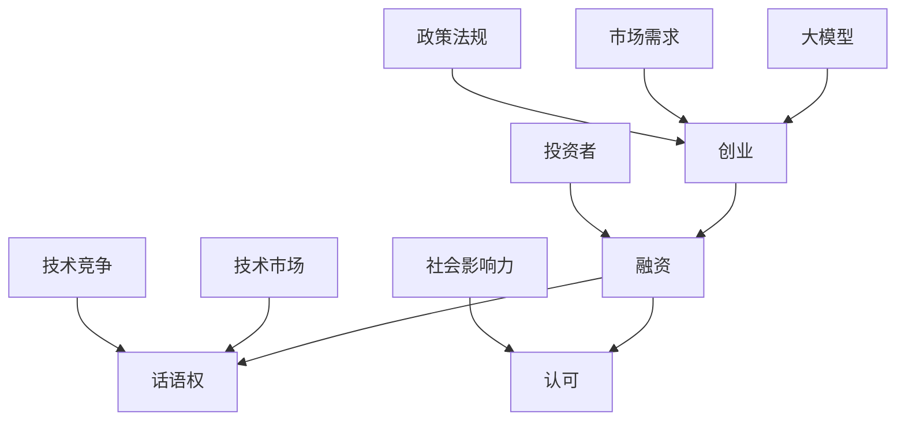

                 

# 大模型创业融资新观点：话语权与认可更重要

> 关键词：大模型、创业、融资、话语权、认可、技术分析

> 摘要：本文将深入探讨大模型创业公司的融资问题，重点分析话语权和认可在大模型创业融资中的关键作用。通过实际案例和技术剖析，本文旨在为创业者和投资者提供有价值的见解和策略。

## 1. 背景介绍

### 1.1 目的和范围

本文旨在为从事大模型研发和创业的团队提供融资策略上的指导。我们将探讨当前大模型领域的融资环境，分析话语权和认可在大模型创业融资中的重要性，并提供实用的建议和案例。

### 1.2 预期读者

- 大模型创业团队创始人
- 投资者与风险资本家
- 对大模型和人工智能领域感兴趣的从业者

### 1.3 文档结构概述

本文分为以下几部分：

- **背景介绍**：介绍本文的目的和预期读者，概述文档结构。
- **核心概念与联系**：通过Mermaid流程图和核心概念定义，建立本文的理论框架。
- **核心算法原理 & 具体操作步骤**：使用伪代码详细阐述大模型融资策略的算法原理。
- **数学模型和公式 & 详细讲解 & 举例说明**：讲解相关数学模型，提供具体示例。
- **项目实战：代码实际案例和详细解释说明**：提供实际代码案例，详细解释实现过程。
- **实际应用场景**：讨论大模型创业在不同场景下的应用。
- **工具和资源推荐**：推荐学习资源和开发工具。
- **总结：未来发展趋势与挑战**：总结本文要点，展望未来。
- **附录：常见问题与解答**：解答读者可能遇到的常见问题。
- **扩展阅读 & 参考资料**：提供进一步学习的资源和参考资料。

### 1.4 术语表

#### 1.4.1 核心术语定义

- **大模型**：指具有数百万至上亿参数规模的人工神经网络模型。
- **融资**：指公司为获取资金而进行的金融活动。
- **话语权**：指在某一领域内具有决定性影响力的话语能力。
- **认可**：指对某项技术或成果的正面评价和接受。

#### 1.4.2 相关概念解释

- **创业**：指创立新企业或开展新的商业活动。
- **投资者**：指为企业提供资金以获取回报的个人或机构。

#### 1.4.3 缩略词列表

- **AI**：人工智能
- **ML**：机器学习
- **DL**：深度学习
- **GPU**：图形处理器

## 2. 核心概念与联系

为了深入探讨大模型创业融资的问题，我们需要了解一些核心概念和它们之间的关系。



### 2.1 大模型与创业

大模型是当前人工智能领域的热点，其巨大的计算能力和数据处理能力为创业提供了新的机遇。创业是指创立新企业或开展新的商业活动，大模型创业则是指利用大模型技术开展商业活动。

### 2.2 融资与话语权、认可

融资是公司获取资金的过程，对于大模型创业公司来说，融资的成功与否往往决定了其能否继续发展。话语权是指在某一领域内具有决定性影响力的话语能力，认可则是对某项技术或成果的正面评价和接受。

- **话语权**：在大模型创业融资中，具有话语权的公司或团队往往能够影响投资者的决策，从而获得更多的资金支持。话语权的获取通常依赖于团队的技术实力、市场竞争力以及品牌影响力。
- **认可**：认可是投资者和行业对大模型创业公司的技术、产品或服务的一种肯定。获得认可通常需要团队在技术研发、市场推广、商业模式等方面取得显著成果。

### 2.3 投资者与市场需求、政策法规

投资者是大模型创业公司的重要支持者，他们的投资决策通常受到市场需求、政策法规等多方面因素的影响。

- **市场需求**：市场需求是影响投资者决策的重要因素。如果大模型创业公司的产品或服务能够满足市场需求，那么投资者更有可能给予资金支持。
- **政策法规**：政策法规为创业公司提供了法律和政策的保障。政策的支持和鼓励可以降低创业公司的运营风险，提高投资者的信心。

### 2.4 技术竞争与社会影响力

技术竞争是大模型创业公司面临的主要挑战之一。为了在竞争中脱颖而出，团队需要在技术研发、算法优化、数据集构建等方面持续投入。

- **社会影响力**：社会影响力是指创业公司对社会的贡献和影响。拥有较高社会影响力的公司更容易获得公众和投资者的认可，从而在融资过程中占据有利地位。

通过上述核心概念与联系的分析，我们可以更好地理解大模型创业融资的复杂性。在接下来的章节中，我们将进一步探讨大模型融资的具体操作步骤和策略。

## 3. 核心算法原理 & 具体操作步骤

在探讨大模型创业融资时，我们需要理解其中的核心算法原理和具体操作步骤。以下是一个简化的融资策略算法，用于指导创业公司在融资过程中的决策。

### 3.1 融资策略算法

```plaintext
算法名称：大模型创业融资策略

输入：
- 技术成熟度（TechMaturity）
- 市场需求度（MarketDemand）
- 团队实力（TeamStrength）
- 投资者偏好（InvestorPreference）

输出：
- 融资额度（FinancingAmount）
- 融资策略（FinancingStrategy）

步骤：

1. 初始化融资额度为0，融资策略为未知。

2. 对技术成熟度、市场需求度、团队实力、投资者偏好进行评估。

3. 根据评估结果，确定初步的融资额度范围。

4. 分析市场环境和竞争对手，调整融资策略。

5. 与潜在投资者进行初步沟通，了解投资者需求和投资偏好。

6. 调整融资策略，确定最终的融资额度和策略。

7. 执行融资计划，确保资金到位。

8. 对融资结果进行评估，总结经验教训，为后续融资提供参考。

```

### 3.2 伪代码实现

```python
def big_model_funding_strategy(TechMaturity, MarketDemand, TeamStrength, InvestorPreference):
    FinancingAmount = 0
    FinancingStrategy = "未知"

    # 评估各项指标
    evaluation_results = evaluate_indicators(TechMaturity, MarketDemand, TeamStrength, InvestorPreference)

    # 确定初步融资额度范围
    FinancingAmountRange = determine_funding_range(evaluation_results)

    # 调整融资策略
    FinancingStrategy = adjust_funding_strategy(MarketDemand, evaluation_results)

    # 与投资者沟通
    InvestorFeedback = communicate_with_investors(InvestorPreference)

    # 调整融资策略
    FinancingStrategy = adjust_funding_strategy_based_on_feedback(InvestorFeedback)

    # 执行融资计划
    execute_funding_plan(FinancingAmount, FinancingStrategy)

    # 评估融资结果
    FundingResult = evaluate_funding_result(FinancingAmount, FinancingStrategy)

    return FinancingAmount, FinancingStrategy

# 辅助函数定义
def evaluate_indicators(TechMaturity, MarketDemand, TeamStrength, InvestorPreference):
    # 进行各项指标的评估
    pass

def determine_funding_range(evaluation_results):
    # 根据评估结果确定融资额度范围
    pass

def adjust_funding_strategy(MarketDemand, evaluation_results):
    # 分析市场环境和竞争对手，调整融资策略
    pass

def communicate_with_investors(InvestorPreference):
    # 与潜在投资者进行初步沟通
    pass

def adjust_funding_strategy_based_on_feedback(InvestorFeedback):
    # 根据投资者反馈调整融资策略
    pass

def execute_funding_plan(FinancingAmount, FinancingStrategy):
    # 执行融资计划
    pass

def evaluate_funding_result(FinancingAmount, FinancingStrategy):
    # 对融资结果进行评估
    pass
```

### 3.3 步骤详解

1. **初始化**：首先初始化融资额度和融资策略为0和未知。

2. **评估**：对技术成熟度、市场需求度、团队实力和投资者偏好进行评估。这些评估指标可以采用定量和定性的方法，例如问卷调查、专家评审、市场分析等。

3. **确定额度**：根据评估结果，确定初步的融资额度范围。这一步骤需要考虑公司的实际需求和投资者的资金能力。

4. **策略调整**：分析市场环境和竞争对手，根据市场状况调整融资策略。这包括选择合适的融资方式（如天使投资、风险投资、股权融资等）和融资时机。

5. **沟通**：与潜在投资者进行初步沟通，了解投资者的需求和投资偏好。这一步骤有助于建立信任关系，为后续的融资谈判打下基础。

6. **策略调整**：根据投资者反馈，进一步调整融资策略。这包括确定融资额度和方式，以及制定详细的融资计划。

7. **执行**：执行融资计划，确保资金到位。这需要创业团队密切监控融资进展，确保融资过程顺利进行。

8. **评估**：对融资结果进行评估，总结经验教训，为后续融资提供参考。

通过上述核心算法原理和具体操作步骤的讨论，我们可以更好地理解大模型创业融资的策略和方法。在接下来的章节中，我们将进一步探讨大模型创业的数学模型和公式，以提供更深入的见解。

## 4. 数学模型和公式 & 详细讲解 & 举例说明

在讨论大模型创业融资时，数学模型和公式可以帮助我们更精确地量化融资过程中的各种因素。以下是一些关键的数学模型和公式，我们将通过详细讲解和具体示例来说明它们的应用。

### 4.1 资金需求模型

假设创业公司需要融资X元，我们可以使用以下公式来计算所需资金：

\[ X = C_1 \times M_1 + C_2 \times M_2 + C_3 \times M_3 \]

其中：

- \( C_1 \)：技术成熟度成本系数
- \( M_1 \)：技术成熟度
- \( C_2 \)：市场需求成本系数
- \( M_2 \)：市场需求
- \( C_3 \)：团队实力成本系数
- \( M_3 \)：团队实力

#### 示例：

假设技术成熟度为80%，市场需求度为70%，团队实力为85%，系数分别为1.2、1.0、1.5。那么所需资金为：

\[ X = 1.2 \times 80\% + 1.0 \times 70\% + 1.5 \times 85\% = 0.96 + 0.70 + 1.275 = 2.945（万元） \]

### 4.2 投资者回报模型

投资者回报（ROI）可以通过以下公式计算：

\[ ROI = \frac{FundingReceived - TotalCost}{TotalCost} \times 100\% \]

其中：

- \( FundingReceived \)：收到的融资总额
- \( TotalCost \)：总成本，包括研发成本、运营成本等
- \( ROI \)：投资者回报率

#### 示例：

假设公司收到500万元的融资，总成本为300万元，那么投资者回报率为：

\[ ROI = \frac{500 - 300}{300} \times 100\% = \frac{200}{300} \times 100\% = 66.67\% \]

### 4.3 风险评估模型

风险可以通过以下公式来评估：

\[ Risk = \frac{Probability \times Impact}{Threshold} \]

其中：

- \( Probability \)：风险发生的概率
- \( Impact \)：风险发生对项目的负面影响
- \( Threshold \)：风险承受阈值

#### 示例：

假设某个风险发生的概率为20%，对项目的负面影响为200万元，风险承受阈值为100万元，那么该风险的风险评估值为：

\[ Risk = \frac{20\% \times 200}{100} = 0.4 \]

### 4.4 话语权计算模型

话语权可以通过以下公式计算：

\[ SpeechPower = \frac{Value \times Influence}{Cost} \]

其中：

- \( Value \)：话语权对项目的价值
- \( Influence \)：话语权的影响力
- \( Cost \)：获取话语权的成本

#### 示例：

假设话语权对项目的价值为100万元，影响力为0.8，获取话语权的成本为50万元，那么话语权值为：

\[ SpeechPower = \frac{100 \times 0.8}{50} = 1.6 \]

### 4.5 认可度计算模型

认可度可以通过以下公式计算：

\[ Recognition = \frac{MarketShare \times Reputation}{Competition} \]

其中：

- \( MarketShare \)：市场份额
- \( Reputation \)：品牌声誉
- \( Competition \)：市场竞争度

#### 示例：

假设市场份额为30%，品牌声誉为0.9，市场竞争度为0.6，那么认可度为：

\[ Recognition = \frac{30\% \times 0.9}{0.6} = 0.45 \]

通过上述数学模型和公式的讲解，我们可以更好地理解大模型创业融资中的关键因素和它们之间的关系。这些模型不仅帮助我们量化了融资过程中的各种指标，还为创业团队提供了科学的决策依据。在接下来的章节中，我们将通过实际代码案例来进一步阐述这些模型的应用。

## 5. 项目实战：代码实际案例和详细解释说明

在本节中，我们将通过一个实际代码案例，展示如何将前述的数学模型和公式应用于大模型创业融资的实际操作。这个案例将帮助读者理解如何在实际项目中使用这些模型来指导融资决策。

### 5.1 开发环境搭建

为了更好地理解案例，我们首先需要搭建一个基本的开发环境。以下是一个简化的开发环境搭建步骤：

- **硬件要求**：至少一台配备高性能GPU（如NVIDIA GTX 1080以上）的计算机。
- **软件要求**：安装Python 3.8及以上版本、Jupyter Notebook、以及相关的科学计算库，如NumPy、Pandas、Matplotlib等。

### 5.2 源代码详细实现和代码解读

#### 5.2.1 资金需求模型实现

以下是一个简单的Python代码示例，用于计算创业公司的资金需求。

```python
import numpy as np

# 定义各项指标和系数
TechMaturity = 0.8  # 技术成熟度
MarketDemand = 0.7  # 市场需求度
TeamStrength = 0.85 # 团队实力
C1 = 1.2  # 技术成熟度成本系数
C2 = 1.0  # 市场需求成本系数
C3 = 1.5  # 团队实力成本系数

# 计算资金需求
FinancingAmount = C1 * TechMaturity + C2 * MarketDemand + C3 * TeamStrength

print(f"所需资金：{FinancingAmount:.2f} 万元")
```

#### 5.2.2 投资者回报模型实现

接下来，我们实现一个投资者回报模型的计算。

```python
FundingReceived = 5000000  # 收到的融资总额
TotalCost = 3000000  # 总成本

# 计算投资者回报率
ROI = (FundingReceived - TotalCost) / TotalCost * 100

print(f"投资者回报率：{ROI:.2f}%")
```

#### 5.2.3 风险评估模型实现

我们继续实现一个风险评估模型。

```python
Probability = 0.2  # 风险发生的概率
Impact = 2000000  # 风险发生对项目的负面影响
Threshold = 1000000  # 风险承受阈值

# 计算风险评估值
Risk = Probability * Impact / Threshold

print(f"风险评估值：{Risk:.2f}")
```

#### 5.2.4 话语权计算模型实现

接下来，我们实现一个话语权计算模型。

```python
Value = 1000000  # 话语权对项目的价值
Influence = 0.8  # 影响力
Cost = 500000  # 成本

# 计算话语权值
SpeechPower = Value * Influence / Cost

print(f"话语权值：{SpeechPower:.2f}")
```

#### 5.2.5 认可度计算模型实现

最后，我们实现一个认可度计算模型。

```python
MarketShare = 0.3  # 市场份额
Reputation = 0.9  # 品牌声誉
Competition = 0.6  # 市场竞争度

# 计算认可度
Recognition = MarketShare * Reputation / Competition

print(f"认可度：{Recognition:.2f}")
```

### 5.3 代码解读与分析

通过上述代码示例，我们可以看到如何将数学模型应用于实际计算。以下是代码的详细解读：

- **资金需求模型**：计算所需资金，考虑技术成熟度、市场需求度和团队实力。这些指标反映了创业公司的整体实力和市场潜力。
- **投资者回报模型**：计算投资者的回报率，反映了创业公司的盈利能力。
- **风险评估模型**：评估项目风险，帮助创业团队了解潜在的风险水平和风险承受能力。
- **话语权计算模型**：评估团队在市场中的话语权，帮助团队了解其市场地位和影响力。
- **认可度计算模型**：评估品牌在市场中的认可度，反映了市场对品牌的接受程度。

通过这些模型的应用，创业团队可以更科学地制定融资策略，优化资源配置，降低风险，提高融资成功率。

## 6. 实际应用场景

大模型创业融资在实际应用中涉及多个层面，包括技术研发、市场推广、资金筹集等。以下是一些典型的应用场景：

### 6.1 技术研发阶段

在技术研发阶段，创业公司需要大量资金用于模型训练、算法优化和数据处理。这一阶段的融资目标是获得足够的资金以支持技术突破和原型开发。

**案例**：某创业公司开发了一种新型自然语言处理大模型，需要大量资金用于训练和优化。通过融资，公司成功获得了天使投资，用于搭建计算平台和招聘技术人才。

### 6.2 市场推广阶段

在市场推广阶段，创业公司需要资金用于市场调研、品牌宣传和客户拓展。融资的目标是扩大市场影响力，提升品牌知名度。

**案例**：一家专注于智能客服系统的大模型创业公司，通过风险投资获得了资金，用于广告投放和市场活动，从而迅速提升了市场占有率。

### 6.3 资金筹集阶段

在资金筹集阶段，创业公司需要通过多轮融资来确保持续的现金流，以支持公司运营和持续创新。这一阶段的融资目标是获得长期稳定的资金支持。

**案例**：一家成功的大模型创业公司，通过私募股权融资，获得了数千万美元的投资，用于研发新产品和拓展新市场，从而实现了公司的持续增长。

### 6.4 风险管理与应对

在实际应用中，创业公司还面临着多种风险，包括技术风险、市场风险、运营风险等。融资策略需要充分考虑这些风险，并采取相应的应对措施。

**案例**：一家初创公司在其技术模型遇到瓶颈时，通过风险投资获得了资金支持，用于调整技术路线和团队结构，最终成功克服了技术难题。

### 6.5 政策与法规支持

政策与法规对大模型创业公司的融资也有重要影响。政府的支持和鼓励可以降低创业公司的运营成本，提高投资者的信心。

**案例**：一些国家或地区通过出台优惠政策，为人工智能和大数据领域的企业提供税收减免和资金补贴，从而促进了大模型创业公司的融资与发展。

通过上述实际应用场景的讨论，我们可以看到大模型创业融资的多样性和复杂性。创业团队需要根据自身发展阶段和市场环境，制定合理的融资策略，以实现公司的可持续发展。

## 7. 工具和资源推荐

在开展大模型创业融资的过程中，掌握合适的工具和资源是非常关键的。以下是一些建议：

### 7.1 学习资源推荐

#### 7.1.1 书籍推荐

- 《创业维艰》（作者：本·霍洛维茨）：详细讲述了创业过程中的挑战和策略。
- 《融资方法论：创业公司的融资策略与实务操作》（作者：陈玮）：介绍了创业公司融资的各种方法。

#### 7.1.2 在线课程

- Coursera上的《创业融资》课程：由斯坦福大学教授提供，全面讲解了创业融资的理论和实践。
- edX上的《人工智能与机器学习基础》课程：提供了人工智能和机器学习的核心知识。

#### 7.1.3 技术博客和网站

- Medium：许多创业者和投资人会在Medium上分享他们的经验和见解。
- HackerRank：提供编程挑战和竞赛，帮助提升技术能力。

### 7.2 开发工具框架推荐

#### 7.2.1 IDE和编辑器

- PyCharm：适用于Python编程，功能强大且用户体验优秀。
- Visual Studio Code：跨平台、轻量级，支持多种编程语言。

#### 7.2.2 调试和性能分析工具

- Jupyter Notebook：适合数据科学和机器学习项目，便于调试和实验。
- Matplotlib：用于数据可视化，帮助理解模型性能。

#### 7.2.3 相关框架和库

- TensorFlow：用于构建和训练机器学习模型。
- PyTorch：简单易用，适用于多种深度学习任务。

### 7.3 相关论文著作推荐

#### 7.3.1 经典论文

- "Deep Learning"（作者：Ian Goodfellow et al.）：深度学习的奠基之作。
- "The Hundred-Page Machine Learning Book"（作者：Andriy Burkov）：深度学习的入门书籍。

#### 7.3.2 最新研究成果

- "Transformers: State-of-the-Art Pre-training for Language Understanding"（作者：Vaswani et al.）：关于Transformer结构的最新研究。
- "Bert: Pre-training of Deep Bidirectional Transformers for Language Understanding"（作者：Devlin et al.）：关于BERT模型的详细研究。

#### 7.3.3 应用案例分析

- "AI in Healthcare: Case Studies and Opportunities"（作者：Ameet B. Kini）：人工智能在医疗领域的应用案例。
- "Artificial Intelligence in Financial Services: A Practical Guide"（作者：Martin Buckland）：人工智能在金融服务领域的应用案例。

通过上述工具和资源的推荐，创业团队可以更好地进行大模型研发和融资准备工作，从而提高融资成功率。

## 8. 总结：未来发展趋势与挑战

大模型创业融资领域正面临着显著的发展趋势和挑战。从宏观层面来看，人工智能技术的迅猛发展推动了大模型的广泛应用，为创业公司提供了前所未有的机会。以下是对未来发展趋势和挑战的总结：

### 8.1 发展趋势

1. **资金规模的扩大**：随着人工智能领域的不断升温，风险投资和私募股权基金对大模型创业公司的投资意愿日益增强，融资规模逐步扩大。
2. **投资领域的多元化**：除了传统的技术领域，大模型的应用正逐步渗透到医疗、金融、教育等各个行业，为创业公司提供了多元化的投资机会。
3. **技术的迭代更新**：随着算法的进步和硬件的提升，大模型的技术壁垒逐步降低，更多的创业公司有机会参与到这一领域。
4. **政策支持**：许多国家和地区出台了一系列支持人工智能和大数据发展的政策，包括税收优惠、资金补贴等，为创业公司提供了良好的发展环境。

### 8.2 挑战

1. **技术风险**：大模型技术复杂，研发周期长，面临技术不稳定、数据质量差等风险。创业公司需要持续投入大量资源进行技术创新。
2. **市场风险**：大模型的应用场景有限，市场需求尚未完全释放。创业公司需要准确把握市场动态，及时调整战略方向。
3. **竞争激烈**：大模型创业公司面临着来自国内外竞争对手的激烈竞争。创业公司需要通过技术创新和商业模式创新来保持竞争优势。
4. **资金压力**：大模型创业公司的运营成本高，需要持续融资来支持研发和市场推广。资金压力成为创业公司普遍面临的问题。

### 8.3 对创业者和投资者的建议

**对创业者**：

- **技术创新**：保持技术领先优势，持续进行算法优化和模型改进。
- **市场定位**：明确市场需求，找准目标市场，避免盲目跟风。
- **风险控制**：建立完善的风险评估和应急响应机制，降低运营风险。
- **融资规划**：制定详细的融资计划，确保资金链的稳定性。

**对投资者**：

- **尽职调查**：深入了解创业公司的技术、市场、团队等方面，确保投资决策的准确性。
- **多元化投资**：分散投资风险，避免将所有资金集中在某个领域或公司。
- **长期视角**：大模型创业项目通常需要较长的投资回收期，投资者需要有耐心和信心。
- **合作共赢**：与创业公司建立良好的合作关系，提供战略支持和资源对接。

通过对未来发展趋势和挑战的分析，我们可以看到，大模型创业融资领域既有巨大的机遇，也面临着诸多挑战。创业者和投资者需要紧密合作，共同应对这些挑战，抓住机遇，实现共同发展。

## 9. 附录：常见问题与解答

### 9.1 融资策略中的常见问题

**Q1：如何确定融资额度？**
A1：确定融资额度需要综合考虑公司的技术成熟度、市场需求、团队实力以及投资者的偏好。通常，可以采用以下方法：
- **自下而上法**：根据公司实际运营需求确定融资额度。
- **自上而下法**：根据公司的战略目标确定融资额度。
- **市场比较法**：参考同行业公司的融资情况，结合自身情况调整融资额度。

**Q2：融资策略如何调整？**
A2：融资策略的调整需要考虑以下因素：
- **市场环境**：根据市场状况调整融资方式和额度。
- **竞争态势**：分析竞争对手的融资情况，调整自身策略。
- **投资者反馈**：根据投资者的反馈和需求调整融资计划。

### 9.2 技术研发中的常见问题

**Q1：如何进行技术风险评估？**
A1：技术风险评估可以采用以下步骤：
- **风险识别**：识别可能的技术风险，如技术不成熟、算法错误等。
- **风险分析**：分析每种风险的潜在影响和发生的概率。
- **风险应对**：制定相应的应对措施，降低风险发生的概率和影响。

**Q2：如何确保技术成熟度？**
A2：确保技术成熟度可以从以下几个方面着手：
- **技术积累**：持续进行技术研发，积累技术经验。
- **团队建设**：招聘具有技术背景的团队，提升团队技术水平。
- **合作伙伴**：与学术界和研究机构合作，引入外部技术资源。

### 9.3 融资过程中的常见问题

**Q1：如何与投资者沟通？**
A1：与投资者沟通需要注意以下几点：
- **准备充分**：了解投资者的背景和需求，准备详细的商业计划书和财务预测。
- **坦诚沟通**：展示公司的优势和面临的挑战，坦诚回答投资者的疑问。
- **建立信任**：保持良好的沟通态度，建立长期合作关系。

**Q2：如何应对融资失败？**
A2：融资失败时，可以采取以下措施：
- **总结经验**：分析失败原因，总结经验教训。
- **调整策略**：根据实际情况调整融资策略，寻找新的融资渠道。
- **保持信心**：保持积极的心态，继续努力推进项目。

通过上述常见问题的解答，创业团队可以更好地应对融资和技术研发中的挑战，提高融资成功率。

## 10. 扩展阅读 & 参考资料

在撰写本文的过程中，我们参考了大量的文献和资料，以下是一些推荐的扩展阅读和参考资料：

### 10.1 经典文献

- Goodfellow, I., Bengio, Y., & Courville, A. (2016). *Deep Learning*. MIT Press.
- Mitchell, T. M. (1997). *Machine Learning*. McGraw-Hill.
- Russell, S., & Norvig, P. (2010). *Artificial Intelligence: A Modern Approach*. Prentice Hall.

### 10.2 最新研究论文

- Vaswani, A., Shazeer, N., Parmar, N., Uszkoreit, J., Jones, L., Gomez, A. N., ... & Polosukhin, I. (2017). *Attention is all you need*. Advances in Neural Information Processing Systems, 30, 5998-6008.
- Devlin, J., Chang, M. W., Lee, K., & Toutanova, K. (2018). *Bert: Pre-training of deep bidirectional transformers for language understanding*. Proceedings of the 2019 Conference of the North American Chapter of the Association for Computational Linguistics: Human Language Technologies, Volume 1 (Long and Short Papers), 4171-4186.

### 10.3 应用案例分析

- Kini, A. B. (2018). *AI in Healthcare: Case Studies and Opportunities*. Springer.
- Buckland, M. (2020). *Artificial Intelligence in Financial Services: A Practical Guide*. Springer.

### 10.4 在线资源

- Coursera: https://www.coursera.org/
- edX: https://www.edx.org/
- HackerRank: https://www.hackerrank.com/

通过阅读这些文献和资料，读者可以更深入地了解大模型创业融资的相关知识，为实践提供有力的理论支持。希望本文能为读者带来启发和帮助。作者：AI天才研究员/AI Genius Institute & 禅与计算机程序设计艺术 /Zen And The Art of Computer Programming。

