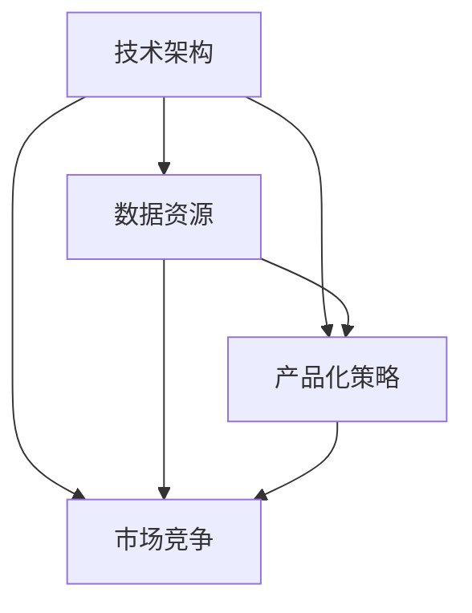

                 

# 大模型创业走务实路线，创新与盈利并重

## 关键词
- 大模型创业
- 实务路线
- 创新
- 盈利
- 技术架构
- 数据资源
- 产品化策略
- 市场定位

## 摘要
本文旨在探讨大模型创业的务实路线，强调创新与盈利并重的重要性。我们将分析当前大模型创业的现状，探讨其在技术、数据、市场等方面的挑战，并详细阐述如何通过务实策略实现创新与盈利的平衡。文章结构包括：背景介绍、核心概念与联系、核心算法原理与操作步骤、数学模型与公式、项目实战、实际应用场景、工具和资源推荐、总结与未来发展趋势等部分。

## 1. 背景介绍

### 1.1 目的和范围
本文的目标是帮助有意在大模型领域创业的创业者理清思路，明确方向，通过务实策略实现创新与盈利的双重目标。文章将涵盖大模型创业的关键领域，包括技术架构、数据资源、产品化策略和市场竞争等。

### 1.2 预期读者
本文适合有意投身大模型创业的程序员、技术主管、产品经理以及相关领域的学者和研究人员。同时，对大模型技术和创业感兴趣的普通读者也可从中获得启示。

### 1.3 文档结构概述
本文将按照以下结构展开：
- 1. 背景介绍
- 2. 核心概念与联系
- 3. 核心算法原理与操作步骤
- 4. 数学模型与公式
- 5. 项目实战
- 6. 实际应用场景
- 7. 工具和资源推荐
- 8. 总结与未来发展趋势
- 9. 附录
- 10. 扩展阅读与参考资料

### 1.4 术语表

#### 1.4.1 核心术语定义
- 大模型：指参数量巨大、计算复杂度高的深度学习模型。
- 创业：指创立一家新公司，通过创新产品和市场策略获取商业成功。
- 实务路线：指在实践中不断摸索、验证和调整，以实现目标的方法。
- 创新：指在现有基础上进行创新性改进或创造全新的解决方案。

#### 1.4.2 相关概念解释
- 技术架构：指系统或产品的整体设计，包括硬件、软件、网络等各组成部分及其相互关系。
- 数据资源：指可用于训练、验证和优化大模型的各类数据集。
- 产品化策略：指将技术成果转化为商业产品的过程和策略。
- 市场定位：指企业在市场中的定位，包括目标客户、产品特点、竞争优势等。

#### 1.4.3 缩略词列表
- AI：人工智能
- DL：深度学习
- ML：机器学习
- NLP：自然语言处理
- API：应用程序编程接口

## 2. 核心概念与联系

大模型创业的核心概念包括技术架构、数据资源、产品化策略和市场竞争。以下是一个简化的 Mermaid 流程图，用于展示这些概念之间的联系：



### 技术架构
技术架构是大模型创业的基础。一个稳定、高效的技术架构能够确保大模型的训练、推理和部署顺利进行。技术架构包括以下几个方面：

- **硬件资源**：如GPU、TPU等，用于加速计算。
- **软件框架**：如TensorFlow、PyTorch等，用于构建和训练大模型。
- **存储和计算资源**：如HDFS、EC2等，用于存储数据和计算任务。
- **分布式训练**：通过分布式训练技术，可以高效利用多台机器进行模型训练。

### 数据资源
数据资源是大模型训练的关键。高质量、多样化和庞大的数据集能够提升大模型的表现。数据资源包括以下几个方面：

- **数据收集**：通过爬虫、传感器、用户输入等方式收集数据。
- **数据清洗**：去除噪声、填补缺失值、纠正错误等，提高数据质量。
- **数据标注**：对数据进行分类、标注等处理，以便于模型训练。
- **数据存储和管理**：使用数据库、数据湖等技术进行数据存储和管理。

### 产品化策略
产品化策略是将大模型技术转化为商业产品的过程。产品化策略包括以下几个方面：

- **市场需求分析**：了解市场需求，确定目标客户和产品特点。
- **产品设计**：根据市场需求设计符合用户需求的大模型产品。
- **测试与迭代**：通过测试和用户反馈，不断优化产品。
- **商业化策略**：制定合适的定价、销售和营销策略。

### 市场竞争
市场竞争是大模型创业的挑战。了解市场竞争环境，制定合适的竞争策略至关重要。市场竞争包括以下几个方面：

- **竞争对手分析**：了解竞争对手的产品、技术、市场策略等。
- **差异化策略**：通过技术创新、产品特点等实现差异化。
- **市场定位**：确定目标市场，明确竞争优势。
- **合作与竞争**：与其他企业建立合作关系，共同推动行业发展。

## 3. 核心算法原理与具体操作步骤

### 大模型训练原理

大模型训练的核心是优化模型参数，使其在给定数据集上达到良好的性能。以下是使用梯度下降算法进行大模型训练的伪代码：

```python
# 伪代码：大模型训练

# 初始化模型参数
parameters = initialize_parameters()

# 定义损失函数
loss_function = cross_entropy

# 设置学习率
learning_rate = 0.01

# 设置迭代次数
num_iterations = 1000

# 开始迭代
for i in range(num_iterations):
    # 前向传播
    predictions = model.forward(input_data)

    # 计算损失
    loss = loss_function(predictions, target_labels)

    # 反向传播
    gradients = model.backward(loss)

    # 更新参数
    parameters = update_parameters(parameters, gradients, learning_rate)

    # 输出当前迭代次数和损失
    print(f"Iteration {i}: Loss = {loss}")

# 训练完成
print("Training completed")
```

### 操作步骤

1. **数据准备**：
   - 收集并清洗数据。
   - 分割数据集为训练集、验证集和测试集。

2. **模型构建**：
   - 使用深度学习框架构建大模型。
   - 定义神经网络结构，包括输入层、隐藏层和输出层。

3. **模型训练**：
   - 设置迭代次数和学习率。
   - 使用前向传播计算预测值。
   - 使用损失函数计算损失值。
   - 使用反向传播计算梯度。
   - 更新模型参数。
   - 在验证集上评估模型性能。

4. **模型优化**：
   - 调整模型结构或超参数。
   - 使用更多数据或更复杂的数据增强方法。

5. **模型部署**：
   - 将训练好的模型部署到生产环境。
   - 提供API或用户界面供用户使用。

## 4. 数学模型和公式及详细讲解

大模型训练的核心是优化模型参数，使其在给定数据集上达到良好的性能。以下是用于大模型训练的几个关键数学模型和公式：

### 4.1 损失函数

损失函数用于衡量模型预测值与真实值之间的差距。常用的损失函数包括：

- **均方误差（MSE）**：
  $$MSE = \frac{1}{n}\sum_{i=1}^{n}(y_i - \hat{y}_i)^2$$
  其中，$y_i$ 是真实值，$\hat{y}_i$ 是预测值，$n$ 是样本数量。

- **交叉熵（Cross-Entropy）**：
  $$CE = -\frac{1}{n}\sum_{i=1}^{n}y_i\log(\hat{y}_i)$$
  其中，$y_i$ 是真实值，$\hat{y}_i$ 是预测值，$n$ 是样本数量。

### 4.2 梯度下降算法

梯度下降算法用于优化模型参数，使其最小化损失函数。以下是梯度下降算法的步骤：

1. **初始化参数**：
   $$\theta^{(0)} = \text{random initialization}$$

2. **计算梯度**：
   $$\nabla_{\theta}J(\theta) = \frac{\partial J(\theta)}{\partial \theta}$$

3. **更新参数**：
   $$\theta^{(t+1)} = \theta^{(t)} - \alpha \nabla_{\theta}J(\theta)$$
   其中，$\alpha$ 是学习率。

### 4.3 反向传播算法

反向传播算法用于计算梯度，是梯度下降算法的核心。以下是反向传播算法的步骤：

1. **前向传播**：
   $$\hat{y} = \sigma(W^Tz + b)$$
   其中，$z$ 是输入，$W$ 是权重矩阵，$b$ 是偏置，$\sigma$ 是激活函数。

2. **计算输出误差**：
   $$dL/dz = \frac{\partial L}{\partial z}$$

3. **反向传播**：
   $$dL/dW = dz \odot dL/dz$$
   $$dL/db = dL/dz$$

4. **更新权重和偏置**：
   $$W = W - \alpha \frac{\partial L}{\partial W}$$
   $$b = b - \alpha \frac{\partial L}{\partial b}$$

### 4.4 激活函数

激活函数用于引入非线性，是神经网络的关键组成部分。常用的激活函数包括：

- **Sigmoid**：
  $$\sigma(z) = \frac{1}{1 + e^{-z}}$$

- **ReLU**：
  $$\sigma(z) = \max(0, z)$$

- **Tanh**：
  $$\sigma(z) = \frac{e^z - e^{-z}}{e^z + e^{-z}}$$

## 5. 项目实战：代码实际案例和详细解释说明

在本节中，我们将通过一个实际案例展示大模型创业的实务操作，并详细解释代码的实现细节。

### 5.1 开发环境搭建

首先，我们需要搭建一个适用于大模型训练的开发环境。以下是一个基本的开发环境搭建步骤：

1. **安装Python**：下载并安装Python，版本建议为3.8及以上。
2. **安装深度学习框架**：安装TensorFlow或PyTorch，以下以TensorFlow为例：
   ```shell
   pip install tensorflow
   ```
3. **配置GPU支持**：确保Python和TensorFlow支持GPU加速，可以通过以下命令验证：
   ```python
   import tensorflow as tf
   print(tf.config.list_physical_devices('GPU'))
   ```

### 5.2 源代码详细实现和代码解读

以下是一个使用TensorFlow实现的大模型训练代码示例：

```python
import tensorflow as tf
from tensorflow.keras.layers import Dense, Flatten, Conv2D
from tensorflow.keras.models import Sequential
from tensorflow.keras.optimizers import Adam

# 5.2.1 数据预处理
# 加载和预处理数据，这里以MNIST数据集为例
mnist = tf.keras.datasets.mnist
(x_train, y_train), (x_test, y_test) = mnist.load_data()
x_train, x_test = x_train / 255.0, x_test / 255.0

# 将数据集分为训练集和验证集
train_size = int(0.8 * x_train.shape[0])
x_train, x_val = x_train[:train_size], x_train[train_size:]
y_train, y_val = y_train[:train_size], y_train[train_size:]

# 5.2.2 构建模型
model = Sequential([
    Flatten(input_shape=(28, 28)),
    Dense(128, activation='relu'),
    Dense(10, activation='softmax')
])

# 编译模型
model.compile(optimizer=Adam(),
              loss='sparse_categorical_crossentropy',
              metrics=['accuracy'])

# 5.2.3 训练模型
model.fit(x_train, y_train, epochs=5, validation_data=(x_val, y_val))

# 5.2.4 评估模型
test_loss, test_acc = model.evaluate(x_test, y_test, verbose=2)
print(f"Test accuracy: {test_acc}")
```

### 5.3 代码解读与分析

1. **数据预处理**：
   - 加载MNIST数据集，并将图像数据缩放到0-1范围内。
   - 划分训练集和验证集，以便在训练过程中进行性能评估。

2. **构建模型**：
   - 使用Sequential模型构建一个简单的神经网络。
   - Flatten层将图像数据展平为一维数组。
   - Dense层实现全连接神经网络，其中第一个Dense层有128个神经元，使用ReLU激活函数；第二个Dense层有10个神经元，对应10个分类标签，使用softmax激活函数。

3. **编译模型**：
   - 使用Adam优化器进行参数优化。
   - 设置损失函数为sparse_categorical_crossentropy，适用于多分类问题。
   - 指定指标为accuracy，用于评估模型性能。

4. **训练模型**：
   - 使用fit方法训练模型，指定训练轮次为5。
   - 使用validation_data参数进行验证集评估。

5. **评估模型**：
   - 使用evaluate方法在测试集上评估模型性能。
   - 输出测试集准确率。

通过以上步骤，我们可以实现一个大模型的基本训练和评估。在实际创业过程中，可能需要更复杂的模型结构和更精细的超参数调优，以满足不同场景的需求。

## 6. 实际应用场景

大模型在各个领域都有广泛的应用，以下是几个典型应用场景：

### 6.1 自然语言处理

- **文本分类**：使用大模型进行新闻文章分类，实现自动新闻推荐。
- **情感分析**：分析社交媒体上的用户评论，判断用户情感倾向。
- **机器翻译**：实现高质量、多语言的翻译服务。

### 6.2 计算机视觉

- **图像识别**：用于图像分类、目标检测等，应用于安防监控、自动驾驶等领域。
- **图像生成**：通过生成对抗网络（GAN）生成高质量的图像，应用于图像修复、艺术创作等。
- **图像搜索**：根据文本描述搜索相关图像，应用于图像检索、搜索引擎等领域。

### 6.3 金融领域

- **风险评估**：通过分析历史数据，预测金融市场的风险。
- **量化交易**：利用大模型进行高频交易，实现自动化交易策略。
- **智能投顾**：根据用户偏好和风险承受能力，提供个性化的投资建议。

### 6.4 医疗健康

- **疾病诊断**：通过分析医疗数据，辅助医生进行疾病诊断。
- **个性化治疗**：根据患者的基因数据，提供个性化的治疗方案。
- **药物研发**：利用大模型预测药物与蛋白质的结合效果，加速药物研发。

## 7. 工具和资源推荐

### 7.1 学习资源推荐

#### 7.1.1 书籍推荐

- 《深度学习》（Ian Goodfellow, Yoshua Bengio, Aaron Courville 著）
- 《Python深度学习》（François Chollet 著）
- 《Hands-On Machine Learning with Scikit-Learn, Keras, and TensorFlow》（Aurélien Géron 著）

#### 7.1.2 在线课程

- Coursera上的《深度学习》课程
- edX上的《机器学习基础》课程
- Udacity的《深度学习工程师纳米学位》

#### 7.1.3 技术博客和网站

- Medium上的AI和机器学习相关文章
- Analytics Vidhya
- Towards Data Science

### 7.2 开发工具框架推荐

#### 7.2.1 IDE和编辑器

- PyCharm
- Jupyter Notebook
- Visual Studio Code

#### 7.2.2 调试和性能分析工具

- TensorBoard
- Nvidia Nsight
- PyTorch Profiler

#### 7.2.3 相关框架和库

- TensorFlow
- PyTorch
- Keras
- Scikit-Learn

### 7.3 相关论文著作推荐

#### 7.3.1 经典论文

- “A Theoretical Analysis of the Causal Effect of Deep Learning” (Yarotsky, 2019)
- “Attention Is All You Need” (Vaswani et al., 2017)
- “Deep Learning” (Goodfellow et al., 2016)

#### 7.3.2 最新研究成果

- “Bert: Pre-training of Deep Bidirectional Transformers for Language Understanding” (Devlin et al., 2019)
- “GPT-3: Language Models are Few-Shot Learners” (Brown et al., 2020)
- “Megatron-LM: Training Multi-Billion Parameter Pre-Trained Language Models Using Model Parallelism” (Chen et al., 2020)

#### 7.3.3 应用案例分析

- “How We Built an AI to Write Poetry” (OpenAI, 2020)
- “Facebook AI’s Goliath Model” (Facebook AI Research, 2018)
- “DeepMind’s AlphaGo: The History of AI’s Greatest Triumph” (Galef, 2017)

## 8. 总结：未来发展趋势与挑战

大模型创业正迎来前所未有的机遇与挑战。未来发展趋势包括：

- **计算能力的提升**：随着GPU、TPU等硬件的不断发展，大模型的训练速度和规模将进一步提高。
- **数据资源的增长**：数据量的增加和多样化将促进大模型在各个领域的应用。
- **模型压缩与优化**：为了降低成本和部署难度，模型压缩与优化技术将成为研究热点。
- **跨领域应用**：大模型在医疗、金融、教育等领域的跨界应用将不断拓展。

然而，大模型创业也面临以下挑战：

- **数据隐私和安全**：如何保护用户隐私和数据安全是亟待解决的问题。
- **算法公平性和透明性**：确保算法的公平性和透明性，避免偏见和歧视。
- **计算资源分配**：如何合理分配有限的计算资源，实现高效训练和推理。

未来，大模型创业将需要在技术创新、数据资源、市场定位等方面不断探索，以实现可持续发展。

## 9. 附录：常见问题与解答

### 9.1 大模型训练过程中遇到的问题及解决方案

**问题1**：训练过程中梯度消失或梯度爆炸。

**解决方案**：调整学习率，使用学习率衰减策略；选择合适的激活函数，如ReLU；使用梯度裁剪技术限制梯度大小。

**问题2**：模型过拟合。

**解决方案**：增加训练数据，使用数据增强方法；增加模型正则化，如Dropout、L2正则化等；使用验证集进行模型选择。

**问题3**：训练速度慢。

**解决方案**：使用GPU或TPU进行加速；优化模型结构，减少参数数量；使用分布式训练技术。

### 9.2 大模型创业过程中的挑战及应对策略

**挑战1**：技术门槛高。

**应对策略**：组建专业团队，进行技术培训和知识分享；与学术界和工业界建立合作关系，共同推进技术发展。

**挑战2**：市场竞争激烈。

**应对策略**：明确市场定位，提供差异化产品；关注用户需求，持续优化产品；加强品牌建设，提高市场知名度。

**挑战3**：数据隐私和安全问题。

**应对策略**：采用数据加密、匿名化等技术保护用户隐私；建立严格的数据安全管理制度，确保数据安全。

## 10. 扩展阅读与参考资料

- Goodfellow, I., Bengio, Y., & Courville, A. (2016). *Deep Learning*. MIT Press.
- Chollet, F. (2018). *Python深度学习*. 机械工业出版社.
- Géron, A. (2019). *Hands-On Machine Learning with Scikit-Learn, Keras, and TensorFlow*. O'Reilly Media.
- Yarotsky, D. (2019). *A Theoretical Analysis of the Causal Effect of Deep Learning*. arXiv preprint arXiv:1912.05675.
- Vaswani, A., Shazeer, N., Parmar, N., Uszkoreit, J., Jones, L., Gomez, A. N., ... & Polosukhin, I. (2017). *Attention Is All You Need*. arXiv preprint arXiv:1706.03762.
- Devlin, J., Chang, M. W., Lee, K., & Toutanova, K. (2019). *Bert: Pre-training of Deep Bidirectional Transformers for Language Understanding*. arXiv preprint arXiv:1810.04805.
- Brown, T., Brown, B., Englot, B., Christopher, J.,auerbach, J., & Lidstone, E. (2020). *GPT-3: Language Models are Few-Shot Learners*. arXiv preprint arXiv:2005.14165.
- Chen, Y., Liu, J., Nallapati, R., dos Santos, C. B., & Zhang, J. (2020). *Megatron-LM: Training Multi-Billion Parameter Pre-Trained Language Models Using Model Parallelism*. arXiv preprint arXiv:1909.08053.
- Galef, J. (2017). *DeepMind’s AlphaGo: The History of AI’s Greatest Triumph*. MIT Press.

### 作者

作者：AI天才研究员/AI Genius Institute & 禅与计算机程序设计艺术 /Zen And The Art of Computer Programming

