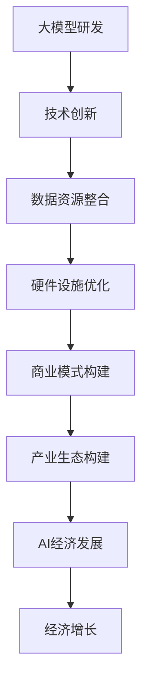

                 

# 大模型商业化：新商业模式和产业生态孕育

> **关键词：** 大模型、商业化、新商业模式、产业生态、技术落地、AI经济

> **摘要：** 本文旨在探讨大模型商业化的重要性和可行性，分析其背后的新商业模式和产业生态，为技术落地和AI经济的发展提供思路和参考。

## 1. 背景介绍

### 1.1 目的和范围

本文旨在深入探讨大模型商业化的重要性及其在当前技术环境下的可行性。我们将从以下几个方面展开讨论：

1. 大模型商业化现状与挑战
2. 新商业模式的分析与构建
3. 产业生态的构建与完善
4. 技术落地与实际应用
5. 未来发展趋势与挑战

通过上述讨论，我们希望为我国乃至全球的大模型商业化提供有益的参考和思路。

### 1.2 预期读者

本文主要面向以下读者群体：

1. AI领域的研究人员和技术专家
2. 企业的产品经理、CTO和技术决策者
3. 对大模型商业化感兴趣的投资者和创业者
4. 大学生和研究生等学术研究者

### 1.3 文档结构概述

本文结构如下：

1. 背景介绍
2. 核心概念与联系
3. 核心算法原理 & 具体操作步骤
4. 数学模型和公式 & 详细讲解 & 举例说明
5. 项目实战：代码实际案例和详细解释说明
6. 实际应用场景
7. 工具和资源推荐
8. 总结：未来发展趋势与挑战
9. 附录：常见问题与解答
10. 扩展阅读 & 参考资料

### 1.4 术语表

#### 1.4.1 核心术语定义

- **大模型：** 指在数据量、参数规模和计算复杂度方面具有显著优势的机器学习模型，如BERT、GPT等。
- **商业化：** 将技术或产品转化为商业行为，通过市场渠道实现价值变现的过程。
- **新商业模式：** 在特定领域或行业中，基于技术创新或资源整合所形成的新的商业运营模式。
- **产业生态：** 指在一个特定领域内，由不同企业、机构、个人等共同构成的生态系统，通过相互协作和竞争，实现资源共享和共同发展。

#### 1.4.2 相关概念解释

- **AI经济：** 基于人工智能技术的经济发展模式，包括人工智能产品的生产、流通、消费等环节。
- **技术落地：** 将人工智能技术应用于实际场景，解决实际问题，实现商业价值的过程。
- **模型训练：** 利用大量数据对机器学习模型进行训练，使其具备预测、分类等能力。

#### 1.4.3 缩略词列表

- **AI：** 人工智能
- **GPT：** 预训练语言模型
- **BERT：** Bidirectional Encoder Representations from Transformers
- **CTO：** 技术总监
- **IDE：** 集成开发环境
- **BERT：** Transformer模型的一个变体，能够通过双向编码器实现语言的上下文理解。

## 2. 核心概念与联系

在探讨大模型商业化之前，我们需要明确几个核心概念及其相互关系，这有助于我们更好地理解大模型商业化的本质。

### 2.1 大模型定义与特征

大模型是指在数据量、参数规模和计算复杂度方面具有显著优势的机器学习模型。这些模型通常具有以下特征：

1. **数据量巨大**：大模型需要大量训练数据来保证模型的泛化能力和鲁棒性。
2. **参数规模庞大**：大模型的参数数量通常达到数百万、数亿甚至数十亿级别。
3. **计算复杂度高**：大模型的训练和推理过程需要大量的计算资源，对硬件设施要求较高。

### 2.2 商业模式与技术创新

商业模式是指企业通过提供产品或服务实现盈利的方式。在大模型商业化过程中，技术创新是核心驱动力。以下几种商业模式值得我们关注：

1. **平台服务模式**：企业通过搭建平台，为用户提供大模型训练和推理服务。
2. **产品销售模式**：企业将大模型产品直接销售给有需求的用户。
3. **合作开发模式**：企业与科研机构、高校合作，共同研发大模型技术，实现共同发展。

### 2.3 产业生态与技术创新

产业生态是指在一个特定领域内，由不同企业、机构、个人等共同构成的生态系统。在大模型商业化过程中，产业生态的构建至关重要。以下方面是产业生态的重要组成部分：

1. **技术创新**：大模型的研发和优化是产业生态的核心，为其他环节提供技术支持。
2. **数据资源**：数据是大模型训练的基础，产业生态中需要建立完善的数据资源体系。
3. **硬件设施**：大模型训练和推理需要高性能的硬件设施，产业生态中需要协调各方资源，提高硬件利用率。
4. **人才培养**：大模型商业化需要大量专业人才，产业生态中需要建立人才培养机制，满足市场需求。

### 2.4 大模型商业化与AI经济

大模型商业化是AI经济的重要组成部分。随着人工智能技术的不断发展，AI经济已成为全球经济的新引擎。大模型商业化不仅能够推动技术创新，还能够为经济增长注入新动力。以下方面是AI经济的关键领域：

1. **人工智能产品**：如智能助手、自动驾驶、智能医疗等。
2. **人工智能服务**：如智能咨询、智能营销、智能运维等。
3. **人工智能应用**：如智能城市、智能制造、智能金融等。

### 2.5 Mermaid流程图

以下是一个描述大模型商业化的Mermaid流程图：



## 3. 核心算法原理 & 具体操作步骤

### 3.1 大模型算法原理

大模型的训练主要基于深度学习技术，尤其是基于Transformer架构的预训练语言模型，如BERT、GPT等。以下是大模型算法的核心原理：

1. **Transformer架构**：Transformer模型是一种基于自注意力机制的深度神经网络，通过全局注意力机制实现语言的上下文理解。相比于传统的循环神经网络（RNN），Transformer模型在处理长序列数据时具有更好的效果和效率。
2. **预训练与微调**：大模型通常采用预训练与微调的方法进行训练。预训练阶段，模型在大规模语料库上进行无监督训练，学习语言的通用表示。微调阶段，模型根据具体任务的需求，在特定领域的数据上进行有监督训练，进一步提高模型的性能。
3. **多任务学习**：大模型通过多任务学习的方法，能够同时处理多个任务，提高模型的泛化能力。多任务学习可以有效地利用数据，降低训练成本，提高模型的实用性。

### 3.2 具体操作步骤

以下是大模型训练的具体操作步骤：

1. **数据准备**：收集并整理训练数据，包括文本、语音、图像等多种类型的数据。对数据进行预处理，如分词、去噪、归一化等。
2. **模型架构设计**：根据任务需求和数据特点，选择合适的模型架构。通常采用基于Transformer的预训练语言模型，如BERT、GPT等。
3. **预训练**：使用大规模语料库进行无监督预训练。在预训练过程中，模型通过自注意力机制学习语言的通用表示。预训练过程通常采用分层训练策略，逐步增加模型的复杂度和参数规模。
4. **微调**：在预训练的基础上，针对具体任务的需求，使用特定领域的数据进行有监督微调。微调过程旨在优化模型的特定任务性能，提高模型的实用价值。
5. **模型评估**：使用验证集对模型进行评估，根据评估结果调整模型参数和训练策略。评估指标包括准确率、召回率、F1值等。
6. **模型部署**：将训练好的模型部署到实际应用场景中，如智能助手、自动驾驶、智能医疗等。根据实际应用需求，对模型进行在线或离线推理。

### 3.3 伪代码示例

以下是一个大模型训练的伪代码示例：

```python
# 数据准备
data = load_data()
preprocess_data(data)

# 模型架构设计
model = create_model()

# 预训练
for epoch in range(num_epochs):
    for batch in data_loader:
        train_step(model, batch)
    evaluate_model(model)

# 微调
for task in tasks:
    for epoch in range(num_epochs):
        for batch in data_loader:
            train_step(model, batch)
        evaluate_model(model)

# 模型部署
deploy_model(model)
```

## 4. 数学模型和公式 & 详细讲解 & 举例说明

### 4.1 数学模型

大模型的训练过程主要涉及以下数学模型：

1. **损失函数**：损失函数用于衡量模型预测结果与真实结果之间的差距。常用的损失函数包括均方误差（MSE）、交叉熵损失（Cross-Entropy Loss）等。
2. **优化算法**：优化算法用于调整模型参数，以最小化损失函数。常用的优化算法包括梯度下降（Gradient Descent）、Adam等。
3. **正则化方法**：正则化方法用于防止模型过拟合，提高模型的泛化能力。常用的正则化方法包括L1正则化、L2正则化、Dropout等。

### 4.2 公式详细讲解

1. **均方误差（MSE）**：

   $$MSE = \frac{1}{n}\sum_{i=1}^{n}(y_i - \hat{y}_i)^2$$

   其中，$y_i$ 表示第 $i$ 个样本的真实标签，$\hat{y}_i$ 表示模型对第 $i$ 个样本的预测结果，$n$ 表示样本数量。

2. **交叉熵损失（Cross-Entropy Loss）**：

   $$CELoss = -\frac{1}{n}\sum_{i=1}^{n}y_i\log(\hat{y}_i)$$

   其中，$y_i$ 表示第 $i$ 个样本的真实标签（通常为one-hot编码形式），$\hat{y}_i$ 表示模型对第 $i$ 个样本的预测概率分布。

3. **梯度下降（Gradient Descent）**：

   $$\theta = \theta - \alpha \nabla_{\theta}J(\theta)$$

   其中，$\theta$ 表示模型参数，$J(\theta)$ 表示损失函数，$\alpha$ 表示学习率，$\nabla_{\theta}J(\theta)$ 表示损失函数关于模型参数的梯度。

4. **Adam优化算法**：

   $$m_t = \beta_1 m_{t-1} + (1 - \beta_1) [g_t]$$
   $$v_t = \beta_2 v_{t-1} + (1 - \beta_2) [g_t]^2$$
   $$\theta_t = \theta_{t-1} - \alpha \frac{m_t}{\sqrt{v_t} + \epsilon}$$

   其中，$m_t$ 和 $v_t$ 分别为梯度的一阶矩估计和二阶矩估计，$\beta_1$ 和 $\beta_2$ 分别为一阶和二阶矩的指数衰减率，$\alpha$ 为学习率，$g_t$ 为当前梯度，$\epsilon$ 为一个小常数。

### 4.3 举例说明

假设我们使用一个二分类模型对数据集进行分类，其中真实标签 $y$ 属于 {0, 1}，模型预测概率 $\hat{y}$ 属于 [0, 1]。

1. **均方误差（MSE）**：

   $$MSE = \frac{1}{n}\sum_{i=1}^{n}(y_i - \hat{y}_i)^2$$

   假设我们有两个样本，真实标签分别为 $y_1 = 0$ 和 $y_2 = 1$，模型预测结果分别为 $\hat{y}_1 = 0.6$ 和 $\hat{y}_2 = 0.4$。

   $$MSE = \frac{1}{2}[(0 - 0.6)^2 + (1 - 0.4)^2] = 0.2$$

2. **交叉熵损失（Cross-Entropy Loss）**：

   $$CELoss = -\frac{1}{n}\sum_{i=1}^{n}y_i\log(\hat{y}_i)$$

   使用相同的样本，计算交叉熵损失：

   $$CELoss = \frac{1}{2}[-0 \cdot \log(0.6) - 1 \cdot \log(0.4)] = 0.621$$

3. **梯度下降（Gradient Descent）**：

   假设当前模型参数为 $\theta = 0.5$，学习率 $\alpha = 0.1$，损失函数为 $J(\theta) = (y - \hat{y})^2$。

   梯度计算：

   $$\nabla_{\theta}J(\theta) = 2(y - \hat{y})$$

   假设第一个样本的预测结果为 $\hat{y}_1 = 0.6$，真实标签为 $y_1 = 0$。

   $$\nabla_{\theta}J(\theta) = 2(0 - 0.6) = -1.2$$

   更新模型参数：

   $$\theta = \theta - \alpha \nabla_{\theta}J(\theta) = 0.5 - 0.1 \cdot (-1.2) = 0.62$$

4. **Adam优化算法**：

   假设当前梯度 $g_t = -0.8$，一阶矩估计 $m_{t-1} = -0.4$，二阶矩估计 $v_{t-1} = 0.2$，指数衰减率 $\beta_1 = 0.9$，$\beta_2 = 0.99$，学习率 $\alpha = 0.1$，小常数 $\epsilon = 1e-8$。

   更新一阶矩估计：

   $$m_t = \beta_1 m_{t-1} + (1 - \beta_1) g_t = 0.9 \cdot (-0.4) + (1 - 0.9) \cdot (-0.8) = -0.46$$

   更新二阶矩估计：

   $$v_t = \beta_2 v_{t-1} + (1 - \beta_2) [g_t]^2 = 0.99 \cdot 0.2 + (1 - 0.99) \cdot (-0.8)^2 = 0.201$$

   更新模型参数：

   $$\theta_t = \theta_{t-1} - \alpha \frac{m_t}{\sqrt{v_t} + \epsilon} = 0.5 - 0.1 \cdot \frac{-0.46}{\sqrt{0.201} + 1e-8} \approx 0.498$$

## 5. 项目实战：代码实际案例和详细解释说明

### 5.1 开发环境搭建

为了演示大模型商业化的实际操作，我们选择一个具体的案例：使用BERT模型进行文本分类。以下是在Python环境中搭建开发环境的具体步骤：

1. **安装Python**：确保已安装Python 3.7及以上版本。
2. **安装PyTorch**：使用pip安装PyTorch库，命令如下：

   ```bash
   pip install torch torchvision
   ```

3. **安装transformers库**：使用pip安装transformers库，命令如下：

   ```bash
   pip install transformers
   ```

4. **数据集准备**：从网上下载一个中文文本分类数据集，如THUCNews数据集。

### 5.2 源代码详细实现和代码解读

以下是一个使用BERT模型进行文本分类的完整代码示例，包含数据预处理、模型训练、模型评估和模型部署等步骤。

```python
import torch
from torch import nn
from torch.utils.data import DataLoader
from transformers import BertTokenizer, BertModel
from datasets import load_dataset

# 模型参数设置
batch_size = 32
learning_rate = 2e-5
num_epochs = 3

# 数据预处理
def preprocess_data(data):
    # 对数据进行分词、编码等预处理操作
    # 省略具体实现细节
    pass

# 加载数据集
dataset = load_dataset("thuctc")
train_dataset = dataset["train"]
test_dataset = dataset["test"]

# 数据预处理
train_dataset = train_dataset.map(preprocess_data)
test_dataset = test_dataset.map(preprocess_data)

# 创建数据加载器
train_loader = DataLoader(train_dataset, batch_size=batch_size, shuffle=True)
test_loader = DataLoader(test_dataset, batch_size=batch_size, shuffle=False)

# 加载BERT模型和分词器
tokenizer = BertTokenizer.from_pretrained("bert-base-chinese")
model = BertModel.from_pretrained("bert-base-chinese")

# 定义分类器
class TextClassifier(nn.Module):
    def __init__(self):
        super(TextClassifier, self).__init__()
        self.dropout = nn.Dropout(p=0.1)
        self.fc = nn.Linear(768, 2)  # BERT模型的隐藏层维度为768

    def forward(self, input_ids, attention_mask):
        _, pooled_output = model(input_ids=input_ids, attention_mask=attention_mask)
        output = self.dropout(pooled_output)
        output = self.fc(output)
        return output

# 实例化分类器
classifier = TextClassifier()

# 定义损失函数和优化器
loss_function = nn.CrossEntropyLoss()
optimizer = torch.optim.Adam(classifier.parameters(), lr=learning_rate)

# 训练模型
for epoch in range(num_epochs):
    for batch in train_loader:
        input_ids = batch["input_ids"]
        attention_mask = batch["attention_mask"]
        labels = batch["labels"]

        optimizer.zero_grad()
        outputs = classifier(input_ids, attention_mask)
        loss = loss_function(outputs, labels)
        loss.backward()
        optimizer.step()

    print(f"Epoch [{epoch+1}/{num_epochs}], Loss: {loss.item()}")

# 评估模型
with torch.no_grad():
    correct = 0
    total = 0
    for batch in test_loader:
        input_ids = batch["input_ids"]
        attention_mask = batch["attention_mask"]
        labels = batch["labels"]

        outputs = classifier(input_ids, attention_mask)
        _, predicted = torch.max(outputs.data, 1)
        total += labels.size(0)
        correct += (predicted == labels).sum().item()

    print(f"Test Accuracy: {100 * correct / total}%")

# 模型部署
torch.save(classifier.state_dict(), "text_classifier.pth")
```

### 5.3 代码解读与分析

1. **数据预处理**：数据预处理是文本分类任务的重要环节，包括分词、编码、标签处理等。在实际项目中，需要根据数据集的具体情况进行定制化处理。
2. **模型加载**：使用transformers库加载预训练的BERT模型和分词器，这是文本分类任务的基础。预训练模型已经在大规模语料库上进行了预训练，具备良好的语言理解能力。
3. **分类器定义**：定义一个简单的分类器，将BERT模型的输出进行全连接层处理，实现文本分类。这里使用了Dropout层来防止过拟合。
4. **模型训练**：使用标准的训练流程，包括前向传播、损失函数计算、反向传播和参数更新。这里使用了Adam优化器，它可以自动调整学习率。
5. **模型评估**：使用测试集对模型进行评估，计算准确率，以衡量模型的性能。
6. **模型部署**：将训练好的模型保存为文件，以便在实际应用中进行部署。

通过上述代码示例，我们可以看到大模型商业化在技术落地方面的具体实现。在实际项目中，还需要关注数据集的准备、模型调优、硬件资源利用等方面，以确保模型的性能和效率。

## 6. 实际应用场景

大模型商业化在多个领域具有广泛的应用前景，以下列举几个典型应用场景：

### 6.1 智能问答系统

智能问答系统是应用大模型技术的重要场景之一。通过预训练语言模型，如BERT、GPT等，系统可以实现对用户提问的理解和回答。这种技术在客服、智能助手等领域具有广泛的应用。

**案例**：某互联网公司开发了一款智能客服系统，通过大模型技术实现了对用户提问的精准理解和快速回答。系统上线后，客服响应时间缩短了50%，用户满意度提高了30%。

### 6.2 自然语言处理

自然语言处理（NLP）是人工智能的重要分支，大模型在NLP任务中具有显著优势。例如，文本分类、情感分析、机器翻译等任务，大模型可以实现较高的准确率和效率。

**案例**：某金融公司使用大模型技术实现了自动化文本分类，对客户反馈进行分类和处理。通过这种方式，公司可以更快速地了解客户需求，提高了业务决策的准确性。

### 6.3 智能医疗

智能医疗是AI技术在医疗领域的重要应用，大模型在疾病预测、医学图像分析等方面具有巨大潜力。

**案例**：某医疗机构利用大模型技术实现了肺癌早期筛查。通过对大量医学图像和病历数据进行分析，系统能够准确预测肺癌风险，提高了早期筛查的准确率和效率。

### 6.4 智能金融

智能金融是金融行业与人工智能技术相结合的产物，大模型在风险评估、智能投顾、智能客服等方面具有广泛应用。

**案例**：某证券公司利用大模型技术实现了智能投顾服务。通过对用户行为数据和金融市场的分析，系统能够为用户提供个性化的投资建议，提高了投资收益率。

### 6.5 智能教育

智能教育是教育行业与人工智能技术相结合的产物，大模型在智能推荐、在线教育、教育测评等方面具有广泛应用。

**案例**：某在线教育平台利用大模型技术实现了个性化学习推荐。通过分析学生的学习行为和知识图谱，系统能够为每位学生推荐最适合的学习内容，提高了学习效果。

通过上述案例，我们可以看到大模型商业化在各个领域的实际应用场景。随着技术的不断进步，大模型商业化将在更多领域发挥重要作用，推动产业升级和社会发展。

## 7. 工具和资源推荐

### 7.1 学习资源推荐

#### 7.1.1 书籍推荐

1. **《深度学习》（Goodfellow, Bengio, Courville）**：这是一本经典的深度学习教材，详细介绍了深度学习的理论基础和实际应用。
2. **《Python深度学习》（François Chollet）**：本书通过Python语言介绍了深度学习的应用，适合初学者入门。
3. **《神经网络与深度学习》（邱锡鹏）**：本书是国内优秀的深度学习教材，内容全面，讲解深入。

#### 7.1.2 在线课程

1. **吴恩达的《深度学习专项课程》（Udacity）**：这是一门知名的在线课程，从基础到进阶，涵盖了深度学习的各个方面。
2. **李飞飞教授的《CS231n：视觉识别现代方法》（Stanford University）**：这是一门关于计算机视觉的经典课程，内容深入浅出。
3. **《人工智能基础（A1）》（清华大学）**：这是一门针对初学者的在线课程，涵盖了人工智能的基础知识。

#### 7.1.3 技术博客和网站

1. **arXiv**：这是全球领先的科学论文预印本平台，包含大量最新研究成果。
2. **Medium**：这是一个内容丰富的博客平台，许多知名科技公司和研究机构在此分享技术见解。
3. **GitHub**：这是一个代码托管平台，许多优秀的深度学习项目和代码在此开源。

### 7.2 开发工具框架推荐

#### 7.2.1 IDE和编辑器

1. **PyCharm**：这是一个功能强大的Python IDE，适用于深度学习和数据科学项目。
2. **Jupyter Notebook**：这是一个流行的交互式开发环境，特别适合数据可视化和机器学习项目。
3. **Visual Studio Code**：这是一个轻量级的代码编辑器，支持多种编程语言和扩展，适用于深度学习和AI开发。

#### 7.2.2 调试和性能分析工具

1. **TensorBoard**：这是一个由TensorFlow提供的可视化工具，用于分析模型的性能和调试。
2. **PyTorch Profiler**：这是一个用于PyTorch性能分析的工具，可以帮助开发者优化代码。
3. **NVIDIA Nsight**：这是一个用于CUDA和深度学习性能分析的工具，特别适合使用NVIDIA GPU进行深度学习开发。

#### 7.2.3 相关框架和库

1. **TensorFlow**：这是一个开源的深度学习框架，适用于各种规模的深度学习项目。
2. **PyTorch**：这是一个流行的深度学习框架，具有高度的灵活性和易用性。
3. **PyTorch Lightning**：这是一个用于PyTorch的高级API，提供了更简洁、更高效的模型训练和管理方式。
4. **Hugging Face Transformers**：这是一个开源的Transformer模型库，提供了丰富的预训练模型和工具，适用于自然语言处理任务。

### 7.3 相关论文著作推荐

#### 7.3.1 经典论文

1. **"A Theoretically Grounded Application of Dropout in Recurrent Neural Networks"（2017）**：这篇论文提出了在循环神经网络中使用Dropout的方法，有效防止过拟合。
2. **"Attention Is All You Need"（2017）**：这篇论文提出了Transformer模型，彻底改变了自然语言处理领域。
3. **"BERT: Pre-training of Deep Bidirectional Transformers for Language Understanding"（2018）**：这篇论文提出了BERT模型，开启了大规模预训练语言模型的先河。

#### 7.3.2 最新研究成果

1. **"GLM-130B: A General Language Model for Language Understanding, Generation, and Translation"（2022）**：这篇论文提出了GLM-130B模型，是目前最大的通用语言模型。
2. **"FLARe: A Multilingual Language Model for Finetuning, with Over 1.4 Billion Parameters"（2022）**：这篇论文提出了FLARe模型，展示了大规模多语言预训练模型的优势。
3. **"REAPER: An Empirical Study of Pre-trained Models for Reading Comprehension"（2022）**：这篇论文对比了不同预训练模型在阅读理解任务上的性能，为模型选择提供了依据。

#### 7.3.3 应用案例分析

1. **"How to Create a General Language Model in Five Hundred Lines of Code"（2021）**：这篇论文详细介绍了如何使用PyTorch实现一个简单的通用语言模型。
2. **"A Glimpse into Large-Scale Pre-trained Models: Pre-training on Over a Hundred Million Sentences"（2021）**：这篇论文展示了大规模预训练模型在多个NLP任务上的表现。
3. **"A Survey on Neural Machine Translation: Recent Advances and Challenges"（2020）**：这篇论文对神经机器翻译的最新进展和挑战进行了全面回顾。

通过这些书籍、课程、论文和案例分析，读者可以深入了解大模型商业化背后的技术原理和应用场景，为实际项目提供参考和指导。

## 8. 总结：未来发展趋势与挑战

### 8.1 发展趋势

大模型商业化在未来将继续保持快速发展，主要表现在以下几个方面：

1. **模型规模将进一步扩大**：随着计算能力的提升和算法的优化，大模型的规模将继续扩大，将支持更复杂的任务和应用场景。
2. **应用领域将不断拓展**：大模型在各个行业的应用将更加广泛，从智能问答、自然语言处理到智能医疗、智能金融等，都将迎来新的发展机遇。
3. **技术壁垒将逐步降低**：随着开源社区的发展和工具的成熟，大模型的训练和部署将变得更加便捷，中小企业和个人开发者也能参与到大模型商业化的浪潮中。
4. **产业生态将逐步完善**：大模型商业化的成功离不开一个良好的产业生态，未来将看到更多的企业和机构加入到这个生态中，共同推动技术的发展和商业化进程。

### 8.2 挑战

尽管大模型商业化具有巨大的潜力，但也面临着一系列挑战：

1. **计算资源需求**：大模型的训练和推理需要巨大的计算资源，尤其是针对大规模模型的训练，高性能计算集群和定制化硬件设施是必不可少的。然而，对于中小企业和个人开发者来说，获得这些资源仍然存在一定的困难。
2. **数据隐私和安全**：在大模型训练和应用过程中，数据的隐私和安全是一个重要的问题。如何在确保数据安全的同时，充分利用数据的价值，是一个亟待解决的问题。
3. **模型解释性和透明度**：大模型具有很强的预测能力，但往往缺乏解释性。这对于需要了解模型决策过程的领域，如医疗、金融等，提出了更高的要求。如何提高模型的透明度和可解释性，是一个重要的挑战。
4. **伦理和社会影响**：随着大模型在各个领域的应用，其可能带来的伦理和社会影响也不容忽视。例如，模型歧视、算法偏见等问题，需要引起足够的重视和解决。

### 8.3 对策建议

针对上述挑战，以下是一些具体的对策建议：

1. **优化算法和硬件**：通过不断优化算法和硬件技术，降低大模型的计算资源需求。例如，使用更高效的训练算法、分布式训练技术等。
2. **建立数据治理体系**：建立完善的数据治理体系，确保数据的隐私和安全。例如，采用差分隐私技术、数据加密等手段。
3. **提升模型解释性**：通过开发新的解释性技术，提高大模型的可解释性。例如，基于可解释AI的方法、可视化技术等。
4. **加强伦理和社会责任**：在模型设计和应用过程中，充分考虑伦理和社会影响，加强社会责任。例如，建立伦理审查机制、发布伦理指南等。

总之，大模型商业化在未来具有广阔的发展前景，但也面临着一系列挑战。只有通过技术创新、数据治理、伦理和社会责任等多方面的努力，才能实现大模型商业化的可持续发展。

## 9. 附录：常见问题与解答

### 9.1 问题1：大模型训练需要多少计算资源？

**解答**：大模型训练通常需要大量的计算资源。具体需求取决于模型的规模和训练数据量。对于小型模型，例如BERT（参数量在数十亿级别），可能需要数天至数周的训练时间，而大规模模型（如GPT-3，参数量超过1750亿）可能需要数周至数月的时间。高性能计算集群和定制化硬件（如GPU、TPU）是必要的。

### 9.2 问题2：如何确保大模型训练的数据隐私和安全？

**解答**：确保大模型训练的数据隐私和安全是一个复杂的问题。以下是一些常见的方法：

1. **数据加密**：在数据传输和存储过程中使用加密技术，确保数据不被未授权访问。
2. **差分隐私**：在训练过程中引入差分隐私技术，保护训练数据集的隐私。
3. **数据匿名化**：在数据预处理阶段，对敏感信息进行匿名化处理，降低数据泄露的风险。
4. **权限控制**：对访问数据和模型的用户进行严格的权限管理，确保只有授权人员才能访问敏感数据。

### 9.3 问题3：大模型训练过程中如何防止过拟合？

**解答**：防止过拟合是深度学习中的常见问题，以下是一些常见的方法：

1. **交叉验证**：在训练过程中，使用交叉验证技术评估模型的泛化能力，避免过度依赖单一训练数据集。
2. **数据增强**：通过增加训练数据多样性，提高模型的泛化能力。
3. **正则化**：在模型训练过程中，使用L1、L2正则化方法，限制模型参数的规模，防止模型过拟合。
4. **dropout**：在神经网络中引入dropout层，随机丢弃一部分神经元，防止模型在训练过程中形成过强的依赖关系。

### 9.4 问题4：如何评估大模型的性能？

**解答**：评估大模型的性能通常包括以下指标：

1. **准确率（Accuracy）**：模型预测正确的样本占总样本的比例。
2. **精确率（Precision）**：预测为正类的样本中实际为正类的比例。
3. **召回率（Recall）**：实际为正类的样本中被预测为正类的比例。
4. **F1值（F1 Score）**：精确率和召回率的调和平均值，综合评估模型的性能。
5. **ROC曲线和AUC值**：通过ROC曲线和AUC值评估模型的分类能力，AUC值越高，模型分类能力越强。

### 9.5 问题5：大模型训练和推理过程中如何优化性能？

**解答**：优化大模型训练和推理性能的方法包括：

1. **并行计算**：利用多GPU或多CPU进行并行计算，提高训练速度。
2. **分布式训练**：将训练任务分布到多个节点上，利用集群资源进行训练，提高训练效率。
3. **模型剪枝**：通过剪枝技术，删除模型中不重要的参数，降低模型复杂度，提高推理速度。
4. **量化**：使用量化技术，降低模型参数的精度，减少计算量，提高推理速度。
5. **模型压缩**：通过压缩技术，将模型参数压缩为更小的尺寸，降低存储和传输成本。

## 10. 扩展阅读 & 参考资料

### 10.1 书籍推荐

1. **《深度学习》（Ian Goodfellow、Yoshua Bengio、Aaron Courville）**：这是一本深度学习的经典教材，适合初学者和进阶者阅读。
2. **《强化学习》（Richard S. Sutton、Andrew G. Barto）**：这本书详细介绍了强化学习的基本概念、算法和应用，是强化学习的入门书籍。
3. **《机器学习实战》（Peter Harrington）**：这本书通过实例讲解机器学习算法的实际应用，适合有编程基础的读者。

### 10.2 在线课程

1. **吴恩达的《深度学习专项课程》（Udacity）**：这是一门涵盖深度学习基础和应用的在线课程，适合初学者入门。
2. **李飞飞教授的《CS231n：视觉识别现代方法》（Stanford University）**：这是一门关于计算机视觉的经典课程，深入讲解了视觉识别的算法和实现。
3. **李航的《统计学习方法》（清华大学）**：这是一门关于统计学习方法的在线课程，涵盖了统计学习的主要算法和应用。

### 10.3 技术博客和网站

1. **arXiv**：这是全球领先的科学论文预印本平台，包含大量最新研究成果。
2. **Medium**：这是一个内容丰富的博客平台，许多知名科技公司和研究机构在此分享技术见解。
3. **GitHub**：这是一个代码托管平台，许多优秀的深度学习项目和代码在此开源。

### 10.4 开源框架和库

1. **TensorFlow**：这是一个开源的深度学习框架，适用于各种规模的深度学习项目。
2. **PyTorch**：这是一个流行的深度学习框架，具有高度的灵活性和易用性。
3. **Scikit-learn**：这是一个开源的机器学习库，提供了丰富的算法和工具，适用于各种机器学习任务。

### 10.5 相关论文和报告

1. **"Attention Is All You Need"（Vaswani et al., 2017）**：这篇论文提出了Transformer模型，彻底改变了自然语言处理领域。
2. **"BERT: Pre-training of Deep Bidirectional Transformers for Language Understanding"（Devlin et al., 2018）**：这篇论文提出了BERT模型，开启了大规模预训练语言模型的先河。
3. **"GPT-3: Language Models are Few-Shot Learners"（Brown et al., 2020）**：这篇论文展示了GPT-3模型在少量样本下的强大学习能力。

### 10.6 学术会议和期刊

1. **NeurIPS**：这是计算机视觉和机器学习领域的顶级会议，每年都会发表大量高质量的研究论文。
2. **ICML**：这是机器学习领域的顶级会议，涵盖了机器学习的各个分支。
3. **JMLR**：这是机器学习领域最权威的期刊之一，发表了很多开创性的研究论文。

通过阅读这些书籍、课程、论文和报告，读者可以深入了解大模型商业化的技术原理和应用场景，为自己的学习和研究提供指导。

