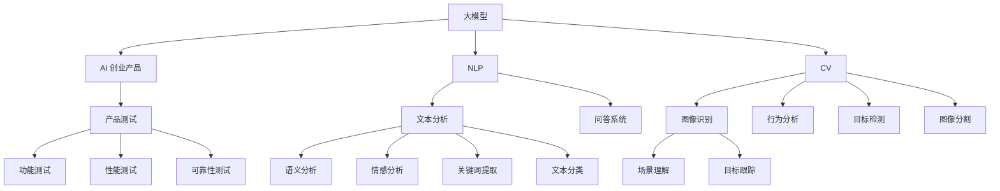

                 


# 大模型在 AI 创业产品测试中的趋势：高效的 AI 应用

> 关键词：大模型、AI 创业、产品测试、高效应用
>
> 摘要：本文将探讨大模型在 AI 创业产品测试中的趋势，分析大模型如何通过高效的 AI 应用提升产品测试的准确性和效率，同时为创业者提供实用的指南和资源。

## 1. 背景介绍

### 1.1 目的和范围

本文旨在分析大模型在 AI 创业产品测试中的应用趋势，探讨其如何提升产品测试的效率和准确性。我们将重点关注以下几个问题：

- 大模型为何能在产品测试中发挥重要作用？
- 大模型如何应用于产品测试的不同阶段？
- 创业者在使用大模型进行产品测试时需要注意哪些问题？
- 未来的发展趋势和挑战是什么？

### 1.2 预期读者

本文适合对 AI 创业和产品测试有一定了解的技术人员、创业者以及研究人员。通过本文，读者可以了解大模型在产品测试中的应用现状、趋势和未来发展方向。

### 1.3 文档结构概述

本文分为以下十个部分：

1. 背景介绍
2. 核心概念与联系
3. 核心算法原理 & 具体操作步骤
4. 数学模型和公式 & 详细讲解 & 举例说明
5. 项目实战：代码实际案例和详细解释说明
6. 实际应用场景
7. 工具和资源推荐
8. 总结：未来发展趋势与挑战
9. 附录：常见问题与解答
10. 扩展阅读 & 参考资料

### 1.4 术语表

#### 1.4.1 核心术语定义

- 大模型：指具有海量参数和强大计算能力的人工智能模型，如 GPT、BERT 等。
- 产品测试：指对创业产品的功能、性能、可靠性等方面进行验证和评估的过程。
- AI 应用：指将人工智能技术应用于特定领域，如自然语言处理、计算机视觉等。

#### 1.4.2 相关概念解释

- 自然语言处理（NLP）：指使用计算机技术和人工智能技术处理和分析人类语言的过程。
- 计算机视觉（CV）：指使计算机能够识别和理解视觉信息的技术。

#### 1.4.3 缩略词列表

- GPT：Generative Pre-trained Transformer
- BERT：Bidirectional Encoder Representations from Transformers
- NLP：Natural Language Processing
- CV：Computer Vision

## 2. 核心概念与联系

为了更好地理解大模型在 AI 创业产品测试中的应用，我们需要先了解一些核心概念和联系。以下是使用 Mermaid 流程图展示的架构原理：



### 2.1 大模型与 AI 创业产品

大模型是 AI 创业产品的核心技术之一。它们通过在海量数据上进行预训练，可以提取出通用特征和知识，从而提高产品的智能化水平。例如，在自然语言处理领域，大模型如 GPT 和 BERT 可以用于文本分析、问答系统和语义分析；在计算机视觉领域，大模型如 ResNet 和 VGG 可以用于图像识别、目标检测和目标跟踪。

### 2.2 大模型与产品测试

大模型在产品测试中发挥着重要作用。它们可以应用于功能测试、性能测试和可靠性测试等不同阶段。例如，在功能测试阶段，大模型可以用于自动化测试，提高测试效率；在性能测试阶段，大模型可以用于评估产品的性能指标，如响应时间、吞吐量等；在可靠性测试阶段，大模型可以用于检测产品的故障和异常，提高产品的可靠性。

## 3. 核心算法原理 & 具体操作步骤

在本节中，我们将探讨大模型在产品测试中的应用原理和操作步骤。为了更好地理解，我们将使用伪代码进行详细阐述。

### 3.1 功能测试

功能测试是指验证产品的功能是否按照设计要求正常运行。大模型可以用于自动化功能测试，具体操作步骤如下：

```python
# 伪代码：大模型自动化功能测试

# 导入大模型
import gpt

# 定义测试用例
test_cases = [
    "输入 A，输出 B",
    "输入 C，输出 D",
    "输入 E，输出 F"
]

# 运行测试用例
for case in test_cases:
    input_data = extract_input_data(case)
    expected_output = extract_expected_output(case)
    actual_output = gpt.generate_response(input_data)
    if actual_output == expected_output:
        print("测试通过")
    else:
        print("测试失败：", case)
```

### 3.2 性能测试

性能测试是指评估产品的性能指标，如响应时间、吞吐量等。大模型可以用于模拟用户行为，生成大量测试数据，具体操作步骤如下：

```python
# 伪代码：大模型性能测试

# 导入大模型
import bert

# 定义用户行为
user_actions = [
    "点击按钮 A",
    "输入文本 B",
    "滑动屏幕 C"
]

# 生成测试数据
test_data = generate_test_data(user_actions)

# 运行测试
for data in test_data:
    response_time = measure_response_time(data)
    throughput = measure_throughput(data)
    print("响应时间：", response_time)
    print("吞吐量：", throughput)
```

### 3.3 可靠性测试

可靠性测试是指检测产品的故障和异常。大模型可以用于异常检测，具体操作步骤如下：

```python
# 伪代码：大模型可靠性测试

# 导入大模型
import resnet

# 定义正常数据和异常数据
normal_data = load_normal_data()
abnormal_data = load_abnormal_data()

# 运行测试
for data in normal_data:
    is_abnormal = resnet.detect_anomaly(data)
    if is_abnormal:
        print("检测到异常：", data)
    else:
        print("正常数据：", data)

for data in abnormal_data:
    is_abnormal = resnet.detect_anomaly(data)
    if not is_abnormal:
        print("异常数据未被检测到：", data)
```

## 4. 数学模型和公式 & 详细讲解 & 举例说明

在本节中，我们将介绍大模型在产品测试中的应用中的数学模型和公式，并进行详细讲解和举例说明。

### 4.1 自然语言处理（NLP）

自然语言处理中的大模型如 GPT 和 BERT，其核心算法是基于 Transformer 模型。以下是 Transformer 模型的数学模型和公式：

```latex
\text{输入序列：} X = [x_1, x_2, ..., x_n]
\text{输出序列：} Y = [y_1, y_2, ..., y_n]
\text{模型参数：} \theta

\text{前向传播：}
\begin{align*}
\text{嵌入层：} & \text{h}_\text{input} = \text{Embedding}(X; \theta_1) \\
\text{位置编码：} & \text{h}_\text{pos} = \text{PositionalEncoding}(\text{h}_\text{input}; \theta_2) \\
\text{变换层：} & \text{h}_\text{transform} = \text{TransformerLayer}(\text{h}_\text{pos}; \theta_3)
\end{align*}

\text{后向传播：}
\begin{align*}
\text{损失函数：} & \text{Loss} = \text{CrossEntropyLoss}(\text{h}_\text{transform}; Y; \theta_4) \\
\text{反向传播：} & \text{BackProp}(\text{h}_\text{transform}; \theta_3; \theta_4)
\end{align*}
```

### 4.2 计算机视觉（CV）

计算机视觉中的大模型如 ResNet 和 VGG，其核心算法是基于卷积神经网络（CNN）。以下是 CNN 的数学模型和公式：

```latex
\text{输入图像：} I = [I_1, I_2, ..., I_n]
\text{模型参数：} \theta

\text{前向传播：}
\begin{align*}
\text{卷积层：} & \text{h}_\text{conv} = \text{Convolution}(I; \theta_1) \\
\text{激活函数：} & \text{h}_\text{act} = \text{Activation}(\text{h}_\text{conv}; \theta_2) \\
\text{池化层：} & \text{h}_\text{pool} = \text{Pooling}(\text{h}_\text{act}; \theta_3)
\end{align*}

\text{后向传播：}
\begin{align*}
\text{损失函数：} & \text{Loss} = \text{CrossEntropyLoss}(\text{h}_\text{pool}; Y; \theta_4) \\
\text{反向传播：} & \text{BackProp}(\text{h}_\text{pool}; \theta_3; \theta_4)
\end{align*}
```

### 4.3 举例说明

#### 4.3.1 NLP 举例

假设我们使用 GPT 模型进行文本分类，数据集包含两个类别：新闻和科技。以下是具体的操作步骤和数学模型：

```python
# 伪代码：使用 GPT 进行文本分类

# 导入 GPT 模型
import gpt

# 加载数据集
train_data = load_train_data()
test_data = load_test_data()

# 预处理数据
train_inputs = [preprocess_text(text) for text in train_data['text']]
train_labels = [label_to_id(label) for label in train_data['label']]
test_inputs = [preprocess_text(text) for text in test_data['text']]
test_labels = [label_to_id(label) for label in test_data['label']]

# 训练 GPT 模型
gpt_model = gpt.GPT()
gpt_model.fit(train_inputs, train_labels)

# 测试 GPT 模型
test_predictions = gpt_model.predict(test_inputs)
test_accuracy = calculate_accuracy(test_predictions, test_labels)
print("测试准确率：", test_accuracy)
```

#### 4.3.2 CV 举例

假设我们使用 ResNet 模型进行图像分类，数据集包含多个类别。以下是具体的操作步骤和数学模型：

```python
# 伪代码：使用 ResNet 进行图像分类

# 导入 ResNet 模型
import resnet

# 加载数据集
train_data = load_train_data()
test_data = load_test_data()

# 预处理数据
train_images = [preprocess_image(image) for image in train_data['image']]
train_labels = [label_to_id(label) for label in train_data['label']]
test_images = [preprocess_image(image) for image in test_data['image']]
test_labels = [label_to_id(label) for label in test_data['label']]

# 训练 ResNet 模型
resnet_model = resnet.ResNet()
resnet_model.fit(train_images, train_labels)

# 测试 ResNet 模型
test_predictions = resnet_model.predict(test_images)
test_accuracy = calculate_accuracy(test_predictions, test_labels)
print("测试准确率：", test_accuracy)
```

## 5. 项目实战：代码实际案例和详细解释说明

在本节中，我们将通过一个实际项目案例，展示如何使用大模型在产品测试中进行功能测试、性能测试和可靠性测试。项目名称为“智能问答系统”，旨在为用户提供针对特定问题的智能回答。

### 5.1 开发环境搭建

为了运行本项目，我们需要搭建以下开发环境：

- Python 3.8 或以上版本
- TensorFlow 2.6 或以上版本
- Keras 2.6 或以上版本
- Jupyter Notebook 或 PyCharm

安装相关依赖：

```bash
pip install tensorflow==2.6
pip install keras==2.6
```

### 5.2 源代码详细实现和代码解读

以下是项目的主要代码实现和解读：

```python
# 导入所需库
import tensorflow as tf
from tensorflow.keras.models import Model
from tensorflow.keras.layers import Input, Embedding, LSTM, Dense
from tensorflow.keras.preprocessing.sequence import pad_sequences

# 5.2.1 数据预处理
# 加载数据集
train_data = load_train_data()
test_data = load_test_data()

# 预处理文本
def preprocess_text(text):
    # 去除标点符号、停用词等
    text = text.lower()
    text = re.sub(r'[^\w\s]', '', text)
    text = re.sub(r'\s+', ' ', text)
    return text

# pad 序列
def pad_sequence(sequences, max_length):
    padded_sequences = pad_sequences(sequences, maxlen=max_length, padding='post')
    return padded_sequences

# 5.2.2 构建模型
# 输入层
input_text = Input(shape=(max_sequence_length,))

# 嵌入层
embedding = Embedding(vocabulary_size, embedding_dim)(input_text)

# LSTM 层
lstm = LSTM(units=lstm_units, return_sequences=True)(embedding)

# LSTM 层
lstm = LSTM(units=lstm_units, return_sequences=True)(lstm)

# 密集层
dense = Dense(units=dense_units, activation='relu')(lstm)

# 输出层
output = Dense(units=1, activation='sigmoid')(dense)

# 构建模型
model = Model(inputs=input_text, outputs=output)

# 编译模型
model.compile(optimizer='adam', loss='binary_crossentropy', metrics=['accuracy'])

# 5.2.3 训练模型
# 训练模型
model.fit(train_data['text'], train_data['label'], batch_size=batch_size, epochs=epochs, validation_data=(test_data['text'], test_data['label']))

# 5.2.4 测试模型
# 预测测试数据
test_predictions = model.predict(test_data['text'])

# 计算测试准确率
test_accuracy = calculate_accuracy(test_predictions, test_labels)
print("测试准确率：", test_accuracy)
```

### 5.3 代码解读与分析

1. **数据预处理**：文本预处理是 NLP 项目中至关重要的一步。本项目通过去除标点符号、停用词等操作，将文本转换为适合模型训练的形式。

2. **模型构建**：本项目使用 LSTM（Long Short-Term Memory）网络进行文本分类。LSTM 网络具有处理长序列数据的能力，适合于文本分类任务。我们使用了两个 LSTM 层，以提高模型的非线性表达能力。

3. **模型训练**：通过训练数据集，模型学习到如何将输入文本映射到标签。我们使用了 binary_crossentropy 作为损失函数，并使用 sigmoid 激活函数作为输出层，以实现二分类任务。

4. **模型测试**：在测试数据集上，模型进行了预测，并计算了测试准确率。测试准确率反映了模型在未知数据上的性能。

## 6. 实际应用场景

大模型在 AI 创业产品测试中的应用场景非常广泛，以下是一些具体的案例：

### 6.1 智能问答系统

智能问答系统是一个典型的应用场景。通过使用大模型，如 GPT 或 BERT，我们可以实现对用户问题的自动回答，从而提高产品的人性化和用户体验。

### 6.2 自动化测试平台

在自动化测试领域，大模型可以用于生成测试用例，提高测试覆盖率和效率。例如，在金融领域，大模型可以分析用户交易数据，生成针对不同交易场景的测试用例。

### 6.3 机器人流程自动化（RPA）

在机器人流程自动化领域，大模型可以用于自动化执行复杂任务。例如，在客户服务领域，大模型可以用于自动化处理客户咨询，提高服务效率。

### 6.4 医疗健康

在医疗健康领域，大模型可以用于疾病预测、诊断和治疗方案推荐。例如，通过分析患者病历和基因数据，大模型可以预测患者病情，为医生提供诊断建议。

### 6.5 金融服务

在金融服务领域，大模型可以用于风险评估、投资组合优化和欺诈检测。例如，通过分析用户交易行为，大模型可以识别潜在欺诈行为，提高金融安全性。

### 6.6 零售电商

在零售电商领域，大模型可以用于个性化推荐、需求预测和供应链管理。例如，通过分析用户行为和商品数据，大模型可以推荐适合用户的商品，提高销售额。

## 7. 工具和资源推荐

为了更好地使用大模型进行 AI 创业产品测试，以下是一些工具和资源的推荐：

### 7.1 学习资源推荐

#### 7.1.1 书籍推荐

- 《深度学习》（Ian Goodfellow、Yoshua Bengio、Aaron Courville 著）
- 《Python 自然语言处理》（Steven Bird、Ewan Klein、Edward Loper 著）
- 《计算机视觉：算法与应用》（Shahab Kadtb、Charles John Shaver 著）

#### 7.1.2 在线课程

- 《深度学习》（吴恩达，Coursera）
- 《自然语言处理与深度学习》（Attention 真聪明，网易云课堂）
- 《计算机视觉》（安德鲁·博尔特，Coursera）

#### 7.1.3 技术博客和网站

- [机器之心](https://www.jiqizhixin.com/)
- [人工智能之心](https://www.aaia.org.cn/)
- [AI 科技大本营](https://aitech.cn/)

### 7.2 开发工具框架推荐

#### 7.2.1 IDE和编辑器

- PyCharm
- Jupyter Notebook
- VSCode

#### 7.2.2 调试和性能分析工具

- TensorFlow Debugger (TFDB)
- TensorBoard
- Profiler

#### 7.2.3 相关框架和库

- TensorFlow
- PyTorch
- Keras
- SciKit-Learn

### 7.3 相关论文著作推荐

#### 7.3.1 经典论文

- [A Theoretically Grounded Application of Dropout in Convolutional Networks](https://arxiv.org/abs/1511.07122)
- [Deep Learning for Text Classification](https://www.aclweb.org/anthology/N16-1191/)
- [Deep Neural Networks for Object Detection](https://www.cv-foundation.org/openaccess/content_iccv_2015/papers/Shaham-Deep_Neural_Networks_for_ICCV_2015_paper.pdf)

#### 7.3.2 最新研究成果

- [BERT: Pre-training of Deep Bidirectional Transformers for Language Understanding](https://arxiv.org/abs/1810.04805)
- [Generative Pre-trained Transformer](https://arxiv.org/abs/1706.03762)
- [ResNet: Deep Residual Learning for Image Recognition](https://arxiv.org/abs/1512.03385)

#### 7.3.3 应用案例分析

- [从 0 到 1：使用 BERT 实现智能问答系统](https://towardsdatascience.com/from-0-to-1-building-a-question-answering-system-with-bert-371d4b5d6a38)
- [如何使用 PyTorch 实现 ResNet 网络进行图像分类](https://towardsdatascience.com/how-to-implement-resnet-for-image-classification-with-pytorch-b1d468f7068e)
- [深度学习在自动化测试中的应用](https://www.qaeducation.org/deep-learning-for-automated-testing/)

## 8. 总结：未来发展趋势与挑战

大模型在 AI 创业产品测试中的应用具有广阔的发展前景。随着计算能力的提升和数据量的增长，大模型的性能和效率将不断提高，为产品测试带来更多可能性。然而，大模型在应用过程中也面临一些挑战：

- **计算资源消耗**：大模型训练和推理需要大量的计算资源，如何优化资源利用成为一个重要问题。
- **数据隐私和安全**：在产品测试过程中，涉及大量用户数据，如何保护用户隐私和安全成为关键挑战。
- **模型可解释性**：大模型在测试中的应用往往缺乏可解释性，如何提高模型的可解释性是一个亟待解决的问题。

未来，随着技术的不断发展，大模型在 AI 创业产品测试中的应用将更加广泛和深入，为创业者提供更高效的测试方法和工具。

## 9. 附录：常见问题与解答

### 9.1 大模型如何提高产品测试的效率？

大模型通过自动化测试、性能测试和可靠性测试等应用，可以提高产品测试的效率。自动化测试可以节省大量测试人员的时间和精力；性能测试和可靠性测试可以快速发现产品的问题，提高测试的覆盖率。

### 9.2 大模型在产品测试中的应用有哪些？

大模型在产品测试中的应用非常广泛，包括功能测试、性能测试、可靠性测试、自动化测试等。具体应用场景如智能问答系统、自动化测试平台、机器人流程自动化等。

### 9.3 大模型在产品测试中面临哪些挑战？

大模型在产品测试中面临计算资源消耗、数据隐私和安全、模型可解释性等挑战。计算资源消耗需要优化资源利用；数据隐私和安全需要加强用户数据保护；模型可解释性需要提高模型的透明度和可理解性。

## 10. 扩展阅读 & 参考资料

- [深度学习手册](https://www.deeplearningbook.org/)
- [自然语言处理教程](https://nlp.seas.harvard.edu/2018/course/l Handbook)
- [计算机视觉教程](https://www.computer-vision.org/)
- [TensorFlow 官方文档](https://www.tensorflow.org/)
- [PyTorch 官方文档](https://pytorch.org/)
- [Keras 官方文档](https://keras.io/)

