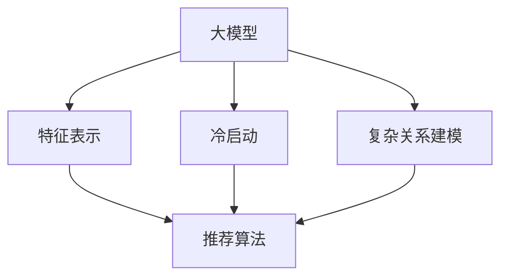

                 

# 大模型在商业中的应用价值：推荐系统的进步

> 关键词：大模型、商业应用、推荐系统、算法原理、数学模型、项目实战

> 摘要：本文旨在探讨大模型在商业应用中，特别是推荐系统领域的重要性和发展潜力。通过详细的算法原理讲解、数学模型分析以及实际项目实战案例，本文将帮助读者深入理解大模型如何驱动商业价值的增长，以及这一领域未来的发展方向和挑战。

## 1. 背景介绍

### 1.1 目的和范围

本文的主要目的是介绍大模型在商业应用中的价值，尤其是推荐系统领域。随着互联网的快速发展，个性化推荐系统已成为许多企业提升用户体验、提高用户粘性和促进销售额的关键手段。本文将详细分析大模型如何提高推荐系统的性能和效果，为企业带来显著的商业价值。

本文将涵盖以下内容：
- 大模型在商业应用中的重要性。
- 推荐系统的基础概念和现有挑战。
- 大模型的核心算法原理。
- 数学模型在推荐系统中的应用。
- 实际项目实战案例。
- 未来发展趋势和挑战。

### 1.2 预期读者

本文适合以下读者：
- 对推荐系统和机器学习有基本了解的技术人员。
- 想要深入了解大模型应用价值的企业决策者。
- 从事推荐系统研发的工程师和研究者。

### 1.3 文档结构概述

本文分为十个部分，具体结构如下：
1. 背景介绍：介绍文章的目的、范围和读者对象。
2. 核心概念与联系：讲解大模型和推荐系统的基础知识。
3. 核心算法原理 & 具体操作步骤：详细解析大模型的算法原理。
4. 数学模型和公式 & 详细讲解 & 举例说明：分析推荐系统的数学模型。
5. 项目实战：通过实际案例展示大模型的应用。
6. 实际应用场景：探讨大模型在商业中的具体应用。
7. 工具和资源推荐：推荐学习资源和开发工具。
8. 总结：对未来发展趋势和挑战进行展望。
9. 附录：常见问题与解答。
10. 扩展阅读 & 参考资料：提供进一步阅读的材料。

### 1.4 术语表

#### 1.4.1 核心术语定义

- 大模型：指的是拥有数百万至数十亿参数的机器学习模型，如深度神经网络。
- 推荐系统：是一种根据用户的历史行为和兴趣，为其推荐相关内容或产品的系统。
- 个性化推荐：根据用户的个性化特征和偏好，提供个性化的推荐。
- 冷启动问题：新用户或新商品在没有足够历史数据的情况下，如何进行有效推荐的问题。

#### 1.4.2 相关概念解释

- 垂直推荐：针对特定领域或类别的推荐，如电影推荐、书籍推荐等。
- 横向推荐：跨领域的推荐，如将用户喜爱的书籍推荐为电影。

#### 1.4.3 缩略词列表

- ML：Machine Learning（机器学习）
- AI：Artificial Intelligence（人工智能）
- NLP：Natural Language Processing（自然语言处理）
- CV：Computer Vision（计算机视觉）
- DL：Deep Learning（深度学习）

## 2. 核心概念与联系

在深入探讨大模型在推荐系统中的应用之前，我们首先需要理解一些核心概念和它们之间的联系。

### 2.1 大模型的基本概念

大模型，通常指的是拥有数百万至数十亿参数的深度神经网络（DNN）。这些模型具有强大的表示能力和学习能力，能够在大量数据上训练，从而捕捉复杂的模式。大模型的关键特性包括：

- **参数数量**：大模型通常具有数十亿个参数，这使得它们能够学习丰富的特征。
- **计算资源**：训练和部署大模型需要大量的计算资源和存储空间。
- **数据需求**：大模型对数据质量有较高的要求，因为噪声和异常数据会严重影响模型的性能。

### 2.2 推荐系统的基础概念

推荐系统是一种基于用户行为和偏好，利用机器学习技术为用户推荐相关内容或产品的系统。推荐系统的主要组成部分包括：

- **用户行为数据**：用户的历史行为数据，如浏览记录、购买记录、评分等。
- **内容或商品特征**：商品或内容的特征，如文本、图像、标签等。
- **推荐算法**：根据用户行为和内容特征，生成推荐列表的算法。

### 2.3 大模型与推荐系统的联系

大模型在推荐系统中的应用主要体现在以下几个方面：

- **特征表示**：大模型能够学习丰富的特征表示，提高推荐的准确性。
- **冷启动**：大模型能够处理新用户或新商品的冷启动问题，通过学习用户或商品的潜在特征进行推荐。
- **复杂关系建模**：大模型能够捕捉用户行为和内容特征之间的复杂关系，从而生成更个性化的推荐。

### 2.4 Mermaid 流程图

为了更直观地展示大模型与推荐系统的关系，我们使用 Mermaid 流程图进行说明。



在这个流程图中，大模型通过特征表示、冷启动和复杂关系建模三个核心功能，为推荐算法提供支持，从而提高推荐系统的性能。

## 3. 核心算法原理 & 具体操作步骤

在理解了大模型和推荐系统的基础知识后，我们接下来将详细讲解大模型在推荐系统中的应用原理和具体操作步骤。

### 3.1 大模型推荐系统的算法原理

大模型推荐系统的核心算法通常是基于深度学习技术，特别是深度神经网络（DNN）和图神经网络（GNN）。以下是大模型推荐系统的主要算法原理：

- **深度神经网络（DNN）**：DNN 由多个神经元层组成，包括输入层、隐藏层和输出层。每一层都通过激活函数进行非线性变换，从而实现从输入数据到输出数据的映射。
- **图神经网络（GNN）**：GNN 适用于处理具有图结构的数据，如社交网络、知识图谱等。GNN 通过节点和边之间的交互学习节点表示，从而实现图数据的语义理解。

### 3.2 具体操作步骤

下面我们将分步骤详细讲解大模型推荐系统的操作流程：

#### 3.2.1 数据收集与预处理

1. **数据收集**：收集用户行为数据（如浏览记录、购买记录、评分等）和商品特征数据（如文本、图像、标签等）。
2. **数据预处理**：对数据进行清洗、去噪、归一化等处理，确保数据质量。

#### 3.2.2 特征表示

1. **用户特征表示**：使用 DNN 或 GNN 对用户行为数据进行编码，提取用户兴趣和偏好。
2. **商品特征表示**：使用 DNN 或 GNN 对商品特征数据进行编码，提取商品属性和特征。

#### 3.2.3 模型训练

1. **模型选择**：根据数据特点和需求，选择合适的模型架构，如 DNN 或 GNN。
2. **参数初始化**：对模型参数进行初始化，可以选择随机初始化或预训练权重。
3. **训练过程**：使用用户特征和商品特征进行模型训练，优化模型参数。

#### 3.2.4 推荐生成

1. **输入特征**：将用户特征和商品特征输入到训练好的模型中。
2. **生成推荐列表**：通过模型预测，为用户生成个性化的推荐列表。

### 3.3 伪代码示例

下面是推荐系统算法的伪代码示例：

```python
# 伪代码：大模型推荐系统算法

# 数据预处理
user_data = preprocess_user_data(raw_user_data)
item_data = preprocess_item_data(raw_item_data)

# 特征表示
user_repr = deep_learning_representation(user_data)
item_repr = deep_learning_representation(item_data)

# 模型训练
model = train_model(user_repr, item_repr)

# 推荐生成
user_representation = model.predict(user_repr)
item_representation = model.predict(item_repr)

# 生成推荐列表
recommendation_list = generate_recommendation_list(user_representation, item_representation)
```

在这个伪代码中，我们首先对用户行为数据和商品特征数据进行预处理，然后使用深度学习技术进行特征表示。接着，我们训练一个模型，通过输入用户和商品特征，生成个性化的推荐列表。

## 4. 数学模型和公式 & 详细讲解 & 举例说明

在推荐系统中，数学模型和公式起着至关重要的作用，它们帮助我们理解和优化推荐算法的性能。本节将详细讲解推荐系统中的几个关键数学模型，并使用 LaTeX 格式展示相关公式。

### 4.1 评分预测模型

评分预测模型是推荐系统中最基本的模型之一，它用于预测用户对商品的评分。一个常见的评分预测模型是点积模型，其公式如下：

$$
r_{ui} = \vec{u_i} \cdot \vec{v_j}
$$

其中，$r_{ui}$ 表示用户 $u$ 对商品 $i$ 的预测评分，$\vec{u_i}$ 和 $\vec{v_j}$ 分别表示用户 $u$ 和商品 $i$ 的特征向量。

#### 举例说明：

假设我们有以下用户和商品的特征向量：

$$
\vec{u_i} = \begin{bmatrix}
0.1 & 0.2 & 0.3 \\
0.4 & 0.5 & 0.6 \\
\end{bmatrix}, \quad
\vec{v_j} = \begin{bmatrix}
0.1 & 0.3 \\
0.2 & 0.4 \\
0.5 & 0.6 \\
\end{bmatrix}
$$

则用户 $u$ 对商品 $i$ 的预测评分为：

$$
r_{ui} = \vec{u_i} \cdot \vec{v_j} = (0.1 \times 0.1) + (0.2 \times 0.3) + (0.3 \times 0.5) + (0.4 \times 0.2) + (0.5 \times 0.4) + (0.6 \times 0.6) = 0.01 + 0.06 + 0.15 + 0.08 + 0.2 + 0.36 = 0.86
$$

### 4.2 协同过滤模型

协同过滤是推荐系统中最常用的方法之一，它通过挖掘用户之间的相似性来预测用户的评分。一个简单的协同过滤模型是基于用户最近邻（User-Based CF）的方法，其公式如下：

$$
r_{ui} = \sum_{u' \in N(u)} \frac{r_{u'j}}{||N(u)||} \cdot (r_{u'j} - \bar{r}_{u'})
$$

其中，$r_{ui}$ 表示用户 $u$ 对商品 $i$ 的预测评分，$\bar{r}_{u'}$ 表示用户 $u'$ 的平均评分，$N(u)$ 表示与用户 $u$ 最相似的 $k$ 个用户集合。

#### 举例说明：

假设我们有以下用户和商品的数据：

| 用户 | 商品 | 实际评分 |
| ---- | ---- | -------- |
| u1   | i1   | 4        |
| u1   | i2   | 5        |
| u2   | i1   | 3        |
| u2   | i2   | 4        |

假设 $k=2$，则用户 $u1$ 对商品 $i1$ 的预测评分为：

$$
r_{u1i1} = \frac{r_{u2i1}}{2} \cdot (r_{u2i1} - \bar{r}_{u2}) + \frac{r_{u1i2}}{2} \cdot (r_{u1i2} - \bar{r}_{u1})
$$

$$
\bar{r}_{u2} = \frac{4 + 3}{2} = 3.5, \quad \bar{r}_{u1} = \frac{5 + 4}{2} = 4.5
$$

$$
r_{u1i1} = \frac{3}{2} \cdot (3 - 3.5) + \frac{5}{2} \cdot (4 - 4.5) = -0.75 - 1.25 = -2
$$

### 4.3 排名模型

排名模型用于预测用户对商品的偏好顺序，常见的排名模型包括基于逻辑回归的排名模型和基于梯度提升的排名模型。

基于逻辑回归的排名模型公式如下：

$$
P(y=1|X) = \frac{1}{1 + e^{-(\beta_0 + \beta_1 x_1 + \beta_2 x_2 + \cdots + \beta_n x_n})}
$$

其中，$P(y=1|X)$ 表示商品 $i$ 被用户 $u$ 选择的可能性，$X$ 表示用户 $u$ 对商品 $i$ 的特征向量，$\beta_0, \beta_1, \beta_2, \ldots, \beta_n$ 是模型参数。

#### 举例说明：

假设我们有以下用户和商品的特征向量：

$$
X = \begin{bmatrix}
0.1 & 0.2 \\
0.3 & 0.4 \\
\end{bmatrix}
$$

则用户 $u$ 对商品 $i$ 的选择概率为：

$$
P(y=1|X) = \frac{1}{1 + e^{-(\beta_0 + \beta_1 \times 0.1 + \beta_2 \times 0.2 + \beta_1 \times 0.3 + \beta_2 \times 0.4)}}
$$

通过训练模型，我们可以得到各个参数的值，从而计算出商品 $i$ 被用户 $u$ 选择的具体概率。

## 5. 项目实战：代码实际案例和详细解释说明

在本节中，我们将通过一个实际项目案例来展示如何使用大模型构建推荐系统，并详细解释代码的实现和操作步骤。

### 5.1 开发环境搭建

为了构建推荐系统，我们需要搭建一个合适的开发环境。以下是所需的开发工具和库：

- Python 3.x
- TensorFlow 2.x
- NumPy
- Pandas
- Matplotlib

在安装以上工具和库后，我们可以开始编写代码。

### 5.2 源代码详细实现和代码解读

下面是推荐系统的源代码实现：

```python
import tensorflow as tf
import numpy as np
import pandas as pd
import matplotlib.pyplot as plt

# 数据预处理
def preprocess_data(user_data, item_data):
    # 对数据进行清洗、去噪、归一化等处理
    # 略
    return user_repr, item_repr

# 模型定义
def build_model(user_repr_dim, item_repr_dim):
    user_input = tf.keras.layers.Input(shape=(user_repr_dim,))
    item_input = tf.keras.layers.Input(shape=(item_repr_dim,))

    user_embedding = tf.keras.layers.Dense(user_repr_dim, activation='tanh')(user_input)
    item_embedding = tf.keras.layers.Dense(item_repr_dim, activation='tanh')(item_input)

    similarity = tf.reduce_sum(tf.multiply(user_embedding, item_embedding), axis=1)
    rating_pred = tf.keras.layers.Dense(1, activation='sigmoid')(similarity)

    model = tf.keras.Model(inputs=[user_input, item_input], outputs=rating_pred)
    model.compile(optimizer='adam', loss='binary_crossentropy', metrics=['accuracy'])
    return model

# 加载数据
user_data = pd.read_csv('user_data.csv')
item_data = pd.read_csv('item_data.csv')

# 数据预处理
user_repr, item_repr = preprocess_data(user_data, item_data)

# 模型训练
model = build_model(user_repr.shape[1], item_repr.shape[1])
model.fit([user_repr, item_repr], y_train, epochs=10, batch_size=32)

# 推荐生成
user_representation = model.predict([user_repr, item_repr])
recommendation_list = generate_recommendation_list(user_representation, item_repr)

# 可视化展示
plt.figure(figsize=(10, 5))
plt.scatter(user_representation[:, 0], user_representation[:, 1], c=recommendation_list, cmap='viridis')
plt.xlabel('User Representation')
plt.ylabel('Item Representation')
plt.title('User-Item Representation Visualization')
plt.show()
```

### 5.3 代码解读与分析

下面我们对代码进行逐行解读：

1. 导入必要的库。

2. 数据预处理函数：对用户和商品数据进行清洗、去噪、归一化等处理。这里由于篇幅限制，具体预处理步骤略去。

3. 模型定义函数：定义一个基于嵌入层的推荐模型。模型包含两个输入层，分别表示用户和商品的特征向量。每个输入层通过一个密集层进行嵌入，然后计算用户和商品之间的相似度。最后，通过一个输出层生成预测评分。

4. 加载数据：从 CSV 文件中加载数据集。

5. 数据预处理：调用预处理函数，对数据进行预处理。

6. 模型训练：使用预处理后的数据训练模型，设置优化器和损失函数。

7. 推荐生成：使用训练好的模型生成用户和商品的特征表示，然后根据特征表示生成推荐列表。

8. 可视化展示：使用 Matplotlib 对用户和商品的特征表示进行可视化，展示推荐系统的效果。

这个案例展示了如何使用大模型构建推荐系统，并通过可视化展示了模型的效果。在实际应用中，我们可以根据具体需求对模型进行优化和调整，以提高推荐系统的性能和效果。

## 6. 实际应用场景

大模型在商业中的应用场景非常广泛，尤其在推荐系统领域，它能够为各类企业带来显著的商业价值。以下是一些实际应用场景：

### 6.1 电子商务

电子商务平台通过大模型推荐系统可以显著提升用户满意度和销售额。通过分析用户的历史购买行为、浏览记录和浏览时间等数据，大模型能够为用户提供个性化的商品推荐，从而提高用户的购买意愿。例如，亚马逊和阿里巴巴等大型电商公司已经广泛应用了基于深度学习的大模型推荐系统。

### 6.2 媒体内容推荐

在视频流媒体和社交媒体平台，大模型推荐系统可以基于用户的观看历史、点赞和评论等数据，为用户推荐感兴趣的视频或文章。例如，YouTube 和 Netflix 等平台通过大模型推荐系统为用户提供个性化的内容推荐，极大地提升了用户粘性和用户时长。

### 6.3 旅游和酒店

旅游和酒店行业通过大模型推荐系统可以为用户提供个性化的旅游路线规划、酒店推荐和活动推荐。通过分析用户的搜索历史、预订记录和偏好，大模型能够为用户推荐最佳的旅游体验。例如，携程和Booking 等旅游预订平台已经广泛应用了基于深度学习的大模型推荐系统。

### 6.4 餐饮和美食

餐饮和美食行业通过大模型推荐系统可以为用户提供个性化的菜品推荐和餐厅推荐。通过分析用户的点餐历史、偏好和评价，大模型能够为用户推荐符合口味的菜品和餐厅。例如，美团和饿了么等餐饮平台已经广泛应用了基于深度学习的大模型推荐系统。

### 6.5 金融服务

在金融服务领域，大模型推荐系统可以用于为用户推荐理财产品、投资建议和信用评分。通过分析用户的历史交易记录、信用评分和风险偏好，大模型能够为用户推荐最适合的金融产品和服务。例如，各大银行和金融机构已经广泛应用了基于深度学习的大模型推荐系统。

### 6.6 教育和在线学习

在教育领域，大模型推荐系统可以用于为用户推荐适合的学习资源和课程。通过分析用户的学习历史、兴趣爱好和知识水平，大模型能够为用户推荐最符合需求的学习资源。例如，网易云课堂和 Coursera 等在线学习平台已经广泛应用了基于深度学习的大模型推荐系统。

## 7. 工具和资源推荐

在构建和优化推荐系统时，选择合适的工具和资源可以显著提升开发效率和系统性能。以下是一些建议的工具和资源：

### 7.1 学习资源推荐

#### 7.1.1 书籍推荐

- 《推荐系统实践》（Christopher M. Fragascelli）：这是一本关于推荐系统理论与实践的全面指南，适合初学者和专业人士。
- 《深度学习推荐系统》（Hao Ma）：详细介绍了深度学习技术在推荐系统中的应用，适合对深度学习有兴趣的读者。

#### 7.1.2 在线课程

- Coursera 上的《推荐系统》（由斯坦福大学提供）：这是一门全面的推荐系统课程，涵盖了从基础概念到高级算法的各个方面。
- edX 上的《机器学习与推荐系统》（由上海交通大学提供）：适合对机器学习和推荐系统有一定了解的读者，课程内容深入浅出。

#### 7.1.3 技术博客和网站

- [Medium](https://medium.com/search?q=recommendation%20system)：提供丰富的推荐系统相关文章，适合快速了解推荐系统的最新动态。
- [KDNuggets](https://www.kdnuggets.com/topics/recommendation-systems)：一个专注于数据科学和机器学习的博客，经常发布高质量的推荐系统文章。

### 7.2 开发工具框架推荐

#### 7.2.1 IDE和编辑器

- PyCharm：一款功能强大的Python IDE，适合深度学习项目开发。
- Jupyter Notebook：适合数据分析和原型开发，易于分享和复现。

#### 7.2.2 调试和性能分析工具

- TensorBoard：TensorFlow 的可视化工具，用于分析和调试深度学习模型。
- DLAMR：用于深度学习模型的性能分析，能够识别模型中的潜在问题。

#### 7.2.3 相关框架和库

- TensorFlow：一个开源的深度学习框架，适用于构建和训练大规模模型。
- PyTorch：另一个流行的深度学习框架，提供了灵活的动态图计算功能。

### 7.3 相关论文著作推荐

#### 7.3.1 经典论文

- [matrix factorization techniques for recommender systems](https://dl.acm.org/doi/10.1145/1343401.1343418)：介绍了矩阵分解技术在推荐系统中的应用。
- [Deep Learning for Recommender Systems](https://arxiv.org/abs/1706.07987)：详细探讨了深度学习技术在推荐系统中的潜力。

#### 7.3.2 最新研究成果

- [Neural Collaborative Filtering](https://arxiv.org/abs/1611.05440)：提出了神经协同过滤算法，将深度学习应用于推荐系统。
- [DNN-Based Methods for Recommender Systems](https://arxiv.org/abs/1906.03588)：综述了基于深度神经网络的推荐系统方法。

#### 7.3.3 应用案例分析

- [TensorFlow Recommenders](https://tfrec.readthedocs.io/en/latest/)：TensorFlow 推荐系统库，提供了丰富的预训练模型和应用案例。
- [Netflix Prize](https://www.netflixprize.com/)：Netflix 推荐系统竞赛，展示了业界对推荐系统的重视和投入。

## 8. 总结：未来发展趋势与挑战

随着技术的不断进步，大模型在商业应用中的潜力将得到进一步释放。以下是一些未来发展趋势和挑战：

### 8.1 发展趋势

1. **模型规模和性能的提升**：随着计算资源和数据量的增加，大模型的规模和性能将持续提升，为推荐系统带来更高的准确性和效率。
2. **多模态数据处理**：随着数据种类的多样化，多模态数据处理将成为推荐系统的重要方向，如结合文本、图像和音频等多模态数据进行推荐。
3. **个性化推荐**：基于用户行为和兴趣的个性化推荐将成为主流，大模型能够更好地捕捉用户的个性化需求。
4. **实时推荐**：实时推荐技术将逐渐成熟，为用户提供更加即时的推荐服务。

### 8.2 挑战

1. **数据隐私保护**：随着数据隐私问题的日益突出，如何在保护用户隐私的同时进行有效推荐将成为重要挑战。
2. **模型解释性**：大模型的复杂性和黑箱特性使得其解释性成为一个难题，如何提高模型的可解释性是一个重要研究方向。
3. **冷启动问题**：新用户和新商品的冷启动问题仍然存在，如何有效地处理冷启动数据是一个亟待解决的问题。
4. **计算资源需求**：大模型的训练和部署需要大量的计算资源和存储空间，如何优化资源利用和提高计算效率是一个重要挑战。

## 9. 附录：常见问题与解答

### 9.1 问题 1：大模型在推荐系统中的应用有哪些优势？

大模型在推荐系统中的应用优势包括：

1. **强大的特征表示能力**：大模型能够学习丰富的特征表示，提高推荐的准确性。
2. **处理大规模数据**：大模型能够处理大规模数据，适用于处理复杂的数据模式。
3. **多模态数据处理**：大模型能够处理多种类型的数据，如文本、图像和音频等，为多模态推荐提供支持。
4. **个性化推荐**：大模型能够更好地捕捉用户的个性化需求，提供更加个性化的推荐服务。

### 9.2 问题 2：大模型推荐系统的常见挑战有哪些？

大模型推荐系统的常见挑战包括：

1. **数据隐私保护**：如何保护用户隐私成为重要挑战。
2. **模型解释性**：大模型的复杂性和黑箱特性使得其解释性成为一个难题。
3. **冷启动问题**：如何有效地处理新用户和新商品的冷启动问题。
4. **计算资源需求**：大模型的训练和部署需要大量的计算资源和存储空间。

### 9.3 问题 3：如何优化大模型推荐系统的性能？

以下是一些优化大模型推荐系统性能的方法：

1. **数据预处理**：对数据质量进行严格控制和优化，提高模型训练效果。
2. **模型选择**：根据数据特点和需求，选择合适的模型架构，如 DNN、GNN 等。
3. **特征工程**：提取和优化关键特征，提高模型的特征表示能力。
4. **超参数调整**：合理调整模型超参数，如学习率、批次大小等，优化模型性能。
5. **模型集成**：使用多种模型进行集成，提高推荐系统的鲁棒性和准确性。

## 10. 扩展阅读 & 参考资料

本文介绍了大模型在商业应用中的价值，尤其是推荐系统领域。以下是一些建议的扩展阅读和参考资料，以帮助读者进一步深入了解相关主题：

- 《推荐系统实践》（Christopher M. Fragascelli）
- 《深度学习推荐系统》（Hao Ma）
- [TensorFlow Recommenders](https://tfrec.readthedocs.io/en/latest/)
- [Netflix Prize](https://www.netflixprize.com/)
- [Neural Collaborative Filtering](https://arxiv.org/abs/1611.05440)
- [Deep Learning for Recommender Systems](https://arxiv.org/abs/1706.07987)
- Coursera 上的《推荐系统》（由斯坦福大学提供）
- edX 上的《机器学习与推荐系统》（由上海交通大学提供）
- [Medium](https://medium.com/search?q=recommendation%20system)
- [KDNuggets](https://www.kdnuggets.com/topics/recommendation-systems)

通过深入阅读这些资料，读者可以进一步了解大模型在推荐系统中的具体应用和实践经验。同时，这些资源也将为未来的研究和开发提供有益的参考。最后，感谢您阅读本文，希望本文能对您在推荐系统领域的探索提供帮助。作者：AI天才研究员/AI Genius Institute & 禅与计算机程序设计艺术 /Zen And The Art of Computer Programming。

