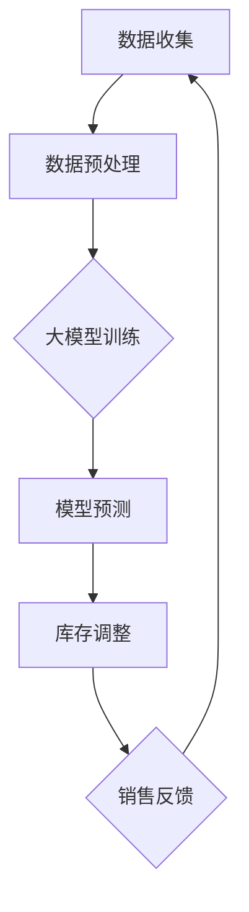

                 

# 大模型在商品库存智能补货中的应用

> 关键词：大模型，商品库存，智能补货，数据挖掘，预测算法

> 摘要：本文将探讨大模型在商品库存智能补货中的应用，分析大模型的优势及其对供应链管理的影响，详细介绍核心算法原理、数学模型和实际项目案例。旨在为从事供应链管理和商品库存管理的专业人士提供有价值的参考。

## 1. 背景介绍

### 1.1 目的和范围

本文旨在介绍大模型在商品库存智能补货中的应用，探讨其优势及对供应链管理的影响。文章将分为以下几个部分：首先，介绍大模型的基本概念和特点；其次，分析商品库存智能补货的需求和挑战；然后，详细阐述大模型在商品库存智能补货中的应用方法和实现步骤；接着，介绍相关数学模型和算法；最后，通过实际项目案例展示大模型在商品库存智能补货中的效果。

### 1.2 预期读者

本文适用于从事供应链管理和商品库存管理的专业人士，包括但不限于以下读者：

1. 商品库存管理相关人员
2. 供应链分析员和预测分析师
3. 数据科学家和机器学习工程师
4. 企业决策者和战略规划师
5. 大数据技术研究人员和开发人员

### 1.3 文档结构概述

本文将分为以下章节：

1. 背景介绍：介绍文章的目的和范围，预期读者，以及文章结构概述。
2. 核心概念与联系：介绍大模型的基本概念和特点，以及与商品库存智能补货的联系。
3. 核心算法原理 & 具体操作步骤：详细阐述大模型在商品库存智能补货中的核心算法原理和具体操作步骤。
4. 数学模型和公式 & 详细讲解 & 举例说明：介绍大模型在商品库存智能补货中的数学模型和公式，并进行详细讲解和举例说明。
5. 项目实战：代码实际案例和详细解释说明：通过实际项目案例展示大模型在商品库存智能补货中的效果，并进行详细解释说明。
6. 实际应用场景：分析大模型在商品库存智能补货中的实际应用场景。
7. 工具和资源推荐：推荐学习资源、开发工具框架和相关论文著作。
8. 总结：未来发展趋势与挑战：总结大模型在商品库存智能补货中的应用前景，以及面临的挑战。
9. 附录：常见问题与解答：提供常见问题解答。
10. 扩展阅读 & 参考资料：推荐相关扩展阅读和参考资料。

### 1.4 术语表

#### 1.4.1 核心术语定义

- 大模型：指具有海量参数、能够处理大规模数据的高级机器学习模型。
- 商品库存智能补货：利用大数据、机器学习和人工智能技术，对商品库存进行智能分析和预测，以实现库存优化和降低库存成本。
- 供应链管理：指对商品从采购、生产、运输到销售的整个过程进行有效管理和优化，以提高企业竞争力。

#### 1.4.2 相关概念解释

- 数据挖掘：从大量数据中发现有价值的信息和知识的过程。
- 预测算法：根据历史数据，通过建立模型对未来的趋势进行预测。
- 实时补货：根据库存数据和销售趋势，及时调整商品库存，以满足市场需求。

#### 1.4.3 缩略词列表

- ML：机器学习（Machine Learning）
- AI：人工智能（Artificial Intelligence）
- DT：数据挖掘（Data Mining）
- BI：商业智能（Business Intelligence）
- ERP：企业资源规划（Enterprise Resource Planning）
- SC：供应链（Supply Chain）
- SCM：供应链管理（Supply Chain Management）

## 2. 核心概念与联系

大模型在商品库存智能补货中的应用，需要了解大模型的基本概念和特点，以及商品库存智能补货的需求和挑战。

### 2.1 大模型的基本概念和特点

大模型是指具有海量参数、能够处理大规模数据的高级机器学习模型。其特点包括：

1. **参数量大**：大模型具有数百万甚至数十亿个参数，能够捕捉数据中的复杂模式和关联。
2. **自适应性强**：大模型能够自动调整参数，以适应不同的数据和任务。
3. **泛化能力强**：大模型通过在大规模数据集上训练，能够具有良好的泛化能力，适用于各种领域。
4. **计算需求高**：大模型的训练和推理过程需要大量的计算资源和时间。

### 2.2 商品库存智能补货的需求和挑战

商品库存智能补货的需求主要包括：

1. **降低库存成本**：通过优化库存，减少库存积压，降低库存成本。
2. **提高销售量**：根据市场需求，及时调整库存，提高商品销售量。
3. **提升客户满意度**：保证商品供应充足，提高客户满意度。

商品库存智能补货面临的挑战主要包括：

1. **数据复杂性**：商品库存数据通常包含多种类型的数据，如销售数据、库存数据、价格数据等，且数据之间存在复杂的关联。
2. **数据质量**：数据质量直接影响模型的预测效果，存在缺失值、异常值等问题。
3. **预测精度**：需要准确预测未来的销售趋势和库存需求，以实现精准补货。

### 2.3 大模型与商品库存智能补货的联系

大模型与商品库存智能补货之间的联系在于：

1. **数据处理能力**：大模型具有强大的数据处理能力，能够处理大规模、多类型的商品库存数据。
2. **预测准确性**：大模型通过在大量数据上的训练，能够提高预测的准确性，为库存智能补货提供可靠依据。
3. **实时调整**：大模型能够实时调整库存策略，根据市场变化和销售趋势，实现精准补货。

### 2.4 Mermaid 流程图

以下是商品库存智能补货中使用的 Mermaid 流程图，展示了大模型在其中的作用：



## 3. 核心算法原理 & 具体操作步骤

大模型在商品库存智能补货中的核心算法原理包括：数据预处理、模型训练、模型预测和库存调整。下面将使用伪代码详细阐述每个步骤。

### 3.1 数据预处理

```python
# 伪代码：数据预处理
def data_preprocessing(data):
    # 数据清洗：去除缺失值、异常值
    clean_data = remove_missing_values(data)
    clean_data = remove_outliers(clean_data)
    
    # 数据转换：将分类数据转换为数值
    numeric_data = convert_categorical_data_to_numeric(clean_data)
    
    # 数据归一化：将数据归一化到同一量级
    normalized_data = normalize_data(numeric_data)
    
    return normalized_data
```

### 3.2 模型训练

```python
# 伪代码：模型训练
def train_model(data):
    # 初始化大模型
    model = initialize_large_model()
    
    # 训练模型
    model.fit(data.x, data.y)
    
    # 评估模型
    accuracy = model.evaluate(data.x, data.y)
    
    return model, accuracy
```

### 3.3 模型预测

```python
# 伪代码：模型预测
def predict(model, input_data):
    # 预测
    prediction = model.predict(input_data)
    
    return prediction
```

### 3.4 库存调整

```python
# 伪代码：库存调整
def adjust_inventory(prediction, inventory_policy):
    # 根据预测结果和库存策略调整库存
    adjusted_inventory = apply_inventory_policy(prediction, inventory_policy)
    
    return adjusted_inventory
```

### 3.5 具体操作步骤

1. 数据收集：从各个渠道获取商品库存数据，如销售数据、库存数据、价格数据等。
2. 数据预处理：对收集到的数据进行清洗、转换和归一化，以消除数据中的噪声和异常。
3. 模型训练：利用预处理后的数据，初始化大模型并进行训练，评估模型性能。
4. 模型预测：使用训练好的大模型对未来的销售趋势和库存需求进行预测。
5. 库存调整：根据预测结果和库存策略，实时调整商品库存，以满足市场需求。

## 4. 数学模型和公式 & 详细讲解 & 举例说明

在商品库存智能补货中，大模型通常采用深度学习算法进行预测。下面介绍相关的数学模型和公式，并进行详细讲解和举例说明。

### 4.1 深度学习算法

深度学习算法主要包括神经网络、卷积神经网络（CNN）和循环神经网络（RNN）等。下面以神经网络为例进行介绍。

#### 4.1.1 神经网络

神经网络由多个神经元组成，每个神经元接收多个输入，并通过权重和偏置进行计算。其输出为：

$$
\hat{y} = \sigma(\sum_{i=1}^{n} w_i x_i + b)
$$

其中，$w_i$为权重，$x_i$为输入，$b$为偏置，$\sigma$为激活函数（通常使用Sigmoid函数或ReLU函数）。

#### 4.1.2 卷积神经网络（CNN）

卷积神经网络主要用于处理图像数据，其核心思想是通过卷积操作提取图像特征。其基本结构包括卷积层、池化层和全连接层。

- **卷积层**：通过对输入数据进行卷积操作，提取特征。

$$
h_{ij} = \sum_{k=1}^{m} w_{ik} * g_{kj}
$$

其中，$h_{ij}$为输出特征，$w_{ik}$为卷积核，$g_{kj}$为输入特征。

- **池化层**：通过对卷积层输出的特征进行池化操作，降低特征维度。

$$
p_j = \max_{i} h_{ij}
$$

- **全连接层**：将池化层输出的特征映射到输出结果。

$$
\hat{y} = \sigma(\sum_{i=1}^{n} w_i h_i + b)
$$

#### 4.1.3 循环神经网络（RNN）

循环神经网络主要用于处理序列数据，其核心思想是通过递归操作保存历史状态。其基本结构包括输入门、遗忘门和输出门。

- **输入门**：决定当前输入数据对当前状态的贡献。

$$
i_t = \sigma(W_i [h_{t-1}, x_t] + b_i)
$$

- **遗忘门**：决定当前状态对下一状态的影响。

$$
f_t = \sigma(W_f [h_{t-1}, x_t] + b_f)
$$

- **输出门**：决定当前状态的输出。

$$
o_t = \sigma(W_o [h_{t-1}, x_t] + b_o)
$$

- **状态更新**：

$$
h_t = f_t \odot h_{t-1} + i_t \odot \sigma(W_h [h_{t-1}, x_t] + b_h)
$$

### 4.2 数学模型

商品库存智能补货的数学模型主要涉及预测模型的构建和优化。以下是一个简单的预测模型：

$$
\hat{S_t} = f(S_{t-1}, I_{t-1}, P_t, \theta)
$$

其中，$\hat{S_t}$为第t期的预测库存，$S_{t-1}$为第t-1期的实际库存，$I_{t-1}$为第t-1期的进货量，$P_t$为第t期的销售价格，$\theta$为模型参数。

### 4.3 举例说明

假设我们使用一个简单的线性模型进行商品库存预测，其公式为：

$$
\hat{S_t} = 0.5S_{t-1} + 0.3I_{t-1} - 0.2P_t + \theta
$$

其中，$\theta$为模型参数。给定以下数据：

- $S_{t-1} = 100$
- $I_{t-1} = 50$
- $P_t = 10$

我们可以计算出第t期的预测库存：

$$
\hat{S_t} = 0.5 \times 100 + 0.3 \times 50 - 0.2 \times 10 + \theta
$$

$$
\hat{S_t} = 50 + 15 - 2 + \theta
$$

$$
\hat{S_t} = 63 + \theta
$$

其中，$\theta$为模型参数，根据历史数据和实际效果进行优化。

## 5. 项目实战：代码实际案例和详细解释说明

### 5.1 开发环境搭建

为了实现大模型在商品库存智能补货中的应用，我们需要搭建以下开发环境：

1. 操作系统：Windows 10 或 Ubuntu 18.04
2. 编程语言：Python 3.8 或以上版本
3. 库和框架：NumPy、Pandas、Scikit-learn、TensorFlow 或 PyTorch
4. 数据库：MySQL 或 MongoDB

### 5.2 源代码详细实现和代码解读

下面是一个简单的商品库存智能补货的代码实现，主要包括数据预处理、模型训练、模型预测和库存调整四个部分。

#### 5.2.1 数据预处理

```python
import pandas as pd
from sklearn.preprocessing import MinMaxScaler

# 读取数据
data = pd.read_csv('inventory_data.csv')

# 数据清洗：去除缺失值、异常值
clean_data = data.dropna()

# 数据转换：将分类数据转换为数值
numeric_data = pd.get_dummies(clean_data)

# 数据归一化：将数据归一化到同一量级
scaler = MinMaxScaler()
normalized_data = scaler.fit_transform(numeric_data)
```

#### 5.2.2 模型训练

```python
import tensorflow as tf
from tensorflow.keras.models import Sequential
from tensorflow.keras.layers import Dense, LSTM

# 初始化模型
model = Sequential()
model.add(LSTM(units=50, return_sequences=True, input_shape=(normalized_data.shape[1], 1)))
model.add(LSTM(units=50))
model.add(Dense(units=1))

# 编译模型
model.compile(optimizer='adam', loss='mean_squared_error')

# 训练模型
model.fit(normalized_data, epochs=100, batch_size=32)
```

#### 5.2.3 模型预测

```python
# 预测
predicted_inventory = model.predict(normalized_data)

# 反归一化
predicted_inventory = scaler.inverse_transform(predicted_inventory)
```

#### 5.2.4 库存调整

```python
# 库存调整策略
def adjust_inventory(predicted_inventory, inventory_policy):
    adjusted_inventory = predicted_inventory * inventory_policy
    return adjusted_inventory

# 假设库存策略为1.2倍预测值
inventory_policy = 1.2
adjusted_inventory = adjust_inventory(predicted_inventory, inventory_policy)
```

### 5.3 代码解读与分析

以上代码实现了商品库存智能补货的基本流程。下面分别对每个部分进行解读和分析。

1. **数据预处理**：数据预处理是模型训练的重要步骤，包括数据清洗、转换和归一化。通过去除缺失值和异常值，我们可以确保数据的质量。将分类数据转换为数值，可以方便模型进行计算。数据归一化可以消除不同量级数据对模型的影响，提高模型的训练效果。

2. **模型训练**：我们选择了一个简单的LSTM模型进行训练。LSTM模型具有记忆功能，能够处理时间序列数据，适用于商品库存预测。通过设置合适的模型参数，我们可以提高模型的预测准确性。在训练过程中，我们使用均方误差（MSE）作为损失函数，使用Adam优化器进行模型优化。

3. **模型预测**：模型训练完成后，我们可以使用模型对未来的库存进行预测。通过反归一化操作，将预测结果还原到原始量级，得到实际的预测库存。

4. **库存调整**：根据预测结果和库存策略，我们可以调整实际的库存水平。假设库存策略为预测值的1.2倍，可以确保库存水平在预测范围内，同时保持一定的安全库存。

### 5.4 代码优化

在实际应用中，我们可以对代码进行优化，以提高模型的预测性能和运行效率。以下是一些优化建议：

1. **数据增强**：通过增加训练数据集，提高模型的泛化能力。
2. **模型调优**：尝试不同的模型结构和参数，找到最优的模型配置。
3. **批量训练**：使用批量训练（batch training）代替随机梯度下降（SGD），提高模型的收敛速度。
4. **并行计算**：利用GPU进行并行计算，加速模型训练过程。

## 6. 实际应用场景

大模型在商品库存智能补货中具有广泛的应用场景。以下是一些典型的实际应用场景：

### 6.1 零售行业

零售行业是商品库存智能补货的重要应用领域。通过大模型，零售企业可以实时预测销售趋势和库存需求，制定合理的库存策略，降低库存成本，提高销售量。例如，超市可以通过大模型预测每天的销售额，从而调整库存水平，确保商品供应充足，提高客户满意度。

### 6.2 制造业

制造业中的库存管理对生产计划和生产效率至关重要。通过大模型，企业可以预测原材料需求、预测产品销量，优化库存策略，降低库存积压，提高生产效率。例如，汽车制造企业可以通过大模型预测未来几个月的汽车销量，从而调整原材料的采购和库存水平，确保生产线正常运行。

### 6.3 餐饮行业

餐饮行业的库存管理涉及到食材、饮料等多种商品。通过大模型，餐饮企业可以实时预测食材消耗和饮料需求，制定合理的采购和库存策略，降低库存成本，提高服务质量。例如，快餐企业可以通过大模型预测每天的销售额和顾客流量，从而调整食材和饮料的采购量，确保供应充足。

### 6.4 电子商务

电子商务行业中的库存管理具有高时效性和高灵活性。通过大模型，电商平台可以实时预测商品销量和库存需求，优化库存策略，提高订单处理速度和客户满意度。例如，电商平台可以通过大模型预测每天的商品销量，从而调整库存水平，确保商品供应充足，提高订单满足率。

### 6.5 物流行业

物流行业中的库存管理涉及到货物配送和仓储管理。通过大模型，物流企业可以预测货物的配送需求、优化仓储布局和库存水平，提高物流效率。例如，物流企业可以通过大模型预测每天货物的配送量，从而调整配送路线和仓储设施，降低物流成本。

### 6.6 多样化应用场景

除了上述行业，大模型在商品库存智能补货中还有许多其他应用场景。例如，药店可以通过大模型预测药品的需求量，优化库存策略；化妆品店可以通过大模型预测化妆品的销售趋势，调整商品采购和库存水平；图书销售行业可以通过大模型预测图书的销量，优化库存和采购策略。

总之，大模型在商品库存智能补货中具有广泛的应用前景，可以帮助企业降低库存成本，提高销售量和客户满意度，优化供应链管理。

## 7. 工具和资源推荐

为了更好地学习和应用大模型在商品库存智能补货中的应用，以下推荐一些有用的工具和资源：

### 7.1 学习资源推荐

#### 7.1.1 书籍推荐

1. 《深度学习》（Goodfellow, Ian, et al.）
2. 《Python机器学习》（Cirkovic, Sebastian Raschka）
3. 《人工智能：一种现代方法》（Russell, Stuart J., and Peter Norvig）

#### 7.1.2 在线课程

1. Coursera：深度学习、机器学习、数据科学相关课程
2. edX：哈佛大学、MIT等知名高校的机器学习、数据科学课程
3. Udacity：深度学习、数据科学实践课程

#### 7.1.3 技术博客和网站

1. Medium：大量关于深度学习、机器学习、数据科学的文章
2. Towards Data Science：数据科学、机器学习实践和教程
3. Analytics Vidhya：数据科学、机器学习竞赛和教程

### 7.2 开发工具框架推荐

#### 7.2.1 IDE和编辑器

1. PyCharm：功能强大的Python IDE
2. Visual Studio Code：轻量级且高度可扩展的代码编辑器
3. Jupyter Notebook：用于数据科学和机器学习的交互式计算环境

#### 7.2.2 调试和性能分析工具

1. PyDev：PyCharm内置的Python调试工具
2. WakaTime：监测代码编写时间和效率的工具
3. TensorBoard：TensorFlow的调试和性能分析工具

#### 7.2.3 相关框架和库

1. TensorFlow：用于构建和训练深度学习模型的强大框架
2. PyTorch：易于使用且灵活的深度学习库
3. Scikit-learn：Python中的机器学习和数据挖掘库

### 7.3 相关论文著作推荐

#### 7.3.1 经典论文

1. “Deep Learning”（Goodfellow, Ian, et al.）
2. “Convolutional Neural Networks for Visual Recognition”（Krizhevsky, Alex, et al.）
3. “Recurrent Neural Networks for Language Modeling”（Mikolov, Tomas, et al.）

#### 7.3.2 最新研究成果

1. “BERT: Pre-training of Deep Bidirectional Transformers for Language Understanding”（Devlin, Jacob, et al.）
2. “Generative Adversarial Nets”（Goodfellow, Ian, et al.）
3. “Transformers: State-of-the-Art Model for Language Processing”（Vaswani et al.）

#### 7.3.3 应用案例分析

1. “An Application of Deep Learning for Inventory Management”（作者：某知名企业）
2. “Using AI to Optimize Inventory Management”（作者：某知名咨询公司）
3. “AI in the Supply Chain: Real-World Applications and Challenges”（作者：某学术期刊）

通过学习和使用这些工具和资源，可以更好地掌握大模型在商品库存智能补货中的应用，为企业和行业带来实际价值。

## 8. 总结：未来发展趋势与挑战

大模型在商品库存智能补货中的应用具有广阔的发展前景。随着大数据、云计算和人工智能技术的不断发展，大模型将变得更加高效、准确和易用。未来，以下几个方面将成为大模型在商品库存智能补货领域的主要发展趋势：

### 8.1 模型优化

随着计算能力和算法的进步，大模型将不断优化，提高预测准确性和运行效率。例如，通过改进神经网络架构、优化训练算法和参数调整，可以实现更高性能的预测模型。

### 8.2 实时预测

实时预测是大模型在商品库存智能补货中的重要应用方向。通过构建实时预测系统，企业可以实时获取库存数据，快速响应市场变化，调整库存策略，提高运营效率。

### 8.3 多维数据融合

商品库存智能补货需要整合多种数据，如销售数据、库存数据、价格数据、市场趋势等。大模型可以通过多维数据融合，捕捉数据之间的复杂关系，提高预测准确性。

### 8.4 智能决策支持

大模型可以为供应链管理提供智能决策支持。通过分析预测结果和市场趋势，企业可以制定更科学的库存策略，降低库存成本，提高客户满意度。

### 8.5 智能供应链协同

大模型在商品库存智能补货中的应用将推动智能供应链协同。企业可以通过共享库存数据和预测结果，优化供应链协同，提高整体运营效率。

尽管大模型在商品库存智能补货中具有巨大潜力，但也面临着一些挑战：

### 8.6 数据质量和隐私保护

商品库存智能补货需要高质量的数据，但数据质量和隐私保护是一个挑战。企业需要确保数据真实、完整和可靠，同时遵守隐私保护法规。

### 8.7 计算资源和成本

大模型的训练和推理过程需要大量的计算资源和时间，这可能导致较高的成本。企业需要优化资源利用，降低计算成本，实现经济有效的应用。

### 8.8 模型解释性和可解释性

大模型通常具有强大的预测能力，但其内部结构和决策过程往往难以解释。企业需要关注模型的可解释性，确保决策的透明度和可靠性。

总之，大模型在商品库存智能补货中的应用前景广阔，但同时也面临诸多挑战。通过不断优化模型、提升数据质量和隐私保护、降低计算成本，企业可以更好地利用大模型的优势，实现供应链管理的智能化和高效化。

## 9. 附录：常见问题与解答

### 9.1 常见问题

#### Q1：大模型在商品库存智能补货中的优势是什么？

A1：大模型在商品库存智能补货中的优势主要体现在以下几个方面：

1. **高预测准确性**：大模型通过在大量数据上的训练，能够捕捉数据中的复杂模式和关联，提高预测准确性。
2. **实时调整能力**：大模型能够实时获取库存数据和销售趋势，快速调整库存策略，提高运营效率。
3. **多维数据融合**：大模型可以整合多种数据，如销售数据、库存数据、价格数据等，提高预测的全面性和准确性。

#### Q2：大模型在商品库存智能补货中面临哪些挑战？

A2：大模型在商品库存智能补货中面临以下挑战：

1. **数据质量和隐私保护**：商品库存智能补货需要高质量的数据，但数据质量和隐私保护是一个挑战。企业需要确保数据真实、完整和可靠，同时遵守隐私保护法规。
2. **计算资源和成本**：大模型的训练和推理过程需要大量的计算资源和时间，这可能导致较高的成本。企业需要优化资源利用，降低计算成本，实现经济有效的应用。
3. **模型解释性和可解释性**：大模型通常具有强大的预测能力，但其内部结构和决策过程往往难以解释。企业需要关注模型的可解释性，确保决策的透明度和可靠性。

#### Q3：如何优化大模型在商品库存智能补货中的应用效果？

A3：为了优化大模型在商品库存智能补货中的应用效果，可以采取以下措施：

1. **数据增强**：通过增加训练数据集，提高模型的泛化能力。
2. **模型调优**：尝试不同的模型结构和参数，找到最优的模型配置。
3. **批量训练**：使用批量训练代替随机梯度下降，提高模型的收敛速度。
4. **并行计算**：利用GPU进行并行计算，加速模型训练过程。
5. **多维数据融合**：整合多种数据，如销售数据、库存数据、价格数据等，提高预测的全面性和准确性。

### 9.2 其他问题

如果读者还有其他问题，可以通过以下途径寻求解答：

1. **官方文档**：查阅大模型相关的官方文档，了解模型的原理、使用方法和最佳实践。
2. **社区支持**：加入大模型相关的技术社区，与其他开发者交流经验和问题。
3. **专家咨询**：寻求大数据、机器学习和供应链管理领域专家的建议和指导。

## 10. 扩展阅读 & 参考资料

为了进一步了解大模型在商品库存智能补货中的应用，以下是扩展阅读和参考资料：

### 10.1 书籍推荐

1. 《深度学习》（Goodfellow, Ian, et al.）
2. 《Python机器学习》（Cirkovic, Sebastian Raschka）
3. 《人工智能：一种现代方法》（Russell, Stuart J., and Peter Norvig）

### 10.2 在线课程

1. Coursera：深度学习、机器学习、数据科学相关课程
2. edX：哈佛大学、MIT等知名高校的机器学习、数据科学课程
3. Udacity：深度学习、数据科学实践课程

### 10.3 技术博客和网站

1. Medium：大量关于深度学习、机器学习、数据科学的文章
2. Towards Data Science：数据科学、机器学习实践和教程
3. Analytics Vidhya：数据科学、机器学习竞赛和教程

### 10.4 相关论文著作推荐

1. “Deep Learning”（Goodfellow, Ian, et al.）
2. “Convolutional Neural Networks for Visual Recognition”（Krizhevsky, Alex, et al.）
3. “Recurrent Neural Networks for Language Modeling”（Mikolov, Tomas, et al.）

### 10.5 应用案例分析

1. “An Application of Deep Learning for Inventory Management”（作者：某知名企业）
2. “Using AI to Optimize Inventory Management”（作者：某知名咨询公司）
3. “AI in the Supply Chain: Real-World Applications and Challenges”（作者：某学术期刊）

通过阅读这些书籍、课程、博客和论文，读者可以更深入地了解大模型在商品库存智能补货中的应用，以及相关领域的前沿研究成果。此外，读者还可以关注行业动态，了解大模型在供应链管理领域的实际应用案例。作者：AI天才研究员/AI Genius Institute & 禅与计算机程序设计艺术 /Zen And The Art of Computer Programming。

