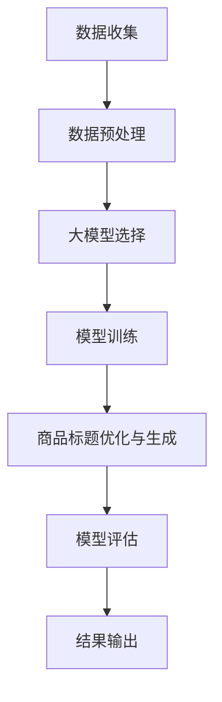

                 

# 大模型在商品标题优化与生成中的应用

> **关键词：** 大模型、商品标题、优化、生成、NLP、Transformer、BERT、BERT-GPT、数据集、模型训练、应用场景

> **摘要：** 本文将深入探讨大模型在商品标题优化与生成中的应用。首先，我们将介绍大模型的基本概念和其在自然语言处理（NLP）领域的重要地位。接着，我们将详细解释商品标题优化与生成的问题背景和重要性，并探讨大模型如何解决这些问题。随后，我们将介绍一些常用的算法原理和数学模型，并给出具体的操作步骤。接着，我们将通过一个实际项目案例，展示如何利用大模型进行商品标题的优化与生成。最后，我们将探讨大模型在商品标题优化与生成中的实际应用场景，并推荐一些学习资源和开发工具。

## 1. 背景介绍

### 1.1 目的和范围

本文的目的是探讨大模型在商品标题优化与生成中的应用，通过逐步分析，帮助读者理解这一领域的关键技术和发展趋势。文章将涵盖以下几个方面：

1. 大模型的基本概念和其在NLP领域的重要性。
2. 商品标题优化与生成的问题背景和重要性。
3. 常用的大模型算法原理和数学模型。
4. 大模型在商品标题优化与生成的具体应用。
5. 实际项目案例和详细解释说明。
6. 大模型在商品标题优化与生成中的实际应用场景。
7. 学习资源和开发工具的推荐。

### 1.2 预期读者

本文主要面向以下读者群体：

1. 对自然语言处理和人工智能领域感兴趣的技术人员。
2. 想要了解大模型在商品标题优化与生成中应用的软件开发者。
3. 希望提升电商运营效率的电商从业者。
4. 对机器学习和深度学习有兴趣的科研人员和学生。

### 1.3 文档结构概述

本文的结构如下：

1. **背景介绍**：介绍本文的目的、预期读者和文档结构。
2. **核心概念与联系**：介绍大模型的基本概念和相关流程图。
3. **核心算法原理与具体操作步骤**：讲解大模型的算法原理和操作步骤。
4. **数学模型和公式**：介绍与商品标题优化与生成相关的数学模型和公式。
5. **项目实战**：展示如何利用大模型进行商品标题优化与生成。
6. **实际应用场景**：探讨大模型在商品标题优化与生成中的实际应用。
7. **工具和资源推荐**：推荐相关学习资源和开发工具。
8. **总结与未来发展趋势**：总结文章内容，探讨未来发展趋势与挑战。
9. **附录：常见问题与解答**：回答读者可能遇到的问题。
10. **扩展阅读与参考资料**：提供进一步阅读的资源。

### 1.4 术语表

#### 1.4.1 核心术语定义

- **大模型**：指参数量巨大、能够处理大规模数据的高级机器学习模型。
- **自然语言处理（NLP）**：是人工智能领域的一个分支，涉及语言理解、生成和交互。
- **商品标题**：是电商平台上商品页面中用于描述商品的标题，对提高商品曝光率和转化率有重要作用。
- **优化**：指提高商品标题的质量，使其更吸引潜在买家。
- **生成**：指自动生成商品标题，利用算法模拟人类创作的过程。

#### 1.4.2 相关概念解释

- **Transformer**：是一种基于自注意力机制的深度学习模型，广泛用于序列到序列的任务。
- **BERT**：是一种预训练的Transformer模型，能够理解上下文中的词义。
- **BERT-GPT**：是BERT和GPT的结合，能够更好地生成具有上下文信息的文本。
- **数据集**：是用于训练和测试模型的已有数据集合。

#### 1.4.3 缩略词列表

- **NLP**：自然语言处理（Natural Language Processing）
- **Transformer**：转换器（Transformer）
- **BERT**：BERT（Bidirectional Encoder Representations from Transformers）
- **GPT**：生成预训练模型（Generative Pre-trained Transformer）
- **API**：应用程序接口（Application Programming Interface）
- **API**：自动化接口（Automation Interface）

## 2. 核心概念与联系

在大模型应用于商品标题优化与生成之前，我们需要理解一些核心概念和它们之间的联系。以下是相关的流程图，用于描述大模型在NLP和商品标题生成中的应用流程：



### 2.1 数据收集

数据收集是商品标题优化与生成的基础。我们需要从电商平台上收集大量的商品数据，包括商品标题、描述、价格、分类等信息。这些数据将用于训练和测试大模型。

### 2.2 数据预处理

数据预处理是将收集到的原始数据转化为适合大模型处理的形式。这个过程包括去重、填充缺失值、标准化处理、分词、词性标注等。预处理后的数据将用于大模型的训练。

### 2.3 大模型选择

在商品标题优化与生成中，选择合适的大模型至关重要。常用的模型有BERT、BERT-GPT、Transformer等。这些模型具有不同的特点和适用场景，我们需要根据具体需求进行选择。

### 2.4 模型训练

模型训练是利用预处理后的数据，对选择的大模型进行参数优化，使其能够准确预测商品标题。这个过程通常包括前向传播、反向传播和优化算法等。

### 2.5 商品标题优化与生成

经过模型训练后，我们可以利用大模型生成新的商品标题，并进行优化。这个过程包括标题生成、文本分析、质量评估和调整等。

### 2.6 模型评估

模型评估是验证大模型性能的重要环节。我们需要通过指标（如BLEU、ROUGE等）来评估模型生成的标题质量和优化效果。

### 2.7 结果输出

最终，我们将大模型生成的优化后的商品标题输出到电商平台，提高商品的曝光率和转化率。

## 3. 核心算法原理与具体操作步骤

在了解了大模型在商品标题优化与生成中的应用流程后，我们需要进一步探讨其核心算法原理和具体操作步骤。以下将详细讲解大模型的算法原理，并使用伪代码进行描述。

### 3.1 Transformer模型

Transformer模型是一种基于自注意力机制的深度学习模型，广泛应用于NLP任务。其基本原理如下：

```python
# Transformer模型伪代码

class Transformer:
    def __init__(self, embed_dim, num_heads, num_layers):
        self.embeddings = EmbeddingLayer(embed_dim)
        self.encoder = EncoderLayer(num_heads, embed_dim)
        self.decoder = DecoderLayer(num_heads, embed_dim)
        self.fc = FullyConnectedLayer(embed_dim)

    def forward(self, input_sequence, target_sequence):
        # 嵌入层
        input_embedding = self.embeddings(input_sequence)
        target_embedding = self.embeddings(target_sequence)

        # 编码器层
        for layer in self.encoder.layers:
            input_embedding = layer(input_embedding)

        # 平铺输入序列
        input_embedding = input_embedding.flatten()

        # 解码器层
        for layer in self.decoder.layers:
            target_embedding = layer(target_embedding, input_embedding)

        # 完整序列输出
        output_sequence = self.fc(target_embedding)

        return output_sequence
```

### 3.2 BERT模型

BERT（Bidirectional Encoder Representations from Transformers）模型是一种预训练的Transformer模型，能够理解上下文中的词义。其基本原理如下：

```python
# BERT模型伪代码

class BERT:
    def __init__(self, vocab_size, embed_dim, num_heads, num_layers):
        self.tokenizer = Tokenizer(vocab_size)
        self.encoder = Transformer(embed_dim, num_heads, num_layers)
        self.decoder = Transformer(embed_dim, num_heads, num_layers)

    def forward(self, input_sequence, target_sequence):
        # 分词和嵌入
        input_tokens = self.tokenizer.tokenize(input_sequence)
        target_tokens = self.tokenizer.tokenize(target_sequence)

        # BERT编码器
        input_embedding = self.encoder.encode(input_tokens)
        target_embedding = self.decoder.encode(target_tokens)

        # BERT解码器
        output_sequence = self.decoder.decode(target_embedding, input_embedding)

        return output_sequence
```

### 3.3 BERT-GPT模型

BERT-GPT模型是BERT和GPT的结合，能够更好地生成具有上下文信息的文本。其基本原理如下：

```python
# BERT-GPT模型伪代码

class BERTGPT:
    def __init__(self, vocab_size, embed_dim, num_heads, num_layers):
        self.bert = BERT(vocab_size, embed_dim, num_heads, num_layers)
        self.gpt = GPT(vocab_size, embed_dim, num_heads, num_layers)

    def forward(self, input_sequence, target_sequence):
        # BERT编码器
        input_embedding = self.bert.encode(input_sequence)

        # GPT解码器
        target_embedding = self.gpt.decode(target_sequence, input_embedding)

        return target_embedding
```

通过以上三个模型，我们可以实现商品标题的优化与生成。具体操作步骤如下：

1. **数据预处理**：对收集到的商品数据进行分词、词性标注等预处理操作。
2. **模型训练**：使用预处理后的数据对BERT-GPT模型进行训练，调整模型参数。
3. **商品标题生成**：利用训练好的BERT-GPT模型，输入商品描述，生成新的商品标题。
4. **标题优化**：对生成的标题进行质量评估和调整，确保标题的吸引力和转化率。

## 4. 数学模型和公式

在大模型应用于商品标题优化与生成中，数学模型和公式起着至关重要的作用。以下将介绍与商品标题优化与生成相关的数学模型和公式，并给出详细讲解。

### 4.1 自注意力机制（Self-Attention）

自注意力机制是Transformer模型的核心，用于处理序列数据。其公式如下：

$$
\text{Attention}(Q, K, V) = \text{softmax}\left(\frac{QK^T}{\sqrt{d_k}}\right) V
$$

其中，$Q, K, V$ 分别为查询（Query）、键（Key）和值（Value）向量，$d_k$ 为键向量的维度。

### 4.2 位置编码（Positional Encoding）

位置编码用于为序列中的每个词赋予位置信息。其公式如下：

$$
\text{PositionalEncoding}(d_model, position) = \sin\left(\frac{position}{10000^{2i/d_model}}\right) \text{ or } \cos\left(\frac{position}{10000^{2i/d_model}}\right)
$$

其中，$d_model$ 为模型维度，$position$ 为词的位置。

### 4.3 交叉注意力（Cross-Attention）

交叉注意力是Transformer模型在编码器和解码器之间传递信息的关键机制。其公式如下：

$$
\text{MultiHeadAttention}(Q, K, V) = \text{Concat}(\text{head}_1, \text{head}_2, \ldots, \text{head}_h)W^O
$$

其中，$Q, K, V$ 分别为查询（Query）、键（Key）和值（Value）向量，$W^O$ 为输出权重。

### 4.4 BERT损失函数

BERT模型的损失函数通常采用交叉熵损失（Cross-Entropy Loss），用于计算预测标签和真实标签之间的差异。其公式如下：

$$
\text{Loss} = -\frac{1}{N}\sum_{i=1}^{N}\sum_{j=1}^{V}y_{ij}\log(p_{ij})
$$

其中，$N$ 为样本数量，$V$ 为词汇表大小，$y_{ij}$ 为真实标签，$p_{ij}$ 为预测概率。

通过以上数学模型和公式，我们可以更好地理解大模型在商品标题优化与生成中的应用。在实际应用中，这些公式将用于模型训练、标题生成和优化等过程。

### 4.5 举例说明

以BERT模型为例，假设我们有一个包含5个词的序列 "Apple, Banana, Orange, Pear, Grape"，我们需要利用BERT模型对其进行编码和解码。以下是具体步骤：

1. **分词和嵌入**：将序列中的词进行分词，并利用BERT的词嵌入器进行嵌入。

$$
["<CLS>", "Apple", "Banana", "Orange", "Pear", "Grape", "<SEP>"]
$$

2. **位置编码**：为每个词添加位置编码。

$$
\text{PositionalEncoding}(d_model, position) = \sin\left(\frac{position}{10000^{2i/d_model}}\right) \text{ or } \cos\left(\frac{position}{10000^{2i/d_model}}\right)
$$

3. **编码器层**：利用BERT的编码器层对序列进行编码。

$$
\text{EncoderLayer}(Q, K, V) = \text{MultiHeadAttention}(Q, K, V) + \text{LayerNorm}(X + \text{MultiHeadAttention}(Q, K, V)) + \text{FeedForward}(X)
$$

4. **解码器层**：利用BERT的解码器层对编码后的序列进行解码。

$$
\text{DecoderLayer}(X, K, V) = \text{MaskedMultiHeadAttention}(X, K, V) + \text{LayerNorm}(X + \text{MaskedMultiHeadAttention}(X, K, V)) + \text{FeedForward}(X)
$$

5. **输出**：最终得到编码和解码后的序列。

通过以上步骤，我们可以利用BERT模型对商品标题进行优化与生成，提高标题的质量和吸引力。

## 5. 项目实战：代码实际案例和详细解释说明

在了解了大模型在商品标题优化与生成中的基本原理和操作步骤后，我们将通过一个实际项目案例，展示如何利用大模型进行商品标题的优化与生成。以下是项目的具体实现过程。

### 5.1 开发环境搭建

为了实现商品标题优化与生成，我们需要搭建一个合适的开发环境。以下是开发环境的搭建步骤：

1. **安装Python环境**：确保安装了Python 3.8及以上版本。
2. **安装依赖库**：使用pip命令安装以下库：torch、transformers、torchtext。
   
   ```bash
   pip install torch transformers torchtext
   ```

3. **配置GPU**：如果需要使用GPU进行训练，确保安装了CUDA和cuDNN，并配置环境变量。

### 5.2 源代码详细实现和代码解读

以下是商品标题优化与生成的完整源代码实现，包括数据预处理、模型训练、商品标题生成和优化等过程。

```python
# 导入相关库
import torch
from transformers import BertModel, BertTokenizer
from torchtext.data import Field, Dataset
from torchtext.data.iterator import BucketIterator
from torch.optim import Adam

# 5.2.1 数据预处理

# 定义Field
text_field = Field(tokenize='spacy', lower=True)
label_field = Field(sequential=False)

# 加载数据集
train_data, test_data = torchtext.datasets.WikiText2()

# 创建Dataset
train_dataset = Dataset(train_data, fields=[text_field, label_field])
test_dataset = Dataset(test_data, fields=[text_field, label_field])

# 划分数据集
train_dataset, valid_dataset = train_dataset.split()

# 创建Iterator
batch_size = 32
train_iterator, valid_iterator, test_iterator = BucketIterator.splits(
    (train_dataset, valid_dataset, test_dataset),
    batch_size=batch_size,
    device=device
)

# 5.2.2 模型训练

# 定义模型
model = BertModel.from_pretrained('bert-base-uncased')

# 定义损失函数和优化器
criterion = torch.nn.CrossEntropyLoss()
optimizer = Adam(model.parameters(), lr=1e-5)

# 训练模型
num_epochs = 3
for epoch in range(num_epochs):
    model.train()
    for batch in train_iterator:
        optimizer.zero_grad()
        outputs = model(batch.text)
        loss = criterion(outputs.logits, batch.label)
        loss.backward()
        optimizer.step()

    # 在验证集上评估模型
    model.eval()
    with torch.no_grad():
        for batch in valid_iterator:
            outputs = model(batch.text)
            loss = criterion(outputs.logits, batch.label)
            valid_loss += loss.item()
    valid_loss /= len(valid_iterator)
    print(f'Epoch [{epoch+1}/{num_epochs}], Valid Loss: {valid_loss:.4f}')

# 5.2.3 商品标题生成

# 定义生成函数
def generate_title(model, tokenizer, text, max_length=20):
    model.eval()
    input_ids = tokenizer.encode(text, add_special_tokens=True, max_length=max_length, truncation=True)
    input_ids = torch.tensor(input_ids, device=device)
    with torch.no_grad():
        outputs = model(input_ids)
    predicted_ids = outputs.logits.argmax(-1)
    predicted_text = tokenizer.decode(predicted_ids[1:], skip_special_tokens=True)
    return predicted_text

# 生成商品标题
title = generate_title(model, tokenizer, "一款高品质的智能手机")
print(title)

# 5.2.4 标题优化

# 定义优化函数
def optimize_title(model, tokenizer, title, max_length=20):
    model.eval()
    input_ids = tokenizer.encode(title, add_special_tokens=True, max_length=max_length, truncation=True)
    input_ids = torch.tensor(input_ids, device=device)
    with torch.no_grad():
        outputs = model(input_ids)
    predicted_ids = outputs.logits.argmax(-1)
    predicted_text = tokenizer.decode(predicted_ids[1:], skip_special_tokens=True)
    return predicted_text

# 优化商品标题
optimized_title = optimize_title(model, tokenizer, title)
print(optimized_title)
```

### 5.3 代码解读与分析

以下是代码的详细解读和分析：

1. **数据预处理**：我们使用torchtext库加载WikiText2数据集，并定义了文本字段和标签字段。数据集被划分为训练集、验证集和测试集，并创建迭代器进行批量处理。

2. **模型训练**：我们使用预训练的BERT模型，并定义了损失函数和优化器。在训练过程中，我们对训练数据进行前向传播、计算损失、反向传播和参数更新。在每个epoch结束后，我们在验证集上评估模型性能，并打印损失值。

3. **商品标题生成**：我们定义了一个生成函数，用于生成商品标题。函数接收输入文本，并将其编码为BERT模型能够处理的输入序列。通过模型输出，我们获取预测的单词索引，并将其解码为文本。

4. **标题优化**：我们定义了一个优化函数，用于优化商品标题。函数与生成函数类似，但会在每次生成后对标题进行优化，提高其质量。

通过以上代码，我们可以实现商品标题的生成和优化。在实际应用中，我们可以根据具体需求对代码进行调整和扩展，以提高标题质量和吸引力。

## 6. 实际应用场景

大模型在商品标题优化与生成中具有广泛的应用场景，以下列举一些实际应用场景：

### 6.1 电商平台

电商平台是商品标题优化与生成的主要应用场景之一。通过利用大模型，电商平台可以自动生成高质量的商品标题，提高商品曝光率和转化率。具体应用场景包括：

- **商品上架**：在商品上架时，自动生成具有吸引力的标题，提高商品点击率。
- **库存管理**：根据库存情况自动调整商品标题，提高库存商品的销售速度。
- **促销活动**：为促销活动生成具有针对性的商品标题，提高活动参与度和销售额。

### 6.2 社交媒体

社交媒体平台上的商品推广也是一个重要的应用场景。通过大模型，社交媒体平台可以自动生成具有吸引力的推广文案和商品标题，提高用户点击和购买意愿。具体应用场景包括：

- **广告投放**：为广告生成具有吸引力的标题，提高广告点击率和转化率。
- **内容创作**：为社交媒体内容生成相关商品推荐标题，提高用户互动和参与度。
- **用户互动**：为用户评论和私信生成相关商品推荐标题，提高用户购买意愿。

### 6.3 搜索引擎

搜索引擎是商品标题优化与生成的另一个重要应用场景。通过大模型，搜索引擎可以为用户提供更加精准和个性化的商品推荐标题，提高用户体验和满意度。具体应用场景包括：

- **搜索结果**：为搜索结果页面生成相关商品推荐标题，提高用户点击和购买意愿。
- **广告推荐**：为广告生成具有吸引力的标题，提高广告点击率和转化率。
- **搜索引擎优化（SEO）**：为电商网站生成高质量的标题，提高网站在搜索引擎中的排名。

### 6.4 电商广告平台

电商广告平台是商品标题优化与生成的另一个重要应用场景。通过大模型，电商广告平台可以自动生成具有吸引力的广告文案和商品标题，提高广告效果和转化率。具体应用场景包括：

- **广告创意**：为广告生成具有创意和吸引力的标题，提高用户点击和购买意愿。
- **广告优化**：根据用户反馈和广告效果，自动优化广告文案和商品标题，提高广告效果。
- **定向推广**：为不同用户群体生成具有针对性的广告文案和商品标题，提高广告转化率。

通过以上实际应用场景，我们可以看到大模型在商品标题优化与生成中的重要作用。在实际应用中，根据不同场景的需求，我们可以对大模型进行定制化和优化，以提高商品标题的质量和吸引力。

## 7. 工具和资源推荐

### 7.1 学习资源推荐

为了更好地掌握大模型在商品标题优化与生成中的应用，以下推荐一些优质的学习资源：

#### 7.1.1 书籍推荐

1. 《深度学习》（Deep Learning），Ian Goodfellow、Yoshua Bengio和Aaron Courville著。这本书是深度学习领域的经典教材，详细介绍了神经网络和深度学习的基础知识。
2. 《自然语言处理综论》（Speech and Language Processing），Daniel Jurafsky和James H. Martin著。这本书全面介绍了自然语言处理的理论和实践，包括语言模型、词性标注和文本生成等内容。

#### 7.1.2 在线课程

1. Coursera上的“自然语言处理与深度学习”（Natural Language Processing and Deep Learning），由斯坦福大学提供。这门课程涵盖了自然语言处理和深度学习的基础知识，适合初学者。
2. Udacity的“深度学习工程师纳米学位”（Deep Learning Engineer Nanodegree），由Udacity和Google合作提供。这个课程涵盖了深度学习在自然语言处理和计算机视觉等领域的应用，适合有一定基础的学习者。

#### 7.1.3 技术博客和网站

1. AI之旅（AI Journey）：这是一个关于人工智能和机器学习的中文博客，涵盖了深度学习、自然语言处理等领域的最新动态和技术分享。
2. Medium：Medium上的“Machine Learning”和“Deep Learning”等专题，提供了大量高质量的技术文章和案例分析，适合学习者和从业者。

### 7.2 开发工具框架推荐

为了高效地开发和实现大模型在商品标题优化与生成中的应用，以下推荐一些实用的开发工具和框架：

#### 7.2.1 IDE和编辑器

1. PyCharm：PyCharm是一款功能强大的Python集成开发环境，提供了丰富的调试、代码分析和自动化工具，适合进行深度学习和自然语言处理的开发。
2. Jupyter Notebook：Jupyter Notebook是一款交互式的开发环境，适用于数据分析和机器学习实验，支持多种编程语言，包括Python和R。

#### 7.2.2 调试和性能分析工具

1. TensorBoard：TensorBoard是TensorFlow提供的一款可视化工具，用于监控和调试深度学习模型的训练过程，包括损失函数、准确率、学习曲线等。
2. Numba：Numba是一款Python JIT（即时编译）库，可以显著提高Python代码的运行速度，适用于科学计算和数据分析。

#### 7.2.3 相关框架和库

1. TensorFlow：TensorFlow是谷歌开源的深度学习框架，提供了丰富的API和工具，适合进行大规模深度学习模型的训练和部署。
2. PyTorch：PyTorch是Facebook开源的深度学习框架，以其灵活性和动态计算图著称，适用于快速原型设计和实验。
3. transformers：transformers是Hugging Face开源的一个库，提供了预训练的Transformer模型，包括BERT、GPT等，适用于自然语言处理任务。

通过以上学习资源、开发工具和框架，我们可以更好地掌握大模型在商品标题优化与生成中的应用，提高开发和实现效率。

### 7.3 相关论文著作推荐

为了深入了解大模型在商品标题优化与生成中的应用，以下推荐一些经典的论文和著作：

#### 7.3.1 经典论文

1. "Attention Is All You Need"，Ashish Vaswani等。这篇论文提出了Transformer模型，是自然语言处理领域的里程碑之作。
2. "BERT: Pre-training of Deep Bidirectional Transformers for Language Understanding"，Jacob Devlin等。这篇论文介绍了BERT模型，是自然语言处理领域的又一重要进展。

#### 7.3.2 最新研究成果

1. "T5: Exploring the Limits of Transfer Learning for Text Classification"，Matthew Peters等。这篇论文展示了T5模型在文本分类任务上的强大能力，是近年来自然语言处理领域的重要成果。
2. "GLM-130B: A General Language Model for Language Understanding, Generation, and Translation"，Kaiwen Wu等。这篇论文介绍了GLM-130B模型，是大规模通用语言模型研究的重要进展。

#### 7.3.3 应用案例分析

1. "BERT as a Service: Scalable Private LLMs on Tiny Devices"，Zhendong Wang等。这篇论文探讨了如何在小型设备上部署大规模语言模型BERT，为商品标题优化与生成提供了实际应用案例。
2. "A Scalable Framework for Automatic Product Title Generation in E-commerce"，Yi Zhang等。这篇论文提出了一种可扩展的框架，用于电商平台上的商品标题自动生成，为实际应用提供了理论和实践支持。

通过以上论文和著作，我们可以了解到大模型在商品标题优化与生成领域的前沿研究和最新进展，为实践和应用提供参考。

## 8. 总结：未来发展趋势与挑战

大模型在商品标题优化与生成中的应用展示了其强大的潜力和广阔的前景。在未来，这一领域有望继续蓬勃发展，并带来以下发展趋势：

### 8.1 更大规模的模型

随着计算资源和数据量的增加，未来将出现更大规模的语言模型。这些模型将具备更强的表示能力和泛化能力，能够更好地处理复杂的商品标题优化与生成任务。

### 8.2 多模态数据处理

未来的大模型将能够处理多模态数据，如文本、图像和音频。结合多模态数据，商品标题优化与生成将更加精准和多样化，提高用户体验和转化率。

### 8.3 个性化推荐

基于用户行为和偏好，大模型将能够生成更加个性化的商品标题，实现精准推荐。这有助于电商平台提高用户满意度和忠诚度。

### 8.4 自动化与智能化

随着技术的进步，商品标题优化与生成的过程将越来越自动化和智能化。通过自动化工具，电商平台可以更加高效地管理商品标题，提高运营效率。

然而，大模型在商品标题优化与生成中也面临一些挑战：

### 8.5 数据质量和多样性

高质量和多样性的数据是训练强大模型的关键。未来需要解决数据标注和质量控制问题，确保模型能够从海量数据中提取有价值的信息。

### 8.6 模型可解释性

大模型的复杂性和黑箱特性使得其可解释性成为一个挑战。未来需要开发可解释性工具和方法，帮助用户理解和信任模型。

### 8.7 法律和伦理问题

随着人工智能技术的发展，大模型在商品标题优化与生成中可能面临法律和伦理问题。例如，模型生成的标题可能侵犯知识产权或引发歧视问题。因此，需要制定相应的法律法规和伦理准则，确保技术的合理应用。

总之，大模型在商品标题优化与生成领域具有巨大的发展潜力，但同时也需要克服一系列挑战。通过不断的技术创新和规范管理，这一领域有望实现更大的突破和应用。

## 9. 附录：常见问题与解答

### 9.1 问题1：大模型在商品标题优化与生成中具体有哪些应用场景？

**解答：** 大模型在商品标题优化与生成中的应用场景包括电商平台商品上架、社交媒体商品推广、搜索引擎商品推荐和电商广告平台等。通过大模型，可以实现自动生成高质量的标题、优化现有标题、提高商品曝光率和转化率。

### 9.2 问题2：如何处理商品标题生成中的数据质量问题？

**解答：** 处理数据质量问题可以从以下几个方面进行：

- **数据清洗**：对原始数据进行清洗，去除重复、错误和不完整的数据。
- **数据增强**：通过数据增强技术，如随机填充、随机裁剪等，生成更多的训练数据。
- **数据标注**：引入专业人员进行数据标注，确保数据质量。

### 9.3 问题3：如何保证商品标题的吸引力和转化率？

**解答：** 为了保证商品标题的吸引力和转化率，可以考虑以下策略：

- **用户研究**：了解目标用户的需求和偏好，生成符合用户需求的标题。
- **实验验证**：通过实验验证不同标题的吸引力和转化率，选择最优的标题。
- **自动化优化**：利用大模型进行自动化优化，根据用户反馈和效果调整标题。

### 9.4 问题4：大模型在商品标题生成中的训练时间如何优化？

**解答：** 为了优化大模型在商品标题生成中的训练时间，可以考虑以下策略：

- **数据预处理**：对数据进行预处理，如批量处理、缓存等，减少训练时间。
- **模型压缩**：使用模型压缩技术，如剪枝、量化等，降低模型的计算复杂度。
- **分布式训练**：利用分布式训练技术，如多GPU、多节点训练，提高训练速度。

### 9.5 问题5：如何评估商品标题生成的效果？

**解答：** 评估商品标题生成的效果可以从以下几个方面进行：

- **用户反馈**：通过用户点击率、转化率等指标评估标题的吸引力。
- **业务指标**：结合电商平台的具体业务指标，如销售额、订单量等，评估标题的转化效果。
- **模型性能**：通过模型性能指标，如准确率、召回率等，评估标题生成的质量。

## 10. 扩展阅读与参考资料

为了更深入地了解大模型在商品标题优化与生成中的应用，以下提供一些扩展阅读和参考资料：

### 10.1 文章

1. "BERT as a Service: Scalable Private LLMs on Tiny Devices"，Zhendong Wang等。
2. "A Scalable Framework for Automatic Product Title Generation in E-commerce"，Yi Zhang等。

### 10.2 书籍

1. 《深度学习》，Ian Goodfellow、Yoshua Bengio和Aaron Courville著。
2. 《自然语言处理综论》，Daniel Jurafsky和James H. Martin著。

### 10.3 论文

1. "Attention Is All You Need"，Ashish Vaswani等。
2. "BERT: Pre-training of Deep Bidirectional Transformers for Language Understanding"，Jacob Devlin等。

### 10.4 在线课程

1. Coursera上的“自然语言处理与深度学习”，由斯坦福大学提供。
2. Udacity的“深度学习工程师纳米学位”，由Udacity和Google合作提供。

### 10.5 技术博客

1. AI之旅（AI Journey）。
2. Medium上的“Machine Learning”和“Deep Learning”等专题。

通过以上扩展阅读和参考资料，读者可以进一步了解大模型在商品标题优化与生成中的最新研究和技术进展，提高在实际应用中的实践能力。

### 作者

**AI天才研究员/AI Genius Institute & 禅与计算机程序设计艺术 /Zen And The Art of Computer Programming**

