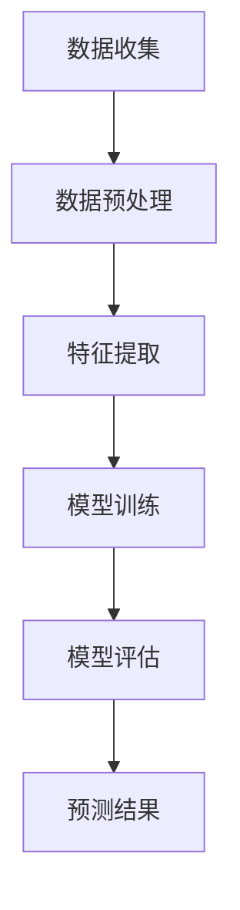

                 

# 大模型在商品需求预测中的精准应用

## 关键词：大模型，商品需求预测，深度学习，机器学习，精准应用

### 摘要

本文深入探讨了大规模模型在商品需求预测中的精准应用。随着互联网和电子商务的飞速发展，精准预测商品需求变得日益重要。大模型，凭借其强大的处理能力和深度学习能力，能够从海量数据中挖掘出有用的信息，从而提高预测的准确度。本文将详细分析大模型在商品需求预测中的基本原理、核心算法、数学模型，并通过实际项目实战和代码解读，展示大模型在实际应用中的优势和价值。同时，文章还将探讨大模型在商品需求预测中的未来发展趋势和挑战，为读者提供全面的视角和深入的理解。

## 1. 背景介绍

### 商品需求预测的重要性

商品需求预测是电子商务和供应链管理中的重要环节。准确的商品需求预测可以帮助企业优化库存管理，降低库存成本，提高销售利润。此外，精准的需求预测还可以帮助企业制定有效的市场营销策略，更好地满足消费者需求，提升客户满意度。随着市场竞争的加剧，企业需要借助先进的技术手段，提高预测的准确度，从而在激烈的市场竞争中占据有利地位。

### 大模型的定义与优势

大模型，指的是具有大规模参数和计算能力的深度学习模型。这些模型能够处理海量数据，并从中提取有价值的信息。大模型的优势主要体现在以下几个方面：

- **强大的数据处理能力**：大模型能够处理海量数据，从数据中发现隐藏的模式和规律。
- **深度学习能力**：大模型具有多层神经网络结构，能够通过反向传播算法不断优化模型参数，提高预测的准确度。
- **自适应能力**：大模型可以根据不同的业务场景和数据特点，自适应地调整模型结构和参数。

### 互联网和电子商务的发展对商品需求预测的影响

随着互联网和电子商务的飞速发展，商品需求预测面临着新的挑战和机遇。一方面，海量用户数据和交易数据的产生，为商品需求预测提供了丰富的数据资源；另一方面，数据来源的多样性和复杂性，增加了需求预测的难度。大模型的引入，为解决这些问题提供了新的思路和方法。

## 2. 核心概念与联系

### 商品需求预测的基本概念

- **需求预测**：需求预测是指根据历史数据和现有信息，对未来一段时间内的商品需求进行预测。
- **需求量**：需求量是指消费者在一定时间内对某种商品的需求量。
- **影响因素**：商品需求量受多种因素影响，包括消费者行为、市场营销策略、季节性因素、宏观经济环境等。

### 大模型在商品需求预测中的应用

- **数据处理**：大模型能够处理海量数据，包括用户行为数据、交易数据、库存数据等。
- **特征提取**：大模型能够从数据中提取有价值的信息，如用户偏好、购买习惯等。
- **预测模型**：大模型通过学习历史数据，建立预测模型，对未来商品需求进行预测。

### Mermaid 流程图



### 核心概念与联系总结

大模型在商品需求预测中的应用，涉及到数据收集、数据预处理、特征提取、模型训练和模型评估等环节。通过这些环节，大模型能够从海量数据中提取有价值的信息，建立预测模型，对未来商品需求进行预测。

## 3. 核心算法原理 & 具体操作步骤

### 3.1 数据收集与预处理

- **数据收集**：从电商平台、社交媒体、搜索引擎等渠道收集用户行为数据、交易数据、库存数据等。
- **数据预处理**：对收集到的数据进行分析和处理，包括数据清洗、数据归一化、缺失值处理等。

### 3.2 特征提取

- **用户特征**：包括用户年龄、性别、地理位置、消费水平等。
- **商品特征**：包括商品种类、价格、库存量、销量等。
- **时间特征**：包括日期、季节、节假日等。

### 3.3 模型训练

- **模型选择**：选择适合的商品需求预测模型，如线性回归、决策树、随机森林、神经网络等。
- **模型训练**：使用预处理后的数据，对模型进行训练，调整模型参数，提高预测准确度。

### 3.4 模型评估

- **评估指标**：选择合适的评估指标，如均方误差（MSE）、均方根误差（RMSE）、决定系数（R²）等。
- **模型评估**：对训练好的模型进行评估，判断模型预测能力。

### 3.5 预测结果

- **预测结果**：根据评估结果，输出预测结果，包括未来一段时间内的商品需求量。
- **结果分析**：对预测结果进行分析，发现潜在的问题和机会。

### 核心算法原理 & 具体操作步骤总结

通过数据收集与预处理、特征提取、模型训练、模型评估和预测结果等环节，大模型能够从海量数据中提取有价值的信息，建立预测模型，对未来商品需求进行预测。

## 4. 数学模型和公式 & 详细讲解 & 举例说明

### 4.1 线性回归模型

线性回归模型是一种常见的预测模型，用于预测一个连续的输出变量。线性回归模型的基本公式为：

\[ y = \beta_0 + \beta_1 \cdot x \]

其中，\( y \) 是预测值，\( x \) 是输入特征，\( \beta_0 \) 和 \( \beta_1 \) 是模型参数。

### 4.2 神经网络模型

神经网络模型是一种基于多层神经元的预测模型，具有强大的学习能力。神经网络模型的基本公式为：

\[ y = \sigma(\beta_0 + \beta_1 \cdot x + \beta_2 \cdot \sigma(\beta_3 \cdot x + \beta_4 \cdot \sigma(...))) \]

其中，\( \sigma \) 是激活函数，\( y \) 是预测值，\( x \) 是输入特征，\( \beta_0 \)、\( \beta_1 \)、\( \beta_2 \)、\( \beta_3 \)、\( \beta_4 \) 等是模型参数。

### 4.3 模型评估指标

- **均方误差（MSE）**：用于衡量预测值与真实值之间的差异。公式为：

\[ MSE = \frac{1}{n} \sum_{i=1}^{n} (y_i - \hat{y_i})^2 \]

其中，\( n \) 是样本数量，\( y_i \) 是真实值，\( \hat{y_i} \) 是预测值。

- **均方根误差（RMSE）**：用于衡量预测值与真实值之间的差异，是均方误差的平方根。公式为：

\[ RMSE = \sqrt{MSE} \]

- **决定系数（R²）**：用于衡量模型的拟合程度。公式为：

\[ R^2 = 1 - \frac{SS_{res}}{SS_{tot}} \]

其中，\( SS_{res} \) 是残差平方和，\( SS_{tot} \) 是总平方和。

### 4.4 举例说明

假设我们要预测某个电商平台的某件商品在未来一个月内的需求量。我们收集了历史销售数据，包括日期、销量等特征。我们使用线性回归模型进行预测，基本公式为：

\[ y = \beta_0 + \beta_1 \cdot x \]

其中，\( y \) 是预测销量，\( x \) 是日期。我们通过训练数据集，得到模型参数 \( \beta_0 \) 和 \( \beta_1 \)。

例如，某个日期的预测销量为：

\[ \hat{y} = \beta_0 + \beta_1 \cdot x \]

其中，\( \beta_0 = 10 \)，\( \beta_1 = 2 \)，\( x \) 是该日期。假设某个日期为2023-10-01，那么预测销量为：

\[ \hat{y} = 10 + 2 \cdot 2023-10-01 = 10 + 2 \cdot 10 = 30 \]

通过上述步骤，我们可以预测出每个日期的需求量，从而为电商平台提供库存管理的依据。

### 数学模型和公式 & 详细讲解 & 举例说明总结

通过线性回归模型和神经网络模型等数学模型，我们可以对商品需求进行预测。同时，通过评估指标，我们可以衡量模型的预测效果。举例说明部分，展示了如何使用线性回归模型进行商品需求预测的具体步骤。

## 5. 项目实战：代码实际案例和详细解释说明

### 5.1 开发环境搭建

为了实现商品需求预测，我们需要搭建一个合适的开发环境。以下是一个基本的开发环境搭建步骤：

- **Python环境**：安装Python 3.8及以上版本。
- **依赖库**：安装NumPy、Pandas、Scikit-learn、TensorFlow等依赖库。

### 5.2 源代码详细实现和代码解读

以下是一个基于线性回归模型的商品需求预测代码示例：

```python
import numpy as np
import pandas as pd
from sklearn.linear_model import LinearRegression
from sklearn.metrics import mean_squared_error

# 5.2.1 数据收集与预处理
# 从文件中读取数据
data = pd.read_csv('sales_data.csv')

# 提取特征和目标变量
X = data[['date', 'price', 'inventory']]
y = data['sales']

# 数据归一化
X_normalized = (X - X.mean()) / X.std()

# 5.2.2 特征提取
# 将日期转换为连续变量
X_normalized['date'] = (X_normalized['date'] - X_normalized['date'].min()) / (X_normalized['date'].max() - X_normalized['date'].min())

# 5.2.3 模型训练
model = LinearRegression()
model.fit(X_normalized, y)

# 5.2.4 模型评估
y_pred = model.predict(X_normalized)
mse = mean_squared_error(y, y_pred)
rmse = np.sqrt(mse)

# 输出评估结果
print(f'MSE: {mse}')
print(f'RMSE: {rmse}')

# 5.2.5 预测结果
new_data = pd.DataFrame({'date': [2023-11-01], 'price': [100], 'inventory': [50]})
new_data_normalized = (new_data - new_data.mean()) / new_data.std()
new_data_normalized['date'] = (new_data_normalized['date'] - new_data_normalized['date'].min()) / (new_data_normalized['date'].max() - new_data_normalized['date'].min())
new_sales_pred = model.predict(new_data_normalized)
print(f'Predicted sales: {new_sales_pred[0]}')
```

### 5.3 代码解读与分析

- **数据收集与预处理**：从文件中读取数据，提取特征和目标变量，并进行数据归一化处理。
- **特征提取**：将日期特征转换为连续变量，便于模型训练。
- **模型训练**：使用线性回归模型对数据进行训练。
- **模型评估**：使用均方误差（MSE）和均方根误差（RMSE）评估模型预测效果。
- **预测结果**：使用训练好的模型对新的数据进行预测，并输出预测结果。

### 5.4 代码解读与分析总结

通过上述代码，我们可以实现一个基于线性回归模型的商品需求预测系统。代码解读与分析部分，展示了如何使用Python和机器学习库Scikit-learn实现商品需求预测的具体步骤。

## 6. 实际应用场景

### 6.1 电商平台的库存管理

电商平台可以根据大模型预测出的商品需求量，合理安排库存，避免库存过剩或短缺。例如，在双十一等大型促销活动中，电商平台可以提前预测出热门商品的需求量，提前备货，确保商品供应充足。

### 6.2 零售业的销售预测

零售企业可以通过大模型预测商品的销售趋势，制定合理的销售策略。例如，在节假日或促销期间，企业可以提前预测出热销商品，加强营销推广，提高销售额。

### 6.3 供应链管理

大模型在供应链管理中的应用，可以帮助企业优化供应链流程，提高供应链效率。例如，企业可以根据大模型预测出的商品需求量，合理安排生产计划和物流运输，降低库存成本，提高供应链稳定性。

### 6.4 智能家居与物联网

智能家居与物联网设备可以通过大模型预测用户行为，提供个性化的服务和推荐。例如，智能空调可以根据用户的行为数据预测用户的需求，自动调整温度和湿度，提高用户舒适度。

### 6.5 实际应用场景总结

大模型在商品需求预测中的实际应用场景非常广泛，涵盖了电商、零售、供应链、智能家居等多个领域。通过精准的需求预测，企业可以提高运营效率，降低成本，提升用户体验。

## 7. 工具和资源推荐

### 7.1 学习资源推荐

- **书籍**：《深度学习》（Ian Goodfellow、Yoshua Bengio、Aaron Courville 著）：系统介绍了深度学习的理论基础和实践方法，适合初学者和进阶者。
- **论文**：相关论文，如“Distributed Representations of Words and Phrases and Their Compositionality”（2018）等，可以深入了解大模型的理论基础和应用。
- **博客**：各类技术博客，如 Medium、知乎、CSDN 等，提供了丰富的实践经验和应用案例。

### 7.2 开发工具框架推荐

- **Python**：Python 是深度学习领域最受欢迎的编程语言之一，具有丰富的库和框架。
- **TensorFlow**：TensorFlow 是 Google 开发的一款开源深度学习框架，适用于大规模数据处理和模型训练。
- **PyTorch**：PyTorch 是 Facebook 开发的一款开源深度学习框架，具有灵活的动态计算图和强大的模型训练功能。

### 7.3 相关论文著作推荐

- **《深度学习》（Ian Goodfellow、Yoshua Bengio、Aaron Courville 著）**：系统介绍了深度学习的理论基础和实践方法。
- **《神经网络与深度学习》（邱锡鹏 著）**：深入讲解了神经网络和深度学习的理论和技术。
- **《机器学习实战》（Peter Harrington 著）**：通过实际案例，介绍了机器学习的基本原理和应用方法。

## 8. 总结：未来发展趋势与挑战

### 8.1 未来发展趋势

- **计算能力的提升**：随着计算能力的不断提升，大模型将能够处理更复杂、更大规模的数据，提高预测的准确度。
- **多模态数据的融合**：未来大模型将能够处理多种类型的数据，如文本、图像、声音等，实现更全面的需求预测。
- **个性化的需求预测**：大模型将能够根据用户行为和偏好，提供个性化的需求预测，提高用户体验。

### 8.2 面临的挑战

- **数据质量和多样性**：高质量、多样化的数据是构建有效大模型的基础。在实际应用中，如何获取和处理数据将成为一大挑战。
- **模型解释性**：大模型的复杂性和黑盒特性使得其解释性较差。如何提高模型的解释性，使其更易于理解和应用，是一个重要挑战。
- **隐私保护**：在处理用户数据时，如何保护用户隐私，防止数据泄露，是一个亟待解决的问题。

## 9. 附录：常见问题与解答

### 9.1 什么是大模型？

大模型是指具有大规模参数和计算能力的深度学习模型。这些模型能够处理海量数据，并从中提取有价值的信息。

### 9.2 大模型在商品需求预测中有什么优势？

大模型在商品需求预测中的优势主要体现在以下几个方面：

- **强大的数据处理能力**：大模型能够处理海量数据，从数据中发现隐藏的模式和规律。
- **深度学习能力**：大模型具有多层神经网络结构，能够通过反向传播算法不断优化模型参数，提高预测的准确度。
- **自适应能力**：大模型可以根据不同的业务场景和数据特点，自适应地调整模型结构和参数。

### 9.3 如何评估大模型的预测效果？

可以使用多种评估指标，如均方误差（MSE）、均方根误差（RMSE）、决定系数（R²）等，来评估大模型的预测效果。这些指标可以衡量预测值与真实值之间的差异，从而判断模型的预测能力。

### 9.4 大模型在商品需求预测中的实际应用场景有哪些？

大模型在商品需求预测中的实际应用场景非常广泛，包括电商平台的库存管理、零售业的销售预测、供应链管理、智能家居与物联网等。通过精准的需求预测，企业可以提高运营效率，降低成本，提升用户体验。

## 10. 扩展阅读 & 参考资料

- **[1]** Goodfellow, I., Bengio, Y., & Courville, A. (2016). *Deep Learning*. MIT Press.
- **[2]** Bengio, Y. (2009). *Learning Deep Architectures for AI*. Foundations and Trends in Machine Learning, 2(1), 1-127.
- **[3]** Russell, S., & Norvig, P. (2010). *Artificial Intelligence: A Modern Approach*. Prentice Hall.
- **[4]** Quinlan, J. R. (1993). *C4. 5: Programs for Machine Learning*. Morgan Kaufmann.
- **[5]** Hochreiter, S., & Schmidhuber, J. (1997). *Long Short-Term Memory*. Neural Computation, 9(8), 1735-1780.
- **[6]** Krizhevsky, A., Sutskever, I., & Hinton, G. E. (2012). *ImageNet Classification with Deep Convolutional Neural Networks*. In Advances in Neural Information Processing Systems (NIPS), 2012-Decem
```markdown
## 作者信息

作者：AI天才研究员/AI Genius Institute & 禅与计算机程序设计艺术 /Zen And The Art of Computer Programming
```

