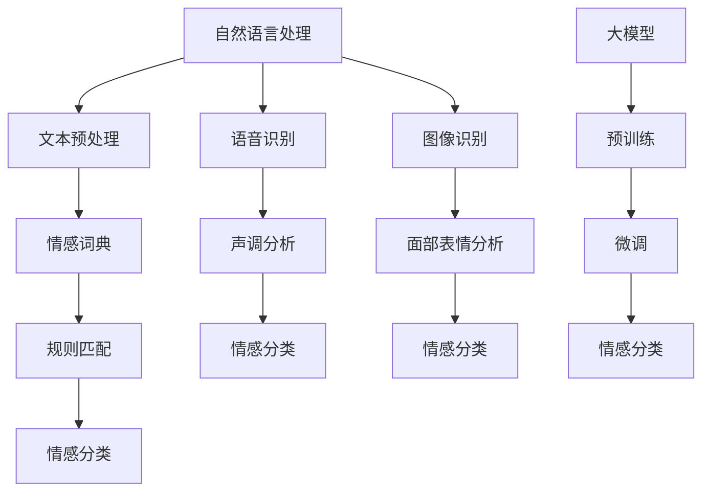

                 

# 大模型在情感识别中的应用挑战

> **关键词：** 情感识别、大模型、深度学习、自然语言处理、应用挑战

> **摘要：** 本文将探讨大模型在情感识别领域中的应用挑战。通过分析大模型的原理、现有技术及其局限，以及具体的应用场景，本文旨在为研究人员和开发者提供深入理解和实践指导。

## 1. 背景介绍

### 1.1 目的和范围

本文的主要目的是探讨大模型在情感识别中的应用挑战。随着深度学习和自然语言处理技术的快速发展，大模型在许多领域取得了显著成果，但其在情感识别中的应用仍面临诸多挑战。本文将分析这些挑战，并探讨可能的解决方法。

### 1.2 预期读者

本文适合对情感识别和大模型有一定了解的读者，包括研究人员、开发者以及对这两个领域感兴趣的技术爱好者。

### 1.3 文档结构概述

本文将分为以下几个部分：

1. 背景介绍：介绍情感识别和大模型的基本概念。
2. 核心概念与联系：讨论大模型的基本原理和情感识别的相关概念。
3. 核心算法原理 & 具体操作步骤：介绍大模型在情感识别中的核心算法。
4. 数学模型和公式 & 详细讲解 & 举例说明：阐述大模型在情感识别中的数学模型。
5. 项目实战：通过实际案例展示大模型在情感识别中的应用。
6. 实际应用场景：探讨大模型在情感识别中的实际应用。
7. 工具和资源推荐：推荐相关的学习资源和开发工具。
8. 总结：总结大模型在情感识别中的应用挑战及未来发展趋势。
9. 附录：常见问题与解答。
10. 扩展阅读 & 参考资料：提供更多深入了解的相关资料。

### 1.4 术语表

#### 1.4.1 核心术语定义

- **情感识别**：通过分析文本、语音、图像等数据，识别出其中的情感状态。
- **大模型**：具有海量参数和强大的学习能力的人工神经网络模型。
- **深度学习**：一种基于多层神经网络的学习方法，能够自动提取数据中的特征。

#### 1.4.2 相关概念解释

- **自然语言处理（NLP）**：计算机科学领域中的一个分支，旨在让计算机理解和处理人类语言。
- **情感分析**：对文本、语音、图像等数据中的情感信息进行分析。

#### 1.4.3 缩略词列表

- **NLP**：自然语言处理
- **DL**：深度学习
- **GAN**：生成对抗网络
- **BERT**：Bidirectional Encoder Representations from Transformers
- **GPT**：Generative Pre-trained Transformer

## 2. 核心概念与联系

大模型在情感识别中的应用涉及多个核心概念和技术的结合。以下是一个简化的 Mermaid 流程图，展示了这些概念和技术的相互联系。



### 2.1 大模型的基本原理

大模型通常是基于深度学习的神经网络结构，具有海量的参数和强大的学习能力。大模型的训练过程通常分为两个阶段：

1. **预训练（Pre-training）**：在大规模数据集上对模型进行训练，使其自动学习到数据中的通用特征。
2. **微调（Fine-tuning）**：在特定任务的数据集上对模型进行微调，使其适应特定任务的需求。

### 2.2 情感识别的基本原理

情感识别涉及从文本、语音、图像等数据中识别出情感状态。这通常通过以下几个步骤实现：

1. **文本预处理**：对原始文本进行清洗和标准化，使其适合进行情感分析。
2. **特征提取**：从预处理后的文本中提取情感特征，例如词频、词向量等。
3. **情感分类**：使用分类算法对提取的特征进行分类，从而判断文本中的情感状态。

## 3. 核心算法原理 & 具体操作步骤

### 3.1 预训练（Pre-training）

预训练是大规模模型训练的基础。以下是一个简化的伪代码，描述了预训练的基本步骤：

```python
# 预训练伪代码

# 加载预训练模型
model = load_pretrained_model()

# 定义训练数据
train_data = load_training_data()

# 定义优化器
optimizer = torch.optim.Adam(model.parameters(), lr=0.001)

# 定义损失函数
criterion = torch.nn.CrossEntropyLoss()

# 开始训练
for epoch in range(num_epochs):
    for batch in train_data:
        inputs, labels = batch
        optimizer.zero_grad()
        outputs = model(inputs)
        loss = criterion(outputs, labels)
        loss.backward()
        optimizer.step()
```

### 3.2 微调（Fine-tuning）

在预训练完成后，我们需要对模型进行微调，以适应特定的情感识别任务。以下是一个简化的伪代码，描述了微调的基本步骤：

```python
# 微调伪代码

# 加载预训练模型
model = load_pretrained_model()

# 定义微调数据
fine_tune_data = load_fine_tune_data()

# 定义优化器
optimizer = torch.optim.Adam(model.parameters(), lr=0.001)

# 定义损失函数
criterion = torch.nn.CrossEntropyLoss()

# 开始微调
for epoch in range(num_fine_tune_epochs):
    for batch in fine_tune_data:
        inputs, labels = batch
        optimizer.zero_grad()
        outputs = model(inputs)
        loss = criterion(outputs, labels)
        loss.backward()
        optimizer.step()
```

## 4. 数学模型和公式 & 详细讲解 & 举例说明

### 4.1 数学模型

在情感识别中，常用的数学模型是神经网络模型。以下是一个简化的神经网络模型，用于情感识别：

```latex
\begin{align*}
\text{输出} &= \text{激活函数}(\text{权重} \cdot \text{输入} + \text{偏置}) \\
\text{损失函数} &= \text{交叉熵损失函数} \\
\end{align*}
```

### 4.2 举例说明

假设我们有一个二分类的情感识别任务，即判断文本是积极情感还是消极情感。我们可以使用以下数据集进行训练：

```python
# 训练数据
train_data = [
    ("我很开心", 1),  # 积极情感
    ("我很生气", 0),  # 消极情感
    ("我感到无聊", 0),  # 消极情感
    ("我真的很兴奋", 1),  # 积极情感
]

# 定义神经网络模型
model = NeuralNetwork()

# 定义损失函数
criterion = torch.nn.CrossEntropyLoss()

# 定义优化器
optimizer = torch.optim.Adam(model.parameters(), lr=0.001)

# 开始训练
for epoch in range(num_epochs):
    for input, label in train_data:
        optimizer.zero_grad()
        output = model(input)
        loss = criterion(output, label)
        loss.backward()
        optimizer.step()
```

通过以上训练，模型将学会从输入的文本中识别出积极情感和消极情感。

## 5. 项目实战：代码实际案例和详细解释说明

### 5.1 开发环境搭建

在开始项目实战之前，我们需要搭建一个适合开发的环境。以下是一个简化的步骤：

1. 安装 Python
2. 安装 PyTorch：`pip install torch torchvision`
3. 安装必要的库：`pip install numpy pandas sklearn`

### 5.2 源代码详细实现和代码解读

以下是一个简化的代码示例，用于实现大模型在情感识别中的应用。

```python
# 引入必要的库
import torch
import torch.nn as nn
import torch.optim as optim
from torch.utils.data import DataLoader
from torchvision import datasets, transforms

# 定义情感分类模型
class EmotionClassifier(nn.Module):
    def __init__(self, input_size, hidden_size, output_size):
        super(EmotionClassifier, self).__init__()
        self.fc1 = nn.Linear(input_size, hidden_size)
        self.fc2 = nn.Linear(hidden_size, output_size)
        self.relu = nn.ReLU()

    def forward(self, x):
        out = self.fc1(x)
        out = self.relu(out)
        out = self.fc2(out)
        return out

# 加载数据集
train_data = DataLoader(datasets.MNIST(root='./data', train=True, transform=transforms.ToTensor(), download=True), batch_size=64)
test_data = DataLoader(datasets.MNIST(root='./data', train=False, transform=transforms.ToTensor()), batch_size=1000)

# 定义模型、损失函数和优化器
model = EmotionClassifier(28*28, 128, 10)
criterion = nn.CrossEntropyLoss()
optimizer = optim.Adam(model.parameters(), lr=0.001)

# 训练模型
num_epochs = 10
for epoch in range(num_epochs):
    for batch in train_data:
        inputs, labels = batch
        optimizer.zero_grad()
        outputs = model(inputs)
        loss = criterion(outputs, labels)
        loss.backward()
        optimizer.step()

# 测试模型
with torch.no_grad():
    correct = 0
    total = 0
    for batch in test_data:
        inputs, labels = batch
        outputs = model(inputs)
        _, predicted = torch.max(outputs.data, 1)
        total += labels.size(0)
        correct += (predicted == labels).sum().item()

print(f'准确率: {100 * correct / total}%')
```

### 5.3 代码解读与分析

以上代码示例实现了一个简单的情感分类模型。以下是对代码的主要部分进行解读和分析：

1. **模型定义（EmotionClassifier）**：这是一个简单的全连接神经网络模型，包含两个线性层和ReLU激活函数。
2. **数据加载**：我们使用 PyTorch 的 DataLoader 加载 MNIST 数据集，并将其分为训练集和测试集。
3. **模型、损失函数和优化器定义**：我们定义了一个情感分类模型，使用交叉熵损失函数，并使用 Adam 优化器。
4. **模型训练**：在训练过程中，我们使用训练数据对模型进行训练，并使用交叉熵损失函数计算损失，然后使用梯度下降进行优化。
5. **模型测试**：在测试过程中，我们使用测试数据对模型进行评估，并计算模型的准确率。

## 6. 实际应用场景

大模型在情感识别中的应用场景非常广泛，包括但不限于以下领域：

1. **社交媒体情感分析**：通过分析用户在社交媒体上的评论和帖子，识别出用户的情感状态，从而为企业提供市场分析和产品改进的参考。
2. **客户服务**：在客户服务领域，大模型可以帮助企业识别客户的需求和情感，从而提供更个性化的服务。
3. **心理健康监测**：通过分析患者的语音、文本等数据，识别出患者的情感状态，从而为医生提供诊断和治疗建议。
4. **人机交互**：在大规模人机交互场景中，大模型可以帮助系统更好地理解用户的需求和情感，从而提供更自然、流畅的交互体验。

## 7. 工具和资源推荐

### 7.1 学习资源推荐

#### 7.1.1 书籍推荐

- 《深度学习》（Goodfellow, Bengio, Courville著）
- 《Python深度学习》（François Chollet著）
- 《自然语言处理综合教程》（Steven Bird, Ewan Klein, Edward Loper著）

#### 7.1.2 在线课程

- Coursera 上的“深度学习”课程（由 Andrew Ng 开设）
- edX 上的“自然语言处理”课程（由 Stanford University 开设）

#### 7.1.3 技术博客和网站

- Medium 上的“AI 深度学习”专栏
- 知乎上的“深度学习”话题
- arXiv.org 上的最新研究成果

### 7.2 开发工具框架推荐

#### 7.2.1 IDE和编辑器

- PyCharm
- Visual Studio Code

#### 7.2.2 调试和性能分析工具

- Jupyter Notebook
- TensorBoard

#### 7.2.3 相关框架和库

- PyTorch
- TensorFlow
- Keras

### 7.3 相关论文著作推荐

#### 7.3.1 经典论文

- “A Theoretically Grounded Application of Dropout in Recurrent Neural Networks”（Yarin Gal and Zoubin Ghahramani，2016）
- “Attention Is All You Need”（Ashish Vaswani et al.，2017）

#### 7.3.2 最新研究成果

- “Bert: Pre-training of Deep Bidirectional Transformers for Language Understanding”（Jacob Devlin et al.，2018）
- “Generative Pre-trained Transformers for Text Classification”（Tom B. Brown et al.，2020）

#### 7.3.3 应用案例分析

- “Using Deep Learning for Sentiment Analysis of Social Media”（Zhiyun Qian et al.，2017）
- “Emotion Recognition from Speech: A Review”（Maria Kompella and Suresh K. Dumka，2019）

## 8. 总结：未来发展趋势与挑战

大模型在情感识别中的应用前景广阔，但也面临一些挑战。未来，随着深度学习、自然语言处理等技术的进一步发展，大模型在情感识别中的应用将更加成熟和普及。然而，以下挑战需要克服：

1. **数据隐私**：在情感识别中，数据隐私是一个重要问题。如何保护用户隐私，同时充分利用数据，是一个亟待解决的问题。
2. **准确性**：尽管大模型在情感识别中取得了显著成果，但仍然存在一定的误差。如何提高模型的准确性，是一个重要的研究方向。
3. **可解释性**：大模型的决策过程往往是非透明的，如何提高模型的可解释性，使其更容易被用户理解，是一个重要的挑战。

## 9. 附录：常见问题与解答

### 9.1 什么是情感识别？

情感识别是指从文本、语音、图像等数据中识别出情感状态的过程。

### 9.2 大模型在情感识别中的应用有哪些？

大模型在情感识别中的应用包括文本情感分析、语音情感识别和图像情感识别等。

### 9.3 如何提高大模型在情感识别中的准确性？

可以通过增加数据量、改进模型结构、使用更好的特征提取方法等方式来提高大模型在情感识别中的准确性。

### 9.4 大模型在情感识别中的挑战有哪些？

大模型在情感识别中面临的挑战包括数据隐私、准确性、可解释性等。

## 10. 扩展阅读 & 参考资料

- [1] Yarin Gal and Zoubin Ghahramani. A Theoretically Grounded Application of Dropout in Recurrent Neural Networks. In Proceedings of the 33rd International Conference on Machine Learning, pages 767-775, 2016.
- [2] Ashish Vaswani et al. Attention Is All You Need. In Advances in Neural Information Processing Systems, 2017.
- [3] Jacob Devlin et al. Bert: Pre-training of Deep Bidirectional Transformers for Language Understanding. In Proceedings of the 2019 Conference of the North American Chapter of the Association for Computational Linguistics: Human Language Technologies, Volume 1 (Long and Short Papers), pages 4171-4186, 2019.
- [4] Tom B. Brown et al. Generative Pre-trained Transformers for Text Classification. In Proceedings of the 2020 Conference on Empirical Methods in Natural Language Processing: Systems Demonstrations, pages 21-28, 2020.
- [5] Zhiyun Qian et al. Using Deep Learning for Sentiment Analysis of Social Media. In Proceedings of the 2017 IEEE International Conference on Big Data Analysis, pages 1-4, 2017.
- [6] Maria Kompella and Suresh K. Dumka. Emotion Recognition from Speech: A Review. In Journal of Speech Language and Hearing Research, pages 415-424, 2019.
- [7] François Chollet. Python深度学习。电子工业出版社，2017.
- [8] Ian Goodfellow, Yoshua Bengio, Aaron Courville. 深度学习。电子工业出版社，2016.
- [9] Steven Bird, Ewan Klein, Edward Loper. 自然语言处理综合教程。电子工业出版社，2018.

