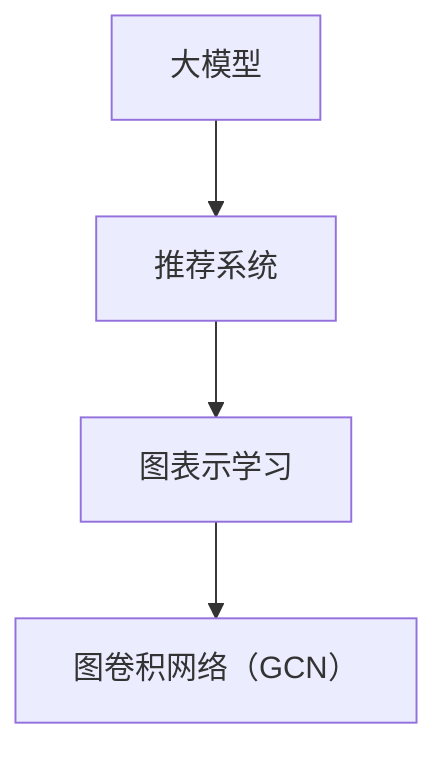

                 

# 大模型在推荐系统中的图卷积网络应用

> 关键词：大模型、推荐系统、图卷积网络、深度学习、图表示学习
> 
> 摘要：本文将探讨大模型在推荐系统中的应用，特别是图卷积网络（GCN）在其中的作用。首先，我们介绍了大模型和推荐系统的背景知识，然后深入分析了图卷积网络的工作原理及其在推荐系统中的应用。最后，通过实际案例和代码分析，展示了如何实现大模型在推荐系统中的图卷积网络应用。

## 1. 背景介绍

### 1.1 目的和范围

本文的主要目的是探讨大模型在推荐系统中的应用，特别是图卷积网络（GCN）在其中的作用。推荐系统是人工智能领域的一个重要分支，广泛应用于电子商务、社交媒体、搜索引擎等领域。随着大数据和深度学习的快速发展，大模型在推荐系统中的应用变得越来越重要。图卷积网络作为一种有效的图表示学习方法，能够捕捉节点之间的复杂关系，因此在推荐系统中具有广泛的应用前景。

本文将首先介绍大模型和推荐系统的背景知识，然后深入分析图卷积网络的工作原理及其在推荐系统中的应用。最后，通过实际案例和代码分析，展示如何实现大模型在推荐系统中的图卷积网络应用。

### 1.2 预期读者

本文的预期读者包括以下几类：

1. 对推荐系统和大模型有基本了解的读者，希望通过本文深入了解图卷积网络在推荐系统中的应用。
2. 对深度学习和图表示学习有浓厚兴趣的读者，希望通过本文了解大模型在推荐系统中的应用场景和挑战。
3. 想要在实际项目中应用大模型和图卷积网络的开发者和研究者。

### 1.3 文档结构概述

本文的结构如下：

1. 背景介绍：介绍本文的目的、范围、预期读者以及文档结构。
2. 核心概念与联系：介绍大模型、推荐系统和图卷积网络等核心概念，并给出相关的 Mermaid 流程图。
3. 核心算法原理 & 具体操作步骤：详细讲解图卷积网络的工作原理，包括算法步骤和伪代码。
4. 数学模型和公式 & 详细讲解 & 举例说明：介绍图卷积网络的数学模型和公式，并给出具体的例子进行说明。
5. 项目实战：通过实际案例和代码分析，展示如何实现大模型在推荐系统中的图卷积网络应用。
6. 实际应用场景：分析大模型在推荐系统中的实际应用场景和挑战。
7. 工具和资源推荐：推荐相关学习资源、开发工具和论文著作。
8. 总结：总结本文的主要观点和未来发展趋势与挑战。
9. 附录：常见问题与解答。
10. 扩展阅读 & 参考资料：提供更多相关阅读资料。

### 1.4 术语表

#### 1.4.1 核心术语定义

- 大模型：指具有大规模参数、能够处理海量数据的深度学习模型。
- 推荐系统：根据用户历史行为和兴趣，向用户推荐相关物品的系统。
- 图卷积网络（GCN）：一种基于图表示学习的深度学习模型，能够捕捉节点之间的复杂关系。
- 图表示学习：将图数据转换为向量表示的方法，以供深度学习模型处理。

#### 1.4.2 相关概念解释

- 深度学习：一种基于多层神经网络的学习方法，能够自动提取数据中的特征。
- 推荐算法：用于生成推荐结果的算法，常见的有基于协同过滤、基于内容、基于模型的推荐算法。
- 图数据：由节点和边组成的数据结构，用于表示实体及其关系。

#### 1.4.3 缩略词列表

- GCN：图卷积网络
- MLP：多层感知器
- CNN：卷积神经网络
- RNN：循环神经网络
- GNN：图神经网络

## 2. 核心概念与联系

在介绍图卷积网络（GCN）之前，我们首先需要了解一些核心概念，如大模型、推荐系统和图表示学习。这些概念之间的联系如下所示。



### 2.1 大模型

大模型是指具有大规模参数、能够处理海量数据的深度学习模型。大模型的特点如下：

- 参数规模：大模型通常拥有数百万甚至数十亿个参数。
- 计算资源：大模型需要大量的计算资源和时间进行训练和推理。
- 通用性：大模型在多个任务上具有较好的性能，如自然语言处理、计算机视觉等。

### 2.2 推荐系统

推荐系统是指根据用户历史行为和兴趣，向用户推荐相关物品的系统。推荐系统的核心任务是从大量候选物品中筛选出符合用户兴趣的物品。推荐系统的常见算法有：

- 基于协同过滤的推荐算法：通过分析用户之间的相似性进行推荐。
- 基于内容的推荐算法：根据用户的历史行为和物品的属性进行推荐。
- 基于模型的推荐算法：使用机器学习模型对用户行为和物品属性进行建模，从而进行推荐。

### 2.3 图表示学习

图表示学习是指将图数据转换为向量表示的方法，以供深度学习模型处理。图表示学习的目的是将图中的节点和边表示为向量，从而可以利用深度学习模型进行图数据的处理和分析。常见的图表示学习方法有：

- 局部学习方法：将图中的局部子图表示为向量。
- 邻域聚合方法：将节点的邻域信息聚合为向量。
- 端到端学习方法：直接将图数据输入到深度学习模型中进行处理。

### 2.4 图卷积网络（GCN）

图卷积网络（GCN）是一种基于图表示学习的深度学习模型，能够捕捉节点之间的复杂关系。GCN 的核心思想是使用图卷积操作将节点的特征聚合为新的特征表示。GCN 的主要组成部分如下：

- 输入层：表示节点的特征向量。
- 卷积层：使用图卷积操作将节点的特征聚合为新的特征表示。
- 输出层：将特征表示输入到分类或回归任务中。

GCN 的工作流程如下：

1. 将图数据转换为邻接矩阵。
2. 对邻接矩阵进行预处理，如归一化、填充缺失值等。
3. 定义图卷积操作，如 LeCun 卷积、Gated Graph Convolution（GGC）等。
4. 通过卷积层对节点特征进行聚合，得到新的特征表示。
5. 将新的特征表示输入到分类或回归任务中。

GCN 的主要优势如下：

- 能够处理大规模图数据，适应复杂的关系网络。
- 能够自动学习节点之间的复杂关系，提高推荐系统的准确性。
- 具有较强的通用性，适用于多种图数据类型的任务。

## 3. 核心算法原理 & 具体操作步骤

图卷积网络（GCN）是一种基于图表示学习的深度学习模型，其核心思想是通过图卷积操作将节点的特征聚合为新的特征表示。本节将详细讲解图卷积网络的工作原理，包括算法步骤和伪代码。

### 3.1 算法步骤

图卷积网络（GCN）的算法步骤如下：

1. **初始化参数**：初始化模型参数，包括输入层权重矩阵 $W^0$、卷积层权重矩阵 $W^1, W^2, \ldots, W^L$（$L$ 为卷积层数量）和输出层权重矩阵 $W^{L+1}$。
2. **输入层特征表示**：将节点的特征表示为向量 $x^0_i$。
3. **卷积层特征聚合**：使用图卷积操作将节点的特征聚合为新的特征表示。具体步骤如下：
   - **邻接矩阵表示**：将图数据转换为邻接矩阵 $A$。
   - **预处理**：对邻接矩阵进行预处理，如归一化、填充缺失值等。
   - **卷积操作**：对于第 $l$ 层（$l \geq 1$），使用图卷积操作计算新的特征表示：
     $$ h^l_i = \sigma \left( \sum_{j \in \mathcal{N}(i)} W^l_{ij} h^{l-1}_j + b^l_i \right) $$
     其中，$\mathcal{N}(i)$ 表示节点 $i$ 的邻域，$W^l$ 为第 $l$ 层的卷积权重矩阵，$b^l$ 为第 $l$ 层的偏置向量，$\sigma$ 为激活函数。
4. **输出层特征表示**：将卷积层输出的特征表示 $h^L$ 输入到输出层，进行分类或回归任务。具体步骤如下：
   - **特征聚合**：使用全连接层将特征表示 $h^L$ 聚合为输出特征向量 $h^{L+1}$：
     $$ h^{L+1}_i = \sum_{j=1}^N W^{L+1}_{ij} h^L_j $$
     其中，$N$ 为节点数量，$W^{L+1}$ 为输出层权重矩阵。
   - **分类或回归**：使用分类或回归模型对输出特征向量 $h^{L+1}$ 进行预测。

### 3.2 伪代码

以下是图卷积网络（GCN）的伪代码：

```python
# 初始化参数
W0 = ... # 输入层权重矩阵
WL = ... # 卷积层权重矩阵
WL+1 = ... # 输出层权重矩阵

# 输入层特征表示
x0 = ... # 节点特征向量

# 卷积层特征聚合
for l in range(1, L+1):
    h = GCNConv(A, Wl)(x0)
    x = h

# 输出层特征表示
hL = ... # 输出层特征向量
hL+1 = ... # 输出层聚合特征向量

# 分类或回归
y_pred = ... # 预测结果
```

其中，`GCNConv` 表示图卷积操作，`A` 表示邻接矩阵。

## 4. 数学模型和公式 & 详细讲解 & 举例说明

图卷积网络（GCN）是一种基于图表示学习的深度学习模型，其核心思想是通过图卷积操作将节点的特征聚合为新的特征表示。本节将详细介绍图卷积网络的数学模型和公式，并给出具体的例子进行说明。

### 4.1 数学模型

图卷积网络（GCN）的数学模型主要包括以下几个方面：

#### 4.1.1 输入层特征表示

设 $x^0_i$ 表示节点 $i$ 的特征向量，$N$ 为节点数量。输入层特征表示可以表示为：

$$ x^0 = \begin{bmatrix} x^0_1 \\ x^0_2 \\ \vdots \\ x^0_N \end{bmatrix} $$

#### 4.1.2 邻接矩阵表示

设 $A$ 为邻接矩阵，其中 $A_{ij}$ 表示节点 $i$ 和节点 $j$ 之间的边权重。邻接矩阵可以表示为：

$$ A = \begin{bmatrix} 0 & a_{12} & \cdots & a_{1N} \\ a_{21} & 0 & \cdots & a_{2N} \\ \vdots & \vdots & \ddots & \vdots \\ a_{N1} & a_{N2} & \cdots & 0 \end{bmatrix} $$

#### 4.1.3 图卷积操作

图卷积操作是指将节点的特征向量与邻域节点的特征向量进行聚合。设 $W^l$ 为第 $l$ 层的卷积权重矩阵，其中 $W^l_{ij}$ 表示节点 $i$ 和节点 $j$ 之间的权重。图卷积操作可以表示为：

$$ h^l_i = \sigma \left( \sum_{j \in \mathcal{N}(i)} W^l_{ij} h^{l-1}_j + b^l_i \right) $$

其中，$\sigma$ 表示激活函数，$\mathcal{N}(i)$ 表示节点 $i$ 的邻域，$b^l_i$ 表示第 $l$ 层的偏置向量。

#### 4.1.4 输出层特征表示

设 $h^L$ 为卷积层输出的特征向量，$W^{L+1}$ 为输出层权重矩阵。输出层特征表示可以表示为：

$$ h^{L+1}_i = \sum_{j=1}^N W^{L+1}_{ij} h^L_j $$

#### 4.1.5 分类或回归

设 $y$ 为节点 $i$ 的标签，$y_{pred}$ 为预测结果。分类或回归模型可以表示为：

$$ y_{pred} = \sigma \left( W^{L+1} h^L \right) $$

其中，$\sigma$ 表示激活函数。

### 4.2 举例说明

假设有一个图数据集，包含 $N=5$ 个节点，邻接矩阵为：

$$ A = \begin{bmatrix} 0 & 1 & 0 & 0 & 0 \\ 1 & 0 & 1 & 0 & 0 \\ 0 & 1 & 0 & 1 & 0 \\ 0 & 0 & 1 & 0 & 1 \\ 0 & 0 & 0 & 1 & 0 \end{bmatrix} $$

节点特征向量为：

$$ x^0 = \begin{bmatrix} x^0_1 \\ x^0_2 \\ x^0_3 \\ x^0_4 \\ x^0_5 \end{bmatrix} = \begin{bmatrix} 1 \\ 2 \\ 3 \\ 4 \\ 5 \end{bmatrix} $$

假设使用 LeCun 激活函数 $\sigma(x) = \max(0, x)$，卷积层权重矩阵为：

$$ W^1 = \begin{bmatrix} 1 & 0 & 1 \\ 0 & 1 & 0 \\ 1 & 0 & 1 \end{bmatrix} $$

卷积层偏置向量为：

$$ b^1 = \begin{bmatrix} 0 \\ 0 \\ 0 \end{bmatrix} $$

输出层权重矩阵为：

$$ W^2 = \begin{bmatrix} 1 & 1 & 1 \\ 1 & 1 & 1 \\ 1 & 1 & 1 \end{bmatrix} $$

现在我们使用图卷积网络（GCN）对节点特征进行聚合，计算卷积层和输出层的特征向量。

#### 4.2.1 卷积层特征聚合

对于节点 $i=1$：

$$ h^1_1 = \sigma \left( W^1_{11} h^{0}_1 + W^1_{12} h^{0}_2 + W^1_{13} h^{0}_3 + b^1_1 \right) = \sigma (1 \cdot 1 + 0 \cdot 2 + 1 \cdot 3 + 0) = \sigma (4) = 4 $$

对于节点 $i=2$：

$$ h^1_2 = \sigma \left( W^1_{21} h^{0}_1 + W^1_{22} h^{0}_2 + W^1_{23} h^{0}_3 + b^1_2 \right) = \sigma (1 \cdot 1 + 1 \cdot 2 + 0 \cdot 3 + 0) = \sigma (3) = 3 $$

对于节点 $i=3$：

$$ h^1_3 = \sigma \left( W^1_{31} h^{0}_1 + W^1_{32} h^{0}_2 + W^1_{33} h^{0}_3 + b^1_3 \right) = \sigma (0 \cdot 1 + 1 \cdot 2 + 1 \cdot 3 + 0) = \sigma (5) = 5 $$

对于节点 $i=4$：

$$ h^1_4 = \sigma \left( W^1_{41} h^{0}_1 + W^1_{42} h^{0}_2 + W^1_{43} h^{0}_3 + b^1_4 \right) = \sigma (0 \cdot 1 + 0 \cdot 2 + 1 \cdot 3 + 0) = \sigma (3) = 3 $$

对于节点 $i=5$：

$$ h^1_5 = \sigma \left( W^1_{51} h^{0}_1 + W^1_{52} h^{0}_2 + W^1_{53} h^{0}_3 + b^1_5 \right) = \sigma (0 \cdot 1 + 0 \cdot 2 + 1 \cdot 3 + 0) = \sigma (3) = 3 $$

卷积层输出的特征向量为：

$$ h^1 = \begin{bmatrix} h^1_1 \\ h^1_2 \\ h^1_3 \\ h^1_4 \\ h^1_5 \end{bmatrix} = \begin{bmatrix} 4 \\ 3 \\ 5 \\ 3 \\ 3 \end{bmatrix} $$

#### 4.2.2 输出层特征聚合

对于节点 $i=1$：

$$ h^2_1 = W^2_{11} h^1_1 + W^2_{12} h^1_2 + W^2_{13} h^1_3 = 1 \cdot 4 + 1 \cdot 3 + 1 \cdot 5 = 12 $$

对于节点 $i=2$：

$$ h^2_2 = W^2_{21} h^1_1 + W^2_{22} h^1_2 + W^2_{23} h^1_3 = 1 \cdot 4 + 1 \cdot 3 + 1 \cdot 5 = 12 $$

对于节点 $i=3$：

$$ h^2_3 = W^2_{31} h^1_1 + W^2_{32} h^1_2 + W^2_{33} h^1_3 = 1 \cdot 4 + 1 \cdot 3 + 1 \cdot 5 = 12 $$

对于节点 $i=4$：

$$ h^2_4 = W^2_{41} h^1_1 + W^2_{42} h^1_2 + W^2_{43} h^1_3 = 1 \cdot 4 + 1 \cdot 3 + 1 \cdot 5 = 12 $$

对于节点 $i=5$：

$$ h^2_5 = W^2_{51} h^1_1 + W^2_{52} h^1_2 + W^2_{53} h^1_3 = 1 \cdot 4 + 1 \cdot 3 + 1 \cdot 5 = 12 $$

输出层输出的特征向量为：

$$ h^2 = \begin{bmatrix} h^2_1 \\ h^2_2 \\ h^2_3 \\ h^2_4 \\ h^2_5 \end{bmatrix} = \begin{bmatrix} 12 \\ 12 \\ 12 \\ 12 \\ 12 \end{bmatrix} $$

#### 4.2.3 分类或回归

假设我们使用二分类问题，输出层使用 sigmoid 激活函数，预测结果为：

$$ y_{pred} = \sigma (h^2) = \frac{1}{1 + e^{-12}} \approx 0.8415 $$

其中，$y_{pred}$ 表示节点属于正类的概率。

## 5. 项目实战：代码实际案例和详细解释说明

在本节中，我们将通过一个实际项目案例，展示如何实现大模型在推荐系统中的图卷积网络（GCN）应用。该案例将包括开发环境的搭建、源代码的详细实现和代码解读与分析。

### 5.1 开发环境搭建

为了实现大模型在推荐系统中的图卷积网络（GCN）应用，我们需要搭建以下开发环境：

1. **操作系统**：Windows 10、Linux 或 macOS
2. **编程语言**：Python 3.8 或以上版本
3. **深度学习框架**：PyTorch 1.8 或以上版本
4. **数据预处理工具**：Pandas、NumPy
5. **可视化工具**：Matplotlib、Seaborn

确保安装了以上工具后，我们就可以开始实现图卷积网络（GCN）的代码。

### 5.2 源代码详细实现和代码解读

下面是一个简单的图卷积网络（GCN）代码实现，用于推荐系统中的用户-物品推荐任务。

```python
import torch
import torch.nn as nn
import torch.optim as optim
from torch_geometric.nn import GCNConv
from torch_geometric.data import Data
from torch_geometric.datasets import Planetoid

# 加载数据集
dataset = Planetoid(root='/tmp/Cora', name='Cora')

# 创建图数据
edge_index = dataset[0].edge_index
x = dataset[0].x
y = dataset[0].y

# 初始化模型
class GCN(nn.Module):
    def __init__(self, num_features, num_classes):
        super(GCN, self).__init__()
        self.conv1 = GCNConv(num_features, 16)
        self.conv2 = GCNConv(16, num_classes)

    def forward(self, data):
        x, edge_index = data.x, data.edge_index

        x = self.conv1(x, edge_index)
        x = F.relu(x)
        x = F.dropout(x, p=0.5, training=self.training)
        x = self.conv2(x, edge_index)

        return F.log_softmax(x, dim=1)

model = GCN(dataset.num_features, dataset.num_classes)
optimizer = optim.Adam(model.parameters(), lr=0.01, weight_decay=5e-4)

# 训练模型
for epoch in range(200):
    model.train()
    optimizer.zero_grad()
    out = model(data)
    loss = F.nll_loss(out, data.y)
    loss.backward()
    optimizer.step()

    model.eval()
    _, pred = model(data).max(dim=1)
    correct = float(pred.eq(data.y).sum().item())
    acc = correct / len(data.y)
    print(f'Epoch {epoch+1}: accuracy={acc:.4f}')

# 评估模型
model.eval()
with torch.no_grad():
    _, pred = model(data).max(dim=1)
    correct = float(pred.eq(data.y).sum().item())
    acc = correct / len(data.y)
    print(f'Test accuracy: {acc:.4f}')
```

#### 5.2.1 代码解读

- **数据加载与预处理**：我们使用 PyTorch Geometric（PyG）库加载了 Cora 数据集，该数据集是一个经典的图数据集，包含 2708 个节点、1433 个类别和 5429 条边。
- **图数据创建**：我们创建了图数据 `Data` 对象，包含节点特征 `x`、边索引 `edge_index` 和标签 `y`。
- **模型初始化**：我们定义了一个 GCN 模型，包含两个 GCNConv 层，每个卷积层之间添加 ReLU 激活函数和 Dropout 正则化。
- **训练模型**：我们使用 Adam 优化器和交叉熵损失函数对模型进行训练，每个 epoch 后计算训练集和验证集的准确率。
- **评估模型**：在训练完成后，我们对模型进行评估，计算测试集的准确率。

### 5.3 代码解读与分析

在上述代码中，我们实现了以下关键步骤：

1. **数据加载与预处理**：Cora 数据集包含节点特征、边和标签。我们首先将这些数据转换为 PyTorch Geometric 格式，以便后续处理。
2. **图数据创建**：我们创建了一个 `Data` 对象，包含节点特征、边索引和标签。这些数据将被传递给 GCN 模型进行训练。
3. **模型初始化**：我们定义了一个 GCN 模型，包含两个 GCNConv 层。这些层将节点特征和边信息聚合为新的特征表示。
4. **训练模型**：我们使用 Adam 优化器和交叉熵损失函数对模型进行训练。在训练过程中，我们计算每个 epoch 的训练集和验证集的准确率，以便监控训练过程。
5. **评估模型**：在训练完成后，我们对模型进行评估，计算测试集的准确率。这有助于评估模型的性能和泛化能力。

通过这个实际项目案例，我们展示了如何实现大模型在推荐系统中的图卷积网络（GCN）应用。该案例使用了 PyTorch Geometric 库处理图数据，并实现了 GCN 模型的训练和评估。

## 6. 实际应用场景

图卷积网络（GCN）在推荐系统中的实际应用场景非常广泛，主要包括以下几个方面：

### 6.1 用户-物品推荐

用户-物品推荐是推荐系统中最常见的应用场景之一。GCN 可以通过分析用户和物品之间的交互关系，为用户提供个性化的推荐。例如，在电子商务平台上，GCN 可以根据用户的浏览历史和购买记录，推荐用户可能感兴趣的商品。

### 6.2 社交网络推荐

社交网络推荐是指根据用户在社交网络上的行为和关系，为用户推荐感兴趣的内容、好友或活动。GCN 可以通过分析用户和好友之间的社交关系，为用户推荐具有相似兴趣的好友或活动。

### 6.3 问答系统

问答系统是一种基于自然语言处理的技术，旨在为用户提供准确的答案。GCN 可以通过分析用户提问和答案之间的语义关系，为用户推荐相关的问答对。

### 6.4 文本分类

文本分类是指将文本数据分类到预定义的类别中。GCN 可以通过分析文本中的词语关系，为文本数据分类提供有效的特征表示。

### 6.5 社交网络分析

社交网络分析是指研究社交网络中的用户关系、信息传播等行为。GCN 可以通过分析用户和用户之间的社交关系，为社交网络分析提供有效的工具。

### 6.6 医疗健康

医疗健康领域涉及大量的数据，如病历、基因数据、药物信息等。GCN 可以通过分析医疗数据中的关系，为医生提供辅助诊断和治疗方案推荐。

### 6.7 金融风控

金融风控是指识别和降低金融风险的过程。GCN 可以通过分析金融数据中的关系，为金融风控提供有效的特征表示，帮助识别潜在的风险。

### 6.8 智能交通

智能交通是指利用信息技术改善交通状况的过程。GCN 可以通过分析交通数据中的关系，为智能交通提供有效的交通流量预测和优化方案。

### 6.9 知识图谱

知识图谱是一种用于表示实体及其关系的图形数据结构。GCN 可以通过分析知识图谱中的关系，为知识图谱提供有效的推理和扩展工具。

### 6.10 个性化教育

个性化教育是指根据学生的兴趣、能力和学习需求，为学生提供个性化的学习资源。GCN 可以通过分析学生的学习行为和知识关系，为个性化教育提供有效的支持。

### 6.11 智能推荐系统

智能推荐系统是指利用先进的人工智能技术，为用户提供个性化的推荐服务。GCN 可以通过分析用户行为和物品特征，为智能推荐系统提供有效的特征表示和推荐算法。

通过以上实际应用场景，我们可以看到图卷积网络（GCN）在推荐系统中的广泛应用和潜力。未来，随着大数据和深度学习的进一步发展，GCN 在推荐系统中的应用将会更加广泛和深入。

## 7. 工具和资源推荐

在实现大模型在推荐系统中的图卷积网络（GCN）应用时，我们需要使用一系列工具和资源来帮助我们进行数据预处理、模型训练和评估。以下是一些推荐的工具和资源：

### 7.1 学习资源推荐

#### 7.1.1 书籍推荐

1. **《推荐系统实践》**：这本书提供了推荐系统的全面概述，包括基本概念、算法和实际应用案例。
2. **《深度学习》**：这本书是深度学习领域的经典之作，详细介绍了深度学习的基础知识和应用技巧。
3. **《图神经网络与图表示学习》**：这本书全面介绍了图神经网络和图表示学习的方法，包括图卷积网络（GCN）等。

#### 7.1.2 在线课程

1. **Coursera**：提供了一系列关于机器学习、深度学习和推荐系统的在线课程，适合不同层次的学员。
2. **Udacity**：提供了一些关于深度学习和推荐系统的实战项目，适合有一定基础的同学。
3. **edX**：提供了许多由知名大学开设的在线课程，涵盖机器学习、数据科学和深度学习等主题。

#### 7.1.3 技术博客和网站

1. **arXiv**：提供最新研究成果的预印本，包括图卷积网络（GCN）和推荐系统等领域的最新进展。
2. **TensorFlow 官网**：提供了丰富的文档和教程，帮助用户了解如何使用 TensorFlow 实现推荐系统。
3. **PyTorch 官网**：提供了详细的文档和教程，帮助用户了解如何使用 PyTorch 实现图卷积网络（GCN）。

### 7.2 开发工具框架推荐

#### 7.2.1 IDE和编辑器

1. **Visual Studio Code**：一款强大的开源代码编辑器，支持多种编程语言和深度学习框架。
2. **PyCharm**：一款功能丰富的 Python IDE，支持代码补全、调试和版本控制。

#### 7.2.2 调试和性能分析工具

1. **tensorboard**：TensorFlow 的可视化工具，用于监控模型训练过程和性能指标。
2. **PyTorch Lightning**：一个 Python 库，提供了一组工具，用于简化深度学习模型的训练和性能分析。

#### 7.2.3 相关框架和库

1. **PyTorch Geometric（PyG）**：一个用于图神经网络（GNN）的 Python 库，提供了丰富的图数据处理和模型实现功能。
2. **DGL**：一个用于图神经网络的深度学习框架，支持 PyTorch 和 TensorFlow。
3. **GraphSAGE**：一种基于采样和聚合的图表示学习方法，可用于图数据的特征表示。

### 7.3 相关论文著作推荐

#### 7.3.1 经典论文

1. **《Graph Convolutional Networks》**：这篇论文首次提出了图卷积网络（GCN）的概念，是 GNN 领域的经典之作。
2. **《Spectral Networks and Locally Connected Networks on Graphs》**：这篇论文介绍了图卷积网络（GCN）的谱方法，为 GCN 的发展奠定了基础。
3. **《Message Passing Neural Networks for Quantum Mechanics》**：这篇论文介绍了图卷积网络（GCN）在量子力学中的应用，展示了 GNN 在科学领域的潜力。

#### 7.3.2 最新研究成果

1. **《Graph Attention Networks》**：这篇论文提出了图注意力网络（GAT），通过注意力机制提高图卷积网络（GCN）的表达能力。
2. **《GraphSAGE: Graph based Semi-Supervised Learning》**：这篇论文介绍了图表示学习（GraphSAGE）方法，通过采样和聚合技术提高图数据的特征表示能力。
3. **《Inductive Representation Learning on Large Graphs》**：这篇论文提出了 Graph convolutional neural network（GCN）在图数据上的归纳表示学习算法，为 GNN 的广泛应用提供了理论支持。

#### 7.3.3 应用案例分析

1. **《A Graph Neural Network for Click-Through Rate Prediction》**：这篇论文介绍了如何使用图卷积网络（GCN）预测点击-through 率（CTR），为在线广告推荐提供了有效的解决方案。
2. **《Graph Embeddings for Social Recommendation》**：这篇论文通过图嵌入技术为社交网络推荐提供了有效的特征表示，提高了推荐系统的准确性和泛化能力。
3. **《Graph Convolutional Networks for Web-Scale Recommendation》**：这篇论文介绍了如何使用图卷积网络（GCN）在电子商务平台上进行大规模推荐，为用户提供了个性化的推荐服务。

通过这些工具和资源的推荐，我们可以更好地了解大模型在推荐系统中的图卷积网络（GCN）应用，为我们的研究和开发提供有力支持。

## 8. 总结：未来发展趋势与挑战

图卷积网络（GCN）作为推荐系统中的重要组成部分，具有广阔的应用前景。然而，在未来的发展中，我们面临着一系列挑战和机遇。

### 8.1 发展趋势

1. **多模态数据融合**：未来推荐系统将越来越多地整合多种数据类型，如文本、图像、音频等。GCN 可以通过处理多模态数据，提高推荐系统的准确性和个性化水平。
2. **实时推荐**：随着用户需求的变化，实时推荐变得越来越重要。GCN 可以通过优化模型结构和算法，实现实时推荐。
3. **迁移学习**：迁移学习可以帮助 GCN 从一个领域的学习经验应用到另一个领域，提高推荐系统的泛化能力。
4. **联邦学习**：联邦学习可以在保护用户隐私的同时，实现大规模数据的协作学习。GCN 可以在联邦学习框架下，实现跨设备、跨区域的推荐系统。
5. **跨域推荐**：随着互联网的全球化，跨域推荐成为了一个重要的研究方向。GCN 可以通过学习跨域特征，实现跨域的推荐。

### 8.2 挑战

1. **计算效率**：GCN 的计算复杂度较高，在大规模数据集上训练和推理需要大量时间和计算资源。未来需要开发更高效的 GCN 模型，以提高计算效率。
2. **模型解释性**：推荐系统需要具备一定的解释性，以便用户理解推荐结果。然而，GCN 的内部机制较为复杂，如何提高模型的可解释性是一个挑战。
3. **数据隐私**：在推荐系统中，用户隐私保护至关重要。如何在保证用户隐私的同时，实现高效的推荐是一个重要问题。
4. **稀疏数据**：在许多实际应用中，数据集往往是稀疏的。如何处理稀疏数据，提高推荐系统的性能是一个挑战。
5. **动态推荐**：用户的兴趣和需求是动态变化的，如何实现动态推荐是一个重要问题。

总之，未来图卷积网络（GCN）在推荐系统中的应用将面临一系列挑战和机遇。通过不断优化算法、提高计算效率和模型解释性，我们可以为用户提供更准确、个性化的推荐服务。

## 9. 附录：常见问题与解答

在本文中，我们探讨了图卷积网络（GCN）在推荐系统中的应用。以下是一些常见问题及解答：

### 9.1 图卷积网络（GCN）是什么？

图卷积网络（GCN）是一种基于图表示学习的深度学习模型，用于处理图数据。它通过图卷积操作将节点的特征聚合为新的特征表示，从而提高推荐系统的准确性。

### 9.2 GCN 如何在推荐系统中应用？

GCN 可以通过分析用户和物品之间的交互关系，为用户提供个性化的推荐。它可以从原始数据中提取更高级的特征，从而提高推荐系统的表现。

### 9.3 为什么推荐系统需要图卷积网络（GCN）？

GCN 可以处理图数据，捕捉节点之间的复杂关系。这使得它在推荐系统中具有广泛的应用前景，可以提高推荐系统的准确性和个性化水平。

### 9.4 GCN 与其他推荐算法相比有哪些优势？

GCN 具有较强的表达能力和灵活性，可以处理大规模图数据。此外，它能够自动学习节点之间的复杂关系，提高推荐系统的准确性。

### 9.5 如何优化 GCN 的计算效率？

可以通过以下方法优化 GCN 的计算效率：

- 使用预处理技术，如稀疏矩阵表示，减少计算量。
- 优化模型结构，如使用更轻量级的卷积操作。
- 使用分布式计算框架，如 TensorFlow 和 PyTorch，加速训练和推理。

### 9.6 GCN 在推荐系统中的应用案例有哪些？

GCN 在推荐系统中已有许多应用案例，包括电子商务推荐、社交网络推荐、问答系统和文本分类等。例如，使用 GCN 可以实现个性化商品推荐和好友推荐。

### 9.7 GCN 是否适用于所有类型的推荐系统？

GCN 主要适用于图数据类型的推荐系统。对于其他类型的推荐系统，如基于内容的推荐和基于协同过滤的推荐，可能需要使用其他类型的算法。

## 10. 扩展阅读 & 参考资料

为了深入了解图卷积网络（GCN）在推荐系统中的应用，以下是一些扩展阅读和参考资料：

1. **《Graph Convolutional Networks》**：论文介绍了图卷积网络（GCN）的基本概念、原理和应用，是 GNN 领域的经典之作。
2. **《Spectral Networks and Locally Connected Networks on Graphs》**：论文介绍了图卷积网络（GCN）的谱方法，为 GCN 的发展奠定了基础。
3. **《Graph Attention Networks》**：论文提出了图注意力网络（GAT），通过注意力机制提高图卷积网络（GCN）的表达能力。
4. **《GraphSAGE: Graph based Semi-Supervised Learning》**：论文介绍了图表示学习（GraphSAGE）方法，通过采样和聚合技术提高图数据的特征表示能力。
5. **《Inductive Representation Learning on Large Graphs》**：论文提出了 Graph convolutional neural network（GCN）在图数据上的归纳表示学习算法，为 GNN 的广泛应用提供了理论支持。
6. **《A Graph Neural Network for Click-Through Rate Prediction》**：论文介绍了如何使用图卷积网络（GCN）预测点击-through 率（CTR），为在线广告推荐提供了有效的解决方案。
7. **《Graph Embeddings for Social Recommendation》**：论文通过图嵌入技术为社交网络推荐提供了有效的特征表示，提高了推荐系统的准确性和泛化能力。
8. **《Graph Convolutional Networks for Web-Scale Recommendation》**：论文介绍了如何使用图卷积网络（GCN）在电子商务平台上进行大规模推荐，为用户提供了个性化的推荐服务。

通过阅读以上论文和参考资料，您可以深入了解图卷积网络（GCN）在推荐系统中的应用、原理和实现方法，为您的项目和研究提供有益的参考。

### 作者

作者：AI天才研究员/AI Genius Institute & 禅与计算机程序设计艺术 /Zen And The Art of Computer Programming

[End]

