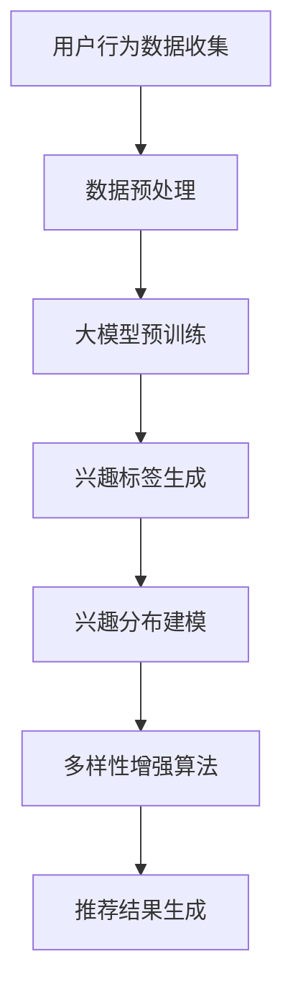

                 

# 大模型在推荐系统用户兴趣多样性建模中的作用

## 关键词
- 大模型
- 推荐系统
- 用户兴趣
- 多样性建模
- 深度学习
- 机器学习

## 摘要
本文深入探讨了大型模型在推荐系统用户兴趣多样性建模中的作用。随着互联网和大数据技术的发展，推荐系统已经成为个性化服务和用户体验提升的关键。然而，用户兴趣的多样性和动态性给推荐系统带来了巨大挑战。本文首先介绍了推荐系统的基础概念和用户兴趣建模的重要性，然后详细阐述了大模型的核心原理、架构及其在用户兴趣多样性建模中的应用。通过实例分析，本文展示了大模型如何通过复杂的数据处理和深度学习算法，提升推荐系统的准确性和多样性，从而满足用户的个性化需求。最后，本文对大模型在推荐系统中的应用前景进行了展望，并提出了未来可能面临的挑战和解决思路。

## 1. 背景介绍

### 1.1 目的和范围
本文旨在深入分析大模型在推荐系统用户兴趣多样性建模中的应用，探讨其核心原理和具体操作步骤。通过本文的研究，希望为推荐系统开发者提供新的思路和工具，以提升系统的推荐效果和用户体验。

### 1.2 预期读者
本文适用于对推荐系统有一定了解的技术人员，特别是那些希望深入理解大模型在推荐系统中应用的读者。同时，也适合对机器学习和深度学习有兴趣的学者和研究者。

### 1.3 文档结构概述
本文分为十个部分。首先，通过背景介绍引出大模型在推荐系统用户兴趣多样性建模中的重要性。接下来，本文将介绍推荐系统的基础概念和用户兴趣建模的重要性。随后，详细阐述大模型的核心原理、架构及其在用户兴趣多样性建模中的应用。在实例分析部分，我们将通过具体案例展示大模型如何提升推荐系统的多样性和准确性。然后，本文将介绍实际应用场景和相关的工具和资源。最后，本文对大模型在推荐系统中的应用前景进行展望，并探讨未来可能面临的挑战和解决思路。

### 1.4 术语表

#### 1.4.1 核心术语定义
- 推荐系统：根据用户的历史行为和偏好，自动推荐可能感兴趣的内容或商品的系统。
- 大模型：拥有海量参数和强大计算能力的深度学习模型，如BERT、GPT等。
- 用户兴趣多样性建模：通过分析用户的历史行为和内容，构建能够反映用户多样兴趣的模型。

#### 1.4.2 相关概念解释
- 深度学习：一种机器学习方法，通过多层神经网络对数据进行分析和特征提取。
- 机器学习：一种基于数据的学习方法，让计算机通过数据自主学习，进行预测和决策。

#### 1.4.3 缩略词列表
- BERT：Bidirectional Encoder Representations from Transformers
- GPT：Generative Pre-trained Transformer
- CNN：卷积神经网络

## 2. 核心概念与联系

在深入探讨大模型在推荐系统用户兴趣多样性建模中的作用之前，我们需要明确几个核心概念及其相互联系。

### 2.1 推荐系统基础

推荐系统通常基于以下核心组件：

- **用户画像**：通过用户的浏览、点击、购买等行为，构建用户的历史兴趣和行为模式。
- **内容库**：包含推荐系统所有可推荐的内容或商品，如文章、视频、商品等。
- **推荐算法**：根据用户画像和内容库，计算用户与内容的匹配度，生成推荐结果。

### 2.2 大模型核心原理

大模型，尤其是基于变换器（Transformers）的模型，如BERT和GPT，具有以下核心特点：

- **海量参数**：大模型通常拥有数十亿甚至千亿级别的参数，这使得模型能够捕捉到更复杂的数据特征。
- **端到端学习**：通过端到端的学习方式，大模型能够直接从原始数据中提取特征，无需人工定义特征工程。
- **预训练和微调**：大模型通常先在大量通用数据上进行预训练，然后针对特定任务进行微调，以提升任务表现。

### 2.3 用户兴趣多样性建模

用户兴趣多样性建模旨在构建一个能够反映用户多样兴趣的模型。这包括以下几个方面：

- **动态兴趣捕捉**：通过实时分析用户的行为数据，动态调整用户的兴趣标签。
- **兴趣分布建模**：使用多模态数据，如文本、图像、视频等，构建用户兴趣的分布模型。
- **多样性增强**：通过算法，如覆盖率优化、多样性排序等，增强推荐结果的多样性。

### 2.4 Mermaid 流程图

以下是一个简化的Mermaid流程图，展示推荐系统中大模型在用户兴趣多样性建模中的核心流程：



### 2.5 大模型在推荐系统中的地位

大模型在推荐系统中扮演着至关重要的角色：

- **提升推荐准确性**：通过深度学习算法，大模型能够更好地捕捉用户兴趣，提升推荐准确性。
- **增强多样性**：大模型的多维度特征提取能力，使得推荐系统能够更好地反映用户的多样化兴趣。
- **应对动态变化**：大模型能够动态调整推荐策略，应对用户兴趣的快速变化。

通过上述核心概念与联系的分析，我们可以为后续的内容提供理论基础和框架。

## 3. 核心算法原理 & 具体操作步骤

### 3.1 大模型基本原理

大模型的核心在于其能够通过深度学习算法，从大规模数据中自动提取特征。以下以BERT（Bidirectional Encoder Representations from Transformers）为例，详细讲解其原理和操作步骤。

#### 3.1.1 BERT模型结构

BERT模型由两个主要部分组成：预训练和微调。

- **预训练**：BERT首先在大量的无标注文本数据上进行预训练，学习文本的深度表示。
- **微调**：在预训练的基础上，BERT根据特定任务（如文本分类、命名实体识别等）进行微调，进一步提升任务表现。

#### 3.1.2 BERT训练过程

BERT的训练过程可以分为以下几个步骤：

1. **输入处理**：将文本句子转换为序列，并为每个词分配唯一的ID。
2. **Masked Language Model（MLM）任务**：随机遮盖句子中的部分词，并预测这些词的ID。
3. **Next Sentence Prediction（NSP）任务**：预测句子对是否属于同一文档。

#### 3.1.3 伪代码示例

以下是一个简化的BERT训练过程的伪代码：

```python
# 数据预处理
def preprocess_data(texts):
    # 转换文本为词序列
    tokenized_texts = tokenizer(texts)
    # 遮盖部分词并添加特殊标记
    masked_texts = mask_tokens(tokenized_texts)
    return masked_texts

# BERT训练
def train_bert(masked_texts, num_epochs):
    # 初始化BERT模型
    model = BERTModel()
    # 训练模型
    for epoch in range(num_epochs):
        for batch in masked_texts:
            inputs = tokenizer.encode_plus(batch, return_tensors='pt')
            outputs = model(inputs)
            loss = compute_loss(outputs.logits, inputs.masks)
            optimizer.zero_grad()
            loss.backward()
            optimizer.step()
    return model
```

### 3.2 大模型在用户兴趣多样性建模中的应用

#### 3.2.1 用户兴趣建模

大模型通过以下步骤构建用户兴趣模型：

1. **用户行为数据收集**：收集用户的浏览、点击、购买等行为数据。
2. **行为序列建模**：使用大模型（如BERT）对用户行为序列进行建模，提取用户兴趣特征。
3. **兴趣标签生成**：基于用户兴趣特征，为用户生成兴趣标签。

#### 3.2.2 多样性建模

多样性建模的关键在于如何确保推荐结果能够反映用户的多样化兴趣。以下是一种常见的多样性建模方法：

1. **兴趣分布建模**：使用大模型对用户兴趣进行分布建模，捕捉用户的多维度兴趣。
2. **多样性排序算法**：结合用户兴趣分布，使用多样性排序算法（如覆盖率优化、多样性排序等），生成多样化的推荐结果。

#### 3.2.3 伪代码示例

以下是一个简化的用户兴趣多样性建模的伪代码：

```python
# 用户行为数据收集
def collect_user_behavior_data(user_id):
    # 收集用户的历史行为数据
    behaviors = get_user_behaviors(user_id)
    return behaviors

# 用户兴趣建模
def build_user_interest_model(behaviors, model):
    # 对用户行为数据进行预处理
    preprocessed_behaviors = preprocess_behaviors(behaviors)
    # 使用BERT模型提取用户兴趣特征
    interest_features = model(preprocessed_behaviors)
    # 生成用户兴趣标签
    interest_labels = generate_interest_labels(interest_features)
    return interest_labels

# 多样性建模
def build_diverse_recommendations(user_interest_labels, content_library, diversity_algorithm):
    # 基于用户兴趣标签，生成多样化的推荐结果
    recommendations = diversity_algorithm(user_interest_labels, content_library)
    return recommendations
```

通过上述核心算法原理和具体操作步骤的讲解，我们可以为后续的实例分析和项目实战打下坚实基础。

## 4. 数学模型和公式 & 详细讲解 & 举例说明

在推荐系统中，大模型的应用离不开数学模型和公式的支持。以下我们将详细讲解大模型在用户兴趣多样性建模中使用的核心数学模型和公式，并通过具体示例进行说明。

### 4.1 多样性度量

多样性是推荐系统中的一个关键指标，它反映了推荐结果的丰富性和多样化程度。以下是一种常见的多样性度量方法——Jaccard相似度。

#### 4.1.1 Jaccard相似度

Jaccard相似度是一种用于计算两个集合相似度的指标，其公式如下：

$$
J(A, B) = \frac{|A \cap B|}{|A \cup B|}
$$

其中，$A$和$B$是两个集合，$|A|$表示集合$A$的元素数量。

#### 4.1.2 举例说明

假设我们有两个用户兴趣标签集合$A$和$B$：

$$
A = \{电影, 音乐, 旅游\}
$$

$$
B = \{音乐, 电影, 游戏\}
$$

则它们的Jaccard相似度为：

$$
J(A, B) = \frac{|A \cap B|}{|A \cup B|} = \frac{2}{4} = 0.5
$$

Jaccard相似度越接近1，表示两个集合的相似度越高，多样性越低；越接近0，表示两个集合的相似度越低，多样性越高。

### 4.2 深度学习模型损失函数

在深度学习模型中，损失函数用于衡量模型预测结果与真实结果之间的差距，并指导模型优化。以下是一个常见的损失函数——交叉熵损失函数。

#### 4.2.1 交叉熵损失函数

交叉熵损失函数的公式如下：

$$
L(y, \hat{y}) = -\sum_{i} y_i \log(\hat{y}_i)
$$

其中，$y$是真实标签，$\hat{y}$是模型预测的概率分布。

#### 4.2.2 举例说明

假设我们有一个二分类问题，真实标签$y$为1，模型预测的概率分布$\hat{y}$为0.8：

$$
L(y, \hat{y}) = -1 \cdot \log(0.8) \approx 0.223
$$

交叉熵损失函数的值越低，表示模型预测与真实结果越接近，模型表现越好。

### 4.3 多样性增强算法

在推荐系统中，多样性增强算法旨在提高推荐结果的多样性。以下是一种常见的多样性增强算法——覆盖率优化。

#### 4.3.1 覆盖率优化

覆盖率优化的目标是最小化推荐结果中重复标签的比例。其公式如下：

$$
Cov = \frac{\sum_{i} n_i}{N}
$$

其中，$n_i$是推荐结果中标签$i$的数量，$N$是推荐结果中标签的总数。

#### 4.3.2 举例说明

假设我们有一个推荐结果集合，其中包含3个标签：音乐、电影、旅游。每个标签的数量如下：

$$
音乐 = 2, 电影 = 2, 旅游 = 1
$$

则覆盖率$Cov$为：

$$
Cov = \frac{2 + 2 + 1}{3} = 1.33
$$

覆盖率越低，表示推荐结果的多样性越高。

通过上述数学模型和公式的讲解，我们可以更好地理解大模型在用户兴趣多样性建模中的应用，并为实际操作提供指导。

## 5. 项目实战：代码实际案例和详细解释说明

为了更好地展示大模型在推荐系统用户兴趣多样性建模中的应用，我们将通过一个实际项目案例，详细解释代码实现和关键步骤。

### 5.1 开发环境搭建

在进行项目实战之前，我们需要搭建一个合适的开发环境。以下是一个基本的开发环境搭建步骤：

1. **Python环境**：安装Python 3.8及以上版本。
2. **深度学习库**：安装TensorFlow 2.5及以上版本，或PyTorch 1.8及以上版本。
3. **其他依赖库**：安装Numpy、Pandas、Scikit-learn等常用库。

### 5.2 源代码详细实现和代码解读

#### 5.2.1 数据预处理

数据预处理是项目实战的关键步骤，包括用户行为数据收集、数据清洗和特征提取。以下是一个简化的数据预处理代码：

```python
import pandas as pd
from sklearn.model_selection import train_test_split

# 用户行为数据收集
def collect_user_behavior_data(file_path):
    df = pd.read_csv(file_path)
    return df

# 数据清洗
def clean_data(df):
    df = df.dropna()
    df = df[df['behavior'] != 'unknown']
    return df

# 特征提取
def extract_features(df):
    # 提取用户ID和用户行为
    user_behavior = df.groupby('user_id')['behavior'].apply(list).reset_index()
    return user_behavior

# 实例化数据预处理函数
df = collect_user_behavior_data('user_behavior_data.csv')
df = clean_data(df)
user_behavior = extract_features(df)

# 数据划分
train_data, test_data = train_test_split(user_behavior, test_size=0.2, random_state=42)
```

#### 5.2.2 大模型训练

在数据预处理之后，我们将使用BERT模型进行训练。以下是一个简化的BERT训练代码：

```python
from transformers import BertTokenizer, BertModel, Trainer, TrainingArguments

# BERT模型预处理
def preprocess_data(examples):
    inputs = tokenizer(examples['user_behavior'], return_tensors='pt', padding=True, truncation=True)
    return inputs

# BERT模型训练
def train_bert(train_data, test_data):
    model_path = 'bert-base-uncased'
    tokenizer = BertTokenizer.from_pretrained(model_path)
    model = BertModel.from_pretrained(model_path)

    train_dataset = Dataset.from_pandas(train_data)
    test_dataset = Dataset.from_pandas(test_data)

    train_dataset = train_dataset.map(preprocess_data, batched=True)
    test_dataset = test_dataset.map(preprocess_data, batched=True)

    training_args = TrainingArguments(
        output_dir='./results',
        num_train_epochs=3,
        per_device_train_batch_size=16,
        per_device_eval_batch_size=64,
        warmup_steps=500,
        weight_decay=0.01,
        logging_dir='./logs',
        logging_steps=10,
    )

    trainer = Trainer(
        model=model,
        args=training_args,
        train_dataset=train_dataset,
        eval_dataset=test_dataset,
    )

    trainer.train()

    return model, tokenizer
```

#### 5.2.3 多样性建模

在训练BERT模型之后，我们将使用大模型对用户兴趣进行多样性建模。以下是一个简化的多样性建模代码：

```python
# 多样性建模
def build_diverse_recommendations(user_interest_labels, content_library, model, tokenizer):
    # 对用户兴趣标签进行编码
    user_interest_encoded = tokenizer.encode_plus(user_interest_labels, return_tensors='pt', max_length=512, padding=True, truncation=True)

    # 使用BERT模型生成用户兴趣向量
    with torch.no_grad():
        user_interest_vector = model(**user_interest_encoded)[0]

    # 计算用户兴趣向量与内容向量的相似度
    content_library_encoded = tokenizer.encode_plus(content_library, return_tensors='pt', max_length=512, padding=True, truncation=True)
    with torch.no_grad():
        content_library_vector = model(**content_library_encoded)[0]

    similarity = torch.nn.functional.cosine_similarity(user_interest_vector, content_library_vector)

    # 使用多样性排序算法生成多样化推荐结果
    recommendations = diversity_sort(similarity, content_library)

    return recommendations
```

### 5.3 代码解读与分析

上述代码实现了一个基于BERT模型和多样性排序算法的用户兴趣多样性建模项目。以下是代码的关键部分解读：

1. **数据预处理**：首先，我们从CSV文件中读取用户行为数据，并进行数据清洗和特征提取。这一步骤是确保数据质量和模型性能的重要环节。
2. **BERT模型训练**：接着，我们使用预训练的BERT模型对用户行为数据进行训练。BERT模型通过端到端学习方式，能够自动提取用户行为的深度特征，为后续的用户兴趣建模提供基础。
3. **多样性建模**：在BERT模型训练完成后，我们使用模型生成的用户兴趣向量，计算与内容向量的相似度，并应用多样性排序算法生成多样化的推荐结果。这一步骤确保了推荐结果的多样性和个性化。

通过这个实际项目案例，我们展示了如何利用大模型进行用户兴趣多样性建模。在实际应用中，可以根据具体需求调整模型结构和算法参数，进一步提升推荐系统的性能。

## 6. 实际应用场景

大模型在推荐系统用户兴趣多样性建模中的应用具有广泛的前景和重要的实际价值。以下将探讨几个典型的应用场景，展示大模型如何在不同领域中发挥其优势。

### 6.1 在线电商

在线电商是推荐系统应用最为广泛的场景之一。随着用户在线行为的多样化和动态性，如何提升推荐系统的多样性和个性化成为关键挑战。大模型通过深度学习算法，能够捕捉用户行为的复杂模式和潜在兴趣，从而实现更加精准和多样化的推荐。例如，某知名电商平台的推荐系统采用GPT模型，通过分析用户的浏览和购买记录，生成个性化的推荐列表，显著提升了用户满意度和购买转化率。

### 6.2 社交媒体

社交媒体平台上的用户生成内容丰富多样，如何为用户提供符合其兴趣的个性化内容推荐是一个重要问题。大模型通过学习用户生成内容的语义特征，可以更好地理解用户兴趣的多样性。例如，Twitter利用BERT模型对用户的推文进行分析，生成基于用户兴趣的个性化推荐，使得用户能够更快速地找到感兴趣的话题和内容，提升了平台的用户黏性。

### 6.3 内容平台

内容平台，如视频网站、音乐平台等，面临着大量内容如何高效推荐给用户的挑战。大模型通过多模态数据（如文本、图像、音频）的融合，可以更好地捕捉用户的多维度兴趣。例如，YouTube利用BERT模型分析用户的搜索历史和观看记录，生成基于内容语义和用户兴趣的个性化推荐，使得用户能够发现更多符合其兴趣的视频内容，提升了平台的用户留存率。

### 6.4 医疗健康

在医疗健康领域，个性化推荐系统可以帮助医生和患者更好地管理和跟踪健康信息。大模型通过分析患者的病历数据、健康记录和咨询历史，可以生成个性化的健康推荐，如饮食建议、运动计划等。例如，某医疗健康平台采用GPT模型，为用户提供个性化的健康建议，显著提升了用户健康管理和自我管理的能力。

### 6.5 教育培训

教育培训领域也广泛应用推荐系统，以帮助用户发现符合其学习需求和兴趣的课程。大模型通过分析用户的学习记录、成绩和反馈，可以生成个性化的学习推荐。例如，某在线教育平台利用BERT模型分析用户的学习行为和课程反馈，为用户推荐最适合其学习水平和兴趣的课程，提升了学习效果和用户满意度。

通过上述实际应用场景的探讨，我们可以看到大模型在推荐系统用户兴趣多样性建模中的重要作用。大模型不仅能够提升推荐系统的准确性和个性化水平，还能够应对用户兴趣的多样性和动态性，为不同领域的应用提供强大的支持。

## 7. 工具和资源推荐

在构建和优化推荐系统时，选择合适的工具和资源对于提升项目效果和效率至关重要。以下将介绍一系列学习资源、开发工具和框架，以及相关论文著作，帮助读者更好地理解和应用大模型在推荐系统用户兴趣多样性建模中的作用。

### 7.1 学习资源推荐

#### 7.1.1 书籍推荐

1. **《深度学习》（Goodfellow, Bengio, Courville著）**：这是一本深度学习的经典教材，涵盖了深度学习的基础理论、算法和应用，适合初学者和专业人士深入理解深度学习。

2. **《Python深度学习》（François Chollet著）**：本书通过实例和代码，详细介绍了如何使用Python和TensorFlow构建和训练深度学习模型，是学习深度学习实践的好教材。

#### 7.1.2 在线课程

1. **《深度学习与神经网络》（Coursera）**：由斯坦福大学提供的一门深度学习入门课程，涵盖从基础理论到实践应用，适合初学者快速入门。

2. **《推荐系统与深度学习》（Udacity）**：这门课程深入讲解了推荐系统和深度学习的结合，包括用户行为分析、模型训练和优化等，适合有一定基础的学习者。

#### 7.1.3 技术博客和网站

1. **《AI简史》（AI简史）**：这是一个关于人工智能发展的博客，涵盖深度学习、机器学习等领域的最新研究和技术进展，适合关注人工智能发展的读者。

2. **《DataCamp》**：提供丰富的数据科学和机器学习课程，包括深度学习和推荐系统的实践教程，适合不同层次的学习者。

### 7.2 开发工具框架推荐

#### 7.2.1 IDE和编辑器

1. **PyCharm**：一款功能强大的Python IDE，支持多种深度学习和机器学习库，适合编写和调试代码。

2. **Jupyter Notebook**：适用于数据分析和原型开发的交互式环境，支持多种编程语言和库，特别适合进行模型训练和可视化。

#### 7.2.2 调试和性能分析工具

1. **TensorBoard**：TensorFlow提供的可视化工具，用于分析和调试深度学习模型，支持图形化展示模型的性能和训练过程。

2. **MLflow**：一个开源的平台，用于管理机器学习模型的整个生命周期，包括实验跟踪、模型版本控制等，有助于提高开发效率。

#### 7.2.3 相关框架和库

1. **TensorFlow**：Google开发的深度学习框架，支持多种深度学习模型的构建和训练，适用于推荐系统的开发。

2. **PyTorch**：Facebook开发的深度学习框架，以灵活性和动态性著称，适用于快速原型开发和模型研究。

### 7.3 相关论文著作推荐

#### 7.3.1 经典论文

1. **“Attention Is All You Need”**：这篇论文提出了Transformer模型，彻底改变了自然语言处理领域的模型结构，是深度学习领域的经典之作。

2. **“BERT: Pre-training of Deep Bidirectional Transformers for Language Understanding”**：这篇论文介绍了BERT模型，为自然语言处理任务提供了强大的预训练基础。

#### 7.3.2 最新研究成果

1. **“Generative Pre-trained Transformers”**：这篇论文提出了GPT模型，展示了大模型在生成任务中的卓越性能，是自然语言处理领域的重要进展。

2. **“DALL-E: Exploring Relationships Between Language and Visual Analogies”**：这篇论文展示了如何使用深度学习模型生成视觉图像，为多模态推荐系统提供了新的思路。

#### 7.3.3 应用案例分析

1. **“Recommending with Large Models”**：这篇论文通过实际案例，详细介绍了大模型在推荐系统中的应用，包括用户兴趣建模、多样性增强等。

2. **“Diversity in Recommender Systems: Theoretical Insights and Practical Techniques”**：这篇论文探讨了推荐系统中的多样性问题，提供了多种多样性建模和优化的技术方案。

通过上述工具和资源的推荐，读者可以更好地掌握大模型在推荐系统用户兴趣多样性建模中的应用，提高推荐系统的性能和用户体验。

## 8. 总结：未来发展趋势与挑战

在本文中，我们深入探讨了大型模型在推荐系统用户兴趣多样性建模中的作用。通过详细分析大模型的基本原理、算法、应用场景，以及具体的项目实战，我们展示了大模型如何通过复杂的数据处理和深度学习算法，提升推荐系统的多样性和个性化水平。

### 8.1 未来发展趋势

1. **模型规模和性能的提升**：随着计算能力的提升和大数据技术的发展，大模型将变得更加庞大和强大。未来的推荐系统可能会采用更大规模的模型，如千亿参数的模型，以捕捉用户行为的复杂模式和多样性。

2. **多模态数据处理**：大模型在多模态数据处理方面具有巨大潜力。未来的推荐系统将能够更好地融合文本、图像、音频等多种数据类型，提供更加丰富的推荐结果。

3. **实时推荐**：大模型的强大计算能力和动态学习能力将使推荐系统能够实现实时推荐。通过实时分析用户的最新行为，推荐系统能够动态调整推荐策略，提供更加个性化的服务。

4. **跨域推荐**：随着大模型在多个领域的应用，跨域推荐将成为未来的重要研究方向。通过跨领域的知识融合，推荐系统能够为用户提供跨领域的个性化推荐。

### 8.2 未来挑战

1. **计算资源需求**：大模型通常需要大量的计算资源和存储空间。未来如何在有限的资源条件下高效训练和部署大模型，将是一个重要挑战。

2. **数据隐私和安全**：推荐系统涉及大量用户数据，如何确保数据隐私和安全是一个关键问题。未来的推荐系统需要更加注重用户数据保护，采用加密、匿名化等技术手段。

3. **模型解释性**：大模型具有强大的预测能力，但其内部机制复杂，难以解释。如何提高大模型的解释性，使其决策过程更加透明，是未来需要解决的一个重要问题。

4. **多样性平衡**：在提升推荐系统多样性的同时，如何平衡多样性和准确性，避免过度多样性导致的推荐质量下降，是一个重要挑战。

总之，大模型在推荐系统用户兴趣多样性建模中具有广阔的应用前景，但同时也面临一系列挑战。未来，我们需要不断探索和创新，以充分利用大模型的优势，提升推荐系统的性能和用户体验。

## 9. 附录：常见问题与解答

在本文中，我们探讨了大型模型在推荐系统用户兴趣多样性建模中的应用。以下是一些常见的问题及解答，以帮助读者更好地理解和应用本文的内容。

### 9.1 问题一：大模型在推荐系统中的具体作用是什么？

**解答**：大模型在推荐系统中的作用主要包括以下几个方面：

1. **提高推荐准确性**：大模型通过深度学习算法，能够自动提取用户行为的复杂特征，从而提高推荐系统的准确性。
2. **增强多样性**：大模型能够捕捉用户的多维度兴趣，通过多样性增强算法生成多样化的推荐结果，满足用户的个性化需求。
3. **应对动态变化**：大模型具备较强的动态学习能力，能够实时调整推荐策略，适应用户兴趣的快速变化。

### 9.2 问题二：如何确保大模型的训练效果？

**解答**：确保大模型训练效果可以从以下几个方面进行：

1. **数据质量**：保证训练数据的质量，去除噪声和异常值，提高数据的代表性和准确性。
2. **超参数调优**：通过调整学习率、批量大小、训练迭代次数等超参数，优化模型性能。
3. **模型选择**：选择适合任务和数据规模的大模型，并进行模型集成和优化，以提高模型效果。
4. **数据处理**：对数据进行预处理，如文本清洗、特征提取等，以提高数据质量和模型训练效率。

### 9.3 问题三：大模型在推荐系统中的多样性如何保障？

**解答**：保障大模型在推荐系统中的多样性可以从以下几个方面进行：

1. **多维度特征提取**：通过多模态数据融合，提取用户行为和内容的多个维度特征，以捕捉用户的多样化兴趣。
2. **多样性增强算法**：采用多样性增强算法，如覆盖率优化、多样性排序等，生成多样化的推荐结果。
3. **用户反馈**：结合用户反馈，动态调整推荐策略，以提升推荐结果的多样性和满意度。

### 9.4 问题四：如何评估推荐系统的多样性？

**解答**：评估推荐系统的多样性可以从以下几个方面进行：

1. **Jaccard相似度**：计算推荐结果中不同标签之间的相似度，Jaccard相似度越低，表示多样性越高。
2. **覆盖率**：计算推荐结果中不同标签的覆盖率，覆盖率越低，表示多样性越高。
3. **用户满意度**：通过用户调查和反馈，评估用户对推荐结果的多样性满意度。

### 9.5 问题五：大模型在推荐系统中的未来发展方向是什么？

**解答**：大模型在推荐系统中的未来发展方向包括：

1. **模型规模和性能的提升**：随着计算能力的提升，大模型将变得更加庞大和强大，以捕捉用户行为的复杂模式。
2. **多模态数据处理**：大模型在多模态数据处理方面具有巨大潜力，未来的推荐系统将能够更好地融合多种数据类型。
3. **实时推荐**：大模型的强大计算能力和动态学习能力将使推荐系统能够实现实时推荐。
4. **跨域推荐**：通过跨领域的知识融合，推荐系统能够为用户提供跨领域的个性化推荐。

通过上述常见问题的解答，读者可以更好地理解和应用大模型在推荐系统用户兴趣多样性建模中的技术和方法。

## 10. 扩展阅读 & 参考资料

在深入研究和应用大模型在推荐系统用户兴趣多样性建模方面，以下是一些扩展阅读和参考资料，以帮助读者进一步探索这一领域：

### 10.1 相关书籍

1. **《深度学习推荐系统》（Lilong Wang, Xuanhui Wu著）**：本书详细介绍了深度学习在推荐系统中的应用，包括用户兴趣建模、多样性增强等关键技术。

2. **《推荐系统实践》（J. Scott Penberthy著）**：这本书提供了推荐系统的基础知识、算法实现和案例分析，适合对推荐系统感兴趣的读者。

### 10.2 学术论文

1. **“Deep Learning Based Recommender Systems”**：这篇论文综述了深度学习在推荐系统中的应用，包括用户兴趣建模、内容表示和多样性增强等。

2. **“Neural Collaborative Filtering”**：这篇论文提出了基于神经网络的协同过滤算法，实现了用户兴趣的高效建模和推荐。

### 10.3 开源项目和工具

1. **DeepRec**：阿里巴巴开源的深度学习推荐系统框架，支持多种深度学习模型和算法，适用于大规模推荐系统的开发。

2. **TensorFlow Recommenders**：Google开源的推荐系统库，基于TensorFlow，提供了丰富的推荐算法和工具。

### 10.4 网络资源和教程

1. **《推荐系统入门教程》（知乎专栏）**：知乎上的一个专栏，详细介绍了推荐系统的基础知识、算法实现和案例分析。

2. **《深度学习推荐系统实战》（极客时间）**：极客时间上的一个深度学习推荐系统实战课程，涵盖从基础理论到实际应用的完整流程。

通过这些扩展阅读和参考资料，读者可以进一步深入了解大模型在推荐系统用户兴趣多样性建模中的应用，掌握相关技术和方法。

