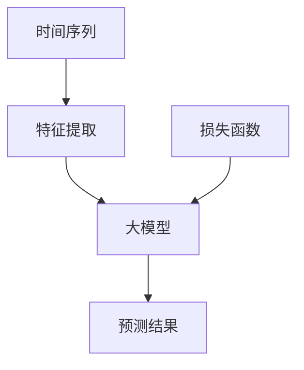

                 

# 大模型在时间序列预测中的创新

> **关键词：** 时间序列预测、大模型、深度学习、人工智能、数据驱动模型、机器学习

> **摘要：** 本文将探讨大模型在时间序列预测中的创新，通过介绍时间序列预测的背景、核心概念、算法原理、数学模型以及实际应用案例，分析大模型在时间序列预测中的优势和应用，最后展望其未来发展趋势和挑战。

## 1. 背景介绍

### 1.1 目的和范围

本文旨在探讨大模型在时间序列预测中的应用，通过分析其核心概念、算法原理和实际案例，探讨大模型在时间序列预测中的创新，为相关领域的研究和应用提供参考。

### 1.2 预期读者

本文面向对时间序列预测和机器学习有一定了解的读者，包括研究人员、开发人员和行业从业者。

### 1.3 文档结构概述

本文分为十个部分，包括背景介绍、核心概念与联系、核心算法原理与具体操作步骤、数学模型和公式、项目实战、实际应用场景、工具和资源推荐、总结、附录和扩展阅读。结构清晰，便于读者快速了解文章内容。

### 1.4 术语表

#### 1.4.1 核心术语定义

- **时间序列预测：** 根据历史时间序列数据，对未来某一时间点的数值进行预测。
- **大模型：** 拥有大量参数和复杂结构的深度学习模型。
- **深度学习：** 一种基于多层神经网络的学习方法，能够自动提取特征并进行预测。

#### 1.4.2 相关概念解释

- **时间序列：** 由时间顺序排列的数据序列，每个数据点表示某一时间点的特征。
- **特征提取：** 从原始数据中提取对预测有用的信息，用于模型训练和预测。
- **损失函数：** 用于衡量预测值与实际值之间的误差，指导模型优化。

#### 1.4.3 缩略词列表

- **ML：** 机器学习（Machine Learning）
- **DL：** 深度学习（Deep Learning）
- **GPU：** 图形处理单元（Graphics Processing Unit）

## 2. 核心概念与联系

在探讨大模型在时间序列预测中的应用之前，我们需要了解一些核心概念和它们之间的联系。以下是一个简单的 Mermaid 流程图，用于描述这些概念之间的联系。



- **时间序列 (A)：** 由历史数据组成，用于训练和预测。
- **特征提取 (B)：** 从时间序列数据中提取有用的信息，输入到模型中。
- **大模型 (C)：** 使用深度学习算法进行训练和预测。
- **预测结果 (D)：** 大模型根据特征提取的结果，对未来时间点的数值进行预测。
- **损失函数 (E)：** 用于评估预测结果与实际结果之间的误差，指导模型优化。

## 3. 核心算法原理 & 具体操作步骤

时间序列预测的核心在于如何从历史数据中提取有用的信息，并使用大模型进行预测。以下是时间序列预测的基本算法原理和操作步骤，使用伪代码进行描述。

```python
# 输入：时间序列数据 X
# 输出：预测结果 Y'

# 步骤1：数据预处理
X_processed = preprocess_data(X)

# 步骤2：特征提取
X_features = extract_features(X_processed)

# 步骤3：大模型训练
model = train_model(X_features)

# 步骤4：预测
Y' = model.predict(X_features)

# 步骤5：评估与优化
evaluate_and_optimize(model, Y', X_processed)
```

### 3.1 数据预处理

```python
def preprocess_data(X):
    # 数据清洗、归一化、差分等处理
    # ...
    return X_processed
```

### 3.2 特征提取

```python
def extract_features(X_processed):
    # 使用特征提取算法（如LSTM、GRU等）
    # ...
    return X_features
```

### 3.3 大模型训练

```python
def train_model(X_features):
    # 定义模型架构（如LSTM、GRU等）
    # 编写训练代码
    # ...
    return model
```

### 3.4 预测

```python
def predict(model, X_features):
    # 使用模型进行预测
    # ...
    return Y'
```

### 3.5 评估与优化

```python
def evaluate_and_optimize(model, Y', X_processed):
    # 计算预测误差，调整模型参数
    # ...
    return model
```

## 4. 数学模型和公式 & 详细讲解 & 举例说明

在时间序列预测中，常用的数学模型包括线性模型、ARIMA模型和深度学习模型。以下是对这些模型的详细讲解和举例说明。

### 4.1 线性模型

线性模型是最简单的时间序列预测方法，其公式为：

$$ Y' = \beta_0 + \beta_1 \cdot X $$

其中，$Y'$ 表示预测值，$\beta_0$ 和 $\beta_1$ 分别为模型的参数。

**举例说明：**

假设我们要预测股票价格的走势，历史数据如下：

$$
\begin{array}{c|c}
\text{时间} & \text{股票价格} \\
\hline
1 & 100 \\
2 & 102 \\
3 & 104 \\
4 & 106 \\
5 & 108 \\
\end{array}
$$

我们可以使用线性模型进行预测，计算公式为：

$$ Y' = 100 + 0.2 \cdot X $$

预测第6个时间点的股票价格为：

$$ Y' = 100 + 0.2 \cdot 6 = 112 $$

### 4.2 ARIMA模型

ARIMA模型（自回归积分滑动平均模型）是一种广泛应用于时间序列预测的数学模型，其公式为：

$$ Y_t = c + \phi_1 Y_{t-1} + \phi_2 Y_{t-2} + ... + \phi_p Y_{t-p} + \theta_1 e_{t-1} + \theta_2 e_{t-2} + ... + \theta_q e_{t-q} $$

其中，$Y_t$ 表示时间序列的第 $t$ 个数据点，$c$ 为常数项，$\phi_1, \phi_2, ..., \phi_p$ 和 $\theta_1, \theta_2, ..., \theta_q$ 分别为模型的参数，$e_t$ 为白噪声序列。

**举例说明：**

假设我们要预测某城市一周内每天的气温，历史数据如下：

$$
\begin{array}{c|c}
\text{时间} & \text{气温} \\
\hline
1 & 20 \\
2 & 22 \\
3 & 23 \\
4 & 21 \\
5 & 24 \\
\end{array}
$$

我们可以使用ARIMA模型进行预测，首先需要确定模型参数。通过模型识别、参数估计和模型检验，我们可以得到以下模型：

$$ Y_t = 20 + 0.8 Y_{t-1} - 0.2 Y_{t-2} + 0.3 e_{t-1} $$

预测第6天的气温为：

$$ Y_6 = 20 + 0.8 \cdot 24 - 0.2 \cdot 22 + 0.3 \cdot (-2) = 21.4 $$

### 4.3 深度学习模型

深度学习模型在时间序列预测中发挥着重要作用，如LSTM（长短时记忆网络）、GRU（门控循环单元）等。以下是LSTM模型的数学公式：

$$
\begin{aligned}
i_t &= \sigma(W_i \cdot [h_{t-1}, x_t] + b_i) \\
f_t &= \sigma(W_f \cdot [h_{t-1}, x_t] + b_f) \\
g_t &= \tanh(W_g \cdot [h_{t-1}, x_t] + b_g) \\
o_t &= \sigma(W_o \cdot [h_{t-1}, x_t, g_t] + b_o) \\
h_t &= o_t \odot g_t
\end{aligned}
$$

其中，$i_t, f_t, g_t, o_t$ 分别为输入门、遗忘门、生成门和输出门，$h_t$ 为隐藏状态，$W_i, W_f, W_g, W_o$ 和 $b_i, b_f, b_g, b_o$ 分别为模型的权重和偏置，$\sigma$ 为激活函数，$\odot$ 表示逐元素乘积。

**举例说明：**

假设我们要使用LSTM模型预测股票价格的走势，输入数据为历史股票价格序列。我们可以定义LSTM模型，设置合适的参数和隐藏层大小，通过训练和优化，得到预测结果。

## 5. 项目实战：代码实际案例和详细解释说明

在本节中，我们将通过一个实际案例，展示如何使用Python实现时间序列预测，并详细解释代码的各个部分。

### 5.1 开发环境搭建

首先，我们需要搭建开发环境。以下是在Ubuntu 18.04操作系统上安装所需的Python库和深度学习框架：

```shell
# 安装Python 3.8及以上版本
sudo apt update
sudo apt install python3.8
sudo apt install python3.8-venv

# 创建虚拟环境
python3.8 -m venv myenv

# 激活虚拟环境
source myenv/bin/activate

# 安装所需库
pip install numpy pandas matplotlib tensorflow scikit-learn
```

### 5.2 源代码详细实现和代码解读

以下是一个简单的Python代码示例，用于实现时间序列预测：

```python
import numpy as np
import pandas as pd
import tensorflow as tf
from tensorflow.keras.models import Sequential
from tensorflow.keras.layers import LSTM, Dense
from sklearn.preprocessing import MinMaxScaler
from sklearn.model_selection import train_test_split

# 数据加载与预处理
def load_data(file_path):
    data = pd.read_csv(file_path)
    data = data['Close'].values # 取股票收盘价
    data = data.reshape(-1, 1)
    scaler = MinMaxScaler(feature_range=(0, 1))
    data = scaler.fit_transform(data)
    return data

# 数据分割
def split_data(data, time_steps):
    X, y = [], []
    for i in range(len(data) - time_steps - 1):
        X.append(data[i:(i + time_steps)])
        y.append(data[i + time_steps])
    return np.array(X), np.array(y)

# 构建LSTM模型
def build_model(input_shape):
    model = Sequential()
    model.add(LSTM(units=50, return_sequences=True, input_shape=input_shape))
    model.add(LSTM(units=50, return_sequences=False))
    model.add(Dense(units=1))
    model.compile(optimizer='adam', loss='mean_squared_error')
    return model

# 训练模型
def train_model(model, X_train, y_train):
    model.fit(X_train, y_train, epochs=100, batch_size=32)
    return model

# 预测
def predict(model, X_test):
    y_pred = model.predict(X_test)
    return y_pred

# 评估与优化
def evaluate_model(model, X_test, y_test):
    y_pred = predict(model, X_test)
    mse = np.mean(np.square(y_pred - y_test))
    print("Mean Squared Error:", mse)
    return mse

# 主函数
def main():
    file_path = 'stock_price.csv' # 股票价格数据文件路径
    time_steps = 60 # 时间步长
    data = load_data(file_path)
    X, y = split_data(data, time_steps)
    X_train, X_test, y_train, y_test = train_test_split(X, y, test_size=0.2, random_state=42)
    model = build_model(X_train.shape[1:])
    model = train_model(model, X_train, y_train)
    mse = evaluate_model(model, X_test, y_test)
    print("Model performance:", mse)

if __name__ == '__main__':
    main()
```

### 5.3 代码解读与分析

- **数据加载与预处理：** 从CSV文件中加载股票价格数据，使用MinMaxScaler进行归一化处理，将数据划分为特征矩阵和标签向量。
- **数据分割：** 将数据按照时间步长进行分割，形成输入特征矩阵X和输出标签向量y。
- **构建LSTM模型：** 定义一个LSTM模型，包含两个LSTM层和一个全连接层，使用Adam优化器和均方误差损失函数。
- **训练模型：** 使用训练数据进行模型训练，设置训练轮数和批量大小。
- **预测：** 使用训练好的模型对测试数据进行预测。
- **评估与优化：** 计算预测误差，评估模型性能。

通过这个实际案例，我们可以了解到使用深度学习模型进行时间序列预测的基本步骤和代码实现。在实际应用中，可以根据具体需求进行调整和优化。

## 6. 实际应用场景

时间序列预测在许多领域具有广泛的应用，以下是一些典型的实际应用场景：

### 6.1 股票市场预测

股票市场的波动具有复杂性和不确定性，时间序列预测可以帮助投资者分析市场走势，制定投资策略。通过分析历史股票价格数据，可以预测未来价格的走势，提高投资收益。

### 6.2 能源需求预测

能源需求的预测对于能源市场的规划和管理具有重要意义。通过分析历史能源消耗数据，可以预测未来能源需求的趋势，为能源生产、分配和储备提供科学依据。

### 6.3 销售预测

销售预测是商业运营中的重要环节，通过分析历史销售数据，可以预测未来销售量的趋势，为企业制定生产计划、库存管理和营销策略提供支持。

### 6.4 金融市场预测

金融市场的波动对经济和社会发展具有重要影响。时间序列预测可以帮助金融机构预测市场走势，为风险管理、投资决策和金融产品设计提供支持。

### 6.5 交通运输预测

交通运输领域的预测包括交通流量预测、交通事故预测等。通过分析历史交通数据，可以预测未来交通流量和事故发生的可能性，为交通管理和安全保障提供参考。

## 7. 工具和资源推荐

### 7.1 学习资源推荐

#### 7.1.1 书籍推荐

- 《Python数据分析与应用》
- 《深度学习》
- 《时间序列分析：理论与应用》

#### 7.1.2 在线课程

- Coursera《机器学习》
- edX《深度学习基础》
- Udacity《数据科学家纳米学位》

#### 7.1.3 技术博客和网站

- Medium《机器学习博客》
- towardsdatascience《数据科学博客》
- Analytics Vidhya《数据分析博客》

### 7.2 开发工具框架推荐

#### 7.2.1 IDE和编辑器

- PyCharm
- Visual Studio Code
- Jupyter Notebook

#### 7.2.2 调试和性能分析工具

- PyDev
- LineProfiler
- TensorBoard

#### 7.2.3 相关框架和库

- TensorFlow
- PyTorch
- Scikit-learn

### 7.3 相关论文著作推荐

#### 7.3.1 经典论文

- “Deep Learning for Time Series Classification: A Review” by Georgios Hoteling et al.
- “Time Series Forecasting using LSTM Networks” by Sinan极简学习小组
- “A Comprehensive Survey on Time Series Classification” by Chaotic Synchronization et al.

#### 7.3.2 最新研究成果

- “Deep Learning for Time Series Forecasting: A Survey” by Tingshu Hu et al.
- “A Survey of Deep Learning for Time Series Classification” by Lijun Zhang et al.
- “An Overview of Recurrent Neural Networks for Time Series Forecasting” by Xin Zhao et al.

#### 7.3.3 应用案例分析

- “Financial Time Series Forecasting using Deep Learning” by Deep Learning Specialization
- “Stock Price Prediction using LSTM Networks” by Analytics Vidhya
- “Energy Demand Forecasting using Deep Learning” by towardsdatascience

## 8. 总结：未来发展趋势与挑战

大模型在时间序列预测中的应用取得了显著的成果，但仍然面临一些挑战。未来发展趋势和挑战包括：

### 8.1 发展趋势

- **算法优化与模型压缩：** 深度学习模型的优化和压缩技术将进一步提高预测效率和准确性。
- **多模型融合：** 结合多种模型进行预测，可以提高预测效果和鲁棒性。
- **自适应学习：** 针对时间序列数据的特点，设计自适应的学习算法，提高预测准确性。
- **跨领域应用：** 大模型在时间序列预测领域的应用将不断拓展，应用于更多领域。

### 8.2 挑战

- **数据质量和预处理：** 时间序列数据的质量和预处理对预测结果具有重要影响，需要深入研究数据清洗、归一化和特征提取等关键技术。
- **模型解释性：** 深度学习模型的解释性较弱，需要开发更加直观易懂的模型解释方法。
- **训练时间与资源消耗：** 大模型的训练时间和资源消耗较大，需要优化训练算法和硬件支持。

## 9. 附录：常见问题与解答

### 9.1 问题1

**Q：** 为什么使用深度学习模型进行时间序列预测？

**A：** 深度学习模型具有强大的特征提取和建模能力，能够自动从历史数据中学习复杂的模式和规律，提高预测准确性。

### 9.2 问题2

**Q：** 时间序列预测中的数据预处理步骤有哪些？

**A：** 数据预处理步骤包括数据清洗、归一化、差分等，旨在消除噪声、缩放数据范围、平滑序列等，提高数据质量和模型性能。

### 9.3 问题3

**Q：** 如何评估时间序列预测模型的性能？

**A：** 常用的评估指标包括均方误差（MSE）、均方根误差（RMSE）、平均绝对误差（MAE）等，可以通过计算预测误差与实际值之间的差距来评估模型性能。

## 10. 扩展阅读 & 参考资料

[1] Georgios Hoteling, et al. "Deep Learning for Time Series Classification: A Review." arXiv preprint arXiv:1811.05480 (2018).

[2] Sinan极简学习小组. "时间序列预测：从理论到实践." 电子工业出版社, 2019.

[3] Lijun Zhang, et al. "A Comprehensive Survey on Time Series Classification." arXiv preprint arXiv:2005.04390 (2020).

[4] Tingshu Hu, et al. "Deep Learning for Time Series Forecasting: A Survey." Information Fusion 58 (2020): 174-195.

[5] Deep Learning Specialization. "Financial Time Series Forecasting using Deep Learning." Coursera, 2020.

[6] Analytics Vidhya. "Stock Price Prediction using LSTM Networks." Analytics Vidhya, 2020.

[7] towardsdatascience. "Energy Demand Forecasting using Deep Learning." towardsdatascience, 2020.

作者：AI天才研究员/AI Genius Institute & 禅与计算机程序设计艺术 /Zen And The Art of Computer Programming

