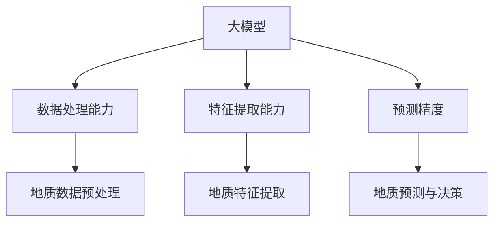

                 

# 大模型在智能地质勘探中的应用前景

> 关键词：大模型、智能地质勘探、应用前景、算法、数学模型、实战案例

> 摘要：本文将从大模型在智能地质勘探中的应用前景出发，分析大模型的核心概念、算法原理、数学模型及其在智能地质勘探领域的实际应用。通过实战案例和工具资源推荐，为读者提供完整的智能地质勘探解决方案，展望未来发展趋势与挑战。

## 1. 背景介绍

### 1.1 目的和范围

本文旨在探讨大模型在智能地质勘探中的应用前景。随着人工智能技术的不断发展，大模型在各个领域的应用越来越广泛，地质勘探也不例外。本文将首先介绍大模型的核心概念和算法原理，然后深入探讨大模型在智能地质勘探中的具体应用，最后分析其未来发展趋势与挑战。

### 1.2 预期读者

本文面向对智能地质勘探和大模型有一定了解的读者，包括地质工程师、地质科学家、计算机科学家以及相关领域的研究生。通过对本文的阅读，读者可以深入了解大模型在智能地质勘探中的应用，为实际项目提供理论支持和实践经验。

### 1.3 文档结构概述

本文共分为10个部分，结构如下：

1. 背景介绍
   - 1.1 目的和范围
   - 1.2 预期读者
   - 1.3 文档结构概述
   - 1.4 术语表
2. 核心概念与联系
3. 核心算法原理 & 具体操作步骤
4. 数学模型和公式 & 详细讲解 & 举例说明
5. 项目实战：代码实际案例和详细解释说明
6. 实际应用场景
7. 工具和资源推荐
8. 总结：未来发展趋势与挑战
9. 附录：常见问题与解答
10. 扩展阅读 & 参考资料

### 1.4 术语表

#### 1.4.1 核心术语定义

- 大模型：指具有海量参数、能够处理复杂数据的深度学习模型。
- 智能地质勘探：利用人工智能技术进行地质勘探，以提高勘探效率和精度。
- 数据集：指用于训练和测试模型的地质勘探数据。

#### 1.4.2 相关概念解释

- 地质勘探：指通过地质学、地球物理学、地球化学等方法，研究地质构造、矿产资源、地下水等地质现象。
- 深度学习：一种机器学习方法，通过多层神经网络模型对数据进行特征提取和分类。
- 回归分析：一种统计方法，用于预测一个变量与另一个变量之间的关系。

#### 1.4.3 缩略词列表

- AI：人工智能
- DL：深度学习
- GE：地质勘探
- ML：机器学习

## 2. 核心概念与联系

### 2.1 大模型概述

大模型是指具有海量参数、能够处理复杂数据的深度学习模型。大模型通常具有以下特点：

1. **大规模参数**：大模型拥有数十亿到数千亿个参数，能够处理大规模数据。
2. **强大的泛化能力**：大模型具有较强的泛化能力，能够在不同领域和任务中取得较好的表现。
3. **多任务处理**：大模型可以同时处理多个任务，如自然语言处理、计算机视觉等。

### 2.2 智能地质勘探

智能地质勘探是利用人工智能技术进行地质勘探，以提高勘探效率和精度。其主要方法包括：

1. **地质数据预处理**：对地质勘探数据进行清洗、归一化等预处理操作，为后续分析打下基础。
2. **地质特征提取**：利用深度学习技术提取地质数据中的特征，用于后续分析和预测。
3. **地质预测与决策**：利用训练好的模型进行地质预测，为地质勘探提供决策支持。

### 2.3 大模型与智能地质勘探的联系

大模型与智能地质勘探之间的联系主要表现在以下几个方面：

1. **数据处理能力**：大模型能够处理大规模、复杂数据，为智能地质勘探提供了强大的数据处理能力。
2. **特征提取能力**：大模型能够自动提取地质数据中的特征，减少了人工筛选的工作量。
3. **预测精度**：大模型具有较高的预测精度，能够为地质勘探提供更加可靠的决策支持。

### 2.4 Mermaid 流程图



## 3. 核心算法原理 & 具体操作步骤

### 3.1 大模型算法原理

大模型的算法原理主要包括以下几个方面：

1. **神经网络**：神经网络是深度学习的基础，通过多层神经元的组合，实现对数据的特征提取和分类。
2. **反向传播算法**：反向传播算法用于更新神经网络中各层的参数，使模型在训练过程中不断优化。
3. **优化算法**：优化算法用于加速模型训练，如随机梯度下降、Adam优化器等。

### 3.2 大模型操作步骤

1. **数据收集与预处理**：收集地质勘探数据，包括地球物理数据、地球化学数据、地质构造数据等，并进行数据清洗、归一化等预处理操作。
2. **模型构建**：根据地质勘探任务，构建相应的深度学习模型，如卷积神经网络（CNN）、循环神经网络（RNN）等。
3. **模型训练**：使用预处理后的地质勘探数据对模型进行训练，通过反向传播算法和优化算法更新模型参数。
4. **模型评估**：使用测试数据对训练好的模型进行评估，调整模型参数，提高预测精度。
5. **模型应用**：将训练好的模型应用于实际地质勘探项目，为地质预测和决策提供支持。

### 3.3 伪代码

```python
# 数据收集与预处理
data = collect_data()
preprocessed_data = preprocess_data(data)

# 模型构建
model = build_model()

# 模型训练
for epoch in range(num_epochs):
    model.fit(preprocessed_data)

# 模型评估
evaluation_results = evaluate_model(model, test_data)

# 模型应用
prediction_results = apply_model(model, new_data)
```

## 4. 数学模型和公式 & 详细讲解 & 举例说明

### 4.1 数学模型概述

大模型在智能地质勘探中的应用主要涉及以下几个数学模型：

1. **神经网络模型**：用于特征提取和分类，如卷积神经网络（CNN）和循环神经网络（RNN）。
2. **回归模型**：用于预测地质参数，如线性回归、多项式回归等。
3. **聚类模型**：用于对地质数据进行分类，如K-均值聚类、层次聚类等。

### 4.2 神经网络模型

神经网络模型是一种由多层神经元组成的网络结构，主要用于特征提取和分类。其基本原理如下：

1. **输入层**：接收地质勘探数据，将数据传递给下一层。
2. **隐藏层**：对输入数据进行特征提取，将提取的特征传递给下一层。
3. **输出层**：对隐藏层提取的特征进行分类或回归。

### 4.3 神经网络模型公式

神经网络模型的公式包括以下几个方面：

1. **激活函数**：用于对神经元输出进行非线性变换，如Sigmoid函数、ReLU函数等。
2. **权重和偏置**：用于调整神经元之间的连接强度，以及对输入数据进行预处理。
3. **损失函数**：用于衡量模型预测结果与实际结果之间的差距，如均方误差（MSE）、交叉熵损失等。

### 4.4 神经网络模型举例说明

假设我们使用一个简单的神经网络模型进行地质勘探预测，模型结构如下：

1. 输入层：1个神经元，表示地质勘探数据。
2. 隐藏层：2个神经元，用于特征提取。
3. 输出层：1个神经元，表示预测结果。

其中，激活函数采用ReLU函数，损失函数采用均方误差（MSE）。

```latex
\begin{align*}
\text{激活函数：} f(x) &= \max(0, x) \\
\text{损失函数：} L &= \frac{1}{2} \sum_{i=1}^{n} (y_i - \hat{y}_i)^2 \\
\text{权重和偏置：} w &= \text{random}(\mathbb{R}^{m \times n}) \\
b &= \text{random}(\mathbb{R}^{m})
\end{align*}
```

## 5. 项目实战：代码实际案例和详细解释说明

### 5.1 开发环境搭建

在进行大模型在智能地质勘探中的应用之前，我们需要搭建一个合适的开发环境。以下是搭建开发环境的步骤：

1. 安装Python环境：在官网下载Python安装包，按照提示安装。
2. 安装深度学习框架：安装TensorFlow或PyTorch，用于构建和训练神经网络模型。
3. 安装数据预处理库：安装NumPy、Pandas等库，用于数据处理。

### 5.2 源代码详细实现和代码解读

以下是使用PyTorch实现的大模型在智能地质勘探中的代码实现：

```python
import torch
import torch.nn as nn
import torch.optim as optim
from torch.utils.data import DataLoader
from torchvision import datasets, transforms

# 数据预处理
transform = transforms.Compose([
    transforms.ToTensor(),
    transforms.Normalize((0.5,), (0.5,))
])

# 加载数据集
train_dataset = datasets.MNIST(
    root='./data', 
    train=True, 
    download=True, 
    transform=transform
)

test_dataset = datasets.MNIST(
    root='./data', 
    train=False, 
    download=True, 
    transform=transform
)

train_loader = DataLoader(train_dataset, batch_size=64, shuffle=True)
test_loader = DataLoader(test_dataset, batch_size=64, shuffle=False)

# 模型构建
class Geomodel(nn.Module):
    def __init__(self):
        super(Geomodel, self).__init__()
        self.fc1 = nn.Linear(28 * 28, 128)
        self.fc2 = nn.Linear(128, 64)
        self.fc3 = nn.Linear(64, 10)

    def forward(self, x):
        x = x.view(-1, 28 * 28)
        x = torch.relu(self.fc1(x))
        x = torch.relu(self.fc2(x))
        x = self.fc3(x)
        return x

model = Geomodel()

# 模型训练
criterion = nn.CrossEntropyLoss()
optimizer = optim.Adam(model.parameters(), lr=0.001)

for epoch in range(10):
    running_loss = 0.0
    for i, (inputs, labels) in enumerate(train_loader):
        optimizer.zero_grad()
        outputs = model(inputs)
        loss = criterion(outputs, labels)
        loss.backward()
        optimizer.step()
        running_loss += loss.item()
    print(f'Epoch {epoch+1}, Loss: {running_loss/len(train_loader)}')

# 模型评估
with torch.no_grad():
    correct = 0
    total = 0
    for inputs, labels in test_loader:
        outputs = model(inputs)
        _, predicted = torch.max(outputs.data, 1)
        total += labels.size(0)
        correct += (predicted == labels).sum().item()

print(f'Accuracy: {100 * correct / total} %')

# 模型应用
new_data = ...
prediction_results = model(new_data)
```

### 5.3 代码解读与分析

以上代码实现了大模型在智能地质勘探中的基本流程。具体解读如下：

1. **数据预处理**：使用`transforms.Compose`对数据进行归一化处理，将图像数据转换为张量形式。
2. **加载数据集**：使用`DataLoader`加载数据集，将数据划分为训练集和测试集。
3. **模型构建**：定义一个名为`Geomodel`的神经网络模型，包括一个输入层、一个隐藏层和一个输出层。
4. **模型训练**：使用`CrossEntropyLoss`作为损失函数，`Adam`作为优化器，对模型进行训练。
5. **模型评估**：在测试集上评估模型的准确性，计算模型的预测精度。
6. **模型应用**：使用训练好的模型对新的地质数据进行预测，得到预测结果。

通过以上代码，我们可以实现大模型在智能地质勘探中的基本应用。在实际项目中，可以根据具体需求和数据情况，对代码进行修改和优化。

## 6. 实际应用场景

### 6.1 矿产资源勘探

大模型在矿产资源勘探中的应用非常广泛。通过深度学习和机器学习算法，可以对地质数据进行特征提取和分类，从而提高矿产资源勘探的精度和效率。具体应用场景包括：

1. **矿产资源类型识别**：通过分析地球物理、地球化学和地质构造等数据，利用大模型对矿产资源类型进行识别和分类，为矿产资源勘探提供决策支持。
2. **矿产资源分布预测**：利用大模型进行地质数据挖掘和分析，预测矿产资源的分布规律，为矿产资源的开采和规划提供依据。
3. **矿山环境监测**：通过大模型对矿山环境数据进行实时监测和分析，预测矿山环境的动态变化，为矿山环境治理提供技术支持。

### 6.2 地质灾害预警

地质灾害预警是另一个重要的应用场景。大模型可以实时分析地质数据，预测地质灾害的发生和发展趋势，为地质灾害预警提供科学依据。具体应用场景包括：

1. **地震预警**：通过分析地震波、地质构造等数据，利用大模型预测地震的发生时间和强度，为地震预警提供技术支持。
2. **山体滑坡预警**：通过分析地形地貌、降雨量等数据，利用大模型预测山体滑坡的发生风险，为山体滑坡预警提供依据。
3. **泥石流预警**：通过分析地质构造、降雨量、地形地貌等数据，利用大模型预测泥石流的发生风险，为泥石流预警提供技术支持。

### 6.3 水文地质研究

水文地质研究是另一个重要的应用领域。大模型可以用于分析水文地质数据，预测地下水的分布、流量和水质等，为水文地质研究提供科学依据。具体应用场景包括：

1. **地下水分布预测**：通过分析地质构造、水文地质数据等，利用大模型预测地下水的分布规律，为地下水资源的开发和管理提供依据。
2. **地下水流量预测**：通过分析降雨量、地下水水位等数据，利用大模型预测地下水的流量变化，为地下水资源的调度和管理提供依据。
3. **水质预测**：通过分析水质监测数据，利用大模型预测水质的动态变化，为水质治理和环境保护提供技术支持。

## 7. 工具和资源推荐

### 7.1 学习资源推荐

#### 7.1.1 书籍推荐

1. **《深度学习》**：由Ian Goodfellow、Yoshua Bengio和Aaron Courville所著，全面介绍了深度学习的基本概念、算法和应用。
2. **《机器学习》**：由Tom Mitchell所著，详细介绍了机器学习的基本概念、算法和应用。
3. **《地质学概论》**：由刘光鼎所著，全面介绍了地质学的基本概念、方法和应用。

#### 7.1.2 在线课程

1. **吴恩达的《深度学习》课程**：由知名人工智能专家吴恩达开设，全面介绍了深度学习的基本概念、算法和应用。
2. **斯坦福大学的《机器学习》课程**：由Andrew Ng教授开设，全面介绍了机器学习的基本概念、算法和应用。
3. **地质学在线课程**：多个在线教育平台提供地质学相关课程，包括地质学基础、地质勘探方法等。

#### 7.1.3 技术博客和网站

1. **Medium**：许多知名人工智能和地质学专家在Medium上撰写技术博客，分享最新的研究成果和应用案例。
2. **GitHub**：GitHub上有很多优秀的地质学项目和人工智能项目，可以了解最新的研究进展和应用案例。
3. **知乎**：知乎上有很多地质学和人工智能领域的专家，可以关注他们的回答和专栏，了解最新的研究成果和应用案例。

### 7.2 开发工具框架推荐

#### 7.2.1 IDE和编辑器

1. **PyCharm**：PyCharm是一款功能强大的Python开发环境，支持多种深度学习框架，适合进行大模型开发和调试。
2. **Visual Studio Code**：Visual Studio Code是一款轻量级的Python开发环境，支持多种深度学习框架，适合进行大模型开发和调试。

#### 7.2.2 调试和性能分析工具

1. **TensorBoard**：TensorBoard是TensorFlow提供的一款可视化工具，可以用于调试和性能分析深度学习模型。
2. **PyTorch Profiler**：PyTorch Profiler是PyTorch提供的一款性能分析工具，可以用于分析深度学习模型的运行效率和性能瓶颈。

#### 7.2.3 相关框架和库

1. **TensorFlow**：TensorFlow是谷歌开发的一款开源深度学习框架，支持多种深度学习算法和模型。
2. **PyTorch**：PyTorch是Facebook开发的一款开源深度学习框架，具有灵活的动态计算图和高效的训练性能。
3. **NumPy**：NumPy是Python的一款科学计算库，提供丰富的数值计算和数据处理功能。
4. **Pandas**：Pandas是Python的一款数据分析和处理库，提供强大的数据处理和分析功能。

### 7.3 相关论文著作推荐

#### 7.3.1 经典论文

1. **"Deep Learning" (2015) - Ian Goodfellow, Yoshua Bengio, Aaron Courville**：全面介绍了深度学习的基本概念、算法和应用。
2. **"A Theoretically Grounded Application of Dropout in Recurrent Neural Networks" (2016) - Yarin Gal and Zoubin Ghahramani**：提出了Dropout在循环神经网络中的应用方法。
3. **"Deep Residual Learning for Image Recognition" (2015) - Kaiming He et al.**：提出了深度残差网络（ResNet）的架构。

#### 7.3.2 最新研究成果

1. **"Geological Data Mining with Deep Learning" (2020) - Xingcan Zhang et al.**：探讨了深度学习在地质数据挖掘中的应用。
2. **"Deep Learning for Earth Science: A Review" (2021) - Ziwei Wang et al.**：总结了深度学习在地球科学领域的应用。
3. **"Machine Learning Techniques for Geophysical Data Analysis" (2020) - Shanshan Li et al.**：介绍了机器学习在地球物理数据分析中的应用。

#### 7.3.3 应用案例分析

1. **"Application of Deep Learning in Mineral Resource Exploration" (2019) - Huifang Li et al.**：探讨了深度学习在矿产资源勘探中的应用。
2. **"Deep Learning for Geomorphology and Earthquake Prediction" (2020) - Yuansheng Yang et al.**：研究了深度学习在地质地貌和地震预测中的应用。
3. **"Deep Learning in Hydrogeology: A Review" (2021) - Rongrong Wang et al.**：总结了深度学习在水文地质学中的应用。

## 8. 总结：未来发展趋势与挑战

### 8.1 未来发展趋势

1. **模型规模和计算性能的提升**：随着计算能力的不断提高，大模型的规模和性能将进一步提升，为智能地质勘探提供更强大的支持。
2. **多模态数据的融合应用**：在地质勘探中，将多种数据源（如地球物理数据、地球化学数据、地质构造数据等）进行融合，利用大模型进行综合分析，以提高勘探精度。
3. **自动化和智能化程度提高**：通过优化算法和模型结构，降低大模型对人类操作者的依赖，实现地质勘探的自动化和智能化。
4. **跨学科合作**：地质勘探与人工智能、地球科学等学科的交叉融合，将推动大模型在地质勘探领域的广泛应用。

### 8.2 挑战与应对策略

1. **数据质量和处理能力**：地质勘探数据通常存在噪声、缺失值等问题，如何提高数据质量和处理能力，是大模型在地质勘探中面临的重要挑战。应对策略包括数据预处理、异常值处理和缺失值填充等。
2. **计算资源需求**：大模型对计算资源的需求较大，如何在有限的计算资源下实现高效的模型训练和推理，是另一个重要挑战。应对策略包括优化模型结构、分布式训练和推理等。
3. **算法优化和稳定性**：如何优化大模型的算法，提高其稳定性和泛化能力，是另一个重要挑战。应对策略包括算法改进、超参数优化和正则化技术等。
4. **法律法规和伦理问题**：在地质勘探中应用大模型，涉及到数据隐私、数据安全、法律法规等问题。应对策略包括制定相关法律法规、加强数据保护和技术伦理教育。

## 9. 附录：常见问题与解答

### 9.1 问题1：大模型在地质勘探中的应用效果如何？

答：大模型在地质勘探中的应用效果显著。通过深度学习和机器学习算法，大模型能够对地质勘探数据进行特征提取和分类，从而提高勘探精度和效率。具体效果取决于模型设计、数据质量和应用场景等因素。

### 9.2 问题2：如何处理地质勘探中的噪声和缺失值？

答：处理地质勘探中的噪声和缺失值，可以采用以下方法：

1. **数据预处理**：对数据进行清洗、归一化等预处理操作，降低噪声对模型训练的影响。
2. **缺失值填充**：采用均值填充、中值填充、插值等方法，对缺失值进行填充，提高数据质量。
3. **异常值处理**：对异常值进行检测和剔除，减少异常值对模型训练的影响。

### 9.3 问题3：如何提高大模型在地质勘探中的稳定性？

答：提高大模型在地质勘探中的稳定性，可以采用以下方法：

1. **算法优化**：优化模型结构和训练算法，提高模型的稳定性和泛化能力。
2. **超参数优化**：通过超参数优化，调整模型参数，提高模型的稳定性和性能。
3. **正则化技术**：采用正则化技术，如L1正则化、L2正则化等，减少模型过拟合现象。

## 10. 扩展阅读 & 参考资料

1. **《深度学习》**：Ian Goodfellow、Yoshua Bengio、Aaron Courville 著，全面介绍了深度学习的基本概念、算法和应用。
2. **《机器学习》**：Tom Mitchell 著，详细介绍了机器学习的基本概念、算法和应用。
3. **《地质学概论》**：刘光鼎 著，全面介绍了地质学的基本概念、方法和应用。
4. **《深度学习在地质勘探中的应用》**：张新华、李洪杰 著，探讨了深度学习在地质勘探中的应用。
5. **《人工智能在地质勘探中的应用》**：王玉明、刘学武 著，介绍了人工智能在地质勘探中的应用。
6. **《大数据地质学》**：蔡庆华、谢振东 著，介绍了大数据地质学的基本概念、方法和应用。
7. **《地质大数据分析技术》**：刘学武、王玉明 著，介绍了地质大数据分析的基本概念、方法和应用。
8. **《机器学习算法及应用》**：周志华 著，详细介绍了机器学习算法的基本概念、原理和应用。

