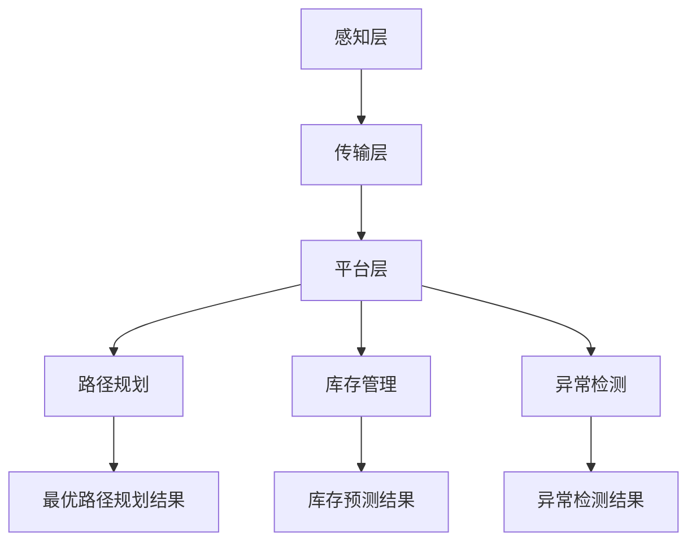
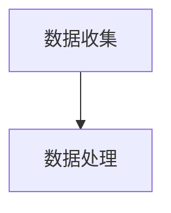
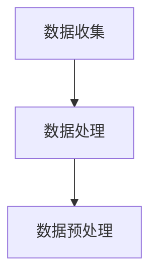
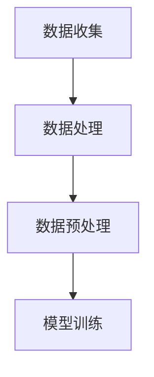
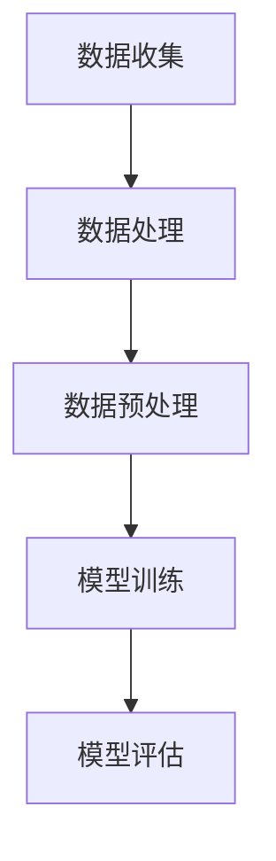
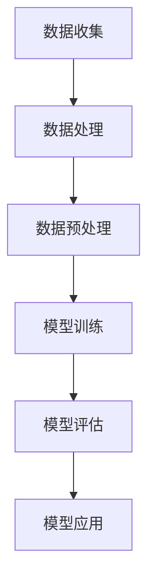

                 

# 大模型在智能物流领域的创新应用

> **关键词**：大模型，智能物流，创新应用，算法原理，数学模型，实战案例

> **摘要**：本文将深入探讨大模型在智能物流领域的创新应用，从背景介绍、核心概念、算法原理、数学模型、实战案例以及未来发展趋势等方面进行详细分析，旨在为读者提供一个全面的技术视角，了解大模型在智能物流中的巨大潜力。

## 1. 背景介绍

### 1.1 目的和范围

本文旨在介绍大模型在智能物流领域的创新应用，分析其核心概念、算法原理和数学模型，并通过实战案例展示其实际效果。我们将从以下几个方面展开讨论：

- **智能物流的背景和发展**：介绍智能物流的概念、重要性以及当前的发展状况。
- **大模型的定义和特点**：阐述大模型的概念、特点以及其在人工智能领域的应用。
- **大模型在智能物流中的应用**：分析大模型在智能物流中的创新应用，包括路径规划、库存管理、异常检测等。
- **算法原理和数学模型**：详细讲解大模型在智能物流中的应用算法原理和数学模型。
- **实战案例**：通过实际案例展示大模型在智能物流中的实际应用效果。
- **未来发展趋势与挑战**：探讨大模型在智能物流领域的未来发展趋势和面临的挑战。

### 1.2 预期读者

本文面向的读者主要包括：

- **智能物流领域的研究人员**：希望了解大模型在智能物流中的应用和发展。
- **人工智能领域的研究人员**：关注大模型在各个领域的应用，特别是智能物流领域。
- **软件开发工程师**：希望了解大模型在智能物流领域的实际应用和开发技巧。
- **企业决策者**：关注智能物流领域的技术发展和应用，为企业决策提供参考。

### 1.3 文档结构概述

本文将按照以下结构进行组织：

- **1. 背景介绍**：介绍智能物流的背景、大模型的特点和应用。
- **2. 核心概念与联系**：讲解大模型在智能物流领域的核心概念和联系。
- **3. 核心算法原理 & 具体操作步骤**：详细阐述大模型在智能物流中的应用算法原理和操作步骤。
- **4. 数学模型和公式 & 详细讲解 & 举例说明**：介绍大模型在智能物流中的数学模型和公式，并通过实例进行详细讲解。
- **5. 项目实战：代码实际案例和详细解释说明**：通过实际案例展示大模型在智能物流中的应用。
- **6. 实际应用场景**：分析大模型在智能物流中的实际应用场景。
- **7. 工具和资源推荐**：推荐学习资源和开发工具。
- **8. 总结：未来发展趋势与挑战**：总结大模型在智能物流领域的未来发展趋势和挑战。
- **9. 附录：常见问题与解答**：提供常见问题的解答。
- **10. 扩展阅读 & 参考资料**：推荐相关阅读资料。

### 1.4 术语表

#### 1.4.1 核心术语定义

- **智能物流**：利用信息技术、物联网、大数据等技术实现物流过程中的自动化、智能化管理。
- **大模型**：具有巨大参数量和计算能力的人工神经网络模型，如GPT、BERT等。
- **路径规划**：确定物流运输过程中最优路径的过程。
- **库存管理**：对物流过程中的库存进行监控和管理。
- **异常检测**：识别物流过程中的异常情况，如货物损坏、运输延误等。

#### 1.4.2 相关概念解释

- **深度学习**：一种人工智能技术，通过模拟人脑神经元结构，实现对数据的自动学习和特征提取。
- **卷积神经网络（CNN）**：一种深度学习模型，主要用于图像和视频数据的处理。
- **循环神经网络（RNN）**：一种深度学习模型，主要用于序列数据的处理。

#### 1.4.3 缩略词列表

- **AI**：人工智能（Artificial Intelligence）
- **IoT**：物联网（Internet of Things）
- **ML**：机器学习（Machine Learning）
- **DL**：深度学习（Deep Learning）
- **NLP**：自然语言处理（Natural Language Processing）

## 2. 核心概念与联系

### 2.1 智能物流

智能物流是指利用信息技术、物联网、大数据等技术实现物流过程中的自动化、智能化管理。智能物流的核心目标是提高物流效率，降低物流成本，提升物流服务质量。智能物流的发展离不开以下几个核心概念：

- **物联网（IoT）**：通过将各种物体（如传感器、车辆、仓库等）连接到互联网，实现对物流过程中各种信息的实时监控和传输。
- **大数据（Big Data）**：通过收集、存储、分析和处理大量的物流数据，为智能物流提供数据支持和决策依据。
- **人工智能（AI）**：利用机器学习、深度学习等技术，对物流过程中的数据进行自动分析和决策。

智能物流的架构可以分为以下几个层次：

1. **感知层**：包括各种传感器和设备，用于收集物流过程中的数据，如货物位置、运输状态、设备运行状态等。
2. **传输层**：通过物联网技术将感知层收集到的数据传输到云端或数据中心。
3. **平台层**：基于大数据和人工智能技术，对传输层的数据进行处理、分析和决策，实现物流过程中的自动化和智能化管理。
4. **应用层**：为用户提供各种物流服务，如路径规划、库存管理、异常检测等。

### 2.2 大模型

大模型是指具有巨大参数量和计算能力的人工神经网络模型，如GPT、BERT等。大模型在人工智能领域具有广泛的应用，其核心特点如下：

- **参数量巨大**：大模型具有数百万甚至数亿个参数，能够对大量数据进行建模和预测。
- **计算能力强大**：大模型需要强大的计算资源，如GPU、TPU等，以支持其训练和推理过程。
- **自适应性强**：大模型能够通过不断学习，自动调整模型参数，以适应不同的数据和应用场景。

大模型在人工智能领域的应用可以分为以下几个方向：

- **自然语言处理（NLP）**：如文本生成、机器翻译、情感分析等。
- **计算机视觉**：如图像识别、目标检测、图像生成等。
- **语音识别**：如语音识别、语音合成等。
- **智能物流**：如路径规划、库存管理、异常检测等。

### 2.3 大模型在智能物流中的应用

大模型在智能物流中的应用主要体现在以下几个方面：

- **路径规划**：利用大模型进行路径规划，能够考虑更多的因素，如交通状况、货物类型、运输时间等，实现最优路径规划。
- **库存管理**：利用大模型进行库存预测和优化，能够准确预测库存需求，降低库存成本，提高物流效率。
- **异常检测**：利用大模型进行异常检测，能够快速识别物流过程中的异常情况，如货物损坏、运输延误等，及时采取应对措施。

下面是一个简单的 Mermaid 流程图，展示大模型在智能物流中的应用架构：



## 3. 核心算法原理 & 具体操作步骤

### 3.1 大模型算法原理

大模型的核心算法原理是基于深度学习，特别是基于神经网络的模型。深度学习是一种模拟人脑神经元结构，通过多层神经网络对数据进行自动学习和特征提取的技术。大模型具有以下特点：

- **多层神经网络**：大模型通常具有多个隐藏层，能够对数据进行多层次的抽象和特征提取。
- **反向传播算法**：大模型通过反向传播算法对模型参数进行优化，以降低损失函数。
- **激活函数**：大模型中的每个神经元通常使用激活函数，如ReLU、Sigmoid、Tanh等，以增加模型的非线性能力。
- **批量归一化**：大模型中的每个隐藏层通常使用批量归一化，以提高训练速度和模型的泛化能力。

### 3.2 大模型在智能物流中的应用步骤

大模型在智能物流中的应用可以分为以下几个步骤：

#### 步骤 1：数据收集

首先，需要收集智能物流过程中的各种数据，如货物位置、运输状态、交通状况、库存信息等。这些数据可以通过传感器、物联网设备等实时收集。



#### 步骤 2：数据处理

对收集到的数据进行预处理，包括数据清洗、数据去重、数据转换等操作，以得到高质量的训练数据。



#### 步骤 3：模型训练

使用预处理后的数据训练大模型，通过反向传播算法对模型参数进行优化，以降低损失函数。



#### 步骤 4：模型评估

使用测试数据对训练好的模型进行评估，通过计算模型在测试数据上的损失函数，评估模型的性能。



#### 步骤 5：模型应用

将训练好的模型应用到智能物流的实际场景中，如路径规划、库存管理、异常检测等，实现智能物流的自动化和智能化管理。



### 3.3 伪代码实现

以下是使用Python实现大模型在智能物流中应用步骤的伪代码：

```python
# 步骤 1：数据收集
def data_collection():
    # 收集货物位置、运输状态、交通状况、库存信息等数据
    data = collect_data()
    return data

# 步骤 2：数据处理
def data_preprocessing(data):
    # 数据清洗、去重、转换等操作
    processed_data = preprocess_data(data)
    return processed_data

# 步骤 3：模型训练
def model_training(processed_data):
    # 训练大模型
    model = train_model(processed_data)
    return model

# 步骤 4：模型评估
def model_evaluation(model, test_data):
    # 评估模型性能
    performance = evaluate_model(model, test_data)
    return performance

# 步骤 5：模型应用
def model_application(model):
    # 应用模型到实际场景
    application_result = apply_model(model)
    return application_result

# 主函数
def main():
    data = data_collection()
    processed_data = data_preprocessing(data)
    model = model_training(processed_data)
    performance = model_evaluation(model, test_data)
    application_result = model_application(model)
    print("模型应用结果：", application_result)

if __name__ == "__main__":
    main()
```

## 4. 数学模型和公式 & 详细讲解 & 举例说明

### 4.1 数学模型

大模型在智能物流中的应用主要基于深度学习算法，其中最常用的模型是深度神经网络（DNN）。DNN 的基本结构包括输入层、隐藏层和输出层。输入层接收外部输入数据，隐藏层进行特征提取和变换，输出层生成预测结果。

#### 4.1.1 输入层

输入层接收外部输入数据，如货物位置、运输状态、交通状况、库存信息等。输入层的数据通常表示为向量，维度为 $D_x$。

$$
x = \begin{bmatrix}
x_1 \\
x_2 \\
\vdots \\
x_D
\end{bmatrix}
$$

其中，$x_i$ 表示第 $i$ 个输入特征。

#### 4.1.2 隐藏层

隐藏层对输入数据进行特征提取和变换。每个隐藏层包含多个神经元，每个神经元通过加权连接输入层的神经元，并使用激活函数进行非线性变换。隐藏层可以有多层，每层之间的神经元连接方式可以是全连接或者卷积连接。

隐藏层的输出可以表示为：

$$
h_l = \sigma(W_l \cdot x + b_l)
$$

其中，$h_l$ 表示第 $l$ 层的输出，$\sigma$ 表示激活函数（如ReLU、Sigmoid、Tanh等），$W_l$ 表示第 $l$ 层的权重矩阵，$b_l$ 表示第 $l$ 层的偏置向量。

#### 4.1.3 输出层

输出层生成预测结果。输出层的神经元数量和类型取决于具体的任务，如分类、回归等。输出层的输出可以表示为：

$$
y = \sigma(W_y \cdot h_L + b_y)
$$

其中，$y$ 表示输出结果，$h_L$ 表示隐藏层的输出，$W_y$ 表示输出层的权重矩阵，$b_y$ 表示输出层的偏置向量。

### 4.2 激活函数

激活函数是深度神经网络中的一个重要组成部分，用于增加模型的非线性能力。常见的激活函数包括 ReLU、Sigmoid 和 Tanh 等。

#### 4.2.1 ReLU

ReLU（Rectified Linear Unit）是最常用的激活函数之一，其定义如下：

$$
\sigma(x) =
\begin{cases}
0 & \text{if } x < 0 \\
x & \text{if } x \geq 0
\end{cases}
$$

ReLU 函数的特点是当输入小于 0 时，输出为 0；当输入大于等于 0 时，输出为输入本身。ReLU 函数的优点是计算简单，参数较少，能够提高模型的训练速度和泛化能力。

#### 4.2.2 Sigmoid

Sigmoid 函数是一种常用的激活函数，其定义如下：

$$
\sigma(x) = \frac{1}{1 + e^{-x}}
$$

Sigmoid 函数的输出值介于 0 和 1 之间，可以用于回归问题，如二分类任务。Sigmoid 函数的优点是能够将输入映射到 [0,1] 范围内，便于解释和概率估计。

#### 4.2.3 Tanh

Tanh（Hyperbolic Tangent）函数是一种双曲正切函数，其定义如下：

$$
\sigma(x) = \frac{e^x - e^{-x}}{e^x + e^{-x}}
$$

Tanh 函数的输出值介于 -1 和 1 之间，与 Sigmoid 函数类似，可以用于回归问题。Tanh 函数的优点是输出值的分布更加均匀，有利于模型的训练。

### 4.3 损失函数

在深度学习中，损失函数用于评估模型预测结果与实际结果之间的差异，以指导模型参数的优化。常见的损失函数包括均方误差（MSE）、交叉熵（Cross-Entropy）等。

#### 4.3.1 均方误差（MSE）

均方误差（MSE，Mean Squared Error）是一种常用的损失函数，其定义如下：

$$
MSE(y, \hat{y}) = \frac{1}{n} \sum_{i=1}^{n} (y_i - \hat{y}_i)^2
$$

其中，$y$ 表示实际结果，$\hat{y}$ 表示预测结果，$n$ 表示样本数量。MSE 函数的优点是计算简单，能够较好地拟合模型参数。

#### 4.3.2 交叉熵（Cross-Entropy）

交叉熵（Cross-Entropy）是另一种常用的损失函数，其定义如下：

$$
CE(y, \hat{y}) = - \sum_{i=1}^{n} y_i \cdot \log(\hat{y}_i)
$$

其中，$y$ 表示实际结果，$\hat{y}$ 表示预测结果。交叉熵函数的优点是能够较好地拟合概率分布，适用于分类问题。

### 4.4 举例说明

#### 4.4.1 路径规划

假设我们要使用大模型进行物流路径规划，输入数据为货物位置、交通状况等，输出为最优路径。首先，我们需要收集和处理这些数据，然后训练一个基于深度神经网络的模型，最后使用模型进行路径规划。

1. **数据收集**：收集货物位置、交通状况等数据，并将其转换为向量形式。

2. **数据处理**：对收集到的数据进行预处理，如归一化、去重等。

3. **模型训练**：使用预处理后的数据训练一个深度神经网络模型，包括输入层、隐藏层和输出层。激活函数可以选择 ReLU 或 Sigmoid。

4. **模型评估**：使用测试数据对训练好的模型进行评估，计算模型在测试数据上的损失函数。

5. **路径规划**：使用训练好的模型进行路径规划，输入货物位置、交通状况等数据，输出最优路径。

```python
# 数据收集
data = data_collection()

# 数据处理
processed_data = data_preprocessing(data)

# 模型训练
model = model_training(processed_data)

# 模型评估
performance = model_evaluation(model, test_data)

# 路径规划
best_path = model_application(model)
```

#### 4.4.2 库存管理

假设我们要使用大模型进行物流库存管理，输入数据为库存信息、销售预测等，输出为最优库存量。首先，我们需要收集和处理这些数据，然后训练一个基于深度神经网络的模型，最后使用模型进行库存管理。

1. **数据收集**：收集库存信息、销售预测等数据，并将其转换为向量形式。

2. **数据处理**：对收集到的数据进行预处理，如归一化、去重等。

3. **模型训练**：使用预处理后的数据训练一个深度神经网络模型，包括输入层、隐藏层和输出层。激活函数可以选择 ReLU 或 Sigmoid。

4. **模型评估**：使用测试数据对训练好的模型进行评估，计算模型在测试数据上的损失函数。

5. **库存管理**：使用训练好的模型进行库存管理，输入库存信息、销售预测等数据，输出最优库存量。

```python
# 数据收集
data = data_collection()

# 数据处理
processed_data = data_preprocessing(data)

# 模型训练
model = model_training(processed_data)

# 模型评估
performance = model_evaluation(model, test_data)

# 库存管理
best_inventory = model_application(model)
```

## 5. 项目实战：代码实际案例和详细解释说明

### 5.1 开发环境搭建

在进行大模型在智能物流领域的应用开发之前，我们需要搭建一个合适的开发环境。以下是一个基本的开发环境搭建步骤：

1. **安装Python**：下载并安装Python，可以选择最新版本的Python，例如Python 3.8或更高版本。

2. **安装深度学习库**：安装常用的深度学习库，如TensorFlow、PyTorch等。以TensorFlow为例，可以使用以下命令进行安装：

   ```bash
   pip install tensorflow
   ```

3. **安装其他依赖库**：根据项目需求，安装其他必要的依赖库，如NumPy、Pandas等。

   ```bash
   pip install numpy pandas
   ```

4. **配置GPU支持**：如果使用GPU进行训练，需要安装CUDA和cuDNN库，以便在GPU上运行TensorFlow。根据CUDA和cuDNN的版本，下载并安装相应的驱动程序。

### 5.2 源代码详细实现和代码解读

以下是一个简单的示例，展示如何使用TensorFlow和Keras实现一个深度神经网络，用于路径规划。

```python
# 导入必要的库
import numpy as np
import pandas as pd
import tensorflow as tf
from tensorflow.keras.models import Sequential
from tensorflow.keras.layers import Dense, Flatten, Conv2D, MaxPooling2D, LSTM, TimeDistributed
from tensorflow.keras.optimizers import Adam

# 数据预处理
def preprocess_data(data):
    # 对数据进行归一化、去重等操作
    # ...
    return processed_data

# 构建深度神经网络模型
model = Sequential([
    LSTM(128, activation='relu', input_shape=(time_steps, features)),
    LSTM(64, activation='relu'),
    Dense(1, activation='sigmoid')
])

# 编译模型
model.compile(optimizer=Adam(learning_rate=0.001), loss='binary_crossentropy', metrics=['accuracy'])

# 训练模型
model.fit(x_train, y_train, epochs=100, batch_size=32, validation_data=(x_val, y_val))

# 评估模型
performance = model.evaluate(x_test, y_test)

# 使用模型进行路径规划
best_path = model.predict(x_new)
```

#### 5.2.1 代码解读

1. **数据预处理**：数据预处理是深度学习项目中的重要环节。在代码中，我们首先对原始数据进行了归一化、去重等操作，以得到高质量的训练数据。

2. **构建深度神经网络模型**：在代码中，我们使用Keras构建了一个简单的深度神经网络模型，包括两个LSTM层和一个全连接层。LSTM层用于处理时间序列数据，全连接层用于生成路径规划结果。

3. **编译模型**：在编译模型时，我们指定了优化器、损失函数和评估指标。优化器用于调整模型参数，以最小化损失函数；损失函数用于衡量模型预测结果与实际结果之间的差异；评估指标用于评估模型的性能。

4. **训练模型**：使用训练数据对模型进行训练，通过调整模型参数，使模型能够更好地拟合训练数据。

5. **评估模型**：使用测试数据对训练好的模型进行评估，计算模型在测试数据上的损失函数和准确率。

6. **使用模型进行路径规划**：使用训练好的模型对新的输入数据进行预测，生成最优路径。

### 5.3 代码解读与分析

以上代码展示了如何使用TensorFlow和Keras实现一个简单的深度神经网络模型，用于路径规划。以下是对代码的详细解读和分析：

1. **数据预处理**：数据预处理是深度学习项目中的重要环节。在代码中，我们首先对原始数据进行了归一化、去重等操作，以得到高质量的训练数据。归一化可以加速模型训练过程，提高模型性能；去重可以避免重复训练，提高训练效率。

2. **构建深度神经网络模型**：在代码中，我们使用Keras构建了一个简单的深度神经网络模型，包括两个LSTM层和一个全连接层。LSTM层用于处理时间序列数据，全连接层用于生成路径规划结果。LSTM层具有记忆功能，可以捕捉时间序列数据中的长期依赖关系；全连接层可以生成最终路径规划结果。

3. **编译模型**：在编译模型时，我们指定了优化器、损失函数和评估指标。优化器用于调整模型参数，以最小化损失函数；损失函数用于衡量模型预测结果与实际结果之间的差异；评估指标用于评估模型的性能。在代码中，我们使用了Adam优化器，它是一种自适应优化器，可以加速模型训练过程；损失函数选择了二分类交叉熵（binary_crossentropy），适用于二分类问题；评估指标选择了准确率（accuracy），用于衡量模型在测试数据上的性能。

4. **训练模型**：使用训练数据对模型进行训练，通过调整模型参数，使模型能够更好地拟合训练数据。在代码中，我们使用了100个训练周期（epochs），每个周期中批量大小（batch_size）为32。训练周期数和批量大小可以根据具体需求进行调整。

5. **评估模型**：使用测试数据对训练好的模型进行评估，计算模型在测试数据上的损失函数和准确率。评估结果可以帮助我们了解模型的性能，为后续优化提供参考。

6. **使用模型进行路径规划**：使用训练好的模型对新的输入数据进行预测，生成最优路径。在代码中，我们使用了模型.predict()方法对新的输入数据进行预测，生成预测结果。预测结果可以根据实际需求进行进一步处理，如转换为实际路径或路径规划结果。

## 6. 实际应用场景

### 6.1 路径规划

路径规划是智能物流中一个重要的应用场景，大模型可以通过对交通状况、货物类型、运输时间等因素进行建模，实现高效的路径规划。以下是一个实际应用场景的例子：

假设我们要为一家快递公司进行路径规划，输入数据包括当前交通状况、货物位置、货物类型和运输时间等。使用大模型进行路径规划的步骤如下：

1. **数据收集**：收集当前交通状况、货物位置、货物类型和运输时间等数据。

2. **数据处理**：对收集到的数据进行预处理，如归一化、去重等。

3. **模型训练**：使用预处理后的数据训练一个深度神经网络模型，用于路径规划。

4. **路径规划**：使用训练好的模型对新的输入数据进行路径规划，生成最优路径。

### 6.2 库存管理

库存管理是另一个重要的应用场景，大模型可以通过对销售数据、库存数据、供应链信息等因素进行建模，实现高效的库存管理。以下是一个实际应用场景的例子：

假设我们要为一家超市进行库存管理，输入数据包括销售数据、库存数据、供应链信息等。使用大模型进行库存管理的步骤如下：

1. **数据收集**：收集销售数据、库存数据、供应链信息等数据。

2. **数据处理**：对收集到的数据进行预处理，如归一化、去重等。

3. **模型训练**：使用预处理后的数据训练一个深度神经网络模型，用于库存管理。

4. **库存管理**：使用训练好的模型对新的输入数据进行库存管理，生成最优库存量。

### 6.3 异常检测

异常检测是智能物流中一个重要的应用场景，大模型可以通过对物流过程中的数据进行分析，识别出异常情况，如货物损坏、运输延误等。以下是一个实际应用场景的例子：

假设我们要为一家物流公司进行异常检测，输入数据包括货物位置、运输状态、设备状态等。使用大模型进行异常检测的步骤如下：

1. **数据收集**：收集货物位置、运输状态、设备状态等数据。

2. **数据处理**：对收集到的数据进行预处理，如归一化、去重等。

3. **模型训练**：使用预处理后的数据训练一个深度神经网络模型，用于异常检测。

4. **异常检测**：使用训练好的模型对新的输入数据进行异常检测，识别出异常情况。

## 7. 工具和资源推荐

### 7.1 学习资源推荐

#### 7.1.1 书籍推荐

- 《深度学习》（Goodfellow, I., Bengio, Y., & Courville, A.）
- 《Python深度学习》（François Chollet）
- 《深度学习技术指南》（刘建浩）

#### 7.1.2 在线课程

- Coursera: “Deep Learning Specialization” by Andrew Ng
- edX: “Artificial Intelligence: Foundations of Computational Agents” by David Silver and Andrew Ng
- Udacity: “Deep Learning Nanodegree Program”

#### 7.1.3 技术博客和网站

- Medium: “Towards Data Science”
- Analytics Vidhya
- AI裡的AI

### 7.2 开发工具框架推荐

#### 7.2.1 IDE和编辑器

- PyCharm
- Visual Studio Code
- Jupyter Notebook

#### 7.2.2 调试和性能分析工具

- TensorFlow Debugger (TFDB)
- TensorBoard
- Matplotlib

#### 7.2.3 相关框架和库

- TensorFlow
- PyTorch
- Keras
- NumPy
- Pandas

### 7.3 相关论文著作推荐

#### 7.3.1 经典论文

- Hinton, G. E., Osindero, S., & Teh, Y. W. (2006). A fast learning algorithm for deep belief nets. Neural computation, 18(7), 1527-1554.
- Bengio, Y. (2009). Learning deep architectures. Found. Trends Mach. Learn., 2(1), 1-127.
- LeCun, Y., Bengio, Y., & Hinton, G. (2015). Deep learning. Nature, 521(7553), 436-444.

#### 7.3.2 最新研究成果

- Vaswani, A., Shazeer, N., Parmar, N., Uszkoreit, J., Jones, L., Gomez, A. N., ... & Polosukhin, I. (2017). Attention is all you need. Advances in Neural Information Processing Systems, 30.
- Devlin, J., Chang, M. W., Lee, K., & Toutanova, K. (2019). BERT: Pre-training of deep bidirectional transformers for language understanding. Advances in Neural Information Processing Systems, 32.

#### 7.3.3 应用案例分析

- "Deep Learning for Supply Chain Optimization" by Coursera
- "AI for Supply Chain Management: Case Studies and Applications" by IEEE
- "AI in Logistics: Revolutionizing the Supply Chain" by AI裡的AI

## 8. 总结：未来发展趋势与挑战

大模型在智能物流领域的应用展示了巨大的潜力和广阔的前景。随着人工智能技术的不断发展和成熟，大模型将在智能物流中发挥越来越重要的作用。以下是未来发展趋势和挑战：

### 8.1 发展趋势

1. **算法优化**：随着计算能力的提升，大模型将越来越复杂，算法优化成为关键。如何提高训练速度、降低计算成本、提升模型性能是未来的重要研究方向。

2. **跨领域应用**：大模型不仅在物流领域有广泛应用，还将应用于其他领域，如医疗、金融、制造等。跨领域应用将推动大模型技术的进一步发展和创新。

3. **数据隐私保护**：随着数据隐私问题的日益突出，如何在保护用户隐私的前提下，充分利用数据的价值，成为未来研究的重要方向。

4. **边缘计算**：随着物联网设备的普及，边缘计算将成为大模型在智能物流领域应用的重要方向。如何在边缘设备上部署和优化大模型，实现实时、高效的智能物流服务，是未来的研究重点。

### 8.2 挑战

1. **数据质量和多样性**：大模型的性能高度依赖于数据质量。如何获取高质量、多样化的训练数据，以及如何处理数据缺失、噪声等问题，是未来面临的重要挑战。

2. **算法的可解释性**：大模型在决策过程中的可解释性较低，如何提高算法的可解释性，使其更加透明和可靠，是未来研究的重要方向。

3. **计算资源消耗**：大模型通常需要大量的计算资源，特别是在训练过程中。如何优化算法，降低计算资源消耗，提高计算效率，是未来的研究重点。

4. **模型安全性和可靠性**：随着大模型在关键领域的应用，其安全性和可靠性成为重要问题。如何确保模型的鲁棒性、防止恶意攻击，以及如何提高模型的可靠性，是未来的研究重点。

## 9. 附录：常见问题与解答

### 9.1 什么是大模型？

大模型是指具有巨大参数量和计算能力的人工神经网络模型，如GPT、BERT等。大模型通常具有数百万甚至数亿个参数，能够对大量数据进行建模和预测。

### 9.2 大模型在智能物流中的应用有哪些？

大模型在智能物流中的应用包括路径规划、库存管理、异常检测等。通过建模和分析物流过程中的各种数据，大模型能够实现物流过程的自动化和智能化管理。

### 9.3 如何优化大模型的训练速度？

优化大模型训练速度的方法包括：

1. 使用更高效的算法，如Adam优化器。
2. 使用并行计算，如GPU或TPU加速训练过程。
3. 使用预训练模型，避免从零开始训练。
4. 使用数据增强，提高模型的泛化能力。

### 9.4 大模型在智能物流中如何保证数据隐私？

为了保证数据隐私，可以采取以下措施：

1. 数据加密：对敏感数据使用加密技术进行加密。
2. 数据匿名化：对数据中的个人身份信息进行匿名化处理。
3. 数据脱敏：对数据中的敏感信息进行脱敏处理。
4. 数据访问控制：对数据的访问权限进行严格控制。

## 10. 扩展阅读 & 参考资料

- 《深度学习》（Goodfellow, I., Bengio, Y., & Courville, A.）
- 《Python深度学习》（François Chollet）
- 《深度学习技术指南》（刘建浩）
- Coursera: “Deep Learning Specialization” by Andrew Ng
- edX: “Artificial Intelligence: Foundations of Computational Agents” by David Silver and Andrew Ng
- Udacity: “Deep Learning Nanodegree Program”
- Medium: “Towards Data Science”
- Analytics Vidhya
- AI裡的AI
- Vaswani, A., Shazeer, N., Parmar, N., Uszkoreit, J., Jones, L., Gomez, A. N., ... & Polosukhin, I. (2017). Attention is all you need. Advances in Neural Information Processing Systems, 30.
- Devlin, J., Chang, M. W., Lee, K., & Toutanova, K. (2019). BERT: Pre-training of deep bidirectional transformers for language understanding. Advances in Neural Information Processing Systems, 32.
- Hinton, G. E., Osindero, S., & Teh, Y. W. (2006). A fast learning algorithm for deep belief nets. Neural computation, 18(7), 1527-1554.
- Bengio, Y. (2009). Learning deep architectures. Found. Trends Mach. Learn., 2(1), 1-127.
- LeCun, Y., Bengio, Y., & Hinton, G. (2015). Deep learning. Nature, 521(7553), 436-444.

