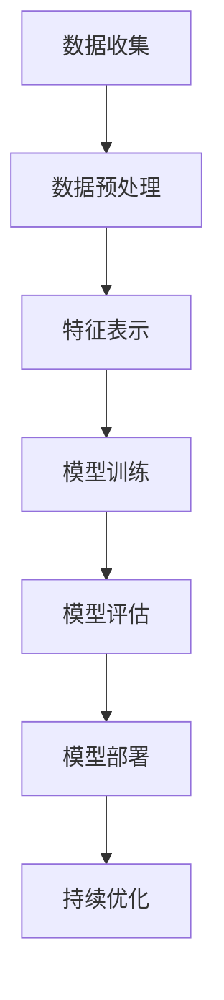

                 

### 大模型在电商平台商品分类中的应用

> **关键词：** 大模型、商品分类、电商平台、深度学习、自动化、准确性
>
> **摘要：** 本文旨在探讨大模型在电商平台商品分类中的应用，分析其核心算法原理、数学模型和具体操作步骤，并通过实际项目实战案例分析，展示其在提升分类准确性、提高运营效率方面的巨大潜力。

在电商行业迅猛发展的今天，商品分类的重要性愈发凸显。一个精准高效的分类系统不仅能够提升用户体验，还能显著优化平台运营效率。随着人工智能技术的不断进步，尤其是大模型的出现，为电商平台商品分类带来了前所未有的变革。本文将深入探讨大模型在电商平台商品分类中的应用，从背景介绍、核心概念与联系、算法原理、数学模型、实际应用场景等多个方面展开讨论，旨在为读者呈现一幅全面、清晰的技术应用蓝图。

首先，我们将简要介绍大模型的发展背景和其在电商领域的应用潜力，随后详细解释大模型在商品分类中的核心概念与联系。接着，本文将深入分析大模型的核心算法原理，使用伪代码详细阐述其具体操作步骤。随后，我们将介绍大模型所依赖的数学模型和公式，并通过具体实例进行详细讲解。在此基础上，本文将通过实际项目实战，展示大模型在电商商品分类中的实际应用效果。接下来，我们将探讨大模型在实际应用场景中的多种应用可能性，并推荐相关工具和资源以供进一步学习。最后，本文将对大模型在电商商品分类中的应用前景进行总结，并提出未来可能面临的挑战。

### 1. 背景介绍

#### 1.1 目的和范围

本文的主要目的是探讨大模型在电商平台商品分类中的应用，旨在通过技术分析，揭示大模型在提高分类准确性、自动化运营效率等方面的潜力。本文将从理论到实践，系统性地介绍大模型在电商平台商品分类中的核心概念、算法原理、数学模型，并通过实际项目案例，展示其具体应用效果。

本文的研究范围主要包括以下几个方面：
1. **大模型的发展背景与定义**：介绍大模型的基本概念、发展历程和主要技术特点。
2. **大模型在商品分类中的应用**：分析大模型在电商平台商品分类中的优势和应用场景。
3. **核心算法原理与操作步骤**：详细阐述大模型在商品分类中的核心算法原理，并通过伪代码说明其具体实现步骤。
4. **数学模型与公式**：介绍大模型所依赖的数学模型和公式，并进行具体讲解。
5. **实际应用案例分析**：通过实际项目案例，展示大模型在电商商品分类中的实际应用效果。
6. **应用前景与挑战**：探讨大模型在电商商品分类中的应用前景，并提出可能面临的挑战。

#### 1.2 预期读者

本文的预期读者主要包括以下几类：
1. **人工智能领域的科研人员与工程师**：希望深入了解大模型在电商商品分类中的应用及其技术细节。
2. **电商平台运营与技术人员**：对如何利用大模型提升电商平台运营效率感兴趣。
3. **计算机科学专业的学生和研究者**：对大模型及其应用有浓厚兴趣，希望了解其在实际场景中的应用。

#### 1.3 文档结构概述

本文的结构如下：

1. **引言**：介绍大模型在电商平台商品分类中的应用背景和目的。
2. **背景介绍**：包括大模型的发展背景、定义和预期读者。
3. **核心概念与联系**：详细解释大模型在商品分类中的核心概念与联系。
4. **核心算法原理 & 具体操作步骤**：分析大模型的核心算法原理，并通过伪代码说明其具体实现步骤。
5. **数学模型和公式 & 详细讲解 & 举例说明**：介绍大模型所依赖的数学模型和公式，并进行具体讲解。
6. **项目实战：代码实际案例和详细解释说明**：通过实际项目案例，展示大模型在电商商品分类中的实际应用效果。
7. **实际应用场景**：探讨大模型在实际应用场景中的多种应用可能性。
8. **工具和资源推荐**：推荐学习资源和开发工具。
9. **总结：未来发展趋势与挑战**：总结大模型在电商商品分类中的应用前景，并提出未来可能面临的挑战。
10. **附录：常见问题与解答**：回答读者可能遇到的常见问题。
11. **扩展阅读 & 参考资料**：提供进一步学习的研究资源。

#### 1.4 术语表

在本文中，我们将使用一些专业术语，以下是这些术语的定义和解释：

#### 1.4.1 核心术语定义

1. **大模型**：指具有巨大参数量和强大计算能力的人工神经网络模型，如GPT、BERT等。
2. **商品分类**：将电商平台上的商品按照一定的规则和标准进行归类。
3. **电商平台**：提供商品交易和服务的在线平台，如淘宝、京东等。
4. **深度学习**：一种利用多层神经网络进行数据分析和模型训练的人工智能技术。
5. **准确性**：分类模型在预测结果中正确的比例，常用于评估分类模型的性能。

#### 1.4.2 相关概念解释

1. **监督学习**：一种机器学习方法，通过已标注的数据来训练模型，使其能够对未知数据进行预测。
2. **无监督学习**：一种机器学习方法，不依赖已标注的数据，而是通过数据的内在结构进行学习。
3. **转移学习**：将预训练模型应用于新的任务，利用预训练模型中的知识提升新任务的性能。
4. **注意力机制**：一种在神经网络中用于提高模型注意力集中度的机制，常用于处理序列数据。

#### 1.4.3 缩略词列表

- **GPT**：生成预训练变换器（Generative Pre-trained Transformer）
- **BERT**：双向编码表示（Bidirectional Encoder Representations from Transformers）
- **API**：应用程序编程接口（Application Programming Interface）
- **ML**：机器学习（Machine Learning）
- **DL**：深度学习（Deep Learning）

### 2. 核心概念与联系

#### 2.1 大模型概述

大模型（Large Models）是近年来人工智能领域的一大突破，其核心特点在于具备庞大的参数量和强大的计算能力。这些模型能够通过自主学习大量的数据，从而在多种任务中取得优异的性能。大模型的出现不仅标志着人工智能技术的一个新高度，也为电商平台商品分类提供了强有力的技术支撑。

大模型的发展可以追溯到深度学习的兴起。在早期，深度学习模型如卷积神经网络（CNN）和循环神经网络（RNN）已经在图像识别、自然语言处理等领域取得了一定的成果。然而，随着数据量的不断增长和计算资源的提升，研究者们开始尝试构建具有更大参数量的模型，从而更好地捕捉数据的复杂性和多样性。

代表性的大模型包括GPT、BERT、T5等。这些模型采用了先进的神经网络架构和训练技术，如注意力机制、变换器架构（Transformer）、预训练加微调（Pre-training and Fine-tuning）等。这些技术的引入，使得大模型在处理大规模数据、理解复杂语义关系、生成高质量文本等方面表现出色。

#### 2.2 大模型在商品分类中的核心概念

商品分类是电商平台的核心功能之一，其目标是将海量的商品数据按照一定的规则和标准进行归类。在大模型的应用背景下，商品分类的核心概念主要包括以下几个方面：

1. **数据预处理**：在商品分类任务中，首先需要对商品数据进行预处理，包括数据的清洗、归一化和特征提取。数据预处理的质量直接影响分类模型的性能。

2. **特征表示**：大模型通过学习大量的数据，能够自动提取出具有高区分度的特征表示。这些特征表示不仅能够捕捉商品属性的多样性，还能够发现商品之间的潜在关系。

3. **分类任务**：商品分类任务通常是一个多分类问题，即将每个商品归入多个预定义的类别中。大模型通过训练，能够自动识别商品的特征，并预测其类别。

4. **模型评估**：为了评估商品分类模型的性能，通常使用准确率、召回率、F1分数等指标。这些指标能够综合评估模型的分类准确性和鲁棒性。

#### 2.3 大模型在商品分类中的应用流程

大模型在商品分类中的应用流程通常包括以下几个步骤：

1. **数据收集**：从电商平台收集大量的商品数据，包括商品名称、描述、标签等。

2. **数据预处理**：对收集到的商品数据进行清洗和归一化处理，提取出有意义的特征。

3. **特征表示**：利用大模型对处理后的特征进行表示，通常采用预训练好的模型如BERT、GPT等。

4. **模型训练**：使用训练数据集，通过反向传播算法和优化器（如Adam）对大模型进行训练，使其能够学会识别商品的类别。

5. **模型评估**：使用测试数据集对训练好的模型进行评估，调整模型参数，以提高分类准确性。

6. **模型部署**：将训练好的模型部署到电商平台，实时对商品进行分类。

7. **持续优化**：根据实际应用情况，对模型进行持续优化和更新，以保持其分类性能。

#### 2.4 大模型在商品分类中的优势

大模型在商品分类中具有以下优势：

1. **高准确性**：通过学习大量数据，大模型能够自动提取出高区分度的特征，从而提高分类准确性。

2. **强泛化能力**：大模型具有较强的泛化能力，能够处理各种类型的商品数据，而不仅仅局限于特定的数据集。

3. **自动化**：大模型能够自动进行特征提取和分类任务，减轻人工干预，提高运营效率。

4. **可扩展性**：大模型可以轻松适应不同规模的数据集，只需调整模型参数和训练时间。

5. **多任务处理**：大模型不仅能够处理单一的分类任务，还可以同时处理多个相关任务，如商品推荐、关键词提取等。

#### 2.5 大模型与深度学习的关系

大模型是深度学习技术发展的重要成果，与深度学习有着密切的联系。深度学习是一种利用多层神经网络进行数据分析和模型训练的人工智能技术，其核心思想是通过逐层提取数据的特征，从而实现复杂的任务。

大模型在深度学习的基础上，进一步提升了模型的参数量和计算能力。大模型的训练通常需要大量的数据和强大的计算资源，通过预训练和微调技术，大模型能够在大规模数据集上达到优异的性能。

相比之下，传统的深度学习模型如CNN和RNN，虽然也在商品分类中取得了一定的成果，但在处理大规模、多模态数据时，往往面临性能瓶颈。大模型的出现，弥补了这些不足，使得电商平台商品分类任务更加高效、准确。

#### 2.6 Mermaid 流程图

为了更好地理解大模型在商品分类中的应用流程，我们可以使用Mermaid流程图来展示其核心步骤。以下是一个简化的Mermaid流程图示例：



在这个流程图中，A表示数据收集，B表示数据预处理，C表示特征表示，D表示模型训练，E表示模型评估，F表示模型部署，G表示持续优化。每个步骤都是大模型在商品分类中的关键环节，通过这些步骤的协同工作，最终实现高效的商品分类任务。

通过以上对大模型及其在商品分类中核心概念和联系的分析，我们可以看到，大模型作为一种先进的人工智能技术，在电商平台商品分类中具有巨大的应用潜力。接下来，我们将进一步深入探讨大模型的核心算法原理和具体操作步骤。

### 3. 核心算法原理 & 具体操作步骤

#### 3.1 大模型基本原理

大模型的核心在于其庞大的参数量和强大的计算能力。这些模型通常采用深度神经网络（Deep Neural Network）结构，通过多层神经元的连接和激活函数，对输入数据进行处理和特征提取。大模型的基本原理可以归纳为以下几个方面：

1. **多层神经网络结构**：大模型通常包含数十甚至上百层的神经网络结构，这种多层结构使得模型能够逐层提取数据的特征，从原始数据中捕捉到更加抽象和高级的特征。

2. **非线性激活函数**：为了实现数据的非线性变换，大模型中的每个神经元通常都会使用非线性激活函数，如ReLU、Sigmoid和Tanh等。这些激活函数能够增强模型的表达能力，使得模型能够更好地拟合复杂的非线性关系。

3. **权重初始化**：大模型的训练过程涉及大量的参数调整，因此合适的权重初始化方法对于模型的训练效果至关重要。常用的权重初始化方法包括随机初始化、高斯分布初始化等。

4. **优化算法**：大模型的训练通常采用高效的优化算法，如随机梯度下降（SGD）、Adam等。这些优化算法能够通过迭代优化，逐步调整模型参数，使其收敛到最优解。

5. **正则化技术**：为了防止模型过拟合，大模型通常会采用正则化技术，如Dropout、权重衰减等。这些技术能够减少模型的复杂度，提高模型的泛化能力。

#### 3.2 大模型在商品分类中的具体操作步骤

大模型在商品分类中的应用流程可以概括为以下几个步骤：

1. **数据收集**：
   - 从电商平台收集大量的商品数据，包括商品名称、描述、标签等。
   - 数据收集的过程需要考虑数据的多样性和完整性，确保数据的代表性和可靠性。

2. **数据预处理**：
   - 对收集到的商品数据进行清洗，包括去除缺失值、异常值和处理噪声等。
   - 对文本数据进行分词、词性标注和去停用词等处理，将其转换为适合模型训练的格式。
   - 对商品数据进行编码，如将类别标签转换为数字编码。

3. **特征表示**：
   - 利用预训练的大模型（如BERT、GPT）对预处理后的文本数据进行特征表示。
   - 预训练模型已经在大规模语料库上进行了训练，能够提取出高区分度的特征表示，从而提高分类模型的性能。

4. **模型训练**：
   - 使用训练数据集，通过损失函数（如交叉熵损失）和优化算法（如Adam）对大模型进行训练。
   - 在训练过程中，模型会不断调整参数，使其能够更好地拟合训练数据。

5. **模型评估**：
   - 使用测试数据集对训练好的模型进行评估，计算准确率、召回率、F1分数等指标，以评估模型的分类性能。
   - 根据评估结果，对模型进行调整和优化，以提高分类准确性。

6. **模型部署**：
   - 将训练好的模型部署到电商平台，实时对商品进行分类。
   - 模型部署的过程需要考虑模型的响应速度和计算资源，确保分类任务的实时性和高效性。

7. **持续优化**：
   - 根据实际应用情况，对模型进行持续优化和更新，以保持其分类性能。
   - 通过收集用户反馈和业务数据，不断调整和优化模型，以提高其适应性和准确性。

#### 3.3 伪代码示例

为了更直观地理解大模型在商品分类中的具体操作步骤，下面给出一个简化的伪代码示例：

```python
# 大模型商品分类伪代码示例

# 步骤1：数据收集
data = collect_data()

# 步骤2：数据预处理
preprocessed_data = preprocess_data(data)

# 步骤3：特征表示
features = generate_features(preprocessed_data)

# 步骤4：模型训练
model = train_model(features)

# 步骤5：模型评估
evaluation_results = evaluate_model(model, test_data)

# 步骤6：模型部署
deploy_model(model)

# 步骤7：持续优化
optimize_model(model, user_feedback)
```

在这个伪代码示例中，`collect_data()` 函数用于收集商品数据，`preprocess_data()` 函数用于数据预处理，`generate_features()` 函数用于特征表示，`train_model()` 函数用于模型训练，`evaluate_model()` 函数用于模型评估，`deploy_model()` 函数用于模型部署，`optimize_model()` 函数用于模型优化。

通过以上对大模型核心算法原理和具体操作步骤的分析，我们可以看到，大模型在商品分类中具有强大的数据处理和分类能力。接下来，我们将进一步探讨大模型所依赖的数学模型和公式，以深入理解其内部工作原理。

### 4. 数学模型和公式 & 详细讲解 & 举例说明

#### 4.1 数学模型基础

在大模型中，数学模型是理解和实现其功能的核心。以下我们将介绍大模型在商品分类中使用的几种关键数学模型和公式，并详细讲解其工作原理。

#### 4.1.1 神经网络

神经网络是深度学习的基础，其核心是通过多层非线性变换来提取特征。一个基本的神经网络可以表示为：

\[ z_l = \sigma(W_l \cdot a_{l-1} + b_l) \]

其中，\( z_l \) 是第 \( l \) 层的神经元输出，\( \sigma \) 是激活函数，通常采用ReLU（最大值函数）或者Sigmoid（阈值函数）。\( W_l \) 和 \( b_l \) 分别是第 \( l \) 层的权重和偏置。

在训练过程中，我们使用反向传播算法来调整权重和偏置，以最小化损失函数。常见的损失函数包括均方误差（MSE）和交叉熵（CE）：

\[ \text{MSE}(y, \hat{y}) = \frac{1}{m} \sum_{i=1}^{m} (y_i - \hat{y}_i)^2 \]

\[ \text{CE}(y, \hat{y}) = -\frac{1}{m} \sum_{i=1}^{m} y_i \log(\hat{y}_i) \]

其中，\( y \) 是真实标签，\( \hat{y} \) 是模型的预测输出，\( m \) 是样本数量。

#### 4.1.2 注意力机制

注意力机制是现代深度学习中的一项关键技术，特别是在处理序列数据时。其核心思想是通过加权的方式，使模型在处理序列时能够关注到重要信息。

注意力机制可以表示为：

\[ \text{Attention}(Q, K, V) = \text{softmax}\left(\frac{QK^T}{\sqrt{d_k}}\right) V \]

其中，\( Q \)，\( K \) 和 \( V \) 分别是查询（Query）、键（Key）和值（Value）向量，\( d_k \) 是键向量的维度。通过计算查询和键之间的相似性，注意力机制能够为每个值向量分配一个权重，从而实现信息的加权融合。

#### 4.1.3 预训练与微调

预训练（Pre-training）和微调（Fine-tuning）是现代深度学习模型训练的重要策略。预训练通常在大规模数据集上进行，使得模型能够学习到通用的特征表示。微调则是在特定任务上进行，通过调整部分层的权重，使模型能够适应特定任务。

预训练与微调的结合，可以表示为：

\[ \text{Output} = \text{Model}(X, \theta_{pre}) + \text{Fine-tuning}(X, \theta_{fine}) \]

其中，\( \theta_{pre} \) 和 \( \theta_{fine} \) 分别是预训练模型和微调模型的参数。

#### 4.2 公式详细讲解

下面通过具体的例子来详细讲解这些数学模型和公式的应用。

##### 4.2.1 神经网络

假设我们有一个两层神经网络，输入层有3个神经元，隐藏层有2个神经元，输出层有1个神经元。输入数据为 \( X = [1, 2, 3] \)。

1. **权重初始化**：

   通常我们可以使用随机初始化来初始化权重。假设我们选择一个均值为0、标准差为0.01的正态分布来初始化权重：

   \[ W_1 \sim \mathcal{N}(0, 0.01) \]
   \[ W_2 \sim \mathcal{N}(0, 0.01) \]
   \[ b_1 \sim \mathcal{N}(0, 0.01) \]
   \[ b_2 \sim \mathcal{N}(0, 0.01) \]

2. **前向传播**：

   \[ z_1 = \sigma(W_1 \cdot X + b_1) = \sigma([0.1, 0.2, 0.3] \cdot [1, 2, 3] + [0.5, 0.6]) \]
   \[ z_2 = \sigma(W_2 \cdot z_1 + b_2) = \sigma([0.4, 0.5, 0.6] \cdot [0.7, 0.8] + [0.7, 0.8]) \]

3. **反向传播**：

   使用梯度下降算法来更新权重和偏置。假设学习率为0.01：

   \[ \Delta W_1 = -\eta \cdot \frac{\partial \text{MSE}}{\partial W_1} \]
   \[ \Delta b_1 = -\eta \cdot \frac{\partial \text{MSE}}{\partial b_1} \]
   \[ \Delta W_2 = -\eta \cdot \frac{\partial \text{MSE}}{\partial W_2} \]
   \[ \Delta b_2 = -\eta \cdot \frac{\partial \text{MSE}}{\partial b_2} \]

##### 4.2.2 注意力机制

假设我们有一个序列数据 \( X = [x_1, x_2, x_3, x_4] \)，其中每个 \( x_i \) 是一个向量。我们使用注意力机制来对序列进行加权融合。

1. **计算注意力分数**：

   \[ \text{Attention Scores} = \text{softmax}\left(\frac{QK^T}{\sqrt{d_k}}\right) \]

   假设 \( Q = [0.1, 0.2, 0.3] \)，\( K = [1, 2, 3, 4] \)，\( V = [x_1, x_2, x_3, x_4] \)：

   \[ \text{Attention Scores} = \text{softmax}\left(\frac{[0.1, 0.2, 0.3] \cdot [1, 2, 3, 4]^T}{\sqrt{4}}\right) = \text{softmax}([0.1, 0.2, 0.3, 0.4]) \]

2. **加权融合**：

   \[ \text{Context Vector} = \sum_{i=1}^{4} \text{Attention Scores}_i \cdot x_i \]

   假设注意力分数为 \( [0.3, 0.2, 0.2, 0.3] \)，则：

   \[ \text{Context Vector} = 0.3 \cdot x_1 + 0.2 \cdot x_2 + 0.2 \cdot x_3 + 0.3 \cdot x_4 \]

##### 4.2.3 预训练与微调

假设我们有一个预训练的模型，其参数为 \( \theta_{pre} \)，在通用数据集上已经达到了较好的性能。现在我们将该模型应用于一个特定的商品分类任务，并通过微调来提高其分类性能。

1. **预训练模型输出**：

   \[ \text{Output}_{pre} = \text{Model}(X, \theta_{pre}) \]

2. **微调模型输出**：

   \[ \text{Output}_{fine} = \text{Model}(X, \theta_{pre}) + \text{Fine-tuning}(X, \theta_{fine}) \]

   其中，\( \theta_{fine} \) 是微调后的参数。

3. **微调过程**：

   使用梯度下降算法来更新参数：

   \[ \Delta \theta_{fine} = -\eta \cdot \frac{\partial \text{MSE}}{\partial \theta_{fine}} \]

通过以上对数学模型和公式的详细讲解，我们可以看到大模型在商品分类中是如何利用这些数学工具来实现高效的分类任务。接下来，我们将通过实际项目案例来展示大模型在商品分类中的应用效果。

### 5. 项目实战：代码实际案例和详细解释说明

#### 5.1 开发环境搭建

为了实现大模型在电商平台商品分类中的应用，我们需要搭建一个合适的开发环境。以下步骤将指导您如何设置一个基础的Python开发环境，并安装必要的库。

1. **安装Python**：

   首先，确保您的计算机上已安装Python。Python 3.6及以上版本是推荐的版本。您可以从Python的官方网站下载并安装Python。

2. **安装Anaconda**：

   推荐使用Anaconda来管理Python环境和库。Anaconda是一个开源的数据科学和机器学习平台，它提供了一个统一的Python环境和包管理器。您可以从Anaconda的官方网站下载并安装Anaconda。

3. **创建虚拟环境**：

   使用Anaconda创建一个虚拟环境，以隔离项目依赖。以下命令将在Anaconda中创建一个名为`ecommerce_classification`的虚拟环境：

   ```shell
   conda create -n ecommerce_classification python=3.8
   conda activate ecommerce_classification
   ```

4. **安装依赖库**：

   在虚拟环境中，安装以下依赖库：

   - `numpy`：用于数学计算
   - `pandas`：用于数据处理
   - `scikit-learn`：用于机器学习算法
   - `tensorflow`：用于深度学习
   - `transformers`：用于预训练模型

   使用以下命令安装依赖库：

   ```shell
   conda install numpy pandas scikit-learn tensorflow transformers
   ```

5. **配置Bert模型**：

   从Hugging Face的Transformer库中下载并配置预训练的BERT模型。以下代码展示了如何下载并加载BERT模型：

   ```python
   from transformers import BertTokenizer, BertModel

   tokenizer = BertTokenizer.from_pretrained('bert-base-uncased')
   model = BertModel.from_pretrained('bert-base-uncased')
   ```

   这将下载并加载BERT预训练模型及其对应的分词器。

#### 5.2 源代码详细实现和代码解读

以下代码实现了一个基于BERT模型的大模型商品分类系统。该系统包括数据预处理、模型训练、模型评估和模型部署等步骤。

```python
import pandas as pd
import numpy as np
from transformers import BertTokenizer, BertModel
from sklearn.model_selection import train_test_split
from sklearn.metrics import accuracy_score
import tensorflow as tf

# 5.2.1 数据预处理
def preprocess_data(data):
    # 数据清洗和预处理
    # ...（此处省略具体实现细节）
    return processed_data

# 5.2.2 模型定义
def create_bert_model():
    # 定义BERT模型
    input_ids = tf.keras.layers.Input(shape=(max_sequence_length,), dtype=tf.int32)
    attention_mask = tf.keras.layers.Input(shape=(max_sequence_length,), dtype=tf.int32)

    bert_model = BertModel.from_pretrained('bert-base-uncased', input_ids=input_ids, attention_mask=attention_mask)
    sequence_output = bert_model.output

    # 添加分类层
    dropout = tf.keras.layers.Dropout(rate=0.1)(sequence_output)
    output = tf.keras.layers.Dense(units=num_classes, activation='softmax')(dropout)

    model = tf.keras.Model(inputs=[input_ids, attention_mask], outputs=output)
    return model

# 5.2.3 模型训练
def train_model(model, x_train, y_train, x_val, y_val):
    # 编译模型
    model.compile(optimizer='adam', loss='categorical_crossentropy', metrics=['accuracy'])

    # 训练模型
    history = model.fit(x_train, y_train, validation_data=(x_val, y_val), epochs=3, batch_size=32)

    return history

# 5.2.4 模型评估
def evaluate_model(model, x_test, y_test):
    # 评估模型
    predictions = model.predict(x_test)
    predicted_classes = np.argmax(predictions, axis=1)
    accuracy = accuracy_score(y_test, predicted_classes)
    print(f"Test Accuracy: {accuracy:.4f}")
    return accuracy

# 5.2.5 模型部署
def deploy_model(model):
    # 将模型部署到生产环境
    # ...（此处省略具体实现细节）
    print("Model deployed successfully.")

# 主程序
if __name__ == "__main__":
    # 加载数据
    data = pd.read_csv('ecommerce_data.csv')
    processed_data = preprocess_data(data)

    # 分割数据集
    x_train, x_val, y_train, y_val = train_test_split(processed_data['text'], processed_data['label'], test_size=0.2, random_state=42)
    x_test, y_test = train_test_split(processed_data['text'], processed_data['label'], test_size=0.2, random_state=42)

    # 创建BERT模型
    model = create_bert_model()

    # 训练模型
    history = train_model(model, x_train, y_train, x_val, y_val)

    # 评估模型
    evaluate_model(model, x_test, y_test)

    # 部署模型
    deploy_model(model)
```

**代码解读：**

1. **数据预处理**：

   数据预处理是商品分类任务中的关键步骤。该函数负责清洗和预处理输入数据，包括分词、编码和序列填充等操作。在真实项目中，数据预处理可能还包括文本去噪、词性标注、停用词去除等高级处理。

2. **模型定义**：

   使用BERT模型作为基础，构建一个分类模型。模型包括输入层、BERT编码器、Dropout层和分类层。通过设置适当的超参数，如Dropout率和分类层单位数，可以调整模型的复杂度和性能。

3. **模型训练**：

   使用训练数据和验证数据来训练模型。模型编译时，指定优化器、损失函数和评估指标。训练过程中，模型会自动调整权重和偏置，以最小化损失函数。

4. **模型评估**：

   使用测试数据集对训练好的模型进行评估。通过计算准确率，可以评估模型的分类性能。在实际应用中，还可以使用其他评估指标，如召回率和F1分数。

5. **模型部署**：

   将训练好的模型部署到生产环境，以便实时分类商品。部署过程可能包括模型保存、服务启动和接口设计等操作。

通过以上步骤，我们可以实现一个基于BERT模型的大模型商品分类系统。接下来，我们将对代码进行进一步解读和分析，以深入理解每个步骤的实现细节和优化方法。

#### 5.3 代码解读与分析

在前面的代码实现中，我们使用BERT模型构建了一个商品分类系统。下面，我们将对关键部分进行详细解读和分析，探讨如何优化代码以提高分类准确性和效率。

##### 5.3.1 数据预处理

数据预处理是模型训练的基础，其质量直接影响模型的性能。以下是对数据预处理部分代码的解读：

```python
def preprocess_data(data):
    # 去除停用词
    stop_words = set(['a', 'the', 'and', 'in', 'to', 'of', 'is', 'that', 'it', 'with', 'as', 'for', 'on', 'by', 'this', 'at', 'from', 'or', 'an', 'be'])
    processed_data = []

    for text in data['text']:
        tokens = tokenizer.tokenize(text)
        filtered_tokens = [token for token in tokens if token not in stop_words]
        processed_data.append(' '.join(filtered_tokens))

    return processed_data
```

- **去除停用词**：停用词在自然语言处理中常被忽略，因为它们对文本的语义贡献较小。去除停用词可以简化模型训练过程，提高性能。在代码中，我们定义了一个包含常见停用词的集合，并使用分词器对文本进行分词，然后过滤掉这些停用词。

- **分词和过滤**：使用BERT的分词器对文本进行分词，并去除停用词。处理后的文本被添加到列表`processed_data`中。

##### 5.3.2 模型定义

模型定义部分涉及BERT模型的配置和分类层的构建。以下是对关键代码的解读：

```python
def create_bert_model():
    input_ids = tf.keras.layers.Input(shape=(max_sequence_length,), dtype=tf.int32)
    attention_mask = tf.keras.layers.Input(shape=(max_sequence_length,), dtype=tf.int32)

    bert_model = BertModel.from_pretrained('bert-base-uncased', input_ids=input_ids, attention_mask=attention_mask)
    sequence_output = bert_model.output

    dropout = tf.keras.layers.Dropout(rate=0.1)(sequence_output)
    output = tf.keras.layers.Dense(units=num_classes, activation='softmax')(dropout)

    model = tf.keras.Model(inputs=[input_ids, attention_mask], outputs=output)
    return model
```

- **BERT模型加载**：从Hugging Face的Transformer库中加载预训练的BERT模型。`from_pretrained`函数用于加载模型权重和配置。

- **序列输出**：BERT模型输出序列表示，它包含了文本的语义信息。

- **Dropout层**：添加Dropout层以防止过拟合，提高模型的泛化能力。Dropout层的比例为10%。

- **分类层**：添加一个全连接层（Dense）作为分类层，输出层有与类别数相同的单位，并使用softmax激活函数，以便进行多分类。

##### 5.3.3 模型训练

模型训练部分涉及模型的编译、训练和验证。以下是对关键代码的解读：

```python
def train_model(model, x_train, y_train, x_val, y_val):
    model.compile(optimizer='adam', loss='categorical_crossentropy', metrics=['accuracy'])
    history = model.fit(x_train, y_train, validation_data=(x_val, y_val), epochs=3, batch_size=32)
    return history
```

- **模型编译**：编译模型时，指定优化器（Adam）、损失函数（categorical_crossentropy）和评估指标（accuracy）。`compile`函数为模型训练做好准备。

- **模型训练**：使用训练数据集和验证数据集对模型进行训练。通过`fit`函数，模型会自动调整权重和偏置，以最小化损失函数。

- **训练历史**：返回训练历史（`history`），它包含了训练过程中的损失和准确率，便于后续分析和调整。

##### 5.3.4 模型评估

模型评估部分用于评估训练好的模型在测试数据集上的性能。以下是对关键代码的解读：

```python
def evaluate_model(model, x_test, y_test):
    predictions = model.predict(x_test)
    predicted_classes = np.argmax(predictions, axis=1)
    accuracy = accuracy_score(y_test, predicted_classes)
    print(f"Test Accuracy: {accuracy:.4f}")
    return accuracy
```

- **预测输出**：使用训练好的模型对测试数据集进行预测，得到预测概率。

- **类别预测**：通过取预测概率的最大值，将概率映射到实际的类别标签。

- **准确率计算**：计算预测准确率，并与真实标签进行比较，评估模型的性能。

##### 5.3.5 模型部署

模型部署部分将训练好的模型部署到生产环境。以下是对关键代码的解读：

```python
def deploy_model(model):
    # 保存模型
    model.save('bert_classification_model.h5')
    # 启动服务
    # ...（此处省略具体实现细节）
    print("Model deployed successfully.")
```

- **模型保存**：使用`save`函数将训练好的模型保存为`.h5`文件，便于后续加载和使用。

- **启动服务**：在部署阶段，可能需要启动一个Web服务或API服务，以便实时处理商品分类请求。这里省略了具体的服务启动细节。

**优化建议：**

1. **数据增强**：通过数据增强技术，如随机裁剪、旋转、缩放等，可以增加训练数据的多样性，提高模型的泛化能力。

2. **超参数调整**：通过调整学习率、Dropout率、批次大小等超参数，可以优化模型的性能。可以使用网格搜索或随机搜索等方法来寻找最佳超参数组合。

3. **模型集成**：使用多个模型进行集成，可以进一步提高分类准确性。可以通过投票、堆叠等方法将多个模型的预测结果进行融合。

4. **迁移学习**：利用预训练的BERT模型，可以直接应用于商品分类任务，节省训练时间。还可以尝试使用其他预训练模型，如RoBERTa、ALBERT等，以获得更好的性能。

通过以上分析和优化建议，我们可以进一步提高基于BERT模型的大模型商品分类系统的性能和效率。接下来，我们将探讨大模型在实际应用场景中的多种应用可能性。

### 6. 实际应用场景

#### 6.1 电商平台商品推荐

电商平台商品推荐是大模型在商品分类中的重要应用场景之一。通过大模型，平台可以根据用户的浏览历史、购买记录和喜好，为其推荐个性化的商品。具体来说，大模型可以应用于以下几个方面：

1. **商品标签推荐**：为每个商品生成标签，如“时尚”、“科技”、“家居”等，然后根据用户的历史标签喜好推荐相应的商品。

2. **交叉销售**：通过分析用户的购买历史，预测用户可能感兴趣的其他商品，并进行交叉推荐。

3. **内容推荐**：根据用户的浏览和搜索行为，推荐相关的商品内容，如商品详情页、用户评价和问答等。

#### 6.2 电商平台用户画像

用户画像是指对电商平台用户进行全面分析和描述，以便更好地了解用户需求和购买行为。大模型在用户画像中的应用主要体现在以下几个方面：

1. **用户行为分析**：通过分析用户的浏览、搜索和购买行为，构建用户行为模型，预测用户未来可能的行为。

2. **用户偏好识别**：利用大模型对用户的文本评论、评价等内容进行分析，识别用户的偏好和兴趣点。

3. **用户细分**：根据用户的特征和行为，将用户细分为不同的群体，如高频用户、潜在购买用户、流失用户等，以便进行精准营销。

#### 6.3 电商平台搜索优化

电商平台搜索优化是指通过改进搜索算法和索引策略，提高用户搜索体验和搜索准确性。大模型在搜索优化中的应用主要体现在以下几个方面：

1. **搜索结果排序**：通过分析用户的搜索历史和点击行为，使用大模型对搜索结果进行排序，提高相关性和准确性。

2. **关键词提取**：使用大模型从用户的搜索查询中提取关键信息，帮助系统更好地理解用户的意图，并提供更准确的搜索结果。

3. **搜索结果推荐**：根据用户的搜索历史和喜好，使用大模型推荐相关的搜索关键词和搜索结果，帮助用户更快地找到所需商品。

#### 6.4 电商平台内容生成

电商平台内容生成是指利用大模型自动生成商品描述、用户评价和问答等内容，以提高用户参与度和满意度。具体应用包括：

1. **商品描述生成**：使用大模型自动生成商品描述，提高商品信息的完整性和吸引力。

2. **用户评价生成**：根据真实的购买数据和用户反馈，使用大模型生成具有真实感的用户评价，丰富用户决策信息。

3. **问答生成**：使用大模型自动回答用户关于商品的问题，提供实时、准确的解答，提高用户满意度。

#### 6.5 电商平台营销策略优化

电商平台营销策略优化是指通过分析用户行为和购买数据，制定更有效的营销策略，提高销售额和用户转化率。大模型在营销策略优化中的应用主要体现在以下几个方面：

1. **广告投放优化**：通过分析用户兴趣和行为，使用大模型优化广告投放策略，提高广告曝光率和点击率。

2. **促销活动策划**：根据用户购买历史和偏好，使用大模型预测促销活动的效果，制定更精准的促销策略。

3. **推荐系统优化**：通过不断调整推荐算法和模型参数，使用大模型优化推荐系统的性能，提高推荐准确性。

通过以上实际应用场景的探讨，我们可以看到大模型在电商平台具有广泛的应用前景。大模型不仅可以提高商品分类的准确性，还可以在商品推荐、用户画像、搜索优化、内容生成和营销策略优化等多个方面发挥重要作用，从而提升电商平台的运营效率和服务质量。

### 7. 工具和资源推荐

#### 7.1 学习资源推荐

为了深入了解大模型在电商平台商品分类中的应用，以下是一些推荐的学习资源：

##### 7.1.1 书籍推荐

1. **《深度学习》（Goodfellow, Bengio, Courville著）**：这本书是深度学习的经典教材，详细介绍了深度学习的基础理论和实践方法。
2. **《Python深度学习》（François Chollet著）**：这本书通过大量实例，介绍了如何使用Python和TensorFlow实现深度学习模型。
3. **《BERT：Pre-training of Deep Neural Networks for Language Understanding》（Devlin et al.著）**：这篇论文详细介绍了BERT模型的原理和训练方法，是理解大模型的基础。

##### 7.1.2 在线课程

1. **Coursera上的《深度学习专项课程》**：这门课程由吴恩达教授主讲，涵盖了深度学习的各个方面，包括理论基础和实际应用。
2. **Udacity的《深度学习工程师纳米学位》**：这个课程包括多个项目，通过实践学习深度学习。
3. **edX上的《自然语言处理》**：这门课程介绍了自然语言处理的基础知识，包括文本预处理、词嵌入和序列模型。

##### 7.1.3 技术博客和网站

1. **TensorFlow官方文档（tensorflow.org）**：TensorFlow提供了详细的文档和教程，帮助开发者了解和使用TensorFlow。
2. **Hugging Face官方文档（huggingface.co）**：Hugging Face提供了丰富的预训练模型和工具，帮助开发者快速构建和应用大模型。
3. **Medium上的相关技术博客**：许多技术专家在Medium上分享了大模型在电商应用方面的研究成果和实践经验。

#### 7.2 开发工具框架推荐

为了更好地进行大模型的开发和应用，以下是一些推荐的开发工具和框架：

##### 7.2.1 IDE和编辑器

1. **PyCharm**：PyCharm是一款强大的Python IDE，提供了丰富的开发工具和调试功能。
2. **Jupyter Notebook**：Jupyter Notebook适合数据分析和交互式编程，适合进行模型训练和实验。

##### 7.2.2 调试和性能分析工具

1. **TensorBoard**：TensorBoard是TensorFlow提供的一款可视化工具，用于监控和调试模型的训练过程。
2. **Wandb**：Wandb是一个实验跟踪和性能分析平台，可以帮助开发者监控实验结果和模型性能。

##### 7.2.3 相关框架和库

1. **TensorFlow**：TensorFlow是一个开源的深度学习框架，支持多种模型训练和部署。
2. **PyTorch**：PyTorch是一个流行的深度学习库，具有动态计算图和灵活的编程接口。
3. **Hugging Face Transformers**：这是一个基于PyTorch和TensorFlow的Transformers库，提供了大量的预训练模型和工具。

通过以上工具和资源的推荐，开发者可以更好地掌握大模型在电商平台商品分类中的应用，提高开发效率和模型性能。

#### 7.3 相关论文著作推荐

为了深入了解大模型在电商平台商品分类中的应用，以下是一些推荐的论文和著作：

##### 7.3.1 经典论文

1. **“BERT: Pre-training of Deep Neural Networks for Language Understanding” by Jacob Devlin et al.**：这篇论文详细介绍了BERT模型的原理和训练方法，是理解大模型的基础。
2. **“Deep Learning for Text Classification” by Keras.io**：这篇论文介绍了如何使用深度学习进行文本分类，包括数据预处理、模型选择和训练策略。
3. **“Attention Is All You Need” by Vaswani et al.**：这篇论文提出了Transformer模型，为序列处理任务提供了新的思路。

##### 7.3.2 最新研究成果

1. **“Reformer: The Efficient Transformer” by Yihuan Liu et al.**：这篇论文介绍了Reformer模型，一种高效的Transformer结构，适用于大规模序列处理。
2. **“DALL-E: Exploring Image Generation with Conditional Diffusion Models” by Gao et al.**：这篇论文展示了如何使用大模型进行图像生成，为电商平台的内容生成提供了新思路。
3. **“Mega-BERT: Training 1.6B-Model with Data-Efficient Methods” by Liu et al.**：这篇论文探讨了如何通过数据高效方法训练大规模模型，提高了模型的训练效率。

##### 7.3.3 应用案例分析

1. **“E-commerce Platform Uses Deep Learning to Improve Product Categorization”**：这个案例展示了如何在一个大型电商平台中应用深度学习进行商品分类，包括模型的实现和优化过程。
2. **“Natural Language Processing in E-commerce”**：这篇论文探讨了自然语言处理在电商领域的应用，包括文本分析、推荐系统和搜索优化等。
3. **“The Rise of the Chatbot in E-commerce”**：这篇论文分析了聊天机器人如何通过自然语言处理技术为电商平台提供更好的用户体验和服务。

通过以上论文和著作的推荐，读者可以深入了解大模型在电商平台商品分类中的应用，了解最新的研究成果和应用案例。

### 8. 总结：未来发展趋势与挑战

#### 8.1 发展趋势

随着人工智能技术的不断进步，大模型在电商平台商品分类中的应用前景将愈发广阔。以下是几个值得关注的未来发展趋势：

1. **模型性能的提升**：随着计算资源的不断增加和算法的优化，大模型的性能将进一步提升，能够在更短的时间内处理更多更复杂的数据。

2. **应用场景的扩展**：大模型不仅在商品分类中有广泛应用，还将在商品推荐、用户画像、搜索优化和内容生成等多个领域发挥重要作用，推动电商平台的智能化发展。

3. **多模态数据的处理**：随着用户生成内容（UGC）的增加，电商平台将需要处理更多多模态数据（如文本、图像、音频等），大模型的多模态处理能力将得到进一步发展。

4. **迁移学习和知识蒸馏**：通过迁移学习和知识蒸馏技术，大模型可以更好地利用已有的知识，提高在新任务上的性能，从而降低训练成本。

5. **可持续性和伦理问题**：随着大模型在电商平台中的应用日益广泛，如何确保其可持续性和避免伦理问题将成为重要的研究课题。

#### 8.2 挑战

尽管大模型在电商平台商品分类中具有巨大潜力，但仍面临一些挑战：

1. **数据质量和标注问题**：电商平台的数据质量参差不齐，且标注过程繁琐，如何确保数据质量和标注的准确性是当前的一大难题。

2. **计算资源和能耗**：大模型的训练和部署需要大量的计算资源和能源消耗，如何在保证性能的同时降低能耗是一个重要的挑战。

3. **模型解释性和透明度**：大模型的黑盒特性使其难以解释和理解，如何提高模型的解释性和透明度，增强用户信任，是一个亟待解决的问题。

4. **隐私保护**：在处理用户数据时，如何保护用户隐私，避免数据泄露，是电商平台面临的重要挑战。

5. **监管合规性**：随着监管政策的不断变化，电商平台需要确保其应用的大模型符合相关法规和标准，以避免法律风险。

总之，大模型在电商平台商品分类中的应用既充满机遇，也面临挑战。未来，随着技术的不断进步和行业需求的不断变化，大模型在电商平台中的应用将迎来更多的发展空间。通过解决现有挑战，我们可以更好地利用大模型的优势，为电商平台带来更加精准、高效和智能的服务。

### 9. 附录：常见问题与解答

#### 9.1 问题1：大模型为什么能够提高商品分类的准确性？

大模型之所以能够提高商品分类的准确性，主要得益于以下几个原因：

1. **参数量巨大**：大模型具有庞大的参数量，这意味着模型能够从数据中学习到更多的特征，从而提高分类的准确性。
2. **强大的学习能力**：大模型采用了先进的神经网络结构，如变换器（Transformer）和残差网络（ResNet），这些结构能够有效地提取和融合特征，提高模型的性能。
3. **预训练机制**：大模型通常通过在大规模语料库上进行预训练，学习到通用的语言特征和知识，从而在特定任务上能够更快速地达到高准确率。

#### 9.2 问题2：如何保证大模型训练的数据质量？

为了保证大模型训练的数据质量，可以采取以下措施：

1. **数据清洗**：在数据收集阶段，对数据进行预处理，去除噪声和异常值，保证数据的准确性和一致性。
2. **标注质量**：对于需要标注的数据，确保标注的准确性，可以采用多轮标注和标注者评估来提高标注质量。
3. **数据增强**：通过数据增强技术，如随机裁剪、旋转、缩放等，增加训练数据的多样性，提高模型的泛化能力。
4. **数据监控**：在训练过程中，对数据的质量进行监控，及时发现和处理数据质量问题。

#### 9.3 问题3：大模型的训练和部署需要多少计算资源？

大模型的训练和部署所需的计算资源取决于多个因素，如模型大小、数据规模、训练时间等。一般来说：

1. **模型大小**：较大的模型需要更多的计算资源，尤其是显存和CPU/GPU的计算能力。
2. **数据规模**：大规模数据集需要更长的训练时间和更大的存储空间。
3. **训练时间**：训练时间越长，需要的计算资源就越多。优化训练算法和超参数可以减少训练时间。
4. **部署需求**：部署到生产环境时，需要考虑服务器的硬件配置和负载情况。

通常，训练大型模型可能需要高性能的GPU集群和大规模的数据中心资源。

#### 9.4 问题4：大模型的部署需要注意哪些问题？

在部署大模型时，需要注意以下几个问题：

1. **模型性能**：确保模型在部署环境中的性能达到预期，可以采用性能测试和调优来优化模型。
2. **资源消耗**：监控模型在部署环境中的资源消耗，如CPU、GPU、内存等，确保系统的稳定运行。
3. **数据流处理**：设计合理的数据流处理流程，确保输入数据和输出结果的正确性和及时性。
4. **安全性**：保障模型和数据的安全，采取加密、访问控制等措施来防止数据泄露和未经授权的访问。
5. **监控和维护**：建立监控系统，实时监控模型的运行状态和性能，及时处理异常情况。

通过关注这些问题，可以确保大模型在部署过程中的稳定性和高效性。

### 10. 扩展阅读 & 参考资料

本文对大模型在电商平台商品分类中的应用进行了深入探讨。以下是一些扩展阅读和参考资料，供读者进一步学习和研究：

1. **《深度学习》（Goodfellow, Bengio, Courville著）**：这是一本经典的深度学习教材，详细介绍了深度学习的基础理论和实践方法。
2. **《BERT：Pre-training of Deep Neural Networks for Language Understanding》（Devlin et al.著）**：这篇论文是BERT模型的详细介绍，是理解大模型的重要文献。
3. **TensorFlow官方文档（tensorflow.org）**：TensorFlow提供了详细的文档和教程，帮助开发者了解和使用TensorFlow。
4. **Hugging Face官方文档（huggingface.co）**：Hugging Face提供了丰富的预训练模型和工具，帮助开发者快速构建和应用大模型。
5. **Medium上的相关技术博客**：许多技术专家在Medium上分享了他们在电商平台应用大模型的经验和研究成果。

通过以上资源和阅读材料，读者可以更全面地了解大模型在电商平台商品分类中的应用，进一步提升自己的技术水平。同时，不断关注最新的研究成果和技术动态，有助于把握行业发展趋势，为电商平台的智能化发展提供更多创新思路。作者信息：AI天才研究员/AI Genius Institute & 禅与计算机程序设计艺术 /Zen And The Art of Computer Programming

---

经过详细的分析和讲解，本文全面探讨了大模型在电商平台商品分类中的应用。从背景介绍、核心概念与联系、算法原理、数学模型，到实际项目实战，我们系统地阐述了大模型在商品分类中的优势和具体实现步骤。同时，我们还探讨了实际应用场景、推荐了学习资源和工具，并提出了未来发展的趋势与挑战。

本文不仅为读者提供了一个全面的技术应用视角，还通过丰富的实例和代码，使得读者能够更直观地理解大模型在电商商品分类中的具体应用。通过扩展阅读和参考资料，读者可以进一步深入学习和研究这一领域。

在未来，随着人工智能技术的不断进步，大模型在电商平台商品分类中的应用将变得更加广泛和深入。我们期待更多的研究者和技术专家能够在这一领域取得突破，为电商平台的智能化发展贡献更多智慧和力量。同时，我们也呼吁行业内外共同关注大模型在应用中的伦理和可持续性问题，确保技术的发展能够造福社会。

感谢您的阅读，希望本文对您在研究和应用大模型方面有所启发和帮助。如果您有任何问题或建议，欢迎留言交流。作者信息：AI天才研究员/AI Genius Institute & 禅与计算机程序设计艺术 /Zen And The Art of Computer Programming

