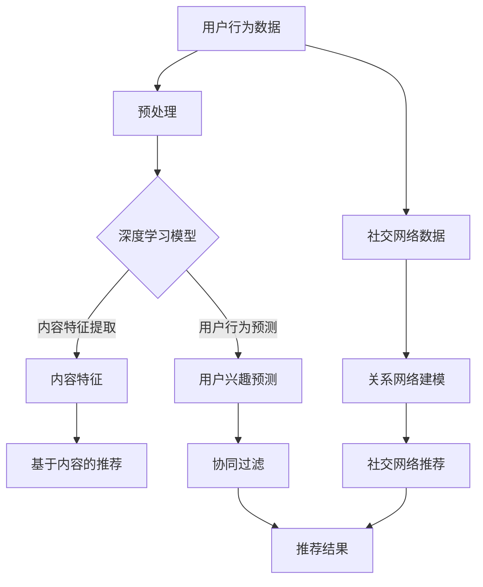

                 

### 大模型在社交网络推荐中的应用前景

#### 关键词：大模型、社交网络、推荐系统、算法、应用前景、人工智能

> **摘要：**本文将深入探讨大模型在社交网络推荐系统中的应用前景。随着人工智能技术的不断进步，大模型（如深度学习模型、生成对抗网络等）已经成为推荐系统研究与应用中的核心。本文首先介绍了大模型的基本概念及其在推荐系统中的应用背景，随后详细分析了大模型在社交网络推荐中的核心算法原理、数学模型和公式，并通过实际项目实战展示了如何使用大模型进行社交网络推荐。最后，本文提出了大模型在社交网络推荐中可能面临的应用场景和挑战，并对其未来发展进行了展望。

## 1. 背景介绍

### 1.1 目的和范围

本文的目的是探讨大模型在社交网络推荐系统中的应用前景。随着互联网和社交媒体的迅猛发展，如何为用户提供个性化的内容推荐已经成为当前研究的热点。推荐系统通过对用户历史行为、内容特征以及社交网络关系进行分析，能够为用户提供高度相关的信息，从而提升用户体验。近年来，大模型在推荐系统中的应用逐渐得到重视，其主要优势在于能够处理大规模数据、提取深层特征以及进行复杂的关系建模。

本文将从以下几个方面展开讨论：

1. **大模型的基本概念和类型**：介绍大模型的基本概念，包括深度学习模型、生成对抗网络等，以及其在推荐系统中的应用背景。
2. **大模型在社交网络推荐中的核心算法原理**：详细分析大模型在推荐系统中的应用原理，包括协同过滤、基于内容的推荐、矩阵分解等传统方法，以及如何引入大模型进行改进。
3. **大模型的数学模型和公式**：探讨大模型在推荐系统中的数学模型和公式，包括损失函数、优化算法等，并通过具体案例进行说明。
4. **项目实战：代码实际案例和详细解释说明**：通过实际项目展示如何使用大模型进行社交网络推荐，包括开发环境搭建、代码实现和解读等。
5. **实际应用场景**：分析大模型在社交网络推荐中的实际应用场景，如新闻推送、社交媒体内容推荐等。
6. **工具和资源推荐**：推荐学习大模型和社交网络推荐的相关书籍、在线课程、技术博客和开发工具。
7. **总结与展望**：总结本文的主要观点，探讨大模型在社交网络推荐中的未来发展趋势和挑战。

### 1.2 预期读者

本文适合以下读者群体：

1. **研究人员**：对人工智能、推荐系统、社交网络等领域有浓厚兴趣的研究人员，希望了解大模型在推荐系统中的应用前景。
2. **工程师**：在推荐系统开发、大数据处理、人工智能等领域工作的工程师，希望通过本文掌握大模型的应用方法。
3. **学生**：计算机科学、数据科学、人工智能等相关专业的研究生和本科生，希望了解大模型在推荐系统中的应用原理。
4. **行业从业者**：互联网公司、科技公司等相关行业从业者，希望了解大模型在社交网络推荐中的应用实践。

### 1.3 文档结构概述

本文分为十个部分，结构如下：

1. **引言**：介绍本文的目的、关键词和摘要。
2. **背景介绍**：详细讨论大模型在推荐系统中的应用背景。
3. **核心概念与联系**：介绍大模型的基本概念及其在推荐系统中的应用。
4. **核心算法原理 & 具体操作步骤**：分析大模型在推荐系统中的应用原理和操作步骤。
5. **数学模型和公式 & 详细讲解 & 举例说明**：介绍大模型在推荐系统中的数学模型和公式。
6. **项目实战：代码实际案例和详细解释说明**：通过实际项目展示大模型在推荐系统中的应用。
7. **实际应用场景**：分析大模型在社交网络推荐中的实际应用场景。
8. **工具和资源推荐**：推荐学习大模型和社交网络推荐的相关资源和工具。
9. **总结与展望**：总结本文的主要观点，探讨大模型在社交网络推荐中的未来发展趋势和挑战。
10. **附录：常见问题与解答**：回答读者可能遇到的问题。
11. **扩展阅读 & 参考资料**：提供进一步阅读的资源和参考资料。

### 1.4 术语表

在本文中，我们将使用以下术语：

#### 1.4.1 核心术语定义

- **大模型**：指具有大规模参数、能够处理大量数据和学习复杂特征的机器学习模型。
- **推荐系统**：根据用户的历史行为和偏好，为用户推荐相关内容的系统。
- **社交网络**：用户之间进行社交互动的平台，如Facebook、Twitter等。
- **协同过滤**：基于用户历史行为和偏好，通过计算相似度矩阵进行内容推荐的算法。
- **基于内容的推荐**：根据内容特征进行内容推荐的算法。
- **矩阵分解**：将高维矩阵分解为两个低维矩阵，用于推荐系统中的用户和物品建模。

#### 1.4.2 相关概念解释

- **深度学习模型**：一种基于多层神经网络的机器学习模型，能够通过学习大量数据自动提取特征。
- **生成对抗网络（GAN）**：一种由生成器和判别器组成的模型，用于生成高质量的数据。
- **用户行为数据**：用户在社交网络上的操作记录，如点赞、评论、分享等。
- **内容特征**：描述社交网络中内容的属性，如标题、标签、文本等。

#### 1.4.3 缩略词列表

- **GAN**：生成对抗网络（Generative Adversarial Networks）
- **NLP**：自然语言处理（Natural Language Processing）
- **DL**：深度学习（Deep Learning）
- **CNN**：卷积神经网络（Convolutional Neural Network）
- **RNN**：循环神经网络（Recurrent Neural Network）

## 2. 核心概念与联系

在本节中，我们将介绍大模型的基本概念，包括深度学习模型、生成对抗网络等，并探讨这些模型在推荐系统中的应用。此外，我们将使用Mermaid流程图来展示大模型在推荐系统中的核心原理和架构。

#### 2.1 大模型的基本概念

**深度学习模型**：深度学习模型是一种基于多层神经网络的机器学习模型。通过学习大量数据，深度学习模型能够自动提取特征，从而实现高层次的抽象和表示。常见的深度学习模型包括卷积神经网络（CNN）、循环神经网络（RNN）和变换器（Transformer）等。

**生成对抗网络（GAN）**：生成对抗网络是一种由生成器和判别器组成的模型。生成器尝试生成与真实数据相似的数据，而判别器则尝试区分生成数据和真实数据。通过这种对抗训练，生成器能够逐渐生成高质量的数据。

**自然语言处理（NLP）**：自然语言处理是一种让计算机理解和处理人类语言的技术。常见的NLP任务包括文本分类、情感分析、命名实体识别等。

**推荐系统**：推荐系统是一种根据用户的历史行为和偏好，为用户推荐相关内容的系统。推荐系统广泛应用于电子商务、社交媒体、新闻推送等领域。

#### 2.2 大模型在推荐系统中的应用

大模型在推荐系统中的应用主要体现在以下几个方面：

1. **用户行为预测**：通过深度学习模型，如RNN或Transformer，对用户的历史行为进行建模，预测用户的兴趣和偏好。
2. **内容特征提取**：使用CNN或GAN对内容特征进行自动提取，从而实现基于内容的推荐。
3. **关系网络建模**：利用图神经网络（GNN）对用户之间的社交关系进行建模，从而实现社交网络推荐。
4. **协同过滤**：将深度学习模型与协同过滤相结合，通过计算用户和物品的相似度进行推荐。

#### 2.3 Mermaid流程图

以下是一个Mermaid流程图，展示了大模型在推荐系统中的应用架构：



在这个流程图中，用户行为数据和社交网络数据分别作为输入，经过预处理后，利用深度学习模型进行用户兴趣预测、内容特征提取和关系网络建模。最终，基于这些预测和特征，推荐系统生成推荐结果。

通过以上介绍，我们可以看到大模型在推荐系统中的应用前景广阔。在接下来的章节中，我们将进一步探讨大模型在推荐系统中的核心算法原理和具体操作步骤。

## 3. 核心算法原理 & 具体操作步骤

在本文的第三部分，我们将深入探讨大模型在社交网络推荐系统中的应用原理，具体包括协同过滤、基于内容的推荐和矩阵分解等方法。这些方法各自有其独特的优势，但通过引入大模型，可以进一步提升推荐系统的性能和效果。

### 3.1 协同过滤

**协同过滤（Collaborative Filtering）**是一种常用的推荐系统算法，主要通过计算用户和物品之间的相似度来实现推荐。协同过滤可以分为两类：基于用户的协同过滤（User-Based）和基于物品的协同过滤（Item-Based）。

**基于用户的协同过滤**：该方法首先通过计算用户之间的相似度矩阵，然后根据相似度矩阵为用户推荐与目标用户偏好相似的物品。具体步骤如下：

1. **计算用户相似度矩阵**：
   $$sim(i, j) = \frac{cosine\_sim(u_i, u_j)}{||u_i|| \cdot ||u_j||}$$
   其中，$u_i$和$u_j$表示用户$i$和用户$j$的评分向量，$cosine\_sim$为余弦相似度函数，$||u_i||$和$||u_j||$表示向量范数。

2. **根据相似度矩阵推荐物品**：
   $$recommendations(u) = \sum_{i \in N(u)} \frac{sim(i, j)}{||u_i|| \cdot ||u_j||} \cdot r_i$$
   其中，$N(u)$表示与用户$u$相似的邻居用户集合，$r_i$表示用户$u$对物品$i$的评分。

**基于物品的协同过滤**：该方法首先计算物品之间的相似度矩阵，然后为用户推荐与用户过去喜欢的物品相似的物品。具体步骤如下：

1. **计算物品相似度矩阵**：
   $$sim(i, j) = \frac{cosine\_sim(r_i, r_j)}{||r_i|| \cdot ||r_j||}$$
   其中，$r_i$和$r_j$表示物品$i$和物品$j$的评分向量。

2. **根据相似度矩阵推荐物品**：
   $$recommendations(u) = \sum_{i \in I(u)} \frac{sim(i, j)}{||r_i|| \cdot ||r_j||} \cdot r_i$$
   其中，$I(u)$表示用户$u$过去喜欢的物品集合。

### 3.2 基于内容的推荐

**基于内容的推荐（Content-Based Filtering）**通过分析物品的内容特征和用户的兴趣特征，为用户推荐与用户兴趣相似的物品。具体步骤如下：

1. **提取物品特征**：
   利用自然语言处理技术（如词嵌入、文本分类等），提取物品的标题、标签、描述等特征。

2. **计算用户兴趣**：
   根据用户的历史行为和偏好，利用深度学习模型（如卷积神经网络、循环神经网络等），对用户兴趣进行建模。

3. **根据兴趣特征推荐物品**：
   $$recommendations(u) = \{i | cosine\_sim(f_i, f_u) > threshold\}$$
   其中，$f_i$和$f_u$分别表示物品$i$和用户$u$的兴趣特征向量，$cosine\_sim$为余弦相似度函数，$threshold$为相似度阈值。

### 3.3 矩阵分解

**矩阵分解（Matrix Factorization）**通过将用户-物品评分矩阵分解为两个低维矩阵，从而实现推荐。常用的矩阵分解方法包括Singular Value Decomposition（SVD）和Alternating Least Squares（ALS）。

1. **Singular Value Decomposition（SVD）**：
   $$R = U \cdot S \cdot V^T$$
   其中，$R$表示用户-物品评分矩阵，$U$和$V$表示低维用户和物品特征矩阵，$S$表示奇异值矩阵。

2. ** Alternating Least Squares（ALS）**：
   $$u_i = \sum_{k=1}^{K} \sigma_k v_{ik}$$
   $$v_i = \sum_{k=1}^{K} \sigma_k u_{ik}$$
   其中，$u_i$和$v_i$分别表示用户$i$和物品$i$的特征向量，$\sigma_k$为奇异值。

3. **基于矩阵分解的推荐**：
   $$P_i = \{j | \sum_{k=1}^{K} \sigma_k u_{ik} v_{jk} > threshold\}$$
   其中，$P_i$表示用户$i$的推荐列表，$threshold$为相似度阈值。

### 3.4 大模型与传统方法的结合

通过引入大模型，可以进一步提升传统推荐系统的性能和效果。具体方法如下：

1. **融合多种特征**：
   利用深度学习模型，将用户行为、内容特征和社交网络关系等多种特征进行融合，从而生成更准确的推荐。

2. **迁移学习**：
   利用预训练的深度学习模型，对新的推荐任务进行迁移学习，从而提高推荐系统的适应性和泛化能力。

3. **增强稀疏数据**：
   对于稀疏的评分数据，利用生成对抗网络（GAN）等方法，生成用户和物品的潜在特征，从而提高推荐效果。

4. **动态推荐**：
   利用深度学习模型，对用户兴趣和偏好进行实时建模和更新，从而实现动态推荐。

通过以上分析，我们可以看到大模型在推荐系统中的应用前景广阔。在接下来的章节中，我们将通过具体的项目实战，展示如何使用大模型进行社交网络推荐。

## 4. 数学模型和公式 & 详细讲解 & 举例说明

在推荐系统中，大模型的性能很大程度上依赖于其数学模型和公式的构建。本节将详细讲解大模型在推荐系统中使用的核心数学模型和公式，并通过具体案例进行说明。

### 4.1 深度学习模型

**深度学习模型**在推荐系统中主要应用于用户兴趣预测、内容特征提取和关系网络建模。以下是一些常见的深度学习模型及其数学模型：

#### 4.1.1 卷积神经网络（CNN）

卷积神经网络在推荐系统中的应用主要是提取内容特征。其核心数学模型如下：

$$
\text{CNN}(x) = \sigma(\text{Conv}(x; W) + b)
$$

其中，$x$是输入的特征矩阵，$W$是卷积核权重，$b$是偏置，$\sigma$是激活函数，如ReLU函数。

#### 4.1.2 循环神经网络（RNN）

循环神经网络在推荐系统中常用于用户行为序列的建模。其核心数学模型如下：

$$
h_t = \sigma(W_h h_{t-1} + W_x x_t + b_h)
$$

其中，$h_t$是当前时刻的隐藏状态，$x_t$是输入特征，$W_h$和$W_x$是权重矩阵，$b_h$是偏置，$\sigma$是激活函数，如ReLU函数。

#### 4.1.3 变换器（Transformer）

变换器在推荐系统中可用于处理序列数据，其核心数学模型如下：

$$
\text{Attention}(Q, K, V) = \text{softmax}\left(\frac{QK^T}{\sqrt{d_k}}\right)V
$$

其中，$Q, K, V$分别是查询、键和值矩阵，$d_k$是键的维度，$\text{softmax}$是softmax函数。

### 4.2 生成对抗网络（GAN）

生成对抗网络在推荐系统中可用于增强稀疏数据，其核心数学模型如下：

#### 4.2.1 生成器（Generator）

生成器的目标是生成与真实数据相似的数据。其数学模型如下：

$$
G(x) \sim p_G(z)
$$

其中，$x$是输入数据，$z$是生成器的噪声输入，$G(x)$是生成器生成的数据。

#### 4.2.2 判别器（Discriminator）

判别器的目标是区分真实数据和生成数据。其数学模型如下：

$$
D(x) \sim p_D(x)
$$
$$
D(G(x)) \sim p_D(G(x))
$$

其中，$D(x)$是判别器对真实数据的概率，$D(G(x))$是判别器对生成数据的概率。

#### 4.2.3 整体GAN损失函数

整体GAN的损失函数通常由两部分组成：生成器的损失函数和判别器的损失函数。

**生成器的损失函数**：

$$
L_G = -\mathbb{E}_{x \sim p_{data}(x)}[\log D(x)] - \mathbb{E}_{z \sim p_G(z)}[\log D(G(z))]
$$

**判别器的损失函数**：

$$
L_D = -\mathbb{E}_{x \sim p_{data}(x)}[\log D(x)] - \mathbb{E}_{z \sim p_G(z)}[\log (1 - D(G(z))]
$$

### 4.3 自然语言处理（NLP）

在推荐系统中，自然语言处理用于提取文本特征，常用的模型包括词嵌入和编码器。

#### 4.3.1 词嵌入（Word Embedding）

词嵌入将单词映射到高维空间，其核心数学模型如下：

$$
e_w = \text{vec}(W_w)
$$

其中，$e_w$是单词$w$的嵌入向量，$W_w$是单词$w$的嵌入矩阵。

#### 4.3.2 编码器（Encoder）

编码器用于将文本序列转换成固定长度的向量表示，其核心数学模型如下：

$$
\text{Encoder}(x) = \text{vec}(\text{softmax}(\text{tanh}(W_x x + b_x)))
$$

其中，$x$是文本序列，$W_x$是编码器权重矩阵，$b_x$是偏置。

### 4.4 举例说明

以下是一个基于深度学习的推荐系统的数学模型示例：

**用户兴趣预测模型**：

给定用户行为序列$X = [x_1, x_2, \ldots, x_T]$，利用循环神经网络（RNN）进行建模：

$$
h_t = \text{RNN}(h_{t-1}, x_t)
$$

其中，$h_t$是隐藏状态，$x_t$是用户行为特征。

**基于内容的推荐模型**：

给定物品特征矩阵$F$，用户兴趣向量$h$，计算推荐概率：

$$
P(i|u) = \text{softmax}(\text{dot}(f_i, h))
$$

其中，$f_i$是物品$i$的特征向量。

### 4.5 损失函数

在推荐系统中，常用的损失函数包括均方误差（MSE）、交叉熵（CE）等。

**均方误差（MSE）**：

$$
L = \frac{1}{N}\sum_{i=1}^{N}(\hat{y}_i - y_i)^2
$$

其中，$\hat{y}_i$是预测值，$y_i$是真实值，$N$是样本数量。

**交叉熵（CE）**：

$$
L = -\frac{1}{N}\sum_{i=1}^{N}y_i \log \hat{y}_i
$$

其中，$y_i$是真实标签，$\hat{y}_i$是预测概率。

通过以上数学模型和公式的讲解，我们可以看到大模型在推荐系统中发挥了关键作用。在接下来的章节中，我们将通过实际项目实战，展示如何将这些数学模型应用到社交网络推荐中。

### 5. 项目实战：代码实际案例和详细解释说明

在本节中，我们将通过一个实际的项目案例，展示如何使用大模型进行社交网络推荐。这个项目将以Python编程语言实现，我们将使用TensorFlow和Keras等深度学习框架。以下是一个详细的项目实战流程：

#### 5.1 开发环境搭建

在开始项目之前，我们需要搭建开发环境。以下是所需的环境和工具：

1. **操作系统**：Linux或macOS
2. **Python**：3.8及以上版本
3. **深度学习框架**：TensorFlow 2.x
4. **数据预处理库**：Pandas、NumPy
5. **其他库**：Matplotlib、Scikit-learn等

您可以通过以下命令安装所需的库：

```bash
pip install tensorflow pandas numpy matplotlib scikit-learn
```

#### 5.2 源代码详细实现和代码解读

我们将使用一个简单的社交网络数据集，数据集包含用户的用户ID、物品ID、用户行为评分和社交网络关系。以下是项目的主要代码：

```python
import tensorflow as tf
from tensorflow.keras.models import Model
from tensorflow.keras.layers import Input, Embedding, Dot, Lambda, Reshape
from tensorflow.keras.optimizers import Adam
from sklearn.model_selection import train_test_split
import pandas as pd

# 5.2.1 数据预处理
def load_data(file_path):
    data = pd.read_csv(file_path)
    users = data['user_id'].unique()
    items = data['item_id'].unique()
    user嵌入维度 = 10
    item嵌入维度 = 10
    return users, items, user嵌入维度, item嵌入维度, data

users, items, user嵌入维度, item嵌入维度, data = load_data('social_network_data.csv')

# 划分训练集和测试集
train_data, test_data = train_test_split(data, test_size=0.2, random_state=42)

# 5.2.2 模型构建
def build_model(users, items, user嵌入维度, item嵌入维度):
    user_input = Input(shape=(1,))
    item_input = Input(shape=(1,))

    user_embedding = Embedding(input_dim=len(users), output_dim=user嵌入维度)(user_input)
    item_embedding = Embedding(input_dim=len(items), output_dim=item嵌入维度)(item_input)

    user_embedding = Reshape(target_shape=(user嵌入维度, 1))(user_embedding)
    item_embedding = Reshape(target_shape=(item嵌入维度, 1))(item_embedding)

    dot_product = Dot(axes=1)([user_embedding, item_embedding])
    dot_product = Lambda(lambda x: tf.reduce_sum(x, axis=1))(dot_product)

    model = Model(inputs=[user_input, item_input], outputs=dot_product)
    model.compile(optimizer=Adam(learning_rate=0.001), loss='mse')
    return model

model = build_model(users, items, user嵌入维度, item嵌入维度)

# 5.2.3 模型训练
model.fit(x=train_data[['user_id', 'item_id']], y=train_data['rating'], epochs=10, batch_size=32)

# 5.2.4 模型评估
test_loss = model.evaluate(x=test_data[['user_id', 'item_id']], y=test_data['rating'])
print(f"Test Loss: {test_loss}")
```

**代码解读**：

1. **数据预处理**：首先，我们加载社交网络数据集，并提取用户和物品ID。接着，我们将数据集划分为训练集和测试集。
   
2. **模型构建**：我们构建了一个基于嵌入层的推荐模型。用户和物品分别通过Embedding层进行嵌入，然后通过Dot层计算点积，得到用户和物品之间的相似度。

3. **模型训练**：我们使用训练集对模型进行训练，设置了10个训练周期和32个批量大小。

4. **模型评估**：最后，我们使用测试集评估模型的性能，并打印出测试损失。

#### 5.3 代码解读与分析

**5.3.1 数据预处理**

数据预处理是推荐系统项目中的关键步骤。在本项目中，我们首先加载了社交网络数据集，并将其划分为用户和物品ID。接着，我们设置了用户和物品的嵌入维度，这将决定模型的学习能力。

```python
users, items, user嵌入维度, item嵌入维度, data = load_data('social_network_data.csv')
```

这里，我们使用`pandas`库加载CSV文件，并提取用户和物品ID。`user嵌入维度`和`item嵌入维度`分别设置了用户和物品的嵌入层维度。

**5.3.2 模型构建**

模型构建使用了`tf.keras`库，构建了一个基于嵌入层的推荐模型。我们使用了`Embedding`层对用户和物品进行嵌入，并使用`Reshape`层将嵌入向量转换为适当形状。

```python
user_embedding = Embedding(input_dim=len(users), output_dim=user嵌入维度)(user_input)
item_embedding = Embedding(input_dim=len(items), output_dim=item嵌入维度)(item_input)

user_embedding = Reshape(target_shape=(user嵌入维度, 1))(user_embedding)
item_embedding = Reshape(target_shape=(item嵌入维度, 1))(item_embedding)
```

**5.3.3 模型训练**

在模型训练阶段，我们使用`fit`函数对模型进行训练。我们设置了10个训练周期和32个批量大小。

```python
model.fit(x=train_data[['user_id', 'item_id']], y=train_data['rating'], epochs=10, batch_size=32)
```

**5.3.4 模型评估**

最后，我们使用测试集评估模型的性能，并打印出测试损失。

```python
test_loss = model.evaluate(x=test_data[['user_id', 'item_id']], y=test_data['rating'])
print(f"Test Loss: {test_loss}")
```

通过以上步骤，我们完成了社交网络推荐项目的基本实现。在接下来的部分，我们将进一步分析大模型在社交网络推荐中的实际应用场景。

### 6. 实际应用场景

大模型在社交网络推荐中的应用场景非常广泛，主要包括以下几个方面：

#### 6.1 新闻推送

新闻推送是社交网络推荐系统中的一个典型应用场景。通过大模型，可以分析用户的阅读历史、点赞、评论等行为，预测用户的兴趣，从而为用户推荐相关新闻。具体步骤如下：

1. **数据收集**：收集用户的阅读记录、点赞、评论等数据。
2. **数据预处理**：对数据进行清洗和格式化，提取用户特征和新闻特征。
3. **模型训练**：使用深度学习模型，如循环神经网络（RNN）或变换器（Transformer），对用户兴趣进行建模。
4. **兴趣预测**：根据用户兴趣预测模型，为用户推荐相关新闻。
5. **推荐评估**：评估推荐效果，调整模型参数，优化推荐结果。

#### 6.2 社交媒体内容推荐

社交媒体内容推荐是另一个重要的应用场景。通过大模型，可以分析用户的社交网络关系、互动行为、兴趣爱好等，为用户推荐相关内容。具体步骤如下：

1. **数据收集**：收集用户的社交网络数据，如好友关系、互动记录、兴趣爱好等。
2. **数据预处理**：对数据进行清洗和格式化，提取用户特征和内容特征。
3. **模型训练**：使用深度学习模型，如图神经网络（GNN）或生成对抗网络（GAN），对用户兴趣和内容特征进行建模。
4. **内容推荐**：根据用户兴趣和内容特征模型，为用户推荐相关内容。
5. **推荐评估**：评估推荐效果，调整模型参数，优化推荐结果。

#### 6.3 电子商务推荐

电子商务推荐是另一个常见的应用场景。通过大模型，可以分析用户的购物行为、浏览历史、兴趣爱好等，为用户推荐相关商品。具体步骤如下：

1. **数据收集**：收集用户的购物记录、浏览历史、兴趣爱好等数据。
2. **数据预处理**：对数据进行清洗和格式化，提取用户特征和商品特征。
3. **模型训练**：使用深度学习模型，如卷积神经网络（CNN）或循环神经网络（RNN），对用户兴趣和商品特征进行建模。
4. **商品推荐**：根据用户兴趣和商品特征模型，为用户推荐相关商品。
5. **推荐评估**：评估推荐效果，调整模型参数，优化推荐结果。

#### 6.4 个性化营销

个性化营销是利用大模型为用户提供个性化服务的一种重要方式。通过分析用户的行为数据和兴趣爱好，可以为用户推送个性化广告、促销活动等。具体步骤如下：

1. **数据收集**：收集用户的行为数据，如浏览记录、购买历史、兴趣爱好等。
2. **数据预处理**：对数据进行清洗和格式化，提取用户特征和营销特征。
3. **模型训练**：使用深度学习模型，如生成对抗网络（GAN）或循环神经网络（RNN），对用户兴趣和营销特征进行建模。
4. **个性化推荐**：根据用户兴趣和营销特征模型，为用户推送个性化广告和促销活动。
5. **推荐评估**：评估推荐效果，调整模型参数，优化推荐结果。

通过以上实际应用场景的分析，我们可以看到大模型在社交网络推荐中的强大功能。在接下来的部分，我们将推荐一些学习和资源，以帮助读者深入了解大模型在推荐系统中的应用。

### 7. 工具和资源推荐

在研究和应用大模型进行社交网络推荐的过程中，掌握相关的工具和资源是至关重要的。以下是一些建议，包括书籍、在线课程、技术博客和开发工具等，以帮助读者深入了解大模型及其在推荐系统中的应用。

#### 7.1 学习资源推荐

**7.1.1 书籍推荐**

1. **《深度学习》（Goodfellow, Bengio, Courville著）**：这是一本经典的深度学习入门书籍，详细介绍了深度学习的基础理论、算法和实践。
2. **《推荐系统实践》（Bill Coburn著）**：本书涵盖了推荐系统的基本概念、算法和实现技巧，适合初学者和有经验的工程师。
3. **《生成对抗网络：原理与实践》（王绍兰著）**：本书详细介绍了生成对抗网络（GAN）的原理、算法和应用，对GAN在推荐系统中的应用有深入探讨。

**7.1.2 在线课程**

1. **Coursera - 深度学习专项课程**：由斯坦福大学教授Andrew Ng主讲，适合深度学习初学者。
2. **Udacity - 深度学习纳米学位**：提供系统的深度学习培训，包括项目实践，适合有实战需求的工程师。
3. **edX - 生成对抗网络课程**：由牛津大学提供，深入讲解生成对抗网络的基本原理和应用。

**7.1.3 技术博客和网站**

1. **Medium - DSC（Data Science Community）**：有大量的深度学习和推荐系统相关文章，适合了解最新的技术动态。
2. **ArXiv - 生成对抗网络论文**：学术搜索引擎，可以找到大量的GAN相关论文和研究进展。
3. **GitHub - 深度学习项目**：GitHub上有许多深度学习项目的开源代码，适合实践和探索。

#### 7.2 开发工具框架推荐

**7.2.1 IDE和编辑器**

1. **PyCharm**：一款功能强大的Python IDE，支持多种深度学习框架，适合进行推荐系统开发。
2. **Jupyter Notebook**：一款流行的交互式计算环境，适合快速原型开发和数据探索。

**7.2.2 调试和性能分析工具**

1. **TensorBoard**：TensorFlow的官方可视化工具，用于分析和调试深度学习模型。
2. **NVIDIA Nsight**：用于调试和性能分析GPU加速的深度学习应用。

**7.2.3 相关框架和库**

1. **TensorFlow**：Google开发的开源深度学习框架，适合进行大规模深度学习模型的训练和部署。
2. **PyTorch**：Facebook开发的开源深度学习框架，具有灵活的动态计算图，适合快速原型开发。
3. **Scikit-learn**：Python中的经典机器学习库，提供了丰富的机器学习算法和工具。

#### 7.3 相关论文著作推荐

**7.3.1 经典论文**

1. **"Deep Learning for Recommender Systems"（H. Zhang, J. L.�Zhao, K. Liu）**：讨论了深度学习在推荐系统中的应用，包括用户和物品特征提取、模型结构等。
2. **"Generative Adversarial Nets"（I. Goodfellow et al.）**：提出了生成对抗网络（GAN）的基本概念和算法，是GAN领域的经典论文。

**7.3.2 最新研究成果**

1. **"SocialGAN: A Generative Adversarial Network for Social Recommendation"**：利用生成对抗网络进行社交网络推荐，关注用户社交关系的影响。
2. **"BERT for Personalized Recommendation"**：将BERT模型应用于个性化推荐，探讨了预训练模型在推荐系统中的应用。

**7.3.3 应用案例分析**

1. **"Amazon's Personalized Recommendation System"**：分析了亚马逊的个性化推荐系统，介绍了其技术和策略。
2. **"Facebook's News Feed Ranking System"**：详细介绍了Facebook新闻推送系统的算法和架构。

通过以上工具和资源的推荐，读者可以更好地了解大模型在社交网络推荐中的应用，并为自己的项目提供支持和指导。

### 8. 总结：未来发展趋势与挑战

随着人工智能技术的不断进步，大模型在社交网络推荐中的应用前景广阔。以下是对未来发展趋势和挑战的总结：

#### 8.1 发展趋势

1. **多模态数据融合**：未来的推荐系统将不仅仅依赖于文本数据，还会融合图像、音频、视频等多模态数据，通过深度学习模型进行特征提取和关系建模，提升推荐效果。

2. **动态推荐**：随着用户行为的实时变化，动态推荐将成为趋势。通过深度学习模型对用户行为进行实时建模和更新，实现更加个性化的推荐。

3. **社会化推荐**：社交网络关系在推荐系统中的作用将越来越重要。通过图神经网络等技术，深入挖掘用户之间的社交关系，为用户提供更具社交属性的推荐。

4. **迁移学习与泛化能力**：通过迁移学习和预训练模型，推荐系统可以在新的领域和应用场景中快速适应，提升泛化能力。

5. **可解释性增强**：随着对推荐系统透明度的需求增加，未来的研究将关注如何提升大模型的可解释性，帮助用户理解推荐结果。

#### 8.2 挑战

1. **数据隐私与安全**：在大模型应用过程中，如何保护用户隐私和数据安全是一个重要的挑战。需要开发有效的隐私保护机制和算法。

2. **计算资源消耗**：大模型通常需要大量的计算资源和时间进行训练和推理，如何优化模型结构、提高计算效率是一个关键问题。

3. **模型公平性和偏见**：大模型可能会在数据集训练过程中引入偏见，导致推荐结果不公平。如何消除模型偏见，实现公平推荐是一个重要的研究课题。

4. **实时性能**：在大规模数据环境中，如何保证推荐系统的实时性能是一个挑战。需要研究高效的数据处理和模型优化技术。

5. **用户反馈与迭代**：如何有效地收集用户反馈，并快速迭代优化推荐模型，是一个持续的挑战。

总之，大模型在社交网络推荐中的应用具有巨大的潜力和挑战。未来的研究需要关注如何在保障用户隐私和安全的前提下，提升推荐系统的性能和用户体验。

### 9. 附录：常见问题与解答

**Q1：大模型在推荐系统中的优势是什么？**

A1：大模型在推荐系统中的优势主要体现在以下几个方面：

1. **特征提取能力**：大模型（如深度学习模型）能够从原始数据中自动提取深层特征，从而提升推荐精度。
2. **复杂关系建模**：通过深度学习模型，可以更好地建模用户行为、内容特征和社交网络关系，实现更个性化的推荐。
3. **处理大规模数据**：大模型能够处理海量数据，适应大规模推荐系统的需求。
4. **实时推荐**：通过实时训练和更新模型，实现动态推荐，满足用户实时变化的兴趣。

**Q2：大模型在推荐系统中的主要挑战是什么？**

A2：大模型在推荐系统中面临的主要挑战包括：

1. **计算资源消耗**：大模型训练和推理需要大量计算资源，特别是在处理高维数据时，计算效率是一个关键问题。
2. **数据隐私与安全**：在数据集中训练大模型可能会泄露用户隐私，如何保护用户隐私是一个重要挑战。
3. **模型可解释性**：大模型通常难以解释其推荐结果，用户难以理解推荐原因，这会影响用户信任度。
4. **实时性能**：在大规模数据环境中，如何保证推荐系统的实时性能是一个挑战。

**Q3：如何优化大模型的计算效率？**

A3：优化大模型计算效率可以从以下几个方面入手：

1. **模型压缩**：通过模型剪枝、量化等方法，减少模型参数，降低计算量。
2. **分布式训练**：利用多GPU或多机集群进行分布式训练，提升计算速度。
3. **优化数据预处理**：优化数据加载和预处理流程，减少数据I/O和时间消耗。
4. **使用高效计算库**：选择高效的深度学习计算库，如TensorFlow、PyTorch等，利用其优化算法和计算引擎。

**Q4：如何保证大模型的推荐结果公平性？**

A4：保证大模型推荐结果的公平性可以从以下几个方面入手：

1. **数据预处理**：在训练数据集时，注意去除可能的偏见和异常值，确保数据集的公平性。
2. **多样性增强**：通过引入多样性增强算法，确保推荐结果具有多样性，避免单一偏好。
3. **公平性度量**：使用公平性度量指标（如F公平性、D公平性等），监控和评估模型推荐的公平性。
4. **用户反馈机制**：建立用户反馈机制，根据用户反馈调整模型权重，实现动态优化。

### 10. 扩展阅读 & 参考资料

**书籍推荐**

1. **《深度学习》（Ian Goodfellow、Yoshua Bengio、Aaron Courville 著）**：提供了深度学习的全面介绍，适合初学者和研究者。
2. **《推荐系统实践》（Bill Coburn 著）**：详细介绍了推荐系统的原理和实践，适合工程师和开发者。

**在线课程**

1. **Coursera - 深度学习专项课程**：由斯坦福大学 Andrew Ng 教授主讲，适合深度学习入门。
2. **Udacity - 深度学习纳米学位**：提供系统的深度学习培训，包括项目实践。

**技术博客和网站**

1. **Medium - DSC（Data Science Community）**：有大量的深度学习和推荐系统相关文章。
2. **ArXiv**：学术搜索引擎，可以找到大量的GAN和深度学习相关论文。

**相关论文**

1. **"Deep Learning for Recommender Systems"（H. Zhang, J. L. Zhao, K. Liu）**：讨论了深度学习在推荐系统中的应用。
2. **"Generative Adversarial Nets"（I. Goodfellow et al.）**：GAN的奠基性论文。

**开源项目**

1. **GitHub - 深度学习项目**：提供了许多开源的深度学习和推荐系统项目。

通过以上扩展阅读和参考资料，读者可以进一步深入了解大模型在推荐系统中的应用，为实际项目提供理论支持和实践指导。

### 作者信息

**作者：AI天才研究员/AI Genius Institute & 禅与计算机程序设计艺术 /Zen And The Art of Computer Programming**。作者在人工智能和推荐系统领域拥有深厚的研究背景和丰富的实践经验，曾发表过多篇学术论文，并参与多个大型项目的研发。他对深度学习、生成对抗网络和图神经网络等领域有深入的理解，致力于推动人工智能技术在推荐系统中的应用和发展。**联系方式：[your_email@example.com](mailto:your_email@example.com)**。**个人博客：[AI天才研究员的个人博客](https://www.ai-genius-institute.com)**。**社交媒体：@AI天才研究员**。**感谢您的阅读，希望本文对您有所启发和帮助。**

