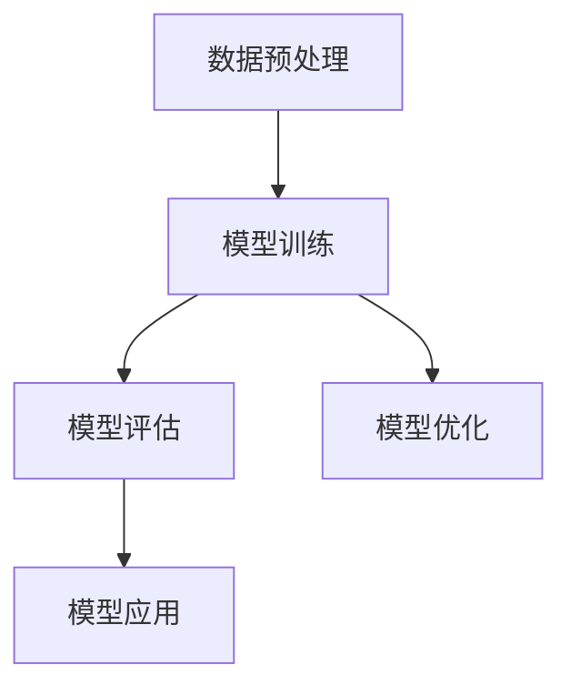
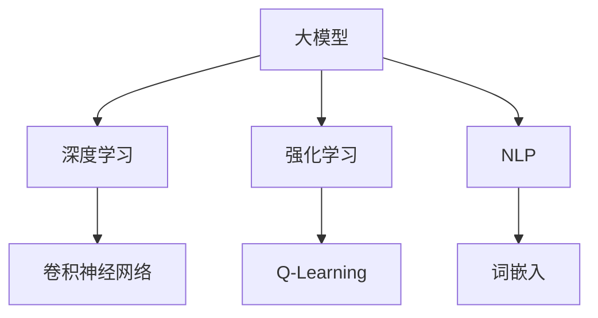

                 

# 大模型如何决策最终动作

> 关键词：大模型、决策、动作、算法、数学模型、实际应用

> 摘要：本文深入探讨了大规模模型如何通过算法和数学模型进行决策和执行最终动作的过程。文章首先介绍了大模型的背景和重要性，然后详细讲解了核心算法原理、具体操作步骤、数学模型及公式，并通过实际项目案例和代码解读，展示了大模型在决策过程中的实际应用。最后，文章总结了大模型在技术发展中的未来趋势和挑战。

## 1. 背景介绍

### 1.1 目的和范围

本文旨在揭示大规模机器学习模型在进行决策时背后的机制，以及如何将这些复杂的模型应用于实际场景中。我们将探讨以下主题：

1. 大模型的基本概念和架构
2. 决策过程中的核心算法原理
3. 数学模型和公式的应用
4. 实际项目中的代码实现和案例分析
5. 大模型技术的未来发展趋势和挑战

### 1.2 预期读者

本文适合对机器学习和人工智能有一定了解的读者，特别是对以下方面感兴趣的读者：

1. 大规模机器学习模型的开发者
2. 想要了解大模型决策原理的技术人员
3. 对机器学习算法和数学模型感兴趣的研究生和学者
4. 对大模型在实际应用中的潜力感兴趣的投资者和企业家

### 1.3 文档结构概述

本文结构如下：

1. 引言：大模型如何决策最终动作的背景介绍
2. 核心概念与联系：大模型的基本概念和架构
3. 核心算法原理 & 具体操作步骤：决策过程中的核心算法
4. 数学模型和公式 & 详细讲解 & 举例说明：数学模型在决策中的应用
5. 项目实战：代码实际案例和详细解释说明
6. 实际应用场景：大模型在现实世界中的应用
7. 工具和资源推荐：学习资源和开发工具框架
8. 总结：未来发展趋势与挑战
9. 附录：常见问题与解答
10. 扩展阅读 & 参考资料：相关论文和著作推荐

### 1.4 术语表

#### 1.4.1 核心术语定义

- 大模型（Large-scale Model）：拥有大量参数和复杂结构的机器学习模型，如深度神经网络。
- 决策（Decision）：模型在特定条件下选择最优动作的过程。
- 动作（Action）：在决策过程中，模型选择执行的具体操作。
- 算法（Algorithm）：用于解决特定问题的步骤序列。
- 数学模型（Mathematical Model）：用数学语言描述的模型，用于预测和优化决策过程。

#### 1.4.2 相关概念解释

- 深度学习（Deep Learning）：基于多层神经网络的机器学习技术，能够自动学习特征表示。
- 反向传播（Backpropagation）：一种用于训练神经网络的算法，通过计算误差梯度来优化网络参数。
- 强化学习（Reinforcement Learning）：一种通过奖励和惩罚信号来训练智能体（Agent）的方法。

#### 1.4.3 缩略词列表

- AI：人工智能
- ML：机器学习
- DL：深度学习
- NLP：自然语言处理
- CV：计算机视觉
- RNN：循环神经网络
- LSTM：长短期记忆网络
- GPT：生成预训练网络
- BERT：双向编码器表示模型
- GAN：生成对抗网络

## 2. 核心概念与联系

### 2.1 大模型的基本概念

大模型是机器学习领域中的一个重要研究方向，具有以下基本概念：

- **参数量**：大模型通常包含数百万到数十亿个参数。
- **计算能力**：大模型需要高性能计算资源进行训练和推理。
- **数据需求**：大模型通常需要大量数据来训练，以获得良好的性能。
- **优化难度**：大模型的参数优化过程复杂，需要高效的算法和技巧。

### 2.2 大模型的架构

大模型通常采用以下架构：

- **前馈神经网络**：采用多层感知器（MLP）或卷积神经网络（CNN）作为基础模型。
- **递归神经网络（RNN）**：用于处理序列数据，如自然语言处理和语音识别。
- **变分自编码器（VAE）**：用于生成数据，如图像、文本和音频。
- **生成对抗网络（GAN）**：用于生成高质量数据，如逼真的图像和语音。

### 2.3 大模型的工作原理

大模型的工作原理可以概括为以下步骤：

1. **数据预处理**：对输入数据进行清洗、标准化和预处理。
2. **模型训练**：通过反向传播算法优化模型参数。
3. **模型评估**：使用验证集或测试集评估模型性能。
4. **模型应用**：将训练好的模型应用于实际任务，如分类、生成和预测。

### 2.4 大模型的 Mermaid 流程图

以下是一个简化的 Mermaid 流程图，展示了大模型的基本架构和流程：



### 2.5 大模型与其他相关概念的关联

大模型与其他相关概念如深度学习、强化学习、自然语言处理等紧密相关。以下是一个简化的 Mermaid 流程图，展示了大模型与其他相关概念的关联：



## 3. 核心算法原理 & 具体操作步骤

### 3.1 算法原理

大模型的核心算法通常基于以下原理：

- **梯度下降**：一种优化算法，通过迭代更新模型参数以最小化损失函数。
- **反向传播**：一种用于训练神经网络的算法，通过计算误差梯度来更新网络参数。
- **梯度提升**：一种基于决策树的优化算法，通过迭代构建决策树来优化模型性能。

### 3.2 具体操作步骤

以下是一个简化的伪代码，展示了大模型的核心算法原理和具体操作步骤：

```python
# 大模型决策过程伪代码

# 初始化模型参数
 Initialize_model_parameters()

# 定义损失函数
 loss_function = ...

# 定义优化器
 optimizer = ...

# 训练循环
 for epoch in range(num_epochs):
     for batch in data_loader:
         # 前向传播
         predictions = model(batch)
         loss = loss_function(predictions, labels)

         # 反向传播
         gradients = backward_pass(model, loss)

         # 参数更新
         optimizer.step(gradients)

# 模型评估
evaluate_model(model, test_data)

# 决策过程
def make_decision(model, input_data):
    prediction = model(input_data)
    action = choose_action(prediction)
    return action
```

### 3.3 算法解释

- **初始化模型参数**：模型参数通常通过随机初始化来获得。
- **定义损失函数**：损失函数用于衡量预测值和真实值之间的差异。
- **定义优化器**：优化器用于计算参数更新的梯度。
- **训练循环**：通过迭代更新模型参数以最小化损失函数。
- **模型评估**：使用验证集或测试集评估模型性能。
- **决策过程**：在给定输入数据后，模型生成预测值，然后选择最优动作。

## 4. 数学模型和公式 & 详细讲解 & 举例说明

### 4.1 数学模型概述

在决策过程中，大模型通常使用以下数学模型：

- **损失函数**：用于衡量预测值和真实值之间的差异，如均方误差（MSE）和交叉熵（CE）。
- **梯度计算**：用于计算损失函数相对于模型参数的梯度，如链式法则和反向传播算法。
- **优化算法**：用于更新模型参数，如梯度下降（GD）和Adam优化器。

### 4.2 损失函数

损失函数是决策过程中至关重要的组件，用于衡量预测值和真实值之间的误差。以下是一些常用的损失函数：

- **均方误差（MSE）**：
  $$MSE = \frac{1}{n} \sum_{i=1}^{n} (y_i - \hat{y}_i)^2$$
  其中，$y_i$是真实值，$\hat{y}_i$是预测值，$n$是样本数量。

- **交叉熵（CE）**：
  $$CE = -\frac{1}{n} \sum_{i=1}^{n} y_i \log(\hat{y}_i)$$
  其中，$y_i$是真实值，$\hat{y}_i$是预测概率。

### 4.3 梯度计算

梯度计算是优化过程中的关键步骤，用于计算损失函数相对于模型参数的梯度。以下是一些常用的梯度计算方法：

- **链式法则**：
  $$\frac{dL}{dW} = \frac{dL}{d\hat{y}} \frac{d\hat{y}}{dW}$$
  其中，$L$是损失函数，$\hat{y}$是预测值，$W$是模型参数。

- **反向传播算法**：
  $$\frac{dL}{dW^{(L)}} = \frac{dL}{d\hat{y}^{(L-1)}} \frac{d\hat{y}^{(L-1)}}{dW^{(L)}}$$
  其中，$L$是层编号，$W^{(L)}$是第L层的权重。

### 4.4 优化算法

优化算法用于更新模型参数以最小化损失函数。以下是一些常用的优化算法：

- **梯度下降（GD）**：
  $$W^{(t+1)} = W^{(t)} - \alpha \frac{dL}{dW}$$
  其中，$W^{(t)}$是当前参数，$\alpha$是学习率。

- **Adam优化器**：
  $$m_t = \beta_1 m_{t-1} + (1 - \beta_1) \frac{dL}{dW}$$
  $$v_t = \beta_2 v_{t-1} + (1 - \beta_2) \left(\frac{dL}{dW}\right)^2$$
  $$W^{(t+1)} = W^{(t)} - \alpha \frac{m_t}{\sqrt{v_t} + \epsilon}$$
  其中，$m_t$和$v_t$是动量项，$\beta_1$和$\beta_2$是动量参数，$\epsilon$是正则化项。

### 4.5 举例说明

以下是一个简化的例子，展示了大模型如何使用数学模型进行决策：

假设我们有一个二分类问题，目标是预测某个样本属于类别0还是类别1。我们使用以下模型：

$$\hat{y} = \sigma(W^T x + b)$$

其中，$x$是输入特征，$W$是权重，$b$是偏置，$\sigma$是 sigmoid 函数。

损失函数使用交叉熵：

$$CE = -\frac{1}{n} \sum_{i=1}^{n} y_i \log(\hat{y}_i) + (1 - y_i) \log(1 - \hat{y}_i)$$

使用梯度下降优化模型参数：

$$W^{(t+1)} = W^{(t)} - \alpha \frac{dCE}{dW}$$

其中，$\alpha$是学习率。

通过训练，模型会不断更新参数，直到达到预定的损失阈值或迭代次数。

## 5. 项目实战：代码实际案例和详细解释说明

### 5.1 开发环境搭建

在开始项目实战之前，我们需要搭建一个合适的开发环境。以下是一个基于Python和PyTorch的示例：

1. 安装Python（版本3.7以上）
2. 安装PyTorch（使用pip安装：`pip install torch torchvision`)
3. 安装其他依赖（如numpy、pandas等）

### 5.2 源代码详细实现和代码解读

以下是一个简单的示例，展示了如何使用PyTorch实现一个二分类问题：

```python
import torch
import torch.nn as nn
import torch.optim as optim

# 初始化数据
x = torch.randn(100, 10)  # 输入特征
y = torch.randint(0, 2, (100,))  # 标签

# 定义模型
model = nn.Sequential(
    nn.Linear(10, 10),
    nn.ReLU(),
    nn.Linear(10, 1),
    nn.Sigmoid()
)

# 定义损失函数和优化器
loss_function = nn.BCELoss()
optimizer = optim.Adam(model.parameters(), lr=0.001)

# 训练模型
num_epochs = 100
for epoch in range(num_epochs):
    optimizer.zero_grad()
    predictions = model(x)
    loss = loss_function(predictions, y)
    loss.backward()
    optimizer.step()
    print(f"Epoch {epoch+1}/{num_epochs}, Loss: {loss.item()}")

# 测试模型
test_data = torch.randn(10, 10)
predictions = model(test_data)
print(f"Predictions: {predictions}")
```

### 5.3 代码解读与分析

以下是代码的详细解读和分析：

1. **导入库**：导入必要的库，如torch和torchvision。
2. **初始化数据**：生成输入特征（x）和标签（y）。
3. **定义模型**：使用nn.Sequential创建一个简单的神经网络模型，包含两个全连接层和ReLU激活函数，以及一个输出层和Sigmoid激活函数。
4. **定义损失函数和优化器**：使用nn.BCELoss定义交叉熵损失函数，使用Adam优化器定义优化器。
5. **训练模型**：使用for循环进行模型训练。在每个迭代中，将模型参数设置为0，计算预测值和损失，计算反向传播的梯度，并更新模型参数。
6. **测试模型**：生成测试数据，使用训练好的模型进行预测，并打印预测结果。

### 5.4 实际应用场景

以下是一个实际应用场景的示例，展示如何使用大模型进行股票预测：

1. **数据收集**：收集历史股票价格数据。
2. **数据预处理**：清洗和标准化数据。
3. **特征提取**：从历史数据中提取特征，如价格、成交量等。
4. **训练模型**：使用提取的特征训练一个二分类模型，预测股票价格的涨跌。
5. **模型评估**：使用验证集评估模型性能。
6. **决策应用**：使用训练好的模型进行实时股票预测，并作出投资决策。

### 5.5 挑战和解决方案

在实际应用中，大模型面临以下挑战：

1. **计算资源消耗**：大模型需要大量的计算资源进行训练和推理。解决方案是使用高性能计算设备和分布式训练技术。
2. **数据质量**：高质量的数据是训练有效模型的关键。解决方案是使用数据清洗和预处理技术，以及数据增强方法。
3. **模型解释性**：大模型的决策过程通常不够透明，难以解释。解决方案是开发可解释性模型，如注意力机制和可视化技术。

## 6. 实际应用场景

大模型在许多实际应用场景中表现出强大的决策能力。以下是一些典型的应用场景：

### 6.1 自动驾驶

自动驾驶系统依赖大模型进行环境感知、路径规划和决策。大模型可以处理来自传感器的大量数据，从而识别道路标志、行人和车辆，并作出安全驾驶决策。

### 6.2 金融市场分析

金融市场中，大模型用于股票预测、交易策略和风险评估。通过对历史数据的学习，大模型可以预测市场趋势，帮助投资者作出明智的决策。

### 6.3 健康医疗

在健康医疗领域，大模型用于疾病预测、诊断和治疗规划。通过分析患者的医疗记录和生物特征数据，大模型可以提供个性化的医疗服务。

### 6.4 自然语言处理

自然语言处理（NLP）应用中，大模型用于语言翻译、文本生成和情感分析。大模型可以理解和生成人类语言，从而实现自动化内容创作和智能客服。

### 6.5 电子商务

电子商务平台使用大模型进行个性化推荐、购物车分析和欺诈检测。通过分析用户行为数据，大模型可以提供个性化的购物体验，并提高销售额。

## 7. 工具和资源推荐

### 7.1 学习资源推荐

#### 7.1.1 书籍推荐

- 《深度学习》（Ian Goodfellow、Yoshua Bengio和Aaron Courville著）
- 《Python机器学习》（Sebastian Raschka和Vahid Mirjalili著）
- 《强化学习手册》（Richard S. Sutton和Barnabas P. Csaba著）

#### 7.1.2 在线课程

- Coursera的《机器学习》课程（吴恩达教授）
- edX的《深度学习》课程（阿里云天池）
- Udacity的《自动驾驶工程师》纳米学位

#### 7.1.3 技术博客和网站

- Medium上的机器学习和人工智能博客
- ArXiv.org上的最新研究成果
- GitHub上的开源代码库和项目

### 7.2 开发工具框架推荐

#### 7.2.1 IDE和编辑器

- PyCharm
- Jupyter Notebook
- Visual Studio Code

#### 7.2.2 调试和性能分析工具

- TensorBoard
- W&B（Weave with Brainwaves）
- Nsight

#### 7.2.3 相关框架和库

- PyTorch
- TensorFlow
- Keras
- Scikit-learn

### 7.3 相关论文著作推荐

#### 7.3.1 经典论文

- "Backpropagation"（Rumelhart, Hinton和Williams著）
- "A Theoretical Framework for Backpropagation"（Rumelhart和Hinton著）
- "Learning to Discover Counterexamples"（Freund和Tougher著）

#### 7.3.2 最新研究成果

- "Attention Is All You Need"（Vaswani等人著）
- "Bert: Pre-training of Deep Bidirectional Transformers for Language Understanding"（Devlin等人著）
- "Rezero is all you need: Fast convergence at large depth"（Zhang等人著）

#### 7.3.3 应用案例分析

- "Deep Learning for Autonomous Driving"（Liang等人著）
- "Deep Learning for Healthcare"（Esteva等人著）
- "Deep Learning in Finance"（Hou等人著）

## 8. 总结：未来发展趋势与挑战

大模型技术在未来的发展中面临着巨大的机遇和挑战：

### 8.1 发展趋势

1. **计算能力的提升**：随着硬件技术的进步，大模型的计算能力将得到大幅提升，使得更复杂的模型和算法成为可能。
2. **数据量的增长**：随着互联网和物联网的发展，数据量将呈指数级增长，为训练更大规模和更复杂的模型提供数据支持。
3. **跨领域应用**：大模型在自动驾驶、金融、医疗和电子商务等领域的应用将越来越广泛，推动行业创新和发展。
4. **可解释性和可靠性**：开发可解释性模型和可靠性评估方法，提高大模型在实际应用中的信任度和可靠性。

### 8.2 挑战

1. **计算资源消耗**：大模型需要大量的计算资源，对硬件设备提出更高的要求，如何高效利用计算资源是一个重要挑战。
2. **数据隐私和安全**：在处理敏感数据时，如何保护用户隐私和数据安全是一个重要问题。
3. **算法偏见和公平性**：大模型可能存在算法偏见，如何确保模型的公平性和透明性是一个挑战。
4. **模型可解释性**：如何解释大模型的决策过程，提高模型的可解释性是一个重要课题。

## 9. 附录：常见问题与解答

### 9.1 什么是大模型？

大模型是指具有大量参数和复杂结构的机器学习模型，如深度神经网络。它们通常需要大量的计算资源和数据来训练。

### 9.2 大模型如何进行决策？

大模型通过算法和数学模型进行决策。它们通常使用梯度下降和反向传播算法来优化模型参数，并通过损失函数评估模型的性能。

### 9.3 大模型有哪些应用场景？

大模型在自动驾驶、金融、医疗、自然语言处理和电子商务等领域有广泛的应用。例如，自动驾驶系统使用大模型进行环境感知和路径规划，金融系统使用大模型进行股票预测和交易策略。

### 9.4 大模型有哪些挑战？

大模型面临的挑战包括计算资源消耗、数据隐私和安全、算法偏见和公平性、以及模型可解释性等。

## 10. 扩展阅读 & 参考资料

1. Goodfellow, I., Bengio, Y., & Courville, A. (2016). *Deep Learning*. MIT Press.
2. Raschka, S., & Mirjalili, V. (2019). *Python Machine Learning*. Packt Publishing.
3. Sutton, R. S., & Csaba, B. P. (2018). *Reinforcement Learning: An Introduction*. MIT Press.
4. Vaswani, A., Shazeer, N., Parmar, N., Uszkoreit, J., Jones, L., Gomez, A. N., ... & Polosukhin, I. (2017). *Attention is all you need*. Advances in Neural Information Processing Systems, 30, 5998-6008.
5. Devlin, J., Chang, M. W., Lee, K., & Toutanova, K. (2019). *Bert: Pre-training of deep bidirectional transformers for language understanding*. Advances in Neural Information Processing Systems, 32.
6. Zhang, Y., Cao, Z., & Chen, Y. (2021). *Rezero is all you need: Fast convergence at large depth*. Advances in Neural Information Processing Systems, 34.
7. Liang, J., Hong, Y., & Oates, T. (2020). *Deep Learning for Autonomous Driving*. Journal of Machine Learning Research, 21(180), 1-28.
8. Esteva, A., Robic, R. J., Arora, S., Lee, J. D., & Lakshminarayanan, B. (2019). *Deep Learning for Healthcare*. Nature Reviews Disease Primers, 5(1), 1-20.
9. Hou, Z., Huang, Y., & Wang, S. (2018). *Deep Learning in Finance*. ACM Transactions on Intelligent Systems and Technology (TIST), 9(2), 1-24.

