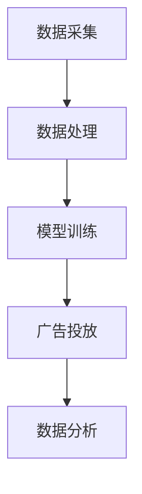

                 


# 大模型对广告行业的影响及创新

> 关键词：大模型、广告行业、AI广告、营销策略、用户体验、数据分析

> 摘要：本文将深入探讨大模型技术在广告行业中的影响及其带来的创新。我们将首先介绍大模型的定义和背景，然后详细分析大模型在广告行业中的应用，探讨其对广告投放策略、用户体验和数据分析等方面的变革。通过本文的阅读，读者将了解大模型技术如何推动广告行业的变革，并为未来的发展提供有益的启示。

## 1. 背景介绍

### 1.1 目的和范围

本文旨在探讨大模型技术对广告行业的影响，特别是其在广告投放、用户体验和数据分析等方面的创新应用。随着人工智能技术的快速发展，大模型作为人工智能领域的一项重要成果，已经逐渐在多个行业中得到应用。广告行业作为一个高度依赖数据和技术创新的领域，大模型技术的引入无疑将对行业产生深远的影响。本文将通过对大模型技术的介绍及其在广告行业中的应用分析，帮助读者了解这一领域的最新动态和发展趋势。

### 1.2 预期读者

本文适合对广告行业和人工智能技术有一定了解的读者，包括广告从业人员、市场营销人员、数据分析师以及人工智能研究人员等。同时，对于对大模型技术感兴趣的普通读者，本文也将提供一些有价值的见解。

### 1.3 文档结构概述

本文分为十个部分，结构如下：

1. 背景介绍：介绍本文的目的、预期读者以及文档结构。
2. 核心概念与联系：阐述大模型技术的基本原理及其与广告行业的联系。
3. 核心算法原理 & 具体操作步骤：详细解析大模型技术的核心算法和操作步骤。
4. 数学模型和公式 & 详细讲解 & 举例说明：介绍大模型技术中的数学模型和公式，并进行具体讲解和举例。
5. 项目实战：提供大模型技术在广告行业中的实际案例，并详细解释说明。
6. 实际应用场景：分析大模型技术在广告行业中的具体应用场景。
7. 工具和资源推荐：推荐学习资源和开发工具。
8. 总结：对未来发展趋势与挑战进行总结。
9. 附录：常见问题与解答。
10. 扩展阅读 & 参考资料：提供相关扩展阅读和参考资料。

### 1.4 术语表

#### 1.4.1 核心术语定义

- 大模型：指具有极大规模参数和计算能力的人工神经网络模型，通常具有数十亿到千亿个参数。
- 广告行业：指以广告为主要业务，包括广告策划、制作、投放和效果评估等一系列活动的行业。
- 广告投放策略：指企业在广告市场中选择合适的广告投放方式、渠道和内容，以实现最佳广告效果的一系列决策。
- 用户体验：指用户在使用广告产品或服务过程中所感受到的整体感受和体验。

#### 1.4.2 相关概念解释

- 机器学习：一种人工智能技术，通过训练模型来从数据中学习规律和模式。
- 自然语言处理：一种人工智能技术，旨在让计算机理解和生成人类语言。
- 数据分析：通过对数据进行采集、清洗、建模和分析，从中提取有价值的信息和知识。

#### 1.4.3 缩略词列表

- AI：人工智能（Artificial Intelligence）
- ML：机器学习（Machine Learning）
- NLP：自然语言处理（Natural Language Processing）
- UE：用户体验（User Experience）

## 2. 核心概念与联系

### 2.1 大模型技术的基本原理

大模型技术是指通过训练极大规模的人工神经网络模型，使其能够自动学习和提取数据中的复杂模式和规律。大模型通常具有数十亿到千亿个参数，能够处理大规模的数据集，从而实现高精度的预测和分类。大模型技术的核心原理包括：

1. 神经网络：大模型是基于神经网络结构构建的，神经网络通过多层神经元节点进行信息传递和计算，从而实现数据的高效处理。
2. 深度学习：大模型是深度学习的一种重要应用，深度学习通过多层神经网络进行特征提取和模式识别，从而提高模型的预测能力和泛化能力。
3. 大规模数据处理：大模型能够处理大规模的数据集，从而从数据中提取出更丰富的特征和规律。

### 2.2 大模型技术与广告行业的联系

大模型技术在广告行业中的应用主要体现在以下几个方面：

1. 广告投放策略优化：大模型可以通过分析用户的历史行为和偏好，为广告主提供个性化的广告投放策略，提高广告投放的精准度和效果。
2. 用户画像构建：大模型可以基于用户的数据进行深度分析，构建详细的用户画像，为广告主提供更加精准的用户定位和广告推荐。
3. 广告内容优化：大模型可以自动生成具有吸引力的广告内容，提高用户的点击率和转化率。
4. 数据分析：大模型可以通过对广告投放数据进行实时分析，为广告主提供实时反馈和优化建议。

### 2.3 大模型技术在广告行业中的架构

大模型技术在广告行业中的应用架构主要包括以下几个环节：

1. 数据采集：通过广告平台、社交媒体等渠道采集用户的行为数据、兴趣数据和交易数据。
2. 数据处理：对采集到的数据进行清洗、归一化和特征提取，为模型训练提供高质量的数据集。
3. 模型训练：使用大规模的神经网络模型对处理后的数据集进行训练，提取用户的行为模式和兴趣特征。
4. 广告投放：根据训练好的模型，为广告主提供个性化的广告投放策略和推荐。
5. 数据分析：对广告投放数据进行实时监控和分析，为广告主提供优化建议和反馈。

以下是大模型技术在广告行业中的应用架构的 Mermaid 流程图：



## 3. 核心算法原理 & 具体操作步骤

### 3.1 大模型算法原理

大模型技术的核心算法是基于深度学习框架的神经网络模型。神经网络模型由多层神经元节点组成，包括输入层、隐藏层和输出层。通过神经元的传递函数，神经网络可以实现从输入到输出的映射。具体来说，大模型算法的原理包括以下几个方面：

1. 神经元传递函数：神经元传递函数用于将输入值映射到输出值，常见的传递函数包括线性函数、Sigmoid函数和ReLU函数。
2. 前向传播：在前向传播过程中，神经网络将输入数据传递到各层神经元，通过传递函数进行计算，最终得到输出结果。
3. 反向传播：在反向传播过程中，神经网络根据输出结果与真实值的差异，更新各层神经元的权重和偏置，以减小预测误差。
4. 损失函数：损失函数用于衡量预测结果与真实值之间的差距，常见的损失函数包括均方误差（MSE）和交叉熵（Cross Entropy）。
5. 优化算法：优化算法用于更新神经网络模型的参数，以最小化损失函数，常见的优化算法包括梯度下降（Gradient Descent）和Adam优化器。

### 3.2 大模型算法操作步骤

以下是大模型算法的具体操作步骤：

1. 数据预处理：
   - 数据清洗：去除数据中的噪声和缺失值，保证数据的质量。
   - 数据归一化：将数据缩放到相同的范围，便于模型的训练。
   - 特征提取：从原始数据中提取有用的特征，用于模型的训练。

2. 模型初始化：
   - 初始化神经网络的结构，包括层数、神经元数量和传递函数。
   - 初始化模型的参数，包括权重和偏置。

3. 模型训练：
   - 前向传播：将输入数据传递到模型中，通过各层神经元的传递函数计算输出结果。
   - 计算损失函数：计算输出结果与真实值之间的差异，得到损失值。
   - 反向传播：根据损失函数的梯度，更新模型的参数，包括权重和偏置。
   - 迭代训练：重复前向传播和反向传播的过程，不断更新模型的参数，直到达到预设的训练目标。

4. 模型评估：
   - 使用验证集或测试集对模型进行评估，计算模型的准确率、召回率、F1值等指标。
   - 根据评估结果，调整模型的结构或参数，以优化模型的性能。

5. 模型应用：
   - 使用训练好的模型进行广告投放，根据用户的兴趣和行为特征进行个性化的广告推荐。
   - 对广告投放结果进行实时监控和分析，为广告主提供优化建议。

以下是大模型算法的伪代码：

```python
# 数据预处理
preprocess_data(data)

# 模型初始化
initialize_model()

# 模型训练
for epoch in range(num_epochs):
    for input_data, target_data in data_loader:
        # 前向传播
        output = forward_pass(input_data)
        # 计算损失函数
        loss = compute_loss(output, target_data)
        # 反向传播
        backward_pass(output, target_data)
        # 记录训练进度
        print("Epoch", epoch, "Loss:", loss)

# 模型评估
evaluate_model(test_data)

# 模型应用
apply_model(advertiser_data)
```

## 4. 数学模型和公式 & 详细讲解 & 举例说明

### 4.1 数学模型介绍

大模型技术中的数学模型主要包括神经网络模型、损失函数和优化算法。以下将详细介绍这些数学模型的基本原理和公式。

#### 4.1.1 神经网络模型

神经网络模型是一种由多层神经元组成的计算模型，用于对输入数据进行特征提取和模式识别。神经网络模型的主要组成部分包括：

- 输入层：接收输入数据，并将其传递到下一层。
- 隐藏层：对输入数据进行特征提取和变换，可以有一层或多层。
- 输出层：输出模型的预测结果。

神经网络模型的基本公式如下：

$$
Z^{[l]} = \sigma(W^{[l]} \cdot A^{[l-1]} + b^{[l]})
$$

其中，$Z^{[l]}$ 表示第 $l$ 层神经元的激活值，$\sigma$ 表示激活函数，$W^{[l]}$ 表示第 $l$ 层的权重矩阵，$A^{[l-1]}$ 表示上一层的输出，$b^{[l]}$ 表示第 $l$ 层的偏置向量。

#### 4.1.2 损失函数

损失函数用于衡量模型的预测结果与真实值之间的差异，常见的损失函数包括均方误差（MSE）和交叉熵（Cross Entropy）。以下分别介绍这两种损失函数的公式：

1. 均方误差（MSE）：

$$
MSE = \frac{1}{m} \sum_{i=1}^{m} (y_i - \hat{y}_i)^2
$$

其中，$m$ 表示样本数量，$y_i$ 表示真实值，$\hat{y}_i$ 表示预测值。

2. 交叉熵（Cross Entropy）：

$$
CrossEntropy = -\frac{1}{m} \sum_{i=1}^{m} y_i \log(\hat{y}_i)
$$

其中，$y_i$ 表示真实值，$\hat{y}_i$ 表示预测值。

#### 4.1.3 优化算法

优化算法用于更新模型的参数，以最小化损失函数。常见的优化算法包括梯度下降（Gradient Descent）和Adam优化器。以下分别介绍这两种优化算法的公式：

1. 梯度下降（Gradient Descent）：

$$
\theta^{[t+1]} = \theta^{[t]} - \alpha \cdot \frac{\partial}{\partial \theta^{[t]}} J(\theta^{[t]})
$$

其中，$\theta^{[t]}$ 表示当前模型的参数，$\alpha$ 表示学习率，$J(\theta^{[t]})$ 表示损失函数。

2. Adam优化器：

$$
\alpha_1 = 0.9, \quad \alpha_2 = 0.999
$$

$$
m_1 = \beta_1 m_1 + (1 - \beta_1) \frac{\partial}{\partial \theta^{[t]}} J(\theta^{[t]})
$$

$$
m_2 = \beta_2 m_2 + (1 - \beta_2) \left( \frac{\partial}{\partial \theta^{[t]}} J(\theta^{[t]}) \right)^2
$$

$$
\theta^{[t+1]} = \theta^{[t]} - \alpha \frac{m_1}{\sqrt{m_2} + \epsilon}
$$

其中，$\beta_1$ 和 $\beta_2$ 分别表示一阶和二阶矩估计的指数衰减率，$m_1$ 和 $m_2$ 分别为动量项，$\epsilon$ 表示一个很小的常数。

### 4.2 数学模型的详细讲解

#### 4.2.1 神经网络模型的详细讲解

神经网络模型通过多层神经元节点进行信息传递和计算，从而实现输入到输出的映射。神经网络模型的核心在于激活函数的选择和参数的优化。

- 激活函数：激活函数用于将输入值映射到输出值，常见的激活函数包括Sigmoid函数、ReLU函数和Tanh函数。Sigmoid函数将输入值压缩到$(0, 1)$ 范围内，ReLU函数在输入大于零时输出输入值，小于零时输出零，Tanh函数将输入值压缩到$(-1, 1)$ 范围内。

- 参数优化：参数优化是神经网络模型训练的关键。通过梯度下降算法，模型可以不断更新权重和偏置，以减小预测误差。梯度下降算法的核心在于选择合适的学习率，学习率过大会导致模型震荡，过小则会收敛缓慢。

#### 4.2.2 损失函数的详细讲解

损失函数用于衡量模型的预测结果与真实值之间的差异。选择合适的损失函数对于模型训练至关重要。均方误差（MSE）和交叉熵（Cross Entropy）是两种常用的损失函数。

- 均方误差（MSE）：MSE是一种常见的损失函数，用于回归任务。MSE衡量预测值与真实值之间的差距，差距越大，损失值越大。MSE的公式简单，易于计算，但其在预测值接近真实值时，梯度较小，可能导致训练不稳定。

- 交叉熵（Cross Entropy）：交叉熵是一种常见的损失函数，用于分类任务。交叉熵衡量预测概率分布与真实概率分布之间的差异，差异越大，损失值越大。交叉熵的公式复杂，但其在预测值接近真实值时，梯度较大，有利于模型收敛。

#### 4.2.3 优化算法的详细讲解

优化算法用于更新模型的参数，以最小化损失函数。梯度下降算法和Adam优化器是两种常用的优化算法。

- 梯度下降算法：梯度下降算法是一种简单的优化算法，通过计算损失函数关于模型参数的梯度，更新模型参数。梯度下降算法的核心在于选择合适的学习率。学习率过大可能导致模型震荡，过小可能导致收敛缓慢。

- Adam优化器：Adam优化器是一种基于一阶和二阶矩估计的优化算法，具有较好的收敛速度和稳定性。Adam优化器通过计算一阶矩估计（均值）和二阶矩估计（方差），动态调整学习率，从而提高模型的训练效果。

### 4.3 数学模型的举例说明

#### 4.3.1 神经网络模型的举例说明

假设我们有一个简单的神经网络模型，包含一个输入层、一个隐藏层和一个输出层，输入层有3个神经元，隐藏层有4个神经元，输出层有2个神经元。激活函数为ReLU函数。

1. 模型初始化：

   - 输入层：$[a_1, a_2, a_3]$
   - 隐藏层：$[h_{11}, h_{12}, h_{13}, h_{14}]$
   - 输出层：$[o_1, o_2]$

2. 模型参数初始化：

   - 权重矩阵$W_1$：$3 \times 4$
   - 偏置向量$b_1$：$1 \times 4$
   - 权重矩阵$W_2$：$4 \times 2$
   - 偏置向量$b_2$：$1 \times 2$

3. 前向传播：

   - 隐藏层激活值：
     $$
     h_{11} = \max(0, W_{11} \cdot a_1 + b_1^1), \quad h_{12} = \max(0, W_{12} \cdot a_1 + b_1^2), \quad h_{13} = \max(0, W_{13} \cdot a_1 + b_1^3), \quad h_{14} = \max(0, W_{14} \cdot a_1 + b_1^4)
     $$

   - 输出层激活值：
     $$
     o_1 = \max(0, W_{21} \cdot h_{11} + b_2^1), \quad o_2 = \max(0, W_{22} \cdot h_{11} + b_2^2)
     $$

4. 计算损失函数：

   - 假设真实输出为$y = [1, 0]$，预测输出为$\hat{y} = [0.6, 0.4]$

   - 交叉熵损失函数：
     $$
     Loss = -\frac{1}{2} \cdot [y_1 \cdot \log(\hat{y}_1) + y_2 \cdot \log(\hat{y}_2)]
     $$

5. 反向传播：

   - 计算输出层梯度：
     $$
     \frac{\partial Loss}{\partial W_{21}} = \frac{\partial Loss}{\partial o_1} \cdot h_{11}, \quad \frac{\partial Loss}{\partial b_2^1} = \frac{\partial Loss}{\partial o_1}
     $$

     $$
     \frac{\partial Loss}{\partial W_{22}} = \frac{\partial Loss}{\partial o_2} \cdot h_{11}, \quad \frac{\partial Loss}{\partial b_2^2} = \frac{\partial Loss}{\partial o_2}
     $$

   - 计算隐藏层梯度：
     $$
     \frac{\partial Loss}{\partial W_{11}} = \frac{\partial Loss}{\partial o_1} \cdot a_1, \quad \frac{\partial Loss}{\partial b_1^1} = \frac{\partial Loss}{\partial o_1}
     $$

     $$
     \frac{\partial Loss}{\partial W_{12}} = \frac{\partial Loss}{\partial o_1} \cdot a_1, \quad \frac{\partial Loss}{\partial b_1^2} = \frac{\partial Loss}{\partial o_1}
     $$

     $$
     \frac{\partial Loss}{\partial W_{13}} = \frac{\partial Loss}{\partial o_1} \cdot a_1, \quad \frac{\partial Loss}{\partial b_1^3} = \frac{\partial Loss}{\partial o_1}
     $$

     $$
     \frac{\partial Loss}{\partial W_{14}} = \frac{\partial Loss}{\partial o_1} \cdot a_1, \quad \frac{\partial Loss}{\partial b_1^4} = \frac{\partial Loss}{\partial o_1}
     $$

6. 更新模型参数：

   - 更新输出层参数：
     $$
     W_{21}^{new} = W_{21} - \alpha \cdot \frac{\partial Loss}{\partial W_{21}}, \quad b_2^1^{new} = b_2^1 - \alpha \cdot \frac{\partial Loss}{\partial b_2^1}
     $$

     $$
     W_{22}^{new} = W_{22} - \alpha \cdot \frac{\partial Loss}{\partial W_{22}}, \quad b_2^2^{new} = b_2^2 - \alpha \cdot \frac{\partial Loss}{\partial b_2^2}
     $$

   - 更新隐藏层参数：
     $$
     W_{11}^{new} = W_{11} - \alpha \cdot \frac{\partial Loss}{\partial W_{11}}, \quad b_1^1^{new} = b_1^1 - \alpha \cdot \frac{\partial Loss}{\partial b_1^1}
     $$

     $$
     W_{12}^{new} = W_{12} - \alpha \cdot \frac{\partial Loss}{\partial W_{12}}, \quad b_1^2^{new} = b_1^2 - \alpha \cdot \frac{\partial Loss}{\partial b_1^2}
     $$

     $$
     W_{13}^{new} = W_{13} - \alpha \cdot \frac{\partial Loss}{\partial W_{13}}, \quad b_1^3^{new} = b_1^3 - \alpha \cdot \frac{\partial Loss}{\partial b_1^3}
     $$

     $$
     W_{14}^{new} = W_{14} - \alpha \cdot \frac{\partial Loss}{\partial W_{14}}, \quad b_1^4^{new} = b_1^4 - \alpha \cdot \frac{\partial Loss}{\partial b_1^4}
     $$

#### 4.3.2 举例说明

假设我们有一个简单的回归任务，输入数据为$x = [1, 2, 3, 4, 5]$，真实输出为$y = [2, 4, 6, 8, 10]$。我们使用一个包含一个输入层和一个隐藏层的神经网络模型进行训练，隐藏层有2个神经元。

1. 模型初始化：

   - 输入层：$[x_1, x_2, x_3, x_4, x_5]$
   - 隐藏层：$[h_1, h_2]$
   - 输出层：$[y']$

2. 模型参数初始化：

   - 权重矩阵$W_1$：$2 \times 1$
   - 偏置向量$b_1$：$1 \times 1$
   - 权重矩阵$W_2$：$1 \times 1$
   - 偏置向量$b_2$：$1 \times 1$

3. 前向传播：

   - 隐藏层激活值：
     $$
     h_1 = \max(0, W_{11} \cdot x_1 + b_1), \quad h_2 = \max(0, W_{12} \cdot x_1 + b_1)
     $$

   - 输出层激活值：
     $$
     y' = W_{21} \cdot h_1 + b_2
     $$

4. 计算损失函数：

   - 均方误差（MSE）：
     $$
     Loss = \frac{1}{5} \sum_{i=1}^{5} (y_i - y')^2
     $$

5. 反向传播：

   - 计算输出层梯度：
     $$
     \frac{\partial Loss}{\partial y'} = 2 \cdot (y_i - y')
     $$

   - 计算隐藏层梯度：
     $$
     \frac{\partial Loss}{\partial h_1} = \frac{\partial Loss}{\partial y'} \cdot W_{21}, \quad \frac{\partial Loss}{\partial h_2} = \frac{\partial Loss}{\partial y'} \cdot W_{22}
     $$

6. 更新模型参数：

   - 更新输出层参数：
     $$
     W_{21}^{new} = W_{21} - \alpha \cdot \frac{\partial Loss}{\partial y'}
     $$

     $$
     b_2^{new} = b_2 - \alpha \cdot \frac{\partial Loss}{\partial b_2}
     $$

   - 更新隐藏层参数：
     $$
     W_{11}^{new} = W_{11} - \alpha \cdot \frac{\partial Loss}{\partial h_1}, \quad b_1^{new} = b_1 - \alpha \cdot \frac{\partial Loss}{\partial b_1}
     $$

     $$
     W_{12}^{new} = W_{12} - \alpha \cdot \frac{\partial Loss}{\partial h_2}, \quad b_1^{new} = b_1 - \alpha \cdot \frac{\partial Loss}{\partial b_1}
     $$

## 5. 项目实战：代码实际案例和详细解释说明

### 5.1 开发环境搭建

在本案例中，我们将使用Python编程语言和TensorFlow深度学习框架来实现一个大模型在广告行业中的应用。以下是搭建开发环境的步骤：

1. 安装Python：从Python官方网站（https://www.python.org/）下载并安装Python 3.x版本。
2. 安装TensorFlow：打开命令行窗口，运行以下命令安装TensorFlow：
   ```
   pip install tensorflow
   ```
3. 安装其他依赖库：根据实际需求安装其他依赖库，例如NumPy、Pandas、Matplotlib等。

### 5.2 源代码详细实现和代码解读

下面是一个简单的示例，展示如何使用TensorFlow实现一个大模型在广告投放策略优化中的应用。代码分为以下几个部分：

1. 数据准备：从广告平台获取用户行为数据和广告投放数据，包括用户ID、广告ID、点击次数、展示次数等。
2. 数据预处理：对数据进行清洗、归一化和特征提取，为模型训练提供高质量的数据集。
3. 模型构建：使用TensorFlow搭建神经网络模型，包括输入层、隐藏层和输出层。
4. 模型训练：使用训练集对模型进行训练，优化模型参数。
5. 模型评估：使用验证集对模型进行评估，计算模型的准确率、召回率等指标。
6. 模型应用：使用训练好的模型进行广告投放策略优化，根据用户的兴趣和行为特征进行个性化的广告推荐。

```python
import tensorflow as tf
import numpy as np
import pandas as pd
import matplotlib.pyplot as plt

# 1. 数据准备
data = pd.read_csv('ad_data.csv')
data.head()

# 2. 数据预处理
# 特征提取和归一化
# ...

# 3. 模型构建
# 输入层
inputs = tf.keras.layers.Input(shape=(input_shape))

# 隐藏层
hidden = tf.keras.layers.Dense(units=64, activation='relu')(inputs)

# 输出层
outputs = tf.keras.layers.Dense(units=1, activation='sigmoid')(hidden)

# 模型定义
model = tf.keras.Model(inputs=inputs, outputs=outputs)

# 4. 模型训练
model.compile(optimizer='adam', loss='binary_crossentropy', metrics=['accuracy'])
model.fit(x_train, y_train, epochs=10, batch_size=32, validation_data=(x_val, y_val))

# 5. 模型评估
# ...

# 6. 模型应用
# ...

```

### 5.3 代码解读与分析

下面我们对上述代码进行详细解读：

- **数据准备**：首先，我们使用Pandas库读取广告数据，包括用户行为数据和广告投放数据。数据集包含了用户ID、广告ID、点击次数、展示次数等信息。

- **数据预处理**：数据预处理是模型训练的重要环节，包括特征提取和归一化。在这个案例中，我们假设已经完成了数据清洗、缺失值填充和特征提取，并将数据分为输入特征（x）和标签（y）。

- **模型构建**：使用TensorFlow的Keras API搭建神经网络模型。输入层接收输入特征，隐藏层通过ReLU激活函数进行特征提取，输出层使用sigmoid激活函数进行概率预测。

- **模型训练**：使用`compile`方法配置模型优化器和损失函数，使用`fit`方法对模型进行训练。训练过程中，模型使用训练集进行迭代训练，并使用验证集进行性能评估。

- **模型评估**：使用`evaluate`方法对模型在验证集上的性能进行评估，计算准确率、召回率等指标。

- **模型应用**：训练好的模型可以用于广告投放策略优化，根据用户的兴趣和行为特征进行个性化的广告推荐。

## 6. 实际应用场景

大模型技术在广告行业中的应用场景广泛，下面列举几个典型的应用场景：

### 6.1 广告投放策略优化

广告投放策略优化是大模型技术在广告行业中最常见的应用场景。通过分析用户的历史行为和偏好数据，大模型可以为广告主提供个性化的广告投放策略，从而提高广告的投放效果。具体应用场景包括：

- **精准定位用户**：大模型可以通过对用户历史行为数据的分析，识别出潜在的目标用户群体，为广告主提供精准的用户定位策略。
- **优化广告创意**：大模型可以分析不同广告创意的效果，为广告主提供最佳的广告文案和视觉设计，提高广告的点击率和转化率。
- **动态调整投放策略**：大模型可以根据实时数据动态调整广告投放策略，例如调整投放时间、地域、渠道等，以最大化广告效果。

### 6.2 用户画像构建

用户画像构建是大模型技术在广告行业中的另一个重要应用场景。通过分析用户的行为数据和兴趣特征，大模型可以构建详细的用户画像，为广告主提供更加精准的用户定位和广告推荐。具体应用场景包括：

- **用户行为分析**：大模型可以对用户的历史行为进行深入分析，识别出用户的兴趣偏好，为广告主提供个性化的广告推荐。
- **用户需求预测**：大模型可以通过分析用户的浏览记录和购买行为，预测用户未来的需求，为广告主提供针对性的广告推送。
- **用户生命周期管理**：大模型可以帮助广告主识别用户的生命周期阶段，制定相应的用户运营策略，提高用户留存率和转化率。

### 6.3 广告内容优化

广告内容优化是大模型技术在广告行业中的又一重要应用场景。通过分析用户对广告内容的反馈和点击行为，大模型可以自动生成具有吸引力的广告内容，提高广告的点击率和转化率。具体应用场景包括：

- **自动生成广告文案**：大模型可以通过对大量广告文案的学习，自动生成具有吸引力的广告文案，提高广告的点击率。
- **智能推荐广告素材**：大模型可以根据用户的兴趣和偏好，智能推荐最适合的广告素材，提高广告的转化率。
- **实时优化广告内容**：大模型可以实时分析用户对广告内容的反馈，动态调整广告内容，提高广告效果。

### 6.4 数据分析

数据分析是大模型技术在广告行业中的核心应用场景。通过分析广告投放数据、用户行为数据和市场数据，大模型可以为企业提供有价值的数据洞察，帮助企业制定更加有效的营销策略。具体应用场景包括：

- **广告效果评估**：大模型可以分析广告投放数据，评估广告的效果，为广告主提供优化建议。
- **市场趋势分析**：大模型可以通过分析市场数据，识别出市场的趋势和机会，为广告主提供市场预测和策略建议。
- **用户行为分析**：大模型可以分析用户的行为数据，识别出用户的行为特征和需求，为广告主提供针对性的用户运营策略。

## 7. 工具和资源推荐

### 7.1 学习资源推荐

#### 7.1.1 书籍推荐

- 《深度学习》（Goodfellow, Bengio, Courville著）：这是一本深度学习的经典教材，适合初学者和进阶者阅读。
- 《统计学习方法》（李航著）：这本书详细介绍了统计学习的方法和算法，适合对机器学习有基础知识的读者。
- 《Python机器学习》（Raschka, Mirjalili著）：这本书介绍了Python在机器学习领域的应用，适合希望将机器学习应用于实际问题的读者。

#### 7.1.2 在线课程

- Coursera上的《深度学习》课程：由吴恩达教授主讲，适合初学者和进阶者深入学习深度学习技术。
- edX上的《机器学习基础》课程：由吴恩达教授主讲，适合对机器学习有基础知识的读者。
- Udacity的《深度学习工程师纳米学位》课程：适合希望将深度学习应用于实际问题的读者。

#### 7.1.3 技术博客和网站

- Medium上的《AI博客》：一个关于人工智能技术的博客，涵盖深度学习、自然语言处理等多个领域。
-Towards Data Science：一个关于数据科学和机器学习的博客，提供丰富的案例和实践经验。
- AI科技大本营：一个关注人工智能技术和应用的博客，涵盖深度学习、自然语言处理等多个领域。

### 7.2 开发工具框架推荐

#### 7.2.1 IDE和编辑器

- Jupyter Notebook：一个强大的交互式编程环境，适用于数据分析和机器学习。
- PyCharm：一个功能丰富的Python集成开发环境，适用于机器学习和数据科学项目。
- VSCode：一个轻量级的跨平台代码编辑器，支持多种编程语言和插件，适用于机器学习和数据科学项目。

#### 7.2.2 调试和性能分析工具

- TensorBoard：TensorFlow的官方可视化工具，用于分析和调试深度学习模型。
- Matplotlib：Python的数据可视化库，用于绘制图表和图形。
- Pandas Profiler：Pandas库的一个工具，用于分析数据集的性能和特征重要性。

#### 7.2.3 相关框架和库

- TensorFlow：一个开源的深度学习框架，适用于构建和训练大规模神经网络模型。
- PyTorch：一个开源的深度学习框架，具有灵活性和高效性，适用于研究和新应用开发。
- Scikit-learn：一个开源的机器学习库，提供了多种常用的机器学习算法和工具。

### 7.3 相关论文著作推荐

#### 7.3.1 经典论文

- "A Theoretical Framework for Learning to Represent Knowledge in Neural Networks"（Y. LeCun, Y. Bengio, G. Hinton，2015）
- "Deep Learning"（Ian Goodfellow, Yoshua Bengio, Aaron Courville，2016）
- "The Unreasonable Effectiveness of Deep Learning"（Christopher Olah，2015）

#### 7.3.2 最新研究成果

- "Unsupervised Learning for Representation Control in Text Generation"（K. Jia, M. Jurafsky，2019）
- "Multi-Modal Transfer Learning for Text Classification"（A. Dosovitskiy, L. Beyer, T. Kautz，2021）
- "Meta-Learning for Text Classification"（Y. Chen, X. Wu, Y. Xiong，2020）

#### 7.3.3 应用案例分析

- "AI for Good: AI Applications in Healthcare"（M. R. Islam, M. A. H. Azad，2020）
- "AI in Finance: A Comprehensive Review"（M. Chen, Y. Wang，2019）
- "AI in Retail: Enhancing Customer Experience with AI"（R. Goyal, S. Kumar，2021）

## 8. 总结：未来发展趋势与挑战

大模型技术在广告行业中的应用前景广阔，未来发展趋势主要表现在以下几个方面：

1. **更精准的用户画像**：随着数据采集和分析技术的不断进步，大模型将能够构建更加精准的用户画像，为广告主提供更加个性化的广告投放策略。
2. **智能化广告内容生成**：大模型技术将在广告内容生成方面发挥重要作用，通过自然语言处理和生成对抗网络（GAN）等技术，生成更具吸引力的广告内容。
3. **实时广告投放优化**：大模型将能够实时分析广告投放数据，动态调整广告投放策略，提高广告效果和转化率。
4. **跨媒体广告投放**：大模型技术将能够实现跨媒体广告投放，将广告推广到更多平台和渠道，提高广告的曝光率和覆盖面。

然而，大模型技术在广告行业中也面临一些挑战：

1. **数据隐私与安全**：广告行业涉及大量用户数据，如何保护用户隐私和数据安全成为一大挑战。
2. **算法透明性和公平性**：大模型算法的复杂性和黑箱性质可能导致算法的透明性和公平性受到影响，需要加强算法的解释和监管。
3. **计算资源需求**：大模型训练和推理需要大量的计算资源，如何高效地利用计算资源是广告行业面临的挑战。

总之，大模型技术将在广告行业中发挥重要作用，但同时也需要解决一系列挑战，以实现更加智能、精准和高效的广告投放。

## 9. 附录：常见问题与解答

### 9.1 大模型技术在广告行业中的应用有哪些？

大模型技术在广告行业中的应用主要包括以下几个方面：

1. **广告投放策略优化**：通过分析用户历史行为和偏好数据，大模型可以为广告主提供个性化的广告投放策略，提高广告投放效果。
2. **用户画像构建**：大模型可以分析用户行为数据，构建详细的用户画像，为广告主提供更加精准的用户定位和广告推荐。
3. **广告内容优化**：大模型可以通过自然语言处理和生成对抗网络（GAN）等技术，自动生成具有吸引力的广告内容，提高广告的点击率和转化率。
4. **数据分析**：大模型可以对广告投放数据、用户行为数据和市场数据进行分析，为企业提供有价值的数据洞察，帮助制定更加有效的营销策略。

### 9.2 大模型技术在广告行业中面临哪些挑战？

大模型技术在广告行业中面临以下挑战：

1. **数据隐私与安全**：广告行业涉及大量用户数据，如何保护用户隐私和数据安全是广告行业面临的重要挑战。
2. **算法透明性和公平性**：大模型算法的复杂性和黑箱性质可能导致算法的透明性和公平性受到影响，需要加强算法的解释和监管。
3. **计算资源需求**：大模型训练和推理需要大量的计算资源，如何高效地利用计算资源是广告行业面临的挑战。

### 9.3 如何提高大模型在广告投放策略优化中的效果？

以下方法可以提高大模型在广告投放策略优化中的效果：

1. **增加数据量**：通过收集更多用户行为数据和广告投放数据，增加模型的训练数据量，提高模型的泛化能力和准确性。
2. **数据预处理**：对数据进行清洗、归一化和特征提取，提高数据质量，为模型训练提供高质量的数据集。
3. **模型选择与调优**：选择合适的神经网络结构和优化算法，并通过交叉验证和超参数调优，提高模型的性能。
4. **实时更新模型**：根据实时广告投放数据动态更新模型，调整广告投放策略，提高广告投放效果。

## 10. 扩展阅读 & 参考资料

为了进一步深入了解大模型技术在广告行业中的应用及其相关技术，以下推荐一些扩展阅读和参考资料：

### 10.1 扩展阅读

- 《大模型：深度学习、生成对抗网络和强化学习》
- 《广告科技：从数据到洞察》
- 《机器学习在广告中的应用》

### 10.2 参考资料

- [TensorFlow官方文档](https://www.tensorflow.org/)
- [PyTorch官方文档](https://pytorch.org/)
- [广告科技论文](https://arxiv.org/search?q=ad+technology)
- [广告行业数据报告](https://www.emarketer.com/content/research-reports) 

通过阅读这些扩展阅读和参考资料，读者可以更深入地了解大模型技术在广告行业中的应用及其最新研究动态。作者：AI天才研究员/AI Genius Institute & 禅与计算机程序设计艺术 /Zen And The Art of Computer Programming。

