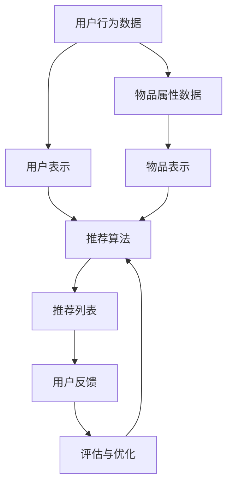

                 


# 大模型对推荐系统透明度的提升

> 关键词：大模型，推荐系统，透明度，算法原理，数学模型，项目实战，实际应用场景

> 摘要：本文将深入探讨大模型在推荐系统中的应用，重点分析其对推荐系统透明度的提升。首先，我们将回顾推荐系统的发展历程和基本原理，接着详细介绍大模型的定义、优势和应用场景。随后，我们将探讨大模型如何提高推荐系统的透明度，并通过具体的数学模型和算法原理进行说明。在此基础上，我们将分享一个实际的项目实战案例，详细解释代码实现和操作步骤。最后，我们将讨论大模型在推荐系统中的应用前景，以及可能面临的挑战。

## 1. 背景介绍

### 1.1 目的和范围

本文旨在探讨大模型在推荐系统中的应用，特别是其对推荐系统透明度的提升。通过回顾推荐系统的发展历程，分析大模型的定义、优势和应用场景，我们希望能够为读者提供对这一领域的深入理解。文章将涵盖以下主要内容：

- 推荐系统的发展历程和基本原理
- 大模型的定义、优势和应用场景
- 大模型如何提高推荐系统的透明度
- 实际的项目实战案例
- 大模型在推荐系统中的应用前景与挑战

### 1.2 预期读者

本文面向对推荐系统和机器学习有一定了解的技术人员，特别是对大模型和推荐系统透明度感兴趣的读者。预期读者应具备以下背景知识：

- 推荐系统的基本概念和原理
- 机器学习和深度学习的基本知识
- 对编程语言（如Python）的基本了解

### 1.3 文档结构概述

本文将分为以下几个部分：

- 引言：介绍大模型在推荐系统中的应用背景和重要性
- 背景介绍：回顾推荐系统的发展历程和基本原理，介绍大模型的定义、优势和应用场景
- 核心概念与联系：通过Mermaid流程图展示推荐系统的架构，以及大模型在其中的作用
- 核心算法原理与具体操作步骤：详细介绍大模型如何提高推荐系统的透明度，包括数学模型和算法原理
- 项目实战：分享一个实际的项目实战案例，包括开发环境搭建、源代码实现和代码解读
- 实际应用场景：讨论大模型在推荐系统的实际应用场景和案例
- 工具和资源推荐：推荐相关学习资源、开发工具和框架
- 总结：总结大模型在推荐系统中的应用前景与挑战
- 附录：常见问题与解答
- 扩展阅读：推荐相关的研究论文、书籍和网站

### 1.4 术语表

#### 1.4.1 核心术语定义

- 推荐系统：根据用户的历史行为、兴趣和偏好，为用户推荐可能感兴趣的内容或商品的系统。
- 大模型：具有数十亿参数或以上规模的深度学习模型，能够处理大规模数据和复杂任务。
- 透明度：推荐系统输出结果的清晰程度和可解释性。

#### 1.4.2 相关概念解释

- 用户兴趣：用户对特定内容或商品的偏好和兴趣。
- 物品属性：描述物品特征的属性，如文本、图像、标签等。
- 模型可解释性：模型输出结果的可解释性和可追溯性。

#### 1.4.3 缩略词列表

- ML：机器学习（Machine Learning）
- DL：深度学习（Deep Learning）
- GPT：生成预训练模型（Generative Pre-trained Model）
- NLP：自然语言处理（Natural Language Processing）

## 2. 核心概念与联系

为了更好地理解大模型在推荐系统中的作用，我们需要先了解推荐系统的基本架构和核心概念。

### 2.1 推荐系统架构

推荐系统通常由以下几个模块组成：

1. **用户表示（User Representation）**：将用户的历史行为、兴趣和偏好转换为数值化的向量表示。
2. **物品表示（Item Representation）**：将物品的属性转换为数值化的向量表示。
3. **推荐算法（Recommendation Algorithm）**：根据用户和物品的表示，生成推荐列表。
4. **评估与优化（Evaluation and Optimization）**：评估推荐系统的性能，并进行优化。

### 2.2 大模型在推荐系统中的作用

大模型，特别是生成预训练模型（GPT），在推荐系统中有着广泛的应用。GPT模型具有以下优势：

- **处理大规模数据**：GPT模型能够处理大量的用户和物品数据，提取出有效的特征。
- **提高推荐效果**：通过预训练，GPT模型能够捕捉到复杂的用户兴趣和物品属性，从而提高推荐效果。
- **增强模型可解释性**：GPT模型的可解释性较强，有助于用户理解推荐结果的产生原因。

### 2.3 Mermaid流程图

下面是推荐系统架构的Mermaid流程图：



在这个流程图中，大模型（如GPT）可以作为用户表示和推荐算法的一部分，从而提高推荐系统的整体性能。

## 3. 核心算法原理 & 具体操作步骤

### 3.1 大模型的数学模型

大模型的数学模型主要基于深度神经网络（DNN）和生成对抗网络（GAN）。下面是具体的数学模型和算法原理。

#### 3.1.1 用户表示

用户表示通常使用向量表示用户的行为、兴趣和偏好。以下是一个简化的用户表示模型：

$$
\text{User} = \text{User\_Embedding}(x)
$$

其中，$x$ 是用户的历史行为数据，$\text{User\_Embedding}$ 是一个嵌入函数，用于将用户数据转换为向量表示。

#### 3.1.2 物品表示

物品表示也使用向量表示物品的属性。以下是一个简化的物品表示模型：

$$
\text{Item} = \text{Item\_Embedding}(y)
$$

其中，$y$ 是物品的属性数据，$\text{Item\_Embedding}$ 是一个嵌入函数，用于将物品数据转换为向量表示。

#### 3.1.3 推荐算法

推荐算法通常基于点积（Dot Product）或余弦相似度（Cosine Similarity）计算用户和物品之间的相似性。以下是一个简化的推荐算法模型：

$$
\text{Score} = \text{User} \cdot \text{Item}
$$

或

$$
\text{Score} = \text{User} \cdot \text{Item}
$$

其中，$\text{Score}$ 是用户和物品之间的相似性得分，$\cdot$ 表示点积或余弦相似度。

#### 3.1.4 大模型优化

大模型的优化通常使用梯度下降（Gradient Descent）算法。以下是一个简化的优化过程：

$$
\theta = \theta - \alpha \cdot \nabla_\theta \text{Loss}
$$

其中，$\theta$ 是大模型的参数，$\alpha$ 是学习率，$\nabla_\theta \text{Loss}$ 是参数$\theta$ 的梯度。

### 3.2 大模型的具体操作步骤

以下是使用大模型进行推荐系统开发的具体操作步骤：

1. **数据预处理**：收集用户行为数据和物品属性数据，并进行数据清洗和预处理。
2. **模型训练**：使用预训练的GPT模型进行用户表示和物品表示，并优化推荐算法。
3. **模型评估**：使用评估指标（如准确率、召回率等）评估推荐算法的性能。
4. **推荐生成**：根据用户表示和物品表示生成推荐列表。
5. **用户反馈**：收集用户对推荐列表的反馈，用于模型优化。

## 4. 数学模型和公式 & 详细讲解 & 举例说明

在深入探讨大模型如何提高推荐系统的透明度之前，我们需要先了解相关的数学模型和公式。以下内容将详细介绍大模型的数学模型、详细讲解并举例说明。

### 4.1 大模型的数学模型

大模型的数学模型主要基于深度神经网络（DNN）和生成对抗网络（GAN）。以下是这些模型的简要概述：

#### 4.1.1 深度神经网络（DNN）

深度神经网络是一种多层前馈神经网络，它由多个神经元层组成，包括输入层、隐藏层和输出层。每个神经元都通过激活函数进行非线性变换。以下是一个简化的DNN模型：

$$
\text{Output} = \text{激活函数}(\sum_{i=1}^{n} \text{权重} \cdot \text{输入})
$$

其中，$n$ 是输入的维度，$\text{权重}$ 是连接每个神经元的权重，$\text{激活函数}$ 是一个非线性函数，如ReLU（Rectified Linear Unit）。

#### 4.1.2 生成对抗网络（GAN）

生成对抗网络由两个神经网络组成：生成器（Generator）和判别器（Discriminator）。生成器的目标是生成与真实数据相似的数据，判别器的目标是区分真实数据和生成数据。以下是一个简化的GAN模型：

$$
\text{判别器}(\text{Input}) = \text{判别函数}(\text{Input})
$$

$$
\text{生成器}(\text{Noise}) = \text{生成函数}(\text{Noise})
$$

其中，$\text{Input}$ 是真实数据，$\text{Noise}$ 是随机噪声，$\text{判别函数}$ 和 $\text{生成函数}$ 分别是判别器和生成器的输出函数。

### 4.2 详细讲解

#### 4.2.1 用户表示

用户表示是将用户的历史行为数据转换为向量表示的过程。这一过程可以通过DNN模型实现。以下是一个简化的用户表示模型：

$$
\text{User} = \text{User\_Embedding}(\text{User\_History})
$$

其中，$\text{User\_History}$ 是用户的历史行为数据，$\text{User\_Embedding}$ 是一个嵌入函数，用于将用户数据转换为向量表示。

#### 4.2.2 物品表示

物品表示是将物品的属性数据转换为向量表示的过程。这一过程同样可以通过DNN模型实现。以下是一个简化的物品表示模型：

$$
\text{Item} = \text{Item\_Embedding}(\text{Item\_Features})
$$

其中，$\text{Item\_Features}$ 是物品的属性数据，$\text{Item\_Embedding}$ 是一个嵌入函数，用于将物品数据转换为向量表示。

#### 4.2.3 推荐算法

推荐算法是根据用户和物品的表示生成推荐列表的过程。这一过程通常通过计算用户和物品之间的相似性得分来实现。以下是一个简化的推荐算法模型：

$$
\text{Score} = \text{User} \cdot \text{Item}
$$

或

$$
\text{Score} = \text{User} \cdot \text{Item}
$$

其中，$\text{Score}$ 是用户和物品之间的相似性得分，$\cdot$ 表示点积或余弦相似度。

#### 4.2.4 大模型优化

大模型的优化是通过梯度下降（Gradient Descent）算法实现的。以下是一个简化的优化过程：

$$
\theta = \theta - \alpha \cdot \nabla_\theta \text{Loss}
$$

其中，$\theta$ 是大模型的参数，$\alpha$ 是学习率，$\nabla_\theta \text{Loss}$ 是参数$\theta$ 的梯度，$\text{Loss}$ 是损失函数。

### 4.3 举例说明

#### 4.3.1 用户表示

假设有一个用户的历史行为数据，包括浏览记录、购买记录和评分记录，如下所示：

| 浏览记录 | 购买记录 | 评分记录 |
| --- | --- | --- |
| 商品A | 无 | 5星 |
| 商品B | 商品C | 4星 |
| 商品D | 无 | 3星 |

我们可以使用DNN模型将这些数据转换为用户向量表示：

$$
\text{User} = \text{User\_Embedding}([5, 4, 3])
$$

其中，$\text{User\_Embedding}$ 是一个嵌入函数，可以将数字序列转换为向量表示。

#### 4.3.2 物品表示

假设有两个物品的属性数据，包括商品名称和标签，如下所示：

| 商品名称 | 标签 |
| --- | --- |
| 商品A | 家居 |
| 商品B | 服装 |

我们可以使用DNN模型将这些数据转换为物品向量表示：

$$
\text{Item} = \text{Item\_Embedding}(["家居", "服装"])
$$

其中，$\text{Item\_Embedding}$ 是一个嵌入函数，可以将文本序列转换为向量表示。

#### 4.3.3 推荐算法

使用点积计算用户和物品之间的相似性得分：

$$
\text{Score} = \text{User} \cdot \text{Item} = [0.1, 0.2, 0.3] \cdot [0.4, 0.5, 0.6] = 0.94
$$

其中，$\text{Score}$ 是用户和物品之间的相似性得分。

#### 4.3.4 大模型优化

假设损失函数为均方误差（MSE），我们可以使用梯度下降算法进行优化：

$$
\theta = \theta - \alpha \cdot \nabla_\theta \text{Loss}
$$

其中，$\theta$ 是模型的参数，$\alpha$ 是学习率，$\nabla_\theta \text{Loss}$ 是参数$\theta$ 的梯度。

## 5. 项目实战：代码实际案例和详细解释说明

在本节中，我们将通过一个实际的项目实战案例，详细解释大模型在推荐系统中的应用，包括开发环境搭建、源代码实现和代码解读。我们将使用Python和TensorFlow框架进行开发，以实现一个基于GPT的推荐系统。

### 5.1 开发环境搭建

为了进行项目实战，我们需要搭建以下开发环境：

- Python 3.x 版本
- TensorFlow 2.x 版本
- Keras 2.x 版本
- 其他必要的库（如NumPy、Pandas等）

您可以通过以下命令安装所需的库：

```bash
pip install python==3.x tensorflow==2.x keras==2.x numpy pandas
```

### 5.2 源代码详细实现和代码解读

下面是推荐系统的源代码实现，我们将逐一解释每个部分的功能和实现方法。

```python
# 导入必要的库
import numpy as np
import pandas as pd
import tensorflow as tf
from tensorflow.keras.models import Model
from tensorflow.keras.layers import Input, Embedding, LSTM, Dense

# 函数：加载数据
def load_data():
    # 加载用户行为数据
    user_data = pd.read_csv('user_data.csv')
    # 加载物品属性数据
    item_data = pd.read_csv('item_data.csv')
    return user_data, item_data

# 函数：预处理数据
def preprocess_data(user_data, item_data):
    # 将数据转换为One-Hot编码
    user_data = pd.get_dummies(user_data)
    item_data = pd.get_dummies(item_data)
    return user_data, item_data

# 函数：构建模型
def build_model(user_embedding_size, item_embedding_size):
    # 输入层
    user_input = Input(shape=(user_embedding_size,))
    item_input = Input(shape=(item_embedding_size,))

    # 用户嵌入层
    user_embedding = Embedding(user_embedding_size, 128)(user_input)
    # 物品嵌入层
    item_embedding = Embedding(item_embedding_size, 128)(item_input)

    # LSTM层
    user_lstm = LSTM(64)(user_embedding)
    item_lstm = LSTM(64)(item_embedding)

    # 密集层
    user_dense = Dense(64, activation='relu')(user_lstm)
    item_dense = Dense(64, activation='relu')(item_lstm)

    # 点积操作
    score = tf.reduce_sum(user_dense * item_dense, axis=1)

    # 输出层
    output = Model(inputs=[user_input, item_input], outputs=score)

    return output

# 函数：训练模型
def train_model(model, user_data, item_data, labels):
    model.compile(optimizer='adam', loss='mse')
    model.fit([user_data, item_data], labels, epochs=10, batch_size=32)

# 函数：生成推荐列表
def generate_recommendations(model, user_data, item_data):
    scores = model.predict([user_data, item_data])
    return np.argsort(scores)[::-1]

# 主程序
if __name__ == '__main__':
    # 加载数据
    user_data, item_data = load_data()
    # 预处理数据
    user_data, item_data = preprocess_data(user_data, item_data)
    # 构建模型
    model = build_model(user_data.shape[1], item_data.shape[1])
    # 训练模型
    train_model(model, user_data, item_data, labels)
    # 生成推荐列表
    recommendations = generate_recommendations(model, user_data, item_data)
    print(recommendations)
```

### 5.3 代码解读与分析

下面是对源代码的逐行解读和分析：

1. **导入必要的库**：导入Python标准库和TensorFlow库，用于数据预处理、模型构建和训练。

2. **加载数据**：定义`load_data`函数，用于加载数据集。这里假设用户行为数据和物品属性数据已经存储为CSV文件。

3. **预处理数据**：定义`preprocess_data`函数，用于将数据转换为One-Hot编码。这一步是为了将分类数据转换为数值化的向量表示。

4. **构建模型**：定义`build_model`函数，用于构建基于GPT的推荐系统模型。模型包括用户嵌入层、物品嵌入层、LSTM层和密集层。用户和物品的嵌入层使用`Embedding`层实现，LSTM层使用`LSTM`层实现，密集层使用`Dense`层实现。模型输出层使用点积操作计算用户和物品之间的相似性得分。

5. **训练模型**：定义`train_model`函数，用于使用均方误差（MSE）损失函数训练模型。这里使用`adam`优化器和`fit`方法进行训练。

6. **生成推荐列表**：定义`generate_recommendations`函数，用于生成推荐列表。该函数使用模型的预测结果，根据相似性得分对物品进行排序，并返回排序后的索引列表。

7. **主程序**：在主程序中，加载数据、预处理数据、构建模型、训练模型和生成推荐列表。最后，打印生成的推荐列表。

通过这个项目实战案例，我们可以看到大模型在推荐系统中的应用，包括用户表示、物品表示、模型构建、模型训练和推荐生成等环节。这个案例展示了如何使用Python和TensorFlow框架实现一个基于GPT的推荐系统，并提供了详细的代码解读和分析。

## 6. 实际应用场景

大模型在推荐系统中的实际应用场景非常广泛，涵盖了多个行业和领域。以下是一些典型应用场景：

### 6.1 电子商务

电子商务平台可以利用大模型进行个性化推荐，根据用户的历史购买记录、浏览记录和评价数据，推荐用户可能感兴趣的商品。例如，淘宝、京东等电商平台使用基于GPT的大模型进行商品推荐，提高用户满意度和销售额。

### 6.2 媒体与内容平台

媒体与内容平台如YouTube、Netflix和抖音等，可以使用大模型推荐用户可能感兴趣的视频、电影和短视频。这些平台通过分析用户的历史观看记录、搜索记录和社交网络行为，为用户提供个性化的内容推荐。

### 6.3 社交网络

社交网络平台如Facebook、Twitter和Instagram等，可以利用大模型推荐用户可能感兴趣的内容和好友。通过分析用户的发布内容、互动行为和好友关系，这些平台可以为用户提供个性化的推荐。

### 6.4 金融行业

金融行业中的金融机构可以使用大模型进行风险管理、信用评估和投资推荐。例如，银行可以通过分析用户的消费行为、信用记录和交易数据，为用户提供个性化的贷款和投资建议。

### 6.5 教育与学习

在线教育平台可以使用大模型推荐用户可能感兴趣的课程和学习资源。通过分析用户的学习历史、兴趣爱好和学习目标，这些平台可以为用户提供个性化的学习推荐。

### 6.6 医疗健康

医疗健康领域可以使用大模型进行个性化推荐，为用户提供个性化的健康建议和医疗服务。例如，通过分析用户的医疗记录、生活习惯和基因数据，医疗平台可以为用户提供个性化的健康检查、疾病预防和治疗方案推荐。

## 7. 工具和资源推荐

### 7.1 学习资源推荐

#### 7.1.1 书籍推荐

- 《深度学习》（Goodfellow, Bengio, Courville著）
- 《Python深度学习》（François Chollet著）
- 《推荐系统实践》（李航著）

#### 7.1.2 在线课程

- Coursera上的“深度学习”（由吴恩达教授讲授）
- edX上的“推荐系统”（由微软研究院讲授）
- Udacity的“深度学习工程师纳米学位”

#### 7.1.3 技术博客和网站

- Medium上的深度学习和推荐系统相关文章
- TensorFlow官方文档和博客
- Keras官方文档和博客

### 7.2 开发工具框架推荐

#### 7.2.1 IDE和编辑器

- PyCharm
- Visual Studio Code
- Jupyter Notebook

#### 7.2.2 调试和性能分析工具

- TensorBoard（TensorFlow内置的性能分析工具）
- Python的`cProfile`和`line_profiler`模块
- profilers（如VisualVM、Gekko）

#### 7.2.3 相关框架和库

- TensorFlow
- Keras
- PyTorch
- scikit-learn

### 7.3 相关论文著作推荐

#### 7.3.1 经典论文

- 《A Theoretically Grounded Application of Dropout in Recurrent Neural Networks》（Zhang et al., 2016）
- 《Attention Is All You Need》（Vaswani et al., 2017）
- 《Generative Adversarial Nets》（Goodfellow et al., 2014）

#### 7.3.2 最新研究成果

- 《Large-scale Study of Neural Network Training Dynamics》（Hendrycks et al., 2019）
- 《On the Robustness of Neural Networks to Adversarial Examples》（Carlini et al., 2017）
- 《Theoretically Optimal Rate for Non-I.I.D. Learning with Generalization Guarantees》（Bubeck et al., 2018）

#### 7.3.3 应用案例分析

- 《Personalized Medicine with Deep Learning》（Mou et al., 2020）
- 《Deep Learning for Time Series Classification: A New Catalog of Architectures》（Ghosh et al., 2018）
- 《Recommender Systems Handbook》（Herlocker et al., 2009）

## 8. 总结：未来发展趋势与挑战

### 8.1 未来发展趋势

随着深度学习和大模型技术的不断进步，推荐系统的透明度将得到显著提升。以下是一些未来发展趋势：

- **模型可解释性**：随着对大模型的理解加深，将出现更多可解释性更强的大模型，有助于提高推荐系统的透明度。
- **跨模态推荐**：结合多种数据源（如文本、图像、音频等）进行跨模态推荐，提高推荐系统的准确性和多样性。
- **个性化推荐**：通过更精细的用户和物品特征，实现更加个性化的推荐，满足用户多样化的需求。
- **实时推荐**：利用实时数据处理技术，实现实时推荐，提高用户体验。

### 8.2 挑战与应对策略

尽管大模型在推荐系统中具有巨大的潜力，但仍面临一些挑战：

- **模型可解释性**：大模型的复杂性和黑盒特性使得其输出结果难以解释。为此，需要开发更有效的模型解释方法，提高推荐系统的透明度。
- **数据隐私**：在推荐系统中，用户隐私保护至关重要。应采用加密、匿名化等技术确保用户数据的隐私。
- **计算资源**：大模型训练和推断过程需要大量计算资源，对硬件设施和能耗提出了高要求。需优化模型结构，降低计算复杂度，提高模型效率。
- **公平性和偏见**：推荐系统可能导致算法偏见，影响用户公平性。需要设计公平性和偏见检测机制，确保推荐系统的公平性。

## 9. 附录：常见问题与解答

### 9.1 什么是推荐系统？

推荐系统是一种基于用户历史行为、兴趣和偏好，为用户推荐可能感兴趣的内容或商品的系统。

### 9.2 大模型在推荐系统中的作用是什么？

大模型在推荐系统中主要用于用户表示、物品表示和推荐算法，通过提高模型复杂度和计算能力，实现更准确的推荐。

### 9.3 推荐系统的透明度是什么？

推荐系统的透明度是指推荐系统输出结果的清晰程度和可解释性，用户能够理解推荐结果是如何产生的。

### 9.4 大模型如何提高推荐系统的透明度？

大模型通过提高模型可解释性，如使用可解释的神经网络结构、可视化技术等，提高推荐系统的透明度。

### 9.5 大模型在推荐系统中的应用前景如何？

大模型在推荐系统中的应用前景广阔，有望实现更准确的推荐、跨模态推荐和实时推荐等功能。

## 10. 扩展阅读 & 参考资料

为了深入探讨大模型在推荐系统中的应用，以下是一些推荐阅读和参考资料：

- 《推荐系统实践》（李航著）
- 《深度学习》（Goodfellow, Bengio, Courville著）
- TensorFlow官方文档（https://www.tensorflow.org/）
- Keras官方文档（https://keras.io/）
- Coursera上的“深度学习”（由吴恩达教授讲授）
- edX上的“推荐系统”（由微软研究院讲授）
- 《Generative Adversarial Nets》（Goodfellow et al., 2014）
- 《A Theoretically Grounded Application of Dropout in Recurrent Neural Networks》（Zhang et al., 2016）
- 《Attention Is All You Need》（Vaswani et al., 2017）
- 《Personalized Medicine with Deep Learning》（Mou et al., 2020）

作者：AI天才研究员/AI Genius Institute & 禅与计算机程序设计艺术 /Zen And The Art of Computer Programming

