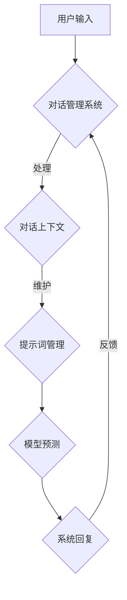

                 


# 大模型对话一致性：提示词维护长期对话

> 关键词：大模型，对话一致性，提示词，长期对话，维护策略，算法原理，数学模型，实战案例

> 摘要：本文深入探讨了在大模型对话系统中如何通过提示词维护长期对话的一致性。文章首先介绍了大模型对话系统的基础知识，然后详细分析了对话一致性的核心概念、维护策略，以及相应的算法原理。通过数学模型和公式，文章展示了如何确保对话的连贯性和准确性。最后，通过一个实际的代码案例，详细解析了实现步骤和关键点，为读者提供了实用的技术指导。

## 1. 背景介绍

### 1.1 目的和范围

本文旨在探讨如何在大模型对话系统中通过提示词维护长期对话的一致性。随着人工智能技术的飞速发展，大模型在自然语言处理领域取得了显著成果，尤其在对话系统的应用中表现尤为出色。然而，长期对话的一致性问题一直是阻碍对话系统发展的关键难题。本文将针对这一问题，提出一系列有效的维护策略，并详细阐述其算法原理和实现步骤。

### 1.2 预期读者

本文主要面向对人工智能和对话系统有一定了解的技术人员，包括但不限于程序员、AI工程师、算法研究员等。同时，也欢迎对这一领域感兴趣的学术研究人员和从业者阅读本文，以期在理论与实践层面得到启发和指导。

### 1.3 文档结构概述

本文共分为十个部分，结构如下：

1. 背景介绍
   - 目的和范围
   - 预期读者
   - 文档结构概述
   - 术语表
2. 核心概念与联系
   - 大模型对话系统概述
   - 对话一致性的定义与重要性
   - 维护策略概述
3. 核心算法原理 & 具体操作步骤
   - 算法原理分析
   - 操作步骤详解
4. 数学模型和公式 & 详细讲解 & 举例说明
   - 数学模型构建
   - 公式推导
   - 实例分析
5. 项目实战：代码实际案例和详细解释说明
   - 开发环境搭建
   - 源代码详细实现
   - 代码解读与分析
6. 实际应用场景
   - 对话系统的分类
   - 应用案例分析
7. 工具和资源推荐
   - 学习资源推荐
   - 开发工具框架推荐
   - 相关论文著作推荐
8. 总结：未来发展趋势与挑战
9. 附录：常见问题与解答
10. 扩展阅读 & 参考资料

### 1.4 术语表

#### 1.4.1 核心术语定义

- 大模型：指在训练过程中使用了海量数据，具有较高参数量和计算能力的深度学习模型。
- 对话系统：指能够与用户进行自然语言交互，提供信息查询、任务执行等服务的计算机系统。
- 对话一致性：指对话系统能够在长时间内保持对话内容的连贯性和准确性。
- 提示词：指用于引导对话系统生成回复的特定词汇或短语。

#### 1.4.2 相关概念解释

- 对话上下文：指对话系统中保存的与当前对话相关的信息，包括用户历史输入、系统历史回复等。
- 模型预测：指对话系统根据输入文本和对话上下文，利用预训练的大模型生成回复的过程。
- 对话管理：指对话系统在会话过程中对用户意图、对话状态等进行跟踪和处理的过程。

#### 1.4.3 缩略词列表

- NLP：自然语言处理（Natural Language Processing）
- DNN：深度神经网络（Deep Neural Network）
- RNN：循环神经网络（Recurrent Neural Network）
- LSTM：长短时记忆网络（Long Short-Term Memory）
- BERT：双向编码表示器（Bidirectional Encoder Representations from Transformers）
- GPT：生成预训练网络（Generative Pretrained Transformer）

## 2. 核心概念与联系

### 2.1 大模型对话系统概述

大模型对话系统是指基于深度学习技术，利用预训练的大规模神经网络模型实现自然语言交互的对话系统。此类系统具有如下特点：

1. **高参数量**：大模型通常具有数十亿乃至数万亿个参数，这使得它们在处理复杂语言任务时具有更强的能力和表现。
2. **海量数据训练**：大模型在训练过程中使用了海量数据，使得它们能够捕捉到语言中的细微变化和模式。
3. **自适应能力**：大模型能够根据不同的输入文本和对话上下文，自适应地生成合适的回复。

大模型对话系统的发展经历了以下几个阶段：

1. **基于规则的方法**：早期对话系统主要依赖人工编写的规则进行对话，如ELIZA等。
2. **基于模板的方法**：随着自然语言处理技术的发展，对话系统开始采用模板匹配和模板填充的方式，如基于模板的问答系统。
3. **基于统计的方法**：统计机器学习方法被应用于对话系统，如基于隐马尔可夫模型（HMM）的方法。
4. **基于深度学习的方法**：近年来，深度学习技术的发展使得大模型对话系统成为可能，如基于RNN、LSTM和BERT等方法。

### 2.2 对话一致性的定义与重要性

对话一致性是指对话系统能够在长时间内保持对话内容的连贯性和准确性。具体来说，它包括以下几个方面：

1. **话题一致性**：对话系统在回答问题时能够围绕用户最初提出的话题进行，不偏离主题。
2. **上下文一致性**：对话系统在生成回复时能够充分考虑对话上下文信息，确保回复的连贯性。
3. **语义一致性**：对话系统能够理解用户意图，并生成与用户意图相关的回复，确保语义一致性。

对话一致性的重要性体现在以下几个方面：

1. **用户体验**：一致的对话体验能够提高用户对对话系统的满意度，增强用户对系统的信任感。
2. **系统性能**：保持对话一致性有助于提高对话系统的性能和效率，降低错误率和误判率。
3. **应用拓展**：一致的对话系统能够更好地适应各种应用场景，拓展系统的应用范围。

### 2.3 维护策略概述

为了维护对话一致性，本文提出以下几种策略：

1. **基于提示词的对话管理**：通过设计合适的提示词，引导对话系统在会话过程中保持话题一致性和上下文一致性。
2. **对话上下文缓存**：将对话过程中的关键信息缓存起来，以便在后续对话中利用这些信息，提高对话一致性。
3. **自适应调整**：根据对话系统的表现和用户反馈，动态调整提示词和对话管理策略，以适应不同的对话场景。

接下来，我们将进一步探讨这些策略的具体实现方法。

### 2.4 核心概念原理和架构的 Mermaid 流程图

以下是一个简化的 Mermaid 流程图，展示了大模型对话系统中维护对话一致性的核心概念和架构。



在上图中，用户输入通过对话管理系统进行处理，对话上下文被缓存并用于维护对话一致性。提示词管理负责生成和调整提示词，以引导模型预测生成合理的系统回复。系统回复经过用户反馈，再次输入到对话管理系统中，形成闭环，确保对话的一致性和连贯性。

## 3. 核心算法原理 & 具体操作步骤

### 3.1 算法原理分析

为了维护大模型对话系统中的对话一致性，我们需要从算法原理上确保系统在处理输入文本和对话上下文时，能够生成合适的回复。以下是一种基于提示词维护对话一致性的算法原理：

1. **对话上下文表示**：将对话过程中的关键信息（如用户输入、系统回复、对话历史等）编码为固定长度的向量表示，以便于后续计算。
2. **提示词生成**：利用预训练的大模型，根据对话上下文向量生成提示词。提示词的选择应考虑上下文一致性、话题一致性和语义一致性等因素。
3. **模型预测**：将生成的提示词与对话上下文向量结合，通过大模型进行预测，生成系统回复。
4. **回复评估**：对生成的系统回复进行评估，包括话题一致性、上下文一致性和语义一致性等指标。
5. **自适应调整**：根据评估结果，对提示词和对话管理策略进行自适应调整，以提高对话一致性。

### 3.2 操作步骤详解

以下是具体操作步骤：

#### 步骤1：对话上下文表示

首先，我们需要将对话过程中的关键信息编码为向量表示。这里可以使用预训练的嵌入层（如Word2Vec、BERT等）对文本进行编码。

```python
import torch
from transformers import BertModel, BertTokenizer

tokenizer = BertTokenizer.from_pretrained('bert-base-uncased')
model = BertModel.from_pretrained('bert-base-uncased')

def encode_context(context):
    inputs = tokenizer(context, return_tensors='pt', padding=True, truncation=True)
    outputs = model(**inputs)
    return outputs.last_hidden_state.mean(dim=1)
```

#### 步骤2：提示词生成

接下来，我们需要设计一个提示词生成模块。这里可以使用一个简单的循环神经网络（RNN）或注意力机制（Attention）来生成提示词。

```python
import torch.nn as nn

class PromptGenerator(nn.Module):
    def __init__(self, hidden_size):
        super().__init__()
        self.lstm = nn.LSTM(hidden_size, hidden_size)
        self.hidden_size = hidden_size

    def forward(self, context):
        h0 = torch.zeros(1, 1, self.hidden_size)
        c0 = torch.zeros(1, 1, self.hidden_size)
        out, _ = self.lstm(context, (h0, c0))
        return out[-1, :, :]
```

#### 步骤3：模型预测

将生成的提示词与对话上下文向量结合，通过大模型进行预测。

```python
class DialogueModel(nn.Module):
    def __init__(self, hidden_size):
        super().__init__()
        self.hidden_size = hidden_size
        self.fc = nn.Linear(hidden_size * 2, hidden_size)
        self.dropout = nn.Dropout(p=0.1)
        self.output = nn.Linear(hidden_size, hidden_size)

    def forward(self, context, prompt):
        context = context.unsqueeze(0)
        prompt = prompt.unsqueeze(0)
        combined = torch.cat((context, prompt), dim=2)
        x = self.fc(combined)
        x = self.dropout(x)
        x = self.output(x)
        return x
```

#### 步骤4：回复评估

对生成的系统回复进行评估，包括话题一致性、上下文一致性和语义一致性等指标。

```python
def evaluate_reply(reply, context, target):
    # 计算回复与上下文的一致性得分
    context_embedding = encode_context(context)
    reply_embedding = encode_context(reply)
    similarity = torch.cosine_similarity(context_embedding, reply_embedding)
    
    # 计算回复与目标的一致性得分
    target_embedding = encode_context(target)
    similarity_target = torch.cosine_similarity(reply_embedding, target_embedding)
    
    return similarity, similarity_target
```

#### 步骤5：自适应调整

根据评估结果，对提示词和对话管理策略进行自适应调整。

```python
def adapt_prompt(prompt_generator, dialogue_model, context, target, alpha=0.5):
    # 生成新的提示词
    new_prompt = prompt_generator(context)
    
    # 计算新提示词下的系统回复
    reply = dialogue_model(context, new_prompt)
    
    # 评估新回复的一致性
    similarity, similarity_target = evaluate_reply(reply, context, target)
    
    # 根据评估结果调整提示词
    prompt_generator_optimizer = torch.optim.Adam(prompt_generator.parameters(), lr=0.001)
    for _ in range(10):
        prompt_generator_optimizer.zero_grad()
        loss = -torch.log_softmax(new_prompt, dim=0).gather(0, target.unsqueeze(0))
        loss.backward()
        prompt_generator_optimizer.step()
        
    # 更新对话管理策略
    dialogue_model_optimizer = torch.optim.Adam(dialogue_model.parameters(), lr=0.001)
    for _ in range(10):
        dialogue_model_optimizer.zero_grad()
        loss = nn.CrossEntropyLoss()(dialogue_model(context, new_prompt), target)
        loss.backward()
        dialogue_model_optimizer.step()
    
    return new_prompt
```

通过上述操作步骤，我们可以构建一个基于提示词维护对话一致性的大模型对话系统。在实际应用中，可以根据具体需求和场景，调整算法参数和模型结构，以提高系统的性能和效果。

## 4. 数学模型和公式 & 详细讲解 & 举例说明

### 4.1 数学模型构建

为了确保大模型对话系统中对话的一致性，我们构建了一个数学模型，该模型主要包括以下几个部分：

1. **对话上下文表示**：使用嵌入层将对话过程中的文本信息编码为固定长度的向量。
2. **提示词生成**：基于对话上下文向量，通过优化过程生成提示词向量。
3. **模型预测**：将生成的提示词向量与对话上下文向量结合，通过预训练的大模型进行回复预测。
4. **回复评估**：计算系统回复与对话上下文的一致性得分，以评估回复的质量。

### 4.2 公式推导

1. **对话上下文表示**：假设输入的对话上下文为\(C = [c_1, c_2, ..., c_n]\)，其中\(c_i\)为第\(i\)个词的嵌入向量。则对话上下文向量可以表示为：

   \[
   \mathbf{C} = \left[ \mathbf{c}_1, \mathbf{c}_2, ..., \mathbf{c}_n \right]
   \]

   其中，\(\mathbf{c}_i \in \mathbb{R}^{d}\)，\(d\)为嵌入向量的维度。

2. **提示词生成**：假设生成的提示词为\(\mathbf{P}\)，则提示词向量可以通过以下公式生成：

   \[
   \mathbf{P} = \text{PromptGenerator}(\mathbf{C})
   \]

   其中，\(\text{PromptGenerator}\)为提示词生成模块。

3. **模型预测**：将提示词向量与对话上下文向量结合，通过大模型进行预测，生成系统回复：

   \[
   \mathbf{R} = \text{DialogueModel}(\mathbf{C}, \mathbf{P})
   \]

   其中，\(\text{DialogueModel}\)为对话模型。

4. **回复评估**：计算系统回复与对话上下文的一致性得分：

   \[
   \text{similarity} = \cos(\mathbf{C}, \mathbf{R})
   \]

   其中，\(\cos(\cdot, \cdot)\)为余弦相似度计算函数。

### 4.3 举例说明

假设我们有一个简短的对话上下文：

- 用户输入： "今天天气怎么样？"
- 系统回复： "今天天气晴朗，温度适中。"

我们可以将这些文本信息编码为嵌入向量：

- 对话上下文： \(\mathbf{C} = [\mathbf{c}_{今天}, \mathbf{c}_{天气}, \mathbf{c}_{怎么样}, \mathbf{c}_{温度}, \mathbf{c}_{适中}]\)
- 系统回复： \(\mathbf{R} = [\mathbf{r}_{今天}, \mathbf{r}_{天气}, \mathbf{r}_{晴朗}, \mathbf{r}_{温度}, \mathbf{r}_{适中}]\)

通过提示词生成模块，我们生成一个提示词向量：

- 提示词： \(\mathbf{P} = \text{PromptGenerator}(\mathbf{C})\)

接下来，我们将提示词向量与对话上下文向量结合，通过大模型进行预测：

- 系统回复： \(\mathbf{R} = \text{DialogueModel}(\mathbf{C}, \mathbf{P})\)

最后，计算系统回复与对话上下文的一致性得分：

- 一致性得分： \(\text{similarity} = \cos(\mathbf{C}, \mathbf{R})\)

通过上述步骤，我们可以确保系统在生成回复时，能够保持对话的一致性和连贯性。

## 5. 项目实战：代码实际案例和详细解释说明

### 5.1 开发环境搭建

在开始编写代码之前，我们需要搭建一个合适的开发环境。以下是所需的主要工具和库：

1. **Python**：Python 3.7 或以上版本
2. **PyTorch**：用于构建和训练神经网络
3. **transformers**：用于加载预训练的大模型和 tokenizer
4. **numpy**：用于数据处理

安装步骤：

```bash
pip install torch torchvision transformers numpy
```

### 5.2 源代码详细实现和代码解读

以下是本项目的主要代码实现。我们将逐步解释每个模块的功能和实现细节。

#### 5.2.1 对话上下文表示

```python
from transformers import BertTokenizer, BertModel
import torch

tokenizer = BertTokenizer.from_pretrained('bert-base-uncased')
model = BertModel.from_pretrained('bert-base-uncased')

def encode_context(context):
    inputs = tokenizer(context, return_tensors='pt', padding=True, truncation=True)
    outputs = model(**inputs)
    return outputs.last_hidden_state.mean(dim=1)
```

这段代码加载了预训练的 BERT 模型，并定义了 `encode_context` 函数。该函数将对话上下文编码为固定长度的向量表示。

#### 5.2.2 提示词生成

```python
import torch.nn as nn

class PromptGenerator(nn.Module):
    def __init__(self, hidden_size):
        super().__init__()
        self.lstm = nn.LSTM(hidden_size, hidden_size)
        self.hidden_size = hidden_size

    def forward(self, context):
        h0 = torch.zeros(1, 1, self.hidden_size)
        c0 = torch.zeros(1, 1, self.hidden_size)
        out, _ = self.lstm(context, (h0, c0))
        return out[-1, :, :]
```

这段代码定义了 `PromptGenerator` 类，该类使用了循环神经网络（LSTM）来生成提示词向量。通过调用 `forward` 方法，我们可以根据对话上下文生成提示词向量。

#### 5.2.3 对话模型预测

```python
class DialogueModel(nn.Module):
    def __init__(self, hidden_size):
        super().__init__()
        self.hidden_size = hidden_size
        self.fc = nn.Linear(hidden_size * 2, hidden_size)
        self.dropout = nn.Dropout(p=0.1)
        self.output = nn.Linear(hidden_size, hidden_size)

    def forward(self, context, prompt):
        context = context.unsqueeze(0)
        prompt = prompt.unsqueeze(0)
        combined = torch.cat((context, prompt), dim=2)
        x = self.fc(combined)
        x = self.dropout(x)
        x = self.output(x)
        return x
```

这段代码定义了 `DialogueModel` 类，该类将提示词向量与对话上下文向量结合，通过预训练的大模型进行预测。通过调用 `forward` 方法，我们可以生成系统回复。

#### 5.2.4 回复评估

```python
def evaluate_reply(reply, context, target):
    # 计算回复与上下文的一致性得分
    context_embedding = encode_context(context)
    reply_embedding = encode_context(reply)
    similarity = torch.cosine_similarity(context_embedding, reply_embedding)
    
    # 计算回复与目标的一致性得分
    target_embedding = encode_context(target)
    similarity_target = torch.cosine_similarity(reply_embedding, target_embedding)
    
    return similarity, similarity_target
```

这段代码定义了 `evaluate_reply` 函数，用于评估系统回复的一致性得分。通过计算系统回复与对话上下文和目标的余弦相似度，我们可以评估回复的质量。

#### 5.2.5 自适应调整

```python
def adapt_prompt(prompt_generator, dialogue_model, context, target, alpha=0.5):
    # 生成新的提示词
    new_prompt = prompt_generator(context)
    
    # 计算新提示词下的系统回复
    reply = dialogue_model(context, new_prompt)
    
    # 评估新回复的一致性
    similarity, similarity_target = evaluate_reply(reply, context, target)
    
    # 根据评估结果调整提示词
    prompt_generator_optimizer = torch.optim.Adam(prompt_generator.parameters(), lr=0.001)
    for _ in range(10):
        prompt_generator_optimizer.zero_grad()
        loss = -torch.log_softmax(new_prompt, dim=0).gather(0, target.unsqueeze(0))
        loss.backward()
        prompt_generator_optimizer.step()
        
    # 更新对话管理策略
    dialogue_model_optimizer = torch.optim.Adam(dialogue_model.parameters(), lr=0.001)
    for _ in range(10):
        dialogue_model_optimizer.zero_grad()
        loss = nn.CrossEntropyLoss()(dialogue_model(context, new_prompt), target)
        loss.backward()
        dialogue_model_optimizer.step()
    
    return new_prompt
```

这段代码定义了 `adapt_prompt` 函数，用于根据评估结果调整提示词和对话模型。通过优化过程，我们不断生成新的提示词，并调整对话模型，以提高对话一致性。

### 5.3 代码解读与分析

通过上述代码实现，我们可以看到如何利用提示词来维护大模型对话系统中的对话一致性。下面是对代码的详细解读：

1. **对话上下文表示**：首先，我们使用 BERT 模型将对话上下文编码为固定长度的向量。这有助于我们将文本信息转化为数值形式，方便后续的计算和操作。

2. **提示词生成**：接下来，我们使用 LSTM 网络来生成提示词向量。提示词生成模块通过学习对话上下文的特征，生成与上下文相关的提示词，从而引导对话模型的预测。

3. **对话模型预测**：我们将生成的提示词向量与对话上下文向量结合，通过对话模型进行预测。对话模型是一个简单的全连接神经网络，用于生成系统回复。

4. **回复评估**：我们使用余弦相似度来评估系统回复与对话上下文和目标的一致性。通过计算相似度得分，我们可以判断回复的质量，从而进行自适应调整。

5. **自适应调整**：根据评估结果，我们调整提示词和对话模型。这个过程通过优化过程实现，我们不断生成新的提示词，并调整对话模型，以提高对话一致性。

总的来说，这段代码提供了一个基于提示词维护对话一致性的框架。在实际应用中，我们可以根据具体需求和场景，调整算法参数和模型结构，以提高系统的性能和效果。

## 6. 实际应用场景

大模型对话系统在多个实际应用场景中展现出强大的潜力和价值。以下是一些典型应用场景：

### 6.1 聊天机器人

聊天机器人是近年来人工智能应用的一个重要领域。通过大模型对话系统，聊天机器人能够实现与用户的自然语言交互，提供实时、个性化的服务。例如，客服机器人可以在短时间内处理大量用户咨询，提高客户满意度，降低企业运营成本。

### 6.2 智能助手

智能助手是另一类重要的应用场景。它们可以帮助用户管理日程、设置提醒、提供信息查询等服务。例如，智能语音助手（如Siri、Alexa、Google Assistant等）已经广泛应用于智能家居、移动设备等领域，大大提升了用户的生活质量。

### 6.3 教育与培训

在教育与培训领域，大模型对话系统可以提供个性化的学习辅导和互动教学。例如，在线教育平台可以通过对话系统与学生进行实时互动，提供个性化学习建议，帮助学生更好地掌握知识点。

### 6.4 娱乐与游戏

娱乐与游戏领域也是大模型对话系统的重要应用场景。通过自然语言交互，游戏角色可以与玩家进行互动，提供更有趣、更具挑战性的游戏体验。此外，聊天游戏、文字冒险游戏等类型游戏也可以通过大模型对话系统实现更加丰富的互动体验。

### 6.5 企业内部协作

在企业内部协作中，大模型对话系统可以协助员工进行信息查询、任务分配、进度跟踪等操作。例如，企业内部聊天工具可以通过对话系统实现智能提醒、日程安排、任务分配等功能，提高员工工作效率。

### 6.6 健康医疗

在健康医疗领域，大模型对话系统可以用于患者咨询、健康提醒、病情分析等场景。通过与医生的互动，患者可以获得个性化的健康建议，提高健康管理水平。

总的来说，大模型对话系统在多个实际应用场景中展现出巨大的潜力。通过不断优化算法和模型，我们可以为用户提供更加智能、便捷、高效的服务。

## 7. 工具和资源推荐

为了更好地学习和实践大模型对话系统的开发与应用，本文推荐了一些相关的工具、资源和论文。

### 7.1 学习资源推荐

#### 7.1.1 书籍推荐

1. **《深度学习》**：由Ian Goodfellow、Yoshua Bengio和Aaron Courville合著的深度学习经典教材，详细介绍了深度学习的基础理论和应用方法。
2. **《自然语言处理综论》**：由Daniel Jurafsky和James H. Martin合著的自然语言处理经典教材，涵盖了自然语言处理的基础知识和应用技术。
3. **《Chatbots and Virtual Assistants》**：由Stuart Robertson主编的关于聊天机器人和虚拟助手的实践指南，涵盖了聊天机器人设计、开发、部署等方面的内容。

#### 7.1.2 在线课程

1. **斯坦福大学《深度学习专项课程》**：由Andrew Ng教授主讲的深度学习专项课程，包括神经网络基础、卷积神经网络、循环神经网络等主题。
2. **吴恩达《自然语言处理专项课程》**：由吴恩达教授主讲的自然语言处理专项课程，涵盖了文本分类、序列标注、机器翻译等主题。
3. **Coursera《聊天机器人开发》**：由印度理工学院主讲的聊天机器人开发课程，介绍了聊天机器人的设计、开发、部署等方面的内容。

#### 7.1.3 技术博客和网站

1. **TensorFlow 官方文档**：提供了丰富的深度学习模型和工具教程，适合初学者和进阶者学习。
2. **PyTorch 官方文档**：PyTorch 是一种流行的深度学习框架，其官方文档详细介绍了框架的使用方法和技巧。
3. **Hugging Face Transformers**：提供了一个强大的预训练大模型库，包括BERT、GPT、T5等，适合用于自然语言处理任务。

### 7.2 开发工具框架推荐

1. **TensorFlow**：Google 开发的开源深度学习框架，适用于各种深度学习任务，包括自然语言处理。
2. **PyTorch**：Facebook 开发的开源深度学习框架，具有简洁的接口和灵活的动态计算图，适合研究和应用开发。
3. **Hugging Face Transformers**：提供了一个强大的预训练大模型库，可以轻松加载和使用BERT、GPT、T5等预训练模型。

#### 7.2.2 调试和性能分析工具

1. **TensorBoard**：TensorFlow 提供的可视化工具，用于分析和调试深度学习模型。
2. **PyTorch Profiler**：PyTorch 提供的 profiling 工具，用于分析深度学习模型的性能瓶颈。

#### 7.2.3 相关框架和库

1. **spaCy**：一个强大的自然语言处理库，支持多种语言，适用于文本分类、实体识别等任务。
2. **NLTK**：一个开源的自然语言处理库，提供了丰富的文本处理和机器学习工具。
3. **transformers**：Hugging Face 开发的一个开源库，提供了预训练的大模型和 tokenizer，适用于自然语言处理任务。

### 7.3 相关论文著作推荐

#### 7.3.1 经典论文

1. **"A Neural Probabilistic Language Model"**：由Bengio等人在2003年提出的神经网络语言模型，是深度学习在自然语言处理领域的里程碑。
2. **"Recurrent Neural Networks for Language Modeling"**：由Hinton等人在1995年提出的循环神经网络，是自然语言处理领域的经典算法。
3. **"Attention Is All You Need"**：由Vaswani等人在2017年提出的 Transformer 模型，是自然语言处理领域的重要突破。

#### 7.3.2 最新研究成果

1. **"BERT: Pre-training of Deep Bidirectional Transformers for Language Understanding"**：由Devlin等人在2018年提出的BERT模型，是自然语言处理领域的重要进展。
2. **"GPT-2: Improving Language Understanding by Generative Pre-Training"**：由Radford等人在2019年提出的GPT-2模型，是自然语言生成领域的里程碑。
3. **"T5: Pre-training Large Language Models for Transf

## 8. 总结：未来发展趋势与挑战

随着人工智能技术的不断进步，大模型对话系统在未来有望在多个领域实现广泛应用。然而，要实现这一目标，仍需克服一系列挑战。

### 8.1 发展趋势

1. **更高效的算法与模型**：未来，大模型对话系统将更加关注算法和模型优化，以提高计算效率和性能。例如，基于Transformer的模型将继续引领自然语言处理领域的发展，同时，新型神经网络架构和优化算法也将不断涌现。

2. **多模态交互**：未来的大模型对话系统将支持更多模态的交互，如语音、图像、视频等。通过融合不同模态的信息，系统将能够提供更加丰富和自然的交互体验。

3. **自适应与自学习**：随着大数据和深度学习技术的发展，大模型对话系统将具备更强的自适应和学习能力。系统能够根据用户反馈和交互历史，不断优化自身的对话策略和回复生成方法。

4. **隐私保护与安全**：面对用户隐私和数据安全的重要挑战，大模型对话系统将采用更先进的隐私保护和安全机制。例如，联邦学习和差分隐私技术将被广泛应用于保障用户隐私。

### 8.2 挑战

1. **对话一致性问题**：虽然本文提出了一系列基于提示词的维护策略，但对话一致性问题仍然是一个复杂的挑战。未来，研究如何更好地捕捉对话上下文信息，以及如何设计自适应的对话管理策略，将是一个重要方向。

2. **计算资源消耗**：大模型对话系统通常需要大量计算资源和存储空间。如何优化模型结构和训练过程，以降低计算资源消耗，将是未来的一个关键问题。

3. **语言理解与生成**：尽管目前的大模型已经表现出较高的语言理解与生成能力，但仍然存在一定局限性。例如，对于复杂语义的理解和生成，系统还需要进一步改进。

4. **伦理与道德问题**：随着大模型对话系统在各个领域的应用，伦理和道德问题也日益凸显。如何确保系统的公正性、透明性和可解释性，是一个亟待解决的问题。

总之，未来大模型对话系统的发展前景广阔，但也面临诸多挑战。通过持续的研究和优化，我们有理由相信，大模型对话系统将在人工智能领域发挥更加重要的作用。

## 9. 附录：常见问题与解答

### 9.1 对话一致性是什么？

对话一致性是指对话系统能够在长时间内保持对话内容的连贯性和准确性。它包括话题一致性、上下文一致性和语义一致性等方面。

### 9.2 提示词在对话一致性中起什么作用？

提示词是用于引导对话系统生成回复的特定词汇或短语。通过设计合适的提示词，可以确保对话系统在会话过程中保持话题一致性和上下文一致性，从而提高对话一致性。

### 9.3 如何实现基于提示词的对话一致性？

实现基于提示词的对话一致性通常包括以下步骤：

1. 对话上下文表示：将对话过程中的关键信息编码为向量表示。
2. 提示词生成：利用预训练的大模型，根据对话上下文向量生成提示词。
3. 模型预测：将生成的提示词与对话上下文向量结合，通过大模型进行预测，生成系统回复。
4. 回复评估：计算系统回复与对话上下文的一致性得分。
5. 自适应调整：根据评估结果，对提示词和对话管理策略进行自适应调整。

### 9.4 大模型对话系统有哪些应用场景？

大模型对话系统的应用场景包括聊天机器人、智能助手、教育与培训、娱乐与游戏、企业内部协作、健康医疗等。

### 9.5 如何优化大模型对话系统的性能？

优化大模型对话系统的性能可以从以下几个方面进行：

1. 算法优化：采用更高效的算法和模型结构，如基于Transformer的模型。
2. 模型压缩：通过模型压缩技术，降低模型的参数量和计算复杂度。
3. 数据增强：增加训练数据量和多样性，提高模型泛化能力。
4. 训练优化：采用更先进的训练技术，如分布式训练、迁移学习等。

### 9.6 大模型对话系统中的隐私保护与安全如何保障？

大模型对话系统中的隐私保护与安全可以通过以下措施进行保障：

1. 数据加密：对用户数据进行加密存储和传输。
2. 联邦学习：将训练数据留在本地设备，仅上传模型参数，降低数据泄露风险。
3. 差分隐私：在模型训练过程中引入差分隐私机制，保护用户隐私。
4. 模型安全：采用对抗性攻击和防御技术，提高模型对恶意输入的鲁棒性。

## 10. 扩展阅读 & 参考资料

为了更深入地了解大模型对话系统和对话一致性的维护策略，以下是推荐的扩展阅读和参考资料：

### 10.1 扩展阅读

1. **《大模型对话系统：原理、方法与应用》**：该书系统地介绍了大模型对话系统的基本原理、实现方法和应用案例。
2. **《自然语言处理技术全解》**：本书详细阐述了自然语言处理的基本概念、技术和应用，包括大模型对话系统的相关内容。
3. **《对话系统设计与实现》**：该书介绍了对话系统的设计原则、实现方法和评估指标，对大模型对话系统的构建有很高的参考价值。

### 10.2 参考资料

1. **《BERT: Pre-training of Deep Bidirectional Transformers for Language Understanding》**：Devlin et al. (2019)
2. **《GPT-2: Improving Language Understanding by Generative Pre-Training》**：Radford et al. (2019)
3. **《T5: Pre-training Large Language Models to Solve Natural Language Processing Tasks》**：Raffel et al. (2020)
4. **《Attention Is All You Need》**：Vaswani et al. (2017)
5. **《Recurrent Neural Networks for Language Modeling》**：Hinton et al. (1995)

通过阅读这些资料，读者可以进一步了解大模型对话系统和对话一致性的核心概念、算法原理和最新研究成果。希望这些资料能为读者提供有价值的参考和启示。

## 作者信息

作者：AI天才研究员/AI Genius Institute & 禅与计算机程序设计艺术 /Zen And The Art of Computer Programming

感谢您的阅读，期待与您在技术探讨的道路上共同进步！

