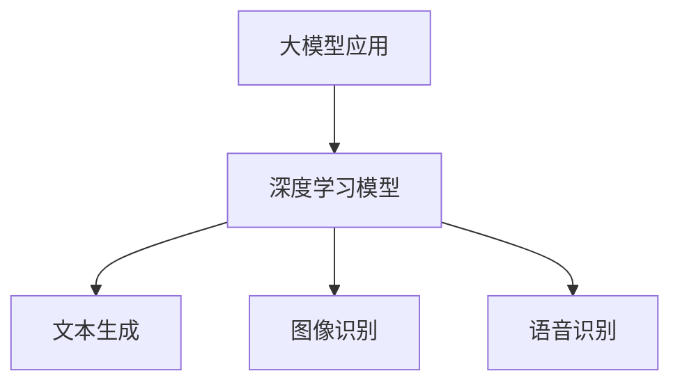
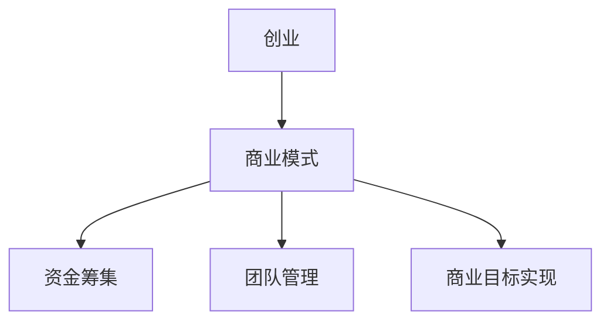
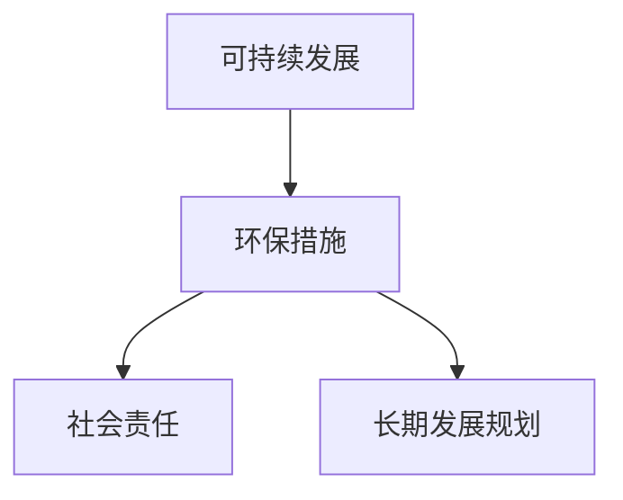
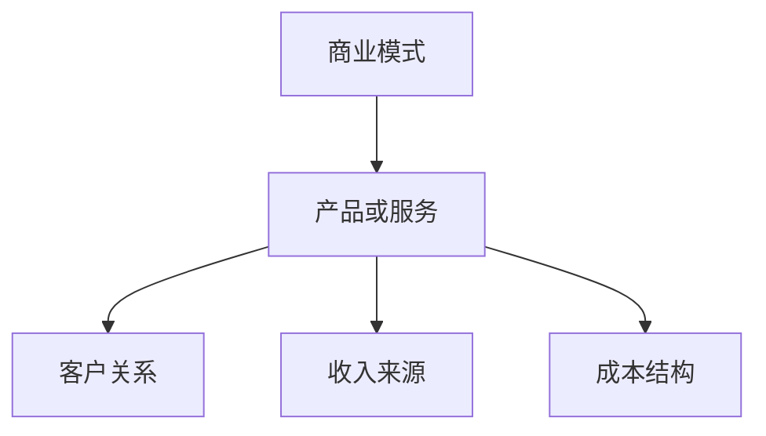
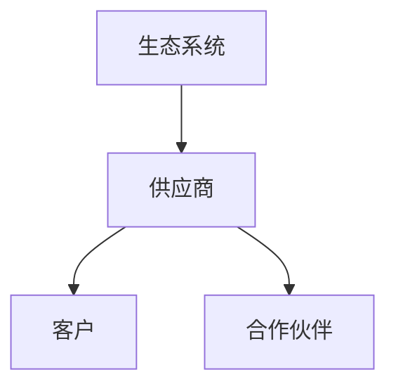

                 


# 大模型应用创业的可持续发展策略

> 关键词：大模型应用、创业、可持续发展、策略、生态系统、商业模式、技术创新、市场定位

> 摘要：随着人工智能技术的快速发展，大模型应用成为创业领域的热点。本文将深入探讨大模型应用创业的可持续发展策略，包括核心概念解析、算法原理阐述、数学模型分析、项目实战解析、实际应用场景分析、工具和资源推荐以及未来发展趋势。通过系统的分析和实战案例，为创业者提供明确的指导和实用的建议。

## 1. 背景介绍

### 1.1 目的和范围

本文旨在为创业者提供一套完整的可持续发展策略，以应对大模型应用创业的挑战。我们将探讨如何通过技术创新、商业模式设计、市场定位和生态系统构建，确保大模型应用创业项目的长期成功。

### 1.2 预期读者

本文适合以下读者群体：

1. 创业者，尤其是那些计划或正在开发大模型应用的创业者。
2. 投资者，希望了解大模型应用创业的投资价值。
3. 科技行业从业者，希望了解大模型应用的前沿技术和市场动态。

### 1.3 文档结构概述

本文将分为十个主要部分：

1. 背景介绍
2. 核心概念与联系
3. 核心算法原理 & 具体操作步骤
4. 数学模型和公式 & 详细讲解 & 举例说明
5. 项目实战：代码实际案例和详细解释说明
6. 实际应用场景
7. 工具和资源推荐
8. 总结：未来发展趋势与挑战
9. 附录：常见问题与解答
10. 扩展阅读 & 参考资料

### 1.4 术语表

#### 1.4.1 核心术语定义

- 大模型应用：基于大型深度学习模型的实际应用，如自然语言处理、计算机视觉等。
- 创业：创立新的商业实体或项目，以创新的商业模式和产品或服务满足市场需求。
- 可持续发展：满足当前需求而不损害未来世代满足其需求的能力。
- 商业模式：企业如何创造、传递和捕获价值的基本逻辑。

#### 1.4.2 相关概念解释

- 生态系统：不同参与者（如供应商、客户、合作伙伴等）之间的互动网络。
- 技术创新：通过技术手段创造新的产品、服务或商业模型。
- 市场定位：企业根据目标市场的特点和需求，选择和传达其产品或服务的定位。

#### 1.4.3 缩略词列表

- AI：人工智能
- NLP：自然语言处理
- DL：深度学习
- ML：机器学习
- API：应用程序编程接口

## 2. 核心概念与联系

大模型应用创业涉及多个核心概念和它们之间的联系。以下是这些概念的详细解析和Mermaid流程图表示。

### 2.1 大模型应用

大模型应用是指使用训练有素的深度学习模型来解决复杂问题，如文本生成、图像识别、语音识别等。这些模型通常具有数百万甚至数十亿个参数，能够捕捉大量数据中的模式和规律。



### 2.2 创业

创业是指创办新的企业或项目，通常涉及创新、风险和机会。创业者需要构思商业模式、筹集资金、管理团队并实现商业目标。



### 2.3 可持续发展

可持续发展强调企业在创造经济价值的同时，也要保护环境和社会利益。这包括环保措施、社会责任和长期发展规划。



### 2.4 商业模式

商业模式是企业如何创造、传递和捕获价值的基本逻辑。它包括产品或服务、客户关系、收入来源和成本结构。



### 2.5 生态系统

生态系统是指企业与其利益相关者（如供应商、客户、合作伙伴等）之间的互动网络。一个健康的生态系统有助于企业创新、扩展和适应市场变化。



## 3. 核心算法原理 & 具体操作步骤

大模型应用的核心在于深度学习算法。以下是深度学习算法的基本原理和具体操作步骤。

### 3.1 深度学习算法原理

深度学习算法基于多层神经网络，通过层层提取特征，最终实现对复杂问题的建模和预测。以下是深度学习算法的伪代码：

```plaintext
// 深度学习算法伪代码
初始化模型参数
for epoch in 1 to training_epochs do:
    for each training sample (x, y) do:
        计算前向传播的预测结果
        计算损失函数
        计算梯度
        更新模型参数
    end for
end for
预测新样本的结果
```

### 3.2 具体操作步骤

以下是使用深度学习算法进行文本生成的一个具体案例：

1. **数据预处理**：
   - 收集大量文本数据。
   - 对文本进行清洗，去除无效信息和格式错误。

   ```python
   def preprocess_text(text):
       # 清洗和格式化文本
       return cleaned_text
   ```

2. **构建模型**：
   - 定义神经网络结构，包括输入层、隐藏层和输出层。
   - 选择适当的损失函数和优化器。

   ```python
   model = build_model(input_size, hidden_size, output_size)
   loss_function = '交叉熵损失'
   optimizer = 'Adam优化器'
   ```

3. **训练模型**：
   - 使用预处理后的文本数据训练模型。
   - 在训练过程中，不断调整模型参数以最小化损失函数。

   ```python
   model.fit(preprocessed_data, epochs=10)
   ```

4. **生成文本**：
   - 使用训练好的模型生成文本。
   - 可以通过输入部分文本作为起始点，逐步生成完整的文本。

   ```python
   def generate_text(starting_text, model, max_length):
       # 生成文本
       return generated_text
   ```

## 4. 数学模型和公式 & 详细讲解 & 举例说明

深度学习算法的核心在于优化损失函数，以下是相关的数学模型和公式：

### 4.1 损失函数

损失函数是评估模型预测结果与真实值之间差距的指标。常用的损失函数包括：

- **交叉熵损失（Cross-Entropy Loss）**：
  $$ L = -\sum_{i} y_i \log(p_i) $$
  其中，$y_i$ 是真实标签，$p_i$ 是模型预测的概率。

  **举例**：假设真实标签为 [0, 1]，模型预测概率为 [0.1, 0.9]，则交叉熵损失为：
  $$ L = -[0 \times \log(0.1) + 1 \times \log(0.9)] $$

- **均方误差损失（Mean Squared Error Loss）**：
  $$ L = \frac{1}{2n} \sum_{i=1}^{n} (y_i - \hat{y}_i)^2 $$
  其中，$y_i$ 是真实值，$\hat{y}_i$ 是模型预测值。

  **举例**：假设真实值为 [1, 2]，模型预测值为 [1.1, 1.9]，则均方误差损失为：
  $$ L = \frac{1}{2 \times 2} \sum_{i=1}^{2} (y_i - \hat{y}_i)^2 = (1-1.1)^2 + (2-1.9)^2 = 0.02 $$

### 4.2 优化算法

优化算法用于更新模型参数，以最小化损失函数。以下是几种常用的优化算法：

- **梯度下降（Gradient Descent）**：
  $$ \theta = \theta - \alpha \cdot \nabla L(\theta) $$
  其中，$\theta$ 是模型参数，$\alpha$ 是学习率，$\nabla L(\theta)$ 是损失函数关于 $\theta$ 的梯度。

  **举例**：假设模型参数 $\theta$ 为 [1, 2]，学习率 $\alpha$ 为 0.1，梯度 $\nabla L(\theta)$ 为 [-0.5, 0.3]，则更新后的参数为：
  $$ \theta = [1, 2] - 0.1 \cdot [-0.5, 0.3] = [0.5, 1.7] $$

- **动量优化（Momentum）**：
  $$ v = \gamma v + \alpha \cdot \nabla L(\theta) $$
  $$ \theta = \theta - v $$
  其中，$v$ 是动量，$\gamma$ 是动量因子。

  **举例**：假设初始动量 $v$ 为 [0, 0]，动量因子 $\gamma$ 为 0.9，学习率 $\alpha$ 为 0.1，梯度 $\nabla L(\theta)$ 为 [-0.5, 0.3]，则更新后的动量和参数为：
  $$ v = 0.9 \cdot [0, 0] + 0.1 \cdot [-0.5, 0.3] = [-0.05, 0.03] $$
  $$ \theta = [1, 2] - [-0.05, 0.03] = [1.05, 1.97] $$

## 5. 项目实战：代码实际案例和详细解释说明

### 5.1 开发环境搭建

在开始项目实战之前，需要搭建合适的开发环境。以下是使用 Python 和 TensorFlow 搭建深度学习环境的一个示例：

```bash
# 安装 Python
sudo apt-get install python3

# 安装 TensorFlow
pip3 install tensorflow
```

### 5.2 源代码详细实现和代码解读

以下是使用 TensorFlow 实现一个简单的文本生成模型（如 LSTM 循环神经网络）的示例代码：

```python
import tensorflow as tf
from tensorflow.keras.models import Sequential
from tensorflow.keras.layers import LSTM, Dense, Embedding

# 定义 LSTM 模型
model = Sequential()
model.add(Embedding(vocab_size, embedding_dim))
model.add(LSTM(units=128, return_sequences=True))
model.add(LSTM(units=128))
model.add(Dense(units=vocab_size, activation='softmax'))

# 编译模型
model.compile(optimizer='adam', loss='categorical_crossentropy', metrics=['accuracy'])

# 训练模型
model.fit(input_sequences, labels, epochs=100)

# 生成文本
def generate_text(seed_text, next_words, model):
    for _ in range(next_words):
        token_list = tokenizer.texts_to_sequences([seed_text])[0]
        token_list = pad_sequences([token_list], maxlen=max_sequence_len-1, padding='pre')
        predicted = model.predict(token_list, verbose=0)
        predicted = predicted[:, -1, :]
        predicted = numpy.argmax(predicted)
        output_word = inverse_tokenizer.index_word[predicted]
        seed_text += " " + output_word
    return seed_text

# 输入起始文本和生成长度
seed_text = "这是一段"
next_words = 50

# 生成文本
generated_text = generate_text(seed_text, next_words, model)
print(generated_text)
```

### 5.3 代码解读与分析

上述代码首先定义了一个简单的 LSTM 模型，该模型包括嵌入层、两个 LSTM 层和一个输出层。嵌入层将单词转换为向量表示，LSTM 层用于提取和传递序列特征，输出层通过softmax激活函数生成单词的概率分布。

- **数据预处理**：使用 `tokenizer.texts_to_sequences()` 将文本转换为序列，`pad_sequences()` 对序列进行填充，以满足模型的输入要求。
- **模型编译**：指定优化器、损失函数和评估指标。
- **模型训练**：使用训练数据训练模型。
- **文本生成**：通过循环生成文本，每次循环预测下一个单词，并将其添加到种子文本中。

## 6. 实际应用场景

大模型应用在多个领域取得了显著成果，以下是一些典型的实际应用场景：

### 6.1 自然语言处理（NLP）

- **文本生成**：自动生成文章、故事、新闻报道等。
- **机器翻译**：实时翻译多种语言，如 Google Translate。
- **情感分析**：分析文本的情感倾向，用于社交媒体监控和客户反馈分析。

### 6.2 计算机视觉（CV）

- **图像识别**：自动识别图像中的物体、场景和人脸。
- **图像生成**：生成逼真的图像和视频，如 DeepDream。
- **自动驾驶**：利用深度学习模型实现自动驾驶功能，如特斯拉、Waymo。

### 6.3 医疗保健

- **疾病预测**：使用深度学习模型预测疾病风险，如心脏病、癌症。
- **医学图像分析**：自动分析医学图像，辅助医生诊断疾病。

### 6.4 金融服务

- **欺诈检测**：实时检测和预防金融欺诈。
- **风险评估**：为投资者提供风险预测和分析，优化投资组合。

## 7. 工具和资源推荐

### 7.1 学习资源推荐

#### 7.1.1 书籍推荐

- 《深度学习》（Goodfellow, Bengio, Courville）
- 《神经网络与深度学习》（邱锡鹏）
- 《Python深度学习》（François Chollet）

#### 7.1.2 在线课程

- [Coursera](https://www.coursera.org/specializations/deep-learning) 的深度学习专项课程
- [Udacity](https://www.udacity.com/course/deep-learning--ud711) 的深度学习纳米学位
- [edX](https://www.edx.org/course/deep-learning-0) 的深度学习课程

#### 7.1.3 技术博客和网站

- [TensorFlow 官方文档](https://www.tensorflow.org/)
- [Keras 官方文档](https://keras.io/)
- [AI 研究院](https://ai研院.com/)

### 7.2 开发工具框架推荐

#### 7.2.1 IDE和编辑器

- [PyCharm](https://www.jetbrains.com/pycharm/)
- [Visual Studio Code](https://code.visualstudio.com/)
- [Jupyter Notebook](https://jupyter.org/)

#### 7.2.2 调试和性能分析工具

- [TensorBoard](https://www.tensorflow.org/tensorboard)
- [Wandb](https://www.wandb.com/)
- [MLflow](https://www.mlflow.org/)

#### 7.2.3 相关框架和库

- [TensorFlow](https://www.tensorflow.org/)
- [PyTorch](https://pytorch.org/)
- [Keras](https://keras.io/)

### 7.3 相关论文著作推荐

#### 7.3.1 经典论文

- [A Theoretical Basis for the Method of Backpropagation](Rumelhart, Hinton, Williams)
- [Rectifier Nonlinearities Improve Neural Network Acquisitio

