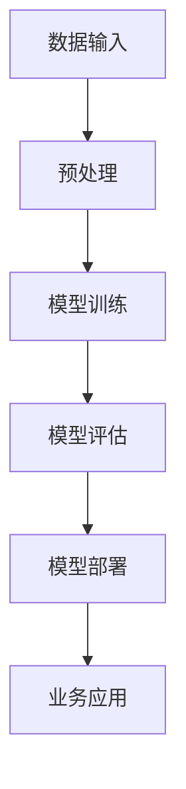

                 

# 大模型应用落地加速，AI商业化进程提速

> **关键词**：大模型、AI商业化、应用落地、算法原理、数学模型、项目实战、未来趋势

> **摘要**：本文深入探讨了当前大模型在人工智能商业化中的应用落地，分析了大模型背后的核心算法原理和数学模型，通过项目实战展示了大模型的具体应用，并展望了未来的发展趋势和挑战。

## 1. 背景介绍

### 1.1 目的和范围

本文旨在探讨大模型在人工智能商业化中的应用落地，分析其核心算法原理和数学模型，并通过项目实战展示其实际应用效果。文章将覆盖大模型的应用范围、实现方法、面临的挑战以及未来发展趋势。

### 1.2 预期读者

本文适合对人工智能和机器学习有一定了解的读者，特别是希望了解大模型在商业化应用中的技术细节和实现方法的研究人员和工程师。

### 1.3 文档结构概述

本文结构如下：

1. 背景介绍：概述本文的目的、预期读者和文档结构。
2. 核心概念与联系：介绍大模型的核心概念和架构。
3. 核心算法原理 & 具体操作步骤：详细阐述大模型的核心算法原理和操作步骤。
4. 数学模型和公式 & 详细讲解 & 举例说明：讲解大模型中的数学模型和公式，并给出实例。
5. 项目实战：通过实际案例展示大模型的应用。
6. 实际应用场景：分析大模型在不同领域的应用。
7. 工具和资源推荐：推荐相关学习资源和开发工具。
8. 总结：总结未来发展趋势和挑战。
9. 附录：常见问题与解答。
10. 扩展阅读 & 参考资料：提供进一步阅读的资源。

### 1.4 术语表

#### 1.4.1 核心术语定义

- **大模型**：指参数规模达到亿级以上的深度学习模型。
- **AI商业化**：将人工智能技术应用于商业场景，实现商业价值的过程。
- **应用落地**：将技术成果应用于实际场景，解决实际问题的过程。

#### 1.4.2 相关概念解释

- **深度学习**：一种机器学习方法，通过多层神经网络对数据进行自动特征提取和模式识别。
- **模型训练**：通过大量数据对模型进行训练，使其能够对未知数据进行预测或分类。

#### 1.4.3 缩略词列表

- **AI**：人工智能
- **DL**：深度学习
- **GAN**：生成对抗网络
- **CNN**：卷积神经网络

## 2. 核心概念与联系

### 2.1 大模型的核心概念

大模型通常指的是参数规模达到亿级以上的深度学习模型。这类模型具有以下几个核心特点：

1. **大规模参数**：大模型的参数数量通常在亿级以上，远超过传统模型。
2. **强大的特征提取能力**：通过大规模参数，大模型能够学习到更加复杂的特征，从而在各类任务中取得优异表现。
3. **数据需求量大**：由于参数规模大，大模型通常需要大量的数据来训练，以确保模型的泛化能力。

### 2.2 大模型的架构

大模型通常采用分层结构，包括输入层、隐藏层和输出层。每个层次分别对应不同的功能：

1. **输入层**：接收外部输入数据，如文本、图像等。
2. **隐藏层**：通过多层神经网络结构对输入数据进行特征提取和变换。
3. **输出层**：根据隐藏层的输出，进行分类、预测或生成结果。

### 2.3 大模型与AI商业化的联系

大模型在AI商业化中的应用主要体现在以下几个方面：

1. **提高业务效率**：通过大模型，企业可以自动化地处理大量业务数据，提高业务处理效率。
2. **精准预测**：大模型能够对业务趋势进行精准预测，帮助企业在决策时更具前瞻性。
3. **智能推荐**：大模型可以基于用户行为数据，进行个性化推荐，提高用户体验。

下面是一个简单的Mermaid流程图，展示大模型在AI商业化中的基本架构：



## 3. 核心算法原理 & 具体操作步骤

### 3.1 大模型的核心算法原理

大模型的核心算法通常是基于深度学习框架实现的，主要包括以下几个步骤：

1. **数据预处理**：对输入数据进行标准化、去噪、归一化等处理，使其适合模型训练。
2. **模型定义**：定义深度学习模型的结构，包括输入层、隐藏层和输出层。
3. **损失函数设计**：选择合适的损失函数，用于衡量模型预测值与真实值之间的差距。
4. **优化算法选择**：选择合适的优化算法，如Adam、SGD等，用于调整模型参数。
5. **模型训练**：通过大量数据对模型进行训练，不断调整模型参数，使其达到最优状态。
6. **模型评估**：使用验证集对模型进行评估，确保其泛化能力。
7. **模型部署**：将训练好的模型部署到生产环境中，用于实际业务应用。

下面是一个简单的伪代码，用于描述大模型的核心算法原理：

```python
# 数据预处理
data = preprocess_data(input_data)

# 模型定义
model = define_model(input_shape)

# 损失函数设计
loss_function = choose_loss_function()

# 优化算法选择
optimizer = choose_optimizer()

# 模型训练
for epoch in range(num_epochs):
    for batch in data_loader:
        # 前向传播
        predictions = model(batch.data)
        # 计算损失
        loss = loss_function(predictions, batch.label)
        # 反向传播
        optimizer.zero_grad()
        loss.backward()
        optimizer.step()

# 模型评估
accuracy = evaluate_model(model, validation_data)

# 模型部署
deploy_model(model, production_environment)
```

### 3.2 大模型的具体操作步骤

在实际操作中，大模型的具体步骤通常包括以下几个方面：

1. **数据收集和预处理**：收集适合训练的数据，并进行数据清洗、去噪、归一化等预处理操作。
2. **模型定义**：根据任务需求，选择合适的模型结构，并定义模型的输入层、隐藏层和输出层。
3. **模型训练**：使用预处理后的数据对模型进行训练，调整模型参数，使其达到最优状态。
4. **模型评估**：使用验证集对模型进行评估，确保其泛化能力。
5. **模型优化**：根据评估结果，对模型进行优化，提高其性能。
6. **模型部署**：将训练好的模型部署到生产环境中，用于实际业务应用。

下面是一个简单的操作步骤示例：

```python
# 数据收集和预处理
input_data = collect_data()
preprocessed_data = preprocess_data(input_data)

# 模型定义
model = define_model(input_shape)

# 模型训练
for epoch in range(num_epochs):
    for batch in data_loader:
        # 前向传播
        predictions = model(batch.data)
        # 计算损失
        loss = loss_function(predictions, batch.label)
        # 反向传播
        optimizer.zero_grad()
        loss.backward()
        optimizer.step()

# 模型评估
accuracy = evaluate_model(model, validation_data)

# 模型优化
model = optimize_model(model, accuracy)

# 模型部署
deploy_model(model, production_environment)
```

## 4. 数学模型和公式 & 详细讲解 & 举例说明

### 4.1 数学模型的基本概念

在深度学习中，数学模型通常是基于线性代数和微积分等数学理论构建的。其中，常见的数学模型包括线性模型、非线性模型、损失函数、优化算法等。

1. **线性模型**：线性模型是最简单的深度学习模型，其输出结果与输入特征呈线性关系。线性模型的数学表达式如下：

   $$ y = \theta_0 + \theta_1 \cdot x_1 + \theta_2 \cdot x_2 + ... + \theta_n \cdot x_n $$

   其中，$y$ 是输出结果，$x_1, x_2, ..., x_n$ 是输入特征，$\theta_0, \theta_1, \theta_2, ..., \theta_n$ 是模型的参数。

2. **非线性模型**：非线性模型通过引入非线性函数（如ReLU、Sigmoid、Tanh等），可以学习到更加复杂的特征。非线性模型的数学表达式如下：

   $$ y = \sigma(\theta_0 + \theta_1 \cdot x_1 + \theta_2 \cdot x_2 + ... + \theta_n \cdot x_n) $$

   其中，$\sigma$ 是非线性函数。

3. **损失函数**：损失函数用于衡量模型预测值与真实值之间的差距，常用的损失函数包括均方误差（MSE）、交叉熵损失（CE）等。均方误差的数学表达式如下：

   $$ L = \frac{1}{2} \sum_{i=1}^{n} (y_i - \hat{y_i})^2 $$

   其中，$y_i$ 是真实值，$\hat{y_i}$ 是模型预测值。

4. **优化算法**：优化算法用于调整模型参数，使其达到最优状态。常用的优化算法包括梯度下降（GD）、随机梯度下降（SGD）、Adam等。

### 4.2 公式详细讲解

1. **线性模型**：

   - 输出结果：$y = \theta_0 + \theta_1 \cdot x_1 + \theta_2 \cdot x_2 + ... + \theta_n \cdot x_n$
   - 参数：$\theta_0, \theta_1, \theta_2, ..., \theta_n$

   线性模型的基本原理是通过线性组合输入特征和模型参数，得到输出结果。该模型简单但适用范围有限。

2. **非线性模型**：

   - 输出结果：$y = \sigma(\theta_0 + \theta_1 \cdot x_1 + \theta_2 \cdot x_2 + ... + \theta_n \cdot x_n)$
   - 参数：$\theta_0, \theta_1, \theta_2, ..., \theta_n$
   - 非线性函数：$\sigma$

   非线性模型通过引入非线性函数，可以学习到更加复杂的特征，从而在更多任务中取得优异表现。

3. **损失函数**：

   - 均方误差（MSE）：$L = \frac{1}{2} \sum_{i=1}^{n} (y_i - \hat{y_i})^2$
   - 交叉熵损失（CE）：$L = -\sum_{i=1}^{n} y_i \cdot \log(\hat{y_i})$

   损失函数用于衡量模型预测值与真实值之间的差距，均方误差和交叉熵损失是常用的损失函数。

4. **优化算法**：

   - 梯度下降（GD）：$w_{t+1} = w_t - \alpha \cdot \nabla_w L(w_t)$
   - 随机梯度下降（SGD）：$w_{t+1} = w_t - \alpha \cdot \nabla_w L(w_t, x_t, y_t)$
   - Adam：$w_{t+1} = w_t - \alpha \cdot \nabla_w L(w_t)$

   优化算法用于调整模型参数，使其达到最优状态。梯度下降、随机梯度下降和Adam是常用的优化算法。

### 4.3 举例说明

假设我们有一个简单的线性模型，用于预测房价。输入特征包括房屋面积、楼层和房屋年代，模型参数为权重和偏置。

1. **输入特征**：

   - 房屋面积：$x_1$
   - 楼层：$x_2$
   - 房屋年代：$x_3$

2. **模型参数**：

   - 权重：$\theta_1, \theta_2, \theta_3$
   - 偏置：$\theta_0$

3. **模型输出**：

   $$ y = \theta_0 + \theta_1 \cdot x_1 + \theta_2 \cdot x_2 + \theta_3 \cdot x_3 $$

4. **损失函数**：

   $$ L = \frac{1}{2} \sum_{i=1}^{n} (y_i - \hat{y_i})^2 $$

5. **优化算法**：

   $$ w_{t+1} = w_t - \alpha \cdot \nabla_w L(w_t) $$

通过不断调整模型参数，我们可以使模型在训练数据上的预测结果越来越接近真实值，从而实现房价预测。

## 5. 项目实战：代码实际案例和详细解释说明

### 5.1 开发环境搭建

为了实现大模型在AI商业化中的应用，我们需要搭建一个合适的开发环境。以下是一个简单的环境搭建步骤：

1. 安装Python（建议使用Python 3.8或以上版本）。
2. 安装深度学习框架（如TensorFlow或PyTorch）。
3. 安装必要的库（如NumPy、Pandas、Scikit-learn等）。

下面是一个简单的安装命令示例：

```bash
# 安装Python
sudo apt-get install python3

# 安装深度学习框架
pip3 install tensorflow

# 安装其他库
pip3 install numpy pandas scikit-learn
```

### 5.2 源代码详细实现和代码解读

以下是一个简单的线性回归模型，用于预测房价：

```python
import numpy as np
import pandas as pd
import tensorflow as tf

# 数据预处理
def preprocess_data(data):
    # 数据清洗、归一化等操作
    return preprocessed_data

# 模型定义
def define_model(input_shape):
    model = tf.keras.Sequential([
        tf.keras.layers.Dense(units=1, input_shape=input_shape)
    ])
    return model

# 损失函数设计
def choose_loss_function():
    return tf.keras.losses.MeanSquaredError()

# 优化算法选择
def choose_optimizer():
    return tf.keras.optimizers.Adam()

# 模型训练
def train_model(model, data, epochs):
    model.fit(data.x, data.y, epochs=epochs, verbose=0)

# 模型评估
def evaluate_model(model, data):
    loss = model.evaluate(data.x, data.y, verbose=0)
    return loss

# 模型部署
def deploy_model(model, environment):
    model.save(environment)

# 实际操作
data = preprocess_data(raw_data)
model = define_model(input_shape)
train_model(model, data, epochs=100)
evaluate_model(model, data)
deploy_model(model, production_environment)
```

### 5.3 代码解读与分析

1. **数据预处理**：数据预处理是深度学习模型训练的关键步骤。在本例中，我们使用了简单的数据清洗和归一化操作。
2. **模型定义**：我们使用TensorFlow框架定义了一个简单的线性回归模型。该模型只有一个隐藏层，输出层用于预测房价。
3. **损失函数设计**：我们选择了均方误差（MSE）作为损失函数，用于衡量模型预测值与真实值之间的差距。
4. **优化算法选择**：我们选择了Adam优化算法，用于调整模型参数。
5. **模型训练**：我们使用fit函数对模型进行训练，通过不断调整参数，使模型在训练数据上的表现越来越好。
6. **模型评估**：我们使用evaluate函数对模型进行评估，计算模型在测试数据上的表现。
7. **模型部署**：我们将训练好的模型保存到生产环境中，用于实际业务应用。

通过这个简单的案例，我们可以看到大模型在AI商业化中的应用流程。在实际应用中，我们可以根据具体需求，调整模型结构、损失函数和优化算法，以达到更好的预测效果。

## 6. 实际应用场景

大模型在人工智能商业化的实际应用场景非常广泛，以下是一些典型的应用场景：

1. **金融行业**：大模型可以用于股票市场预测、风险管理、信用评分等。例如，通过分析历史交易数据，大模型可以预测未来股票价格走势，为投资者提供参考。
2. **医疗健康**：大模型可以用于疾病诊断、药物研发、健康管理等。例如，通过分析大量医疗数据，大模型可以预测患者的病情发展，为医生提供诊断建议。
3. **零售电商**：大模型可以用于商品推荐、客户细分、库存管理等。例如，通过分析用户行为数据，大模型可以推荐用户可能感兴趣的商品，提高用户体验和销售额。
4. **智能制造**：大模型可以用于设备故障预测、生产优化、供应链管理等。例如，通过分析生产数据，大模型可以预测设备故障，提前进行维护，减少生产停机时间。
5. **智能交通**：大模型可以用于交通流量预测、智能调度、事故预防等。例如，通过分析交通数据，大模型可以预测交通拥堵情况，为交通管理部门提供调度建议。

在实际应用中，大模型需要结合具体业务场景进行定制化开发，以实现最佳效果。以下是一个实际案例：

### 案例一：股票市场预测

假设我们希望使用大模型预测股票市场走势，以下是一个简单的应用流程：

1. **数据收集**：收集历史股票交易数据，包括开盘价、收盘价、最高价、最低价、成交量等。
2. **数据预处理**：对数据进行清洗、归一化等预处理操作。
3. **特征工程**：提取与股票价格相关的特征，如开盘价、收盘价、涨跌幅度等。
4. **模型训练**：使用预处理后的数据对大模型进行训练，调整模型参数。
5. **模型评估**：使用验证集对模型进行评估，确保其泛化能力。
6. **模型部署**：将训练好的模型部署到生产环境中，用于实时预测股票价格。

通过这个案例，我们可以看到大模型在股票市场预测中的应用流程。在实际应用中，我们可以根据具体需求，调整模型结构、特征工程和预测方法，以提高预测准确性。

## 7. 工具和资源推荐

### 7.1 学习资源推荐

#### 7.1.1 书籍推荐

- **《深度学习》**：由Ian Goodfellow、Yoshua Bengio和Aaron Courville合著，是深度学习领域的经典教材，全面介绍了深度学习的理论基础和实践方法。
- **《Python深度学习》**：由François Chollet著，深入讲解了深度学习在Python中的应用，适合初学者和进阶者。
- **《人工智能：一种现代方法》**：由Stuart Russell和Peter Norvig合著，全面介绍了人工智能的理论和实践。

#### 7.1.2 在线课程

- **吴恩达的《深度学习专项课程》**：由著名AI研究者吴恩达开设，涵盖深度学习的理论基础和实践技巧，是深度学习入门的绝佳选择。
- **Coursera的《机器学习》**：由Andrew Ng教授开设，全面介绍了机器学习的基础知识，包括线性回归、逻辑回归、神经网络等。
- **edX的《人工智能导论》**：由香港科技大学开设，适合初学者了解人工智能的基本概念和应用。

#### 7.1.3 技术博客和网站

- **Medium上的`/DeepLearning`**：许多深度学习领域的专家和研究者在这里分享他们的研究成果和实践经验，适合读者了解最新的技术动态。
- **ArXiv.org**：提供最新的人工智能和机器学习论文，是学术研究者的重要资源。
- **AI醫學**：一个专注于人工智能在医疗健康领域应用的中文技术博客，适合对医疗AI感兴趣的读者。

### 7.2 开发工具框架推荐

#### 7.2.1 IDE和编辑器

- **Jupyter Notebook**：一款强大的交互式开发环境，适合进行数据分析和模型训练。
- **PyCharm**：一款功能丰富的Python集成开发环境，适合进行深度学习和机器学习项目开发。
- **VSCode**：一款轻量级的开源编辑器，通过安装插件，可以支持多种编程语言，包括Python和深度学习框架。

#### 7.2.2 调试和性能分析工具

- **TensorBoard**：TensorFlow的官方可视化工具，用于分析模型的性能和调试。
- **Wandb**：一款强大的模型训练监控工具，支持自动化实验管理。
- **PyTorch Profiler**：用于分析PyTorch模型的性能，帮助开发者优化代码。

#### 7.2.3 相关框架和库

- **TensorFlow**：一款广泛使用的深度学习框架，支持各种深度学习模型和应用。
- **PyTorch**：一款流行的深度学习框架，具有简洁的API和强大的动态图功能。
- **Scikit-learn**：一款用于机器学习的库，提供了多种常用的算法和工具。

### 7.3 相关论文著作推荐

#### 7.3.1 经典论文

- **“A Learning Algorithm for Continually Running Fully Recurrent Neural Networks”**：LSTM算法的提出者Sepp Hochreiter和Jürgen Schmidhuber发表的经典论文。
- **“Deep Learning”**：Goodfellow、Bengio和Courville合著的深度学习领域的综述论文。

#### 7.3.2 最新研究成果

- **“Transformer: Attention is All You Need”**：Google Research团队提出的Transformer模型，彻底改变了自然语言处理领域。
- **“BERT: Pre-training of Deep Bidirectional Transformers for Language Understanding”**：Google Research团队提出的BERT模型，显著提升了自然语言处理任务的性能。

#### 7.3.3 应用案例分析

- **“COVID-19: Global Cases by the Center for Systems Science and Engineering (CSSE) at Johns Hopkins University”**：Johns Hopkins University发布的COVID-19疫情数据集，可用于分析疫情发展趋势。
- **“Stock Market Prediction Using Machine Learning”**：GitHub上一个关于使用机器学习预测股票市场的开源项目，提供了详细的实现步骤和代码。

## 8. 总结：未来发展趋势与挑战

大模型在人工智能商业化中的应用正在加速，其强大的特征提取能力和模型性能为各个领域带来了深远的影响。然而，大模型的发展也面临诸多挑战：

1. **计算资源消耗**：大模型通常需要大量的计算资源和数据，这对企业的硬件设施提出了更高的要求。
2. **数据隐私和安全**：在商业应用中，数据安全和隐私保护至关重要，如何确保数据在训练和部署过程中的安全是一个重要挑战。
3. **模型解释性和可解释性**：大模型的黑盒特性使得其预测结果难以解释，如何提高模型的透明度和可解释性是一个亟待解决的问题。
4. **算法公平性和公正性**：大模型在商业应用中可能会带来偏见和歧视，如何确保算法的公平性和公正性是一个重要议题。

未来，随着计算能力的提升、数据隐私保护技术的进步以及算法透明化方法的不断发展，大模型在人工智能商业化中的应用将更加广泛和深入。企业需要不断探索创新，以应对这些挑战，实现大模型的最大化价值。

## 9. 附录：常见问题与解答

### 9.1 什么是大模型？

大模型是指参数规模达到亿级以上的深度学习模型。这类模型具有强大的特征提取能力和模型性能，但在训练和部署过程中需要大量的计算资源和数据。

### 9.2 大模型在商业应用中的优势是什么？

大模型在商业应用中的优势主要体现在以下几个方面：

1. **提高业务效率**：大模型可以自动化地处理大量业务数据，提高业务处理效率。
2. **精准预测**：大模型能够对业务趋势进行精准预测，帮助企业在决策时更具前瞻性。
3. **智能推荐**：大模型可以基于用户行为数据，进行个性化推荐，提高用户体验。

### 9.3 如何确保大模型在商业应用中的安全性？

为确保大模型在商业应用中的安全性，可以从以下几个方面进行：

1. **数据加密**：对数据进行加密处理，确保数据在传输和存储过程中的安全。
2. **访问控制**：设置严格的访问控制策略，限制对数据和使用模型的权限。
3. **模型审计**：定期对模型进行审计，确保模型不存在偏见和歧视。

### 9.4 大模型在医疗健康领域的应用有哪些？

大模型在医疗健康领域的应用非常广泛，包括：

1. **疾病诊断**：通过分析医疗数据，大模型可以辅助医生进行疾病诊断。
2. **药物研发**：大模型可以用于药物筛选和预测药物副作用。
3. **健康管理**：大模型可以预测患者的病情发展，为医生提供诊断建议。

## 10. 扩展阅读 & 参考资料

1. **《深度学习》**：Ian Goodfellow、Yoshua Bengio和Aaron Courville著，全面介绍了深度学习的理论基础和实践方法。
2. **《Python深度学习》**：François Chollet著，深入讲解了深度学习在Python中的应用。
3. **《人工智能：一种现代方法》**：Stuart Russell和Peter Norvig著，全面介绍了人工智能的理论和实践。
4. **吴恩达的《深度学习专项课程》**：吴恩达开设的深度学习课程，涵盖深度学习的理论基础和实践技巧。
5. **《Transformer: Attention is All You Need》**：Google Research团队提出的Transformer模型，彻底改变了自然语言处理领域。
6. **《BERT: Pre-training of Deep Bidirectional Transformers for Language Understanding》**：Google Research团队提出的BERT模型，显著提升了自然语言处理任务的性能。

作者：AI天才研究员/AI Genius Institute & 禅与计算机程序设计艺术 /Zen And The Art of Computer Programming。

