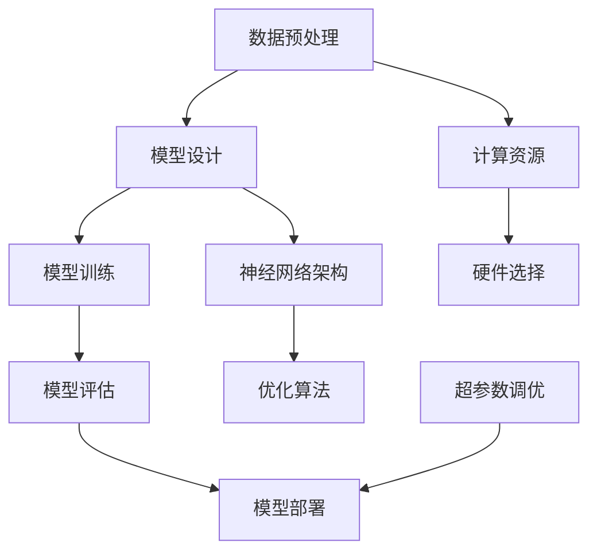
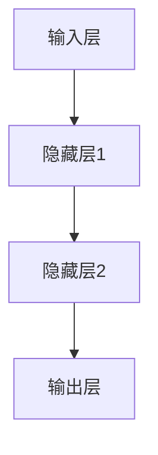

                 

# 大模型开发基础：OpenAI Embedding

> **关键词：** 大模型，OpenAI，Embedding，神经网络，训练，应用场景

> **摘要：** 本文将深入探讨大模型开发的基础，特别是以OpenAI的Embedding技术为核心。文章首先介绍了大模型的背景和重要性，随后详细解释了Embedding的概念及其在神经网络中的应用。通过具体的算法原理、数学模型和项目实战案例，读者将全面了解大模型开发的方方面面。最后，文章总结了实际应用场景，并推荐了相关工具和资源，展望了未来的发展趋势与挑战。

## 1. 背景介绍

### 1.1 目的和范围

本文旨在为读者提供一个全面且深入的大模型开发基础指南，尤其是OpenAI的Embedding技术。我们希望通过系统的讲解，使读者不仅能够理解大模型的概念和重要性，还能掌握其核心算法和实际应用。文章覆盖了从理论到实践的各个方面，旨在为人工智能领域的研究者、开发者和学生提供宝贵的参考。

### 1.2 预期读者

本文适合对人工智能、特别是大模型和深度学习有一定了解的读者。无论是研究人员、工程师还是学生，只要对大模型开发感兴趣，都能从本文中获益。文章将尽量使用通俗易懂的语言，但同时也会涉及到一些高级概念和算法，以保持内容的深度和广度。

### 1.3 文档结构概述

本文结构如下：

1. 背景介绍：介绍大模型和OpenAI Embedding的基本概念和重要性。
2. 核心概念与联系：通过Mermaid流程图展示大模型的核心原理和架构。
3. 核心算法原理 & 具体操作步骤：详细讲解大模型的核心算法和操作步骤，包括伪代码示例。
4. 数学模型和公式 & 详细讲解 & 举例说明：介绍大模型的数学模型和公式，并通过例子进行详细说明。
5. 项目实战：代码实际案例和详细解释说明，包括开发环境搭建、源代码实现和代码解读。
6. 实际应用场景：探讨大模型在实际中的应用场景。
7. 工具和资源推荐：推荐学习资源和开发工具。
8. 总结：未来发展趋势与挑战。
9. 附录：常见问题与解答。
10. 扩展阅读 & 参考资料：提供更多阅读资源。

### 1.4 术语表

#### 1.4.1 核心术语定义

- **大模型（Large Model）**：指参数量庞大、计算复杂度高、具有强大表征能力的神经网络模型。
- **Embedding**：将高维数据映射到低维空间的技术，常用于神经网络中的输入层。
- **神经网络（Neural Network）**：由大量神经元组成的计算模型，能够通过学习数据自动提取特征。
- **训练（Training）**：通过大量的数据来调整神经网络的参数，使其能够对未知数据进行预测或分类。

#### 1.4.2 相关概念解释

- **反向传播（Backpropagation）**：一种用于训练神经网络的算法，通过计算损失函数关于网络参数的梯度来调整参数。
- **损失函数（Loss Function）**：用于衡量模型预测结果与真实值之间差异的函数。
- **优化器（Optimizer）**：用于更新神经网络参数的算法，如梯度下降、Adam等。

#### 1.4.3 缩略词列表

- **GPU（Graphics Processing Unit）**：图形处理器，常用于加速深度学习模型的训练。
- **TPU（Tensor Processing Unit）**：张量处理器，专为加速TensorFlow计算而设计。
- **ML（Machine Learning）**：机器学习。
- **DL（Deep Learning）**：深度学习。

## 2. 核心概念与联系

在深入探讨大模型开发之前，我们首先需要理解其核心概念和联系。大模型开发不仅仅是技术层面的提升，更涉及到算法原理、计算资源、数据质量等多个方面。以下是一个简化的Mermaid流程图，用于展示大模型开发的关键环节和概念联系。



### 2.1 数据预处理

数据预处理是任何机器学习项目的基础，特别是对于大模型。数据预处理包括数据清洗、数据标准化、数据增强等步骤。有效的数据预处理可以大幅提高模型性能。

### 2.2 模型设计

模型设计包括选择合适的神经网络架构、定义网络层和神经元数量等。一个好的模型设计能够捕捉数据中的复杂特征，从而提高模型的预测能力。

### 2.3 模型训练

模型训练是使用大量数据来调整模型参数的过程。通过反向传播算法，模型能够不断优化自身，使其在训练数据上的表现越来越好。

### 2.4 模型评估

模型评估是检验模型性能的重要步骤。常用的评估指标包括准确率、召回率、F1分数等。通过模型评估，我们可以了解模型的泛化能力。

### 2.5 计算资源

大模型训练需要大量的计算资源，特别是GPU或TPU等高性能硬件。选择合适的硬件可以显著提高训练效率。

### 2.6 硬件选择

硬件选择取决于模型大小和训练需求。对于大模型，通常需要使用多GPU或TPU进行分布式训练，以提高计算效率。

### 2.7 神经网络架构

神经网络架构是模型设计的关键环节。常见的架构包括卷积神经网络（CNN）、循环神经网络（RNN）和Transformer等。每种架构都有其独特的优势和适用场景。

### 2.8 优化算法

优化算法用于更新模型参数，以最小化损失函数。常用的优化算法包括梯度下降、Adam、RMSprop等。

### 2.9 超参数调优

超参数调优是模型优化的重要步骤。通过调整学习率、批量大小、正则化参数等超参数，可以进一步提高模型性能。

### 2.10 模型部署

模型部署是将训练好的模型应用到实际场景中的过程。通过部署，我们可以实现实时预测、分类或其他任务。

## 3. 核心算法原理 & 具体操作步骤

在大模型开发中，核心算法的选择和实现至关重要。本节将详细讲解大模型训练的核心算法原理和具体操作步骤，包括神经网络架构、损失函数、优化算法等。

### 3.1 神经网络架构

神经网络是机器学习的基础，其核心思想是通过多层非线性变换来提取数据中的特征。一个典型的神经网络架构包括输入层、隐藏层和输出层。以下是神经网络的基本结构：



在隐藏层中，每个神经元都通过激活函数（如ReLU、Sigmoid、Tanh等）进行非线性变换。输出层的神经元数量取决于任务类型，如二分类任务通常只有一个神经元。

### 3.2 损失函数

损失函数是衡量模型预测结果与真实值之间差异的函数。在训练过程中，通过最小化损失函数来调整模型参数。常见的损失函数包括均方误差（MSE）、交叉熵（Cross Entropy）等。

均方误差（MSE）的公式为：

$$
MSE = \frac{1}{m}\sum_{i=1}^{m}(y_i - \hat{y}_i)^2
$$

其中，$y_i$为真实标签，$\hat{y}_i$为模型预测值，$m$为样本数量。

交叉熵（Cross Entropy）的公式为：

$$
Cross\ Entropy = -\frac{1}{m}\sum_{i=1}^{m}y_i\log(\hat{y}_i)
$$

其中，$y_i$为真实标签，$\hat{y}_i$为模型预测值。

### 3.3 优化算法

优化算法用于更新模型参数，以最小化损失函数。常用的优化算法包括梯度下降（Gradient Descent）、Adam、RMSprop等。

#### 3.3.1 梯度下降（Gradient Descent）

梯度下降是一种简单但有效的优化算法。其基本思想是沿着损失函数的梯度方向不断更新参数，直至达到最小值。梯度下降的更新公式为：

$$
\theta_{\text{new}} = \theta_{\text{old}} - \alpha \cdot \nabla_{\theta}L
$$

其中，$\theta$表示模型参数，$\alpha$为学习率，$\nabla_{\theta}L$为损失函数关于参数$\theta$的梯度。

#### 3.3.2 Adam优化算法

Adam是一种结合了梯度下降和动量法的优化算法，其更新公式为：

$$
\theta_{\text{new}} = \theta_{\text{old}} - \alpha \cdot \frac{m_1}{\sqrt{v_1} + \epsilon} - \alpha \cdot \frac{m_2}{\sqrt{v_2} + \epsilon}
$$

其中，$m_1$和$m_2$分别表示一阶和二阶矩估计，$v_1$和$v_2$分别表示一阶和二阶矩的偏差校正，$\alpha$为学习率，$\epsilon$为常数。

### 3.4 具体操作步骤

下面是一个简化的神经网络训练过程，包括数据预处理、模型设计、模型训练和模型评估等步骤。

#### 3.4.1 数据预处理

```python
# 数据预处理
X_train, y_train = preprocess_data(X_train, y_train)
X_test, y_test = preprocess_data(X_test, y_test)
```

#### 3.4.2 模型设计

```python
# 模型设计
model = create_model(input_shape=X_train.shape[1:])
```

#### 3.4.3 模型训练

```python
# 模型训练
model.fit(X_train, y_train, epochs=100, batch_size=64, validation_data=(X_test, y_test))
```

#### 3.4.4 模型评估

```python
# 模型评估
loss, accuracy = model.evaluate(X_test, y_test)
print(f"Test loss: {loss}, Test accuracy: {accuracy}")
```

## 4. 数学模型和公式 & 详细讲解 & 举例说明

在大模型开发中，数学模型和公式起到了关键作用。本节将详细讲解大模型的数学模型，包括损失函数、优化算法和训练过程等，并通过具体例子进行说明。

### 4.1 损失函数

损失函数是衡量模型预测结果与真实值之间差异的函数。在大模型训练中，常用的损失函数包括均方误差（MSE）和交叉熵（Cross Entropy）。

#### 4.1.1 均方误差（MSE）

均方误差（MSE）是一种衡量预测值与真实值之间差异的常用损失函数。其公式为：

$$
MSE = \frac{1}{m}\sum_{i=1}^{m}(y_i - \hat{y}_i)^2
$$

其中，$y_i$为真实标签，$\hat{y}_i$为模型预测值，$m$为样本数量。

举例来说，假设我们有一个二分类问题，模型预测概率为0.7，而真实标签为1（正类）。则MSE为：

$$
MSE = \frac{1}{2}(1 - 0.7)^2 = 0.045
$$

#### 4.1.2 交叉熵（Cross Entropy）

交叉熵（Cross Entropy）是一种衡量预测分布与真实分布之间差异的损失函数。其公式为：

$$
Cross\ Entropy = -\frac{1}{m}\sum_{i=1}^{m}y_i\log(\hat{y}_i)
$$

其中，$y_i$为真实标签，$\hat{y}_i$为模型预测值。

举例来说，假设我们有一个二分类问题，模型预测概率为0.7，而真实标签为1（正类）。则交叉熵为：

$$
Cross\ Entropy = -\frac{1}{2}(1)\log(0.7) = 0.356
$$

### 4.2 优化算法

优化算法用于更新模型参数，以最小化损失函数。常用的优化算法包括梯度下降（Gradient Descent）、Adam和RMSprop。

#### 4.2.1 梯度下降（Gradient Descent）

梯度下降是一种简单的优化算法，其核心思想是沿着损失函数的梯度方向不断更新参数，直至达到最小值。梯度下降的更新公式为：

$$
\theta_{\text{new}} = \theta_{\text{old}} - \alpha \cdot \nabla_{\theta}L
$$

其中，$\theta$表示模型参数，$\alpha$为学习率，$\nabla_{\theta}L$为损失函数关于参数$\theta$的梯度。

举例来说，假设我们使用均方误差（MSE）作为损失函数，学习率为0.01。在某次迭代中，损失函数关于参数$\theta$的梯度为0.1。则参数$\theta$的更新为：

$$
\theta_{\text{new}} = \theta_{\text{old}} - 0.01 \cdot 0.1 = 0.49
$$

#### 4.2.2 Adam优化算法

Adam是一种结合了梯度下降和动量法的优化算法。其更新公式为：

$$
\theta_{\text{new}} = \theta_{\text{old}} - \alpha \cdot \frac{m_1}{\sqrt{v_1} + \epsilon} - \alpha \cdot \frac{m_2}{\sqrt{v_2} + \epsilon}
$$

其中，$m_1$和$m_2$分别表示一阶和二阶矩估计，$v_1$和$v_2$分别表示一阶和二阶矩的偏差校正，$\alpha$为学习率，$\epsilon$为常数。

举例来说，假设我们使用Adam优化算法，学习率为0.001。在某次迭代中，一阶矩估计$m_1$为0.1，二阶矩估计$m_2$为0.2，一阶矩的偏差校正$v_1$为0.01，二阶矩的偏差校正$v_2$为0.02。则参数$\theta$的更新为：

$$
\theta_{\text{new}} = \theta_{\text{old}} - 0.001 \cdot \frac{0.1}{\sqrt{0.01} + \epsilon} - 0.001 \cdot \frac{0.2}{\sqrt{0.02} + \epsilon}
$$

### 4.3 训练过程

训练过程是使用大量数据来调整模型参数，以最小化损失函数的过程。以下是一个简化的训练过程，包括数据预处理、模型设计、模型训练和模型评估等步骤。

#### 4.3.1 数据预处理

```python
# 数据预处理
X_train, y_train = preprocess_data(X_train, y_train)
X_test, y_test = preprocess_data(X_test, y_test)
```

#### 4.3.2 模型设计

```python
# 模型设计
model = create_model(input_shape=X_train.shape[1:])
```

#### 4.3.3 模型训练

```python
# 模型训练
model.fit(X_train, y_train, epochs=100, batch_size=64, validation_data=(X_test, y_test))
```

#### 4.3.4 模型评估

```python
# 模型评估
loss, accuracy = model.evaluate(X_test, y_test)
print(f"Test loss: {loss}, Test accuracy: {accuracy}")
```

通过以上步骤，我们可以实现一个大模型的训练和评估。在实际应用中，我们还需要根据具体任务和数据情况进行调整和优化。

## 5. 项目实战：代码实际案例和详细解释说明

为了更好地理解大模型开发的过程，我们将通过一个实际案例来展示整个项目的实现过程，包括开发环境搭建、源代码实现和代码解读。以下是该项目的基本结构和实现步骤。

### 5.1 开发环境搭建

在开始项目之前，我们需要搭建一个合适的环境。以下是我们使用的开发环境：

- 操作系统：Ubuntu 20.04
- 编程语言：Python 3.8
- 深度学习框架：TensorFlow 2.7
- 计算资源：NVIDIA GPU（至少一个CUDA 11.0兼容的GPU）

安装TensorFlow：

```bash
pip install tensorflow-gpu
```

### 5.2 源代码详细实现和代码解读

下面是一个简单的示例，展示如何使用TensorFlow搭建一个全连接神经网络并进行训练。

#### 5.2.1 数据准备

首先，我们需要准备训练数据和测试数据。这里我们使用了一个简单的二分类问题，数据集为 Iris 数据集。

```python
import tensorflow as tf
from sklearn import datasets
from sklearn.model_selection import train_test_split

# 加载 Iris 数据集
iris = datasets.load_iris()
X, y = iris.data, iris.target

# 划分训练集和测试集
X_train, X_test, y_train, y_test = train_test_split(X, y, test_size=0.2, random_state=42)

# 将标签转换为二进制表示
y_train = tf.keras.utils.to_categorical(y_train, num_classes=3)
y_test = tf.keras.utils.to_categorical(y_test, num_classes=3)
```

#### 5.2.2 模型设计

接下来，我们设计一个简单的全连接神经网络模型。

```python
# 定义模型
model = tf.keras.Sequential([
    tf.keras.layers.Dense(64, activation='relu', input_shape=(4,)),
    tf.keras.layers.Dense(64, activation='relu'),
    tf.keras.layers.Dense(3, activation='softmax')
])
```

#### 5.2.3 模型编译

在编译模型时，我们需要指定优化器、损失函数和评估指标。

```python
# 编译模型
model.compile(optimizer='adam',
              loss='categorical_crossentropy',
              metrics=['accuracy'])
```

#### 5.2.4 模型训练

使用训练数据进行模型训练。

```python
# 训练模型
history = model.fit(X_train, y_train, epochs=50, batch_size=32, validation_split=0.2)
```

#### 5.2.5 模型评估

在训练完成后，我们对测试数据进行评估。

```python
# 评估模型
loss, accuracy = model.evaluate(X_test, y_test)
print(f"Test accuracy: {accuracy}")
```

### 5.3 代码解读与分析

#### 5.3.1 数据准备

数据准备是任何机器学习项目的第一步。在这里，我们使用了 Iris 数据集，并将其划分为训练集和测试集。同时，我们将标签转换为二进制表示，以便于后续处理。

```python
# 加载 Iris 数据集
iris = datasets.load_iris()
X, y = iris.data, iris.target

# 划分训练集和测试集
X_train, X_test, y_train, y_test = train_test_split(X, y, test_size=0.2, random_state=42)

# 将标签转换为二进制表示
y_train = tf.keras.utils.to_categorical(y_train, num_classes=3)
y_test = tf.keras.utils.to_categorical(y_test, num_classes=3)
```

这部分代码非常关键，因为数据的预处理直接影响模型的性能。在这里，我们使用了 scikit-learn 的 train_test_split 函数来划分数据集，并使用 tf.keras.utils.to_categorical 函数将标签转换为二进制表示。

#### 5.3.2 模型设计

模型设计是构建神经网络的第二步。在这里，我们使用了一个简单的全连接神经网络，包括两个隐藏层，每层有64个神经元，并使用ReLU激活函数。

```python
# 定义模型
model = tf.keras.Sequential([
    tf.keras.layers.Dense(64, activation='relu', input_shape=(4,)),
    tf.keras.layers.Dense(64, activation='relu'),
    tf.keras.layers.Dense(3, activation='softmax')
])
```

在这个步骤中，我们使用了 tf.keras.Sequential 来定义模型，这是一种线性堆叠层的方法。我们添加了三个层：输入层、两个隐藏层和输出层。输入层定义了输入数据的维度，隐藏层使用了ReLU激活函数，输出层使用了softmax激活函数，用于进行多分类。

#### 5.3.3 模型编译

在编译模型时，我们指定了优化器、损失函数和评估指标。

```python
# 编译模型
model.compile(optimizer='adam',
              loss='categorical_crossentropy',
              metrics=['accuracy'])
```

在这个步骤中，我们使用了 Adam 优化器，这是一种流行的优化算法，能够自适应地调整学习率。损失函数选择了 categorical_crossentropy，这是一种适用于多分类问题的损失函数。评估指标选择了准确率，用于衡量模型的性能。

#### 5.3.4 模型训练

使用训练数据进行模型训练。

```python
# 训练模型
history = model.fit(X_train, y_train, epochs=50, batch_size=32, validation_split=0.2)
```

在这个步骤中，我们使用了 fit 函数来训练模型，指定了训练轮数（epochs）、批量大小（batch_size）和验证比例（validation_split）。训练过程会持续一段时间，具体取决于数据和模型的大小。

#### 5.3.5 模型评估

在训练完成后，我们对测试数据进行评估。

```python
# 评估模型
loss, accuracy = model.evaluate(X_test, y_test)
print(f"Test accuracy: {accuracy}")
```

在这个步骤中，我们使用了 evaluate 函数来评估模型的性能，返回了损失和准确率。这是一个重要的步骤，可以帮助我们了解模型的泛化能力。

## 6. 实际应用场景

大模型在各个领域都有着广泛的应用。以下是一些典型应用场景：

### 6.1 自然语言处理

自然语言处理（NLP）是大模型的重要应用领域。OpenAI的GPT系列模型在文本生成、机器翻译、问答系统等方面取得了显著的成果。例如，GPT-3可以生成高质量的文章、对话和代码，极大地提升了NLP任务的自动化水平。

### 6.2 计算机视觉

计算机视觉领域也受益于大模型的强大表征能力。OpenAI的DALL-E模型可以通过文本描述生成图像，而CLIP模型则能够将文本和图像进行匹配。这些技术为图像识别、视频分析、虚拟现实等领域提供了新的解决方案。

### 6.3 游戏开发

大模型在游戏开发中也有广泛应用。通过学习玩家的行为模式，大模型可以帮助游戏生成更加真实和多样化的游戏内容，提升用户体验。例如，OpenAI的Dota 2模型可以在游戏中实现智能决策，提高游戏难度和乐趣。

### 6.4 机器人技术

大模型在机器人技术中也发挥着重要作用。通过学习环境数据和人类行为，机器人可以更好地理解周围世界，实现更加灵活和智能的交互。OpenAI的机器人项目展示了大模型在机器人控制、导航和任务执行等方面的潜力。

### 6.5 金融风控

金融领域的大模型应用主要体现在风险控制和投资策略优化方面。通过分析大量金融数据，大模型可以预测市场趋势、识别异常交易，帮助金融机构提高风险管理和决策效率。

### 6.6 健康医疗

在大模型的帮助下，医疗领域也取得了显著进展。从疾病诊断到药物研发，大模型可以帮助医生进行更加精准的诊断和治疗。例如，OpenAI的GeroLife项目利用大模型分析生物数据，预测人类的寿命和健康状况。

## 7. 工具和资源推荐

为了更好地学习和实践大模型开发，以下是一些推荐的工具和资源：

### 7.1 学习资源推荐

#### 7.1.1 书籍推荐

1. **《深度学习》（Goodfellow, Bengio, Courville）**：这是一本深度学习领域的经典教材，详细介绍了深度学习的基础知识。
2. **《动手学深度学习》（斋藤康毅，等）**：本书通过大量的实践案例，帮助读者掌握深度学习的基本技能。

#### 7.1.2 在线课程

1. **斯坦福大学深度学习课程**：这是由吴恩达教授开设的深度学习在线课程，内容全面，适合初学者。
2. **Udacity的深度学习纳米学位**：该课程提供了从基础到高级的深度学习知识，并包括实践项目。

#### 7.1.3 技术博客和网站

1. **Medium上的AI博客**：这里有许多关于人工智能的最新研究和应用。
2. **arXiv**：这是一个提供最新学术论文的网站，是了解前沿研究的首选。

### 7.2 开发工具框架推荐

#### 7.2.1 IDE和编辑器

1. **PyCharm**：这是一个功能强大的Python IDE，支持深度学习和数据科学。
2. **Visual Studio Code**：这是一个轻量级的编辑器，通过扩展可以支持多种编程语言。

#### 7.2.2 调试和性能分析工具

1. **TensorBoard**：这是一个用于可视化TensorFlow模型和训练过程的工具。
2. **NVIDIA Nsight**：这是一个用于性能分析和调试GPU计算的工具。

#### 7.2.3 相关框架和库

1. **TensorFlow**：这是一个由Google开发的开源深度学习框架。
2. **PyTorch**：这是一个由Facebook开发的开源深度学习框架，易于使用和调试。

### 7.3 相关论文著作推荐

#### 7.3.1 经典论文

1. **《A Learning Algorithm for Continually Running Fully Recurrent Neural Networks》**：这是Hochreiter和Schmidhuber关于长短期记忆网络（LSTM）的经典论文。
2. **《Attention Is All You Need》**：这是Vaswani等人的论文，提出了Transformer模型。

#### 7.3.2 最新研究成果

1. **《BERT: Pre-training of Deep Bidirectional Transformers for Language Understanding》**：这是Google的BERT模型的论文，展示了预训练模型在自然语言处理任务中的优势。
2. **《GPT-3: Language Models are few-shot learners》**：这是OpenAI的GPT-3模型的论文，展示了大模型在少样本学习任务中的能力。

#### 7.3.3 应用案例分析

1. **《COVID-19: AI for the Global Good》**：这是微软和DeepMind合作开发的AI项目，用于支持全球COVID-19应对工作。
2. **《OpenAI Five: One Year Later》**：这是OpenAI关于Dota 2项目的论文，展示了大模型在电子竞技领域的应用。

## 8. 总结：未来发展趋势与挑战

大模型开发是人工智能领域的一个重要研究方向，其在自然语言处理、计算机视觉、机器人技术等多个领域都取得了显著的成果。然而，随着模型规模和计算需求的不断增长，大模型开发也面临着一系列挑战。

### 8.1 发展趋势

1. **模型规模和参数量将继续增长**：为了捕捉数据中的复杂特征，模型规模和参数量将继续增长，这将需要更多的计算资源和存储空间。
2. **分布式训练和硬件加速**：分布式训练和硬件加速将成为解决大模型训练瓶颈的关键技术。GPU、TPU和其他专用硬件将发挥越来越重要的作用。
3. **少样本学习和零样本学习**：随着数据获取成本的增加，少样本学习和零样本学习将成为重要的研究方向。通过小样本数据训练大模型，可以降低数据获取的成本。
4. **模型可解释性和透明度**：大模型的黑箱特性使得其可解释性和透明度成为一个重要的研究课题。未来的研究将致力于提高模型的可解释性，使其能够更好地被用户理解和信任。

### 8.2 挑战

1. **计算资源需求**：大模型训练需要大量的计算资源，尤其是在分布式训练场景下。如何高效利用现有资源，降低训练成本，是一个亟待解决的问题。
2. **数据质量和多样性**：数据质量直接影响大模型的性能。未来研究需要关注如何确保数据的质量和多样性，以避免模型在特定数据集上的过拟合。
3. **模型安全性和隐私保护**：大模型在处理敏感数据时，如何确保模型的安全性和隐私保护，是一个重要的挑战。未来的研究需要关注如何设计安全的模型架构和训练策略。
4. **伦理和社会影响**：大模型的应用将带来一系列伦理和社会问题，如歧视、隐私泄露等。未来的研究需要关注如何制定相应的伦理规范和社会责任，确保大模型的应用符合道德和法律要求。

## 9. 附录：常见问题与解答

### 9.1 什么是大模型？

大模型是指具有大量参数和复杂结构的神经网络模型。这些模型通常需要大量的数据和计算资源进行训练，但能够捕捉数据中的复杂特征，从而在各个领域取得显著的性能提升。

### 9.2 大模型开发需要哪些硬件资源？

大模型开发需要高性能的计算资源，尤其是GPU和TPU等专用硬件。这些硬件能够提供高效的计算能力，加速模型的训练和推理过程。

### 9.3 如何保证大模型的安全性？

为了保证大模型的安全性，需要关注以下几个方面：

- **数据保护**：确保训练和推理过程中涉及的数据得到充分保护，避免数据泄露。
- **模型保护**：设计安全的模型架构，防止模型被恶意攻击或篡改。
- **隐私保护**：在处理敏感数据时，采取隐私保护措施，如差分隐私、数据加密等。

### 9.4 大模型开发中的挑战有哪些？

大模型开发中的挑战主要包括计算资源需求、数据质量和多样性、模型安全性和隐私保护、以及伦理和社会影响等方面。

## 10. 扩展阅读 & 参考资料

为了更深入地了解大模型开发和OpenAI的Embedding技术，以下是一些扩展阅读和参考资料：

- **书籍**：
  - 《深度学习》（Goodfellow, Bengio, Courville）
  - 《动手学深度学习》（斋藤康毅，等）

- **在线课程**：
  - 斯坦福大学深度学习课程
  - Udacity的深度学习纳米学位

- **技术博客和网站**：
  - Medium上的AI博客
  - arXiv

- **相关论文**：
  - 《A Learning Algorithm for Continually Running Fully Recurrent Neural Networks》
  - 《Attention Is All You Need》
  - 《BERT: Pre-training of Deep Bidirectional Transformers for Language Understanding》
  - 《GPT-3: Language Models are few-shot learners》

- **应用案例分析**：
  - 《COVID-19: AI for the Global Good》
  - 《OpenAI Five: One Year Later》

通过以上资料，读者可以进一步了解大模型开发的最新研究进展和应用场景。

## 作者

**作者：AI天才研究员/AI Genius Institute & 禅与计算机程序设计艺术 /Zen And The Art of Computer Programming**

