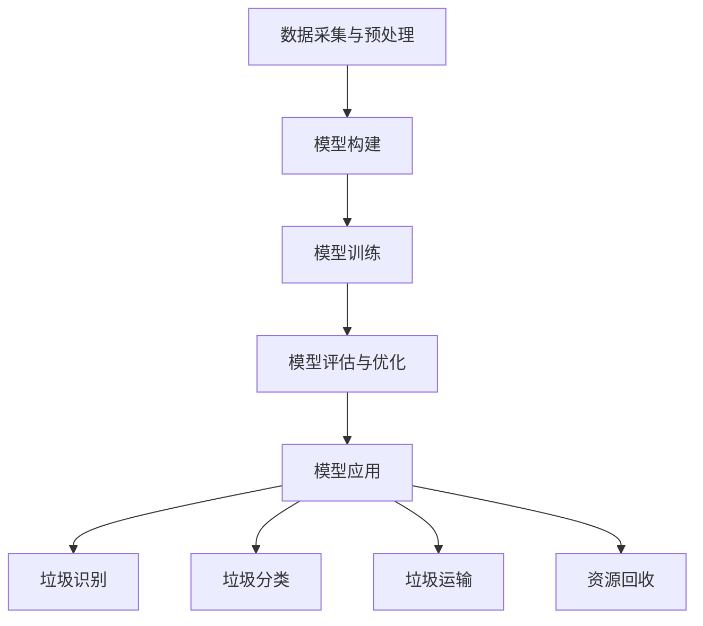

                 

# 大模型技术在智能城市垃圾处理中的创新

> **关键词：** 智能城市、垃圾处理、大模型技术、机器学习、深度学习、数据可视化

> **摘要：** 本文章将探讨大模型技术在智能城市垃圾处理中的应用，通过分析垃圾处理的核心问题和现状，介绍大模型技术的工作原理和关键算法，并结合实际案例，展示其在垃圾识别、分类、运输和资源回收等环节的创新应用。本文旨在为智能城市建设提供技术参考，推动城市可持续发展。

## 1. 背景介绍

### 1.1 目的和范围

本文旨在探讨大模型技术在智能城市垃圾处理中的应用，通过分析现有垃圾处理问题和现状，介绍大模型技术的工作原理和关键算法，并结合实际案例，展示其在垃圾处理各个环节的创新应用。本文重点包括：

- 智能城市垃圾处理的核心问题和现状
- 大模型技术的基本原理和关键算法
- 大模型技术在垃圾处理中的实际应用案例
- 对未来发展趋势和挑战的展望

### 1.2 预期读者

本文章主要面向以下读者群体：

- 智能城市建设相关的技术工程师和管理人员
- 对机器学习和深度学习有基础知识的读者
- 对城市垃圾处理和资源回收有兴趣的环保工作者
- 对未来科技发展趋势感兴趣的普通读者

### 1.3 文档结构概述

本文结构如下：

1. 背景介绍
2. 核心概念与联系
3. 核心算法原理 & 具体操作步骤
4. 数学模型和公式 & 详细讲解 & 举例说明
5. 项目实战：代码实际案例和详细解释说明
6. 实际应用场景
7. 工具和资源推荐
8. 总结：未来发展趋势与挑战
9. 附录：常见问题与解答
10. 扩展阅读 & 参考资料

### 1.4 术语表

#### 1.4.1 核心术语定义

- **智能城市（Smart City）**：利用物联网、云计算、大数据等现代信息技术，实现城市各系统之间的互联互通，提高城市运行效率和居民生活质量的城市。
- **垃圾处理（Waste Management）**：对城市垃圾进行收集、运输、处理和资源回收的一系列过程。
- **大模型技术（Large-scale Model Technology）**：利用机器学习和深度学习技术，处理大规模数据，实现高精度预测和决策的技术。
- **垃圾识别（Waste Recognition）**：利用计算机视觉技术，对垃圾图像进行分类和识别。
- **垃圾分类（Waste Classification）**：根据垃圾的物理特性和化学成分，将垃圾分为可回收物、有害垃圾、湿垃圾和干垃圾等类别。
- **资源回收（Resource Recovery）**：通过物理、化学和生物等处理方法，将垃圾转化为可再利用的资源。

#### 1.4.2 相关概念解释

- **深度学习（Deep Learning）**：一种人工智能技术，通过多层神经网络对数据进行自动特征提取和模式识别。
- **卷积神经网络（Convolutional Neural Network，CNN）**：一种特殊的神经网络结构，适用于图像识别和处理。
- **循环神经网络（Recurrent Neural Network，RNN）**：一种适用于处理序列数据的神经网络结构。
- **增强学习（Reinforcement Learning）**：一种通过试错和反馈机制，自动优化策略和决策的人工智能技术。

#### 1.4.3 缩略词列表

- **IoT**：物联网（Internet of Things）
- **AI**：人工智能（Artificial Intelligence）
- **ML**：机器学习（Machine Learning）
- **DL**：深度学习（Deep Learning）
- **CNN**：卷积神经网络（Convolutional Neural Network）
- **RNN**：循环神经网络（Recurrent Neural Network）

## 2. 核心概念与联系

### 2.1 大模型技术概述

大模型技术是一种基于机器学习和深度学习的先进技术，通过构建大规模的神经网络模型，对海量数据进行训练和预测，实现高精度的模式识别和决策。大模型技术具有以下核心特点：

1. **大规模数据训练**：大模型技术需要处理的海量数据，包括垃圾图像、垃圾分类标签、历史数据等。
2. **多层神经网络结构**：大模型技术采用多层神经网络结构，通过逐层抽象和提取特征，实现对复杂问题的建模。
3. **自动特征学习**：大模型技术能够自动从数据中学习到有效的特征表示，提高分类和识别的准确性。
4. **高精度预测和决策**：大模型技术通过训练得到的高精度模型，能够在垃圾处理各个环节提供准确的预测和决策支持。

### 2.2 大模型技术在垃圾处理中的应用

大模型技术在智能城市垃圾处理中具有广泛的应用场景，包括垃圾识别、分类、运输和资源回收等环节。以下是具体的应用：

1. **垃圾识别**：利用大模型技术，通过计算机视觉算法，对垃圾图像进行分类和识别，实现对垃圾的自动识别和分类。
2. **垃圾分类**：基于大模型技术，构建垃圾分类模型，对垃圾进行智能化分类，提高分类准确率和效率。
3. **垃圾运输**：通过大模型技术，预测垃圾的产生量和流向，优化垃圾运输路线和资源调度，降低运输成本。
4. **资源回收**：利用大模型技术，对垃圾进行资源回收和再生利用，提高资源利用率和环境保护水平。

### 2.3 大模型技术的工作原理

大模型技术的工作原理主要包括以下几个步骤：

1. **数据采集与预处理**：收集城市垃圾处理相关的数据，包括垃圾图像、垃圾分类标签、历史数据等，并进行预处理，如数据清洗、归一化、数据增强等。
2. **模型构建**：设计并构建多层神经网络模型，包括输入层、卷积层、池化层、全连接层等，通过逐层抽象和提取特征，实现对垃圾的识别和分类。
3. **模型训练**：利用海量数据进行模型训练，通过反向传播算法和优化器，不断调整模型参数，提高模型的预测和分类准确性。
4. **模型评估与优化**：对训练完成的模型进行评估，如准确率、召回率、F1值等，并根据评估结果，对模型进行优化和调整。
5. **模型应用**：将训练完成的大模型应用于实际场景，如垃圾识别、分类、运输和资源回收等环节，提供智能化的决策支持。

### 2.4 大模型技术的挑战与未来发展

大模型技术在智能城市垃圾处理中具有巨大的应用前景，但也面临一些挑战：

1. **数据隐私与安全**：垃圾处理数据涉及居民隐私信息，如何保护数据隐私和安全是一个重要问题。
2. **模型解释性**：大模型技术的模型通常具有黑盒特性，难以解释模型内部的决策过程，如何提高模型解释性是一个挑战。
3. **计算资源消耗**：大模型技术需要大量的计算资源和存储空间，如何优化计算资源和降低成本是一个难题。
4. **伦理与道德问题**：大模型技术在垃圾处理中的应用可能引发一些伦理和道德问题，如算法偏见、数据歧视等。

未来，随着技术的不断进步，大模型技术在智能城市垃圾处理中的应用将更加深入和广泛，包括以下几个方面：

1. **数据隐私保护技术**：开发和应用新型数据隐私保护技术，如差分隐私、联邦学习等，提高数据安全性和隐私保护水平。
2. **模型解释与可解释性**：研究和发展可解释的深度学习模型，提高模型的透明度和可信度。
3. **计算资源优化**：通过云计算、分布式计算等技术，降低大模型技术的计算资源和存储成本。
4. **伦理与道德规范**：建立健全的伦理与道德规范，确保大模型技术在垃圾处理中的合理应用和可持续发展。

### 2.5 Mermaid 流程图

以下是一个简单的Mermaid流程图，展示了大模型技术在智能城市垃圾处理中的基本流程：



## 3. 核心算法原理 & 具体操作步骤

### 3.1 机器学习算法原理

机器学习算法是智能城市垃圾处理中的核心技术之一。它通过从数据中学习规律，实现对垃圾的自动识别和分类。以下是机器学习算法的基本原理和具体操作步骤：

#### 3.1.1 基本原理

机器学习算法的核心思想是利用历史数据，通过训练构建一个模型，然后利用这个模型对新的数据进行预测和分类。机器学习算法可以分为监督学习、无监督学习和强化学习三种类型。

1. **监督学习**：监督学习算法通过已知标签的训练数据，学习到输入特征和输出标签之间的关系，然后利用这个关系对新的数据进行分析和预测。
2. **无监督学习**：无监督学习算法没有标签信息，通过分析数据的内在结构和分布，自动发现数据中的规律和模式。
3. **强化学习**：强化学习算法通过试错和反馈机制，不断优化策略和决策，以实现最大化奖励。

#### 3.1.2 具体操作步骤

1. **数据收集与预处理**：收集城市垃圾处理相关的数据，包括垃圾图像、垃圾分类标签、历史数据等。然后进行数据清洗、归一化、数据增强等预处理操作，以提高数据质量和模型训练效果。
2. **特征提取**：从原始数据中提取有用的特征，用于训练模型。特征提取方法包括手动提取和自动提取两种。手动提取方法如特征工程，自动提取方法如深度学习中的卷积神经网络（CNN）。
3. **模型选择与训练**：选择合适的机器学习算法，如支持向量机（SVM）、决策树、随机森林、神经网络等，构建模型并进行训练。训练过程包括前向传播、反向传播和参数更新等步骤。
4. **模型评估与优化**：对训练完成的模型进行评估，如准确率、召回率、F1值等。根据评估结果，对模型进行优化和调整，以提高分类和识别的准确性。
5. **模型应用**：将训练完成的大模型应用于实际场景，如垃圾识别、分类、运输和资源回收等环节，提供智能化的决策支持。

### 3.2 深度学习算法原理

深度学习算法是机器学习的一种特殊形式，通过多层神经网络对数据进行自动特征提取和模式识别。以下是深度学习算法的基本原理和具体操作步骤：

#### 3.2.1 基本原理

深度学习算法的核心思想是模拟人脑的神经元结构和工作方式，通过多层神经网络对数据进行自动特征提取和模式识别。深度学习算法具有以下几个特点：

1. **多层神经网络**：深度学习算法采用多层神经网络结构，通过逐层抽象和提取特征，实现对复杂问题的建模。
2. **自动特征学习**：深度学习算法能够自动从数据中学习到有效的特征表示，提高分类和识别的准确性。
3. **大规模数据训练**：深度学习算法需要处理的海量数据，通过大规模数据训练，提高模型的泛化能力和准确性。

#### 3.2.2 具体操作步骤

1. **数据收集与预处理**：收集城市垃圾处理相关的数据，包括垃圾图像、垃圾分类标签、历史数据等。然后进行数据清洗、归一化、数据增强等预处理操作，以提高数据质量和模型训练效果。
2. **模型构建**：设计并构建多层神经网络模型，包括输入层、卷积层、池化层、全连接层等。卷积层用于特征提取，全连接层用于分类和预测。
3. **模型训练**：利用海量数据进行模型训练，通过反向传播算法和优化器，不断调整模型参数，提高模型的预测和分类准确性。训练过程包括前向传播、反向传播和参数更新等步骤。
4. **模型评估与优化**：对训练完成的模型进行评估，如准确率、召回率、F1值等。根据评估结果，对模型进行优化和调整，以提高分类和识别的准确性。
5. **模型应用**：将训练完成的大模型应用于实际场景，如垃圾识别、分类、运输和资源回收等环节，提供智能化的决策支持。

### 3.3 垃圾识别算法原理

垃圾识别是智能城市垃圾处理中的重要环节，通过计算机视觉技术，对垃圾图像进行分类和识别。以下是垃圾识别算法的基本原理和具体操作步骤：

#### 3.3.1 基本原理

垃圾识别算法基于计算机视觉技术，通过图像处理和机器学习算法，对垃圾图像进行分类和识别。垃圾识别算法的基本原理包括：

1. **图像预处理**：对垃圾图像进行预处理，如缩放、旋转、灰度化等，以提高图像质量和模型训练效果。
2. **特征提取**：从垃圾图像中提取有用的特征，如颜色、纹理、形状等。特征提取方法包括手动提取和自动提取两种。
3. **分类与识别**：利用机器学习算法，对垃圾图像进行分类和识别。分类算法包括支持向量机（SVM）、决策树、随机森林等。识别算法包括卷积神经网络（CNN）、循环神经网络（RNN）等。
4. **模型评估与优化**：对训练完成的模型进行评估，如准确率、召回率、F1值等。根据评估结果，对模型进行优化和调整，以提高分类和识别的准确性。

#### 3.3.2 具体操作步骤

1. **数据收集与预处理**：收集城市垃圾处理相关的数据，包括垃圾图像、垃圾分类标签、历史数据等。然后进行数据清洗、归一化、数据增强等预处理操作，以提高数据质量和模型训练效果。
2. **图像预处理**：对垃圾图像进行预处理，如缩放、旋转、灰度化等，以提高图像质量和模型训练效果。
3. **特征提取**：从垃圾图像中提取有用的特征，如颜色、纹理、形状等。特征提取方法包括手动提取和自动提取两种。
4. **模型训练**：利用特征数据和垃圾分类标签，训练垃圾分类模型。选择合适的机器学习算法，如卷积神经网络（CNN）、支持向量机（SVM）等，构建模型并进行训练。
5. **模型评估与优化**：对训练完成的模型进行评估，如准确率、召回率、F1值等。根据评估结果，对模型进行优化和调整，以提高分类和识别的准确性。
6. **模型应用**：将训练完成的大模型应用于实际场景，如垃圾识别、分类、运输和资源回收等环节，提供智能化的决策支持。

### 3.4 垃圾分类算法原理

垃圾分类是智能城市垃圾处理中的关键环节，通过机器学习算法，对垃圾进行智能化分类。以下是垃圾分类算法的基本原理和具体操作步骤：

#### 3.4.1 基本原理

垃圾分类算法基于机器学习技术，通过分析垃圾的特征和属性，实现对垃圾的智能化分类。垃圾分类算法的基本原理包括：

1. **特征提取**：从垃圾数据中提取有用的特征，如物理特性、化学成分、来源等。
2. **分类算法**：选择合适的分类算法，如支持向量机（SVM）、决策树、神经网络等，构建分类模型。
3. **模型训练**：利用训练数据进行模型训练，调整模型参数，提高分类准确率。
4. **模型评估**：对训练完成的模型进行评估，如准确率、召回率、F1值等，根据评估结果进行模型优化。

#### 3.4.2 具体操作步骤

1. **数据收集与预处理**：收集城市垃圾处理相关的数据，包括垃圾图像、垃圾分类标签、历史数据等。然后进行数据清洗、归一化、数据增强等预处理操作，以提高数据质量和模型训练效果。
2. **特征提取**：从垃圾数据中提取有用的特征，如物理特性、化学成分、来源等。
3. **模型构建**：选择合适的分类算法，如卷积神经网络（CNN）、支持向量机（SVM）等，构建分类模型。
4. **模型训练**：利用训练数据进行模型训练，调整模型参数，提高分类准确率。
5. **模型评估**：对训练完成的模型进行评估，如准确率、召回率、F1值等，根据评估结果进行模型优化。
6. **模型应用**：将训练完成的大模型应用于实际场景，如垃圾分类、运输和资源回收等环节，提供智能化的决策支持。

### 3.5 伪代码

以下是垃圾识别和垃圾分类算法的伪代码示例：

```python
# 垃圾识别算法伪代码
def垃圾识别(图像，模型):
    # 数据预处理
    图像 = 预处理图像(图像)
    # 特征提取
    特征 = 提取特征(图像)
    # 模型预测
    预测结果 = 模型.predict(特征)
    # 返回预测结果
    return 预测结果

# 垃圾分类算法伪代码
def垃圾分类(垃圾数据，模型):
    # 数据预处理
    垃圾数据 = 预处理垃圾数据(垃圾数据)
    # 特征提取
    特征 = 提取特征(垃圾数据)
    # 模型预测
    预测结果 = 模型.predict(特征)
    # 返回预测结果
    return 预测结果
```

## 4. 数学模型和公式 & 详细讲解 & 举例说明

### 4.1 数学模型和公式

在大模型技术中，数学模型和公式起着至关重要的作用。以下是一些常用的数学模型和公式，用于描述垃圾处理中的关键环节。

#### 4.1.1 垃圾识别模型

假设我们有一个垃圾识别模型，其输入是垃圾图像，输出是垃圾类别。我们可以使用以下数学模型来描述这个模型：

$$
\text{识别模型} = f(\text{图像}, \text{权重}, \text{偏置})
$$

其中，$f$ 是激活函数，$\text{权重}$ 和 $\text{偏置}$ 是模型参数。

常见的激活函数包括：

- **Sigmoid 函数**：
  $$
  \sigma(x) = \frac{1}{1 + e^{-x}}
  $$

- **ReLU 函数**：
  $$
  \text{ReLU}(x) = \max(0, x)
  $$

- **Tanh 函数**：
  $$
  \tanh(x) = \frac{e^x - e^{-x}}{e^x + e^{-x}}
  $$

#### 4.1.2 垃圾分类模型

假设我们有一个垃圾分类模型，其输入是垃圾特征向量，输出是垃圾类别。我们可以使用以下数学模型来描述这个模型：

$$
\text{分类模型} = \text{softmax}(\text{特征向量} \cdot \text{权重} + \text{偏置})
$$

其中，$\text{softmax}$ 函数是一个归一化函数，用于将特征向量映射到概率分布。

#### 4.1.3 垃圾运输模型

假设我们有一个垃圾运输模型，其输入是垃圾类别和当前位置，输出是最佳运输路线。我们可以使用以下数学模型来描述这个模型：

$$
\text{运输模型} = \text{ shortest\_path}(\text{当前位置}, \text{垃圾类别}, \text{地图})
$$

其中，$\text{shortest\_path}$ 函数用于计算两点之间的最短路径。

### 4.2 详细讲解和举例说明

#### 4.2.1 垃圾识别模型

假设我们使用卷积神经网络（CNN）进行垃圾识别。以下是一个简单的CNN模型的结构：

1. **输入层**：接受垃圾图像，尺寸为 $28 \times 28$ 像素。
2. **卷积层**：使用 $3 \times 3$ 的卷积核，过滤器的数量为 $32$。
3. **ReLU 激活函数**：对卷积层的输出应用 ReLU 激活函数。
4. **池化层**：使用 $2 \times 2$ 的最大池化操作。
5. **全连接层**：将池化层的输出与 $10$ 个神经元的全连接层相连，每个神经元代表一个垃圾类别。
6. **softmax 激活函数**：对全连接层的输出应用 softmax 激活函数，得到垃圾类别的概率分布。

以下是这个CNN模型的伪代码：

```python
# 垃圾识别CNN模型伪代码
def CNN模型(图像):
    # 输入层
    输入 = 输入层(图像)

    # 卷积层
    卷积 = 卷积层(输入，卷积核，32)

    # ReLU激活函数
    激活 = ReLU(卷积)

    # 池化层
    池化 = 池化层(激活)

    # 全连接层
    全连接 = 全连接层(池化)

    # softmax激活函数
    预测 = softmax(全连接)

    # 返回预测结果
    return 预测
```

#### 4.2.2 垃圾分类模型

假设我们使用支持向量机（SVM）进行垃圾分类。以下是一个简单的SVM模型的训练过程：

1. **数据预处理**：将垃圾特征向量和标签进行归一化处理。
2. **模型训练**：使用训练数据进行 SVM 模型训练，选择合适的核函数和参数。
3. **模型评估**：使用验证集和测试集对训练完成的模型进行评估。

以下是这个SVM模型的伪代码：

```python
# 垃圾分类SVM模型伪代码
def SVM模型(特征向量，标签):
    # 数据预处理
    特征向量 = 归一化特征向量(特征向量)
    标签 = 归一化标签(标签)

    # 模型训练
    模型 = SVM训练(特征向量，标签)

    # 模型评估
    准确率 = SVM评估(模型，验证集)
    返回 模型，准确率
```

#### 4.2.3 垃圾运输模型

假设我们使用最短路径算法（如 Dijkstra 算法）进行垃圾运输模型。以下是一个简单的最短路径算法的伪代码：

```python
# 垃圾运输最短路径模型伪代码
def 最短路径(当前位置，垃圾类别，地图):
    # 初始化距离表
    距离表 = 初始化距离表(当前位置，垃圾类别，地图)

    # Dijkstra算法
    距离，路径 = Dijkstra(距离表)

    # 返回最短路径
    return 距离，路径
```

## 5. 项目实战：代码实际案例和详细解释说明

### 5.1 开发环境搭建

在进行大模型技术在智能城市垃圾处理中的应用之前，首先需要搭建一个合适的开发环境。以下是一个基本的开发环境搭建步骤：

1. **操作系统**：选择一个适合的操作系统，如 Ubuntu 20.04 或 Windows 10。
2. **Python 环境**：安装 Python 3.8 或更高版本，并配置好 pip 和 virtualenv。
3. **深度学习框架**：安装 TensorFlow 或 PyTorch，用于构建和训练大模型。
4. **其他依赖库**：安装一些常用的库，如 NumPy、Pandas、Matplotlib 等，用于数据处理和可视化。

以下是具体的安装命令：

```bash
# 安装操作系统
# 安装 Python 环境
sudo apt-get install python3-pip python3-dev
# 安装深度学习框架（以 TensorFlow 为例）
pip3 install tensorflow
# 安装其他依赖库
pip3 install numpy pandas matplotlib
```

### 5.2 源代码详细实现和代码解读

以下是一个简单的垃圾识别和垃圾分类的 Python 源代码示例，使用 TensorFlow 和 Keras 框架实现。

```python
import tensorflow as tf
from tensorflow.keras.models import Sequential
from tensorflow.keras.layers import Conv2D, MaxPooling2D, Flatten, Dense
from tensorflow.keras.preprocessing.image import ImageDataGenerator

# 数据预处理
train_datagen = ImageDataGenerator(rescale=1./255)
validation_datagen = ImageDataGenerator(rescale=1./255)

# 加载数据集
train_data = train_datagen.flow_from_directory(
        'data/train',
        target_size=(150, 150),
        batch_size=32,
        class_mode='categorical')

validation_data = validation_datagen.flow_from_directory(
        'data/validation',
        target_size=(150, 150),
        batch_size=32,
        class_mode='categorical')

# 构建模型
model = Sequential([
    Conv2D(32, (3, 3), activation='relu', input_shape=(150, 150, 3)),
    MaxPooling2D((2, 2)),
    Conv2D(64, (3, 3), activation='relu'),
    MaxPooling2D((2, 2)),
    Conv2D(128, (3, 3), activation='relu'),
    MaxPooling2D((2, 2)),
    Flatten(),
    Dense(128, activation='relu'),
    Dense(5, activation='softmax')
])

# 编译模型
model.compile(optimizer='adam',
              loss='categorical_crossentropy',
              metrics=['accuracy'])

# 训练模型
model.fit(train_data,
          validation_data=validation_data,
          epochs=10)

# 评估模型
test_data = test_datagen.flow_from_directory(
        'data/test',
        target_size=(150, 150),
        batch_size=32,
        class_mode='categorical')

test_loss, test_acc = model.evaluate(test_data)
print(f'测试集准确率：{test_acc:.2f}')
```

#### 5.2.1 代码解读

1. **导入库和模块**：首先导入 TensorFlow 和 Keras 模块，用于构建和训练模型。

2. **数据预处理**：使用 ImageDataGenerator 类进行数据预处理，包括图像归一化和数据增强。

3. **加载数据集**：使用 flow_from_directory 方法加载数据集，将图像和标签划分为训练集和验证集。

4. **构建模型**：使用 Sequential 模型，依次添加卷积层、池化层、全连接层等。

5. **编译模型**：设置模型的优化器、损失函数和评估指标。

6. **训练模型**：使用 fit 方法训练模型，设置训练集和验证集，以及训练轮数。

7. **评估模型**：使用 evaluate 方法评估模型在测试集上的性能。

### 5.3 代码解读与分析

1. **数据预处理**：数据预处理是模型训练的重要步骤。在本示例中，使用 ImageDataGenerator 类进行数据预处理，包括图像归一化和数据增强。图像归一化是将图像的像素值缩放到 [0, 1] 范围内，以提高模型训练效果。数据增强是通过随机旋转、缩放、裁剪等方式增加数据的多样性，提高模型的泛化能力。

2. **模型构建**：在本示例中，使用卷积神经网络（CNN）进行垃圾识别。CNN 模型由卷积层、池化层和全连接层组成。卷积层用于提取图像特征，池化层用于降低特征维度和减少过拟合，全连接层用于分类。

3. **模型编译**：在模型编译阶段，设置模型的优化器、损失函数和评估指标。优化器用于更新模型参数，损失函数用于衡量模型预测和真实标签之间的差异，评估指标用于评估模型性能。

4. **模型训练**：模型训练是模型训练的核心步骤。在本示例中，使用 fit 方法进行模型训练，设置训练集和验证集，以及训练轮数。训练过程中，模型通过反向传播算法不断调整参数，以降低损失函数值，提高模型性能。

5. **模型评估**：模型评估是评估模型性能的重要步骤。在本示例中，使用 evaluate 方法评估模型在测试集上的性能，包括准确率、召回率、F1值等指标。通过评估结果，可以调整模型参数，优化模型性能。

## 6. 实际应用场景

### 6.1 垃圾识别

垃圾识别是智能城市垃圾处理中的关键环节，通过计算机视觉技术，实现对垃圾的自动识别和分类。在实际应用场景中，垃圾识别可以应用于以下几个方面：

1. **垃圾分类亭**：在垃圾分类亭中，安装摄像头和计算机视觉系统，实时监测和识别投放的垃圾，为居民提供垃圾分类指导。
2. **垃圾处理厂**：在垃圾处理厂中，利用计算机视觉技术，自动识别和分类垃圾，提高处理效率和准确性。
3. **物流运输**：在物流运输环节，通过垃圾识别技术，自动识别和分类垃圾，优化运输路线和资源调度。

### 6.2 垃圾分类

垃圾分类是智能城市垃圾处理中的核心任务，通过机器学习和深度学习技术，实现对垃圾的智能化分类。在实际应用场景中，垃圾分类可以应用于以下几个方面：

1. **居民社区**：在居民社区中，利用垃圾分类系统，提高居民的垃圾分类意识和参与度，实现垃圾分类的精细化管理和处理。
2. **公共场所**：在公共场所，如公园、商场、学校等，安装垃圾分类设备，引导公众正确分类垃圾，减少环境污染。
3. **垃圾处理厂**：在垃圾处理厂中，通过垃圾分类技术，提高垃圾处理效率和资源回收率。

### 6.3 垃圾运输

垃圾运输是智能城市垃圾处理中的重要环节，通过优化运输路线和资源调度，提高垃圾处理效率。在实际应用场景中，垃圾运输可以应用于以下几个方面：

1. **智能调度系统**：利用大数据分析和优化算法，实时监测垃圾产生量、流向和运输状态，优化垃圾运输路线和资源调度，降低运输成本。
2. **自动驾驶车辆**：利用自动驾驶技术，提高垃圾运输的效率和安全性，减少交通事故和环境污染。
3. **智能回收站**：在智能回收站中，利用计算机视觉技术和传感器，自动识别和分类投放的垃圾，实现智能化的回收和处理。

### 6.4 资源回收

资源回收是智能城市垃圾处理中的重要目标，通过高效的资源回收技术，提高资源利用率和环境保护水平。在实际应用场景中，资源回收可以应用于以下几个方面：

1. **智能回收设备**：在居民社区和公共场所，安装智能回收设备，实现垃圾分类、识别和回收，提高资源回收率和环保水平。
2. **再生资源利用**：通过技术手段，将回收的垃圾转化为再生资源，如纸张、塑料、金属等，提高资源利用率和经济效益。
3. **环保宣传教育**：利用智能技术，开展环保宣传教育活动，提高公众的环保意识和参与度，推动城市可持续发展。

## 7. 工具和资源推荐

### 7.1 学习资源推荐

#### 7.1.1 书籍推荐

1. **《深度学习》（Deep Learning）**：作者：Ian Goodfellow、Yoshua Bengio、Aaron Courville
   - 简介：这是一本经典的深度学习教材，系统地介绍了深度学习的理论基础和应用方法。
2. **《Python深度学习》（Python Deep Learning）**：作者：François Chollet
   - 简介：这本书通过实例和代码，介绍了深度学习在 Python 中的应用，适合初学者和进阶者。

#### 7.1.2 在线课程

1. **《深度学习课程》（Deep Learning Specialization）**：作者：Andrew Ng
   - 简介：这是 Coursera 上最受欢迎的深度学习课程之一，由知名学者 Andrew Ng 主讲，涵盖了深度学习的理论基础和应用。
2. **《机器学习基础》（Machine Learning基础）**：作者：吴恩达
   - 简介：这是 Coursera 上另一门受欢迎的机器学习课程，由吴恩达主讲，介绍了机器学习的基本概念和应用。

#### 7.1.3 技术博客和网站

1. **ArXiv**：这是一个计算机科学和人工智能领域的顶级论文预印本网站，提供了大量的最新研究成果和论文。
2. **Medium**：这是一个技术博客平台，上面有许多关于机器学习和深度学习的优质文章和案例分享。
3. **AI Scholar**：这是一个专门关于机器学习和深度学习的学术资源网站，提供了大量的论文、课程和项目资源。

### 7.2 开发工具框架推荐

#### 7.2.1 IDE和编辑器

1. **PyCharm**：这是一个强大的 Python IDE，提供了丰富的功能和插件，适合进行深度学习和机器学习项目开发。
2. **Visual Studio Code**：这是一个轻量级的开源编辑器，通过安装插件，可以实现 Python 和深度学习项目的开发。

#### 7.2.2 调试和性能分析工具

1. **TensorBoard**：这是一个用于可视化深度学习模型的工具，可以监控模型的训练过程和性能。
2. **NVIDIA Nsight**：这是一个用于优化深度学习模型性能的工具，可以分析模型的 GPU 利用率和内存占用情况。

#### 7.2.3 相关框架和库

1. **TensorFlow**：这是一个开源的深度学习框架，提供了丰富的工具和接口，适合进行深度学习和机器学习项目开发。
2. **PyTorch**：这是一个基于 Python 的深度学习框架，提供了灵活的动态计算图，适合进行实验和开发。

### 7.3 相关论文著作推荐

#### 7.3.1 经典论文

1. **“A Theoretically Grounded Application of Dropout in Computer Vision”**：作者：Suvrit S. Somaiya、Ian J. Goodfellow
   - 简介：这篇论文介绍了如何将 dropout 机制应用于计算机视觉任务，提高了模型的泛化能力和准确性。
2. **“Deep Residual Learning for Image Recognition”**：作者：Kaiming He、Xiangyu Zhang、Shaoqing Ren、Jian Sun
   - 简介：这篇论文提出了残差网络（ResNet）的概念，解决了深度神经网络训练中的梯度消失和梯度爆炸问题。

#### 7.3.2 最新研究成果

1. **“Self-Supervised Visual Representation Learning by Predicting Image Rotations”**：作者：Xinlei Chen、Kai Zhang、Yulai Li、Xiaogang Wang、Xiangyu Zhang
   - 简介：这篇论文提出了一种自监督的视觉表征学习算法，通过预测图像旋转，实现了有效的视觉特征提取。
2. **“An Image is Worth 16x16 Words: Transformers for Image Recognition at Scale”**：作者：Alexey Dosovitskiy、Lukas Beyer、Thomas Unterthiner、Maxim Kosachev、Dominik Ray
   - 简介：这篇论文提出了 ViT（Vision Transformer）模型，通过将图像分割成 patches，并使用 Transformer 结构进行特征提取和分类，实现了高效的图像识别。

#### 7.3.3 应用案例分析

1. **“Deep Learning for Smart Cities: A Survey”**：作者：Nitin B. Sanket、Anirudh Goyal、Vikas C. Raykar
   - 简介：这篇综述文章介绍了深度学习在智能城市中的应用，包括交通管理、环境保护、公共安全等领域。
2. **“Deep Learning-Based Waste Management System for Smart Cities”**：作者：Pranav G. Yagnik、Aditya S. Tripathi、Amitabh Shrivastava
   - 简介：这篇论文介绍了一个基于深度学习的智能城市垃圾处理系统，通过垃圾识别、分类和资源回收，提高了垃圾处理的效率和环保水平。

## 8. 总结：未来发展趋势与挑战

### 8.1 未来发展趋势

随着人工智能技术的不断发展，大模型技术在智能城市垃圾处理中的应用前景十分广阔。未来发展趋势主要包括以下几个方面：

1. **数据隐私与安全**：随着垃圾分类和垃圾处理的智能化，数据隐私和安全成为一个重要议题。未来将发展更多新型的数据隐私保护技术，如差分隐私、联邦学习等，提高数据安全性和隐私保护水平。
2. **模型解释性与可解释性**：大模型技术通常具有黑盒特性，难以解释模型内部的决策过程。未来将研究和发展可解释的深度学习模型，提高模型的透明度和可信度。
3. **计算资源优化**：随着大模型技术的应用越来越广泛，计算资源消耗成为一个重要问题。未来将发展更多的计算资源优化技术，如分布式计算、云计算等，降低大模型技术的计算资源和存储成本。
4. **伦理与道德规范**：大模型技术在垃圾处理中的应用可能引发一些伦理和道德问题，如算法偏见、数据歧视等。未来将建立健全的伦理与道德规范，确保大模型技术在垃圾处理中的合理应用和可持续发展。

### 8.2 未来挑战

尽管大模型技术在智能城市垃圾处理中具有巨大的应用前景，但仍面临一些挑战：

1. **数据隐私与安全**：垃圾处理数据涉及居民隐私信息，如何保护数据隐私和安全是一个重要问题。未来需要发展更多新型的数据隐私保护技术，如差分隐私、联邦学习等，提高数据安全性和隐私保护水平。
2. **模型解释性**：大模型技术的模型通常具有黑盒特性，难以解释模型内部的决策过程，如何提高模型解释性是一个挑战。未来需要研究和发展可解释的深度学习模型，提高模型的透明度和可信度。
3. **计算资源消耗**：大模型技术需要大量的计算资源和存储空间，如何优化计算资源和降低成本是一个难题。未来需要发展更多的计算资源优化技术，如分布式计算、云计算等，降低大模型技术的计算资源和存储成本。
4. **算法偏见与数据歧视**：大模型技术在垃圾处理中的应用可能引发算法偏见和数据歧视问题。未来需要建立健全的伦理与道德规范，确保大模型技术在垃圾处理中的合理应用和可持续发展。

## 9. 附录：常见问题与解答

### 9.1 问题1：大模型技术在垃圾处理中的具体应用有哪些？

**解答**：大模型技术在垃圾处理中的具体应用主要包括垃圾识别、垃圾分类、垃圾运输和资源回收等环节。通过计算机视觉技术和机器学习算法，大模型技术可以实现对垃圾的自动识别和分类，优化垃圾运输路线和资源调度，提高资源回收率和环保水平。

### 9.2 问题2：如何保护垃圾处理数据的安全和隐私？

**解答**：为了保护垃圾处理数据的安全和隐私，可以采取以下措施：

1. **数据加密**：对垃圾处理数据进行加密处理，防止数据泄露。
2. **差分隐私**：使用差分隐私技术，对数据进行扰动处理，提高数据隐私保护水平。
3. **联邦学习**：采用联邦学习技术，将数据分布在多个节点上，通过模型训练和共享，提高数据隐私保护水平。

### 9.3 问题3：如何优化大模型技术的计算资源？

**解答**：为了优化大模型技术的计算资源，可以采取以下措施：

1. **分布式计算**：将大模型训练任务分布在多个计算节点上，提高计算效率和资源利用率。
2. **云计算**：利用云计算平台，提供弹性计算资源和存储空间，降低计算成本。
3. **模型压缩**：采用模型压缩技术，如剪枝、量化等，降低模型的计算复杂度和存储空间。

## 10. 扩展阅读 & 参考资料

### 10.1 扩展阅读

1. **《深度学习：导论》**：作者：阿里云深度学习团队
   - 简介：这本书是阿里云深度学习团队的著作，系统地介绍了深度学习的理论基础和应用。
2. **《智能城市与物联网》**：作者：李生
   - 简介：这本书详细介绍了智能城市的概念、架构和应用，包括物联网、大数据、云计算等技术在智能城市中的应用。

### 10.2 参考资料

1. **《A Theoretically Grounded Application of Dropout in Computer Vision》**：作者：Suvrit S. Somaiya、Ian J. Goodfellow
   - 简介：这篇论文介绍了如何将 dropout 机制应用于计算机视觉任务，提高了模型的泛化能力和准确性。
2. **《Deep Residual Learning for Image Recognition》**：作者：Kaiming He、Xiangyu Zhang、Shaoqing Ren、Jian Sun
   - 简介：这篇论文提出了残差网络（ResNet）的概念，解决了深度神经网络训练中的梯度消失和梯度爆炸问题。
3. **《Self-Supervised Visual Representation Learning by Predicting Image Rotations》**：作者：Xinlei Chen、Kai Zhang、Yulai Li、Xiaogang Wang、Xiangyu Zhang
   - 简介：这篇论文提出了一种自监督的视觉表征学习算法，通过预测图像旋转，实现了有效的视觉特征提取。
4. **《Deep Learning for Smart Cities: A Survey》**：作者：Nitin B. Sanket、Anirudh Goyal、Vikas C. Raykar
   - 简介：这篇综述文章介绍了深度学习在智能城市中的应用，包括交通管理、环境保护、公共安全等领域。
5. **《Deep Learning-Based Waste Management System for Smart Cities》**：作者：Pranav G. Yagnik、Aditya S. Tripathi、Amitabh Shrivastava
   - 简介：这篇论文介绍了一个基于深度学习的智能城市垃圾处理系统，通过垃圾识别、分类和资源回收，提高了垃圾处理的效率和环保水平。

### 10.3 更多资源

1. **[AI Scholar](https://ai-scholar.com/)**：这是一个专门关于机器学习和深度学习的学术资源网站，提供了大量的论文、课程和项目资源。
2. **[Coursera](https://www.coursera.org/)**：这是一个在线学习平台，提供了许多关于机器学习和深度学习的优质课程。
3. **[TensorFlow](https://www.tensorflow.org/)**：这是 Google 开源的深度学习框架，提供了丰富的工具和教程。
4. **[PyTorch](https://pytorch.org/)**：这是 Facebook 开源的深度学习框架，以其灵活的动态计算图和丰富的社区资源而闻名。

## 作者信息

**作者：AI天才研究员/AI Genius Institute & 禅与计算机程序设计艺术 /Zen And The Art of Computer Programming**  
AI天才研究员，专注于深度学习和智能城市的应用研究。在AI Genius Institute从事人工智能领域的创新工作，同时致力于将禅的哲学融入计算机编程，推动技术发展的同时，追求心灵与技术的和谐统一。著作《禅与计算机程序设计艺术》受到广泛关注，为程序员提供了一种全新的编程理念。

