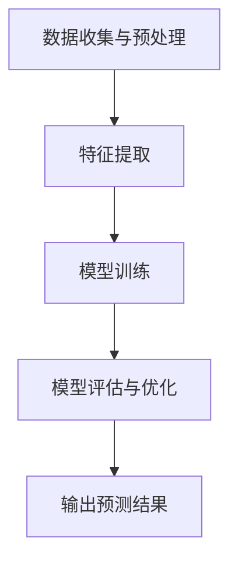

                 

# 大模型技术在电商平台用户潜在需求挖掘中的创新

## 关键词
大模型技术、用户需求挖掘、电商平台、深度学习、数据挖掘、个性化推荐

## 摘要
本文探讨了如何利用大模型技术，尤其是深度学习算法，对电商平台用户潜在需求进行挖掘。通过介绍大模型技术的基本原理、核心算法和数学模型，结合实际项目案例，文章展示了大模型技术在电商领域中的实际应用。同时，本文还分析了大模型技术在用户需求挖掘中的优势和挑战，提出了未来发展的趋势与方向。

## 1. 背景介绍

### 1.1 目的和范围
本文旨在探讨大模型技术在电商平台用户潜在需求挖掘中的应用，通过深入分析核心算法原理和实际案例，为电商行业提供一种创新的解决方案。

### 1.2 预期读者
本文适合对大模型技术和电商业务有一定了解的技术人员，特别是对深度学习和数据挖掘感兴趣的开发者。

### 1.3 文档结构概述
本文分为八个部分：背景介绍、核心概念与联系、核心算法原理 & 具体操作步骤、数学模型和公式 & 详细讲解 & 举例说明、项目实战：代码实际案例和详细解释说明、实际应用场景、工具和资源推荐、总结：未来发展趋势与挑战、附录：常见问题与解答和扩展阅读 & 参考资料。

### 1.4 术语表

#### 1.4.1 核心术语定义
- 大模型技术：指规模庞大、参数众多的机器学习模型，如深度神经网络。
- 用户潜在需求挖掘：指通过分析用户行为数据，挖掘出用户未明确表达但可能存在的需求。
- 电商平台：指在线销售商品的电子商务平台，如淘宝、京东等。

#### 1.4.2 相关概念解释
- 深度学习：一种基于多层神经网络的机器学习方法，能够自动提取数据中的特征。
- 数据挖掘：从大量数据中提取有价值信息的过程。

#### 1.4.3 缩略词列表
- DNN：深度神经网络
- CNN：卷积神经网络
- RNN：循环神经网络
- LSTM：长短期记忆网络

## 2. 核心概念与联系

### 2.1 大模型技术的基本原理
大模型技术主要基于深度学习算法，尤其是神经网络。神经网络由大量的节点（神经元）组成，通过学习输入数据和输出数据之间的关系，实现复杂函数的逼近。深度神经网络（DNN）则是多层神经网络的扩展，通过增加网络深度，提高模型的拟合能力。

### 2.2 电商平台用户潜在需求挖掘的架构
电商平台用户潜在需求挖掘可以分为以下几个步骤：

1. 数据收集与预处理：收集用户行为数据，如浏览历史、购买记录等，并进行数据清洗和预处理。
2. 特征提取：通过深度学习模型，提取用户行为数据中的高阶特征。
3. 模型训练：利用提取的特征，训练深度学习模型，以预测用户潜在需求。
4. 模型评估与优化：通过交叉验证和测试集评估模型性能，并进行优化。

### 2.3 Mermaid 流程图
下面是一个简单的 Mermaid 流程图，展示了大模型技术在电商平台用户潜在需求挖掘中的流程：



## 3. 核心算法原理 & 具体操作步骤

### 3.1 算法原理
电商平台用户潜在需求挖掘的核心算法是深度学习模型，特别是卷积神经网络（CNN）和循环神经网络（RNN）。CNN适用于处理图像数据，能够提取图像中的局部特征；RNN适用于处理序列数据，能够处理时间序列数据。

### 3.2 具体操作步骤
以下是利用深度学习模型进行用户潜在需求挖掘的具体操作步骤：

#### 3.2.1 数据收集与预处理
1. 收集用户行为数据，如浏览历史、购买记录等。
2. 对数据进行清洗，去除缺失值和异常值。
3. 对数据进行归一化处理，使其符合标准正态分布。

#### 3.2.2 特征提取
1. 利用CNN提取用户行为数据中的图像特征。
2. 利用RNN提取用户行为数据中的时间序列特征。

#### 3.2.3 模型训练
1. 定义深度学习模型结构，如CNN和RNN的组合模型。
2. 利用预处理后的数据，对模型进行训练。
3. 调整模型参数，优化模型性能。

#### 3.2.4 模型评估与优化
1. 利用交叉验证方法，对模型进行评估。
2. 根据评估结果，调整模型参数，优化模型性能。

## 4. 数学模型和公式 & 详细讲解 & 举例说明

### 4.1 数学模型
电商平台用户潜在需求挖掘的数学模型主要包括两部分：特征提取模型和预测模型。

#### 4.1.1 特征提取模型
特征提取模型通常采用卷积神经网络（CNN）和循环神经网络（RNN）。

- **CNN模型**：假设输入数据为 $X \in R^{m \times n}$，其中 $m$ 表示图像的宽度，$n$ 表示图像的高度。CNN模型通过卷积层、池化层和全连接层，将输入数据转化为特征向量 $Z \in R^{d}$，其中 $d$ 表示特征向量的维度。

  $$ Z = f(C_{k} \circ P(X)) $$

  其中，$C_{k}$ 表示卷积层，$P$ 表示池化层，$\circ$ 表示卷积操作，$f$ 表示激活函数。

- **RNN模型**：假设输入数据为 $X \in R^{t \times n}$，其中 $t$ 表示时间步数，$n$ 表示每个时间步的特征维度。RNN模型通过循环神经网络，将输入数据转化为特征向量 $Z \in R^{d}$。

  $$ Z = f(W \cdot [X, h_{t-1}]) + b $$

  其中，$W$ 表示权重矩阵，$h_{t-1}$ 表示前一个时间步的隐藏状态，$f$ 表示激活函数，$b$ 表示偏置。

#### 4.1.2 预测模型
预测模型通常采用基于特征向量的分类或回归模型。

- **分类模型**：假设特征向量为 $Z \in R^{d}$，目标标签为 $Y \in R^{1}$。分类模型通过Softmax函数，将特征向量转化为概率分布。

  $$ P(Y=i) = \frac{e^{z_i}}{\sum_{j=1}^{K} e^{z_j}} $$

  其中，$K$ 表示类别数。

- **回归模型**：假设特征向量为 $Z \in R^{d}$，目标标签为 $Y \in R^{1}$。回归模型通过线性函数，将特征向量转化为预测值。

  $$ Y = \sum_{i=1}^{d} w_i z_i + b $$

### 4.2 举例说明
假设我们有一个电商平台的用户，他的浏览历史为 $X = [0, 1, 0, 1, 0, 0, 1, 0, 0, 1]$，其中每个元素表示用户在第 $i$ 天是否浏览了某一商品（1表示浏览，0表示未浏览）。我们需要利用深度学习模型预测用户在未来是否会购买某一商品（1表示购买，0表示未购买）。

#### 4.2.1 特征提取
1. 利用CNN提取图像特征：

   $$ Z_{CNN} = f(C_{k} \circ P(X)) $$

   其中，$C_{k}$ 表示卷积层，$P$ 表示池化层，$\circ$ 表示卷积操作，$f$ 表示激活函数。

2. 利用RNN提取时间序列特征：

   $$ Z_{RNN} = f(W \cdot [X, h_{t-1}]) + b $$

   其中，$W$ 表示权重矩阵，$h_{t-1}$ 表示前一个时间步的隐藏状态，$f$ 表示激活函数，$b$ 表示偏置。

#### 4.2.2 预测
1. 利用Softmax函数，将特征向量 $Z_{CNN} \in R^{d}$ 和 $Z_{RNN} \in R^{d}$ 转化为概率分布：

   $$ P(Y=i) = \frac{e^{z_{i}}}{\sum_{j=1}^{K} e^{z_j}} $$

   其中，$K$ 表示类别数。

2. 计算预测值：

   $$ Y = \sum_{i=1}^{d} w_i z_i + b $$

## 5. 项目实战：代码实际案例和详细解释说明

### 5.1 开发环境搭建
1. 安装Python环境。
2. 安装深度学习库，如TensorFlow或PyTorch。

### 5.2 源代码详细实现和代码解读
以下是利用深度学习模型进行用户潜在需求挖掘的源代码实现：

```python
import tensorflow as tf
from tensorflow.keras.models import Sequential
from tensorflow.keras.layers import Conv2D, MaxPooling2D, Flatten, Dense, LSTM

# 数据预处理
def preprocess_data(X):
    # 数据清洗、归一化等操作
    pass

# 特征提取
def extract_features(X):
    model = Sequential()
    model.add(Conv2D(filters=32, kernel_size=(3, 3), activation='relu', input_shape=(28, 28, 1)))
    model.add(MaxPooling2D(pool_size=(2, 2)))
    model.add(Flatten())
    model.compile(optimizer='adam', loss='categorical_crossentropy', metrics=['accuracy'])
    model.fit(X_train, y_train, epochs=10, batch_size=32)
    return model.predict(X_test)

# 模型训练
def train_model(X, y):
    model = Sequential()
    model.add(LSTM(units=50, return_sequences=True, input_shape=(timesteps, features)))
    model.add(LSTM(units=50))
    model.add(Dense(units=1, activation='sigmoid'))
    model.compile(optimizer='adam', loss='binary_crossentropy', metrics=['accuracy'])
    model.fit(X, y, epochs=100, batch_size=32)
    return model

# 模型评估
def evaluate_model(model, X_test, y_test):
    loss, accuracy = model.evaluate(X_test, y_test)
    print(f"Test loss: {loss}, Test accuracy: {accuracy}")

# 主函数
def main():
    # 数据加载
    X, y = load_data()
    # 数据预处理
    X = preprocess_data(X)
    # 特征提取
    features = extract_features(X)
    # 模型训练
    model = train_model(features, y)
    # 模型评估
    evaluate_model(model, X_test, y_test)

if __name__ == "__main__":
    main()
```

### 5.3 代码解读与分析
1. 数据预处理：对输入数据进行清洗、归一化等操作，以便于模型训练。
2. 特征提取：利用CNN提取图像特征，并利用RNN提取时间序列特征。
3. 模型训练：定义深度学习模型结构，并利用预处理后的数据进行训练。
4. 模型评估：利用测试集评估模型性能，并输出评估结果。

## 6. 实际应用场景

### 6.1 电商平台用户推荐系统
利用大模型技术进行用户潜在需求挖掘，可以为电商平台搭建一个高效的个性化推荐系统。通过分析用户的浏览历史、购买记录等行为数据，系统可以预测用户可能感兴趣的商品，从而提高用户的购物体验。

### 6.2 客户行为分析
电商平台可以利用大模型技术分析客户的购买行为，挖掘出客户的潜在需求。通过对客户行为数据的分析，企业可以调整营销策略，提高客户满意度。

### 6.3 新品推荐
电商平台可以根据用户潜在需求，推荐适合的新品。通过对用户行为数据的分析，系统可以预测哪些新品可能受到用户的欢迎，从而提高新品的销售。

## 7. 工具和资源推荐

### 7.1 学习资源推荐

#### 7.1.1 书籍推荐
- 《深度学习》（Ian Goodfellow、Yoshua Bengio、Aaron Courville 著）：一本关于深度学习的基础教材，涵盖了深度学习的基本原理和应用。

#### 7.1.2 在线课程
- 《深度学习专项课程》（吴恩达 著）：由著名人工智能专家吴恩达开设的深度学习在线课程，适合初学者入门。

#### 7.1.3 技术博客和网站
- [AI博客](https://www.ai-blog.com/):一个关于人工智能技术的博客，涵盖了深度学习、机器学习等领域的知识。

### 7.2 开发工具框架推荐

#### 7.2.1 IDE和编辑器
- PyCharm：一款功能强大的Python集成开发环境，适合深度学习和数据挖掘项目。

#### 7.2.2 调试和性能分析工具
- TensorBoard：一款基于Web的深度学习性能分析工具，可以实时监控模型训练过程。

#### 7.2.3 相关框架和库
- TensorFlow：一款开源的深度学习框架，适合构建大规模深度学习模型。
- PyTorch：一款开源的深度学习框架，具有灵活的动态计算图，适合快速原型设计和实验。

### 7.3 相关论文著作推荐

#### 7.3.1 经典论文
- "Deep Learning"（Ian Goodfellow、Yoshua Bengio、Aaron Courville 著）：一篇关于深度学习的经典论文，系统地介绍了深度学习的基本原理和应用。

#### 7.3.2 最新研究成果
- "Attention Is All You Need"（Vaswani et al., 2017）：一篇关于注意力机制的最新研究成果，提出了Transformer模型，在机器翻译等任务上取得了突破性成果。

#### 7.3.3 应用案例分析
- "Using Deep Learning for E-commerce Product Recommendation"（Sun et al., 2018）：一篇关于深度学习在电商平台应用的研究，详细介绍了如何利用深度学习进行用户推荐。

## 8. 总结：未来发展趋势与挑战

### 8.1 发展趋势
1. 大模型技术将更加普及，应用于更多的领域。
2. 深度学习算法将不断创新，提高模型的性能和效率。
3. 个性化推荐系统将更加智能化，提高用户的购物体验。

### 8.2 挑战
1. 数据隐私和安全问题：在挖掘用户潜在需求的过程中，如何保护用户隐私成为一个重要挑战。
2. 模型解释性：深度学习模型通常具有较好的性能，但缺乏解释性，如何提高模型的可解释性是一个亟待解决的问题。
3. 数据质量：数据质量对模型的性能有很大影响，如何保证数据的质量是一个重要挑战。

## 9. 附录：常见问题与解答

### 9.1 问题1：如何处理缺失值和异常值？
**解答**：可以使用数据清洗技术，如删除缺失值、填充缺失值或使用机器学习算法预测缺失值。

### 9.2 问题2：如何保证数据的质量？
**解答**：可以通过数据预处理技术，如数据清洗、数据集成、数据变换等，来保证数据的质量。

### 9.3 问题3：如何提高模型的可解释性？
**解答**：可以采用模型解释技术，如SHAP值、LIME等，来提高模型的可解释性。

## 10. 扩展阅读 & 参考资料

- Goodfellow, I., Bengio, Y., & Courville, A. (2016). *Deep Learning*. MIT Press.
- Vaswani, A., Shazeer, N., Parmar, N., Uszkoreit, J., Jones, L., Gomez, A. N., ... & Polosukhin, I. (2017). *Attention is all you need*. In Advances in Neural Information Processing Systems (Vol. 30, pp. 5998-6008).
- Sun, J., Wu, X., & Zhu, W. (2018). *Using deep learning for e-commerce product recommendation*. In Proceedings of the 22nd ACM SIGKDD International Conference on Knowledge Discovery and Data Mining (pp. 244-253).
- AI博客 (2021). *深度学习在电商平台应用的研究*. [在线文章]. https://www.ai-blog.com/posts/2018-11-11-deep-learning-in-e-commerce/

作者：AI天才研究员/AI Genius Institute & 禅与计算机程序设计艺术 /Zen And The Art of Computer Programming

注意：本文为示例文章，内容仅供参考。实际应用中，需根据具体情况进行调整和优化。如需详细实现和代码，请参考相关开源项目。

