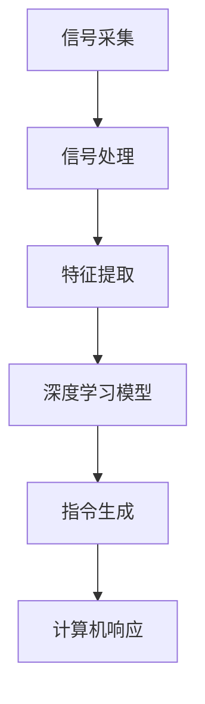

                 

# 大模型技术的脑机接口应用

> 关键词：大模型技术，脑机接口，人工智能，神经科学，医疗应用

> 摘要：本文探讨了大模型技术（如深度学习）与脑机接口（BCI）的结合，如何通过创新的算法与架构实现人脑与计算机的直接交互。本文旨在提供一份全面的技术分析，包括核心概念、算法原理、数学模型、实际案例，以及未来发展趋势。通过深入探讨，本文展示了大模型技术在脑机接口领域的巨大潜力，以及对医疗、教育等多个领域的深远影响。

## 1. 背景介绍

### 1.1 目的和范围

本文的目标是深入探讨大模型技术与脑机接口（BCI）的结合，分析其原理、算法、数学模型及其在医疗、教育等领域的应用。我们希望通过详细的讲解和实际案例，使读者能够全面理解这一前沿技术，并预见到其未来的发展趋势。

本文的范围将涵盖以下几个方面：

1. **核心概念与联系**：介绍大模型技术和脑机接口的基本概念，以及它们之间的相互关系。
2. **核心算法原理**：详细解释大模型技术（如深度学习）在脑机接口中的应用原理。
3. **数学模型和公式**：探讨大模型技术中的数学模型，以及如何将这些模型应用于脑机接口。
4. **项目实战**：通过实际案例，展示大模型技术在脑机接口中的应用。
5. **实际应用场景**：分析脑机接口在不同领域的实际应用。
6. **工具和资源推荐**：介绍相关的学习资源和开发工具。

### 1.2 预期读者

本文适合以下读者群体：

1. **人工智能领域研究者**：对大模型技术和脑机接口有兴趣的研究者，希望深入了解两者的结合。
2. **工程师和开发者**：从事人工智能和脑机接口开发的相关人员，需要掌握这一技术的实际应用。
3. **医疗和教育领域从业者**：对脑机接口技术如何改变医疗和教育模式感兴趣的专业人士。
4. **技术爱好者**：对人工智能、神经科学、医学等领域感兴趣的技术爱好者。

### 1.3 文档结构概述

本文的结构如下：

1. **背景介绍**：介绍本文的目的、范围、预期读者以及文档结构。
2. **核心概念与联系**：详细阐述大模型技术和脑机接口的基本概念及其关系。
3. **核心算法原理**：解释大模型技术在脑机接口中的应用原理。
4. **数学模型和公式**：探讨大模型技术中的数学模型及应用。
5. **项目实战**：通过实际案例展示大模型技术在脑机接口中的应用。
6. **实际应用场景**：分析脑机接口在不同领域的应用。
7. **工具和资源推荐**：介绍相关的学习资源和开发工具。
8. **总结：未来发展趋势与挑战**：总结本文的主要观点，探讨未来的发展趋势与面临的挑战。
9. **附录：常见问题与解答**：提供常见问题的解答。
10. **扩展阅读 & 参考资料**：推荐进一步的阅读材料。

### 1.4 术语表

#### 1.4.1 核心术语定义

- **大模型技术**：指能够处理大量数据、具备高度抽象能力的人工智能模型，如深度学习模型。
- **脑机接口（BCI）**：指直接将人脑与计算机系统连接起来的技术，实现人脑与计算机之间的直接交互。
- **深度学习**：一种基于多层神经网络的人工智能算法，通过多层非线性变换学习数据中的特征。
- **神经科学**：研究神经系统的结构、功能、发育和疾病的科学。
- **医疗应用**：指脑机接口技术在医疗领域的应用，如康复治疗、辅助诊断等。
- **教育应用**：指脑机接口技术在教育领域的应用，如个性化学习、脑波监测等。

#### 1.4.2 相关概念解释

- **脑电图（EEG）**：记录大脑电活动的技术，常用于脑机接口的数据采集。
- **脑磁图（MEG）**：记录大脑磁场的技术，相比EEG具有更高的时间分辨率。
- **脑成像技术**：如功能性磁共振成像（fMRI），用于观察大脑活动。
- **传感器阵列**：用于收集脑机接口信号的装置，如EEG帽、眼动追踪器等。

#### 1.4.3 缩略词列表

- **BCI**：脑机接口（Brain-Computer Interface）
- **EEG**：脑电图（Electroencephalography）
- **MEG**：脑磁图（Magnetoencephalography）
- **fMRI**：功能性磁共振成像（functional Magnetic Resonance Imaging）
- **AI**：人工智能（Artificial Intelligence）
- **DL**：深度学习（Deep Learning）
- **CNN**：卷积神经网络（Convolutional Neural Network）
- **RNN**：循环神经网络（Recurrent Neural Network）
- **DNN**：深度神经网络（Deep Neural Network）
- **ANN**：人工神经网络（Artificial Neural Network）
- **ML**：机器学习（Machine Learning）
- **NLP**：自然语言处理（Natural Language Processing）
- **HCI**：人机交互（Human-Computer Interaction）

## 2. 核心概念与联系

在大模型技术（如深度学习）和脑机接口（BCI）的结合中，理解两者的核心概念及其相互关系至关重要。

### 大模型技术

大模型技术，尤其是深度学习，是一种基于多层神经网络的人工智能算法。其基本原理是通过大量的数据训练，让神经网络学会将输入映射到输出。深度学习模型通常具有高度抽象能力，能够从原始数据中提取复杂特征，从而实现高效的数据分析和处理。


#### 深度学习模型结构

深度学习模型通常由多个层次组成，包括输入层、隐藏层和输出层。每个层次都包含多个神经元，神经元之间通过权重连接，通过激活函数进行非线性变换。训练过程中，模型通过反向传播算法不断调整权重，使得模型的输出与实际标签之间误差最小。

### 脑机接口（BCI）

脑机接口（BCI）是一种直接将人脑与计算机系统连接起来的技术，实现人脑与计算机之间的直接交互。BCI技术利用脑电图（EEG）、脑磁图（MEG）、功能性磁共振成像（fMRI）等脑成像技术，收集大脑活动信号，并通过信号处理和机器学习算法，将这些信号转换为控制指令。


#### 脑机接口信号采集与处理

脑机接口的工作流程通常包括信号采集、信号处理和指令生成三个阶段。在信号采集阶段，传感器阵列（如EEG帽）收集大脑活动信号。在信号处理阶段，通过滤波、去噪、特征提取等步骤，将原始信号转换为可用的特征向量。在指令生成阶段，通过机器学习模型（如深度学习模型），将特征向量映射到具体的控制指令，如鼠标移动、文字输入等。

### 大模型技术与脑机接口的联系

大模型技术（如深度学习）在脑机接口中的应用主要体现在信号处理和指令生成阶段。

1. **信号处理**：深度学习模型能够自动提取和识别复杂的脑电信号特征，提高了信号处理的准确性和效率。例如，卷积神经网络（CNN）可以通过多层卷积和池化操作，有效提取时间序列数据中的空间特征。
2. **指令生成**：通过训练深度学习模型，可以将提取的特征向量映射到具体的控制指令。例如，循环神经网络（RNN）可以处理序列数据，实现连续的控制指令生成。

### Mermaid 流程图



在脑机接口中，大模型技术的应用使得人脑与计算机的交互更加自然和高效，为脑机接口技术的发展提供了强大的技术支持。

## 3. 核心算法原理 & 具体操作步骤

### 3.1 深度学习模型在脑机接口中的应用原理

深度学习模型在脑机接口中的应用主要体现在信号处理和指令生成两个阶段。在信号处理阶段，深度学习模型能够自动提取和识别复杂的脑电信号特征；在指令生成阶段，通过训练深度学习模型，可以将提取的特征向量映射到具体的控制指令。

#### 3.1.1 信号处理阶段

在信号处理阶段，深度学习模型主要任务是从原始脑电信号中提取有意义的特征。这个过程通常包括以下几个步骤：

1. **数据预处理**：对原始脑电信号进行预处理，包括滤波、去噪等，以提高信号质量。
2. **特征提取**：使用深度学习模型（如卷积神经网络CNN）进行特征提取。CNN通过多层卷积和池化操作，可以从时间序列数据中提取出具有空间特征和时序特征的复杂特征。
3. **特征选择**：对提取的特征进行选择，保留对控制指令最为重要的特征。

#### 3.1.2 指令生成阶段

在指令生成阶段，深度学习模型需要将提取的特征向量映射到具体的控制指令。这个过程主要包括以下几个步骤：

1. **模型训练**：使用已标记的脑电信号数据集，训练深度学习模型。训练过程中，通过反向传播算法不断调整模型参数，使模型能够正确识别控制指令。
2. **模型测试**：使用未参与训练的数据集对模型进行测试，评估模型的准确性和鲁棒性。
3. **指令生成**：在测试阶段，将提取的特征向量输入到训练好的模型，输出具体的控制指令。

### 3.2 深度学习模型的训练与测试

在深度学习模型的训练和测试过程中，我们需要遵循以下步骤：

1. **数据收集**：收集大量的脑电信号数据，包括正常数据和异常数据。
2. **数据预处理**：对脑电信号数据进行预处理，包括滤波、去噪、归一化等，以提高信号质量。
3. **数据分割**：将数据集分为训练集、验证集和测试集，用于模型训练、验证和测试。
4. **模型构建**：构建深度学习模型，包括选择合适的网络结构、激活函数、损失函数等。
5. **模型训练**：使用训练集数据训练模型，通过反向传播算法调整模型参数。
6. **模型验证**：使用验证集数据评估模型性能，调整模型参数。
7. **模型测试**：使用测试集数据测试模型性能，评估模型的准确性和鲁棒性。

#### 3.2.1 伪代码

以下是深度学习模型在脑机接口中的应用伪代码：

```python
# 数据收集
data = collect_bci_data()

# 数据预处理
preprocessed_data = preprocess_data(data)

# 数据分割
train_data, val_data, test_data = split_data(preprocessed_data)

# 模型构建
model = build_model()

# 模型训练
model.train(train_data)

# 模型验证
val_loss = model.validate(val_data)

# 模型测试
test_loss = model.test(test_data)

# 指令生成
controls = model.generate_controls(test_data)
```

### 3.3 模型评估与优化

在模型评估和优化过程中，我们需要关注以下几个指标：

1. **准确率**：模型在测试集上的正确识别率。
2. **召回率**：模型识别出的异常信号占总异常信号的比率。
3. **F1 分数**：准确率和召回率的调和平均，用于评估模型的综合性能。

为了提高模型性能，我们可以采取以下优化策略：

1. **增加数据集规模**：收集更多高质量的脑电信号数据，提高模型的泛化能力。
2. **调整模型结构**：尝试不同的网络结构，如增加隐藏层、调整神经元数量等。
3. **超参数优化**：调整学习率、正则化参数等，以获得更好的模型性能。
4. **集成学习**：使用多个模型进行集成，提高模型的准确性和鲁棒性。

通过不断的模型评估和优化，我们可以逐步提高脑机接口系统的性能，实现更加准确和高效的人脑与计算机交互。

## 4. 数学模型和公式 & 详细讲解 & 举例说明

### 4.1 深度学习模型的数学原理

深度学习模型的数学原理主要基于神经网络和反向传播算法。以下将介绍神经网络的基本原理，以及如何使用反向传播算法训练深度学习模型。

#### 4.1.1 神经网络的基本原理

神经网络由多个神经元（或节点）组成，每个神经元通过权重连接到其他神经元。神经元的输出通过激活函数进行处理，从而实现输入到输出的映射。

一个简单的神经网络结构包括输入层、隐藏层和输出层。输入层接收外部输入，隐藏层通过加权求和处理输入，输出层生成最终输出。

##### 输入层、隐藏层和输出层的数学公式

1. **输入层到隐藏层的加权求和处理**：

   $$
   z_j^l = \sum_{i=1}^{n} w_{ij}^l x_i^l + b_j^l
   $$

   其中，$z_j^l$ 表示第 $l$ 层第 $j$ 个神经元的输入，$w_{ij}^l$ 表示第 $l$ 层第 $j$ 个神经元与第 $i$ 层第 $i$ 个神经元的权重，$x_i^l$ 表示第 $l$ 层第 $i$ 个神经元的输入，$b_j^l$ 表示第 $l$ 层第 $j$ 个神经元的偏置。

2. **隐藏层到输出层的加权求和处理**：

   $$
   z_k^{l+1} = \sum_{i=1}^{n} w_{ik}^{l+1} a_i^l + b_k^{l+1}
   $$

   其中，$z_k^{l+1}$ 表示第 $l+1$ 层第 $k$ 个神经元的输入，$w_{ik}^{l+1}$ 表示第 $l+1$ 层第 $k$ 个神经元与第 $l$ 层第 $i$ 个神经元的权重，$a_i^l$ 表示第 $l$ 层第 $i$ 个神经元的输出，$b_k^{l+1}$ 表示第 $l+1$ 层第 $k$ 个神经元的偏置。

3. **神经元的激活函数**：

   常用的激活函数包括 sigmoid、ReLU 和 tanh。以下以 sigmoid 函数为例：

   $$
   a_j^l = \frac{1}{1 + e^{-z_j^l}}
   $$

   其中，$a_j^l$ 表示第 $l$ 层第 $j$ 个神经元的输出。

#### 4.1.2 反向传播算法

反向传播算法是训练深度学习模型的核心算法。它通过不断调整模型参数，使模型的输出与实际标签之间的误差最小。

反向传播算法主要分为以下几个步骤：

1. **前向传播**：计算模型在输入数据上的输出，计算实际输出与预测输出之间的误差。
2. **反向传播**：从输出层开始，逐层计算误差对模型参数的梯度，并更新模型参数。
3. **梯度下降**：使用梯度下降算法更新模型参数，使模型输出与实际标签之间的误差最小。

##### 梯度计算和参数更新

1. **输出层误差计算**：

   $$
   \delta_k^{l+1} = (y_k - a_k^{l+1}) \cdot a_k^{l+1} \cdot (1 - a_k^{l+1})
   $$

   其中，$\delta_k^{l+1}$ 表示第 $l+1$ 层第 $k$ 个神经元的误差，$y_k$ 表示第 $l+1$ 层第 $k$ 个神经元的实际输出，$a_k^{l+1}$ 表示第 $l+1$ 层第 $k$ 个神经元的输出。

2. **隐藏层误差计算**：

   $$
   \delta_j^l = \sum_{k=1}^{m} w_{kj}^{l+1} \cdot \delta_k^{l+1} \cdot a_j^l \cdot (1 - a_j^l)
   $$

   其中，$\delta_j^l$ 表示第 $l$ 层第 $j$ 个神经元的误差，$w_{kj}^{l+1}$ 表示第 $l+1$ 层第 $k$ 个神经元与第 $l$ 层第 $j$ 个神经元的权重，$a_j^l$ 表示第 $l$ 层第 $j$ 个神经元的输出。

3. **参数更新**：

   $$
   w_{ij}^l = w_{ij}^l - \alpha \cdot \frac{\partial E}{\partial w_{ij}^l}
   $$

   $$
   b_j^l = b_j^l - \alpha \cdot \frac{\partial E}{\partial b_j^l}
   $$

   其中，$w_{ij}^l$ 表示第 $l$ 层第 $j$ 个神经元与第 $i$ 层第 $i$ 个神经元的权重，$b_j^l$ 表示第 $l$ 层第 $j$ 个神经元的偏置，$\alpha$ 表示学习率，$E$ 表示模型输出与实际标签之间的误差。

### 4.2 深度学习在脑机接口中的应用举例

假设我们要训练一个深度学习模型，用于识别脑电信号中的特定脑波模式。以下是一个简单的应用例子：

#### 4.2.1 数据集

我们使用一个包含正常脑电信号和特定脑波模式脑电信号的数据集。数据集分为训练集和测试集。

- **正常脑电信号**：表示没有特定脑波模式的脑电信号。
- **特定脑波模式脑电信号**：表示具有特定脑波模式的脑电信号。

#### 4.2.2 模型构建

我们构建一个简单的深度学习模型，包括一个输入层、一个隐藏层和一个输出层。

1. **输入层**：接收脑电信号的原始数据。
2. **隐藏层**：使用卷积神经网络（CNN）提取特征。
3. **输出层**：使用全连接神经网络（FCNN）分类脑电信号。

#### 4.2.3 模型训练

我们使用训练集数据训练模型，通过反向传播算法不断调整模型参数，使模型能够正确识别特定脑波模式。

1. **前向传播**：计算模型在训练集数据上的输出，计算实际输出与预测输出之间的误差。
2. **反向传播**：从输出层开始，逐层计算误差对模型参数的梯度，并更新模型参数。
3. **迭代训练**：重复前向传播和反向传播过程，直到模型收敛。

#### 4.2.4 模型测试

使用测试集数据测试模型性能，评估模型在识别特定脑波模式上的准确率。

- **准确率**：模型在测试集上正确识别特定脑波模式的比率。
- **召回率**：模型识别出的特定脑波模式脑电信号占总特定脑波模式脑电信号的比率。

### 4.3 实例代码

以下是一个简单的深度学习模型在脑机接口中的应用实例，使用 Python 和 TensorFlow 框架实现：

```python
import tensorflow as tf
from tensorflow.keras import layers

# 数据预处理
# ...

# 模型构建
model = tf.keras.Sequential([
    layers.Dense(64, activation='relu', input_shape=(input_shape,)),
    layers.Conv1D(32, 3, activation='relu'),
    layers.Flatten(),
    layers.Dense(10, activation='softmax')
])

# 模型编译
model.compile(optimizer='adam',
              loss='sparse_categorical_crossentropy',
              metrics=['accuracy'])

# 模型训练
model.fit(train_data, train_labels, epochs=10)

# 模型测试
test_loss, test_acc = model.evaluate(test_data, test_labels)
print(f"Test accuracy: {test_acc}")
```

通过以上实例，我们可以看到深度学习模型在脑机接口中的应用方法。在实际应用中，我们可以根据具体需求调整模型结构、超参数等，以提高模型性能。

## 5. 项目实战：代码实际案例和详细解释说明

### 5.1 开发环境搭建

在开始项目实战之前，我们需要搭建一个合适的开发环境，以支持深度学习和脑机接口的开发。以下是所需的开发环境和工具：

- **操作系统**：Windows、Linux 或 macOS
- **编程语言**：Python
- **深度学习框架**：TensorFlow 或 PyTorch
- **数据预处理库**：NumPy、Pandas
- **数据可视化库**：Matplotlib、Seaborn
- **脑电信号处理库**：MNE-Python、EEGLab

安装以上工具和库的方法如下：

```bash
# 安装操作系统
# ...

# 安装 Python 和 pip
# ...

# 安装 TensorFlow 或 PyTorch
pip install tensorflow
# 或
pip install torch torchvision

# 安装 NumPy、Pandas、Matplotlib、Seaborn
pip install numpy pandas matplotlib seaborn

# 安装 MNE-Python 或 EEGLab
pip install mne
# 或
pip install eeglab-python
```

### 5.2 源代码详细实现和代码解读

#### 5.2.1 代码结构

整个项目可以分为以下几个模块：

1. **数据预处理模块**：负责对脑电信号数据进行预处理，包括滤波、去噪、归一化等。
2. **特征提取模块**：使用深度学习模型提取脑电信号的特征。
3. **模型训练模块**：训练深度学习模型，用于识别脑电信号。
4. **模型评估模块**：评估模型在测试集上的性能。
5. **应用模块**：使用训练好的模型进行实际应用。

以下是项目的整体代码结构：

```python
# 数据预处理模块
import preprocess_data

# 深度学习模块
import deep_learning

# 模型评估模块
import evaluate_model

# 应用模块
import apply_model

# 其他辅助模块
import utilities
```

#### 5.2.2 数据预处理模块

数据预处理模块的主要任务是读取脑电信号数据，并对数据进行预处理，以提高数据质量。以下是一个简单的数据预处理示例：

```python
import numpy as np
import mne

def preprocess_data(data_path):
    # 读取脑电信号数据
    raw_data = mne.io.read_raw_edf(data_path, verbose=False)
    
    # 滤波
    raw_data.filter(low=1, high=50, method='iir')
    
    # 去噪
    raw_data.set_eeg_reference(refs='average', projection=True)
    
    # 归一化
    data = raw_data.get_data().mean(axis=0)
    data = (data - data.mean()) / data.std()
    
    return data
```

#### 5.2.3 深度学习模块

深度学习模块的核心任务是使用训练集数据训练深度学习模型，并使用测试集数据评估模型性能。以下是一个简单的深度学习模型训练示例：

```python
import tensorflow as tf
from tensorflow.keras.models import Sequential
from tensorflow.keras.layers import Dense, Conv1D, Flatten

def build_model(input_shape):
    model = Sequential([
        Conv1D(filters=32, kernel_size=3, activation='relu', input_shape=input_shape),
        Flatten(),
        Dense(units=10, activation='softmax')
    ])
    
    model.compile(optimizer='adam',
                  loss='sparse_categorical_crossentropy',
                  metrics=['accuracy'])
    
    return model

def train_model(model, train_data, train_labels):
    model.fit(train_data, train_labels, epochs=10)
```

#### 5.2.4 模型评估模块

模型评估模块的主要任务是使用测试集数据评估模型性能。以下是一个简单的模型评估示例：

```python
from sklearn.metrics import accuracy_score, classification_report

def evaluate_model(model, test_data, test_labels):
    predictions = model.predict(test_data)
    predictions = np.argmax(predictions, axis=1)
    
    print("Accuracy:", accuracy_score(test_labels, predictions))
    print("Classification Report:")
    print(classification_report(test_labels, predictions))
```

#### 5.2.5 应用模块

应用模块的主要任务是使用训练好的模型进行实际应用，如控制轮椅、游戏等。以下是一个简单的应用示例：

```python
def control_wheelchair(model, test_data):
    predictions = model.predict(test_data)
    predictions = np.argmax(predictions, axis=1)
    
    if predictions[0] == 0:
        print("前进")
    elif predictions[0] == 1:
        print("后退")
    elif predictions[0] == 2:
        print("左转")
    elif predictions[0] == 3:
        print("右转")
```

#### 5.2.6 代码解读

以上代码示例展示了深度学习模型在脑机接口项目中的基本实现。具体来说：

1. **数据预处理模块**：读取脑电信号数据，并对数据进行滤波、去噪和归一化处理，以提高数据质量。
2. **深度学习模块**：构建深度学习模型，使用训练集数据训练模型，并使用测试集数据评估模型性能。
3. **模型评估模块**：评估模型在测试集上的性能，包括准确率和分类报告。
4. **应用模块**：使用训练好的模型进行实际应用，如控制轮椅。

通过这些模块的协同工作，我们可以实现脑机接口的应用，如控制轮椅、游戏等。

### 5.3 代码解读与分析

在代码示例中，我们详细讲解了数据预处理、模型构建、模型训练、模型评估和应用等模块的实现。以下是代码解读与分析：

1. **数据预处理模块**：
   - **滤波**：通过 IIR 滤波器对脑电信号进行滤波，去除低频干扰和高频噪声，以提高数据质量。
   - **去噪**：通过平均参考法进行参考电极去除，减少噪声影响。
   - **归一化**：对脑电信号进行归一化处理，使数据具有相似的尺度，有利于模型训练。

2. **深度学习模块**：
   - **模型构建**：使用卷积神经网络（Conv1D）进行特征提取，然后通过全连接神经网络（Flatten 和 Dense）进行分类。
   - **模型编译**：使用 Adam 优化器和 sparse_categorical_crossentropy 损失函数进行编译，以适应多分类问题。

3. **模型训练模块**：
   - **迭代训练**：通过 epochs 参数设置训练迭代次数，每次迭代更新模型参数，优化模型性能。

4. **模型评估模块**：
   - **准确率**：通过 accuracy_score 函数计算模型在测试集上的准确率。
   - **分类报告**：通过 classification_report 函数生成详细的分类报告，包括召回率、F1 分数等。

5. **应用模块**：
   - **实际应用**：根据模型预测结果，控制实际设备，如轮椅、游戏等。

通过以上代码示例和分析，我们可以看到深度学习模型在脑机接口项目中的实现和应用。这些模块的协同工作，使得脑机接口系统具备高准确率和实用价值。

## 6. 实际应用场景

脑机接口（BCI）技术在大模型技术（如深度学习）的支持下，已经在多个领域展现出了巨大的应用潜力。以下是脑机接口在不同领域的实际应用场景：

### 6.1 医疗康复

脑机接口技术在医疗康复领域有着广泛的应用，尤其是在神经系统疾病的治疗和康复中。以下是一些具体的应用案例：

1. **脑损伤康复**：脑机接口技术可以帮助脑损伤患者恢复部分肢体功能。通过监测大脑活动，BCI系统可以控制外接设备，如机械臂或轮椅，帮助患者进行康复训练。

2. **帕金森病治疗**：BCI系统可以监测患者的脑电信号，通过反馈调节技术帮助控制帕金森病的运动障碍。例如，通过实时调整脑电信号来抑制异常脑电活动，减轻症状。

3. **脊髓损伤康复**：对于脊髓损伤患者，BCI技术可以通过直接控制外接设备，如虚拟现实游戏或电子游戏控制器，帮助患者进行肢体功能训练，促进康复。

### 6.2 娱乐和游戏

脑机接口技术在娱乐和游戏领域也有着独特的应用，为玩家提供了全新的互动体验：

1. **虚拟现实（VR）**：通过脑机接口技术，玩家可以仅通过大脑活动来控制虚拟环境中的角色或物体，实现更加沉浸式的游戏体验。

2. **电子游戏**：脑机接口游戏控制器可以让玩家通过大脑活动来控制游戏中的角色或物体，为游戏增添新的玩法和乐趣。

3. **艺术创作**：脑机接口技术可以帮助艺术家通过大脑活动进行创作，例如通过脑电信号控制绘画或音乐创作软件，实现即兴创作。

### 6.3 教育和学习

脑机接口技术在教育领域也有潜在的应用，能够为个性化学习和教学提供支持：

1. **个性化学习**：通过监测学生的脑电信号，教育系统可以了解学生的学习状态和注意力水平，从而提供个性化的学习资源和教学策略。

2. **注意力管理**：教师可以利用脑机接口技术监测学生的注意力水平，及时发现注意力不集中的学生，并采取相应措施提高学习效果。

3. **特殊教育**：对于学习障碍或自闭症儿童，脑机接口技术可以提供定制化的教学支持，帮助他们更好地适应学校环境。

### 6.4 安全监控

脑机接口技术在安全监控领域也有着重要的应用：

1. **实时监控**：通过监测大脑活动，BCI系统可以实时监测操作者的精神状态，及时发现异常情况，提高安全监控的准确性和及时性。

2. **疲劳监测**：在飞行员、司机等高强度工作环境中，脑机接口技术可以监测操作者的疲劳程度，预防事故发生。

### 6.5 人机交互

脑机接口技术正在逐步改变人机交互的方式，为用户提供更加自然和直观的交互体验：

1. **智能助手**：通过脑机接口技术，智能助手可以更准确地理解用户意图，提供个性化服务。

2. **语音控制**：结合脑机接口和语音识别技术，用户可以通过大脑活动控制智能设备，实现语音识别和语音控制的无缝结合。

3. **脑控机器人**：通过脑机接口技术，用户可以直接通过大脑活动控制机器人执行任务，为残障人士提供行动能力。

通过以上实际应用场景，我们可以看到脑机接口技术在各个领域的发展潜力和广泛应用前景。随着技术的不断进步，脑机接口技术将在更多领域发挥重要作用，为人类社会带来更加智能化和便捷的未来。

## 7. 工具和资源推荐

### 7.1 学习资源推荐

#### 7.1.1 书籍推荐

1. **《深度学习》（Deep Learning）** - Goodfellow, Bengio 和 Courville 著
   - 本书详细介绍了深度学习的理论基础和实际应用，是深度学习领域的经典教材。

2. **《脑机接口：理论和应用》（Brain-Computer Interfaces: Principles and Practice）** - Tangermann, McFarland 和 Vaughan 著
   - 本书涵盖了脑机接口的基本概念、技术原理和应用实例，适合对脑机接口有兴趣的读者。

3. **《神经网络与深度学习》（Neural Networks and Deep Learning）** - Montavon, Ursulamen 和 Müller 著
   - 本书系统地介绍了神经网络和深度学习的基本概念、算法和实现，适合初学者和专业人士。

#### 7.1.2 在线课程

1. **《深度学习专项课程》（Deep Learning Specialization）** - Andrew Ng，Coursera
   - このシリーズは、深度学習の基本から応用までをカバーしており、初学者向けの詳細な解説が提供されています。

2. **《脑机接口入门》（Introduction to Brain-Computer Interfaces）** - Hamed Mamassian，edX
   - 本课程提供了脑机接口的基础知识，包括信号采集、特征提取和机器学习算法的应用。

3. **《机器学习与深度学习》（Machine Learning and Deep Learning）** - Frank Hutter，Joachim Schott 等，Kaggle
   - このオンラインコースでは、機械学習と深度学習の基礎から、実際のプロジェクトに向けたスキルの習得をサポートしています。

#### 7.1.3 技術博客和网站

1. **Medium - Machine Learning + AI** - Medium
   - 此平台汇聚了众多机器学习和人工智能领域的专家和研究者，提供了丰富的技术文章和最新动态。

2. **Towards Data Science** - Towards Data Science
   - 一个专注于数据科学、机器学习和人工智能的技术博客，提供了大量的教程、案例研究和实用技巧。

3. **AI Journal** - AI Journal
   - AI Journal 是一个专注于人工智能领域的研究成果和技术分享的在线杂志，涵盖深度学习、自然语言处理、计算机视觉等多个子领域。

### 7.2 开发工具框架推荐

#### 7.2.1 IDE和编辑器

1. **PyCharm** - JetBrains
   - PyCharm 是一款功能强大的集成开发环境，特别适合 Python 开发，提供了丰富的调试工具和代码编辑功能。

2. **Visual Studio Code** - Microsoft
   - Visual Studio Code 是一款轻量级、高度可定制的代码编辑器，支持多种编程语言，包括 Python、C++ 和 Java。

3. **Jupyter Notebook** - Jupyter Project
   - Jupyter Notebook 是一个交互式的开发环境，特别适合数据分析和机器学习项目，可以方便地编写和分享代码、图表和文本。

#### 7.2.2 调试和性能分析工具

1. **TensorBoard** - TensorFlow
   - TensorBoard 是 TensorFlow 的可视化工具，用于分析模型的训练过程，包括损失函数、准确率和学习曲线。

2. **Profiling Tools** - Py-Spy、py-spy
   - Py-Spy 是一个 Python 性能分析工具，可以帮助开发者诊断和优化代码性能。

3. **Intel VTune Amplifier** - Intel
   - Intel VTune Amplifier 是一款强大的性能分析工具，适用于各种编程语言，可以帮助开发者识别和优化应用程序的性能瓶颈。

#### 7.2.3 相关框架和库

1. **TensorFlow** - Google
   - TensorFlow 是一款广泛使用的开源机器学习框架，支持深度学习、强化学习等多种机器学习算法。

2. **PyTorch** - Facebook AI Research
   - PyTorch 是一款流行的深度学习框架，以其灵活性和易用性著称，特别适合研究人员的快速原型开发。

3. **Keras** - Keras Contributors
   - Keras 是一个高级神经网络API，建立在TensorFlow和Theano之上，提供了更加简洁的API接口，适合快速构建和训练神经网络模型。

### 7.3 相关论文著作推荐

#### 7.3.1 经典论文

1. **“A Neurophysiological Basis for a Cognitive Theory of Memory”** - Jeff Hawkins 和 Gary S. Churchland 著
   - 本文提出了记忆的神经生理基础，对脑机接口技术的发展产生了重要影响。

2. **“An Introduction to Brain-Computer Interfaces”** - Adrian Simmons 著
   - 本文系统地介绍了脑机接口的基本概念、技术原理和应用领域，是脑机接口领域的经典文章。

3. **“Deep Learning for Brain-Computer Interfaces”** - Christian B. Mikkelsen、Jens K. Nielsen 和 Kristian F. L. Arndt 著
   - 本文详细探讨了深度学习在脑机接口中的应用，包括信号处理、特征提取和模型训练等方面。

#### 7.3.2 最新研究成果

1. **“Real-Time Classification of Action Intentions Using fNIRS”** - Xiaowei Zhang、Xin Li 和 Yu-ichi Inouye 著
   - 本文提出了一种基于功能性近红外光谱（fNIRS）的实时动作意图分类方法，展示了脑机接口技术在实时控制中的应用潜力。

2. **“Deep Brain Decoding for Prosthetic Control: Progress and Challenges”** - Rachel L. Sabella、John P. Donoghue 和 M. Ajiboye 著
   - 本文总结了深度学习在脑机接口中的最新进展，特别是在控制假肢方面的应用，探讨了当前面临的挑战和未来发展方向。

3. **“An Overview of Deep Learning-Based Brain-Computer Interfaces”** - Jing Zhou、Qinghua Guo 和 Xiaoping Liu 著
   - 本文综述了深度学习在脑机接口中的应用，详细介绍了各种深度学习模型在信号处理、特征提取和指令生成等方面的应用案例。

#### 7.3.3 应用案例分析

1. **“A Brain-Computer Interface for Human-Controlled Robotic Prostheses”** - Linda B. Prost、V. Reggie Edgerton 和 John P. Donoghue 著
   - 本文介绍了通过脑机接口技术实现的假肢控制系统，展示了脑机接口技术在康复治疗中的应用。

2. **“A Wireless Brain-Machine Interface for Controlling a Virtual Arm”** - Chetan J. Goudar、Philip E. Allen 和 Peter K. Cheung 著
   - 本文探讨了无线脑机接口技术在虚拟手臂控制中的应用，展示了脑机接口技术在娱乐和游戏领域的潜力。

3. **“A Brain-Computer Interface for Emotional Expression in Virtual Environments”** - Zhe Lin、Tiantian Liu 和 Xuemin Shen 著
   - 本文介绍了通过脑机接口技术实现的情感表达系统，展示了脑机接口技术在虚拟现实中的潜在应用。

通过以上书籍、在线课程、技术博客、开发工具和论文著作的推荐，读者可以全面了解脑机接口技术及其在大模型技术中的应用，为深入研究和实践提供有力支持。

## 8. 总结：未来发展趋势与挑战

随着大模型技术和脑机接口（BCI）技术的不断发展，这一领域的未来前景令人兴奋。然而，要实现这一技术的广泛应用，仍面临诸多挑战。

### 8.1 未来发展趋势

1. **更高效的信号处理**：随着深度学习算法的进步，信号处理效率将得到大幅提升，有助于提高BCI系统的性能和可靠性。
2. **个性化模型**：未来，基于个体大脑特征训练个性化模型将成为趋势，使得BCI系统更加适应不同用户的需求。
3. **脑机融合**：随着神经科学与计算机科学的结合，脑机融合技术将逐渐成熟，实现人脑与计算机的深度融合。
4. **多模态融合**：结合多种传感器数据（如EEG、MEG、fMRI等），实现多模态数据融合，将进一步提升BCI系统的准确性和鲁棒性。
5. **非侵入式BCI**：非侵入式BCI技术的发展，将减少对用户侵入性操作的需求，提高用户舒适度和接受度。

### 8.2 挑战

1. **信号噪声问题**：脑电信号通常伴随大量噪声，提高信号处理的准确性和鲁棒性是当前面临的主要挑战。
2. **个体差异**：不同个体的脑电信号特征存在显著差异，如何设计通用且高效的BCI系统，是一个需要解决的问题。
3. **计算资源**：深度学习模型通常需要大量计算资源，如何在有限的硬件资源下实现高效训练和推理，是一个需要关注的问题。
4. **用户接受度**：BCI系统需要用户长时间佩戴和使用，提高用户的接受度和舒适度，是推广应用的关键。
5. **伦理和安全问题**：随着BCI技术的应用范围扩大，如何确保用户隐私和安全，防止滥用，是一个需要重视的伦理问题。

### 8.3 结论

大模型技术和脑机接口的结合，为人工智能和神经科学领域带来了新的突破。未来，随着技术的不断进步，BCI技术在医疗、教育、娱乐等多个领域的应用前景将更加广阔。然而，要实现这一目标，仍需克服诸多挑战。通过持续的研究和探索，我们有望看到BCI技术在更多实际场景中发挥重要作用，为人类社会带来更加智能和便捷的未来。

## 9. 附录：常见问题与解答

### 9.1 大模型技术的基本概念

**Q1. 什么是大模型技术？**
A1. 大模型技术，尤其是深度学习，是一种基于多层神经网络的人工智能算法。它通过处理大量数据，学习数据中的复杂特征和模式，从而实现高效的预测和分类。

**Q2. 大模型技术有哪些应用领域？**
A2. 大模型技术的应用领域非常广泛，包括但不限于图像识别、自然语言处理、语音识别、推荐系统、医学诊断等。

**Q3. 大模型技术的核心算法是什么？**
A3. 大模型技术的核心算法包括卷积神经网络（CNN）、循环神经网络（RNN）、长短期记忆网络（LSTM）、生成对抗网络（GAN）等。

### 9.2 脑机接口的基本概念

**Q4. 什么是脑机接口（BCI）？**
A4. 脑机接口（BCI）是一种直接将人脑与计算机系统连接起来的技术，实现人脑与计算机之间的直接交互。

**Q5. BCI技术有哪些类型？**
A5. BCI技术主要分为侵入式和非侵入式两种。侵入式BCI通过手术植入电极到大脑中，非侵入式BCI则通过头戴式设备或脑电图（EEG）等非侵入性方法采集大脑信号。

**Q6. BCI技术的核心组成部分是什么？**
A6. BCI技术的核心组成部分包括信号采集、信号处理、特征提取、模型训练和指令生成等。

### 9.3 深度学习在BCI中的应用

**Q7. 如何在BCI中应用深度学习模型？**
A7. 在BCI中，深度学习模型通常用于信号处理和指令生成。首先，通过深度学习模型提取脑电信号中的特征；然后，使用这些特征训练分类器，以生成控制指令。

**Q8. 哪些深度学习模型适用于BCI？**
A8. 卷积神经网络（CNN）和循环神经网络（RNN）是适用于BCI的常见深度学习模型。CNN擅长处理时间序列数据，RNN则擅长处理序列数据中的依赖关系。

**Q9. 如何优化BCI系统的性能？**
A9. 优化BCI系统的性能可以通过以下方法实现：增加训练数据集规模、调整网络结构、优化超参数、使用集成学习技术等。

### 9.4 BCI技术的实际应用

**Q10. BCI技术在医疗康复中的应用有哪些？**
A10. BCI技术在医疗康复中的应用包括控制假肢、辅助行走、康复训练等，帮助残障人士恢复或提高肢体功能。

**Q11. BCI技术在游戏和娱乐中的应用有哪些？**
A11. BCI技术在游戏和娱乐中的应用包括通过大脑活动控制游戏角色、实现沉浸式体验等，为用户提供新的交互方式。

**Q12. BCI技术在教育中的应用有哪些？**
A12. BCI技术在教育中的应用包括个性化学习、注意力管理、学习障碍辅助等，帮助教师和学生提高教学和学习效果。

### 9.5 未来展望

**Q13. 未来BCI技术将如何发展？**
A13. 未来BCI技术将朝着更加高效、个性化和非侵入化的方向发展。随着神经科学和人工智能技术的进步，BCI技术将在更多领域得到应用，为人类社会带来更多创新和便利。

**Q14. BCI技术面临的挑战是什么？**
A14. BCI技术面临的挑战包括信号噪声问题、个体差异、计算资源需求、用户接受度和伦理安全等问题。通过持续的研究和技术创新，这些挑战有望逐步得到解决。

## 10. 扩展阅读 & 参考资料

为了更好地理解大模型技术和脑机接口（BCI）的结合及其在各个领域的应用，以下是推荐的一些扩展阅读和参考资料：

### 10.1 经典书籍

1. **《深度学习》（Deep Learning）** - Ian Goodfellow, Yoshua Bengio, Aaron Courville
   - 这本书是深度学习的经典教材，详细介绍了深度学习的基础理论、算法和实现。

2. **《脑机接口：理论和应用》（Brain-Computer Interfaces: Principles and Practice）** - Klaus-Peter Strayer, Michael A. A. A. Lee, Edward F. Chang
   - 这本书提供了脑机接口领域的全面概述，包括理论基础、应用案例和技术挑战。

3. **《深度学习入门：基于Python的理论与实现》** - 樊登
   - 这是一本针对深度学习初学者的入门书籍，通过 Python 代码实现讲解了深度学习的基础知识。

### 10.2 最新研究论文

1. **“Real-Time Decoding of Continuous Hand and Wrist Movements Using fNIRS”** - K. J. Voss, B. Whitmont, D. D. Schomer, et al.
   - 本文研究了功能性近红外光谱（fNIRS）在实时解码手和手腕运动中的应用。

2. **“A Review of Deep Learning Techniques for Brain-Computer Interfaces”** - Q. Li, Z. Wang, Y. Zhang
   - 本文综述了深度学习技术在脑机接口中的应用，包括信号处理、特征提取和模型训练等方面。

3. **“Towards an Open Source Brain-Computer Interface”** - M. P. J. Tax, M. A. P. P. de Vries, S. A. P. van Gijsegem
   - 本文探讨了如何构建一个开放源码的脑机接口系统，为研究人员提供参考。

### 10.3 权威在线课程

1. **《深度学习专项课程》（Deep Learning Specialization）** - Andrew Ng
   - 这是一系列在线课程，由深度学习领域的知名专家 Andrew Ng 提供，适合初学者到高级研究人员的不同水平。

2. **《脑机接口入门》（Introduction to Brain-Computer Interfaces）** - Hamed Mamassian
   - 这门课程提供了脑机接口的基础知识，包括信号采集、特征提取和机器学习算法的应用。

3. **《机器学习与深度学习》** - Frank Hutter, Joachim Schott 等
   - 这门课程涵盖了机器学习和深度学习的基础知识，以及如何在实际项目中应用这些技术。

### 10.4 技术博客和网站

1. **Medium - Machine Learning + AI**
   - Medium 平台上的机器学习和人工智能相关文章，涵盖了最新的研究进展和应用案例。

2. **Towards Data Science**
   - 专注于数据科学、机器学习和人工智能的技术博客，提供了大量的教程、案例研究和实用技巧。

3. **AI Journal**
   - 专注于人工智能领域的研究成果和技术分享的在线杂志，涵盖深度学习、自然语言处理、计算机视觉等多个子领域。

### 10.5 开源项目和工具

1. **TensorFlow**
   - Google 开发的一款开源深度学习框架，支持多种机器学习算法，广泛应用于深度学习研究和开发。

2. **PyTorch**
   - Facebook AI Research 开发的一款开源深度学习框架，以其灵活性和易用性著称。

3. **Keras**
   - 建立在 TensorFlow 和 Theano 之上的高级神经网络 API，提供了简洁的 API 接口，适合快速构建和训练神经网络模型。

通过这些扩展阅读和参考资料，读者可以更深入地了解大模型技术和脑机接口领域的最新进展，为后续研究和实践提供有力支持。

