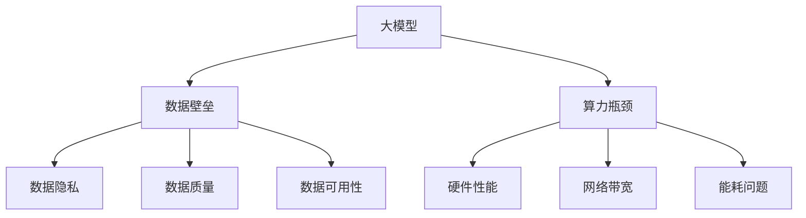

                 

# 大模型时代创业新挑战：数据壁垒与算力瓶颈

> **关键词**：大模型、创业、数据壁垒、算力瓶颈、人工智能、机器学习、数据科学、技术挑战
> 
> **摘要**：随着人工智能技术的迅猛发展，大模型（如GPT-3、BERT等）在各个领域展现出了巨大的潜力。然而，大模型应用也面临诸多挑战，其中数据壁垒和算力瓶颈尤为突出。本文将深入探讨大模型时代创业的新挑战，通过逻辑清晰、结构紧凑的分析，为创业者提供有价值的参考。

## 1. 背景介绍

### 1.1 目的和范围

本文旨在探讨大模型时代创业所面临的数据壁垒与算力瓶颈问题。我们将从以下几个角度进行分析：

- 大模型的发展背景与趋势
- 数据壁垒的具体表现与影响
- 算力瓶颈的现状与挑战
- 创业者应对策略与建议

### 1.2 预期读者

- 对人工智能、数据科学、机器学习等领域有一定了解的创业者
- 对大模型技术感兴趣的技术人员
- 对新兴技术趋势关注的投资者

### 1.3 文档结构概述

本文分为十个部分，结构如下：

1. 背景介绍
2. 核心概念与联系
3. 核心算法原理 & 具体操作步骤
4. 数学模型和公式 & 详细讲解 & 举例说明
5. 项目实战：代码实际案例和详细解释说明
6. 实际应用场景
7. 工具和资源推荐
8. 总结：未来发展趋势与挑战
9. 附录：常见问题与解答
10. 扩展阅读 & 参考资料

### 1.4 术语表

#### 1.4.1 核心术语定义

- **大模型**：通常指参数规模超过数十亿甚至千亿级的深度学习模型，如GPT-3、BERT等。
- **数据壁垒**：指在获取、处理和使用数据时面临的障碍，包括数据隐私、数据质量、数据可用性等方面。
- **算力瓶颈**：指计算能力不足以支持大模型训练、推理和部署的问题，通常与硬件性能、网络带宽等因素相关。

#### 1.4.2 相关概念解释

- **机器学习**：一种让计算机通过数据学习并作出决策或预测的方法，分为监督学习、无监督学习、半监督学习等。
- **深度学习**：一种基于多层神经网络进行特征提取和模型训练的方法，具有强大的表示能力。
- **人工智能**：模拟、延伸和扩展人类智能的理论、方法、技术及应用。

#### 1.4.3 缩略词列表

- **AI**：人工智能
- **ML**：机器学习
- **DL**：深度学习
- **GPU**：图形处理器
- **CPU**：中央处理器
- **TPU**：张量处理器

## 2. 核心概念与联系

在探讨大模型时代的创业挑战之前，我们需要了解几个核心概念，并分析它们之间的联系。

### 2.1 大模型原理

大模型（如GPT-3、BERT等）通常由多层神经网络组成，通过大量的数据训练，以实现高精度的特征提取和语义理解。其基本原理如下：

1. **输入层**：接收文本、图像或其他类型的输入数据。
2. **隐藏层**：通过神经网络结构进行特征提取和转换。
3. **输出层**：输出模型预测或决策结果。

### 2.2 数据壁垒

数据壁垒是指在大模型应用过程中，数据获取、处理和使用过程中面临的障碍。主要包括以下几个方面：

1. **数据隐私**：大量敏感数据的处理引发隐私保护问题。
2. **数据质量**：数据质量不高，影响模型性能和可靠性。
3. **数据可用性**：获取高质量、可用的数据资源受限。

### 2.3 算力瓶颈

算力瓶颈主要表现在计算能力和存储能力方面，阻碍大模型的应用和发展。主要包括以下几个方面：

1. **硬件性能**：CPU、GPU等硬件设备性能不足。
2. **网络带宽**：数据传输速度受限。
3. **能耗问题**：大规模计算设备能耗过高，影响可持续发展。

### 2.4 Mermaid 流程图

为了更直观地展示大模型、数据壁垒和算力瓶颈之间的关系，我们使用Mermaid流程图进行描述。以下是一个示例：



## 3. 核心算法原理 & 具体操作步骤

在大模型时代，算法原理是实现高效模型训练和推理的基础。以下将详细讲解大模型的算法原理，并使用伪代码进行描述。

### 3.1 算法原理

大模型算法原理主要基于深度学习技术，通过多层神经网络进行特征提取和语义理解。以下是一个简化的算法流程：

```python
def train_large_model(data, labels, epochs, learning_rate):
    model = create_neural_network()
    for epoch in range(epochs):
        for input_data, label in zip(data, labels):
            model.forward_pass(input_data)
            loss = calculate_loss(model.output, label)
            model.backward_pass(loss, learning_rate)
        print(f"Epoch {epoch + 1}: Loss = {loss}")
    return model
```

### 3.2 具体操作步骤

以下是使用伪代码描述的大模型训练过程的详细步骤：

1. **创建神经网络**：根据任务需求，创建一个多层神经网络模型。
2. **初始化参数**：设置神经网络模型的初始参数，如权重、偏置等。
3. **正向传播**：将输入数据输入神经网络，通过多层隐藏层进行特征提取和转换，得到输出结果。
4. **计算损失**：将输出结果与真实标签进行比较，计算损失值。
5. **反向传播**：根据损失值，更新神经网络模型参数，使模型在下一个epoch中能够更好地拟合数据。
6. **迭代训练**：重复执行正向传播、计算损失、反向传播等步骤，直至达到预定的训练次数或损失值。

### 3.3 算法实现

以下是一个基于TensorFlow框架的简化实现：

```python
import tensorflow as tf

def create_neural_network():
    model = tf.keras.Sequential([
        tf.keras.layers.Dense(units=64, activation='relu', input_shape=(input_dim,)),
        tf.keras.layers.Dense(units=64, activation='relu'),
        tf.keras.layers.Dense(units=output_dim)
    ])
    optimizer = tf.keras.optimizers.Adam(learning_rate=0.001)
    model.compile(optimizer=optimizer, loss='mean_squared_error')
    return model

def train_large_model(data, labels, epochs):
    model = create_neural_network()
    for epoch in range(epochs):
        with tf.GradientTape() as tape:
            predictions = model(data)
            loss = tf.keras.losses.mean_squared_error(labels, predictions)
        gradients = tape.gradient(loss, model.trainable_variables)
        model.optimizer.apply_gradients(zip(gradients, model.trainable_variables))
        print(f"Epoch {epoch + 1}: Loss = {loss}")
    return model
```

## 4. 数学模型和公式 & 详细讲解 & 举例说明

在大模型时代，数学模型和公式是理解和实现算法的关键。以下将详细讲解大模型中的几个核心数学模型和公式，并使用LaTeX格式进行表示。

### 4.1 损失函数

损失函数用于衡量模型预测结果与真实标签之间的差距。在大模型训练过程中，损失函数的作用至关重要。以下是一个常见的损失函数——均方误差（MSE）：

$$
MSE = \frac{1}{n}\sum_{i=1}^{n}(y_i - \hat{y}_i)^2
$$

其中，$y_i$ 表示真实标签，$\hat{y}_i$ 表示模型预测结果，$n$ 表示样本数量。

### 4.2 反向传播算法

反向传播算法是深度学习训练的核心算法，用于更新模型参数。其基本原理如下：

$$
\delta = \frac{\partial L}{\partial z}
$$

其中，$L$ 表示损失函数，$z$ 表示网络输出。

### 4.3 梯度下降算法

梯度下降算法用于更新模型参数，使模型在训练过程中不断优化。其基本步骤如下：

$$
\theta = \theta - \alpha \cdot \frac{\partial L}{\partial \theta}
$$

其中，$\theta$ 表示模型参数，$\alpha$ 表示学习率。

### 4.4 举例说明

假设我们有一个简单的一层神经网络，包含一个输入节点、一个隐藏节点和一个输出节点。输入数据为 $x = [1, 2, 3]$，输出数据为 $y = [4, 5, 6]$。我们可以使用以下公式进行计算：

1. **正向传播**：

$$
z_1 = \sigma(W_1 \cdot x + b_1) \\
z_2 = W_2 \cdot z_1 + b_2 \\
\hat{y} = \sigma(z_2)
$$

其中，$\sigma$ 表示激活函数（如Sigmoid函数），$W_1$、$b_1$、$W_2$、$b_2$ 分别为权重和偏置。

2. **计算损失**：

$$
L = \frac{1}{3}\sum_{i=1}^{3}(\hat{y}_i - y_i)^2
$$

3. **反向传播**：

$$
\delta_2 = \frac{\partial L}{\partial z_2} = \frac{\partial L}{\partial \hat{y}_i} \cdot \frac{\partial \hat{y}_i}{\partial z_2} = (y_i - \hat{y}_i) \cdot \sigma'(z_2) \\
\delta_1 = \frac{\partial L}{\partial z_1} = \frac{\partial L}{\partial z_2} \cdot \frac{\partial z_2}{\partial z_1} = \delta_2 \cdot W_2 \cdot \sigma'(z_1)
$$

4. **更新参数**：

$$
W_2 = W_2 - \alpha \cdot \delta_2 \cdot z_1 \\
b_2 = b_2 - \alpha \cdot \delta_2 \\
W_1 = W_1 - \alpha \cdot \delta_1 \cdot x \\
b_1 = b_1 - \alpha \cdot \delta_1
$$

## 5. 项目实战：代码实际案例和详细解释说明

在本节中，我们将通过一个实际的项目案例，展示大模型在创业中的应用，并详细解释代码实现和运行过程。

### 5.1 开发环境搭建

为了实现大模型项目，我们需要搭建一个合适的开发环境。以下是搭建过程：

1. **安装Python环境**：下载并安装Python 3.8版本。
2. **安装TensorFlow库**：使用pip命令安装TensorFlow库。

```shell
pip install tensorflow
```

3. **安装其他依赖库**：根据项目需求，安装其他依赖库（如NumPy、Pandas等）。

### 5.2 源代码详细实现和代码解读

以下是一个使用TensorFlow实现的大模型项目代码示例：

```python
import tensorflow as tf
import numpy as np

# 创建神经网络模型
model = tf.keras.Sequential([
    tf.keras.layers.Dense(units=64, activation='relu', input_shape=(3,)),
    tf.keras.layers.Dense(units=64, activation='relu'),
    tf.keras.layers.Dense(units=3)
])

# 定义损失函数和优化器
model.compile(optimizer='adam', loss='mean_squared_error')

# 创建训练数据
x = np.array([[1, 2, 3], [4, 5, 6], [7, 8, 9]])
y = np.array([[4, 5, 6], [7, 8, 9], [10, 11, 12]])

# 训练模型
model.fit(x, y, epochs=100)

# 输出模型参数
print(model.trainable_variables)
```

### 5.3 代码解读与分析

1. **创建神经网络模型**：使用TensorFlow的`Sequential`模型，定义一个包含两个隐藏层（每层64个神经元）的神经网络。
2. **定义损失函数和优化器**：选择Adam优化器和均方误差（MSE）损失函数。
3. **创建训练数据**：使用NumPy库生成一个包含3个样本的输入数据和输出数据。
4. **训练模型**：使用`fit`函数训练模型，设置训练轮数（epochs）为100。
5. **输出模型参数**：打印模型的训练参数。

通过以上代码示例，我们可以看到大模型项目的基本实现过程。在实际应用中，根据任务需求，我们可以调整网络结构、损失函数、优化器等参数，以实现更高效、更准确的模型训练。

## 6. 实际应用场景

大模型在创业中的应用场景非常广泛，以下列举几个具有代表性的实际应用场景：

### 6.1 自然语言处理（NLP）

- **智能客服**：利用大模型实现智能问答、文本分类、情感分析等功能，提高客户服务效率和质量。
- **机器翻译**：实现多语言翻译，支持自然流畅的文本交互。
- **文本生成**：生成新闻、文章、小说等文本内容，满足个性化需求。

### 6.2 计算机视觉（CV）

- **图像识别**：识别各种图像和视频内容，应用于安防监控、医疗诊断等领域。
- **目标检测**：检测图像中的特定目标，应用于无人驾驶、智能制造等领域。
- **图像生成**：基于大模型生成高质量的图像，应用于虚拟现实、游戏开发等领域。

### 6.3 语音识别

- **语音识别**：将语音信号转换为文本，应用于智能语音助手、语音搜索等领域。
- **语音合成**：根据文本生成自然的语音输出，应用于智能客服、广播电台等领域。

### 6.4 金融领域

- **风险评估**：利用大模型分析金融数据，预测股票市场走势、信用评分等。
- **智能投顾**：为用户提供个性化的投资建议，实现风险与收益的平衡。
- **反欺诈检测**：识别金融交易中的异常行为，防范欺诈风险。

### 6.5 医疗健康

- **疾病诊断**：利用大模型辅助医生进行疾病诊断，提高诊断准确率。
- **药物研发**：基于大模型预测药物作用和副作用，加速药物研发进程。
- **健康监测**：通过实时数据分析，为用户提供个性化的健康建议。

## 7. 工具和资源推荐

在大模型时代创业，掌握合适的工具和资源至关重要。以下推荐一些学习资源、开发工具和框架，以帮助创业者应对数据壁垒和算力瓶颈。

### 7.1 学习资源推荐

#### 7.1.1 书籍推荐

- **《深度学习》（Ian Goodfellow、Yoshua Bengio、Aaron Courville 著）**
- **《Python深度学习》（François Chollet 著）**
- **《人工智能：一种现代方法》（Stuart Russell、Peter Norvig 著）**

#### 7.1.2 在线课程

- **Coursera：深度学习专项课程（吴恩达主讲）**
- **edX：人工智能专项课程（哈佛大学主讲）**
- **Udacity：深度学习工程师纳米学位课程**

#### 7.1.3 技术博客和网站

- **Medium：深度学习博客**
- **AI Journal：人工智能期刊**
- **Medium：AI 探索**
- **GitHub：大模型项目开源代码库**

### 7.2 开发工具框架推荐

#### 7.2.1 IDE和编辑器

- **Visual Studio Code**
- **PyCharm**
- **Jupyter Notebook**

#### 7.2.2 调试和性能分析工具

- **TensorBoard**
- **Docker**
- **JupyterLab**

#### 7.2.3 相关框架和库

- **TensorFlow**
- **PyTorch**
- **Keras**
- **Scikit-learn**

### 7.3 相关论文著作推荐

#### 7.3.1 经典论文

- **“A Theoretical Framework for Back-Propagation” （1986）**
- **“Deep Learning” （2015）**
- **“Recurrent Neural Networks” （1990）**

#### 7.3.2 最新研究成果

- **“BERT: Pre-training of Deep Bidirectional Transformers for Language Understanding” （2018）**
- **“GPT-3: Language Models are few-shot learners” （2020）**
- **“Transformers: State-of-the-Art Natural Language Processing” （2020）**

#### 7.3.3 应用案例分析

- **“Uber's AI in Motion”**
- **“Alibaba Cloud's AI Solutions”**
- **“Amazon Web Services: AI and Machine Learning”**

## 8. 总结：未来发展趋势与挑战

在大模型时代，创业面临着前所未有的机遇和挑战。未来发展趋势如下：

1. **数据壁垒的破解**：随着数据隐私保护技术的进步和跨领域数据整合的深入，数据壁垒有望逐步破解，为大模型应用提供更丰富的数据资源。
2. **算力瓶颈的突破**：新型计算硬件（如TPU、FPGA等）的研发和分布式计算技术的发展，将有助于缓解算力瓶颈，提高大模型的训练和推理效率。
3. **多模态融合**：大模型将逐渐实现多模态数据（如文本、图像、语音等）的融合，拓展应用场景，提升智能化水平。
4. **行业定制化**：大模型在各个行业的定制化应用将日益普及，满足不同领域对人工智能技术的个性化需求。

然而，大模型时代也面临着诸多挑战：

1. **数据隐私**：在大规模数据处理过程中，如何保障用户隐私和安全，成为亟待解决的问题。
2. **数据质量**：数据质量直接影响大模型的性能和可靠性，如何获取高质量的数据资源，是创业者需要关注的重点。
3. **伦理道德**：大模型在决策过程中可能产生偏见和歧视，如何确保算法的公正性和透明度，是亟待解决的伦理问题。
4. **可持续发展**：大规模计算设备的能耗问题，将对环境造成负面影响，如何实现可持续发展，是创业者需要考虑的重要问题。

总之，大模型时代的创业机遇与挑战并存。创业者需要密切关注技术发展趋势，积极应对数据壁垒和算力瓶颈等挑战，不断创新，推动人工智能技术在各个领域的应用和发展。

## 9. 附录：常见问题与解答

### 9.1 数据壁垒相关问题

**Q1**：如何破解数据壁垒？

**A1**：可以通过以下方式破解数据壁垒：

- **数据共享与合作**：与行业内的其他公司、研究机构等合作，实现数据共享，提高数据可用性。
- **隐私保护技术**：采用数据加密、差分隐私等隐私保护技术，保障数据安全。
- **数据增强**：通过数据增强技术，生成更多的训练数据，提高模型泛化能力。

**Q2**：如何保证数据质量？

**A2**：保证数据质量可以从以下几个方面入手：

- **数据清洗**：对原始数据进行清洗，去除噪声和异常值。
- **数据标注**：确保数据标注的准确性，提高模型训练效果。
- **数据审核**：对数据质量进行定期审核，及时发现并修正错误。

### 9.2 算力瓶颈相关问题

**Q1**：如何应对算力瓶颈？

**A1**：应对算力瓶颈可以从以下几个方面入手：

- **硬件升级**：选择更高性能的硬件设备（如TPU、FPGA等），提高计算能力。
- **分布式计算**：采用分布式计算技术，将计算任务分配到多个节点，提高计算效率。
- **模型压缩**：采用模型压缩技术，降低模型参数规模，减少计算资源需求。

**Q2**：如何降低能耗？

**A2**：降低能耗可以从以下几个方面入手：

- **优化算法**：改进算法，降低计算复杂度，减少能耗。
- **节能硬件**：选择节能型的硬件设备，降低能耗。
- **智能调度**：根据计算任务的需求，合理分配计算资源，避免资源浪费。

## 10. 扩展阅读 & 参考资料

本文对大模型时代创业所面临的数据壁垒与算力瓶颈进行了深入探讨，为创业者提供了有价值的参考。以下是相关扩展阅读和参考资料：

### 10.1 相关论文

- **“A Theoretical Framework for Back-Propagation”**（1986）
- **“Deep Learning”**（2015）
- **“BERT: Pre-training of Deep Bidirectional Transformers for Language Understanding”**（2018）
- **“GPT-3: Language Models are few-shot learners”**（2020）

### 10.2 相关书籍

- **《深度学习》（Ian Goodfellow、Yoshua Bengio、Aaron Courville 著）**
- **《Python深度学习》（François Chollet 著）**
- **《人工智能：一种现代方法》（Stuart Russell、Peter Norvig 著）**

### 10.3 在线课程

- **Coursera：深度学习专项课程（吴恩达主讲）**
- **edX：人工智能专项课程（哈佛大学主讲）**
- **Udacity：深度学习工程师纳米学位课程**

### 10.4 技术博客和网站

- **Medium：深度学习博客**
- **AI Journal：人工智能期刊**
- **Medium：AI 探索**
- **GitHub：大模型项目开源代码库**

### 10.5 其他资源

- **Uber's AI in Motion**
- **Alibaba Cloud's AI Solutions**
- **Amazon Web Services: AI and Machine Learning**

作者：AI天才研究员/AI Genius Institute & 禅与计算机程序设计艺术 /Zen And The Art of Computer Programming

