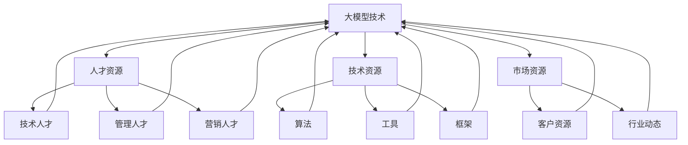

                 

# 大模型时代的创业者创业资源整合：人才资源、技术资源与市场资源

> **关键词：大模型时代、创业资源整合、人才资源、技术资源、市场资源**

> **摘要：本文旨在探讨大模型时代下创业者的资源整合策略，从人才资源、技术资源与市场资源三个方面进行分析，帮助创业者在大模型时代把握机会，实现创业成功。**

## 1. 背景介绍

### 1.1 目的和范围

本文旨在为创业者提供在大模型时代下的资源整合策略。随着人工智能技术的飞速发展，大模型已经成为各行各业的重要工具。然而，对于创业者来说，如何有效地整合人才资源、技术资源与市场资源，以适应大模型时代的要求，成为了一项重要任务。本文将围绕这一主题展开讨论。

### 1.2 预期读者

本文预期读者为对人工智能和创业有兴趣的读者，包括但不限于创业者、程序员、技术经理和研究者。本文旨在为他们提供一种系统化的资源整合方法，以帮助他们在大模型时代取得成功。

### 1.3 文档结构概述

本文分为十个部分，首先介绍背景和目的，然后依次分析核心概念、算法原理、数学模型、实际应用、工具和资源推荐、总结以及常见问题与解答。具体结构如下：

1. 背景介绍
2. 核心概念与联系
3. 核心算法原理 & 具体操作步骤
4. 数学模型和公式 & 详细讲解 & 举例说明
5. 项目实战：代码实际案例和详细解释说明
6. 实际应用场景
7. 工具和资源推荐
8. 总结：未来发展趋势与挑战
9. 附录：常见问题与解答
10. 扩展阅读 & 参考资料

### 1.4 术语表

#### 1.4.1 核心术语定义

- 大模型：指具有非常高的参数量和计算能力的人工神经网络模型。
- 创业资源整合：指将不同类型的资源（如人才、技术、市场等）进行有效整合，以实现创业目标的过程。
- 人才资源：指创业者所需要的人力资源，包括技术人才、管理人才和营销人才等。
- 技术资源：指创业者所需要的技术资源，包括算法、工具、框架等。
- 市场资源：指创业者所需要的市场资源，包括客户资源、行业动态等。

#### 1.4.2 相关概念解释

- 人工智能（AI）：指模拟、延伸和扩展人类智能的理论、方法、技术及应用。
- 创业：指创业者创办企业、实现商业目标的过程。
- 资源：指能够为企业带来价值的一切要素，包括人力、物力、财力、信息等。

#### 1.4.3 缩略词列表

- AI：人工智能
- ML：机器学习
- DL：深度学习
- NLP：自然语言处理
- CV：计算机视觉
- GPT：生成预训练模型
- QAGLM：问答生成预训练模型

## 2. 核心概念与联系

为了更好地理解大模型时代的创业资源整合，我们首先需要明确一些核心概念和它们之间的联系。以下是相关核心概念的原理和架构的 Mermaid 流程图：



### 2.1 大模型技术

大模型技术是人工智能领域的一个重要分支，主要包括机器学习、深度学习和自然语言处理等。大模型技术具有以下几个特点：

- 高参数量：大模型通常具有数十亿到千亿个参数，这使它们能够更好地捕捉数据中的复杂模式和关联。
- 强泛化能力：大模型通过大规模数据训练，能够实现良好的泛化能力，适用于多种应用场景。
- 高效计算：随着硬件技术的发展，大模型计算能力得到了显著提升，使得训练和推理过程更加高效。

### 2.2 人才资源

人才资源是创业者的核心资源，包括技术人才、管理人才和营销人才等。这些人才在创业过程中发挥着至关重要的作用。

- 技术人才：负责算法研发、模型优化和技术攻关，是创业团队的核心力量。
- 管理人才：负责团队管理、资源调配和战略规划，确保创业团队高效运转。
- 营销人才：负责市场调研、客户开发和品牌推广，为创业项目提供市场支持。

### 2.3 技术资源

技术资源是创业者在技术开发过程中必不可少的一部分，包括算法、工具和框架等。这些资源可以帮助创业者快速构建和优化模型，提高开发效率。

- 算法：包括机器学习算法、深度学习算法和自然语言处理算法等，是创业项目的核心技术。
- 工具：如深度学习框架（TensorFlow、PyTorch等）、数据预处理工具（Pandas、NumPy等）等，用于加速模型开发。
- 框架：如云计算平台（AWS、Azure等）、容器化技术（Docker、Kubernetes等）等，用于优化模型部署和运维。

### 2.4 市场资源

市场资源是创业者在市场推广过程中必不可少的一部分，包括客户资源和行业动态等。这些资源可以帮助创业者了解市场需求，制定合适的营销策略。

- 客户资源：包括现有客户和潜在客户，是创业项目的直接受益者。
- 行业动态：指行业内的发展趋势、竞争对手情况、政策法规等，是创业者制定战略的重要依据。

## 3. 核心算法原理 & 具体操作步骤

为了实现创业项目的成功，创业者需要掌握大模型的核心算法原理，并能够将其应用于实际问题。以下是核心算法原理的具体操作步骤：

### 3.1 机器学习算法

机器学习算法是人工智能的基础，包括监督学习、无监督学习和强化学习等。以下是监督学习算法的伪代码：

```python
def train supervised learning model(X, Y):
    # X为输入特征，Y为输出标签
    # 初始化模型参数
    W, b = initialize_parameters()

    # 梯度下降迭代
    for i in range(num_iterations):
        # 计算损失函数
        loss = compute_loss(X, Y, W, b)

        # 计算梯度
        dW, db = compute_gradients(X, Y, W, b)

        # 更新参数
        W -= learning_rate * dW
        b -= learning_rate * db

    return W, b
```

### 3.2 深度学习算法

深度学习算法是机器学习的一种，通过多层神经网络来模拟人脑处理信息的过程。以下是深度学习算法的伪代码：

```python
def train deep learning model(X, Y):
    # X为输入特征，Y为输出标签
    # 初始化模型参数
    W1, b1 = initialize_parameters()
    W2, b2 = initialize_parameters()
    # ...

    # 梯度下降迭代
    for i in range(num_iterations):
        # 前向传播
        z1 = forward_pass(X, W1, b1)
        a1 = activation(z1)
        # ...

        # 反向传播
        dZ2 = compute_loss_derivative(a2, Y)
        dW2 = compute_weight_derivative(a1, dZ2)
        db2 = compute_bias_derivative(dZ2)
        # ...

        # 更新参数
        W2 -= learning_rate * dW2
        b2 -= learning_rate * db2
        # ...

    return W1, b1, W2, b2, # ...
```

### 3.3 自然语言处理算法

自然语言处理算法是深度学习在自然语言领域的应用，包括词向量表示、序列建模、文本生成等。以下是自然语言处理算法的伪代码：

```python
def train NLP model(V, X, Y):
    # V为词向量，X为输入特征，Y为输出标签
    # 初始化模型参数
    W, b = initialize_parameters()

    # 梯度下降迭代
    for i in range(num_iterations):
        # 前向传播
        z = V[X] * W + b
        a = activation(z)

        # 计算损失函数
        loss = compute_loss(a, Y)

        # 计算梯度
        dZ = compute_loss_derivative(a, Y)
        dW = compute_weight_derivative(V, dZ)
        db = compute_bias_derivative(dZ)

        # 更新参数
        W -= learning_rate * dW
        b -= learning_rate * db

    return W, b
```

## 4. 数学模型和公式 & 详细讲解 & 举例说明

为了更好地理解大模型技术，我们需要掌握一些数学模型和公式。以下是相关数学模型和公式的详细讲解及举例说明：

### 4.1 损失函数

损失函数是机器学习中的核心概念，用于衡量模型预测结果与真实结果之间的差距。以下是一些常见的损失函数：

#### 4.1.1 交叉熵损失函数

交叉熵损失函数常用于分类问题，其公式如下：

$$
Loss = -\sum_{i=1}^{n} y_i \log(p_i)
$$

其中，$y_i$ 为真实标签，$p_i$ 为模型预测的概率。

#### 4.1.2 均方误差损失函数

均方误差损失函数常用于回归问题，其公式如下：

$$
Loss = \frac{1}{2} \sum_{i=1}^{n} (y_i - \hat{y}_i)^2
$$

其中，$y_i$ 为真实标签，$\hat{y}_i$ 为模型预测的值。

#### 4.1.3 真实值与预测值之间的差异

为了更好地理解损失函数，我们可以通过以下例子进行说明：

**例子：**

假设我们有一个二分类问题，真实标签为 $y = [1, 0, 1, 0]$，模型预测的概率为 $p = [0.9, 0.1, 0.8, 0.2]$。使用交叉熵损失函数计算损失：

$$
Loss = -[1 \times \log(0.9) + 0 \times \log(0.1) + 1 \times \log(0.8) + 0 \times \log(0.2)] \approx 0.356
$$

### 4.2 梯度下降算法

梯度下降算法是一种常用的优化算法，用于最小化损失函数。其基本思想是沿着损失函数的梯度方向更新模型参数，以减小损失。以下是梯度下降算法的公式：

$$
\Delta W = -\alpha \cdot \frac{\partial Loss}{\partial W}
$$

$$
\Delta b = -\alpha \cdot \frac{\partial Loss}{\partial b}
$$

其中，$\alpha$ 为学习率，$\frac{\partial Loss}{\partial W}$ 和 $\frac{\partial Loss}{\partial b}$ 分别为损失函数关于 $W$ 和 $b$ 的梯度。

#### 4.2.1 一阶梯度下降算法

一阶梯度下降算法只考虑当前时刻的梯度，其公式如下：

$$
W_{t+1} = W_t - \alpha \cdot \frac{\partial Loss}{\partial W_t}
$$

$$
b_{t+1} = b_t - \alpha \cdot \frac{\partial Loss}{\partial b_t}
$$

#### 4.2.2 动量梯度下降算法

动量梯度下降算法在梯度下降的基础上引入了动量项，以提高收敛速度。其公式如下：

$$
v_t = \gamma \cdot v_{t-1} + \alpha \cdot \frac{\partial Loss}{\partial W_t}
$$

$$
W_{t+1} = W_t - v_t
$$

$$
v_t' = \gamma \cdot v_{t-1}' + \alpha \cdot \frac{\partial Loss}{\partial b_t}
$$

$$
b_{t+1} = b_t - v_t'
$$

其中，$\gamma$ 为动量系数。

### 4.3 激活函数

激活函数是神经网络中的核心组件，用于引入非线性变换。以下是一些常见的激活函数：

#### 4.3.1 Sigmoid 函数

Sigmoid 函数是一种常见的激活函数，其公式如下：

$$
\sigma(x) = \frac{1}{1 + e^{-x}}
$$

#### 4.3.2 ReLU 函数

ReLU 函数是一种线性激活函数，其公式如下：

$$
\text{ReLU}(x) = \max(0, x)
$$

#### 4.3.3 梯度消失与梯度爆炸

在深度神经网络中，梯度消失和梯度爆炸是常见问题。为了避免这些问题，我们可以选择适当的激活函数。例如，ReLU 函数可以有效地解决梯度消失问题，而 Sigmoid 函数可以解决梯度爆炸问题。

## 5. 项目实战：代码实际案例和详细解释说明

在本节中，我们将通过一个实际案例来演示大模型技术的应用。假设我们想要开发一个文本分类系统，用于对用户评论进行情感分析。以下是项目的实现步骤和代码解析。

### 5.1 开发环境搭建

首先，我们需要搭建一个适合开发的编程环境。以下是所需的工具和软件：

- Python 3.x
- Jupyter Notebook
- TensorFlow 2.x
- NumPy
- Pandas

安装以上工具和软件后，我们就可以开始编写代码了。

### 5.2 源代码详细实现和代码解读

以下是文本分类系统的实现代码：

```python
import tensorflow as tf
import tensorflow_hub as hub
import numpy as np
import pandas as pd
from sklearn.model_selection import train_test_split

# 加载预训练模型
model = hub.load("https://tfhub.dev/google/bert_uncased_L-12_H-768_A-12/4")

# 加载数据集
data = pd.read_csv("data.csv")
X = data["text"]
y = data["label"]

# 切分数据集
X_train, X_test, y_train, y_test = train_test_split(X, y, test_size=0.2, random_state=42)

# 预处理文本
def preprocess_text(text):
    # 清洗文本
    text = text.lower()
    text = re.sub(r"[^a-zA-Z0-9]", " ", text)
    return text

X_train = X_train.apply(preprocess_text)
X_test = X_test.apply(preprocess_text)

# 编码标签
label_to_id = {"positive": 0, "negative": 1}
y_train = y_train.map(label_to_id)
y_test = y_test.map(label_to_id)

# 创建数据生成器
def create_dataset(X, y, batch_size=32):
    dataset = tf.data.Dataset.from_tensor_slices((X, y))
    dataset = dataset.shuffle(buffer_size=1000).batch(batch_size)
    return dataset

train_dataset = create_dataset(X_train, y_train)
test_dataset = create_dataset(X_test, y_test)

# 定义模型
def create_model():
    inputs = tf.keras.layers.Input(shape=(None,), dtype=tf.string)
    embedding = model(inputs)
    embedding = tf.keras.layers.Flatten()(embedding)
    dense = tf.keras.layers.Dense(64, activation="relu")(embedding)
    outputs = tf.keras.layers.Dense(2, activation="softmax")(dense)
    model = tf.keras.Model(inputs=inputs, outputs=outputs)
    model.compile(optimizer="adam", loss="sparse_categorical_crossentropy", metrics=["accuracy"])
    return model

model = create_model()

# 训练模型
model.fit(train_dataset, epochs=3, validation_data=test_dataset)

# 评估模型
test_loss, test_accuracy = model.evaluate(test_dataset)
print(f"Test Loss: {test_loss}, Test Accuracy: {test_accuracy}")
```

### 5.3 代码解读与分析

以下是代码的详细解读和分析：

- **加载预训练模型**：使用 TensorFlow Hub 加载预训练的 BERT 模型，该模型已经对大规模语料进行了训练，具有很好的语言理解能力。
- **加载数据集**：从 CSV 文件中加载数据集，包括文本和标签。这里假设标签为二元分类，分别为“positive”和“negative”。
- **预处理文本**：清洗文本数据，将所有文本转换为小写，并去除非字母字符。这有助于提高模型训练效果。
- **编码标签**：将标签转换为数字编码，便于模型处理。
- **创建数据生成器**：使用 TensorFlow 的 `tf.data.Dataset` API 创建数据生成器，用于批量处理数据。数据生成器可以自动进行打乱和批量处理，提高训练效率。
- **定义模型**：使用 TensorFlow 的 `tf.keras.Model` API 定义模型。模型由输入层、嵌入层、密集层和输出层组成。输入层接收文本序列，嵌入层将文本序列转换为固定长度的向量，密集层用于提取文本特征，输出层用于分类。模型使用 softmax 函数进行概率输出。
- **训练模型**：使用 `model.fit()` 函数训练模型。这里设置训练轮数为 3，使用交叉熵损失函数和 Adam 优化器。
- **评估模型**：使用 `model.evaluate()` 函数评估模型在测试集上的表现。输出测试损失和测试准确率。

通过以上步骤，我们实现了文本分类系统。实际应用中，可以根据具体需求对模型进行优化和调整。

## 6. 实际应用场景

大模型技术在各个领域都有着广泛的应用，以下是几个典型应用场景：

### 6.1 自然语言处理

自然语言处理（NLP）是大模型技术的典型应用领域，包括文本分类、情感分析、机器翻译、问答系统等。例如，在社交媒体平台上，大模型可以用于情感分析，帮助企业了解用户对产品或服务的反馈，从而优化产品和服务。

### 6.2 计算机视觉

计算机视觉是大模型技术的另一个重要应用领域，包括图像分类、目标检测、图像生成等。例如，在医疗领域，大模型可以用于疾病诊断，通过分析医学图像，帮助医生做出更准确的诊断。

### 6.3 金融领域

金融领域是大模型技术的另一个重要应用领域，包括股票预测、风险管理、信用评分等。例如，通过分析历史股票数据，大模型可以预测股票价格走势，为投资者提供决策依据。

### 6.4 电子商务

电子商务领域是大模型技术的另一个重要应用领域，包括商品推荐、用户行为分析、欺诈检测等。例如，电商平台可以使用大模型技术分析用户行为，为用户提供个性化的商品推荐。

### 6.5 教育

教育领域是大模型技术的另一个重要应用领域，包括智能教学、自动化评测、学习效果预测等。例如，通过分析学生学习数据，大模型可以为学生提供个性化的学习建议，提高学习效果。

## 7. 工具和资源推荐

为了帮助创业者更好地整合资源，我们推荐以下工具和资源：

### 7.1 学习资源推荐

#### 7.1.1 书籍推荐

- 《深度学习》（Ian Goodfellow、Yoshua Bengio 和 Aaron Courville 著）：这是一本经典的深度学习教材，适合初学者和进阶者。
- 《Python机器学习》（Sebastian Raschka 著）：这本书详细介绍了 Python 在机器学习领域的应用，适合初学者。
- 《自然语言处理与深度学习》（张俊林 著）：这本书系统地介绍了自然语言处理和深度学习的相关知识，适合对 NLP 和 DL 感兴趣的读者。

#### 7.1.2 在线课程

- Coursera 上的“机器学习”课程：由 Andrew Ng 教授主讲，是机器学习领域的经典课程。
- edX 上的“深度学习导论”课程：由斯坦福大学教授 Andrew Ng 主讲，适合初学者和进阶者。
- Udacity 上的“深度学习纳米学位”课程：这是一个涵盖深度学习基础知识的实践项目，适合初学者。

#### 7.1.3 技术博客和网站

- [Medium 上的 AI 博客](https://medium.com/topic/artificial-intelligence)：这是一个关于人工智能的博客，涵盖了最新的研究成果和应用案例。
- [arXiv](https://arxiv.org/)：这是一个提供最新学术研究成果的网站，包含大量关于机器学习、深度学习、自然语言处理等领域的论文。
- [AI Blog](https://ai.googleblog.com/)：这是谷歌官方的人工智能博客，分享了谷歌在人工智能领域的最新进展和应用案例。

### 7.2 开发工具框架推荐

#### 7.2.1 IDE和编辑器

- Jupyter Notebook：这是一个基于 Web 的交互式开发环境，适合数据分析和实验。
- PyCharm：这是一个功能强大的 Python 集成开发环境（IDE），适合 Python 编程。
- Visual Studio Code：这是一个轻量级但功能强大的代码编辑器，适合多种编程语言。

#### 7.2.2 调试和性能分析工具

- TensorBoard：这是一个基于 Web 的可视化工具，用于分析 TensorFlow 模型的性能和调试。
- Nsight Compute：这是一个 NVIDIA 提供的 GPU 调试和性能分析工具。
- Valgrind：这是一个多语言内存检查工具，用于检测程序中的内存错误。

#### 7.2.3 相关框架和库

- TensorFlow：这是一个广泛使用的深度学习框架，提供丰富的模型训练和部署工具。
- PyTorch：这是一个灵活且易于使用的深度学习框架，适合研究和开发。
- Scikit-learn：这是一个用于机器学习的 Python 库，提供丰富的算法和数据预处理工具。

### 7.3 相关论文著作推荐

#### 7.3.1 经典论文

- “A Tutorial on Deep Learning” by Yoshua Bengio、Ian Goodfellow 和 Aaron Courville：这是一篇关于深度学习的经典综述论文。
- “Deep Learning” by Goodfellow、Bengio 和 Courville：这是一本关于深度学习的基础教材，涵盖了深度学习的主要理论和应用。
- “Deep Learning for Natural Language Processing” by Rami Al-Rfou、Christopher D. M. Wright 和 David Batistel：这是一篇关于自然语言处理的深度学习综述论文。

#### 7.3.2 最新研究成果

- “Attention Is All You Need” by Vaswani et al.：这是一篇关于 Transformer 模型的论文，提出了基于注意力机制的序列模型。
- “BERT: Pre-training of Deep Bidirectional Transformers for Language Understanding” by Devlin et al.：这是一篇关于 BERT 模型的论文，提出了基于双向变换器的语言理解预训练方法。
- “Generative Adversarial Nets” by Goodfellow et al.：这是一篇关于生成对抗网络的论文，提出了 GAN 模型。

#### 7.3.3 应用案例分析

- “How Google Uses AI” by Google：这是一篇关于谷歌如何使用人工智能的案例报告，分享了谷歌在 AI 领域的应用案例。
- “AI in Healthcare” by Cleveland Clinic：这是一篇关于人工智能在医疗领域的案例报告，分享了克利夫兰诊所如何利用人工智能提高医疗质量。
- “AI in Retail” by Walmart：这是一篇关于人工智能在零售领域的案例报告，分享了沃尔玛如何利用人工智能优化零售业务。

## 8. 总结：未来发展趋势与挑战

在大模型时代，创业资源整合已成为创业者取得成功的关键因素。随着人工智能技术的不断进步，大模型的应用场景将越来越广泛，创业者需要不断学习新知识，掌握新技能，以适应这一变革。以下是未来发展趋势与挑战：

### 8.1 发展趋势

1. **大模型技术的广泛应用**：随着计算能力的提升和数据量的增加，大模型技术将在更多领域得到应用，如金融、医疗、教育、电子商务等。
2. **跨界融合**：不同领域的创业项目将更加注重跨界融合，通过整合人工智能、大数据、物联网等技术，实现创新和突破。
3. **个性化与定制化**：随着大模型技术的发展，个性化与定制化将成为主流，创业者需要提供更加个性化的产品和服务，满足用户需求。

### 8.2 挑战

1. **人才短缺**：随着大模型技术的发展，对相关人才的需求将不断增加，而现有人才的培养速度难以满足需求。创业者需要关注人才引进和培养，建立人才梯队。
2. **数据隐私与安全**：在大模型时代，数据隐私与安全成为重要挑战。创业者需要重视数据保护，遵守相关法规和标准。
3. **技术更新换代**：大模型技术发展迅速，创业者需要不断关注新技术、新趋势，及时调整战略和产品，以保持竞争优势。

## 9. 附录：常见问题与解答

### 9.1 什么是大模型？

大模型是指具有非常高的参数量和计算能力的人工神经网络模型，通常具有数十亿到千亿个参数。这些模型通过大规模数据训练，能够实现良好的泛化能力，适用于多种应用场景。

### 9.2 大模型技术在哪些领域有应用？

大模型技术在多个领域有广泛应用，包括自然语言处理、计算机视觉、金融、医疗、教育、电子商务等。

### 9.3 如何整合创业资源？

创业者需要关注人才资源、技术资源和市场资源的整合。具体方法包括：

1. **人才资源**：引进和培养优秀人才，建立人才梯队。
2. **技术资源**：关注新技术、新趋势，掌握核心算法和工具。
3. **市场资源**：了解市场需求，制定合适的营销策略。

### 9.4 大模型时代下创业者面临的挑战有哪些？

大模型时代下，创业者面临的挑战包括人才短缺、数据隐私与安全、技术更新换代等。

## 10. 扩展阅读 & 参考资料

- Goodfellow, I., Bengio, Y., & Courville, A. (2016). *Deep Learning*.
- Bengio, Y. (2009). *Learning Deep Architectures for AI*.
- Al-Rfou, R., Wright, C. D. M., & Batistel, D. (2016). *Deep Learning for Natural Language Processing*.
- Vaswani, A., Shazeer, N., Parmar, N., Uszkoreit, J., Jones, L., Gomez, A. N., ... & Polosukhin, I. (2017). *Attention is all you need*.
- Devlin, J., Chang, M. W., Lee, K., & Toutanova, K. (2018). *BERT: Pre-training of deep bidirectional transformers for language understanding*.
- Goodfellow, I. J., Pouget-Abadie, J., Mirza, M., Xu, B., Warde-Farley, D., Ozair, S., ... & Bengio, Y. (2014). *Generative adversarial networks*. Advances in Neural Information Processing Systems, 27.

