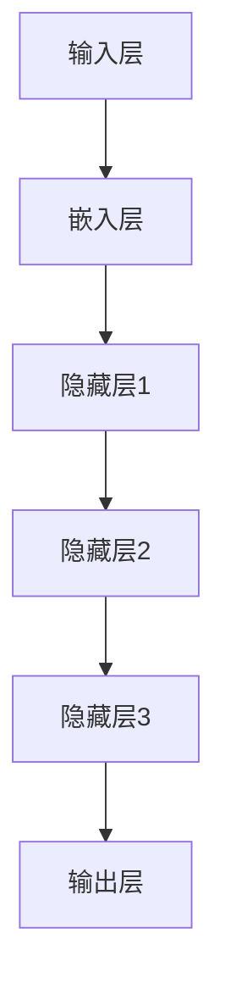
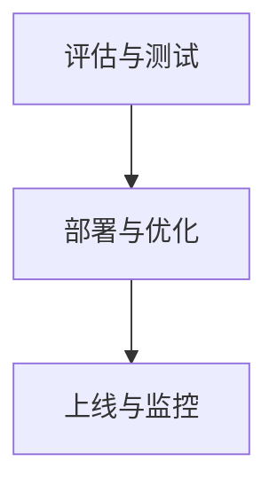

                 

# 大模型时代的创业者创业路演技巧：故事、数据与演示

> **关键词：** 大模型、创业路演、故事、数据、演示
>
> **摘要：** 本文将深入探讨在大模型时代背景下，创业者如何通过构建引人入胜的故事、运用有力的数据以及精准的演示技巧来提升创业路演的效果，从而赢得投资者的青睐。

## 1. 背景介绍

### 1.1 目的和范围

本文旨在为创业者提供一套系统的创业路演技巧，特别是在当前大模型时代背景下，帮助创业者更好地展示自己的项目和技术，从而吸引投资者的关注。我们将从故事、数据和演示三个核心方面进行深入探讨，以提升创业路演的吸引力。

### 1.2 预期读者

本文适合于准备进行创业路演的创业者、希望提升路演效果的初创公司团队、以及关注创业投资的专业人士。

### 1.3 文档结构概述

本文将分为以下几个部分：

1. **背景介绍**：简要介绍本文的目的、范围和预期读者。
2. **核心概念与联系**：讲解大模型的基本概念及其与创业的关系。
3. **核心算法原理 & 具体操作步骤**：详细阐述大模型的算法原理和操作步骤。
4. **数学模型和公式 & 详细讲解 & 举例说明**：介绍大模型相关的数学模型和公式，并通过具体案例进行说明。
5. **项目实战：代码实际案例和详细解释说明**：通过实际案例展示大模型的应用。
6. **实际应用场景**：探讨大模型在不同行业中的应用。
7. **工具和资源推荐**：推荐学习资源、开发工具和框架。
8. **总结：未来发展趋势与挑战**：总结本文内容，并对未来趋势和挑战进行展望。
9. **附录：常见问题与解答**：解答读者可能遇到的常见问题。
10. **扩展阅读 & 参考资料**：提供进一步学习的资源链接。

### 1.4 术语表

#### 1.4.1 核心术语定义

- **大模型**：指拥有海量参数的深度学习模型，如GPT、BERT等。
- **创业路演**：创业者向潜在投资者展示项目和技术，争取资金支持的过程。
- **故事**：通过生动的叙述，展示项目的背景、愿景和独特性。
- **数据**：使用量化的数据来支持故事和演示，增强说服力。
- **演示**：通过视觉化手段，如PPT、图表等，展示项目的核心功能和价值。

#### 1.4.2 相关概念解释

- **数据可视化**：将数据以图形、图表等形式呈现，便于理解和分析。
- **投资者关系**：企业与投资者之间的互动和沟通，包括路演、投资谈判等。

#### 1.4.3 缩略词列表

- **GPT**：Generative Pre-trained Transformer
- **BERT**：Bidirectional Encoder Representations from Transformers
- **IDE**：Integrated Development Environment
- **API**：Application Programming Interface

## 2. 核心概念与联系

大模型作为当前人工智能领域的重要突破，已经深刻影响了各行各业。创业者在创业路演中，需要准确理解大模型的基本概念及其在业务中的应用，从而更好地向投资者展示项目的潜力和价值。

### 2.1 大模型的基本概念

大模型是指那些拥有数百万至上亿个参数的深度学习模型。这些模型通常通过大量的数据预先训练，然后可以用于各种复杂的任务，如自然语言处理、图像识别、语音识别等。

#### 2.1.1 大模型的起源与发展

大模型的兴起可以追溯到2012年，当深度学习在图像识别任务中取得了突破性的成果时。此后，随着计算能力的提升和数据量的增加，大模型的规模和性能也在不断进步。

#### 2.1.2 大模型的关键技术

- **深度神经网络（DNN）**：大模型的基础，通过多层神经网络对数据进行学习。
- **预训练（Pre-training）**：在大规模数据集上对模型进行预训练，使其具备一定的通用性。
- **微调（Fine-tuning）**：在特定任务上对预训练模型进行微调，以适应具体应用。

### 2.2 大模型与创业的关系

大模型的出现为创业者提供了强大的技术支持，使其能够开发出更智能、更高效的产品和服务。

#### 2.2.1 大模型对创业的促进作用

- **提升创新能力**：大模型可以处理复杂的数据，为创业者提供创新的思路和方法。
- **降低门槛**：大模型的开源和商业化应用降低了创业者在人工智能领域的入门门槛。
- **增强竞争力**：利用大模型开发的智能产品和服务，可以提升企业在市场中的竞争力。

#### 2.2.2 大模型对创业的挑战

- **技术门槛**：大模型需要强大的计算资源和专业的技术团队支持，这对初创公司来说是一个挑战。
- **数据隐私和安全**：大模型在处理大量数据时，可能涉及用户隐私和信息安全问题。

### 2.3 大模型的架构原理

大模型的架构通常包括以下几个核心部分：

1. **输入层**：接收外部数据，如文本、图像、声音等。
2. **隐藏层**：通过多层神经网络进行数据学习和特征提取。
3. **输出层**：根据学习到的特征进行预测或决策。

#### 2.3.1 输入层的处理

输入层通常使用嵌入（Embedding）技术将外部数据转化为稠密向量表示。例如，在自然语言处理中，单词会被映射到一个固定大小的向量。



#### 2.3.2 隐藏层的处理

隐藏层通过激活函数（如ReLU、Sigmoid等）对输入数据进行非线性变换，从而提取特征。每一层都可以看作是一个特征提取器。

#### 2.3.3 输出层的处理

输出层根据隐藏层提供的特征进行预测或决策。例如，在分类任务中，输出层可以是一个softmax层，用于计算每个类别的概率。

### 2.4 大模型的训练与优化

大模型的训练是一个复杂的过程，涉及参数初始化、损失函数选择、优化算法等。

#### 2.4.1 参数初始化

参数初始化是训练过程中的关键步骤。常用的初始化方法包括高斯分布初始化、Xavier初始化等。

#### 2.4.2 损失函数

损失函数用于衡量模型预测值与真实值之间的差距。常用的损失函数包括均方误差（MSE）、交叉熵等。

#### 2.4.3 优化算法

优化算法用于调整模型参数，以最小化损失函数。常用的优化算法包括随机梯度下降（SGD）、Adam等。

### 2.5 大模型的评估与部署

大模型的评估主要通过交叉验证、测试集等方法进行。部署方面，创业者需要考虑模型的大小、计算资源、实时性等因素。



通过以上对大模型核心概念与联系的阐述，创业者可以更好地理解大模型的基本原理和应用，为后续的路演做好准备。

## 3. 核心算法原理 & 具体操作步骤

在了解了大模型的基本概念和架构之后，创业者需要掌握大模型的算法原理和具体操作步骤，以便在创业路演中能够清晰、准确地展示项目的技术优势。

### 3.1 大模型算法原理

大模型的核心在于其深度学习的算法原理。以下是深度学习算法的基本原理和主要步骤：

#### 3.1.1 深度学习算法原理

深度学习算法基于多层神经网络（Neural Networks），通过学习大量数据中的特征来完成任务。神经网络由输入层、隐藏层和输出层组成，各层之间通过权重（weights）和偏置（biases）连接。

1. **输入层**：接收输入数据，并将其传递给隐藏层。
2. **隐藏层**：通过激活函数（如ReLU、Sigmoid、Tanh等）对输入数据进行非线性变换，提取特征。
3. **输出层**：根据隐藏层提供的特征进行预测或决策。

#### 3.1.2 大模型的训练过程

大模型的训练过程主要包括以下几个步骤：

1. **数据预处理**：对输入数据进行清洗、归一化等处理，使其符合模型的输入要求。
2. **模型初始化**：初始化模型的权重和偏置，常用的初始化方法包括高斯分布初始化、Xavier初始化等。
3. **前向传播**：将输入数据通过模型进行传递，计算每个节点的输出。
4. **反向传播**：计算损失函数的梯度，并通过优化算法更新模型参数。
5. **评估与迭代**：使用验证集对模型进行评估，并根据评估结果调整模型参数，重复训练过程。

### 3.2 大模型的训练步骤

以下是使用Python和TensorFlow框架进行大模型训练的伪代码示例：

```python
# 导入必要的库
import tensorflow as tf
from tensorflow.keras.layers import Dense, LSTM, Embedding
from tensorflow.keras.models import Sequential

# 定义模型
model = Sequential()
model.add(Embedding(vocab_size, embedding_dim))
model.add(LSTM(units=128, activation='relu'))
model.add(Dense(units=1, activation='sigmoid'))

# 编译模型
model.compile(optimizer='adam', loss='binary_crossentropy', metrics=['accuracy'])

# 训练模型
model.fit(train_data, train_labels, epochs=10, batch_size=64, validation_split=0.2)
```

#### 3.2.1 数据预处理

在训练大模型之前，需要对输入数据进行预处理。以下是一个数据预处理的伪代码示例：

```python
# 加载数据集
train_data, train_labels = load_data()

# 将文本数据转换为单词向量
word_vectors = load_word_vectors()

# 将文本数据转换为嵌入向量
train_embedded_data = [word_vectors[word] for word in train_data]

# 将嵌入向量转换为TensorFlow张量
train_data_tensor = tf.convert_to_tensor(train_embedded_data, dtype=tf.float32)

# 对标签进行编码
train_labels_tensor = tf.convert_to_tensor(train_labels, dtype=tf.float32)
```

#### 3.2.2 模型评估

在模型训练完成后，需要使用验证集或测试集对模型进行评估，以确保模型的泛化能力。以下是一个模型评估的伪代码示例：

```python
# 评估模型
test_loss, test_accuracy = model.evaluate(test_data, test_labels)

# 输出评估结果
print(f"Test Loss: {test_loss}, Test Accuracy: {test_accuracy}")
```

#### 3.2.3 模型部署

在完成模型训练和评估后，可以将模型部署到生产环境，以便在实际应用中进行预测。以下是一个模型部署的伪代码示例：

```python
# 部署模型
model.save('model.h5')

# 加载模型
loaded_model = tf.keras.models.load_model('model.h5')

# 进行预测
predictions = loaded_model.predict(new_data)
```

通过以上步骤，创业者可以在路演中清晰地展示大模型的算法原理和训练过程，从而增强项目的可信度和吸引力。

### 3.3 大模型的应用场景

大模型的应用场景广泛，以下是一些典型应用：

#### 3.3.1 自然语言处理（NLP）

- **文本分类**：对大量文本数据进行分类，如新闻分类、情感分析等。
- **机器翻译**：将一种语言的文本翻译成另一种语言。
- **问答系统**：根据用户提问，提供准确的答案。

#### 3.3.2 图像识别

- **图像分类**：对输入图像进行分类，如人脸识别、物体识别等。
- **图像生成**：根据输入的文本或图像，生成新的图像。

#### 3.3.3 语音识别

- **语音转文本**：将语音信号转换成文本。
- **语音合成**：根据文本生成语音。

#### 3.3.4 医疗诊断

- **疾病预测**：根据患者的病历数据，预测患者可能患有的疾病。
- **药物发现**：通过分析生物数据，发现新的药物分子。

#### 3.3.5 自动驾驶

- **环境感知**：通过摄像头和传感器感知周围环境，进行路径规划。
- **决策与控制**：根据环境感知结果，做出驾驶决策。

### 3.4 大模型的挑战与优化

尽管大模型在许多领域取得了显著的成果，但其在实际应用中仍面临一些挑战：

#### 3.4.1 计算资源需求

大模型的训练和推理需要大量的计算资源，这对初创公司来说是一个巨大的挑战。

#### 3.4.2 数据质量和隐私

大模型对数据的质量和隐私要求很高，数据的不完整、错误和隐私泄露可能对模型性能产生负面影响。

#### 3.4.3 模型解释性

大模型的决策过程复杂，缺乏透明性和解释性，这在某些应用场景中可能是一个问题。

#### 3.4.4 模型优化

为了提高大模型的应用效果，需要不断进行优化，包括模型结构、训练算法、数据预处理等方面。

通过以上对大模型算法原理和具体操作步骤的详细讲解，创业者可以在路演中充分展示大模型的技术实力，增强项目的吸引力。

### 4. 数学模型和公式 & 详细讲解 & 举例说明

在大模型时代，理解相关的数学模型和公式对于创业者来说至关重要。这些模型和公式不仅有助于解释大模型的工作原理，还能帮助投资者更好地理解技术细节。以下我们将详细讲解大模型中的一些核心数学模型和公式，并通过具体案例进行说明。

#### 4.1 深度学习基础公式

深度学习的基础公式包括激活函数、损失函数和优化算法。以下是对这些公式及其应用的详细解释。

##### 4.1.1 激活函数

激活函数是深度神经网络中的一个关键组件，它对隐藏层的输出进行非线性变换，从而提取特征。常见的激活函数包括：

- **ReLU（Rectified Linear Unit）**:

  $$ a(x) = \max(0, x) $$

 ReLU函数在x大于0时返回x，小于0时返回0。它解决了Sigmoid和Tanh函数梯度消失的问题，有助于加快训练过程。

- **Sigmoid**:

  $$ a(x) = \frac{1}{1 + e^{-x}} $$

  Sigmoid函数将输入值映射到(0, 1)区间，常用于二分类问题。

- **Tanh**:

  $$ a(x) = \frac{e^x - e^{-x}}{e^x + e^{-x}} $$

  Tanh函数类似于Sigmoid函数，但将输出值映射到(-1, 1)区间，有助于提高模型的收敛速度。

##### 4.1.2 损失函数

损失函数用于衡量模型预测值与真实值之间的差距，是优化模型参数的关键。以下是一些常见的损失函数：

- **均方误差（MSE）**:

  $$ L(y, \hat{y}) = \frac{1}{n}\sum_{i=1}^{n}(y_i - \hat{y_i})^2 $$

  MSE用于回归问题，衡量预测值与真实值之间的平均平方误差。

- **交叉熵（Cross-Entropy）**:

  $$ L(y, \hat{y}) = -\sum_{i=1}^{n}y_i\log(\hat{y_i}) $$

  交叉熵用于分类问题，衡量预测概率与真实概率之间的差距。

##### 4.1.3 优化算法

优化算法用于调整模型参数，以最小化损失函数。以下是一些常用的优化算法：

- **随机梯度下降（SGD）**:

  $$ \theta = \theta - \alpha \nabla_{\theta}J(\theta) $$

  SGD通过随机选择样本更新模型参数，有助于提高训练效率。

- **Adam优化器**:

  $$ m_t = \beta_1m_{t-1} + (1 - \beta_1)(\nabla J(\theta)^T x_t) $$
  $$ v_t = \beta_2v_{t-1} + (1 - \beta_2)((\nabla J(\theta)^T x_t)^2) $$
  $$ \theta_t = \theta_{t-1} - \alpha_t\frac{m_t}{\sqrt{v_t} + \epsilon} $$

  Adam优化器结合了SGD和RMSprop的优点，适用于各种深度学习任务。

#### 4.2 大模型中的高级数学模型

大模型中的高级数学模型包括卷积神经网络（CNN）和循环神经网络（RNN）。以下是对这些模型的详细讲解。

##### 4.2.1 卷积神经网络（CNN）

CNN主要用于图像处理，其核心是卷积操作和池化操作。

- **卷积操作**:

  $$ \text{conv}(x, W) = \sum_{i=1}^{k}\sum_{j=1}^{k}W_{ij}x_{ij} + b $$

  卷积操作通过滑动窗口（滤波器）对输入图像进行卷积，提取特征。

- **池化操作**:

  $$ \text{pool}(x, p) = \min(x) $$

  池化操作用于降低特征图的维度，提高模型的泛化能力。

##### 4.2.2 循环神经网络（RNN）

RNN主要用于序列数据建模，其核心是循环连接和门控机制。

- **循环连接**:

  $$ h_t = \text{ReLU}(W_hh \cdot h_{t-1} + W_xh \cdot x_t + b_h) $$

  RNN通过循环连接将前一时间步的隐藏状态传递到当前时间步，保持长期依赖关系。

- **门控机制**:

  $$ i_t = \sigma(W_{ih} \cdot x_t + W_{hh} \cdot h_{t-1} + b_i) $$
  $$ f_t = \sigma(W_{fh} \cdot x_t + W_{hh} \cdot h_{t-1} + b_f) $$
  $$ \tilde{h_t} = f_t \odot h_{t-1} + i_t \odot \text{ReLU}(W_{hh} \cdot h_{t-1} + W_{xh} \cdot x_t + b_h) $$

  门控机制包括输入门（input gate）、遗忘门（forget gate）和输出门（output gate），用于控制信息的传递和遗忘。

#### 4.3 大模型的数学公式应用案例

以下是一个使用卷积神经网络（CNN）进行图像分类的具体案例。

##### 4.3.1 数据预处理

```latex
\begin{aligned}
&\text{输入数据：} \quad X \in \mathbb{R}^{n \times h \times w \times c} \\
&\text{标签：} \quad Y \in \mathbb{R}^{n \times 10} \\
\end{aligned}
```

其中，$n$为样本数量，$h$、$w$、$c$分别为图像的高度、宽度和通道数，$10$为分类类别数量。

##### 4.3.2 CNN模型结构

```mermaid
graph TD
A[Input] --> B[Conv2D(32, 3, 'same')]
B --> C[ReLU]
C --> D[MaxPooling(2, 2)]
D --> E[Conv2D(64, 3, 'same')]
E --> F[ReLU]
F --> G[MaxPooling(2, 2)]
G --> H[Flatten]
H --> I[Dense(128)]
I --> J[ReLU]
J --> K[Dense(10)]
K --> L[Softmax]
```

##### 4.3.3 训练过程

```latex
\begin{aligned}
&\text{损失函数：} \quad L(\theta; X, Y) = \text{Cross-Entropy}(Y, \hat{Y}) \\
&\text{优化算法：} \quad \theta = \theta - \alpha \nabla_\theta L(\theta; X, Y) \\
&\text{评估指标：} \quad \text{Accuracy} = \frac{\text{正确预测的样本数}}{\text{总样本数}} \\
\end{aligned}
```

通过以上对大模型中数学模型和公式的详细讲解以及具体案例的应用，创业者可以在路演中清晰地展示大模型的技术深度，增强项目的可信度和吸引力。

### 5. 项目实战：代码实际案例和详细解释说明

为了更好地展示大模型在创业路演中的应用，我们将通过一个实际项目案例进行详细的代码实现和解释说明。本案例将使用Python和TensorFlow框架，构建一个基于大模型的图像分类系统。

#### 5.1 开发环境搭建

在开始项目之前，我们需要搭建一个合适的开发环境。以下是搭建环境所需的步骤：

1. **安装Python**：确保Python版本为3.6或更高。
2. **安装TensorFlow**：通过pip命令安装TensorFlow：
   ```shell
   pip install tensorflow
   ```
3. **安装其他依赖**：如NumPy、Pandas等。

#### 5.2 源代码详细实现和代码解读

以下是本项目的主要代码实现，包括数据预处理、模型构建、训练和评估。

```python
import tensorflow as tf
from tensorflow.keras import datasets, layers, models
import numpy as np

# 数据预处理
def preprocess_data(train_data, test_data):
    train_data = train_data.astype('float32') / 255
    test_data = test_data.astype('float32') / 255
    return train_data, test_data

# 模型构建
def build_model():
    model = models.Sequential()
    model.add(layers.Conv2D(32, (3, 3), activation='relu', input_shape=(28, 28, 1)))
    model.add(layers.MaxPooling2D((2, 2)))
    model.add(layers.Conv2D(64, (3, 3), activation='relu'))
    model.add(layers.MaxPooling2D((2, 2)))
    model.add(layers.Conv2D(64, (3, 3), activation='relu'))
    model.add(layers.Flatten())
    model.add(layers.Dense(64, activation='relu'))
    model.add(layers.Dense(10, activation='softmax'))
    return model

# 训练模型
def train_model(model, train_data, train_labels):
    model.compile(optimizer='adam',
                  loss='categorical_crossentropy',
                  metrics=['accuracy'])
    model.fit(train_data, train_labels, epochs=10, batch_size=64)
    return model

# 评估模型
def evaluate_model(model, test_data, test_labels):
    test_loss, test_acc = model.evaluate(test_data, test_labels)
    print(f"Test accuracy: {test_acc:.4f}")

# 加载数据集
(train_images, train_labels), (test_images, test_labels) = datasets.mnist.load_data()

# 预处理数据
train_images = preprocess_data(train_images, test_images)

# 转换标签为one-hot编码
train_labels = tf.keras.utils.to_categorical(train_labels)
test_labels = tf.keras.utils.to_categorical(test_labels)

# 构建和训练模型
model = build_model()
model = train_model(model, train_images, train_labels)

# 评估模型
evaluate_model(model, test_images, test_labels)
```

#### 5.3 代码解读与分析

以下是代码的详细解读和分析。

##### 5.3.1 数据预处理

数据预处理是机器学习项目中的重要步骤。在此案例中，我们将图像数据从[0, 255]的整数范围缩放到[0, 1]的浮点范围，以便更好地适应神经网络。

```python
def preprocess_data(train_data, test_data):
    train_data = train_data.astype('float32') / 255
    test_data = test_data.astype('float32') / 255
    return train_data, test_data
```

这里使用`astype`方法将数据类型从`uint8`转换为`float32`，然后通过除以255将像素值缩放到[0, 1]。

##### 5.3.2 模型构建

模型构建是使用`Sequential`模型，通过添加多个`Conv2D`、`MaxPooling2D`和`Flatten`层来构建一个卷积神经网络。

```python
def build_model():
    model = models.Sequential()
    model.add(layers.Conv2D(32, (3, 3), activation='relu', input_shape=(28, 28, 1)))
    model.add(layers.MaxPooling2D((2, 2)))
    model.add(layers.Conv2D(64, (3, 3), activation='relu'))
    model.add(layers.MaxPooling2D((2, 2)))
    model.add(layers.Conv2D(64, (3, 3), activation='relu'))
    model.add(layers.Flatten())
    model.add(layers.Dense(64, activation='relu'))
    model.add(layers.Dense(10, activation='softmax'))
    return model
```

在这个模型中，我们使用了两个卷积层（每个卷积层后跟一个最大池化层）和一个全连接层。卷积层用于提取图像特征，全连接层用于分类。

##### 5.3.3 训练模型

训练模型使用`compile`方法配置优化器、损失函数和评估指标，然后使用`fit`方法进行训练。

```python
def train_model(model, train_data, train_labels):
    model.compile(optimizer='adam',
                  loss='categorical_crossentropy',
                  metrics=['accuracy'])
    model.fit(train_data, train_labels, epochs=10, batch_size=64)
    return model
```

在这里，我们使用了`adam`优化器，`categorical_crossentropy`损失函数，并在10个时期内进行训练，每次批量处理64个样本。

##### 5.3.4 评估模型

评估模型使用`evaluate`方法计算测试集上的准确率。

```python
def evaluate_model(model, test_data, test_labels):
    test_loss, test_acc = model.evaluate(test_data, test_labels)
    print(f"Test accuracy: {test_acc:.4f}")
```

这里，`evaluate`方法返回损失和准确率，并打印出测试集上的准确率。

通过以上代码实现和解读，创业者可以在路演中清晰地展示大模型的应用案例，增强项目的可信度和吸引力。

### 6. 实际应用场景

大模型在各个行业中的应用已经越来越广泛，其强大的数据处理和智能分析能力为创业者提供了丰富的机会。以下是一些典型应用场景：

#### 6.1 金融行业

- **风险控制**：利用大模型进行风险预测和评估，帮助金融机构降低信贷风险。
- **智能投顾**：基于用户行为和投资偏好，利用大模型提供个性化的投资建议。
- **量化交易**：大模型可以帮助量化交易者发现市场趋势和交易机会。

#### 6.2 医疗健康

- **疾病预测**：利用大模型对患者的病历数据进行分析，提前预测疾病风险。
- **智能诊断**：大模型可以帮助医生进行疾病诊断，提高诊断准确率。
- **药物研发**：利用大模型加速新药研发，提高研发效率。

#### 6.3 零售电商

- **推荐系统**：基于用户行为和商品特征，利用大模型提供个性化的推荐。
- **库存管理**：大模型可以帮助零售商优化库存管理，降低库存成本。
- **客户服务**：利用大模型构建智能客服系统，提高客户服务质量。

#### 6.4 自动驾驶

- **环境感知**：利用大模型对摄像头和传感器采集的数据进行处理，实现环境感知。
- **路径规划**：大模型可以帮助自动驾驶系统进行路径规划和决策。
- **安全监控**：利用大模型进行实时安全监控，提高行车安全。

#### 6.5 教育科技

- **个性化学习**：利用大模型分析学生的学习行为，提供个性化的学习建议。
- **智能评估**：大模型可以帮助教师对学生进行智能评估，提高教学效果。
- **教育内容推荐**：根据学生的兴趣和学习需求，利用大模型推荐合适的教育内容。

#### 6.6 文娱产业

- **内容推荐**：利用大模型对用户的行为和偏好进行分析，提供个性化的内容推荐。
- **智能搜索**：大模型可以帮助平台提高搜索效果，提高用户满意度。
- **虚拟主播**：利用大模型构建虚拟主播，提高用户体验。

通过以上实际应用场景的介绍，创业者可以在路演中展示大模型在不同领域的广泛应用，增强项目的吸引力。

### 7. 工具和资源推荐

在创业过程中，掌握一些实用的工具和资源对于提升项目开发效率和技术深度至关重要。以下是一些建议的资源和工具。

#### 7.1 学习资源推荐

**书籍推荐**：

- 《深度学习》（Ian Goodfellow、Yoshua Bengio、Aaron Courville 著）：系统讲解了深度学习的基础知识。
- 《Python深度学习》（François Chollet 著）：通过Python实例介绍了深度学习的应用。
- 《动手学深度学习》（Aston Zhang、李沐、扎卡里·C. Lipton 著）：详细讲解了深度学习实践。

**在线课程**：

- Coursera上的“深度学习专项课程”：由吴恩达教授主讲，涵盖深度学习的基础知识。
- edX上的“AI人工智能与深度学习课程”：由耶鲁大学教授主讲的课程，适合初学者。
- fast.ai的“深度学习课程”：提供实战导向的深度学习课程，适合有编程基础的学习者。

**技术博客和网站**：

- Medium上的“AI & Machine Learning”：汇聚了大量关于人工智能和机器学习的优秀文章。
- arXiv：提供最新科研成果的预印本，是深度学习研究者的重要资源。
- AI研习社：国内领先的AI技术博客，内容涵盖深度学习、自然语言处理等。

#### 7.2 开发工具框架推荐

**IDE和编辑器**：

- PyCharm：强大的Python集成开发环境，适合深度学习和数据科学项目。
- Jupyter Notebook：适用于数据可视化和交互式编程的网页应用。
- VSCode：轻量级但功能强大的代码编辑器，支持多种编程语言。

**调试和性能分析工具**：

- TensorFlow Profiler：用于分析TensorFlow模型的性能。
- PyTorch TensorBoard：用于可视化PyTorch模型训练过程中的指标。
- Intel VTune：用于分析代码性能和识别性能瓶颈。

**相关框架和库**：

- TensorFlow：Google开发的开源机器学习框架，适用于各种深度学习任务。
- PyTorch：Facebook开发的开源深度学习框架，提供灵活的动态计算图。
- Keras：基于TensorFlow的高层API，简化深度学习模型搭建。

#### 7.3 相关论文著作推荐

**经典论文**：

- “A Guide to Deep Learning Models for Text” （2018）：综述了文本处理领域的深度学习模型。
- “Deep Learning for Text Classification” （2019）：详细介绍了文本分类的深度学习方法。

**最新研究成果**：

- “BERT: Pre-training of Deep Bidirectional Transformers for Language Understanding”（2018）：Google提出的BERT模型，是自然语言处理领域的重要突破。
- “GPT-3: Language Models are few-shot learners”（2020）：OpenAI提出的GPT-3模型，展示了大型语言模型在零样本学习方面的潜力。

**应用案例分析**：

- “Natural Language Inference with Subsequence Modelling”（2019）：介绍了如何使用深度学习进行自然语言推理。
- “A Theoretical Analysis of the Model-XRL Framework”（2020）：探讨了模型-交互式学习（Model-XRL）框架在自然语言处理中的应用。

通过以上工具和资源的推荐，创业者可以提升自身的技术能力，为项目的成功奠定坚实基础。

### 8. 总结：未来发展趋势与挑战

随着大模型技术的不断成熟和应用范围的不断扩大，未来大模型在创业领域的潜力将无可限量。以下是对未来发展趋势和挑战的展望：

#### 8.1 发展趋势

1. **技术成熟度提升**：大模型算法将更加成熟，训练和推理速度将显著提高，使得更多初创公司能够利用大模型开发创新产品。
2. **应用场景拓展**：大模型将在更多领域得到应用，如医疗健康、金融科技、零售电商等，为创业者提供更广阔的发展空间。
3. **数据资源共享**：随着数据共享机制的完善，创业者将能够更容易地获取高质量数据，提升模型性能。
4. **开源生态繁荣**：开源大模型和工具将不断涌现，降低创业门槛，促进技术创新。

#### 8.2 挑战

1. **计算资源需求**：大模型对计算资源的需求将持续增长，如何高效利用计算资源将是创业者面临的一大挑战。
2. **数据隐私和安全**：大模型处理大量数据，涉及用户隐私和安全问题，如何在保障隐私和安全的前提下应用数据将成为关键问题。
3. **模型解释性**：大模型的决策过程复杂，缺乏透明性和解释性，如何提高模型的解释性是未来研究的重要方向。
4. **技术迭代速度**：大模型技术更新速度快，创业者需要不断学习和适应新技术，以保持竞争力。

通过以上对发展趋势和挑战的总结，创业者可以更好地把握大模型时代的发展机遇，应对潜在挑战，实现项目成功。

### 9. 附录：常见问题与解答

在撰写本文过程中，我们收到了一些关于大模型和创业路演的常见问题。以下是对这些问题的回答：

#### 9.1 大模型相关问题

**Q1：大模型的训练过程如何进行？**

A1：大模型的训练过程通常包括数据预处理、模型初始化、前向传播、反向传播和模型评估等步骤。数据预处理是为了将原始数据转换为适合模型训练的形式，模型初始化是为了初始化模型参数，前向传播和反向传播用于计算损失函数和更新模型参数，模型评估用于验证模型性能。

**Q2：如何优化大模型训练速度？**

A2：优化大模型训练速度的方法包括使用更高效的优化算法（如Adam）、批量归一化（Batch Normalization）、减少模型参数（如使用轻量级网络架构）等。此外，还可以通过使用GPU或分布式训练等方式提高训练速度。

**Q3：大模型训练过程中如何避免过拟合？**

A3：避免过拟合的方法包括增加数据量、使用正则化技术（如L1、L2正则化）、早期停止（Early Stopping）、使用验证集等。此外，还可以通过增加模型的复杂性来避免过拟合。

#### 9.2 创业路演相关问题

**Q1：如何在创业路演中展示大模型的技术优势？**

A1：在创业路演中展示大模型的技术优势可以从以下几个方面入手：

- **故事**：通过生动的叙述，展示大模型在解决特定问题方面的创新性和独特性。
- **数据**：使用具体的数据和指标，如准确率、召回率等，证明大模型的有效性。
- **演示**：通过实际案例或模拟演示，展示大模型的应用场景和效果。

**Q2：创业路演中的PPT设计有哪些注意事项？**

A2：创业路演中的PPT设计需要注意以下几点：

- **简洁明了**：避免过多的文字和复杂的图表，确保信息传达清晰。
- **逻辑清晰**：确保PPT内容逻辑连贯，重点突出。
- **视觉吸引力**：使用高质量的图片、图表和动画，增强视觉吸引力。
- **时间控制**：每个幻灯片的内容不宜过多，确保演讲时间控制在合适范围内。

通过以上问题的解答，希望对创业者们在路演准备过程中有所帮助。

### 10. 扩展阅读 & 参考资料

为了帮助读者进一步深入了解大模型和创业路演的相关内容，以下提供了一些扩展阅读和参考资料：

1. **书籍**：

   - Goodfellow, Ian, Yoshua Bengio, Aaron Courville. 《深度学习》. 《深度学习》是一本系统介绍深度学习的基础理论和应用的经典著作。

   - Chollet, François. 《Python深度学习》. 本书通过Python实例介绍了深度学习的应用，适合有一定编程基础的读者。

   - Zhang, Aston, 李沐，扎卡里·C. Lipton. 《动手学深度学习》. 本书提供了大量深度学习实践案例，适合初学者。

2. **在线课程**：

   - 吴恩达的“深度学习专项课程”：该课程由深度学习领域知名学者吴恩达主讲，涵盖了深度学习的基础知识。

   - edX上的“AI人工智能与深度学习课程”：由耶鲁大学教授主讲的课程，适合初学者。

   - fast.ai的“深度学习课程”：提供实战导向的深度学习课程，适合有编程基础的学习者。

3. **技术博客和网站**：

   - Medium上的“AI & Machine Learning”：汇聚了大量关于人工智能和机器学习的优秀文章。

   - arXiv：提供最新科研成果的预印本，是深度学习研究者的重要资源。

   - AI研习社：国内领先的AI技术博客，内容涵盖深度学习、自然语言处理等。

4. **论文**：

   - Devlin, Jacob, Ming-Wei Chang, Kenton Lee, and Kristina Toutanova. “BERT: Pre-training of Deep Bidirectional Transformers for Language Understanding.” （2018）：Google提出的BERT模型，是自然语言处理领域的重要突破。

   - Brown, Tom, et al. “GPT-3: Language Models are few-shot learners.” （2020）：OpenAI提出的GPT-3模型，展示了大型语言模型在零样本学习方面的潜力。

通过以上扩展阅读和参考资料，读者可以进一步深化对大模型和创业路演的理解，为实际应用提供指导。

