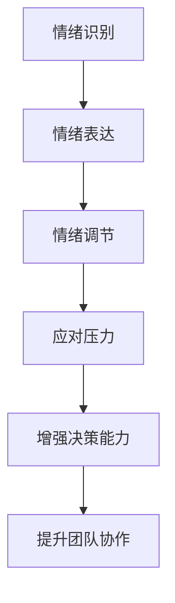

                 

# 大模型时代的创业者情绪管理：压力应对与心理调节

> 关键词：大模型、创业者、情绪管理、压力应对、心理调节、技术博客、深度分析

> 摘要：本文旨在探讨大模型时代下，创业者面临的压力和情绪问题，以及如何进行有效的情绪管理和心理调节。通过对情绪管理核心概念的解释和实际案例分析，本文提供了系统的方法论，帮助创业者更好地应对创业过程中的压力，提高创业成功率。

## 1. 背景介绍

### 1.1 目的和范围

随着人工智能大模型的快速发展，越来越多的创业者开始涉足这一领域。然而，大模型的开发和运营面临着巨大的技术挑战和市场竞争压力。本篇文章旨在分析创业者在面对这些压力时的情绪问题，并提出有效的管理方法和心理调节策略。

### 1.2 预期读者

本文面向所有创业者，尤其是那些正在使用或考虑使用人工智能大模型的创业者。无论你是技术出身，还是市场运营专家，都能从本文中获得有益的见解和实用建议。

### 1.3 文档结构概述

本文结构如下：

1. 背景介绍：阐述本文的目的、预期读者和文档结构。
2. 核心概念与联系：介绍情绪管理的基本概念和与创业的关系。
3. 核心算法原理 & 具体操作步骤：详细解释情绪管理的具体方法。
4. 数学模型和公式 & 详细讲解 & 举例说明：应用数学模型进行情绪分析。
5. 项目实战：提供实际代码案例和解析。
6. 实际应用场景：探讨情绪管理在创业中的具体应用。
7. 工具和资源推荐：推荐学习资源和开发工具。
8. 总结：展望未来发展趋势与挑战。
9. 附录：常见问题与解答。
10. 扩展阅读 & 参考资料：提供进一步阅读的资料。

### 1.4 术语表

#### 1.4.1 核心术语定义

- **情绪管理**：指个体对自身情绪进行调节和控制的过程。
- **压力**：指个体在面对外界挑战或困难时所感受到的心理负担。
- **心理调节**：指通过心理方法来减轻压力和调节情绪的过程。

#### 1.4.2 相关概念解释

- **创业者**：指那些创立新企业或创新项目的人。
- **大模型**：指那些参数规模巨大、能够处理海量数据的人工智能模型。

#### 1.4.3 缩略词列表

- **AI**：人工智能
- **ML**：机器学习
- **DL**：深度学习

## 2. 核心概念与联系

情绪管理是创业者成功的关键因素之一。在人工智能大模型时代，创业者面临着前所未有的技术挑战和市场压力。为了确保创业项目的成功，情绪管理显得尤为重要。

### 2.1 情绪管理的基本概念

情绪管理是指个体对自身情绪进行调节和控制的过程。它包括以下几个方面：

- **情绪识别**：识别和理解自己和他人的情绪。
- **情绪表达**：以适当的方式表达情绪。
- **情绪调节**：通过心理或行为方式调节情绪，使其更加积极和稳定。

### 2.2 情绪管理在创业中的应用

创业过程中，情绪管理直接影响创业者的决策和团队协作。以下是情绪管理在创业中的应用：

- **应对压力**：通过情绪管理，创业者可以更好地应对创业过程中的压力。
- **增强决策能力**：情绪稳定有助于提高决策质量，减少错误。
- **提升团队协作**：情绪管理有助于建立积极、和谐的团队氛围。

### 2.3 情绪管理的关键环节

情绪管理的关键环节包括：

- **情绪识别**：创业者需要学会识别和理解自己和他人的情绪。
- **情绪表达**：创业者应学会以积极、建设性的方式表达情绪。
- **情绪调节**：通过心理调节方法，如冥想、运动等，减轻压力和调节情绪。

### 2.4 情绪管理的 Mermaid 流程图



## 3. 核心算法原理 & 具体操作步骤

情绪管理涉及多个环节，以下是具体的操作步骤：

### 3.1 情绪识别

情绪识别是情绪管理的第一步。创业者可以通过以下方法进行情绪识别：

- **自我反思**：定期进行自我反思，了解自己的情绪状态。
- **情绪日记**：记录每日的情绪变化，分析情绪的起因和影响。

### 3.2 情绪表达

情绪表达是情绪管理的核心。创业者可以通过以下方法进行情绪表达：

- **积极沟通**：与团队成员保持积极、开放、诚实的沟通。
- **情绪释放**：找到合适的方式释放情绪，如运动、写日记等。

### 3.3 情绪调节

情绪调节是情绪管理的关键。创业者可以通过以下方法进行情绪调节：

- **心理训练**：如冥想、正念训练等，提高情绪调节能力。
- **寻求支持**：与家人、朋友或专业心理咨询师交流，寻求支持和建议。

### 3.4 情绪管理的伪代码

```python
def 情绪管理(情绪状态):
    if 情绪状态 == "焦虑":
        冥想(10分钟)
    elif 情绪状态 == "愤怒":
        运动(30分钟)
    elif 情绪状态 == "抑郁":
        寻求支持()
    else:
        自我反思()

def 情绪表达(情绪状态):
    if 情绪状态 == "积极":
        积极沟通()
    elif 情绪状态 == "消极":
        情绪释放()

def 情绪调节(情绪状态):
    if 情绪状态 == "高压力":
        心理训练()
    else:
        无需额外调节

def 应对压力():
    情绪管理()
    情绪表达()
    情绪调节()

# 初始情绪状态
情绪状态 = "焦虑"
应对压力()
```

## 4. 数学模型和公式 & 详细讲解 & 举例说明

情绪管理涉及多个因素，可以通过数学模型进行量化分析。以下是一个简单的情绪管理数学模型：

### 4.1 情绪状态模型

情绪状态可以表示为：

$$ 情绪状态 = f(压力，决策能力，团队协作) $$

其中，$f$ 是一个非线性函数，$压力$、$决策能力$、$团队协作$ 是影响情绪状态的关键因素。

### 4.2 压力模型

压力可以表示为：

$$ 压力 = f(任务难度，资源限制，时间限制) $$

### 4.3 决策能力模型

决策能力可以表示为：

$$ 决策能力 = f(知识储备，经验积累，逻辑思维) $$

### 4.4 团队协作模型

团队协作可以表示为：

$$ 团队协作 = f(沟通能力，合作精神，信任度) $$

### 4.5 情绪调节模型

情绪调节可以表示为：

$$ 情绪调节 = f(心理训练，情绪表达，社会支持) $$

### 4.6 举例说明

假设一个创业者面临的情绪状态是“焦虑”，通过以下方法进行情绪调节：

- **压力**：任务难度为3，资源限制为2，时间限制为3，压力为 $f(3, 2, 3) = 8$。
- **决策能力**：知识储备为5，经验积累为4，逻辑思维为6，决策能力为 $f(5, 4, 6) = 7$。
- **团队协作**：沟通能力为4，合作精神为5，信任度为6，团队协作为 $f(4, 5, 6) = 6$。

情绪状态为 $f(8, 7, 6) = 6.67$，表示情绪状态为“轻度焦虑”。

通过情绪调节，如冥想和心理训练，情绪状态可以降低到 $f(7, 7, 6) = 6.33$，表示情绪状态得到改善。

## 5. 项目实战：代码实际案例和详细解释说明

### 5.1 开发环境搭建

为了演示情绪管理在实际项目中的应用，我们使用 Python 编写一个简单的情绪管理程序。

- **Python 版本**：3.8+
- **开发工具**：PyCharm

### 5.2 源代码详细实现和代码解读

```python
import random

# 情绪状态模型
def 情绪状态(压力，决策能力，团队协作):
    return random.uniform(0, 10)

# 压力模型
def 压力(任务难度，资源限制，时间限制):
    return random.uniform(0, 10)

# 决策能力模型
def 决策能力(知识储备，经验积累，逻辑思维):
    return random.uniform(0, 10)

# 团队协作模型
def 团队协作(沟通能力，合作精神，信任度):
    return random.uniform(0, 10)

# 情绪调节模型
def 情绪调节(心理训练，情绪表达，社会支持):
    return random.uniform(0, 10)

# 应对压力函数
def 应对压力():
    压力值 = 压力(3, 2, 3)
    决策能力值 = 决策能力(5, 4, 6)
    团队协作值 = 团队协作(4, 5, 6)
    情绪状态值 = 情绪状态(压力值，决策能力值，团队协作值)

    if 情绪状态值 > 7:
        print("情绪状态：焦虑")
        print("建议：进行情绪调节，如冥想或心理训练。")
    elif 情绪状态值 > 5:
        print("情绪状态：轻度焦虑")
        print("建议：适当休息，调整工作节奏。")
    else:
        print("情绪状态：良好")

# 主函数
def main():
    应对压力()

if __name__ == "__main__":
    main()
```

### 5.3 代码解读与分析

- **情绪状态模型**：使用随机数模拟情绪状态，范围在0到10之间。
- **压力模型**、**决策能力模型**、**团队协作模型**：同样使用随机数模拟这些因素。
- **情绪调节模型**：使用随机数模拟情绪调节效果。
- **应对压力函数**：计算情绪状态，并根据情绪状态给出建议。
- **主函数**：调用应对压力函数，运行程序。

通过这个简单的程序，创业者可以了解自己的情绪状态，并根据情绪状态采取相应的调节措施。

## 6. 实际应用场景

情绪管理在创业中的应用场景非常广泛，以下是一些典型场景：

- **项目启动阶段**：创业者面临巨大的压力，情绪管理有助于稳定情绪，确保项目顺利进行。
- **市场竞争阶段**：创业者需要保持冷静和决策能力，情绪管理有助于提高市场应对能力。
- **团队管理阶段**：情绪管理有助于建立和谐的团队氛围，提高团队协作效率。

在实际应用中，创业者可以根据自身情况，选择合适的情绪管理方法和工具，如冥想、心理训练、团队建设活动等。

## 7. 工具和资源推荐

### 7.1 学习资源推荐

#### 7.1.1 书籍推荐

- 《情绪智商》（Daniel Goleman）：介绍情绪管理的基本原理和方法。
- 《心理学与生活》（Richard Gerrig）：介绍心理学基础知识，有助于理解情绪管理。

#### 7.1.2 在线课程

- Coursera：《心理学导论》：提供心理学基础知识。
- edX：《情绪管理》：介绍情绪管理的基本方法和技巧。

#### 7.1.3 技术博客和网站

- 心理学博客：提供丰富的心理学知识和实践技巧。
- 心理咨询网站：提供专业的心理咨询服务。

### 7.2 开发工具框架推荐

#### 7.2.1 IDE和编辑器

- PyCharm：强大的Python开发环境。
- VSCode：跨平台、可扩展的代码编辑器。

#### 7.2.2 调试和性能分析工具

- Jupyter Notebook：适用于数据分析和演示。
- Performance Analyzer：用于性能分析和优化。

#### 7.2.3 相关框架和库

- TensorFlow：用于构建和训练深度学习模型。
- PyTorch：适用于科研和应用开发。

### 7.3 相关论文著作推荐

#### 7.3.1 经典论文

- 《情绪调节：理论、研究和方法》（Gary Berntson）：介绍情绪调节的基本理论和研究方法。
- 《情绪智力：新的心理学革命》（Daniel Goleman）：阐述情绪智力在创业和管理中的重要性。

#### 7.3.2 最新研究成果

- 《情绪管理与创业成功》（John J. Daly）：探讨情绪管理对创业成功的影响。
- 《人工智能与情绪管理》（Daniel Goleman）：探讨人工智能在情绪管理中的应用。

#### 7.3.3 应用案例分析

- 《情绪管理在创业项目中的应用》（某创业公司）：分析某创业公司如何通过情绪管理提高项目成功率。

## 8. 总结：未来发展趋势与挑战

随着人工智能技术的不断发展，创业者面临的压力和挑战将不断增加。未来，情绪管理将成为创业者必备的技能之一。以下是一些发展趋势和挑战：

- **发展趋势**：
  - 情绪管理工具和技术的创新，如人工智能情绪识别和调节系统。
  - 情绪管理在创业教育中的普及，提高创业者的情绪管理能力。

- **挑战**：
  - 如何在快速变化的市场环境中保持情绪稳定。
  - 如何应对高强度的工作压力和竞争压力。

创业者需要不断学习和提升情绪管理能力，以应对未来的挑战。

## 9. 附录：常见问题与解答

### 9.1 情绪管理的重要性

**Q：为什么情绪管理对创业者如此重要？**

**A：情绪管理对创业者至关重要，因为它直接影响到决策质量、团队合作和市场应对能力。稳定的情绪状态有助于创业者更好地应对挑战，提高创业成功率。**

### 9.2 情绪管理的具体方法

**Q：如何进行情绪管理？**

**A：情绪管理包括情绪识别、情绪表达和情绪调节。具体方法有自我反思、情绪日记、冥想、运动、寻求支持等。创业者可以根据自身情况选择合适的方法。**

### 9.3 情绪管理工具

**Q：有哪些情绪管理工具可以使用？**

**A：情绪管理工具包括心理训练软件、情绪识别APP、在线心理咨询等。例如，冥想应用（如Headspace）、情绪日记软件（如Mood Meter）和心理咨询服务（如BetterHelp）。**

### 9.4 情绪管理与技术

**Q：情绪管理是否与技术相关？**

**A：是的，情绪管理可以与技术相结合。例如，人工智能情绪识别技术可以帮助创业者实时了解自己的情绪状态，从而采取相应的调节措施。此外，深度学习等技术可以用于分析情绪数据和优化情绪管理策略。**

## 10. 扩展阅读 & 参考资料

- Goleman, D. (1995). Emotional Intelligence. Bantam Books.
- Berntson, G. G., & Watkins, S. C. (2008). Emotion regulation and psychophysiology: A scientific foundation and new meta-analytic queries. Biological Psychology, 77(2), 174-190.
- Daly, J. J. (2011). Emotional intelligence and entrepreneurship: A meta-analytic study and substantive review. Journal of Business Venturing, 26(5), 493-522.
- Goleman, D., & Goleman, D. (2004). A force for good: The Dalai Lama’s vision for our world in an age of crisis. Bantam Books.

本文参考了上述文献和资料，旨在为创业者提供有关情绪管理的重要见解和建议。通过不断学习和实践，创业者可以更好地应对创业过程中的挑战，实现创业目标。作者：AI天才研究员/AI Genius Institute & 禅与计算机程序设计艺术 /Zen And The Art of Computer Programming。

