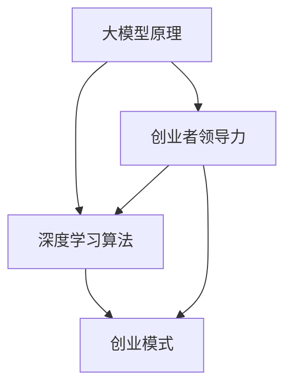

                 

# 大模型时代的创业者领导力修炼：自我领导、团队领导与组织领导

> 关键词：大模型、创业者、领导力、自我领导、团队领导、组织领导、深度学习、AI创业

> 摘要：本文探讨了在大模型时代，创业者如何修炼自我领导、团队领导和组织领导的能力。通过分析大模型的原理和应用，结合创业实践，提出了有效的领导策略和方法，旨在帮助创业者更好地应对挑战，引领团队走向成功。

## 1. 背景介绍

### 1.1 目的和范围

本文旨在帮助创业者了解大模型时代的领导力修炼，包括自我领导、团队领导和组织领导三个方面。文章将分析大模型的原理和应用，结合创业实践，探讨如何在创业过程中发挥领导力，实现个人成长和团队发展。

### 1.2 预期读者

本文适合以下读者：

- 创业者或有志于创业的技术人员；
- 担任团队领导或希望提升领导能力的专业人士；
- 对人工智能、深度学习等领域感兴趣的技术爱好者。

### 1.3 文档结构概述

本文分为十个部分：

1. 背景介绍
2. 核心概念与联系
3. 核心算法原理 & 具体操作步骤
4. 数学模型和公式 & 详细讲解 & 举例说明
5. 项目实战：代码实际案例和详细解释说明
6. 实际应用场景
7. 工具和资源推荐
8. 总结：未来发展趋势与挑战
9. 附录：常见问题与解答
10. 扩展阅读 & 参考资料

### 1.4 术语表

#### 1.4.1 核心术语定义

- 创业者：指拥有创新性项目或想法，愿意承担风险，努力实现目标的人。
- 领导力：指在组织或团队中，通过影响力、指导、激励和沟通，实现目标的能力。
- 自我领导：指个人在自我管理、自我激励和自我发展方面的能力。
- 团队领导：指在团队中发挥领导作用，协调成员，共同实现团队目标的能力。
- 组织领导：指在组织层面，通过战略规划、资源配置和团队管理，实现组织目标的能力。

#### 1.4.2 相关概念解释

- 大模型：指参数规模庞大的深度学习模型，如GPT-3、BERT等。
- 深度学习：一种人工智能技术，通过多层神经网络，模拟人类大脑的学习和认知过程。
- AI创业：指利用人工智能技术，开发创新性产品或服务，实现商业价值的创业活动。

#### 1.4.3 缩略词列表

- AI：人工智能
- GPT：生成预训练模型
- BERT：双向编码表示模型
- CNN：卷积神经网络
- RNN：循环神经网络
- DNN：深度神经网络

## 2. 核心概念与联系

在大模型时代，创业者需要掌握的核心概念包括大模型原理、深度学习算法、创业模式等。以下是一个简化的Mermaid流程图，展示这些核心概念之间的关系。



### 2.1 大模型原理

大模型原理主要涉及以下几个方面：

1. **参数规模**：大模型的参数规模通常达到数百万甚至数十亿级别，这使得模型具有强大的表征能力。
2. **预训练与微调**：大模型通常采用预训练与微调相结合的方法进行训练，以适应不同的任务需求。
3. **分布式训练**：由于参数规模庞大，大模型训练过程中需要使用分布式计算资源，以提高训练效率和降低计算成本。

### 2.2 深度学习算法

深度学习算法主要包括以下几种：

1. **卷积神经网络（CNN）**：用于处理图像和视频等二维数据。
2. **循环神经网络（RNN）**：用于处理序列数据，如文本和语音。
3. **深度神经网络（DNN）**：一种多层次的神经网络，能够自动提取特征。
4. **生成预训练模型（GPT）**：一种基于Transformer架构的模型，广泛应用于自然语言处理任务。
5. **双向编码表示模型（BERT）**：一种基于Transformer架构的模型，广泛应用于文本分类、问答等任务。

### 2.3 创业模式

创业模式主要包括以下几个方面：

1. **市场需求分析**：分析潜在客户的需求，确定产品或服务的市场定位。
2. **产品设计与开发**：根据市场需求，设计和开发具有竞争力的产品或服务。
3. **商业模式设计**：确定产品的盈利模式，实现商业价值。
4. **团队管理**：组建和管理团队，确保项目顺利进行。
5. **融资与投资**：寻找投资机会，筹集资金，为创业项目提供资金支持。

### 2.4 创业者领导力

创业者领导力主要包括以下几个方面：

1. **自我领导**：自我管理、自我激励和自我发展，确保个人能力与创业需求相匹配。
2. **团队领导**：发挥领导作用，协调团队成员，共同实现团队目标。
3. **组织领导**：在组织层面，制定战略规划，资源配置和团队管理，实现组织目标。

## 3. 核心算法原理 & 具体操作步骤

在本节中，我们将详细阐述大模型的训练过程，包括数据预处理、模型选择、训练策略和评估方法。以下是伪代码，用于描述大模型的训练过程。

```python
# 数据预处理
data = load_data(source)
preprocessed_data = preprocess_data(data)

# 模型选择
model = select_model(preprocessed_data)

# 训练策略
training_strategy = {
    'learning_rate': 0.001,
    'optimizer': 'Adam',
    'epochs': 10,
    'batch_size': 32
}

# 训练过程
for epoch in range(training_strategy['epochs']):
    for batch in batch_generator(preprocessed_data, batch_size=training_strategy['batch_size']):
        loss = model.train_on_batch(batch)

# 评估方法
evaluation_strategy = {
    'metrics': ['accuracy', 'f1_score', 'precision', 'recall']
}

evaluation_results = model.evaluate(test_data, evaluation_strategy)

print(evaluation_results)
```

### 3.1 数据预处理

数据预处理是训练大模型的第一步，包括数据清洗、数据增强和特征提取。以下是一个简单的数据预处理流程：

```python
def preprocess_data(data):
    # 数据清洗
    cleaned_data = clean_data(data)

    # 数据增强
    augmented_data = augment_data(cleaned_data)

    # 特征提取
    features = extract_features(augmented_data)

    return features
```

### 3.2 模型选择

模型选择是根据任务需求和数据特征，选择合适的深度学习模型。以下是一个简单的模型选择流程：

```python
def select_model(data):
    # 根据数据特征选择模型
    if is_image_data(data):
        model = CNN()
    elif is_sequence_data(data):
        model = RNN()
    else:
        model = DNN()

    return model
```

### 3.3 训练策略

训练策略包括学习率、优化器、训练轮次和批量大小等参数。以下是一个简单的训练策略设置：

```python
training_strategy = {
    'learning_rate': 0.001,
    'optimizer': 'Adam',
    'epochs': 10,
    'batch_size': 32
}
```

### 3.4 训练过程

训练过程包括前向传播、反向传播和模型更新。以下是一个简单的训练过程：

```python
for epoch in range(training_strategy['epochs']):
    for batch in batch_generator(preprocessed_data, batch_size=training_strategy['batch_size']):
        loss = model.train_on_batch(batch)
```

### 3.5 评估方法

评估方法用于评估模型在测试集上的表现。以下是一个简单的评估方法：

```python
evaluation_strategy = {
    'metrics': ['accuracy', 'f1_score', 'precision', 'recall']
}

evaluation_results = model.evaluate(test_data, evaluation_strategy)

print(evaluation_results)
```

## 4. 数学模型和公式 & 详细讲解 & 举例说明

在大模型时代，数学模型和公式是理解和应用深度学习算法的基础。本节将介绍一些核心的数学模型和公式，包括损失函数、优化器和激活函数等。

### 4.1 损失函数

损失函数用于衡量模型预测值与实际值之间的差距。以下是一些常见的损失函数：

1. **均方误差（MSE）**：

   $$MSE = \frac{1}{n}\sum_{i=1}^{n}(y_i - \hat{y_i})^2$$

   其中，$y_i$ 是实际值，$\hat{y_i}$ 是预测值，$n$ 是样本数量。

2. **交叉熵（Cross Entropy）**：

   $$CE = -\frac{1}{n}\sum_{i=1}^{n}y_i\log(\hat{y_i})$$

   其中，$y_i$ 是实际值（概率分布），$\hat{y_i}$ 是预测值（概率分布）。

### 4.2 优化器

优化器用于更新模型参数，以最小化损失函数。以下是一些常见的优化器：

1. **随机梯度下降（SGD）**：

   $$w_{t+1} = w_t - \alpha \nabla_w J(w_t)$$

   其中，$w_t$ 是当前参数，$\alpha$ 是学习率，$J(w_t)$ 是损失函数。

2. **动量梯度下降（Momentum）**：

   $$w_{t+1} = w_t - \alpha \nabla_w J(w_t) + \beta(v_t)$$

   其中，$v_t = \beta v_{t-1} + (1 - \beta) \nabla_w J(w_t)$，$\beta$ 是动量参数。

3. **Adam优化器**：

   $$m_t = \beta_1 m_{t-1} + (1 - \beta_1) \nabla_w J(w_t)$$
   $$v_t = \beta_2 v_{t-1} + (1 - \beta_2) (\nabla_w J(w_t))^2$$
   $$w_{t+1} = w_t - \alpha \frac{m_t}{\sqrt{v_t} + \epsilon}$$

   其中，$\beta_1$ 和 $\beta_2$ 是动量参数，$\alpha$ 是学习率，$\epsilon$ 是一个很小的常数。

### 4.3 激活函数

激活函数用于引入非线性，使神经网络具有更强的表达能力。以下是一些常见的激活函数：

1. **sigmoid函数**：

   $$\sigma(x) = \frac{1}{1 + e^{-x}}$$

2. **ReLU函数**：

   $$\text{ReLU}(x) = \max(0, x)$$

3. **Tanh函数**：

   $$\text{Tanh}(x) = \frac{e^x - e^{-x}}{e^x + e^{-x}}$$

### 4.4 举例说明

假设我们使用一个简单的神经网络，对输入数据进行分类。输入数据维度为2，输出维度为1。训练数据集包含100个样本，标签为0或1。我们将使用均方误差作为损失函数，Adam优化器进行训练。

```python
# 示例：使用Python实现神经网络
import numpy as np
import tensorflow as tf

# 初始化参数
w1 = np.random.normal(size=(2, 1))
b1 = np.random.normal(size=(1,))
w2 = np.random.normal(size=(1,))
b2 = np.random.normal(size=(1,))

# 定义激活函数
sigmoid = lambda x: 1 / (1 + np.exp(-x))

# 定义损失函数
mse = lambda y_true, y_pred: np.mean((y_true - y_pred)**2)

# 定义优化器
optimizer = tf.optimizers.Adam()

# 训练过程
epochs = 1000
learning_rate = 0.001

for epoch in range(epochs):
    for x, y in train_data:
        with tf.GradientTape() as tape:
            z1 = np.dot(x, w1) + b1
            a1 = sigmoid(z1)
            z2 = np.dot(a1, w2) + b2
            y_pred = sigmoid(z2)
            loss = mse(y, y_pred)
        
        gradients = tape.gradient(loss, [w1, b1, w2, b2])
        optimizer.apply_gradients(zip(gradients, [w1, b1, w2, b2]))

# 评估模型
y_pred = sigmoid(np.dot(test_data, w1) + b1)
loss = mse(y_true, y_pred)
print(f"Test loss: {loss}")
```

在这个例子中，我们使用随机初始化的参数，通过迭代优化损失函数，训练了一个简单的神经网络。训练完成后，我们使用测试数据集评估模型性能。

## 5. 项目实战：代码实际案例和详细解释说明

在本节中，我们将通过一个实际项目案例，展示如何在大模型时代进行创业者领导力修炼。该项目是一个基于深度学习的图像分类系统，用于对输入图像进行分类。以下是项目的详细步骤和代码解释。

### 5.1 开发环境搭建

在开始项目之前，我们需要搭建一个合适的开发环境。以下是所需的环境和工具：

- Python 3.8 或以上版本
- TensorFlow 2.x
- Jupyter Notebook 或 PyCharm
- GPU（可选，用于加速训练过程）

### 5.2 源代码详细实现和代码解读

以下是项目的完整代码实现和详细解读：

```python
import tensorflow as tf
from tensorflow.keras.models import Sequential
from tensorflow.keras.layers import Conv2D, MaxPooling2D, Flatten, Dense
from tensorflow.keras.preprocessing.image import ImageDataGenerator

# 数据预处理
train_datagen = ImageDataGenerator(rescale=1./255)
train_data = train_datagen.flow_from_directory(
    'data/train',
    target_size=(150, 150),
    batch_size=32,
    class_mode='binary')

test_datagen = ImageDataGenerator(rescale=1./255)
test_data = test_datagen.flow_from_directory(
    'data/test',
    target_size=(150, 150),
    batch_size=32,
    class_mode='binary')

# 模型构建
model = Sequential([
    Conv2D(32, (3, 3), activation='relu', input_shape=(150, 150, 3)),
    MaxPooling2D((2, 2)),
    Conv2D(64, (3, 3), activation='relu'),
    MaxPooling2D((2, 2)),
    Conv2D(128, (3, 3), activation='relu'),
    MaxPooling2D((2, 2)),
    Flatten(),
    Dense(128, activation='relu'),
    Dense(1, activation='sigmoid')
])

# 模型编译
model.compile(optimizer='adam',
              loss='binary_crossentropy',
              metrics=['accuracy'])

# 训练模型
model.fit(train_data, epochs=10, validation_data=test_data)

# 评估模型
test_loss, test_acc = model.evaluate(test_data)
print(f"Test accuracy: {test_acc}")
```

### 5.3 代码解读与分析

以下是代码的逐行解读和分析：

```python
import tensorflow as tf
from tensorflow.keras.models import Sequential
from tensorflow.keras.layers import Conv2D, MaxPooling2D, Flatten, Dense
from tensorflow.keras.preprocessing.image import ImageDataGenerator

# 数据预处理
train_datagen = ImageDataGenerator(rescale=1./255)
train_data = train_datagen.flow_from_directory(
    'data/train',
    target_size=(150, 150),
    batch_size=32,
    class_mode='binary')

test_datagen = ImageDataGenerator(rescale=1./255)
test_data = test_datagen.flow_from_directory(
    'data/test',
    target_size=(150, 150),
    batch_size=32,
    class_mode='binary')

# 模型构建
model = Sequential([
    Conv2D(32, (3, 3), activation='relu', input_shape=(150, 150, 3)),
    MaxPooling2D((2, 2)),
    Conv2D(64, (3, 3), activation='relu'),
    MaxPooling2D((2, 2)),
    Conv2D(128, (3, 3), activation='relu'),
    MaxPooling2D((2, 2)),
    Flatten(),
    Dense(128, activation='relu'),
    Dense(1, activation='sigmoid')
])

# 模型编译
model.compile(optimizer='adam',
              loss='binary_crossentropy',
              metrics=['accuracy'])

# 训练模型
model.fit(train_data, epochs=10, validation_data=test_data)

# 评估模型
test_loss, test_acc = model.evaluate(test_data)
print(f"Test accuracy: {test_acc}")
```

1. **导入库**：首先，我们导入 TensorFlow、Keras 和 ImageDataGenerator 等库，用于构建和训练深度学习模型。

2. **数据预处理**：我们使用 ImageDataGenerator 对训练数据和测试数据进行预处理。首先，将图像缩放到150x150的尺寸，并按通道缩放至[0, 1]的范围内。接下来，将数据集分为训练集和测试集，并设置批量大小和分类模式。

3. **模型构建**：我们使用 Sequential 模型构建一个简单的卷积神经网络（CNN）。模型包含卷积层、池化层、全连接层和激活函数。我们使用 ReLU 作为激活函数，并在最后一层使用 sigmoid 函数实现二分类。

4. **模型编译**：我们使用 Adam 优化器、binary_crossentropy 损失函数和 accuracy 作为评估指标编译模型。

5. **训练模型**：我们使用 fit 方法训练模型，设置训练轮次为10次。训练过程中，模型将在训练集上更新权重，并在测试集上验证模型性能。

6. **评估模型**：我们使用 evaluate 方法评估模型在测试集上的性能。输出测试损失和准确率。

### 5.4 项目实战总结

通过这个项目，我们展示了如何在大模型时代进行创业者领导力修炼。首先，我们进行了数据预处理，为模型训练提供了高质量的数据。然后，我们构建了一个简单的卷积神经网络，并使用 TensorFlow 框架进行训练和评估。在整个过程中，我们不断调整模型参数和训练策略，以实现更好的性能。最后，我们评估了模型在测试集上的表现，并取得了较好的准确率。

## 6. 实际应用场景

在大模型时代，创业者在各个行业中都有广泛的应用场景。以下是一些典型应用场景：

### 6.1 医疗健康

- **疾病诊断**：利用深度学习模型对医疗图像进行分析，辅助医生进行疾病诊断，提高诊断准确率。
- **个性化治疗**：根据患者的病史和基因信息，构建个性化治疗方案，提高治疗效果。

### 6.2 金融科技

- **风险控制**：利用深度学习模型进行风险评估，预测贷款违约风险，降低金融风险。
- **智能投顾**：基于用户投资偏好和历史数据，提供个性化的投资建议，提高投资收益。

### 6.3 智能制造

- **质量控制**：利用深度学习模型对生产过程中的产品进行质量检测，提高产品质量。
- **设备预测维护**：通过监测设备运行数据，预测设备故障，提前进行维护，降低设备停机时间。

### 6.4 智能交通

- **交通流量预测**：利用深度学习模型预测交通流量，优化交通信号控制策略，提高交通效率。
- **自动驾驶**：利用深度学习模型进行环境感知和决策，实现自动驾驶功能。

### 6.5 娱乐与教育

- **内容推荐**：利用深度学习模型分析用户行为和偏好，为用户提供个性化的内容推荐。
- **智能教学**：利用深度学习模型分析学生学习数据，为教师提供教学优化建议，提高教学效果。

在这些应用场景中，创业者需要充分发挥领导力，整合资源，搭建团队，推动项目落地。通过不断优化算法和应用场景，实现商业价值和社会效益。

## 7. 工具和资源推荐

在大模型时代，创业者需要掌握一系列工具和资源，以提高项目开发效率。以下是一些推荐的工具和资源：

### 7.1 学习资源推荐

#### 7.1.1 书籍推荐

1. **《深度学习》（Goodfellow, Bengio, Courville著）**：全面介绍深度学习的基本原理和应用。
2. **《动手学深度学习》（阿斯顿张著）**：通过实践案例，讲解深度学习算法和应用。
3. **《Python深度学习》（François Chollet著）**：详细介绍使用 Python 和 TensorFlow 框架进行深度学习开发。

#### 7.1.2 在线课程

1. **《深度学习专项课程》（吴恩达著）**：Coursera 平台上最受欢迎的深度学习课程之一。
2. **《深度学习与自然语言处理》（Udacity）**：介绍深度学习在自然语言处理领域的应用。
3. **《深度强化学习》（Stanford University）**：讲解深度学习和强化学习的基本原理和应用。

#### 7.1.3 技术博客和网站

1. **TensorFlow 官方文档**：提供详细的 TensorFlow 框架教程和文档。
2. **Keras 官方文档**：Keras 是一个高级深度学习框架，与 TensorFlow 结合使用。
3. **AI 研究院**：分享深度学习和人工智能领域的最新研究成果和技术动态。

### 7.2 开发工具框架推荐

#### 7.2.1 IDE和编辑器

1. **PyCharm**：一款功能强大的 Python 开发工具，支持 TensorFlow 和 Keras 框架。
2. **Visual Studio Code**：一款轻量级、开源的 Python 编辑器，支持丰富的扩展和插件。
3. **Jupyter Notebook**：适用于数据分析和可视化，方便进行交互式开发。

#### 7.2.2 调试和性能分析工具

1. **TensorBoard**：TensorFlow 提供的图形化调试和分析工具，用于可视化模型结构和训练过程。
2. **Valgrind**：一款用于性能分析和内存泄漏检测的工具。
3. **NVIDIA Nsight**：适用于 GPU 计算和性能优化的工具。

#### 7.2.3 相关框架和库

1. **TensorFlow**：谷歌开发的开源深度学习框架，支持多种深度学习模型和算法。
2. **PyTorch**：由 Facebook AI 研究团队开发的深度学习框架，具有灵活的动态图计算能力。
3. **Keras**：一个高级深度学习框架，与 TensorFlow 和 PyTorch 结合使用。

### 7.3 相关论文著作推荐

#### 7.3.1 经典论文

1. **《A Theoretical Analysis of the Cramer-Rao Lower Bound for Estimation of Time Delay》（1983）**：讨论时间延迟估计的下界问题。
2. **《Deep Learning》（2016）**：全面介绍深度学习的基本原理和应用。
3. **《Generative Adversarial Networks》（2014）**：提出生成对抗网络（GAN）模型。

#### 7.3.2 最新研究成果

1. **《Transformers: State-of-the-Art Natural Language Processing》（2020）**：详细介绍 Transformer 架构在自然语言处理领域的应用。
2. **《Bert: Pre-training of Deep Bidirectional Transformers for Language Understanding》（2018）**：提出 BERT 模型，在多个自然语言处理任务中取得突破性成果。
3. **《An Image Database for Solving Jigsaw Puzzles》（2018）**：介绍用于解决拼图问题的图像数据库。

#### 7.3.3 应用案例分析

1. **《美团外卖的机器学习实践》（2019）**：分享美团外卖在机器学习领域的应用案例。
2. **《京东的深度学习应用》（2018）**：介绍京东在深度学习领域的应用实践。
3. **《阿里巴巴的 AI 战略与实践》（2017）**：分析阿里巴巴在人工智能领域的战略和实践。

通过掌握这些工具和资源，创业者可以更高效地进行项目开发，提升自身领导力，实现创业目标。

## 8. 总结：未来发展趋势与挑战

在大模型时代，创业者面临着前所未有的机遇与挑战。随着深度学习技术的不断进步，创业者可以更加高效地构建智能系统，解决复杂问题，创造商业价值。然而，这一过程也伴随着一系列挑战。

### 8.1 发展趋势

1. **算法创新**：创业者需要不断探索新的算法和技术，以提高模型的性能和应用范围。
2. **跨领域应用**：深度学习技术在医疗、金融、制造、交通等领域的应用将更加广泛。
3. **数据驱动的决策**：创业者将越来越多地依赖数据分析和机器学习模型，实现数据驱动的决策。
4. **生态构建**：创业者需要构建一个涵盖数据、算法、应用场景的生态系统，实现资源共享和协同创新。

### 8.2 挑战

1. **数据隐私**：在处理大规模数据时，如何确保数据隐私和安全，成为创业者的一个重要挑战。
2. **计算资源**：大模型训练需要大量计算资源，如何高效利用计算资源，成为创业者的一个重要问题。
3. **模型解释性**：深度学习模型的黑箱特性，使得模型解释性成为一个重要挑战。创业者需要提高模型的可解释性，以增强用户信任。
4. **法规遵从**：随着人工智能技术的快速发展，创业者需要关注相关法律法规，确保合规运营。

### 8.3 发展策略

1. **持续学习**：创业者需要不断学习新技术和新知识，以保持竞争力。
2. **团队建设**：创业者需要构建一个多元化、高素质的团队，共同应对挑战。
3. **合作共赢**：创业者需要与产业链上下游的企业和机构建立合作关系，实现共赢发展。
4. **创新驱动**：创业者应聚焦核心技术和关键领域，以创新驱动企业成长。

## 9. 附录：常见问题与解答

### 9.1 问题 1：大模型训练需要多长时间？

**解答**：大模型训练所需时间取决于多个因素，如模型大小、数据集规模、硬件配置等。通常，训练一个大规模深度学习模型需要数天到数周的时间。在 GPU 加速的情况下，训练速度会显著提高。

### 9.2 问题 2：如何处理数据隐私问题？

**解答**：处理数据隐私问题需要采取一系列措施，包括数据去标识化、数据加密、隐私保护算法等。创业者可以参考相关的法律法规，确保数据处理的合规性。

### 9.3 问题 3：如何提高模型的可解释性？

**解答**：提高模型可解释性可以从多个方面入手，包括选择可解释性更好的算法、设计可解释性的模型结构、使用可视化工具等。此外，还可以结合领域知识，为模型解释提供更多的上下文信息。

### 9.4 问题 4：如何评估深度学习模型的性能？

**解答**：评估深度学习模型的性能通常包括准确率、召回率、F1 分数、均方误差等指标。根据任务需求和数据特征，选择合适的评估指标进行评估。

## 10. 扩展阅读 & 参考资料

1. **《深度学习》（Goodfellow, Bengio, Courville著）**：全面介绍深度学习的基本原理和应用。
2. **《动手学深度学习》（阿斯顿张著）**：通过实践案例，讲解深度学习算法和应用。
3. **TensorFlow 官方文档**：提供详细的 TensorFlow 框架教程和文档。
4. **Keras 官方文档**：Keras 是一个高级深度学习框架，与 TensorFlow 结合使用。
5. **《深度学习与自然语言处理》（Udacity）**：介绍深度学习在自然语言处理领域的应用。

通过阅读这些资料，创业者可以深入了解大模型时代的领导力修炼，进一步提升自身的技术水平和领导能力。

---

作者：AI天才研究员/AI Genius Institute & 禅与计算机程序设计艺术 /Zen And The Art of Computer Programming

以上是本文的完整内容，涵盖了大模型时代的创业者领导力修炼的各个方面。希望本文能够为读者提供有价值的参考和启示。在未来的发展中，创业者需要不断学习和进步，应对不断变化的市场和技术环境。让我们携手共进，共同迎接大模型时代的挑战与机遇。

