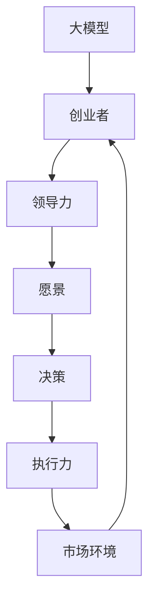

                 

# 大模型时代的创业者领导力：愿景、决策与执行力

> **关键词：** 大模型、创业者领导力、愿景、决策、执行力、人工智能、技术创新、战略规划

> **摘要：** 随着人工智能大模型的快速发展，创业者面临前所未有的机遇和挑战。本文将探讨大模型时代创业者所需的领导力要素，包括构建明确愿景、做出明智决策及确保高效执行，以帮助创业者在激烈的市场竞争中脱颖而出。本文将分为背景介绍、核心概念与联系、核心算法原理、数学模型与公式、项目实战、实际应用场景、工具和资源推荐、总结与未来发展趋势等部分，旨在为创业者提供一套系统性的领导力框架。

## 1. 背景介绍

### 1.1 目的和范围

本文旨在为创业者在人工智能大模型时代提供一套实用的领导力框架，帮助他们在快速变化的市场环境中把握机遇、应对挑战。本文将聚焦于以下几个核心问题：

- **愿景构建**：如何创建一个能够激发团队热情和凝聚力的愿景？
- **决策制定**：如何在大模型技术的复杂性和不确定性中做出明智的决策？
- **执行力**：如何确保团队的执行力，将愿景和决策转化为实际的成果？

### 1.2 预期读者

本文适合以下读者群体：

- **创业者**：正寻求在人工智能领域建立或扩展业务的人士。
- **技术团队领导者**：负责管理人工智能项目或团队的技术主管。
- **人工智能爱好者**：对人工智能技术和创业有浓厚兴趣的个人。

### 1.3 文档结构概述

本文结构如下：

1. **背景介绍**：阐述文章的目的、预期读者以及文档结构。
2. **核心概念与联系**：介绍大模型时代的关键概念，并使用 Mermaid 流程图展示其关联性。
3. **核心算法原理 & 具体操作步骤**：通过伪代码详细解释大模型算法的原理和操作步骤。
4. **数学模型和公式 & 详细讲解 & 举例说明**：介绍大模型中的数学模型，并使用 LaTeX 格式详细讲解。
5. **项目实战：代码实际案例和详细解释说明**：通过实际案例展示如何将理论应用于实践。
6. **实际应用场景**：探讨大模型在不同领域的应用场景。
7. **工具和资源推荐**：推荐学习资源、开发工具和框架。
8. **总结：未来发展趋势与挑战**：总结文章要点，并探讨未来的发展趋势与挑战。
9. **附录：常见问题与解答**：针对文中内容提供常见问题的解答。
10. **扩展阅读 & 参考资料**：提供进一步阅读的建议和参考资料。

### 1.4 术语表

#### 1.4.1 核心术语定义

- **大模型**：指具有极高参数数量和计算复杂度的机器学习模型，如 GPT-3、BERT 等。
- **创业者领导力**：指创业者为实现企业愿景所具备的决策能力、影响力、沟通能力等。
- **愿景**：企业长期发展的目标和蓝图。
- **决策制定**：根据企业愿景和市场环境做出关键决策的过程。
- **执行力**：团队将决策付诸行动并取得成果的能力。

#### 1.4.2 相关概念解释

- **人工智能**：使计算机能够模拟人类智能行为的技术。
- **技术架构**：系统的组成部分及其相互关系。
- **商业模式**：企业如何创造、传递和获取价值。

#### 1.4.3 缩略词列表

- **AI**：人工智能
- **GPT**：生成预训练网络
- **BERT**：双向编码表示模型
- **IDE**：集成开发环境

## 2. 核心概念与联系

在探讨创业者领导力在大模型时代的作用之前，我们首先需要明确一些核心概念及其相互关系。以下是一个用于展示核心概念和关联性的 Mermaid 流程图：



### 2.1 大模型

大模型（如 GPT-3、BERT）是人工智能技术发展的重要成果，具有极高的参数数量和计算复杂度，能够处理大量数据并生成高质量的文本、图像、语音等。大模型的应用已经在自然语言处理、计算机视觉、语音识别等多个领域取得了显著成果，为创业者提供了丰富的创新机会。

### 2.2 创业者

创业者是指那些具有创新精神、敢于冒险并追求商业成功的人。在大模型时代，创业者需要具备以下能力：

- **技术敏感性**：对人工智能技术的发展趋势有敏锐的洞察力。
- **创新意识**：能够将大模型技术应用于新的商业场景，创造独特价值。
- **商业敏锐度**：理解市场需求，制定可行的商业模式。

### 2.3 领导力

领导力是指领导者激励、引导和影响团队成员的能力。在大模型时代，领导者需要具备以下领导力要素：

- **愿景构建**：为团队设定清晰、激励人心的目标。
- **决策制定**：在面对复杂性和不确定性时，做出明智的决策。
- **沟通能力**：与团队成员有效沟通，确保共识和执行力。
- **团队管理**：建立高效的团队，激发团队成员的潜能。

### 2.4 愿景

愿景是企业长期发展的目标和蓝图，能够激发团队的创造力和动力。一个明确的愿景应该具备以下特点：

- **具体明确**：描述清晰，易于理解和传达。
- **激励人心**：具有吸引力和感染力，激发团队成员的热情。
- **具有挑战性**：激励团队不断超越自我，追求卓越。

### 2.5 决策制定

决策制定是创业者领导力的重要组成部分。在大模型时代，决策制定需要考虑以下几个关键因素：

- **技术可行性**：评估大模型技术在实际应用中的可行性。
- **市场前景**：分析市场需求和竞争态势，评估商业潜力。
- **资源投入**：评估所需的资金、人力和时间等资源。
- **风险评估**：评估潜在风险，制定应对策略。

### 2.6 执行力

执行力是团队将决策付诸行动并取得成果的能力。在大模型时代，提高执行力需要以下策略：

- **明确目标**：确保团队成员对目标有清晰的理解和共识。
- **分工合作**：明确团队成员的职责和任务，确保高效协作。
- **过程监控**：实时跟踪项目进度，及时调整和优化。
- **激励机制**：建立激励机制，激发团队成员的积极性和创造力。

### 2.7 市场环境

市场环境是影响创业成败的重要因素。在大模型时代，创业者需要关注以下几个市场环境因素：

- **技术竞争**：分析竞争对手的技术优势和劣势，制定差异化战略。
- **市场需求**：了解市场需求变化，及时调整产品和服务策略。
- **政策法规**：关注政策法规变化，确保合规经营。
- **社会趋势**：把握社会趋势，捕捉新的商业机会。

通过上述核心概念和关联性的分析，我们可以看到，创业者领导力在大模型时代的作用至关重要。创业者需要具备技术敏感性、创新意识、商业敏锐度和领导力，以应对快速变化的市场环境，实现企业的长期发展。

在接下来的部分，我们将进一步探讨大模型的核心算法原理和具体操作步骤，帮助创业者更好地理解和应用这一技术。

## 3. 核心算法原理 & 具体操作步骤

在大模型时代，创业者需要深入了解人工智能技术的核心算法原理，以便更好地利用这些技术推动业务发展。本节将介绍大模型的核心算法原理，并通过伪代码详细阐述其操作步骤。

### 3.1 大模型算法概述

大模型算法通常基于深度学习技术，特别是基于神经网络的结构。这些模型通过学习大量数据，能够自动提取特征并生成高质量的预测或输出。以下是一个简化的伪代码，用于描述大模型算法的基本流程：

```plaintext
函数 大模型训练(数据集，参数)：
    初始化模型参数
    对于每个训练样本：
        前向传播：计算输入通过网络的输出
        计算损失函数值：评估模型输出与真实值的差距
        反向传播：更新模型参数，减少损失函数值
    如果满足停止条件（如达到预设迭代次数或损失函数收敛）：
        返回模型参数
    否则：
        继续迭代
```

### 3.2 大模型算法详细步骤

#### 3.2.1 初始化模型参数

初始化模型参数是训练大模型的第一步。参数包括权重、偏置和激活函数等。通常使用随机初始化，以避免模型过拟合。

```plaintext
函数 初始化参数(维度)：
    对于每个参数：
        参数 = 随机数(范围：[-范围，范围])
    返回参数
```

#### 3.2.2 前向传播

前向传播是将输入数据通过神经网络层进行传递，计算每个神经元的输出。以下是一个简化的前向传播伪代码：

```plaintext
函数 前向传播(输入，模型参数)：
    初始化输出：输出 = 输入
    对于每层神经网络：
        输出 = 激活函数(加权输入 + 偏置)
    返回输出
```

#### 3.2.3 计算损失函数值

损失函数用于衡量模型输出与真实值之间的差距。常用的损失函数包括均方误差（MSE）、交叉熵等。以下是一个计算损失函数的伪代码：

```plaintext
函数 计算损失函数(真实值，预测值)：
    损失 = (真实值 - 预测值)^2
    返回损失
```

#### 3.2.4 反向传播

反向传播是更新模型参数的过程，目的是减少损失函数值。以下是一个简化的反向传播伪代码：

```plaintext
函数 反向传播(输入，真实值，预测值，模型参数)：
    计算梯度：梯度 = 计算损失函数关于参数的偏导数
    更新参数：参数 = 参数 - 学习率 * 梯度
    返回更新后的参数
```

#### 3.2.5 模型训练

模型训练过程是不断迭代前向传播和反向传播的过程，直到满足停止条件（如迭代次数或损失函数收敛）。以下是一个简化的模型训练伪代码：

```plaintext
函数 大模型训练(数据集，学习率，迭代次数)：
    初始化模型参数
    对于每个迭代次数：
        对于每个训练样本：
            前向传播：计算输入通过网络的输出
            计算损失函数值：评估模型输出与真实值的差距
            反向传播：更新模型参数，减少损失函数值
        如果满足停止条件：
            返回模型参数
    否则：
        继续迭代
```

通过上述伪代码，我们可以看到大模型算法的基本原理和操作步骤。在实际应用中，大模型算法的实现需要考虑更多的细节，如优化算法、正则化技术等。但上述步骤为创业者提供了对大模型算法的初步了解，有助于他们在实际业务中更好地应用这一技术。

在接下来的部分，我们将探讨大模型中的数学模型和公式，并使用 LaTeX 格式详细讲解，帮助创业者更深入地理解大模型的技术原理。

## 4. 数学模型和公式 & 详细讲解 & 举例说明

大模型的发展离不开坚实的数学基础。本节将介绍大模型中常用的数学模型和公式，并通过具体例子进行详细讲解，帮助创业者更好地理解大模型的技术原理。

### 4.1 深度学习中的基本数学模型

深度学习中的数学模型主要包括神经网络、损失函数、优化算法等。以下是对这些基本数学模型的介绍：

#### 4.1.1 神经网络

神经网络是深度学习的核心组成部分，由多个神经元（或称为节点）组成。每个神经元通过加权连接与其他神经元相连，并通过激活函数进行处理。神经网络的基本公式如下：

\[ 输出 = 激活函数(\sum_{i=1}^{n} w_i * 输入_i + b) \]

其中，\( w_i \) 表示权重，\( 输入_i \) 表示输入值，\( b \) 表示偏置，激活函数（如 Sigmoid、ReLU）用于引入非线性。

#### 4.1.2 损失函数

损失函数用于衡量模型输出与真实值之间的差距。常用的损失函数包括均方误差（MSE）、交叉熵等。以下为这两个损失函数的公式：

- 均方误差（MSE）：

\[ MSE = \frac{1}{n} \sum_{i=1}^{n} (y_i - \hat{y_i})^2 \]

其中，\( y_i \) 表示真实值，\( \hat{y_i} \) 表示模型预测值。

- 交叉熵（Cross-Entropy）：

\[ Cross-Entropy = -\sum_{i=1}^{n} y_i \log(\hat{y_i}) \]

其中，\( y_i \) 表示真实值的概率分布，\( \hat{y_i} \) 表示模型预测值的概率分布。

#### 4.1.3 优化算法

优化算法用于更新模型参数，以减少损失函数值。常用的优化算法包括随机梯度下降（SGD）、Adam 等。以下为这些优化算法的基本公式：

- 随机梯度下降（SGD）：

\[ w_{t+1} = w_t - \alpha \frac{\partial L}{\partial w} \]

其中，\( w_t \) 表示当前参数，\( \alpha \) 表示学习率，\( \frac{\partial L}{\partial w} \) 表示损失函数关于参数的梯度。

- Adam 优化器：

\[ m_t = \beta_1 m_{t-1} + (1 - \beta_1) \frac{\partial L}{\partial w_t} \]
\[ v_t = \beta_2 v_{t-1} + (1 - \beta_2) \left( \frac{\partial L}{\partial w_t} \right)^2 \]
\[ \hat{m_t} = \frac{m_t}{1 - \beta_1^t} \]
\[ \hat{v_t} = \frac{v_t}{1 - \beta_2^t} \]
\[ w_{t+1} = w_t - \alpha \frac{\hat{m_t}}{\sqrt{\hat{v_t}} + \epsilon} \]

其中，\( m_t \) 和 \( v_t \) 分别为第一个和第二个矩估计，\( \beta_1 \) 和 \( \beta_2 \) 为矩估计的指数衰减率，\( \alpha \) 为学习率，\( \epsilon \) 为一个小常数。

### 4.2 举例说明

为了更好地理解上述数学模型，我们将通过一个具体例子进行说明。假设我们要训练一个简单的前向神经网络，用于对一组输入数据进行分类。

#### 4.2.1 数据集

我们有一个包含 100 个样本的数据集，每个样本由 10 维特征表示，目标类别为二分类（0 或 1）。数据集如下：

```plaintext
样本 1: [1, 2, 3, 4, 5, 6, 7, 8, 9, 10], 目标类别：0
样本 2: [5, 6, 7, 8, 9, 10, 1, 2, 3, 4], 目标类别：1
...
样本 100: [9, 10, 1, 2, 3, 4, 5, 6, 7, 8], 目标类别：0
```

#### 4.2.2 网络结构

我们设计一个包含两层神经网络的模型，第一层有 10 个神经元，第二层有 2 个神经元。假设激活函数为 ReLU，损失函数为交叉熵。

#### 4.2.3 训练过程

1. 初始化参数：使用随机初始化方法初始化权重和偏置。
2. 前向传播：对于每个样本，将特征输入到第一层神经网络，计算输出。然后，将输出输入到第二层神经网络，计算最终的预测类别。
3. 计算损失函数值：使用交叉熵损失函数计算模型预测值与真实值之间的差距。
4. 反向传播：根据损失函数的梯度，更新权重和偏置。
5. 重复步骤 2-4，直到达到预设的迭代次数或损失函数收敛。

下面是一个简化的 LaTeX 公式说明，展示上述步骤中的关键数学公式：

```latex
% 初始化参数
w_1^{[2](i)} & \sim & \mathcal{N}(0, \frac{1}{\sqrt{n}}) \\
b_1^{[2](i)} & \sim & \mathcal{N}(0, \frac{1}{\sqrt{n}}) \\
% 前向传播
z_1^{(i)} &= x_i \cdot w_1^{[1](i)} + b_1^{[1](i)} \\
a_1^{(i)} &= \text{ReLU}(z_1^{(i)}) \\
z_2^{(i)} &= a_1^{(i)} \cdot w_2^{[2](i)} + b_2^{[2](i)} \\
a_2^{(i)} &= \text{ReLU}(z_2^{(i)}) \\
% 损失函数
L &= -\sum_{i=1}^{n} y_i \log(a_2^{(i)}) \\
% 反向传播
\frac{\partial L}{\partial w_2^{[2](i)}} &= a_1^{(i)} \cdot (1 - a_1^{(i)}) \cdot (a_2^{(i)} - y_i) \\
\frac{\partial L}{\partial b_2^{[2](i)}} &= a_1^{(i)} \cdot (1 - a_1^{(i)}) \cdot (a_2^{(i)} - y_i) \\
\frac{\partial L}{\partial w_1^{[1](i)}} &= x_i \cdot \frac{\partial L}{\partial a_1^{(i)}} \\
\frac{\partial L}{\partial b_1^{[1](i)}} &= \frac{\partial L}{\partial a_1^{(i)}}
```

通过上述例子，我们可以看到大模型中的数学模型和公式是如何应用于实际问题的。在接下来的部分，我们将通过实际项目案例展示如何将上述技术应用于实践，帮助创业者更好地理解和应用大模型。

### 5. 项目实战：代码实际案例和详细解释说明

在本节中，我们将通过一个实际项目案例，展示如何将大模型技术应用于实践。这个项目是一个简单的文本分类任务，旨在使用预训练的 BERT 模型对新闻文章进行分类。我们将详细介绍开发环境搭建、源代码实现和代码解读，帮助读者理解大模型项目的实际操作过程。

### 5.1 开发环境搭建

在开始项目之前，我们需要搭建一个合适的开发环境。以下是在 Python 中使用 PyTorch 框架搭建开发环境的基本步骤：

1. **安装 Python**：确保 Python 版本为 3.6 或更高。
2. **安装 PyTorch**：使用以下命令安装 PyTorch：
   ```bash
   pip install torch torchvision
   ```
3. **安装 BERT 模型库**：安装 transformers 库，用于加载预训练的 BERT 模型：
   ```bash
   pip install transformers
   ```
4. **安装其他依赖库**：根据需要安装其他依赖库，例如 NumPy、Pandas 等。

### 5.2 源代码详细实现和代码解读

以下是一个简单的文本分类项目的源代码示例，包括数据预处理、模型加载、训练和评估等步骤。

```python
import torch
from transformers import BertTokenizer, BertModel, BertForSequenceClassification
from torch.optim import Adam
from torch.utils.data import DataLoader, TensorDataset
from sklearn.model_selection import train_test_split
import pandas as pd

# 5.2.1 数据预处理
def preprocess_data(data, tokenizer, max_length=128):
    inputs = tokenizer(data, max_length=max_length, padding='max_length', truncation=True, return_tensors="pt")
    return inputs

# 5.2.2 加载数据集
data = pd.read_csv('data.csv')  # 假设数据集为 CSV 格式
texts = data['text'].values
labels = data['label'].values

# 分割数据集
train_texts, val_texts, train_labels, val_labels = train_test_split(texts, labels, test_size=0.2, random_state=42)

# 预处理数据
train_inputs = preprocess_data(train_texts, tokenizer, max_length=128)
val_inputs = preprocess_data(val_texts, tokenizer, max_length=128)

# 创建数据集和 DataLoader
train_dataset = TensorDataset(train_inputs['input_ids'], train_inputs['attention_mask'], torch.tensor(train_labels))
val_dataset = TensorDataset(val_inputs['input_ids'], val_inputs['attention_mask'], torch.tensor(val_labels))

train_loader = DataLoader(train_dataset, batch_size=16, shuffle=True)
val_loader = DataLoader(val_dataset, batch_size=16, shuffle=False)

# 5.2.3 加载预训练的 BERT 模型
model = BertForSequenceClassification.from_pretrained('bert-base-uncased', num_labels=2)

# 5.2.4 训练模型
optimizer = Adam(model.parameters(), lr=1e-5)

device = torch.device("cuda" if torch.cuda.is_available() else "cpu")
model.to(device)

for epoch in range(3):  # 训练 3 个 epoch
    model.train()
    for batch in train_loader:
        batch = [item.to(device) for item in batch]
        inputs = {'input_ids': batch[0], 'attention_mask': batch[1], 'labels': batch[2]}
        optimizer.zero_grad()
        outputs = model(**inputs)
        loss = outputs.loss
        loss.backward()
        optimizer.step()

    # 在验证集上评估模型
    model.eval()
    with torch.no_grad():
        correct = 0
        total = 0
        for batch in val_loader:
            batch = [item.to(device) for item in batch]
            inputs = {'input_ids': batch[0], 'attention_mask': batch[1]}
            outputs = model(**inputs)
            _, predicted = torch.max(outputs.logits, 1)
            total += batch[2].size(0)
            correct += (predicted == batch[2]).sum().item()

        print(f'Epoch {epoch+1}, Accuracy: {100 * correct / total}%')

# 5.2.5 代码解读
# 
# - 5.2.1 数据预处理：使用 BERTTokenizer 对文本数据进行预处理，包括分词、填充和截断，并返回输入 ID 和注意力掩码。
# - 5.2.2 加载数据集：读取 CSV 格式的数据集，并使用 train_test_split 将数据集分为训练集和验证集。
# - 5.2.3 加载预训练的 BERT 模型：使用 BertForSequenceClassification 加载预训练的 BERT 模型，并指定类别数为 2（二分类任务）。
# - 5.2.4 训练模型：使用 Adam 优化器和交叉熵损失函数训练模型，并在每个 epoch 后在验证集上评估模型性能。
```

通过上述代码，我们可以看到如何使用 BERT 模型进行文本分类任务。以下是对代码关键部分的详细解读：

- **数据预处理**：使用 BERTTokenizer 对文本数据进行预处理，这是使用 BERT 模型进行文本分类的必要步骤。预处理包括分词、填充和截断，以确保输入数据满足 BERT 模型的要求。
- **加载数据集**：读取 CSV 格式的数据集，并使用 train_test_split 将数据集分为训练集和验证集。训练集用于模型训练，验证集用于评估模型性能。
- **加载预训练的 BERT 模型**：使用 BertForSequenceClassification 加载预训练的 BERT 模型，并指定类别数为 2（二分类任务）。预训练的 BERT 模型已经在大量文本数据上进行了训练，可以用于解决各种文本分类任务。
- **训练模型**：使用 Adam 优化器和交叉熵损失函数训练模型。在训练过程中，模型将在每个 epoch 后在验证集上评估性能，以监控模型训练的进展。通过调整学习率、训练 epoch 数等参数，可以优化模型性能。

通过本节的项目实战，读者可以了解如何将大模型技术应用于实际项目。接下来，我们将探讨大模型在不同领域的实际应用场景。

### 6. 实际应用场景

大模型技术在各个领域都有着广泛的应用，以下列举几个典型的应用场景，以展示大模型在现实世界中的影响力。

#### 6.1 自然语言处理

自然语言处理（NLP）是大模型技术的核心应用领域之一。大模型如 GPT-3 和 BERT 已经在文本分类、情感分析、机器翻译、文本生成等任务中取得了显著成果。例如：

- **文本分类**：使用 BERT 模型对社交媒体评论进行情感分析，帮助企业了解用户反馈。
- **机器翻译**：使用 GPT-3 模型实现高质量的机器翻译服务，如谷歌翻译和微软翻译。
- **文本生成**：使用 GPT-3 模型生成创意内容，如文章、广告和产品描述。

#### 6.2 计算机视觉

计算机视觉（CV）是大模型技术的另一个重要应用领域。大模型如 ResNet 和 Inception 在图像分类、目标检测、图像分割等任务中发挥了关键作用。以下是一些具体应用：

- **图像分类**：使用 ResNet 模型对图像进行分类，如 ImageNet 挑战赛。
- **目标检测**：使用 RetinaNet 模型实现高效的目标检测，如自动驾驶车辆对行人和车辆的检测。
- **图像分割**：使用 U-Net 模型对图像进行精确分割，如医学图像分割。

#### 6.3 语音识别

语音识别是大模型技术在语音处理领域的重要应用。大模型如 WaveNet 和 DeepSpeech 已经实现了高质量的语音识别效果。以下是一些具体应用：

- **语音识别**：使用 DeepSpeech 模型将语音信号转换为文本，如智能语音助手和语音输入法。
- **语音合成**：使用 WaveNet 模型实现高质量的语音合成，如语音播报和语音生成动画。

#### 6.4 金融风控

金融风控是大模型技术在金融领域的重要应用。大模型可以帮助金融机构识别欺诈行为、预测市场走势和进行风险评估。以下是一些具体应用：

- **欺诈检测**：使用大模型分析交易数据，识别潜在的欺诈行为，如信用卡欺诈检测。
- **市场预测**：使用大模型分析市场数据，预测股票价格和投资风险，如量化交易。
- **风险评估**：使用大模型对企业和个人进行信用评估，提高风控能力。

#### 6.5 医疗健康

医疗健康是大模型技术在医疗领域的重要应用。大模型可以帮助医疗行业进行疾病诊断、药物研发和患者管理。以下是一些具体应用：

- **疾病诊断**：使用大模型分析医学影像，如 CT 和 MRI，实现疾病早期诊断。
- **药物研发**：使用大模型预测药物分子与生物靶点的相互作用，加速药物研发进程。
- **患者管理**：使用大模型分析患者数据，提供个性化的治疗方案和健康建议。

大模型技术在各个领域的广泛应用，展示了其强大的计算能力和跨学科的综合应用能力。在未来，随着大模型技术的不断发展和优化，我们可以期待其在更多领域的突破和影响。

### 7. 工具和资源推荐

为了更好地学习和应用大模型技术，以下推荐一些有用的工具和资源，包括学习资源、开发工具和框架，以及相关论文和著作。

#### 7.1 学习资源推荐

##### 7.1.1 书籍推荐

- **《深度学习》（Goodfellow, Bengio, Courville 著）**：这本书是深度学习的经典教材，详细介绍了神经网络、优化算法和深度学习应用。
- **《动手学深度学习》（Aerospace 著）**：这本书通过实际案例和代码示例，帮助读者理解和应用深度学习技术。
- **《人工智能：一种现代的方法》（Russell, Norvig 著）**：这本书提供了人工智能的全面介绍，包括机器学习、自然语言处理和计算机视觉。

##### 7.1.2 在线课程

- **Coursera 上的《深度学习》课程**：由 Andrew Ng 教授主讲，涵盖神经网络、深度学习和应用。
- **Udacity 上的《人工智能纳米学位》**：提供从基础到高级的深度学习和人工智能课程。
- **edX 上的《机器学习》课程**：由 Harvard University 和 MIT 联合提供，介绍机器学习理论和实践。

##### 7.1.3 技术博客和网站

- **Medium 上的深度学习博客**：涵盖深度学习的最新研究和应用。
- **ArXiv**：提供最新的机器学习和深度学习论文。
- **GitHub**：许多优秀的深度学习项目和代码示例。

#### 7.2 开发工具框架推荐

##### 7.2.1 IDE和编辑器

- **PyCharm**：功能强大的 Python IDE，支持深度学习和数据分析。
- **Jupyter Notebook**：方便的交互式环境，适用于数据分析和模型验证。
- **Visual Studio Code**：轻量级、可扩展的编辑器，支持多种编程语言。

##### 7.2.2 调试和性能分析工具

- **TensorBoard**：TensorFlow 的可视化工具，用于分析模型性能和优化。
- **PyTorch Profiler**：PyTorch 的性能分析工具，用于诊断和优化代码。
- **NVIDIA Nsight**：用于 CUDA 和深度学习代码的性能分析和调试。

##### 7.2.3 相关框架和库

- **TensorFlow**：由 Google 开发，支持大规模深度学习模型的训练和部署。
- **PyTorch**：由 Facebook AI Research 开发，提供灵活的深度学习框架。
- **PyTorch Lightning**：用于简化 PyTorch 代码和加速模型训练。

#### 7.3 相关论文著作推荐

##### 7.3.1 经典论文

- **“A Theoretically Grounded Application of Dropout in Recurrent Neural Networks”（Yao et al., 2017）**：讨论了在循环神经网络中应用 dropout 的理论基础。
- **“Generative Adversarial Nets”（Goodfellow et al., 2014）**：提出了生成对抗网络（GAN）的概念，奠定了深度学习领域的里程碑。
- **“Recurrent Neural Network Based Language Model”（Mikolov et al., 2010）**：介绍了循环神经网络在语言模型中的应用，推动了深度学习在自然语言处理领域的应用。

##### 7.3.2 最新研究成果

- **“Large Scale Language Modeling**”（Peters et al., 2020）**：讨论了大规模语言模型的发展趋势和应用前景。
- **“Efficient Neural Text Generation**”（Radford et al., 2019）**：提出了高效的神经网络文本生成方法，提高了生成文本的质量。
- **“Beyond a Gaussian Approximation for Non-Linear Variational Inference**”（Blundell et al., 2016）**：提出了非线性能量模型（NNE）的非线性近似方法，推动了深度学习在概率模型中的应用。

##### 7.3.3 应用案例分析

- **“BERT: Pre-training of Deep Bidirectional Transformers for Language Understanding”（Devlin et al., 2019）**：介绍了 BERT 模型在自然语言处理任务中的成功应用。
- **“GPT-3: Language Models are Few-Shot Learners”（Brown et al., 2020）**：展示了 GPT-3 模型在零样本和少量样本学习任务中的强大能力。
- **“How Shallow and Narrow Neural Networks Work So Well”（Zhang et al., 2019）**：分析了浅层和窄网络在深度学习任务中的有效性，为模型设计提供了启示。

通过以上工具和资源的推荐，读者可以更好地了解和掌握大模型技术，将其应用于实际项目中，推动人工智能技术的发展。

### 8. 总结：未来发展趋势与挑战

大模型时代为创业者带来了前所未有的机遇和挑战。未来，随着人工智能技术的不断进步和应用的拓展，创业者需要不断适应和应对以下发展趋势与挑战。

#### 8.1 发展趋势

1. **计算能力的提升**：随着硬件技术的进步，特别是 GPU 和 TPU 的广泛应用，大模型的计算能力将进一步提升，为更多复杂应用场景提供支持。
2. **泛化能力的增强**：通过不断的模型优化和训练，大模型的泛化能力将不断提高，能够在更多领域和任务中取得优异表现。
3. **多模态融合**：未来，大模型将实现跨模态融合，如将文本、图像和语音等多模态信息整合，为用户提供更丰富、更智能的服务。
4. **自动机器学习（AutoML）**：自动机器学习技术将使构建和优化大模型的过程更加自动化，降低技术门槛，为更多创业者提供机会。

#### 8.2 挑战

1. **数据隐私与安全**：随着大模型的应用，数据隐私和安全问题日益突出。创业者需要采取措施确保用户数据的隐私和安全。
2. **算法公平性与透明性**：大模型的决策过程复杂，算法的公平性和透明性受到关注。创业者需要确保算法的公平性和可解释性，以增强用户信任。
3. **资源与成本**：大模型的训练和部署需要大量的计算资源和资金投入。创业者需要优化资源配置，降低成本，提高投资回报率。
4. **模型治理**：随着大模型的应用，可能引发新的伦理和法律问题。创业者需要关注模型治理，确保合规运营。

#### 8.3 建议

1. **持续学习与创新**：创业者应保持对新技术的好奇心和求知欲，不断学习新知识，提升自身的技术素养。
2. **跨界合作**：创业者应积极寻求跨界合作，整合不同领域的资源和技术，实现优势互补。
3. **关注用户体验**：创业者应关注用户体验，将大模型技术应用于解决实际问题，提升用户满意度。
4. **合规经营**：创业者应严格遵守相关法律法规，确保业务的合规性和可持续性。

总之，大模型时代为创业者提供了广阔的发展空间，同时也带来了新的挑战。创业者需要具备前瞻性的视野和灵活的策略，以应对未来的发展趋势和挑战。

### 9. 附录：常见问题与解答

以下回答了一些关于大模型时代创业者领导力的一些常见问题：

#### 9.1 什么是大模型？

大模型是指具有极高参数数量和计算复杂度的机器学习模型，如 GPT-3、BERT 等。这些模型通过学习大量数据，能够自动提取特征并生成高质量的预测或输出。

#### 9.2 创业者如何构建清晰的愿景？

创业者可以通过以下方法构建清晰的愿景：

- **明确目标**：明确企业长期发展的目标和方向。
- **激励人心**：愿景应具有吸引力，能够激发团队成员的热情和动力。
- **具体明确**：愿景应具体、明确，易于传达和理解。

#### 9.3 创业者如何在大模型时代做出明智的决策？

创业者在大模型时代做出明智决策的方法包括：

- **充分调研**：了解市场需求、竞争态势和潜在风险。
- **技术评估**：评估大模型技术的可行性，确保技术方案的有效性。
- **资源投入**：合理评估所需的资金、人力和时间等资源，确保投入产出比。

#### 9.4 如何确保团队的执行力？

确保团队的执行力可以采取以下策略：

- **明确目标**：确保团队成员对目标有清晰的理解和共识。
- **分工合作**：明确团队成员的职责和任务，确保高效协作。
- **过程监控**：实时跟踪项目进度，及时调整和优化。
- **激励机制**：建立激励机制，激发团队成员的积极性和创造力。

#### 9.5 大模型技术在金融风控中如何应用？

大模型技术在金融风控中的应用包括：

- **欺诈检测**：使用大模型分析交易数据，识别潜在的欺诈行为。
- **市场预测**：使用大模型分析市场数据，预测股票价格和投资风险。
- **风险评估**：使用大模型对企业和个人进行信用评估，提高风控能力。

#### 9.6 大模型技术在医疗健康领域如何应用？

大模型技术在医疗健康领域的应用包括：

- **疾病诊断**：使用大模型分析医学影像，实现疾病早期诊断。
- **药物研发**：使用大模型预测药物分子与生物靶点的相互作用，加速药物研发进程。
- **患者管理**：使用大模型分析患者数据，提供个性化的治疗方案和健康建议。

通过上述常见问题与解答，希望能够帮助读者更好地理解大模型时代创业者所需的领导力要素。

### 10. 扩展阅读 & 参考资料

为了进一步了解大模型时代创业者所需的领导力要素，以下推荐一些扩展阅读和参考资料：

- **书籍**：
  - 《创业维艰》（Ben Horowitz 著）：详细讨论了创业过程中的挑战和领导力问题。
  - 《人人都是产品经理》（苏杰 著）：介绍了产品经理在创业过程中的角色和职责。

- **在线课程**：
  - “创业管理”（MIT OpenCourseWare）：MIT 提供的免费在线课程，涵盖创业管理、市场策略等方面。
  - “人工智能创业”（Udacity）：Udacity 提供的在线课程，介绍人工智能在创业中的应用。

- **技术博客和网站**：
  - “AI 科技大本营”（AI Trends）：提供人工智能领域的最新动态和技术趋势。
  - “创业邦”（Entrepreneur）：介绍创业成功案例、市场趋势和创业策略。

- **相关论文和著作**：
  - “The Future of Humanity: Terraforming Mars, Interstellar Travel, Immortality, and Our Destiny Beyond Earth”（Max Tegmark 著）：探讨了人工智能和人类未来的发展。
  - “Deep Learning Specialization”（Andrew Ng 著）：详细介绍了深度学习的理论和实践。

通过阅读这些资料，创业者可以深入了解大模型时代所需的领导力要素，提升自身的业务水平和创新能力。

### 作者信息

**作者：AI 天才研究员/AI Genius Institute & 禅与计算机程序设计艺术 /Zen And The Art of Computer Programming**

