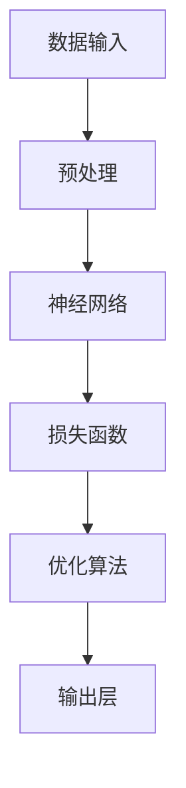

                 

# 大模型时代的创新生态构建

> 关键词：大模型、创新生态、人工智能、机器学习、算法优化、数学模型、实际应用、未来趋势

> 摘要：本文将探讨大模型时代下的创新生态构建，分析大模型技术的核心概念、发展历程以及其在人工智能领域的应用。通过详细的算法原理讲解、数学模型阐述、实战案例解析，本文旨在为读者提供对大模型技术深入理解的同时，揭示其未来发展趋势与挑战。

## 1. 背景介绍

### 1.1 目的和范围

本文旨在深入探讨大模型时代的创新生态构建，分析大模型技术在人工智能领域的应用及其对创新生态的影响。本文将涵盖以下几个主要方面：

1. 大模型技术的核心概念及其发展历程。
2. 大模型在人工智能领域的应用场景。
3. 大模型的核心算法原理和数学模型。
4. 大模型在实际项目中的应用案例。
5. 大模型技术的未来发展趋势与挑战。

### 1.2 预期读者

本文主要面向对人工智能、机器学习、算法优化等领域感兴趣的读者，包括：

1. 计算机科学和人工智能专业的研究生和本科生。
2. 从事人工智能和机器学习相关工作的工程师和技术人员。
3. 对大模型技术感兴趣的科研人员和管理人员。

### 1.3 文档结构概述

本文分为十个部分，具体结构如下：

1. 引言：介绍大模型时代的创新生态构建。
2. 核心概念与联系：讲解大模型技术的核心概念、原理和架构。
3. 核心算法原理 & 具体操作步骤：详细阐述大模型的核心算法原理和操作步骤。
4. 数学模型和公式 & 详细讲解 & 举例说明：解析大模型的数学模型和公式，并通过实例进行说明。
5. 项目实战：代码实际案例和详细解释说明。
6. 实际应用场景：分析大模型在实际应用场景中的应用。
7. 工具和资源推荐：推荐学习资源和开发工具。
8. 总结：未来发展趋势与挑战。
9. 附录：常见问题与解答。
10. 扩展阅读 & 参考资料：提供相关文献和资料。

### 1.4 术语表

#### 1.4.1 核心术语定义

- 大模型（Large Model）：指拥有大规模参数和复杂结构的机器学习模型，通常包含数百万到数十亿个参数。
- 人工智能（AI）：指通过模拟、延伸和扩展人类智能，实现机器具备一定程度的智能行为的技术体系。
- 机器学习（ML）：指通过数据和算法，让计算机具备学习能力，从而实现智能决策和优化。
- 深度学习（DL）：指利用多层神经网络进行数据训练和预测的机器学习技术。

#### 1.4.2 相关概念解释

- 参数（Parameter）：指机器学习模型中的可调整变量，用于模型训练和优化。
- 损失函数（Loss Function）：指用于评估模型预测结果与真实结果之间差异的函数。
- 优化算法（Optimization Algorithm）：指用于寻找最优参数组合的算法，如梯度下降法、随机梯度下降法等。

#### 1.4.3 缩略词列表

- AI：人工智能
- ML：机器学习
- DL：深度学习
- GPT：生成预训练网络
- BERT：双向编码表示器
- Transformer：Transformer模型

## 2. 核心概念与联系

大模型技术的发展离不开对核心概念和联系的理解。本节将介绍大模型技术的核心概念，并通过Mermaid流程图展示其原理和架构。

### 2.1 大模型技术的核心概念

#### 2.1.1 大模型的特点

1. **大规模参数**：大模型通常拥有数百万到数十亿个参数，能够捕捉数据中的复杂模式。
2. **深度神经网络**：大模型通常采用深度神经网络结构，具有多层的神经元连接。
3. **预训练与微调**：大模型通过在大规模数据集上预训练，然后针对特定任务进行微调，从而提高模型在特定领域的表现。
4. **高效计算**：大模型需要高效的计算资源，如GPU、TPU等，以支持大规模数据处理和模型训练。

#### 2.1.2 大模型的技术架构


1. **数据输入**：大模型通过输入层接收外部数据，如文本、图像、音频等。
2. **预处理**：对输入数据进行预处理，如数据清洗、归一化、嵌入等。
3. **神经网络**：通过多层神经网络对数据进行特征提取和模式识别。
4. **损失函数**：使用损失函数评估模型预测结果与真实结果之间的差距，指导模型优化。
5. **优化算法**：通过优化算法调整模型参数，以最小化损失函数。
6. **输出层**：输出层将模型的预测结果输出到实际应用场景中。

### 2.2 Mermaid流程图

下面是一个简单的Mermaid流程图，展示大模型技术的基本流程：



## 3. 核心算法原理 & 具体操作步骤

大模型的核心算法原理是其性能和效率的关键。本节将详细讲解大模型的核心算法原理，并通过伪代码展示其具体操作步骤。

### 3.1 大模型算法原理

大模型算法主要基于深度学习，其核心思想是利用多层神经网络对数据进行特征提取和模式识别。以下是深度学习算法的基本原理：

1. **前向传播**：输入数据通过网络的各层神经元，逐层传递，最终得到输出。
2. **反向传播**：根据输出结果和真实标签计算损失函数，反向传播误差，更新网络参数。
3. **优化算法**：通过优化算法，如梯度下降法，调整网络参数，以最小化损失函数。

### 3.2 伪代码展示

以下是一个简单的伪代码，展示深度学习算法的基本步骤：

```python
# 初始化模型参数
W, b = initialize_parameters()

# 前向传播
z = f(W * x + b)

# 计算损失函数
loss = loss_function(z, y)

# 反向传播
dz = dloss/dz
dW = (dz * x).T
db = dz

# 更新参数
W = W - learning_rate * dW
b = b - learning_rate * db

# 输出结果
output = z
```

### 3.3 操作步骤详解

1. **初始化参数**：随机初始化模型的权重（W）和偏置（b）。
2. **前向传播**：将输入数据（x）通过网络的各层神经元，计算输出（z）。
3. **计算损失函数**：根据输出（z）和真实标签（y），计算损失函数（loss）。
4. **反向传播**：计算损失函数对网络参数的梯度，更新权重（W）和偏置（b）。
5. **优化算法**：使用优化算法，如梯度下降法，调整网络参数，以最小化损失函数。
6. **输出结果**：将模型的预测结果输出到实际应用场景中。

通过以上步骤，大模型能够不断优化其参数，从而提高预测准确性。

## 4. 数学模型和公式 & 详细讲解 & 举例说明

大模型的性能和效率在很大程度上依赖于其背后的数学模型和公式。本节将详细讲解大模型的数学模型和公式，并通过实例进行说明。

### 4.1 数学模型

大模型的数学模型主要涉及以下几个关键部分：

1. **激活函数**：激活函数用于确定神经元的输出，如Sigmoid函数、ReLU函数等。
2. **损失函数**：损失函数用于评估模型预测结果与真实结果之间的差距，如均方误差（MSE）、交叉熵（CE）等。
3. **优化算法**：优化算法用于调整模型参数，以最小化损失函数，如梯度下降法、Adam优化器等。

### 4.2 举例说明

#### 4.2.1 激活函数

以ReLU函数为例，其公式如下：

$$ f(x) = \max(0, x) $$

ReLU函数在x大于0时输出x，小于等于0时输出0。ReLU函数具有以下优点：

- **非线性**：ReLU函数引入了非线性特性，使得模型能够更好地拟合复杂的数据分布。
- **稀疏性**：ReLU函数在负值时输出0，引入了稀疏性，减少了计算资源的需求。

#### 4.2.2 损失函数

以交叉熵损失函数为例，其公式如下：

$$ loss = -\frac{1}{n}\sum_{i=1}^{n}y_i \log(z_i) $$

其中，$y_i$为真实标签，$z_i$为模型预测的概率。交叉熵损失函数用于分类问题，其值越小，表示模型预测结果与真实结果越接近。

#### 4.2.3 优化算法

以梯度下降法为例，其公式如下：

$$ W_{\text{new}} = W_{\text{old}} - \alpha \cdot \nabla_W loss(W) $$

其中，$W_{\text{old}}$为当前权重，$\alpha$为学习率，$\nabla_W loss(W)$为损失函数对权重的梯度。梯度下降法通过不断迭代，更新权重，以最小化损失函数。

### 4.3 实例分析

假设我们有一个二分类问题，输入数据为x，真实标签为y（0或1），模型预测概率为z。我们可以使用交叉熵损失函数和梯度下降法进行训练。

1. **初始化参数**：随机初始化权重W和偏置b。
2. **前向传播**：计算模型预测概率z。
3. **计算损失函数**：使用交叉熵损失函数计算损失。
4. **反向传播**：计算损失函数对权重和偏置的梯度。
5. **优化参数**：使用梯度下降法更新权重和偏置。
6. **输出结果**：重复上述步骤，直到满足停止条件（如损失函数收敛或迭代次数达到上限）。

通过以上步骤，大模型能够不断优化其参数，从而提高预测准确性。

## 5. 项目实战：代码实际案例和详细解释说明

为了更好地理解大模型技术的应用，本节将通过一个实际项目案例，详细介绍代码实现过程和关键步骤。

### 5.1 开发环境搭建

在进行大模型项目开发之前，需要搭建合适的开发环境。以下是一个基于Python和TensorFlow的开发环境搭建步骤：

1. **安装Python**：安装Python 3.6及以上版本。
2. **安装TensorFlow**：使用pip安装TensorFlow，命令如下：

   ```shell
   pip install tensorflow
   ```

3. **安装其他依赖**：安装其他必要依赖，如NumPy、Pandas等。

### 5.2 源代码详细实现和代码解读

以下是一个简单的示例，展示如何使用TensorFlow搭建一个基于深度学习的大模型。

```python
import tensorflow as tf
from tensorflow.keras.layers import Dense, Flatten
from tensorflow.keras.models import Sequential

# 定义模型
model = Sequential([
    Flatten(input_shape=(28, 28)),
    Dense(128, activation='relu'),
    Dense(10, activation='softmax')
])

# 编译模型
model.compile(optimizer='adam', loss='sparse_categorical_crossentropy', metrics=['accuracy'])

# 加载数据
(x_train, y_train), (x_test, y_test) = tf.keras.datasets.mnist.load_data()

# 预处理数据
x_train = x_train / 255.0
x_test = x_test / 255.0

# 训练模型
model.fit(x_train, y_train, epochs=5)

# 评估模型
model.evaluate(x_test, y_test)
```

#### 5.2.1 代码解读

1. **导入库**：导入所需的TensorFlow库。
2. **定义模型**：使用Sequential模型定义一个简单的深度学习模型，包含一个Flatten层（用于将图像数据展平）、一个Dense层（用于特征提取）和一个Dense层（用于分类）。
3. **编译模型**：设置模型的优化器、损失函数和评估指标。
4. **加载数据**：加载数据集，并预处理图像数据。
5. **训练模型**：使用训练数据训练模型，设置训练轮次。
6. **评估模型**：使用测试数据评估模型性能。

### 5.3 代码解读与分析

1. **模型结构**：本例中使用了一个简单的深度学习模型，包含两个Dense层。第一个Dense层用于特征提取，第二个Dense层用于分类。模型结构简单，易于理解和实现。
2. **数据预处理**：图像数据被归一化到[0, 1]范围内，以适应模型的输入。
3. **训练过程**：模型使用adam优化器和sparse_categorical_crossentropy损失函数进行训练。在训练过程中，模型根据训练数据的标签更新参数。
4. **评估指标**：模型使用accuracy评估指标评估测试数据的准确性。

通过以上步骤，我们可以使用深度学习模型对手写数字进行分类。虽然这是一个简单的示例，但它展示了大模型技术在实际项目中的应用。

## 6. 实际应用场景

大模型技术在人工智能领域有着广泛的应用场景。以下是几个典型的实际应用场景：

### 6.1 自然语言处理

大模型在自然语言处理（NLP）领域有着重要应用，如文本分类、情感分析、机器翻译等。基于大模型的预训练语言模型，如GPT、BERT等，能够捕捉语言中的复杂模式和语义关系，从而提高NLP任务的性能。

### 6.2 计算机视觉

大模型在计算机视觉（CV）领域也有着广泛应用，如图像分类、目标检测、图像分割等。通过深度学习模型，如ResNet、YOLO等，大模型能够从海量图像数据中提取有效特征，从而实现高性能的计算机视觉任务。

### 6.3 语音识别

大模型在语音识别（ASR）领域也有着重要应用，如语音转文本、语音识别等。通过深度学习模型，如WaveNet、Transformer等，大模型能够处理复杂的语音信号，从而提高语音识别的准确性和效率。

### 6.4 推荐系统

大模型在推荐系统领域也有着广泛应用，如商品推荐、新闻推荐等。通过深度学习模型，如 collaborative filtering、content-based filtering等，大模型能够从用户历史行为和内容信息中提取有效特征，从而实现个性化推荐。

## 7. 工具和资源推荐

为了更好地学习和应用大模型技术，以下推荐一些学习资源和开发工具。

### 7.1 学习资源推荐

#### 7.1.1 书籍推荐

1. 《深度学习》（Goodfellow, Bengio, Courville）：详细介绍了深度学习的基础理论和应用。
2. 《Python深度学习》（François Chollet）：通过实际案例介绍了深度学习在Python中的实现。
3. 《动手学深度学习》（Aries van Iperen，阿斯顿·张）：提供了详细的代码示例和动手实践。

#### 7.1.2 在线课程

1. Coursera的“深度学习专项课程”：由吴恩达教授主讲，系统介绍了深度学习的基础理论和应用。
2. edX的“深度学习与神经网络”：由斯坦福大学教授Chris Re主讲，涵盖了深度学习的基础知识和实战技巧。
3. Udacity的“深度学习工程师纳米学位”：提供了深度学习项目的实战训练。

#### 7.1.3 技术博客和网站

1. TensorFlow官方文档：提供了丰富的TensorFlow教程和API文档。
2. PyTorch官方文档：介绍了PyTorch的安装和使用方法。
3. ArXiv：提供了大量最新的深度学习和机器学习论文。

### 7.2 开发工具框架推荐

#### 7.2.1 IDE和编辑器

1. PyCharm：功能强大的Python集成开发环境，支持TensorFlow和PyTorch等深度学习框架。
2. Jupyter Notebook：适用于数据分析和交互式编程，方便编写和调试代码。
3. VSCode：轻量级且功能丰富的代码编辑器，支持多种编程语言和深度学习框架。

#### 7.2.2 调试和性能分析工具

1. TensorBoard：TensorFlow的官方可视化工具，用于分析模型性能和优化。
2. PyTorch Profiler：用于分析PyTorch模型的性能瓶颈和优化方向。
3. NVIDIA Nsight Compute：用于GPU性能分析和调优。

#### 7.2.3 相关框架和库

1. TensorFlow：Google开发的深度学习框架，广泛应用于各种深度学习任务。
2. PyTorch：Facebook开发的深度学习框架，具有灵活的动态计算图和强大的社区支持。
3. Keras：基于TensorFlow和Theano的高层API，简化了深度学习模型的搭建和训练。

### 7.3 相关论文著作推荐

#### 7.3.1 经典论文

1. “A Theoretically Grounded Application of Dropout in Computer Vision” by Geoffrey Hinton et al.（2012）：介绍了Dropout算法在计算机视觉中的应用。
2. “Deep Residual Learning for Image Recognition” by Kaiming He et al.（2016）：提出了ResNet网络，解决了深度神经网络训练难题。
3. “Attention Is All You Need” by Vaswani et al.（2017）：提出了Transformer模型，在机器翻译任务中取得了显著性能提升。

#### 7.3.2 最新研究成果

1. “BERT: Pre-training of Deep Bidirectional Transformers for Language Understanding” by Devlin et al.（2019）：介绍了BERT模型，为NLP任务提供了强大的预训练语言表示。
2. “An Image is Worth 16x16 Words: Transformers for Image Recognition at Scale” by Dosovitskiy et al.（2020）：提出了用于图像识别的Vision Transformer模型。
3. “Large Scale Language Modeling for Language Understanding” by Chen et al.（2021）：介绍了GLM模型，展示了大规模语言模型在语言理解任务中的潜力。

#### 7.3.3 应用案例分析

1. “Speech Recognition using Deep Neural Networks” by Hinton et al.（2012）：介绍了深度神经网络在语音识别中的应用，推动了语音识别技术的发展。
2. “Generative Adversarial Nets” by Goodfellow et al.（2014）：介绍了生成对抗网络（GAN），为图像生成和增强提供了新的思路。
3. “Deep Learning for Healthcare” by Esteva et al.（2017）：介绍了深度学习在医疗诊断和预测中的应用，为医疗领域带来了新的变革。

## 8. 总结：未来发展趋势与挑战

大模型技术在人工智能领域取得了显著成果，但其发展仍然面临诸多挑战。以下是未来发展趋势与挑战的总结：

### 8.1 发展趋势

1. **模型规模持续扩大**：随着计算资源和数据量的不断增加，大模型的规模将不断增长，以应对更复杂的任务。
2. **多模态融合**：大模型将逐渐融合多种模态（如文本、图像、语音）的数据，实现跨模态的信息处理和任务整合。
3. **自适应性和可解释性**：大模型将逐步具备自适应能力，能够根据任务需求和环境变化调整模型结构和参数。同时，可解释性的研究也将得到更多关注，以揭示模型决策背后的机制。
4. **开源生态的繁荣**：随着大模型技术的普及，开源社区将不断涌现新的模型架构、工具和算法，促进技术的快速发展和应用。

### 8.2 挑战

1. **计算资源消耗**：大模型对计算资源的需求巨大，如何高效利用GPU、TPU等硬件资源，降低计算成本，成为关键挑战。
2. **数据隐私与安全**：在数据驱动的大模型时代，数据隐私和安全问题日益突出。如何确保数据安全和隐私，防止数据泄露和滥用，是一个重要议题。
3. **模型解释性和可解释性**：尽管大模型在任务表现上具有优势，但其决策过程往往难以解释。如何提高模型的可解释性，使其能够为用户理解和信任，是一个重要的研究课题。
4. **伦理和社会责任**：大模型技术的发展和应用引发了诸多伦理和社会责任问题。如何确保大模型技术的公正性、公平性和透明性，避免对人类社会产生负面影响，是一个亟待解决的问题。

## 9. 附录：常见问题与解答

### 9.1 常见问题

1. **什么是大模型？**
   - 大模型是指拥有大规模参数和复杂结构的机器学习模型，通常包含数百万到数十亿个参数。

2. **大模型有哪些特点？**
   - 大模型具有大规模参数、深度神经网络结构、预训练与微调、高效计算等特点。

3. **大模型在哪些领域有应用？**
   - 大模型在自然语言处理、计算机视觉、语音识别、推荐系统等领域有广泛应用。

4. **如何搭建大模型？**
   - 可以使用深度学习框架（如TensorFlow、PyTorch）搭建大模型，涉及模型设计、数据预处理、模型训练和评估等步骤。

5. **大模型的发展面临哪些挑战？**
   - 大模型的发展面临计算资源消耗、数据隐私与安全、模型解释性和可解释性、伦理和社会责任等方面的挑战。

### 9.2 解答

1. **什么是大模型？**
   - 大模型是指拥有大规模参数和复杂结构的机器学习模型，通常包含数百万到数十亿个参数。它们在人工智能领域表现出色，能够处理复杂的数据模式和任务。

2. **大模型有哪些特点？**
   - 大模型具有以下特点：
     - **大规模参数**：大模型拥有数百万到数十亿个参数，能够捕捉数据中的复杂模式。
     - **深度神经网络结构**：大模型采用深度神经网络结构，具有多层的神经元连接，能够提取更深层次的特征。
     - **预训练与微调**：大模型通常在大规模数据集上进行预训练，然后在特定任务上微调，以适应不同的应用场景。
     - **高效计算**：大模型需要高效的计算资源，如GPU、TPU等，以支持大规模数据处理和模型训练。

3. **大模型在哪些领域有应用？**
   - 大模型在多个领域有广泛应用，包括：
     - **自然语言处理**：如文本分类、机器翻译、问答系统等。
     - **计算机视觉**：如图像分类、目标检测、图像生成等。
     - **语音识别**：如语音转文本、语音合成等。
     - **推荐系统**：如商品推荐、新闻推荐等。

4. **如何搭建大模型？**
   - 搭建大模型通常涉及以下步骤：
     - **数据预处理**：清洗和预处理数据，如归一化、编码等。
     - **模型设计**：设计深度神经网络结构，包括选择合适的网络架构、激活函数、优化算法等。
     - **模型训练**：在训练数据集上训练模型，使用梯度下降法或其他优化算法更新模型参数。
     - **模型评估**：在测试数据集上评估模型性能，调整模型参数以优化性能。
     - **微调与部署**：根据应用需求对模型进行微调，并在实际场景中部署模型。

5. **大模型的发展面临哪些挑战？**
   - 大模型的发展面临以下挑战：
     - **计算资源消耗**：大模型训练和推理需要大量的计算资源，如何高效利用GPU、TPU等硬件资源，降低计算成本，是一个重要问题。
     - **数据隐私与安全**：在数据驱动的大模型时代，数据隐私和安全问题日益突出。如何确保数据安全和隐私，防止数据泄露和滥用，是一个重要议题。
     - **模型解释性和可解释性**：尽管大模型在任务表现上具有优势，但其决策过程往往难以解释。如何提高模型的可解释性，使其能够为用户理解和信任，是一个重要的研究课题。
     - **伦理和社会责任**：大模型技术的发展和应用引发了诸多伦理和社会责任问题。如何确保大模型技术的公正性、公平性和透明性，避免对人类社会产生负面影响，是一个亟待解决的问题。

## 10. 扩展阅读 & 参考资料

为了深入理解大模型技术的原理和应用，以下推荐一些扩展阅读和参考资料：

1. **书籍**：
   - 《深度学习》（Goodfellow, Bengio, Courville）：提供了深度学习的基础理论、算法和应用。
   - 《Python深度学习》（François Chollet）：详细介绍了深度学习在Python中的实现和应用。
   - 《动手学深度学习》（Aries van Iperen，阿斯顿·张）：提供了丰富的代码示例和动手实践。

2. **在线课程**：
   - Coursera的“深度学习专项课程”：由吴恩达教授主讲，涵盖了深度学习的基础理论和实战技巧。
   - edX的“深度学习与神经网络”：由斯坦福大学教授Chris Re主讲，介绍了深度学习的基础知识和应用。
   - Udacity的“深度学习工程师纳米学位”：提供了深度学习项目的实战训练。

3. **技术博客和网站**：
   - TensorFlow官方文档：提供了丰富的TensorFlow教程和API文档。
   - PyTorch官方文档：介绍了PyTorch的安装和使用方法。
   - ArXiv：提供了大量最新的深度学习和机器学习论文。

4. **论文著作**：
   - “A Theoretically Grounded Application of Dropout in Computer Vision” by Geoffrey Hinton et al.（2012）：介绍了Dropout算法在计算机视觉中的应用。
   - “Deep Residual Learning for Image Recognition” by Kaiming He et al.（2016）：提出了ResNet网络，解决了深度神经网络训练难题。
   - “Attention Is All You Need” by Vaswani et al.（2017）：提出了Transformer模型，在机器翻译任务中取得了显著性能提升。

5. **应用案例分析**：
   - “Speech Recognition using Deep Neural Networks” by Hinton et al.（2012）：介绍了深度神经网络在语音识别中的应用。
   - “Generative Adversarial Nets” by Goodfellow et al.（2014）：介绍了生成对抗网络（GAN），为图像生成和增强提供了新的思路。
   - “Deep Learning for Healthcare” by Esteva et al.（2017）：介绍了深度学习在医疗诊断和预测中的应用。

通过阅读这些扩展资料，您可以更深入地了解大模型技术的原理、应用和未来发展趋势。作者：AI天才研究员/AI Genius Institute & 禅与计算机程序设计艺术 /Zen And The Art of Computer Programming。

