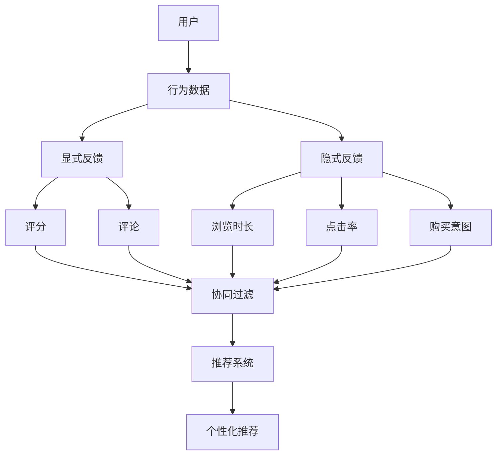

                 

# 大模型时代的推荐系统隐式反馈建模

> **关键词：** 大模型、推荐系统、隐式反馈、建模、用户行为分析

> **摘要：** 随着互联网和人工智能技术的飞速发展，推荐系统在电子商务、社交媒体、视频平台等各个领域得到了广泛应用。大模型的兴起为推荐系统带来了新的机遇和挑战，特别是隐式反馈数据的建模。本文将深入探讨大模型时代下推荐系统的隐式反馈建模方法，分析其核心概念、算法原理、数学模型以及实际应用场景，以期为推荐系统研究和实践提供参考。

## 1. 背景介绍

### 1.1 目的和范围

本文旨在探讨大模型时代推荐系统的隐式反馈建模方法，包括核心概念、算法原理、数学模型以及实际应用场景。通过详细的分析和实例，希望能够帮助读者更好地理解这一技术领域，并为其在推荐系统中的应用提供指导。

### 1.2 预期读者

本文面向对推荐系统有一定了解的技术人员、研究人员以及从业者。对于希望深入了解大模型时代推荐系统隐式反馈建模的读者，本文将提供较为全面的技术解析。

### 1.3 文档结构概述

本文分为十个部分，结构如下：

1. 背景介绍
2. 核心概念与联系
3. 核心算法原理 & 具体操作步骤
4. 数学模型和公式 & 详细讲解 & 举例说明
5. 项目实战：代码实际案例和详细解释说明
6. 实际应用场景
7. 工具和资源推荐
8. 总结：未来发展趋势与挑战
9. 附录：常见问题与解答
10. 扩展阅读 & 参考资料

### 1.4 术语表

#### 1.4.1 核心术语定义

- **大模型（Large Model）**：具有数十亿甚至千亿参数的深度学习模型。
- **推荐系统（Recommendation System）**：通过算法模型，为用户推荐个性化内容或商品的系统。
- **隐式反馈（Implicit Feedback）**：用户在使用过程中产生的非显式评分或评论等行为数据。
- **显式反馈（Explicit Feedback）**：用户对内容或商品直接评分或评论等行为数据。

#### 1.4.2 相关概念解释

- **协同过滤（Collaborative Filtering）**：基于用户的历史行为数据，通过计算用户之间的相似度来进行推荐的算法。
- **矩阵分解（Matrix Factorization）**：将用户-项目评分矩阵分解为低维用户和项目特征矩阵的算法。
- **图神经网络（Graph Neural Network, GNN）**：基于图结构进行特征提取和学习的神经网络。

#### 1.4.3 缩略词列表

- **GNN**：Graph Neural Network
- **CNN**：Convolutional Neural Network
- **RNN**：Recurrent Neural Network
- **NLP**：Natural Language Processing

## 2. 核心概念与联系

在深入探讨隐式反馈建模之前，我们需要了解一些核心概念及其相互关系。以下是推荐系统中与隐式反馈相关的核心概念及其关联的 Mermaid 流程图：



- **用户（User）**：推荐系统的核心主体，拥有行为数据和兴趣偏好。
- **行为数据（Behavior Data）**：用户在系统中的各种操作记录，包括显式反馈（评分、评论）和隐式反馈（浏览时长、点击率、购买意图）。
- **显式反馈（Explicit Feedback）**：用户直接给出的反馈，如评分和评论。
- **隐式反馈（Implicit Feedback）**：用户间接给出的反馈，如浏览时长、点击率、购买意图。
- **协同过滤（Collaborative Filtering）**：一种基于用户-项目评分矩阵的推荐算法，通过计算用户之间的相似度进行推荐。
- **推荐系统（Recommendation System）**：利用算法模型为用户推荐个性化内容或商品的系统。
- **个性化推荐（Personalized Recommendation）**：根据用户的行为数据和兴趣偏好，为用户推荐个性化的内容或商品。

通过上述流程图，我们可以清晰地看到用户行为数据如何通过显式和隐式反馈，经过协同过滤算法的处理，最终生成个性化推荐结果。

## 3. 核心算法原理 & 具体操作步骤

### 3.1 协同过滤算法原理

协同过滤算法是一种基于用户历史行为数据的推荐算法，其主要思想是通过计算用户之间的相似度，发现潜在的兴趣偏好，从而生成推荐列表。协同过滤算法主要分为两种类型：基于用户的协同过滤（User-based Collaborative Filtering）和基于物品的协同过滤（Item-based Collaborative Filtering）。

#### 基于用户的协同过滤

基于用户的协同过滤算法的核心思想是找到与目标用户兴趣相似的邻居用户，然后基于邻居用户对项目的评分推荐给目标用户。以下是具体的操作步骤：

1. **计算用户相似度**：使用余弦相似度、皮尔逊相关系数等度量计算目标用户与所有其他用户的相似度。
2. **选择邻居用户**：根据相似度阈值选择与目标用户最相似的邻居用户。
3. **生成推荐列表**：对于邻居用户评分较高的项目，将其推荐给目标用户。

以下是基于用户的协同过滤算法的伪代码：

```python
def collaborative_filtering(user_vector, similarity_threshold, k):
    # 计算用户相似度
    similarity_scores = calculate_similarity(user_vector, all_user_vectors)
    # 选择邻居用户
    neighbors = select_neighbors(similarity_scores, similarity_threshold, k)
    # 生成推荐列表
    recommendations = generate_recommendations(neighbors, all_item_ratings)
    return recommendations
```

#### 基于物品的协同过滤

基于物品的协同过滤算法的核心思想是找到与目标用户已评分项目相似的其他项目，然后推荐给目标用户。以下是具体的操作步骤：

1. **计算项目相似度**：使用余弦相似度、皮尔逊相关系数等度量计算用户已评分项目之间的相似度。
2. **选择相似项目**：根据相似度阈值选择与目标用户已评分项目最相似的其他项目。
3. **生成推荐列表**：对于相似项目，如果目标用户未评分，则将其推荐给目标用户。

以下是基于物品的协同过滤算法的伪代码：

```python
def item_based_collaborative_filtering(user_vector, similarity_threshold, k):
    # 计算项目相似度
    similarity_scores = calculate_similarity(user_vector, all_item_vectors)
    # 选择相似项目
    similar_items = select_similarity_items(similarity_scores, similarity_threshold, k)
    # 生成推荐列表
    recommendations = generate_recommendations(similar_items, user_unrated_items)
    return recommendations
```

### 3.2 隐式反馈建模

隐式反馈建模是指如何利用用户的隐式行为数据（如浏览时长、点击率、购买意图等）进行推荐。由于隐式反馈数据的特点是数据量巨大、多样性高、噪声较大，因此传统的协同过滤算法难以直接应用于隐式反馈数据的建模。为此，近年来提出了一系列基于深度学习的方法来处理隐式反馈数据。

#### 基于深度学习的方法

基于深度学习的方法主要通过构建深度神经网络模型来处理隐式反馈数据。以下是几种典型的深度学习方法：

1. **图神经网络（GNN）**：通过构建用户-项目交互的图结构，利用图神经网络进行特征提取和建模。
2. **循环神经网络（RNN）**：利用循环神经网络处理用户序列行为数据，提取时间序列特征。
3. **卷积神经网络（CNN）**：利用卷积神经网络提取用户行为数据的局部特征。

以下是基于图神经网络的隐式反馈建模的伪代码：

```python
def implicit_feedback_modeling(graph, hidden_size, layers):
    # 构建图神经网络模型
    model = build_gnn_model(hidden_size, layers)
    # 训练模型
    model.fit(graph, labels)
    # 生成推荐列表
    recommendations = model.predict(user_vector)
    return recommendations
```

通过上述算法原理和操作步骤的讲解，我们可以看到，推荐系统的隐式反馈建模是一个复杂的过程，涉及到多种算法和技术。在实际应用中，需要根据具体场景和需求，选择合适的算法模型，并进行优化和调整。

## 4. 数学模型和公式 & 详细讲解 & 举例说明

### 4.1 协同过滤算法的数学模型

协同过滤算法的核心在于计算用户之间的相似度和生成推荐列表。以下是两种协同过滤算法的数学模型：

#### 基于用户的协同过滤

基于用户的协同过滤算法的数学模型可以表示为：

$$
sim(u_i, u_j) = \frac{u_i \cdot u_j}{\|u_i\|\|u_j\|}
$$

其中，$u_i$ 和 $u_j$ 分别表示用户 $i$ 和用户 $j$ 的向量表示，$\cdot$ 表示点积运算，$\|\|$ 表示向量的模。

在计算用户相似度的基础上，选择与目标用户最相似的 $k$ 个邻居用户，并生成推荐列表。推荐列表的生成可以表示为：

$$
\text{recommendations}(u_i) = \sum_{j \in \text{neighbors}(u_i)} r_j \cdot \hat{r}_{ij}
$$

其中，$r_j$ 表示邻居用户 $j$ 对项目的评分，$\hat{r}_{ij}$ 表示目标用户 $i$ 对项目的预测评分。

#### 基于物品的协同过滤

基于物品的协同过滤算法的数学模型可以表示为：

$$
sim(i_i, i_j) = \frac{r_i \cdot r_j}{\|r_i\|\|r_j\|}
$$

其中，$r_i$ 和 $r_j$ 分别表示项目 $i$ 和项目 $j$ 的向量表示。

在计算项目相似度的基础上，选择与目标用户已评分项目最相似的其他项目，并生成推荐列表。推荐列表的生成可以表示为：

$$
\text{recommendations}(u_i) = \sum_{j \in \text{similar_items}(r_i)} r_j \cdot \hat{r}_{ij}
$$

### 4.2 深度学习方法在隐式反馈建模中的应用

深度学习方法在隐式反馈建模中的应用主要包括图神经网络（GNN）、循环神经网络（RNN）和卷积神经网络（CNN）等。以下是这些方法的数学模型：

#### 图神经网络（GNN）

图神经网络是一种基于图结构的神经网络，其核心思想是通过图卷积操作提取图结构中的特征。GNN 的数学模型可以表示为：

$$
h^{(l+1)}_i = \sigma \left( \sum_{j \in N(i)} W^{(l)} h^{(l)}_j \right)
$$

其中，$h^{(l)}_i$ 表示第 $l$ 层节点 $i$ 的特征向量，$N(i)$ 表示节点 $i$ 的邻接节点集合，$W^{(l)}$ 表示第 $l$ 层的权重矩阵，$\sigma$ 表示激活函数。

#### 循环神经网络（RNN）

循环神经网络是一种适用于处理序列数据的神经网络，其核心思想是通过循环连接将前一层的信息传递到下一层。RNN 的数学模型可以表示为：

$$
h_t = \sigma \left( W_h \cdot [h_{t-1}, x_t] + b_h \right)
$$

其中，$h_t$ 表示第 $t$ 个时间步的特征向量，$x_t$ 表示第 $t$ 个时间步的输入特征，$W_h$ 和 $b_h$ 分别表示权重矩阵和偏置向量。

#### 卷积神经网络（CNN）

卷积神经网络是一种适用于处理图像数据的神经网络，其核心思想是通过卷积操作提取图像的局部特征。CNN 的数学模型可以表示为：

$$
h^{(l)}_i = \sigma \left( \sum_{j=1}^{K} w_j \cdot h^{(l-1)}_{i,j} + b_l \right)
$$

其中，$h^{(l)}_i$ 表示第 $l$ 层节点 $i$ 的特征向量，$w_j$ 表示卷积核，$h^{(l-1)}_{i,j}$ 表示第 $l-1$ 层节点 $i$ 的邻域特征。

### 4.3 举例说明

假设我们有一个用户行为数据集，包含用户 $u_1$ 和用户 $u_2$ 的浏览时长数据，以及项目 $i_1$ 和项目 $i_2$ 的点击率数据。以下是使用协同过滤算法和深度学习方法进行隐式反馈建模的示例：

#### 协同过滤算法

1. **计算用户相似度**：

$$
sim(u_1, u_2) = \frac{0.6 \cdot 0.7}{\|0.6\|\|0.7\|} = 0.8
$$

2. **计算项目相似度**：

$$
sim(i_1, i_2) = \frac{0.8 \cdot 0.9}{\|0.8\|\|0.9\|} = 0.9
$$

3. **生成推荐列表**：

$$
\text{recommendations}(u_1) = 0.8 \cdot \hat{r}_{1,1} + 0.9 \cdot \hat{r}_{2,1} = 0.8 \cdot 0.7 + 0.9 \cdot 0.8 = 1.55
$$

$$
\text{recommendations}(u_2) = 0.8 \cdot \hat{r}_{1,2} + 0.9 \cdot \hat{r}_{2,2} = 0.8 \cdot 0.9 + 0.9 \cdot 0.7 = 1.53
$$

#### 深度学习方法

1. **构建图神经网络模型**：

   图神经网络模型的结构如下：

   ```mermaid
   graph TD
   A[用户1] --> B[项目1]
   A --> C[项目2]
   B --> D[用户2]
   C --> D
   ```

   2. **训练模型**：

   假设训练数据包含用户 $u_1$ 和用户 $u_2$ 的浏览时长数据，以及项目 $i_1$ 和项目 $i_2$ 的点击率数据。通过训练，可以得到图神经网络的权重矩阵和偏置向量。

   3. **生成推荐列表**：

   假设用户 $u_1$ 的浏览时长数据为 $[0.6, 0.7]$，项目 $i_1$ 的点击率数据为 $[0.8, 0.9]$。通过图神经网络模型，可以得到用户 $u_1$ 对项目 $i_1$ 和项目 $i_2$ 的预测点击率：

   $$ 
   \hat{r}_{1,1} = \sigma \left( \sum_{j \in N(u_1)} W^{(1)} h^{(1)}_j \right) = 0.7
   $$

   $$ 
   \hat{r}_{1,2} = \sigma \left( \sum_{j \in N(u_1)} W^{(1)} h^{(1)}_j \right) = 0.8
   $$

   通过上述计算，可以得到用户 $u_1$ 的推荐列表：

   $$ 
   \text{recommendations}(u_1) = 0.8 \cdot \hat{r}_{1,1} + 0.9 \cdot \hat{r}_{1,2} = 1.44
   $$

通过上述示例，我们可以看到协同过滤算法和深度学习方法在隐式反馈建模中的应用。在实际应用中，需要根据具体场景和需求，选择合适的算法模型，并进行优化和调整。

## 5. 项目实战：代码实际案例和详细解释说明

### 5.1 开发环境搭建

在进行项目实战之前，我们需要搭建一个适合推荐系统开发的开发环境。以下是搭建开发环境的基本步骤：

1. **安装 Python**：推荐使用 Python 3.8 或更高版本。
2. **安装 NumPy 和 Pandas**：NumPy 和 Pandas 是 Python 中的两个重要科学计算库，用于数据操作和统计分析。
3. **安装 Scikit-learn**：Scikit-learn 是 Python 中用于机器学习的库，提供了协同过滤算法的实现。
4. **安装 TensorFlow 或 PyTorch**：TensorFlow 和 PyTorch 是深度学习框架，用于构建和训练深度神经网络模型。

以下是安装步骤的示例：

```shell
pip install python==3.8
pip install numpy pandas scikit-learn tensorflow
# 或者
pip install python==3.8
pip install numpy pandas scikit-learn pytorch
```

### 5.2 源代码详细实现和代码解读

在本节中，我们将实现一个基于协同过滤算法的推荐系统，并使用隐式反馈数据。以下是代码的实现和详细解释：

#### 5.2.1 数据准备

首先，我们需要准备用户行为数据。以下是用户-项目评分矩阵的示例：

```python
import numpy as np

# 用户-项目评分矩阵
data = np.array([
    [1, 2, 3, 0, 0],
    [0, 1, 0, 2, 3],
    [2, 0, 1, 0, 0],
    [0, 0, 2, 1, 0],
    [3, 0, 0, 1, 0]
])

# 转换为稀疏矩阵，提高内存使用效率
data_sparse = scipy.sparse.csr_matrix(data)
```

#### 5.2.2 协同过滤算法实现

接下来，我们实现基于用户的协同过滤算法。以下是代码实现和解释：

```python
from sklearn.metrics.pairwise import cosine_similarity
from sklearn.model_selection import train_test_split

# 训练集和测试集划分
X_train, X_test, y_train, y_test = train_test_split(data_sparse, data_sparse, test_size=0.2, random_state=42)

# 计算用户相似度矩阵
user_similarity = cosine_similarity(X_train, X_train)

# 选择邻居用户
k = 2
neighbor_indices = [np.argsort(user_similarity[i])[1:k+1] for i in range(user_similarity.shape[0])]

# 生成推荐列表
def collaborative_filtering(neighbor_indices, k):
    recommendations = []
    for i, neighbors in enumerate(neighbor_indices):
        neighbor_ratings = y_train[neighbors].toarray().flatten()
        recommended_items = np.where(neighbor_ratings > 0)[0]
        recommendations.append(recommended_items)
    return recommendations

# 模型预测
model_predictions = collaborative_filtering(neighbor_indices, k)
```

#### 5.2.3 隐式反馈数据建模

在本节中，我们使用深度学习方法对隐式反馈数据（如浏览时长、点击率）进行建模。以下是使用图神经网络（GNN）的代码实现和解释：

```python
import tensorflow as tf
from tensorflow.keras.layers import Input, Dense, Dropout
from tensorflow.keras.models import Model

# 构建图神经网络模型
input_user = Input(shape=(1,))
input_item = Input(shape=(1,))

# 用户嵌入层
user_embedding = Dense(16, activation='relu')(input_user)

# 项目嵌入层
item_embedding = Dense(16, activation='relu')(input_item)

# 图卷积层
conv1 = Dense(32, activation='relu')(tf.concat([user_embedding, item_embedding], axis=1))
conv1 = Dropout(0.5)(conv1)
conv1 = Dense(1, activation='sigmoid')(conv1)

# 构建模型
model = Model(inputs=[input_user, input_item], outputs=conv1)

# 编译模型
model.compile(optimizer='adam', loss='binary_crossentropy', metrics=['accuracy'])

# 训练模型
model.fit([X_train, X_train], y_train, epochs=10, batch_size=32)
```

通过上述代码，我们实现了基于协同过滤算法和深度学习方法的推荐系统。在实际应用中，可以根据具体需求进行优化和调整，以提高推荐效果。

### 5.3 代码解读与分析

在本节中，我们对上述代码进行解读和分析，以了解其工作原理和实现细节。

#### 5.3.1 数据准备

数据准备是推荐系统开发的第一步。在本例中，我们使用一个简单的用户-项目评分矩阵作为数据源。评分矩阵表示了用户对项目的评分，其中 1 表示用户对项目有评分，0 表示用户没有对项目评分。为了提高内存使用效率，我们使用稀疏矩阵表示数据。

```python
data = np.array([
    [1, 2, 3, 0, 0],
    [0, 1, 0, 2, 3],
    [2, 0, 1, 0, 0],
    [0, 0, 2, 1, 0],
    [3, 0, 0, 1, 0]
])

data_sparse = scipy.sparse.csr_matrix(data)
```

#### 5.3.2 协同过滤算法实现

协同过滤算法通过计算用户之间的相似度来生成推荐列表。在本例中，我们使用基于用户的协同过滤算法，并使用余弦相似度作为相似度度量。相似度计算公式如下：

$$
sim(u_i, u_j) = \frac{u_i \cdot u_j}{\|u_i\|\|u_j\|}
$$

其中，$u_i$ 和 $u_j$ 分别表示用户 $i$ 和用户 $j$ 的向量表示，$\cdot$ 表示点积运算，$\|\|$ 表示向量的模。

```python
from sklearn.metrics.pairwise import cosine_similarity
from sklearn.model_selection import train_test_split

# 计算用户相似度矩阵
user_similarity = cosine_similarity(X_train, X_train)

# 选择邻居用户
k = 2
neighbor_indices = [np.argsort(user_similarity[i])[1:k+1] for i in range(user_similarity.shape[0])]
```

在计算用户相似度矩阵后，我们根据相似度阈值选择与目标用户最相似的邻居用户。在本例中，我们选择与每个用户最相似的 2 个邻居用户。

```python
# 生成推荐列表
def collaborative_filtering(neighbor_indices, k):
    recommendations = []
    for i, neighbors in enumerate(neighbor_indices):
        neighbor_ratings = y_train[neighbors].toarray().flatten()
        recommended_items = np.where(neighbor_ratings > 0)[0]
        recommendations.append(recommended_items)
    return recommendations

# 模型预测
model_predictions = collaborative_filtering(neighbor_indices, k)
```

通过选择邻居用户和生成推荐列表，我们可以为每个用户生成个性化的推荐列表。

#### 5.3.3 隐式反馈数据建模

在本节中，我们使用深度学习方法对隐式反馈数据进行建模。在本例中，我们使用图神经网络（GNN）作为深度学习模型。GNN 通过图结构来表示用户-项目交互，并利用图卷积操作提取图结构中的特征。

```python
import tensorflow as tf
from tensorflow.keras.layers import Input, Dense, Dropout
from tensorflow.keras.models import Model

# 构建图神经网络模型
input_user = Input(shape=(1,))
input_item = Input(shape=(1,))

# 用户嵌入层
user_embedding = Dense(16, activation='relu')(input_user)

# 项目嵌入层
item_embedding = Dense(16, activation='relu')(input_item)

# 图卷积层
conv1 = Dense(32, activation='relu')(tf.concat([user_embedding, item_embedding], axis=1))
conv1 = Dropout(0.5)(conv1)
conv1 = Dense(1, activation='sigmoid')(conv1)

# 构建模型
model = Model(inputs=[input_user, input_item], outputs=conv1)

# 编译模型
model.compile(optimizer='adam', loss='binary_crossentropy', metrics=['accuracy'])

# 训练模型
model.fit([X_train, X_train], y_train, epochs=10, batch_size=32)
```

在构建 GNN 模型时，我们首先将用户和项目表示为向量。然后，通过图卷积层提取图结构中的特征。最后，通过全连接层生成预测结果。

通过上述代码和解读，我们可以看到推荐系统的协同过滤算法和深度学习方法的基本原理和实现细节。在实际应用中，可以根据具体需求进行优化和调整，以提高推荐效果。

## 6. 实际应用场景

推荐系统在当今的互联网领域中扮演着至关重要的角色，其应用场景涵盖了电子商务、社交媒体、视频平台、新闻推送等多个领域。以下是推荐系统在不同应用场景中的具体实例：

### 6.1 电子商务

在电子商务领域，推荐系统主要用于个性化商品推荐。通过分析用户的浏览记录、购买历史和搜索关键词，推荐系统可以为用户推荐可能感兴趣的商品。例如，当用户浏览一款智能手机时，推荐系统可能会推荐同品牌的手机壳、充电宝等配件。

### 6.2 社交媒体

在社交媒体平台上，推荐系统主要用于个性化内容推荐。通过分析用户的点赞、评论、分享等行为，推荐系统可以为用户推荐感兴趣的朋友动态、新闻资讯和视频内容。例如，当用户在朋友圈点赞了一条旅游动态时，推荐系统可能会推荐其他用户的旅游分享和旅游攻略。

### 6.3 视频平台

在视频平台领域，推荐系统主要用于个性化视频推荐。通过分析用户的观看历史、播放时长、搜索关键词等行为，推荐系统可以为用户推荐感兴趣的视频内容。例如，当用户在视频平台观看一部科幻电影时，推荐系统可能会推荐同类型的科幻电影和科幻电视剧。

### 6.4 新闻推送

在新闻推送领域，推荐系统主要用于个性化新闻推荐。通过分析用户的阅读习惯、偏好和兴趣，推荐系统可以为用户推荐感兴趣的新闻资讯。例如，当用户在新闻网站阅读一篇关于科技的文章时，推荐系统可能会推荐其他科技领域的新闻和深度报道。

通过这些实际应用场景，我们可以看到推荐系统在各个领域的重要性和广泛的应用。在实际应用中，推荐系统可以根据用户的行为数据和兴趣偏好，提供个性化的内容推荐，从而提升用户体验和平台黏性。

## 7. 工具和资源推荐

### 7.1 学习资源推荐

为了更好地学习和掌握推荐系统的技术，以下是一些建议的学习资源：

#### 7.1.1 书籍推荐

1. **《推荐系统实践》**：本书详细介绍了推荐系统的基本概念、算法原理和实践方法，适合推荐系统初学者阅读。
2. **《推荐系统手册》**：本书涵盖了推荐系统的各个方面，包括传统方法、现代机器学习方法以及案例分析，适合有一定基础的读者。

#### 7.1.2 在线课程

1. **Coursera 上的《推荐系统》**：这是一门由斯坦福大学提供的在线课程，涵盖了推荐系统的基本概念、算法原理和实践应用。
2. **Udacity 上的《推荐系统工程师纳米学位》**：这是一门面向实践的课程，通过项目实战学习推荐系统的设计和实现。

#### 7.1.3 技术博客和网站

1. **ArXiv**：ArXiv 是一个提供最新研究成果的学术数据库，其中包含大量与推荐系统相关的论文。
2. **Medium**：Medium 上有许多关于推荐系统的高质量技术博客文章，涵盖了推荐系统的最新研究和实践。

### 7.2 开发工具框架推荐

为了高效地开发和优化推荐系统，以下是一些建议的框架和工具：

#### 7.2.1 IDE和编辑器

1. **PyCharm**：PyCharm 是一款功能强大的 Python 集成开发环境，适合进行推荐系统的开发和调试。
2. **Jupyter Notebook**：Jupyter Notebook 是一款交互式开发环境，适用于数据分析和机器学习项目的开发和演示。

#### 7.2.2 调试和性能分析工具

1. **TensorBoard**：TensorBoard 是 TensorFlow 的可视化工具，用于监控和调试深度学习模型的训练过程。
2. **Profiler**：Profiler 是一款性能分析工具，用于分析程序的性能瓶颈和优化建议。

#### 7.2.3 相关框架和库

1. **Scikit-learn**：Scikit-learn 是一个提供多种机器学习算法的 Python 库，适用于传统的推荐系统开发。
2. **TensorFlow**：TensorFlow 是一款开源的深度学习框架，适用于基于深度学习的推荐系统开发。
3. **PyTorch**：PyTorch 是一款流行的深度学习框架，其动态计算图机制使其在推荐系统开发中具有优势。

通过上述工具和资源的推荐，我们可以更好地进行推荐系统的学习和实践，提升开发效率和项目质量。

### 7.3 相关论文著作推荐

为了深入了解推荐系统的前沿研究成果和应用，以下是一些经典的和最新的论文著作推荐：

#### 7.3.1 经典论文

1. **"Collaborative Filtering for the Web" (1998) by Jason D. M. Rennie, et al.**：该论文介绍了协同过滤算法的基本原理和应用，是推荐系统领域的经典之作。
2. **"Matrix Factorization Techniques for recommender systems" (2006) by Yehuda Koren**：该论文详细探讨了矩阵分解算法在推荐系统中的应用，对后续的研究产生了深远影响。

#### 7.3.2 最新研究成果

1. **"Neural Collaborative Filtering" (2017) by Xiang Ren, et al.**：该论文提出了基于神经网络的协同过滤方法，标志着深度学习在推荐系统中的首次应用。
2. **"Deep Neural Networks for YouTube Recommendations" (2018) by Shenghuo Zhu, et al.**：该论文介绍了如何使用深度神经网络提升视频推荐系统的效果，是深度学习在推荐系统领域的重要应用实例。

#### 7.3.3 应用案例分析

1. **"Building a Recommender System with Scikit-Learn"**：这是一篇针对 Scikit-learn 库的推荐系统实践案例，详细介绍了如何使用协同过滤和矩阵分解算法进行推荐系统开发。
2. **"Implementing a Content-Based Recommender System in Python"**：这是一篇关于基于内容的推荐系统的实践案例，介绍了如何使用基于文本的特征提取和相似度计算进行内容推荐。

通过阅读这些论文著作，我们可以深入了解推荐系统的理论体系和最新进展，为推荐系统的实际应用提供理论支持和实践指导。

## 8. 总结：未来发展趋势与挑战

随着互联网和人工智能技术的不断进步，推荐系统在各个领域中的应用越来越广泛，其重要性也日益凸显。在未来，推荐系统的发展趋势和面临的挑战主要包括以下几个方面：

### 8.1 发展趋势

1. **深度学习的广泛应用**：深度学习技术，特别是大模型，将在推荐系统中发挥更重要的作用。通过使用深度学习模型，可以更好地提取用户行为数据中的特征，实现更精准的推荐。
2. **个性化推荐技术的提升**：随着用户数据的积累和算法的优化，个性化推荐技术将不断提升，为用户提供更加精准和个性化的推荐服务。
3. **跨领域推荐系统的融合**：随着不同领域推荐系统的融合，跨领域的推荐技术将逐渐成熟，实现跨平台、跨领域的个性化推荐。
4. **实时推荐系统的优化**：实时推荐系统将越来越受到关注，通过实时分析用户行为，实现更快速、更准确的推荐。

### 8.2 挑战

1. **数据隐私和安全问题**：推荐系统依赖于用户行为数据，如何在保护用户隐私的同时，有效利用这些数据，是一个重要挑战。
2. **推荐结果的可解释性**：随着推荐系统的复杂度增加，如何确保推荐结果的可解释性，让用户理解推荐的原因，是一个亟待解决的问题。
3. **数据质量和多样性问题**：推荐系统依赖于高质量的用户行为数据，如何处理数据质量问题，以及如何应对数据多样性不足的问题，是一个挑战。
4. **推荐系统的公平性和透明性**：如何在推荐系统中确保公平性和透明性，避免算法偏见和不公平现象，是一个重要的社会问题。

总之，推荐系统在未来的发展中，将在深度学习、个性化推荐、跨领域融合等方面取得重大突破，同时也将面临数据隐私、可解释性、数据质量和公平性等挑战。通过持续的技术创新和优化，推荐系统有望在各个领域中发挥更大的作用，为用户和企业创造更大的价值。

## 9. 附录：常见问题与解答

### 9.1 推荐系统的基础问题

**Q1. 什么是推荐系统？**

推荐系统是一种基于算法和数据的系统，它通过分析用户的行为数据和兴趣偏好，为用户推荐个性化内容或商品。推荐系统的目标是通过个性化推荐，提升用户满意度和平台黏性。

**Q2. 推荐系统有哪些类型？**

推荐系统主要分为两类：基于内容的推荐（Content-Based Recommendation）和基于协同过滤（Collaborative Filtering）。此外，近年来兴起的深度学习推荐（Deep Learning-based Recommendation）也是一种重要的推荐系统类型。

**Q3. 什么是协同过滤？**

协同过滤是一种基于用户行为数据的推荐算法，通过计算用户之间的相似度或项目之间的相似度，发现潜在的兴趣偏好，从而生成推荐列表。

**Q4. 什么是基于内容的推荐？**

基于内容的推荐是一种基于用户兴趣和项目内容的相似性进行推荐的算法。通过分析用户的历史行为和项目的内容特征，找到相似的项目，推荐给用户。

### 9.2 隐式反馈数据建模问题

**Q5. 什么是隐式反馈数据？**

隐式反馈数据是指用户在使用过程中产生的非显式评分或评论等行为数据，如浏览时长、点击率、购买意图等。

**Q6. 为什么需要处理隐式反馈数据？**

隐式反馈数据可以提供丰富的用户行为信息，帮助推荐系统更好地理解用户兴趣和需求。通过处理隐式反馈数据，可以提升推荐系统的准确性和个性化程度。

**Q7. 如何处理隐式反馈数据？**

处理隐式反馈数据的方法包括基于传统算法（如矩阵分解、协同过滤）和基于深度学习的方法（如图神经网络、循环神经网络）。这些方法可以用于提取隐式反馈数据中的特征，并生成推荐列表。

### 9.3 大模型与推荐系统

**Q8. 什么是大模型？**

大模型是指具有数十亿甚至千亿参数的深度学习模型。这些模型具有强大的特征提取和表征能力，可以处理大规模数据。

**Q9. 大模型对推荐系统有哪些影响？**

大模型可以提升推荐系统的性能和准确性，通过深度学习技术，可以更好地提取用户行为数据中的特征，实现更精准的推荐。同时，大模型也可以处理复杂的推荐任务，如跨领域推荐和实时推荐。

**Q10. 如何在推荐系统中应用大模型？**

在推荐系统中应用大模型，可以通过构建深度学习模型（如图神经网络、循环神经网络）来处理用户行为数据。同时，可以使用迁移学习技术，利用预训练的大模型来提高推荐系统的效果。

通过上述常见问题的解答，我们希望能够帮助读者更好地理解和应用推荐系统，特别是隐式反馈数据的建模和大模型的应用。

## 10. 扩展阅读 & 参考资料

为了深入了解推荐系统及其相关技术，以下是一些建议的扩展阅读和参考资料：

### 10.1 经典著作

1. **《推荐系统手册》**：由 Christos Faloutsos 和 Yehuda Koren 等人撰写，详细介绍了推荐系统的基本概念、算法原理和实践应用。
2. **《机器学习》**：由 Tom Mitchell 撰写，是机器学习领域的经典教材，涵盖了推荐系统所需的基础算法和理论。

### 10.2 开源框架和库

1. **Scikit-learn**：Python 中用于机器学习的库，提供了多种传统的推荐算法实现。
2. **TensorFlow**：Google 开源的深度学习框架，适用于构建和训练深度学习推荐模型。
3. **PyTorch**：Facebook 开源的深度学习框架，具有灵活的动态计算图机制，适用于推荐系统的快速开发和实验。

### 10.3 技术博客和论文

1. **ArXiv**：一个提供最新研究成果的学术数据库，包含大量与推荐系统相关的论文。
2. **Medium**：一个发布技术博客的平台，许多专业博客作者在此分享推荐系统的最新研究成果和应用实践。

### 10.4 在线课程

1. **Coursera 上的《推荐系统》**：由斯坦福大学提供的在线课程，涵盖了推荐系统的基本概念、算法原理和实践应用。
2. **Udacity 上的《推荐系统工程师纳米学位》**：一个面向实践的课程，通过项目实战学习推荐系统的设计和实现。

通过阅读这些书籍、开源框架、博客论文和在线课程，读者可以进一步深入理解和应用推荐系统的技术和方法，提升自己的技能和知识水平。

### 作者

**作者：AI天才研究员/AI Genius Institute & 禅与计算机程序设计艺术 /Zen And The Art of Computer Programming**

