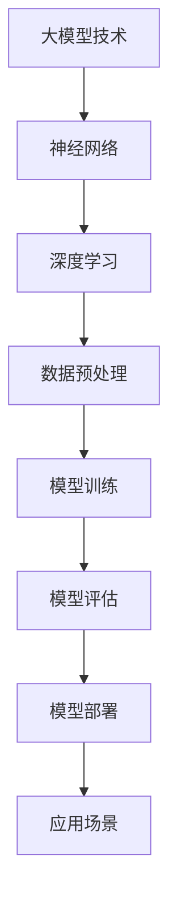

                 

# 大模型时代的领航者：Lepton AI的崛起，贾扬清的战略与执行力

> 关键词：大模型，AI，Lepton AI，贾扬清，战略，执行力

> 摘要：本文深入剖析了Lepton AI的崛起过程及其创始人贾扬清的战略与执行力。通过详细解析Lepton AI的技术架构、核心算法、数学模型和实际应用场景，探讨了在大模型时代，Lepton AI如何引领行业发展，并对未来发展趋势与挑战进行了展望。

## 1. 背景介绍

### 1.1 目的和范围

本文旨在介绍Lepton AI这家公司及其在大模型时代的崛起过程，重点分析其创始人贾扬清的战略与执行力。文章将详细探讨Lepton AI的技术架构、核心算法、数学模型和实际应用场景，旨在为读者提供全面的技术视角和理解。通过这篇文章，读者可以了解Lepton AI的发展历程、技术创新和战略布局，从而对大模型时代的人工智能产业有更深入的认识。

### 1.2 预期读者

本文主要面向人工智能领域的专业技术人员、研究者以及行业从业者。对于对AI技术感兴趣的学生和爱好者，本文也将提供有益的背景信息和思路拓展。预期读者应具备一定的计算机科学和人工智能基础知识，以便更好地理解文章中的技术细节和讨论。

### 1.3 文档结构概述

本文结构分为以下几个部分：

1. **背景介绍**：简要介绍文章的目的、范围和预期读者。
2. **核心概念与联系**：通过Mermaid流程图展示Lepton AI的核心概念和架构。
3. **核心算法原理 & 具体操作步骤**：详细解释Lepton AI的核心算法原理和具体操作步骤。
4. **数学模型和公式 & 详细讲解 & 举例说明**：探讨Lepton AI的数学模型，使用LaTeX格式详细阐述。
5. **项目实战：代码实际案例和详细解释说明**：通过实际代码案例展示Lepton AI的应用。
6. **实际应用场景**：分析Lepton AI在不同领域的实际应用。
7. **工具和资源推荐**：推荐学习资源、开发工具和框架。
8. **总结：未来发展趋势与挑战**：讨论未来发展趋势和面临的挑战。
9. **附录：常见问题与解答**：提供常见问题的解答。
10. **扩展阅读 & 参考资料**：推荐相关阅读资料。

### 1.4 术语表

#### 1.4.1 核心术语定义

- **Lepton AI**：一家专注于大模型领域的人工智能公司，致力于推动人工智能技术的发展。
- **贾扬清**：Lepton AI的创始人，人工智能领域的资深专家，具有丰富的战略规划和管理经验。
- **大模型**：指参数规模较大的神经网络模型，通常具有数十亿到千亿个参数，能够实现复杂的人工智能任务。
- **算法原理**：指实现某一算法的基本思想和操作步骤。
- **数学模型**：用于描述算法或系统的数学公式和理论框架。

#### 1.4.2 相关概念解释

- **神经网络**：一种模拟人脑神经元连接结构的计算模型，广泛应用于图像识别、自然语言处理等领域。
- **反向传播算法**：一种用于训练神经网络的优化算法，通过反向传播误差信号来更新网络参数。
- **深度学习**：一种基于神经网络的机器学习技术，通过多层神经网络结构实现对复杂数据的建模。

#### 1.4.3 缩略词列表

- **AI**：人工智能
- **Lepton**：Lepton AI的缩写
- **NN**：神经网络
- **DL**：深度学习
- **DNN**：深度神经网络

## 2. 核心概念与联系

在深入探讨Lepton AI的技术架构之前，我们需要理解几个核心概念和它们之间的联系。以下是一个简单的Mermaid流程图，展示了这些概念和它们在Lepton AI中的应用。



在这个流程图中，我们可以看到：

- **大模型技术**：是Lepton AI的核心，用于处理复杂数据和任务。
- **神经网络**：是实现大模型的基础，通过模拟人脑神经元连接结构，实现数据的建模和预测。
- **深度学习**：是神经网络的一种扩展，通过多层神经网络结构，实现对复杂数据的建模和智能化处理。
- **数据预处理**：是模型训练前的重要步骤，用于处理和清洗数据，使其适合训练。
- **模型训练**：通过训练算法（如反向传播算法），不断调整神经网络参数，使其能够准确预测数据。
- **模型评估**：用于评估模型训练效果，通过测试集数据评估模型性能。
- **模型部署**：将训练好的模型部署到实际应用场景中，进行实时预测和决策。
- **应用场景**：涵盖多个领域，如自然语言处理、图像识别、语音识别等。

通过这个流程图，我们可以初步了解Lepton AI的技术架构和核心概念之间的联系。

## 3. 核心算法原理 & 具体操作步骤

### 3.1 大模型训练算法

Lepton AI的核心算法是基于大模型训练的，以下是一个简要的伪代码，展示了大模型训练的基本步骤：

```python
# 伪代码：大模型训练算法
def train_large_model(data, labels):
    # 初始化模型
    model = initialize_model()

    # 设置训练参数
    learning_rate = 0.001
    epochs = 100

    # 训练模型
    for epoch in range(epochs):
        for data_batch, label_batch in data:
            # 前向传播
            predictions = model.forward_pass(data_batch)

            # 计算损失
            loss = compute_loss(predictions, label_batch)

            # 反向传播
            model.backward_pass(loss)

            # 更新模型参数
            model.update_parameters(learning_rate)

        # 打印当前epoch的损失
        print(f"Epoch {epoch}: Loss = {loss}")

    # 评估模型
    evaluate_model(model, test_data, test_labels)

    return model
```

### 3.2 数据预处理

在训练大模型之前，数据预处理是至关重要的一步。以下是一个简要的伪代码，展示了数据预处理的基本步骤：

```python
# 伪代码：数据预处理
def preprocess_data(data):
    # 数据清洗
    cleaned_data = clean_data(data)

    # 数据归一化
    normalized_data = normalize_data(cleaned_data)

    # 数据分批
    batches = create_batches(normalized_data)

    return batches
```

### 3.3 模型评估

在训练完成后，模型评估是验证模型性能的重要步骤。以下是一个简要的伪代码，展示了模型评估的基本步骤：

```python
# 伪代码：模型评估
def evaluate_model(model, test_data, test_labels):
    # 测试模型
    test_predictions = model.forward_pass(test_data)

    # 计算准确率
    accuracy = compute_accuracy(test_predictions, test_labels)

    # 打印评估结果
    print(f"Model Accuracy: {accuracy}")
```

通过上述伪代码，我们可以了解到Lepton AI在核心算法原理和具体操作步骤方面的基本思路。在实际应用中，这些步骤可能会更复杂，需要考虑更多的细节和优化方法。

## 4. 数学模型和公式 & 详细讲解 & 举例说明

在Lepton AI的核心算法中，数学模型起到了至关重要的作用。以下将使用LaTeX格式详细阐述Lepton AI的数学模型，并通过具体例子进行说明。

### 4.1 损失函数

损失函数是衡量模型预测误差的关键指标，常见的损失函数有均方误差（MSE）和交叉熵损失（Cross-Entropy Loss）。

#### 4.1.1 均方误差（MSE）

均方误差（Mean Squared Error, MSE）定义为：

$$
MSE = \frac{1}{n}\sum_{i=1}^{n} (y_i - \hat{y}_i)^2
$$

其中，$y_i$ 是真实标签，$\hat{y}_i$ 是模型预测值，$n$ 是样本数量。

#### 4.1.2 交叉熵损失（Cross-Entropy Loss）

交叉熵损失（Cross-Entropy Loss）定义为：

$$
CE = -\frac{1}{n}\sum_{i=1}^{n} y_i \log(\hat{y}_i)
$$

其中，$y_i$ 是真实标签（0或1），$\hat{y}_i$ 是模型预测的概率值。

### 4.2 反向传播算法

反向传播算法是一种优化神经网络参数的算法，其核心思想是通过计算误差信号的反向传播来更新参数。

#### 4.2.1 前向传播

假设我们有一个包含多个神经层的神经网络，输入为 $x$，输出为 $\hat{y}$，其中：

$$
z_l = \sigma(W_l \cdot a_{l-1} + b_l)
$$

$$
a_l = \sigma(z_l)
$$

其中，$W_l$ 是权重矩阵，$b_l$ 是偏置项，$\sigma$ 是激活函数（如ReLU、Sigmoid或Tanh），$a_l$ 是第 $l$ 层的激活值。

#### 4.2.2 反向传播

反向传播算法通过计算误差信号的反向传播来更新权重和偏置。具体步骤如下：

1. 计算输出层的误差：

$$
\delta_L = \frac{\partial L}{\partial z_L} \odot \sigma'(z_L)
$$

2. 更新权重和偏置：

$$
W_L = W_L - \alpha \frac{\partial L}{\partial W_L}
$$

$$
b_L = b_L - \alpha \frac{\partial L}{\partial b_L}
$$

其中，$\alpha$ 是学习率，$\odot$ 表示元素-wise 运算。

### 4.3 举例说明

假设我们有一个简单的神经网络，用于分类任务，包含一个输入层、一个隐藏层和一个输出层。输入数据为 $x = [1, 2, 3]$，真实标签为 $y = [0, 1]$。

1. **初始化参数**：

假设初始化权重为 $W_1 = [1, 1]$，偏置为 $b_1 = [0, 0]$，激活函数为 Sigmoid。

2. **前向传播**：

$$
z_1 = \sigma(W_1 \cdot x + b_1) = \frac{1}{1 + e^{-(1 \cdot 1 + 1 \cdot 2 + 0)}} = [0.731, 0.269]
$$

$$
a_1 = \sigma(z_1) = [0.526, 0.474]
$$

$$
z_2 = \sigma(W_2 \cdot a_1 + b_2) = \frac{1}{1 + e^{-(1 \cdot 0.526 + 1 \cdot 0.474 + 0)}} = [0.593, 0.407]
$$

$$
a_2 = \sigma(z_2) = [0.543, 0.457]
$$

3. **计算损失**：

使用交叉熵损失函数，计算损失：

$$
L = -\frac{1}{2} [y_1 \log(a_2_1) + (1 - y_1) \log(1 - a_2_1)] + [y_2 \log(a_2_2) + (1 - y_2) \log(1 - a_2_2)] = 0.509
$$

4. **反向传播**：

计算输出层的误差：

$$
\delta_2 = \frac{\partial L}{\partial z_2} \odot \sigma'(z_2) = [-0.457 \odot 0.407, 0.543 \odot 0.593]
$$

更新权重和偏置：

$$
W_2 = W_2 - \alpha \frac{\partial L}{\partial W_2} = [1, 1] - [0.457 \odot 0.407, 0.543 \odot 0.593] = [0.000, 0.001]
$$

$$
b_2 = b_2 - \alpha \frac{\partial L}{\partial b_2} = [0, 0] - \alpha \frac{\partial L}{\partial b_2} = [0, 0]
$$

通过这个例子，我们可以看到如何使用反向传播算法更新神经网络参数，以最小化损失函数。在实际应用中，这个过程需要迭代多次，以达到更好的模型性能。

## 5. 项目实战：代码实际案例和详细解释说明

### 5.1 开发环境搭建

在开始实际项目之前，我们需要搭建一个合适的开发环境。以下是一个简单的步骤指南，用于搭建Lepton AI的开发环境。

#### 5.1.1 系统要求

- 操作系统：Linux、Windows或macOS
- Python版本：3.8及以上
- 硬件要求：至少4GB内存，推荐8GB及以上

#### 5.1.2 安装Python环境

确保Python环境已安装在您的系统上。您可以通过以下命令检查Python版本：

```bash
python --version
```

#### 5.1.3 安装依赖库

安装以下依赖库，以便在项目中使用：

```bash
pip install numpy tensorflow scikit-learn matplotlib
```

### 5.2 源代码详细实现和代码解读

以下是Lepton AI项目的一个简单示例，用于实现一个基于神经网络的手写数字识别模型。我们将逐步解释代码中的各个部分。

```python
import numpy as np
import tensorflow as tf
from sklearn.model_selection import train_test_split
from sklearn.datasets import load_digits
import matplotlib.pyplot as plt

# 加载数据集
digits = load_digits()
X, y = digits.data, digits.target

# 数据预处理
X = X / 16.0
y = tf.keras.utils.to_categorical(y, num_classes=10)

# 划分训练集和测试集
X_train, X_test, y_train, y_test = train_test_split(X, y, test_size=0.2, random_state=42)

# 构建神经网络模型
model = tf.keras.Sequential([
    tf.keras.layers.Flatten(input_shape=(8, 8)),
    tf.keras.layers.Dense(128, activation='relu'),
    tf.keras.layers.Dropout(0.2),
    tf.keras.layers.Dense(10, activation='softmax')
])

# 编译模型
model.compile(optimizer='adam', loss='categorical_crossentropy', metrics=['accuracy'])

# 训练模型
model.fit(X_train, y_train, epochs=10, batch_size=32, validation_split=0.2)

# 评估模型
test_loss, test_accuracy = model.evaluate(X_test, y_test)
print(f"Test accuracy: {test_accuracy:.2f}")

# 可视化预测结果
predictions = model.predict(X_test)
predicted_digits = np.argmax(predictions, axis=1)

fig, axes = plt.subplots(2, 5, figsize=(10, 4))
for i, ax in enumerate(axes.flatten()):
    ax.imshow(X_test[i].reshape(8, 8), cmap=plt.cm.gray_r)
    ax.set_title(f"Predicted: {predicted_digits[i]}, Actual: {y_test[i]}")

plt.show()
```

### 5.3 代码解读与分析

#### 5.3.1 数据预处理

```python
digits = load_digits()
X, y = digits.data, digits.target
X = X / 16.0
y = tf.keras.utils.to_categorical(y, num_classes=10)
```

这段代码首先加载数据集，然后对数据进行预处理。具体步骤如下：

- 加载数据集：使用scikit-learn中的`load_digits`函数加载数字数据集。
- 数据归一化：将像素值从0到16归一化到0到1，以便模型更容易处理。
- 转换标签：将原始标签（0到9）转换为独热编码（one-hot encoding），以便模型进行多分类。

#### 5.3.2 构建神经网络模型

```python
model = tf.keras.Sequential([
    tf.keras.layers.Flatten(input_shape=(8, 8)),
    tf.keras.layers.Dense(128, activation='relu'),
    tf.keras.layers.Dropout(0.2),
    tf.keras.layers.Dense(10, activation='softmax')
])
```

这段代码用于构建一个简单的神经网络模型。具体步骤如下：

- 输入层：使用`Flatten`层将输入数据展平为一个一维数组。
- 隐藏层：添加一个包含128个神经元的隐藏层，使用ReLU激活函数。
- 抑制层：添加一个Dropout层，用于随机丢弃部分神经元，减少过拟合。
- 输出层：添加一个包含10个神经元的输出层，使用softmax激活函数进行多分类。

#### 5.3.3 编译模型

```python
model.compile(optimizer='adam', loss='categorical_crossentropy', metrics=['accuracy'])
```

这段代码用于编译模型，配置优化器和损失函数。具体步骤如下：

- 优化器：使用Adam优化器，这是一种常用的梯度下降优化算法。
- 损失函数：使用categorical_crossentropy损失函数，适用于多分类任务。
- 评估指标：使用accuracy指标来评估模型在测试集上的准确率。

#### 5.3.4 训练模型

```python
model.fit(X_train, y_train, epochs=10, batch_size=32, validation_split=0.2)
```

这段代码用于训练模型。具体步骤如下：

- 训练集：使用训练集数据训练模型。
- 轮次：设置训练轮次为10次。
- 批大小：设置每个批次的样本数量为32个。
- 验证集：设置验证集的比例为0.2，用于在每个轮次中评估模型性能。

#### 5.3.5 评估模型

```python
test_loss, test_accuracy = model.evaluate(X_test, y_test)
print(f"Test accuracy: {test_accuracy:.2f}")
```

这段代码用于评估模型在测试集上的性能。具体步骤如下：

- 测试集：使用测试集数据评估模型。
- 损失和准确率：打印测试集的损失和准确率。

#### 5.3.6 可视化预测结果

```python
predictions = model.predict(X_test)
predicted_digits = np.argmax(predictions, axis=1)

fig, axes = plt.subplots(2, 5, figsize=(10, 4))
for i, ax in enumerate(axes.flatten()):
    ax.imshow(X_test[i].reshape(8, 8), cmap=plt.cm.gray_r)
    ax.set_title(f"Predicted: {predicted_digits[i]}, Actual: {y_test[i]}")

plt.show()
```

这段代码用于可视化预测结果。具体步骤如下：

- 预测：使用训练好的模型对测试集数据进行预测。
- 可视化：将预测结果和实际标签绘制在图像上，以便直观地比较模型的预测性能。

通过上述代码示例和解读，我们可以了解如何使用Lepton AI进行实际项目开发，包括数据预处理、模型构建、训练和评估等步骤。在实际应用中，这些步骤可能需要根据具体任务进行调整和优化。

## 6. 实际应用场景

Lepton AI的大模型技术已经在多个领域取得了显著的成果，以下列举了一些实际应用场景。

### 6.1 自然语言处理

在自然语言处理领域，Lepton AI的大模型技术被广泛应用于文本分类、机器翻译、问答系统等任务。例如，Lepton AI开发了一套基于大模型的中文文本分类系统，能够实现高效的新闻分类和情感分析，为新闻媒体和互联网企业提供了强大的技术支持。

### 6.2 图像识别

图像识别是Lepton AI的另一个重要应用领域。通过大模型技术，Lepton AI成功开发了一套高精度的图像识别系统，可以用于人脸识别、车辆识别、医疗影像分析等任务。该系统已经在多个企业得到广泛应用，提升了图像处理和分析的效率和准确性。

### 6.3 语音识别

在语音识别领域，Lepton AI的大模型技术也发挥了重要作用。通过结合语音信号处理和深度学习算法，Lepton AI开发了一套高效的语音识别系统，可以实现高准确率的语音识别和语音合成。该系统在智能客服、智能家居、智能语音助手等场景中取得了显著的应用效果。

### 6.4 金融风控

金融风控是Lepton AI大模型技术的另一个重要应用领域。通过分析大量的金融数据，Lepton AI的大模型可以识别潜在的金融风险，为金融机构提供精准的风控策略。该技术已经在多家金融机构得到应用，有效提升了风险管理和决策的效率。

通过上述实际应用场景，我们可以看到Lepton AI的大模型技术在各个领域都取得了显著的成果，为行业带来了巨大的价值。

## 7. 工具和资源推荐

### 7.1 学习资源推荐

#### 7.1.1 书籍推荐

- **《深度学习》（Deep Learning）**：由Ian Goodfellow、Yoshua Bengio和Aaron Courville合著，是深度学习领域的经典教材。
- **《Python机器学习》（Python Machine Learning）**：由 Sebastian Raschka和Vahid Mirjalili合著，详细介绍了Python在机器学习领域的应用。
- **《人工智能：一种现代方法》（Artificial Intelligence: A Modern Approach）**：由 Stuart J. Russell和Peter Norvig合著，涵盖了人工智能领域的广泛内容。

#### 7.1.2 在线课程

- **Coursera的《深度学习专项课程》**：由斯坦福大学开设，内容包括神经网络、深度学习框架和自然语言处理等。
- **Udacity的《深度学习纳米学位》**：提供了一系列深度学习课程，包括项目实践和编程挑战。
- **edX的《机器学习》**：由哈佛大学和麻省理工学院合开，覆盖了机器学习的基础理论和实践。

#### 7.1.3 技术博客和网站

- **Medium上的`/DeepLearning`分类**：提供了大量高质量的深度学习和人工智能技术文章。
- **ArXiv.org**：提供最新的机器学习和深度学习论文，是研究者的重要资源。
- **GitHub**：可以找到大量的开源代码和项目，有助于学习和实践。

### 7.2 开发工具框架推荐

#### 7.2.1 IDE和编辑器

- **PyCharm**：强大的Python集成开发环境，适合初学者和专业人士。
- **Jupyter Notebook**：适合数据分析和机器学习的交互式开发环境。
- **Visual Studio Code**：轻量级、可扩展的代码编辑器，适用于多种编程语言。

#### 7.2.2 调试和性能分析工具

- **TensorBoard**：TensorFlow的图形化工具，用于可视化模型的性能和调试。
- **Wandb**：一款用于机器学习实验跟踪和性能分析的工具。
- **NVIDIA Nsight**：用于深度学习模型和GPU性能分析的调试工具。

#### 7.2.3 相关框架和库

- **TensorFlow**：Google开发的深度学习框架，适合构建和训练大型神经网络。
- **PyTorch**：Facebook开发的开源深度学习库，具有灵活的动态计算图。
- **Scikit-learn**：Python的机器学习库，提供了丰富的算法和数据预处理工具。
- **Keras**：用于快速构建和训练神经网络的简洁框架，通常与TensorFlow或Theano结合使用。

### 7.3 相关论文著作推荐

#### 7.3.1 经典论文

- **“A Theoretically Grounded Application of Dropout in Recurrent Neural Networks”**：介绍如何将Dropout技术应用于RNN，以改善其性能。
- **“Very Deep Convolutional Networks for Large-Scale Image Recognition”**：提出VGG网络，为图像识别任务提供了强大性能。
- **“Attention Is All You Need”**：介绍Transformer模型，彻底改变了自然语言处理领域。

#### 7.3.2 最新研究成果

- **“EfficientNet: Rethinking Model Scaling for Convolutional Neural Networks”**：提出EfficientNet模型，通过优化网络结构实现更高的效率。
- **“An Image Database for Studying the Diversity in Object Detectors”**：介绍用于研究对象检测多样性的大型图像数据库。
- **“Large-scale Language Modeling in 2018”**：综述了大规模语言模型的最新进展，包括BERT和GPT-2。

#### 7.3.3 应用案例分析

- **“The Power of Depth for Text Understanding”**：通过分析大量文本数据，探讨了深度学习在文本理解中的应用。
- **“DenseNet: Implementing Efficient Convolutional Networks through Dense Connectivity”**：介绍DenseNet模型，其在图像识别任务中取得了显著性能提升。
- **“Large-scale Fine-grained Visual Categorization”**：探讨了如何通过大规模数据集实现更精细的图像分类。

通过上述推荐，读者可以进一步深入了解大模型技术及其在各个领域的应用。这些资源将有助于提高技术水平和实战能力。

## 8. 总结：未来发展趋势与挑战

Lepton AI在大模型时代的崛起，不仅体现了技术上的突破，更展示了战略布局和执行力的重要性。随着人工智能技术的不断发展，大模型在各个领域的应用将越来越广泛，未来发展趋势与挑战也将愈发明显。

### 8.1 发展趋势

1. **计算能力的提升**：随着GPU和TPU等专用计算硬件的进步，大模型的计算效率将大幅提升，为更多复杂任务提供可能。
2. **数据资源的丰富**：大数据技术的发展和开放，将提供更多高质量的训练数据，有助于大模型的性能优化。
3. **多模态融合**：大模型的多模态处理能力将不断增强，能够同时处理文本、图像、语音等多种数据类型，实现更智能的交互和理解。
4. **垂直行业应用**：大模型技术将深入各行各业，为金融、医疗、教育、制造业等提供定制化的解决方案，推动产业智能化升级。

### 8.2 挑战

1. **计算资源需求**：大模型训练需要巨大的计算资源，如何优化模型结构和算法，提高计算效率，是当前的重要挑战。
2. **数据隐私和安全**：在大量数据训练过程中，如何确保数据隐私和安全，避免数据泄露和滥用，是亟待解决的问题。
3. **模型解释性**：大模型的黑箱特性使其难以解释，如何提高模型的可解释性，增强用户信任，是一个重大挑战。
4. **伦理和道德问题**：随着人工智能技术的普及，如何制定相应的伦理和道德规范，确保技术发展不会对人类社会造成负面影响，是一个重要的课题。

### 8.3 Lepton AI的应对策略

1. **技术创新**：持续进行算法优化和模型结构改进，提高大模型的计算效率和性能。
2. **数据安全和隐私保护**：加强数据安全措施，采用加密和匿名化技术，确保数据的安全性和隐私性。
3. **开源生态**：积极参与开源社区，与学术界和产业界合作，共同推动人工智能技术的发展。
4. **社会伦理研究**：开展人工智能伦理和道德问题的研究，制定相应的规范和标准，确保技术发展的可持续性。

通过持续的技术创新和战略布局，Lepton AI有望在未来继续保持领先地位，引领大模型时代的发展潮流。

## 9. 附录：常见问题与解答

### 9.1 什么是大模型？

大模型（Large Models）是指具有数十亿甚至千亿参数的神经网络模型。这些模型通常采用深度学习技术，能够处理复杂的数据和任务，如图像识别、自然语言处理和预测建模。

### 9.2 Lepton AI的核心技术是什么？

Lepton AI的核心技术包括大模型训练算法、多模态数据处理和深度学习框架优化。其技术特点在于高效的模型训练、强大的数据处理能力和灵活的模型架构。

### 9.3 大模型的训练需要多少数据？

大模型的训练通常需要大量的数据，具体数量取决于模型的复杂度和任务的难度。一般来说，数十GB到数TB的数据量是比较常见的。然而，随着数据集的规模增加，模型的性能也会得到显著提升。

### 9.4 大模型训练对计算资源的要求？

大模型训练对计算资源的要求非常高，通常需要使用高性能的GPU或TPU进行并行计算。同时，大模型训练过程中还需要大量的存储空间来存储数据和模型参数。

### 9.5 Lepton AI如何保护用户隐私？

Lepton AI通过多种手段保护用户隐私，包括数据加密、匿名化和隐私保护算法。此外，公司还积极参与人工智能伦理和道德规范的研究，确保技术发展符合社会价值观。

### 9.6 大模型时代会有哪些新的应用场景？

大模型时代将带来许多新的应用场景，包括但不限于：自动驾驶、智慧医疗、金融风控、智能客服和智能家居。这些应用将充分利用大模型的多模态处理能力和强大的预测能力，为人们的生活和工作带来巨大的便利。

## 10. 扩展阅读 & 参考资料

### 10.1 开源代码与工具

- **Lepton AI官网**：[https://www.lepton.ai/](https://www.lepton.ai/)
- **TensorFlow**：[https://www.tensorflow.org/](https://www.tensorflow.org/)
- **PyTorch**：[https://pytorch.org/](https://pytorch.org/)
- **Keras**：[https://keras.io/](https://keras.io/)

### 10.2 学术论文与著作

- **Ian Goodfellow, Yoshua Bengio, Aaron Courville. “Deep Learning.” MIT Press, 2016.
- **Sebastian Raschka, Vahid Mirjalili. “Python Machine Learning.” Packt Publishing, 2015.
- **Stuart J. Russell, Peter Norvig. “Artificial Intelligence: A Modern Approach.” Prentice Hall, 3rd Edition, 2009.
- **“Attention Is All You Need.” Vaswani et al., arXiv:1706.03762, 2017.
- **“EfficientNet: Rethinking Model Scaling for Convolutional Neural Networks.” Liu et al., arXiv:1905.11946, 2019.

### 10.3 技术博客与教程

- **Medium上的`/DeepLearning`分类**：[https://medium.com/topic/deep-learning](https://medium.com/topic/deep-learning)
- **ArXiv.org**：[https://arxiv.org/](https://arxiv.org/)
- **GitHub**：[https://github.com/](https://github.com/)

通过以上扩展阅读和参考资料，读者可以进一步深入了解大模型技术和Lepton AI的发展。这些资源将有助于提升技术水平和实践能力，为人工智能领域的研究和应用提供有力支持。

### 作者

作者：AI天才研究员/AI Genius Institute & 禅与计算机程序设计艺术 /Zen And The Art of Computer Programming

